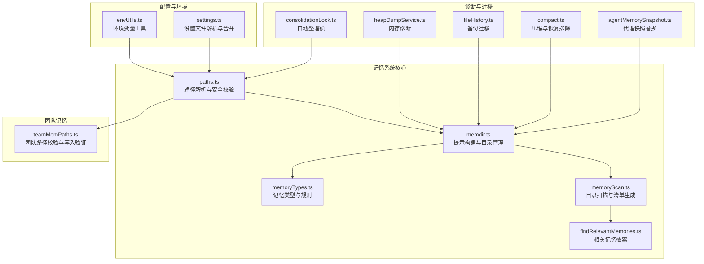
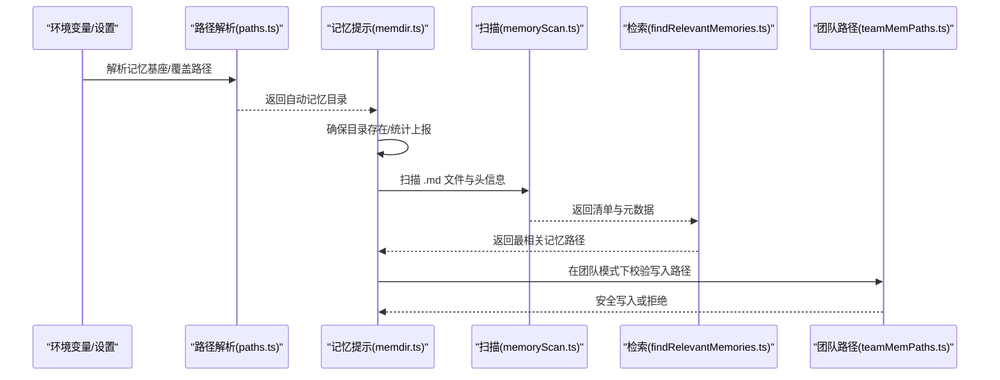
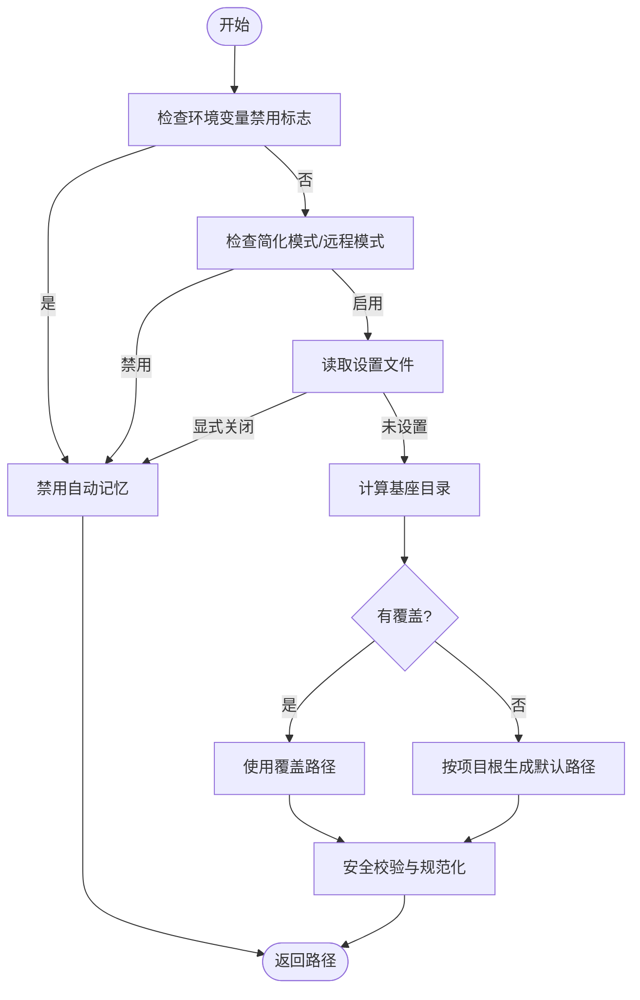
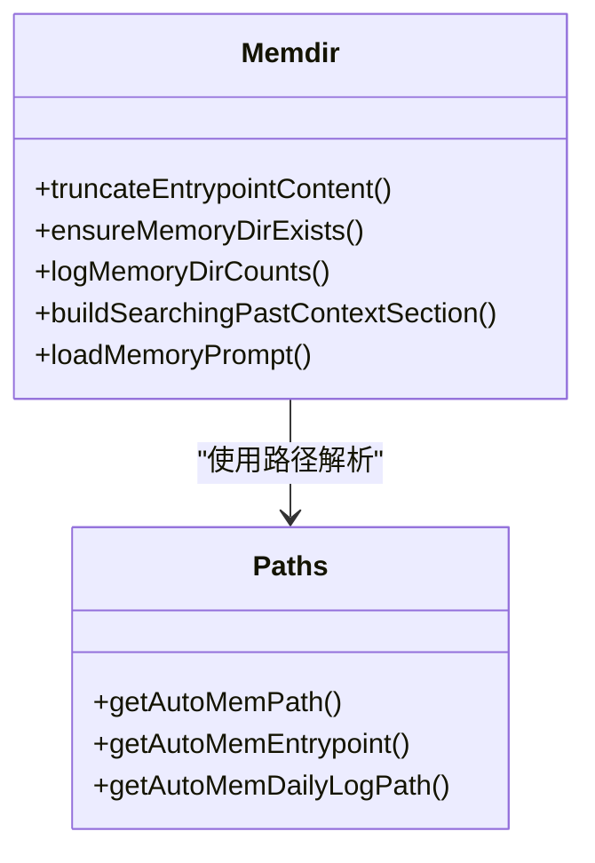
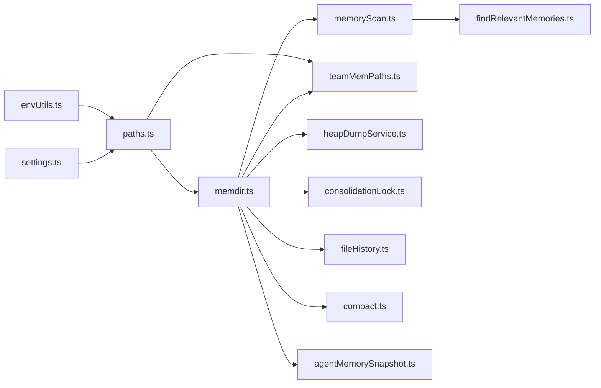
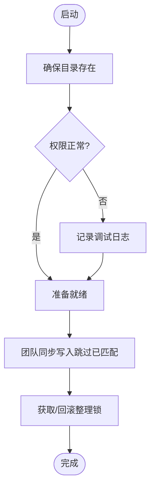

# 记忆系统配置

<cite>
**本文档引用的文件**
- [paths.ts](file://src/memdir/paths.ts)
- [memdir.ts](file://src/memdir/memdir.ts)
- [memoryTypes.ts](file://src/memdir/memoryTypes.ts)
- [memoryScan.ts](file://src/memdir/memoryScan.ts)
- [findRelevantMemories.ts](file://src/memdir/findRelevantMemories.ts)
- [teamMemPaths.ts](file://src/memdir/teamMemPaths.ts)
- [envUtils.ts](file://src/utils/envUtils.ts)
- [settings.ts](file://src/utils/settings/settings.ts)
- [consolidationLock.ts](file://src/services/autoDream/consolidationLock.ts)
- [heapDumpService.ts](file://src/utils/heapDumpService.ts)
- [fileHistory.ts](file://src/utils/fileHistory.ts)
- [compact.ts](file://src/services/compact/compact.ts)
- [agentMemorySnapshot.ts](file://src/tools/AgentTool/agentMemorySnapshot.ts)
- [remember.ts](file://src/skills/bundled/remember.ts)
</cite>

## 目录
1. [简介](#简介)
2. [项目结构](#项目结构)
3. [核心组件](#核心组件)
4. [架构总览](#架构总览)
5. [详细组件分析](#详细组件分析)
6. [依赖关系分析](#依赖关系分析)
7. [性能考虑](#性能考虑)
8. [故障排除指南](#故障排除指南)
9. [结论](#结论)
10. [附录](#附录)

## 简介
本文件面向 Claude Code Best 的记忆系统配置，系统性阐述自动记忆与团队记忆的配置选项、环境变量影响、启动流程、监控诊断、迁移备份策略以及故障排除与性能优化建议。重点覆盖以下方面：
- 存储路径解析与安全校验（含覆盖与回退机制）
- 功能开关与行为参数（启用条件、索引容量限制、搜索提示）
- 环境变量与设置文件的优先级与生效范围
- 启动阶段的目录初始化、权限检查与状态恢复
- 统计信息、日志记录与健康检查
- 数据导出、版本升级与灾难恢复
- 常见问题定位与修复方法

## 项目结构
记忆系统相关代码主要位于 `src/memdir` 目录，配合工具与服务模块实现路径解析、内容构建、扫描检索、团队同步与诊断等能力。

**图表来源**
- [paths.ts:1-279](file://src/memdir/paths.ts#L1-L279)
- [memdir.ts:1-508](file://src/memdir/memdir.ts#L1-L508)
- [memoryTypes.ts:1-272](file://src/memdir/memoryTypes.ts#L1-L272)
- [memoryScan.ts:1-95](file://src/memdir/memoryScan.ts#L1-L95)
- [findRelevantMemories.ts:1-142](file://src/memdir/findRelevantMemories.ts#L1-L142)
- [teamMemPaths.ts:1-293](file://src/memdir/teamMemPaths.ts#L1-L293)
- [envUtils.ts:1-184](file://src/utils/envUtils.ts#L1-L184)
- [settings.ts:1-800](file://src/utils/settings/settings.ts#L1-L800)
- [consolidationLock.ts:38-108](file://src/services/autoDream/consolidationLock.ts#L38-L108)
- [heapDumpService.ts:32-127](file://src/utils/heapDumpService.ts#L32-L127)
- [fileHistory.ts:970-1010](file://src/utils/fileHistory.ts#L970-L1010)
- [compact.ts:1677-1708](file://src/services/compact/compact.ts#L1677-L1708)
- [agentMemorySnapshot.ts:161-197](file://src/tools/AgentTool/agentMemorySnapshot.ts#L161-L197)

**章节来源**
- [paths.ts:1-279](file://src/memdir/paths.ts#L1-L279)
- [memdir.ts:1-508](file://src/memdir/memdir.ts#L1-L508)
- [teamMemPaths.ts:1-293](file://src/memdir/teamMemPaths.ts#L1-L293)

## 核心组件
- 路径解析与安全校验：负责自动记忆目录的解析、覆盖与安全校验，确保路径绝对化、无危险片段，并支持 Cowork/SDK 的空间级重定向。
- 提示构建与目录管理：生成记忆系统提示文本、索引截断策略、目录存在性保证与统计上报。
- 记忆类型与规则：定义四类记忆类型、保存边界与使用注意事项，指导模型正确组织与使用记忆。
- 目录扫描与清单生成：扫描 .md 文件、提取头信息、排序与格式化清单，供检索与抽取使用。
- 相关记忆检索：基于清单与模型选择最相关记忆，避免噪声并提升上下文质量。
- 团队记忆路径校验：在团队记忆子目录中进行更严格的路径注入与符号链接逃逸防护。
- 环境变量与设置文件：统一处理环境变量开关、CLI 简化模式、远程模式与设置文件合并优先级。
- 诊断与迁移：自动整理锁、内存诊断、备份迁移、压缩排除与代理快照替换。

**章节来源**
- [paths.ts:21-55](file://src/memdir/paths.ts#L21-L55)
- [memdir.ts:105-185](file://src/memdir/memdir.ts#L105-L185)
- [memoryTypes.ts:14-31](file://src/memdir/memoryTypes.ts#L14-L31)
- [memoryScan.ts:35-77](file://src/memdir/memoryScan.ts#L35-L77)
- [findRelevantMemories.ts:39-75](file://src/memdir/findRelevantMemories.ts#L39-L75)
- [teamMemPaths.ts:66-94](file://src/memdir/teamMemPaths.ts#L66-L94)
- [envUtils.ts:32-65](file://src/utils/envUtils.ts#L32-L65)
- [settings.ts:645-800](file://src/utils/settings/settings.ts#L645-L800)

## 架构总览
记忆系统围绕“路径解析 → 目录管理 → 内容构建 → 检索与抽取 → 团队同步”的主干流程展开；同时通过环境变量与设置文件实现灵活的开关控制与行为参数调整。

**图表来源**
- [paths.ts:85-235](file://src/memdir/paths.ts#L85-L235)
- [memdir.ts:129-147](file://src/memdir/memdir.ts#L129-L147)
- [memoryScan.ts:35-77](file://src/memdir/memoryScan.ts#L35-L77)
- [findRelevantMemories.ts:39-75](file://src/memdir/findRelevantMemories.ts#L39-L75)
- [teamMemPaths.ts:228-256](file://src/memdir/teamMemPaths.ts#L228-L256)

## 详细组件分析

### 路径解析与安全校验（paths.ts）
- 自动记忆启用条件：支持环境变量禁用、CLI 简化模式、远程模式且无持久化存储、设置文件显式关闭等多层优先级。
- 覆盖与回退：支持 Cowork 空间级覆盖与设置文件中的用户友好路径扩展；最终回退到按项目根生成的默认目录。
- 安全校验：拒绝相对路径、近根路径、UNC/网络路径、空字节等危险输入，确保规范化与 NFC 归一化。
- 入口点与日志：提供入口文件路径与每日日志路径，支撑助手模式下的追加式日志与夜间整理。

**图表来源**
- [paths.ts:21-55](file://src/memdir/paths.ts#L21-L55)
- [paths.ts:109-150](file://src/memdir/paths.ts#L109-L150)
- [paths.ts:223-235](file://src/memdir/paths.ts#L223-L235)

**章节来源**
- [paths.ts:21-55](file://src/memdir/paths.ts#L21-L55)
- [paths.ts:85-235](file://src/memdir/paths.ts#L85-L235)

### 提示构建与目录管理（memdir.ts）
- 索引截断策略：对入口文件进行行数与字节数双重限制，超限时保留自然边界并附加警告，避免过长索引影响上下文。
- 目录存在性保证：幂等创建目录，捕获权限错误并在调试日志中记录，确保模型可直接写入。
- 统计上报：异步统计文件/子目录数量并上报事件，便于观测与分析。
- 搜索提示：根据特性开关与嵌入工具可用性动态生成 grep 指令，降低检索成本。
- 多模式提示：支持自动记忆、团队记忆组合与助手模式日志模式，分别注入不同行为指引。

**图表来源**
- [memdir.ts:57-103](file://src/memdir/memdir.ts#L57-L103)
- [memdir.ts:129-147](file://src/memdir/memdir.ts#L129-L147)
- [memdir.ts:153-185](file://src/memdir/memdir.ts#L153-L185)
- [memdir.ts:375-407](file://src/memdir/memdir.ts#L375-L407)
- [memdir.ts:419-507](file://src/memdir/memdir.ts#L419-L507)
- [paths.ts:246-259](file://src/memdir/paths.ts#L246-L259)

**章节来源**
- [memdir.ts:57-103](file://src/memdir/memdir.ts#L57-L103)
- [memdir.ts:129-147](file://src/memdir/memdir.ts#L129-L147)
- [memdir.ts:153-185](file://src/memdir/memdir.ts#L153-L185)
- [memdir.ts:375-407](file://src/memdir/memdir.ts#L375-L407)
- [memdir.ts:419-507](file://src/memdir/memdir.ts#L419-L507)

### 记忆类型与规则（memoryTypes.ts）
- 类型体系：用户、反馈、项目、参考四类，明确适用范围与保存边界，避免派生信息与临时状态进入记忆。
- 使用注意事项：强调与当前项目状态可衍生的内容不应保存，避免索引膨胀与漂移。
- 回忆校验：建议在推荐前先核对当前状态，避免过时记忆误导决策。

**章节来源**
- [memoryTypes.ts:14-31](file://src/memdir/memoryTypes.ts#L14-L31)
- [memoryTypes.ts:183-222](file://src/memdir/memoryTypes.ts#L183-L222)

### 目录扫描与清单生成（memoryScan.ts）
- 扫描策略：递归遍历 .md 文件，过滤入口文件，限制最大文件数与前置信息长度，单次读取内获取 mtime，减少系统调用。
- 清单格式：按时间倒序输出，包含类型、描述与修改时间，用于检索与抽取。

**章节来源**
- [memoryScan.ts:35-77](file://src/memdir/memoryScan.ts#L35-L77)
- [memoryScan.ts:84-94](file://src/memdir/memoryScan.ts#L84-L94)

### 相关记忆检索（findRelevantMemories.ts）
- 检索流程：先扫描头信息，再通过模型选择最相关文件名，结合最近使用工具列表避免噪声。
- 遥测：在开启特性时记录召回形状，辅助优化检索策略。

**章节来源**
- [findRelevantMemories.ts:39-75](file://src/memdir/findRelevantMemories.ts#L39-L75)
- [findRelevantMemories.ts:77-141](file://src/memdir/findRelevantMemories.ts#L77-L141)

### 团队记忆路径校验（teamMemPaths.ts）
- 启用条件：必须先启用自动记忆，团队记忆作为其子目录存在。
- 安全校验：字符串级路径解析与真实路径（符号链接解析）双重校验，拒绝注入、逃逸与环链。
- 写入验证：对写入路径进行严格校验，防止通过符号链接逃逸到团队目录之外。

**章节来源**
- [teamMemPaths.ts:66-94](file://src/memdir/teamMemPaths.ts#L66-L94)
- [teamMemPaths.ts:109-206](file://src/memdir/teamMemPaths.ts#L109-L206)
- [teamMemPaths.ts:228-256](file://src/memdir/teamMemPaths.ts#L228-L256)

### 环境变量与设置文件（envUtils.ts, settings.ts）
- 环境变量：提供布尔值判断、CLI 简化模式检测、配置目录解析等通用工具。
- 设置文件：按优先级合并多源设置（插件基础、策略、用户、项目、本地、标志），支持数组去重合并与错误收集。

**章节来源**
- [envUtils.ts:32-65](file://src/utils/envUtils.ts#L32-L65)
- [settings.ts:645-800](file://src/utils/settings/settings.ts#L645-L800)

## 依赖关系分析
- 路径解析依赖环境变量与设置文件，决定基座目录与覆盖路径。
- 提示构建依赖路径解析结果与特性开关，生成不同模式的提示文本。
- 扫描与检索依赖提示构建的目录信息，形成“扫描 → 选择 → 上下文注入”的闭环。
- 团队路径校验在写入阶段对路径进行二次确认，保障团队目录安全。
- 诊断与迁移模块独立运行，不改变核心流程，但提供可观测性与恢复能力。

**图表来源**
- [envUtils.ts:1-184](file://src/utils/envUtils.ts#L1-L184)
- [settings.ts:1-800](file://src/utils/settings/settings.ts#L1-L800)
- [paths.ts:1-279](file://src/memdir/paths.ts#L1-L279)
- [memdir.ts:1-508](file://src/memdir/memdir.ts#L1-L508)
- [memoryScan.ts:1-95](file://src/memdir/memoryScan.ts#L1-L95)
- [findRelevantMemories.ts:1-142](file://src/memdir/findRelevantMemories.ts#L1-L142)
- [teamMemPaths.ts:1-293](file://src/memdir/teamMemPaths.ts#L1-L293)
- [heapDumpService.ts:32-127](file://src/utils/heapDumpService.ts#L32-L127)
- [consolidationLock.ts:38-108](file://src/services/autoDream/consolidationLock.ts#L38-L108)
- [fileHistory.ts:970-1010](file://src/utils/fileHistory.ts#L970-L1010)
- [compact.ts:1677-1708](file://src/services/compact/compact.ts#L1677-L1708)
- [agentMemorySnapshot.ts:161-197](file://src/tools/AgentTool/agentMemorySnapshot.ts#L161-L197)

**章节来源**
- [paths.ts:1-279](file://src/memdir/paths.ts#L1-L279)
- [memdir.ts:1-508](file://src/memdir/memdir.ts#L1-L508)
- [teamMemPaths.ts:1-293](file://src/memdir/teamMemPaths.ts#L1-L293)

## 性能考虑
- 目录扫描优化：单次读取内获取 mtime，避免双轮 stat，大文件集场景显著降低系统调用。
- 索引截断：限制行数与字节数，避免超长索引拖慢上下文加载。
- 幂等目录创建：递归创建吞掉已存在错误，减少重复 IO。
- 异步统计上报：不阻塞提示构建，降低热路径开销。
- 特性遥测：仅在开启时记录召回形状，避免无谓开销。

**章节来源**
- [memoryScan.ts:30-34](file://src/memdir/memoryScan.ts#L30-L34)
- [memdir.ts:129-147](file://src/memdir/memdir.ts#L129-L147)
- [memdir.ts:153-185](file://src/memdir/memdir.ts#L153-L185)
- [memdir.ts:57-103](file://src/memdir/memdir.ts#L57-L103)

## 故障排除指南
- 启用失败排查
  - 确认未设置禁用环境变量或处于简化/远程模式且无持久化存储。
  - 检查设置文件中是否显式关闭自动记忆。
  - 参考提示构建中的调试日志，确认目录创建失败原因（权限/只读/挂载）。
- 路径异常
  - 拒绝相对路径、近根路径、UNC/网络路径、空字节与反斜杠等危险输入。
  - 团队目录写入被拒绝时，检查符号链接是否存在、是否形成环链或逃逸。
- 索引过大
  - 入口文件超过行数或字节限制会被截断并附加警告，应精简条目长度与数量。
- 检索无效
  - 确认扫描到的记忆文件数量与类型分布，必要时调整检索提示或近期工具列表。
- 团队同步异常
  - 远程条目大小超限将被跳过；键名包含注入向量将触发路径穿越错误。
- 内存与诊断
  - 触发堆转储时采集内存诊断，识别 V8 堆与原生内存泄漏差异。
- 备份与恢复
  - 备份迁移采用硬链接优先、失败回退复制的策略；恢复失败时检查旧会话 ID 与目标路径权限。

**章节来源**
- [paths.ts:95-150](file://src/memdir/paths.ts#L95-L150)
- [teamMemPaths.ts:22-64](file://src/memdir/teamMemPaths.ts#L22-L64)
- [teamMemPaths.ts:228-256](file://src/memdir/teamMemPaths.ts#L228-L256)
- [memdir.ts:57-103](file://src/memdir/memdir.ts#L57-L103)
- [findRelevantMemories.ts:131-141](file://src/memdir/findRelevantMemories.ts#L131-L141)
- [heapDumpService.ts:88-127](file://src/utils/heapDumpService.ts#L88-L127)
- [fileHistory.ts:970-1010](file://src/utils/fileHistory.ts#L970-L1010)

## 结论
记忆系统通过严谨的路径安全校验、灵活的功能开关与行为参数、完善的监控与诊断能力，实现了在复杂工程环境中的稳定与高效。遵循本文档的配置与运维建议，可在保证安全的前提下最大化发挥记忆系统的价值。

## 附录

### 环境变量与设置项速览
- 启用控制
  - CLAUDE_CODE_DISABLE_AUTO_MEMORY：禁用自动记忆（1/true 关闭，0/false 开启）
  - CLAUDE_CODE_SIMPLE：简化模式（禁用多项功能）
  - CLAUDE_CODE_REMOTE：远程模式；若无 CLAUDE_CODE_REMOTE_MEMORY_DIR 则禁用自动记忆
- 路径覆盖
  - CLAUDE_CODE_REMOTE_MEMORY_DIR：显式设置远程记忆基座目录
  - CLAUDE_COWORK_MEMORY_PATH_OVERRIDE：Cowork 空间级覆盖自动记忆目录
  - autoMemoryDirectory（设置文件）：用户友好路径扩展（受信任来源）
- 团队记忆
  - tengu_herring_clock：团队记忆特性开关
- 其他
  - CLAUDE_CONFIG_DIR：配置目录（影响默认基座）

**章节来源**
- [paths.ts:21-55](file://src/memdir/paths.ts#L21-L55)
- [paths.ts:85-90](file://src/memdir/paths.ts#L85-L90)
- [paths.ts:161-186](file://src/memdir/paths.ts#L161-L186)
- [teamMemPaths.ts:73-78](file://src/memdir/teamMemPaths.ts#L73-L78)
- [envUtils.ts:7-14](file://src/utils/envUtils.ts#L7-L14)

### 启动流程与状态恢复
- 目录初始化：确保自动记忆目录存在，幂等创建并记录统计。
- 权限检查：捕获权限错误并在调试日志中记录，不影响提示构建继续。
- 状态恢复：团队同步写入时跳过已匹配内容以保持缓存与监听器稳定；自动整理锁用于并发保护与回滚。

**图表来源**
- [memdir.ts:129-147](file://src/memdir/memdir.ts#L129-L147)
- [teamMemPaths.ts:694-712](file://src/memdir/teamMemPaths.ts#L694-L712)
- [consolidationLock.ts:46-84](file://src/services/autoDream/consolidationLock.ts#L46-L84)

**章节来源**
- [memdir.ts:129-147](file://src/memdir/memdir.ts#L129-L147)
- [teamMemPaths.ts:694-712](file://src/memdir/teamMemPaths.ts#L694-L712)
- [consolidationLock.ts:46-84](file://src/services/autoDream/consolidationLock.ts#L46-L84)

### 监控与诊断
- 统计上报：目录文件/子目录数量与截断情况上报事件，便于观测规模与健康度。
- 日志记录：调试级别日志记录目录创建失败原因；检索失败时记录警告。
- 内存诊断：堆转储伴随内存诊断，区分 V8 堆与原生内存泄漏。

**章节来源**
- [memdir.ts:153-185](file://src/memdir/memdir.ts#L153-L185)
- [memdir.ts:132-146](file://src/memdir/memdir.ts#L132-L146)
- [findRelevantMemories.ts:131-141](file://src/memdir/findRelevantMemories.ts#L131-L141)
- [heapDumpService.ts:88-127](file://src/utils/heapDumpService.ts#L88-L127)

### 迁移与备份策略
- 数据导出：通过扫描与清单生成导出记忆清单，结合外部工具进行备份。
- 版本升级：压缩流程排除计划文件与记忆路径，避免误删；代理快照替换支持从远端恢复。
- 灾难恢复：备份迁移采用硬链接优先、失败回退复制；恢复失败时检查旧会话 ID 与权限。

**章节来源**
- [memoryScan.ts:84-94](file://src/memdir/memoryScan.ts#L84-L94)
- [compact.ts:1677-1708](file://src/services/compact/compact.ts#L1677-L1708)
- [agentMemorySnapshot.ts:161-197](file://src/tools/AgentTool/agentMemorySnapshot.ts#L161-L197)
- [fileHistory.ts:970-1010](file://src/utils/fileHistory.ts#L970-L1010)

### 最佳实践与性能调优
- 路径配置
  - 优先使用设置文件中的 autoMemoryDirectory（受信任来源），避免使用相对路径或近根路径。
  - 在 Cowork 场景使用 CLAUDE_COWORK_MEMORY_PATH_OVERRIDE 时确保路径绝对且安全。
- 功能开关
  - 在简化/远程模式下自动记忆默认关闭，需显式开启或提供持久化存储。
  - 团队记忆依赖自动记忆，需同时启用。
- 行为参数
  - 控制入口文件大小：保持每条索引在一行内、长度不超过约 200 字符，避免截断警告。
  - 合理设置检索预算：结合近期工具列表减少噪声，提高相关性。
- 性能优化
  - 减少记忆文件数量与大小，避免扫描与检索成为瓶颈。
  - 使用异步统计与幂等创建，降低热路径开销。
  - 在需要时开启特性遥测，持续优化召回形状。

**章节来源**
- [paths.ts:95-150](file://src/memdir/paths.ts#L95-L150)
- [memdir.ts:57-103](file://src/memdir/memdir.ts#L57-L103)
- [findRelevantMemories.ts:77-141](file://src/memdir/findRelevantMemories.ts#L77-L141)
- [memoryScan.ts:30-34](file://src/memdir/memoryScan.ts#L30-L34)