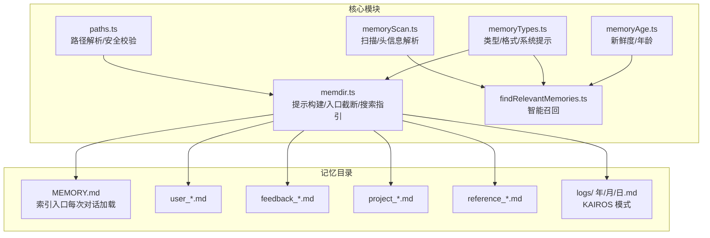
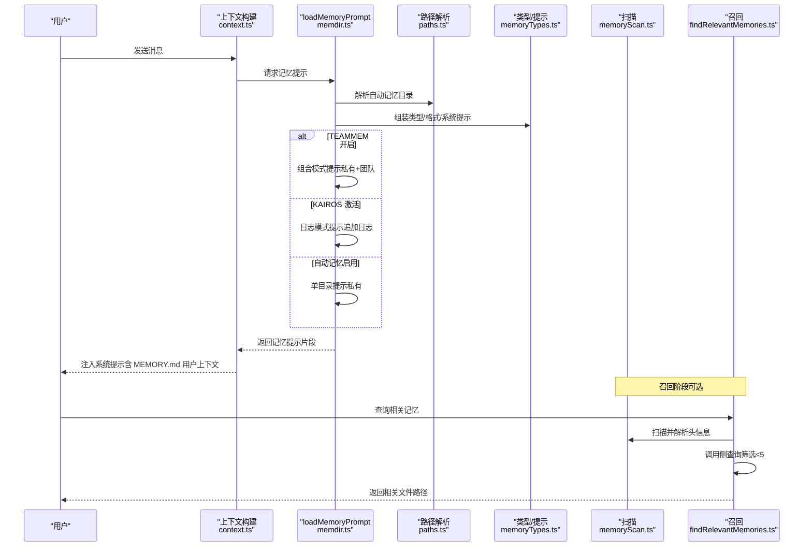
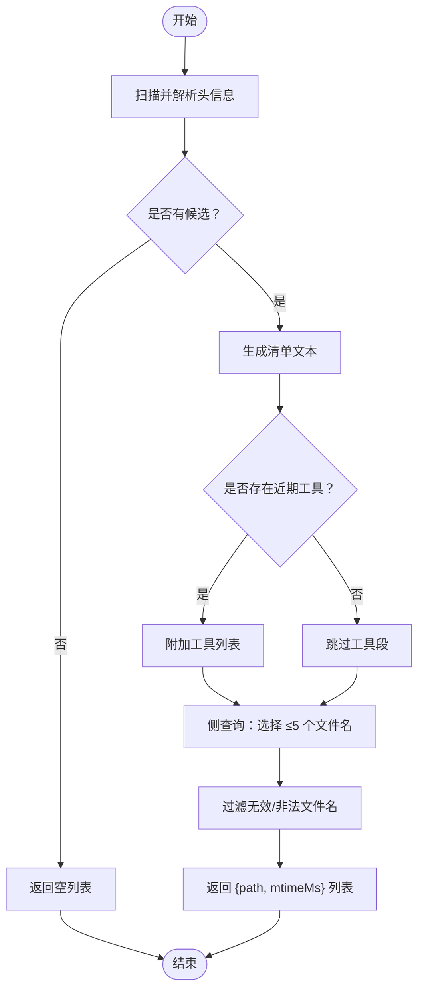
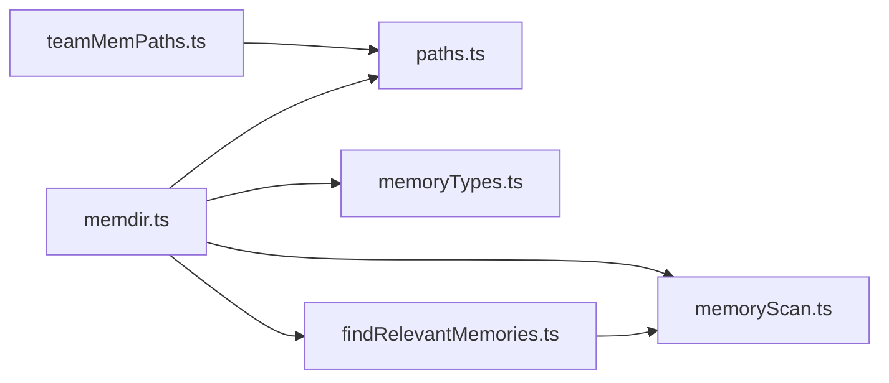

# 项目记忆系统

<cite>
**本文引用的文件**
- [src/memdir/memoryTypes.ts](file://src/memdir/memoryTypes.ts)
- [src/memdir/memoryScan.ts](file://src/memdir/memoryScan.ts)
- [src/memdir/findRelevantMemories.ts](file://src/memdir/findRelevantMemories.ts)
- [src/memdir/memdir.ts](file://src/memdir/memdir.ts)
- [src/memdir/paths.ts](file://src/memdir/paths.ts)
- [src/memdir/teamMemPaths.ts](file://src/memdir/teamMemPaths.ts)
- [src/memdir/memoryAge.ts](file://src/memdir/memoryAge.ts)
- [docs/context/project-memory.mdx](file://docs/context/project-memory.mdx)
</cite>

## 目录
1. [简介](#简介)
2. [项目结构](#项目结构)
3. [核心组件](#核心组件)
4. [架构总览](#架构总览)
5. [组件详解](#组件详解)
6. [依赖关系分析](#依赖关系分析)
7. [性能考量](#性能考量)
8. [故障排除指南](#故障排除指南)
9. [结论](#结论)
10. [附录](#附录)

## 简介
本文件面向 Claude Code Best 的“项目记忆系统”，系统性阐述其文件组织结构、存储策略、检索机制与使用规范。重点覆盖：
- MEMORY.md 入口文件的作用与格式规范（不含 frontmatter，索引条目为“标题(文件) — 一句话钩子”）
- 四类记忆类型（用户、反馈、项目、参考资料）的定义与边界
- 记忆扫描、元数据解析与智能召回流程
- 命名约定、文件组织规则与最佳实践
- 权限控制、路径安全校验与团队记忆隔离
- 版本管理与备份策略建议
- 使用示例与常见问题排查

## 项目结构
项目记忆系统以“纯文件 + 目录”的方式实现，核心位于 src/memdir 下，配合路径解析、权限校验与检索模块协同工作。

图示来源
- [src/memdir/paths.ts:223-235](file://src/memdir/paths.ts#L223-L235)
- [src/memdir/memdir.ts:34-38](file://src/memdir/memdir.ts#L34-L38)
- [src/memdir/memoryScan.ts:35-77](file://src/memdir/memoryScan.ts#L35-L77)
- [src/memdir/findRelevantMemories.ts:39-75](file://src/memdir/findRelevantMemories.ts#L39-L75)
- [src/memdir/memoryTypes.ts:14-31](file://src/memdir/memoryTypes.ts#L14-L31)
- [src/memdir/memoryAge.ts:6-20](file://src/memdir/memoryAge.ts#L6-L20)

章节来源
- [src/memdir/paths.ts:223-235](file://src/memdir/paths.ts#L223-L235)
- [src/memdir/memdir.ts:34-38](file://src/memdir/memdir.ts#L34-L38)
- [docs/context/project-memory.mdx:17-28](file://docs/context/project-memory.mdx#L17-L28)

## 核心组件
- 路径与安全
  - 自动记忆目录解析与安全校验，支持环境变量覆盖、设置项覆盖与默认路径；提供 isAutoMemPath/isTeamMemFile 等判定与 teamMem 写入校验。
- 提示构建与入口截断
  - 构建记忆行为指导、如何保存/访问记忆、索引截断策略与搜索指引；确保 MEMORY.md 内容按行/字节上限截断并给出警告。
- 记忆扫描与元数据解析
  - 递归扫描 .md 文件（排除 MEMORY.md），读取前 N 行解析 frontmatter，提取 type/description/mtime 等，排序并限制数量。
- 智能召回
  - 将内存清单交给 Sonnet 做二次筛选，结合“近期使用工具”去噪与“已展示去重”策略，返回最相关的若干文件路径。
- 类型系统与格式规范
  - 四类记忆类型（user/feedback/project/reference）与禁止保存的内容边界；frontmatter 示例与正文结构建议。
- 新鲜度与漂移提醒
  - 计算记忆年龄，输出人类可读的新鲜度文本，并在需要时包裹系统提醒标签。

章节来源
- [src/memdir/paths.ts:30-55](file://src/memdir/paths.ts#L30-L55)
- [src/memdir/memdir.ts:57-103](file://src/memdir/memdir.ts#L57-L103)
- [src/memdir/memoryScan.ts:35-77](file://src/memdir/memoryScan.ts#L35-L77)
- [src/memdir/findRelevantMemories.ts:39-75](file://src/memdir/findRelevantMemories.ts#L39-L75)
- [src/memdir/memoryTypes.ts:14-31](file://src/memdir/memoryTypes.ts#L14-L31)
- [src/memdir/memoryAge.ts:6-20](file://src/memdir/memoryAge.ts#L6-L20)

## 架构总览
下图展示了从“会话启动到记忆注入”的整体流程，以及与团队记忆、KAIROS 日志模式的组合关系。

图示来源
- [src/memdir/memdir.ts:419-507](file://src/memdir/memdir.ts#L419-L507)
- [src/memdir/paths.ts:223-235](file://src/memdir/paths.ts#L223-L235)
- [src/memdir/memoryTypes.ts:14-31](file://src/memdir/memoryTypes.ts#L14-L31)
- [src/memdir/memoryScan.ts:35-77](file://src/memdir/memoryScan.ts#L35-L77)
- [src/memdir/findRelevantMemories.ts:39-75](file://src/memdir/findRelevantMemories.ts#L39-L75)

## 组件详解

### MEMORY.md 入口文件与索引管理
- 作用
  - 作为记忆系统的“索引入口”，每次会话完整加载到上下文中，帮助模型快速定位相关内容。
- 格式规范
  - 无 frontmatter；每行一个条目，格式为“- [标题](文件.md) — 一句话钩子”。建议每条约 150 字符以内。
  - 支持“双上限”：最多 200 行、最大 25KB；超限时进行截断并在末尾追加警告，提示保持索引简洁并将细节放入主题文件。
- 截断与统计
  - 截断逻辑先按行再按字节，保证不切半行；同时记录行数、字节数与是否触发截断，便于分析与优化。
- 搜索指引
  - 当开启“过去上下文搜索”特性时，会在提示中提供针对记忆目录与会话转录的日志搜索命令，辅助快速定位。

章节来源
- [src/memdir/memdir.ts:34-38](file://src/memdir/memdir.ts#L34-L38)
- [src/memdir/memdir.ts:57-103](file://src/memdir/memdir.ts#L57-L103)
- [src/memdir/memdir.ts:375-407](file://src/memdir/memdir.ts#L375-L407)
- [docs/context/project-memory.mdx:37-56](file://docs/context/project-memory.mdx#L37-L56)

### 记忆类型分类系统
- 四类记忆
  - user：用户角色、偏好、职责与知识背景，用于个性化协作。
  - feedback：用户对 AI 行为的纠正与确认，需记录“失败+成功”两类，避免行为漂移。
  - project：项目内非代码可推导的状态、动机与约束（如截止日期、合规驱动），需及时更新。
  - reference：外部系统指针（如外部看板、仪表盘、频道），便于快速溯源。
- 禁止保存的内容
  - 代码模式、架构、文件结构、git 历史、调试方案、CLAUDE.md 已有文档、临时任务细节等均可从当前状态推导，不应存入记忆。
- 建议结构
  - feedback/project 类型建议采用“规则/事实 + Why: + How to apply:”三段式，便于推理与权衡。

章节来源
- [src/memdir/memoryTypes.ts:14-31](file://src/memdir/memoryTypes.ts#L14-L31)
- [src/memdir/memoryTypes.ts:183-195](file://src/memdir/memoryTypes.ts#L183-L195)
- [src/memdir/memoryTypes.ts:240-256](file://src/memdir/memoryTypes.ts#L240-L256)
- [docs/context/project-memory.mdx:57-93](file://docs/context/project-memory.mdx#L57-L93)

### 记忆扫描与元数据解析
- 扫描范围
  - 递归遍历记忆目录下的 .md 文件，排除 MEMORY.md；限制最多处理 200 个文件，避免大规模目录带来的性能问题。
- 元数据提取
  - 仅读取前 N 行（限定最大行数）解析 frontmatter，提取 description/type/mtime；mtime 用于排序与新鲜度提示。
- 排序与截断
  - 按 mtime 降序排列，取前 200 个；随后统一格式化为清单文本，供后续召回使用。

章节来源
- [src/memdir/memoryScan.ts:21-22](file://src/memdir/memoryScan.ts#L21-L22)
- [src/memdir/memoryScan.ts:35-77](file://src/memdir/memoryScan.ts#L35-L77)
- [src/memdir/memoryScan.ts:84-94](file://src/memdir/memoryScan.ts#L84-L94)

### 智能召回流程
- 输入
  - 用户查询 + 记忆清单（文件名、描述、类型、时间戳）+ 近期使用工具列表 + 已展示文件集合。
- 策略
  - 去噪：若存在近期工具，则在提示中加入“最近使用工具”段落，避免召回工具使用文档。
  - 去重：已展示文件集合过滤掉重复候选。
  - 选择：通过 sideQuery 调用轻量模型，返回最多 5 个最相关文件名。
- 输出
  - 返回绝对路径与 mtime，便于上层显示新鲜度与二次验证。

图示来源
- [src/memdir/findRelevantMemories.ts:39-75](file://src/memdir/findRelevantMemories.ts#L39-L75)
- [src/memdir/findRelevantMemories.ts:77-141](file://src/memdir/findRelevantMemories.ts#L77-L141)
- [src/memdir/memoryScan.ts:84-94](file://src/memdir/memoryScan.ts#L84-L94)

章节来源
- [src/memdir/findRelevantMemories.ts:39-75](file://src/memdir/findRelevantMemories.ts#L39-L75)
- [src/memdir/findRelevantMemories.ts:77-141](file://src/memdir/findRelevantMemories.ts#L77-L141)

### 提示构建与注入链路
- 提示来源
  - loadMemoryPrompt 根据功能开关与配置决定提示类型：KAIROS 日志模式、TEAMMEM 组合模式、或单目录自动记忆模式。
- 注入时机
  - 通过系统提示 section 缓存机制，在会话初始化时构建；MEMORY.md 的内容作为用户上下文消息注入，利于 Prompt Cache 前缀复用。
- 搜索指引
  - 在满足条件时提供针对记忆目录与会话转录的搜索命令，降低检索成本。

章节来源
- [src/memdir/memdir.ts:419-507](file://src/memdir/memdir.ts#L419-L507)
- [src/memdir/memdir.ts:375-407](file://src/memdir/memdir.ts#L375-L407)

### 权限控制与路径安全
- 自动记忆路径
  - 支持环境变量覆盖、设置项覆盖与默认路径；默认路径基于项目根（Git 根或稳定项目根），并进行安全校验（拒绝相对路径、近根路径、UNC/Windows 驱动器、包含空字节等）。
- 团队记忆路径
  - 作为自动记忆子目录，提供额外的安全校验：路径键消毒、符号链接解析、真实路径包含性检查，防止路径穿越与符号链接逃逸。
- 写入校验
  - 对团队记忆写入路径进行两阶段校验：字符串级包含性 + 符号链接解析后的实际包含性，确保写入目标始终在团队目录内。

章节来源
- [src/memdir/paths.ts:109-150](file://src/memdir/paths.ts#L109-L150)
- [src/memdir/teamMemPaths.ts:22-64](file://src/memdir/teamMemPaths.ts#L22-L64)
- [src/memdir/teamMemPaths.ts:109-171](file://src/memdir/teamMemPaths.ts#L109-L171)
- [src/memdir/teamMemPaths.ts:228-256](file://src/memdir/teamMemPaths.ts#L228-L256)

### 新鲜度与漂移提醒
- 年龄计算
  - 提供天数与人类可读字符串（today/yesterday/N days ago），用于 UI 展示与系统提醒。
- 漂移提醒
  - 对于超过一天的记忆，输出“记忆为时间快照，可能过期”的系统提醒文本，建议在依据记忆做决策前先核对当前状态。

章节来源
- [src/memdir/memoryAge.ts:6-20](file://src/memdir/memoryAge.ts#L6-L20)
- [src/memdir/memoryAge.ts:33-53](file://src/memdir/memoryAge.ts#L33-L53)
- [src/memdir/memoryTypes.ts:201-202](file://src/memdir/memoryTypes.ts#L201-L202)

## 依赖关系分析
- 模块耦合
  - memdir.ts 依赖 paths.ts（路径解析）、memoryTypes.ts（类型/提示）、memoryScan.ts（扫描）、findRelevantMemories.ts（召回）。
  - findRelevantMemories.ts 依赖 memoryScan.ts 与 sideQuery（外部轻量模型调用）。
  - teamMemPaths.ts 与 paths.ts 协作，保障团队记忆目录的安全性与一致性。
- 外部依赖
  - 文件系统操作、路径解析、环境变量与设置项读取。
  - sideQuery（轻量模型调用）用于召回筛选。

图示来源
- [src/memdir/memdir.ts:1-33](file://src/memdir/memdir.ts#L1-L33)
- [src/memdir/findRelevantMemories.ts:1-11](file://src/memdir/findRelevantMemories.ts#L1-L11)
- [src/memdir/memoryScan.ts:1-11](file://src/memdir/memoryScan.ts#L1-L11)
- [src/memdir/teamMemPaths.ts:1-5](file://src/memdir/teamMemPaths.ts#L1-L5)

章节来源
- [src/memdir/memdir.ts:1-33](file://src/memdir/memdir.ts#L1-L33)
- [src/memdir/findRelevantMemories.ts:1-11](file://src/memdir/findRelevantMemories.ts#L1-L11)
- [src/memdir/memoryScan.ts:1-11](file://src/memdir/memoryScan.ts#L1-L11)
- [src/memdir/teamMemPaths.ts:1-5](file://src/memdir/teamMemPaths.ts#L1-L5)

## 性能考量
- 扫描与 IO
  - 限制最大文件数与读取行数，减少 IO；mtime 直接由读取接口返回，避免额外 stat 调用，提升小规模目录性能。
- 召回成本
  - 通过“近期工具去噪”与“已展示去重”减少模型侧查询负担；限制返回数量（≤5）降低 token 与延迟。
- 提示构建
  - MEMORY.md 内容作为用户上下文注入，结合 Prompt Cache 前缀共享，减少重复计算。

章节来源
- [src/memdir/memoryScan.ts:21-22](file://src/memdir/memoryScan.ts#L21-L22)
- [src/memdir/memoryScan.ts:30-34](file://src/memdir/memoryScan.ts#L30-L34)
- [src/memdir/findRelevantMemories.ts:92-95](file://src/memdir/findRelevantMemories.ts#L92-L95)
- [src/memdir/memdir.ts:296-306](file://src/memdir/memdir.ts#L296-L306)

## 故障排除指南
- MEMORY.md 被截断
  - 现象：索引末尾出现“仅加载了部分内容”的警告。
  - 原因：超过行数或字节上限。
  - 处理：精简索引条目，保持每条约 150 字符以内；将细节迁移到主题文件，索引仅保留“标题(文件) — 一句话钩子”。
- 召回为空
  - 现象：查询后未返回相关文件。
  - 原因：候选不足、描述字段不具区分度、近期工具导致去噪过度。
  - 处理：优化记忆文件的 description 字段；必要时调整查询关键词；检查是否误用“忽略记忆”指令。
- 路径安全错误
  - 现象：写入/读取报错或被拒绝。
  - 原因：路径穿越、符号链接逃逸、路径键包含危险字符。
  - 处理：使用提供的校验函数（validateTeamMemWritePath/validateTeamMemKey）；避免使用相对路径、..、空字节、反斜杠等。
- 新鲜度风险
  - 现象：依据记忆得出的结论与当前代码不一致。
  - 处理：对超过一天的记忆添加系统提醒；在做决策前先核对当前状态，必要时删除或更新。

章节来源
- [src/memdir/memdir.ts:57-103](file://src/memdir/memdir.ts#L57-L103)
- [src/memdir/findRelevantMemories.ts:131-140](file://src/memdir/findRelevantMemories.ts#L131-L140)
- [src/memdir/teamMemPaths.ts:22-64](file://src/memdir/teamMemPaths.ts#L22-L64)
- [src/memdir/teamMemPaths.ts:228-256](file://src/memdir/teamMemPaths.ts#L228-L256)
- [src/memdir/memoryAge.ts:33-53](file://src/memdir/memoryAge.ts#L33-L53)

## 结论
项目记忆系统以“纯文件 + 目录”的方式实现了低成本、高可控的跨对话记忆能力。通过严格的类型边界、索引截断策略、智能召回与安全校验，既保证了实用性，也兼顾了安全性与可维护性。建议遵循本文的命名约定、组织规则与最佳实践，持续迭代记忆质量，避免过期与噪声。

## 附录

### 命名约定与文件组织规则
- 目录
  - 自动记忆目录：基于项目根（Git 根或稳定项目根）生成；团队记忆为自动记忆子目录。
- 索引
  - MEMORY.md：无 frontmatter；每行一个条目“- [标题](文件.md) — 一句话钩子”。
- 主题文件
  - user_*.md、feedback_*.md、project_*.md、reference_*.md；每个文件独立承载一类记忆。
- KAIROS 模式
  - 日志文件：logs/年/月/年-月-日.md；会话长期运行时仅追加日志，不维护实时索引。

章节来源
- [src/memdir/paths.ts:223-235](file://src/memdir/paths.ts#L223-L235)
- [src/memdir/memdir.ts:34-38](file://src/memdir/memdir.ts#L34-L38)
- [docs/context/project-memory.mdx:17-28](file://docs/context/project-memory.mdx#L17-L28)

### 版本管理与备份策略
- 版本管理
  - 记忆为纯文本文件，天然具备版本控制友好性；建议纳入仓库的 .gitignore 之外的“可选备份”策略。
- 备份建议
  - 定期导出 MEMORY.md 与主题文件至安全位置；对团队记忆目录进行周期性快照。
- 恢复与迁移
  - 迁移时注意路径安全校验与团队记忆目录结构；确保新环境下的路径解析与权限设置正确。

[本节为通用建议，无需特定文件引用]