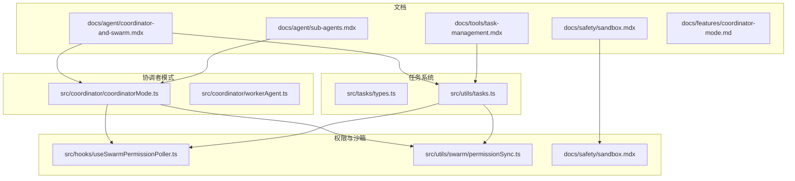
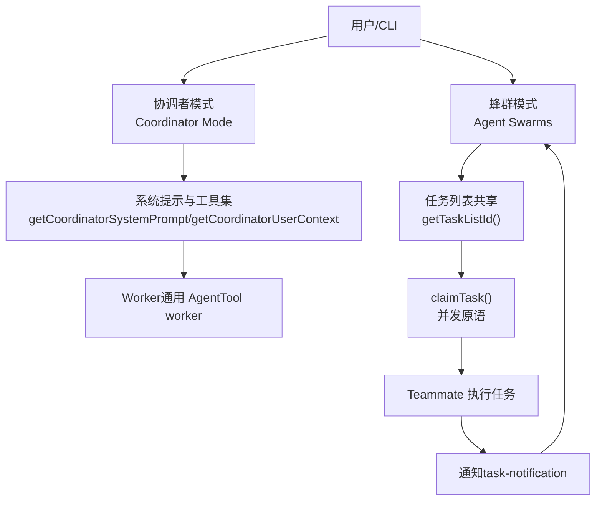
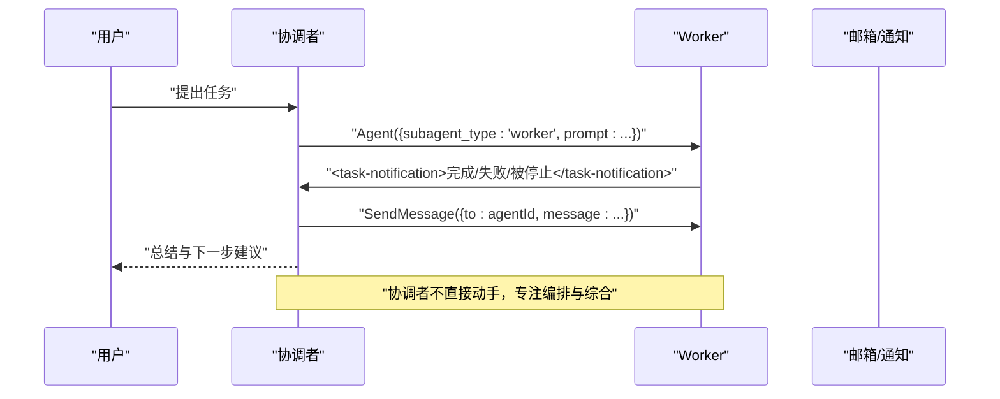
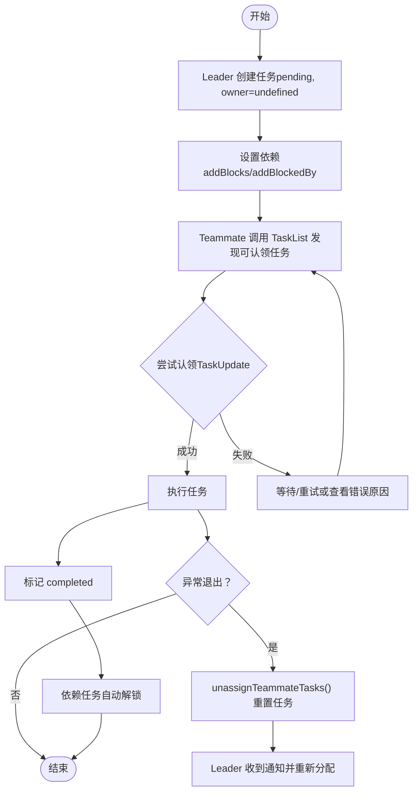
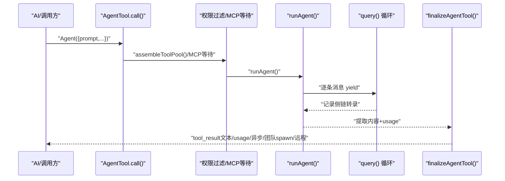
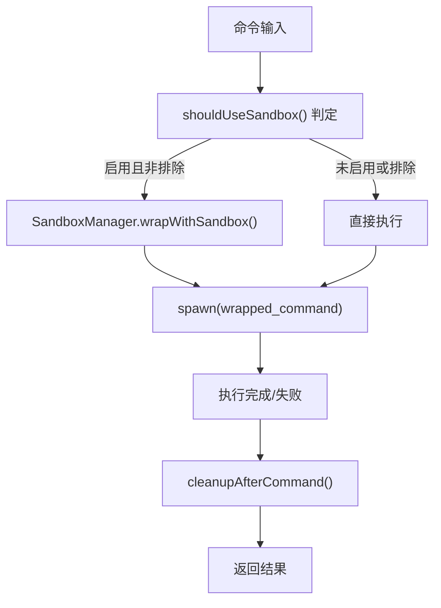
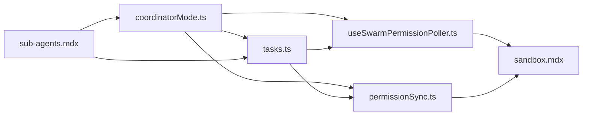

# 代理协作系统

<cite>
**本文档引用的文件**
- [coordinator-and-swarm.mdx](file://docs/agent/coordinator-and-swarm.mdx)
- [sub-agents.mdx](file://docs/agent/sub-agents.mdx)
- [task-management.mdx](file://docs/tools/task-management.mdx)
- [coordinatorMode.ts](file://src/coordinator/coordinatorMode.ts)
- [workerAgent.ts](file://src/coordinator/workerAgent.ts)
- [types.ts](file://src/tasks/types.ts)
- [tasks.ts](file://src/utils/tasks.ts)
- [useSwarmPermissionPoller.ts](file://src/hooks/useSwarmPermissionPoller.ts)
- [permissionSync.ts](file://src/utils/swarm/permissionSync.ts)
- [sandbox.mdx](file://docs/safety/sandbox.mdx)
- [coordinator-mode.md](file://docs/features/coordinator-mode.md)
</cite>

## 目录
1. [简介](#简介)
2. [项目结构](#项目结构)
3. [核心组件](#核心组件)
4. [架构总览](#架构总览)
5. [详细组件分析](#详细组件分析)
6. [依赖关系分析](#依赖关系分析)
7. [性能考量](#性能考量)
8. [故障排查指南](#故障排查指南)
9. [结论](#结论)
10. [附录](#附录)

## 简介
本文件面向希望使用 Claude Code Best 的“代理协作系统”的开发者与高级用户，系统性阐述两类协作模式：协调者模式（Coordinator Mode）与蜂群模式（Agent Swarms）。文档从设计理念、实现机制、生命周期、通信与权限、任务管理、安全策略到最佳实践与使用场景进行全面解析，并辅以图示与参考路径，帮助读者快速理解并高效落地。

## 项目结构
围绕代理协作的关键目录与文件：
- 文档层：docs/agent 与 docs/tools 下的协作与任务管理文档
- 协调者模式：src/coordinator 下的模式检测与系统提示
- 任务系统：src/tasks 与 src/utils/tasks.ts 的任务类型与并发控制
- 子代理与隔离：docs/agent/sub-agents.mdx 与相关工具链
- 权限与沙箱：hooks/useSwarmPermissionPoller.ts、utils/swarm/permissionSync.ts、docs/safety/sandbox.mdx

**图表来源**
- [coordinator-and-swarm.mdx:1-197](file://docs/agent/coordinator-and-swarm.mdx#L1-L197)
- [sub-agents.mdx:1-195](file://docs/agent/sub-agents.mdx#L1-L195)
- [task-management.mdx:1-213](file://docs/tools/task-management.mdx#L1-L213)
- [coordinatorMode.ts:1-370](file://src/coordinator/coordinatorMode.ts#L1-L370)
- [workerAgent.ts:1-5](file://src/coordinator/workerAgent.ts#L1-L5)
- [types.ts:1-47](file://src/tasks/types.ts#L1-L47)
- [tasks.ts:644-862](file://src/utils/tasks.ts#L644-L862)
- [useSwarmPermissionPoller.ts:162-257](file://src/hooks/useSwarmPermissionPoller.ts#L162-L257)
- [permissionSync.ts:758-794](file://src/utils/swarm/permissionSync.ts#L758-L794)
- [sandbox.mdx:1-216](file://docs/safety/sandbox.mdx#L1-L216)

**章节来源**
- [coordinator-and-swarm.mdx:1-197](file://docs/agent/coordinator-and-swarm.mdx#L1-L197)
- [task-management.mdx:1-213](file://docs/tools/task-management.mdx#L1-L213)

## 核心组件
- 协调者模式（Coordinator Mode）
  - 双门控激活：构建时 feature 与运行时环境变量
  - 工具集受限：仅 Agent、SendMessage、TaskStop
  - 系统提示强调“先理解，再分配”，并提供 Scratchpad 共享知识库
- 蜂群模式（Agent Swarms）
  - 基于任务系统 V2 的“共享任务列表 + 竞争认领”
  - 任务生命周期：创建 → 依赖设定 → 认领 → 执行 → 完成/异常退出回收
- 任务系统
  - 数据模型：subject/description/owner/status/blocks/blockedBy/metadata
  - 并发控制：文件锁 + 高水位标记 + TOCTOU 防护
  - 依赖管理：双向链表 blocks/blockedBy
- 子代理与隔离
  - AgentTool.call() 执行链路：权限过滤、MCP 依赖等待、工具池独立组装、可选 worktree 隔离、fork 子进程 Prompt Cache 共享
- 权限与安全
  - 蜂群权限轮询：注册回调、邮箱路由、响应处理
  - 沙箱机制：OS 级别约束，文件/网络隔离与资源限制

**章节来源**
- [coordinatorMode.ts:36-109](file://src/coordinator/coordinatorMode.ts#L36-L109)
- [coordinator-and-swarm.mdx:21-115](file://docs/agent/coordinator-and-swarm.mdx#L21-L115)
- [task-management.mdx:55-106](file://docs/tools/task-management.mdx#L55-L106)
- [types.ts:12-29](file://src/tasks/types.ts#L12-L29)
- [sub-agents.mdx:9-67](file://docs/agent/sub-agents.mdx#L9-L67)
- [useSwarmPermissionPoller.ts:162-257](file://src/hooks/useSwarmPermissionPoller.ts#L162-L257)
- [permissionSync.ts:758-794](file://src/utils/swarm/permissionSync.ts#L758-L794)
- [sandbox.mdx:15-55](file://docs/safety/sandbox.mdx#L15-L55)

## 架构总览
两种协作模式的架构差异与协同关系：

**图表来源**
- [coordinator-and-swarm.mdx:9-20](file://docs/agent/coordinator-and-swarm.mdx#L9-L20)
- [coordinatorMode.ts:111-369](file://src/coordinator/coordinatorMode.ts#L111-L369)
- [task-management.mdx:76-106](file://docs/tools/task-management.mdx#L76-L106)

## 详细组件分析

### 协调者模式（Coordinator Mode）
- 激活与会话恢复
  - isCoordinatorMode() 双门控检测
  - matchSessionMode() 在会话恢复时自动翻转环境变量以保持一致性
- 工具集与权限
  - getCoordinatorUserContext() 注入 Worker 工具清单与 MCP 服务器信息
  - 简化模式仅 Bash/Read/Edit，否则为完整工具集（排除内部工具）
- 通信协议
  - 以 user-role message + XML 标签 <task-notification> 传递 Worker 结果
  - 通过 <task-id> 实现定向续传（SendMessage）
- 核心职责
  - 理解需求 → 分配任务 → 综合结果（Synthesis）
  - 禁止“基于你的发现”类懒惰委托，必须自合成具体指令

**图表来源**
- [coordinatorMode.ts:111-369](file://src/coordinator/coordinatorMode.ts#L111-L369)
- [coordinator-and-swarm.mdx:77-96](file://docs/agent/coordinator-and-swarm.mdx#L77-L96)

**章节来源**
- [coordinatorMode.ts:36-109](file://src/coordinator/coordinatorMode.ts#L36-L109)
- [coordinator-and-swarm.mdx:21-115](file://docs/agent/coordinator-and-swarm.mdx#L21-L115)
- [coordinator-mode.md:1-152](file://docs/features/coordinator-mode.md#L1-L152)

### 蜂群模式（Agent Swarms）
- 团队初始化
  - TeamCreateTool 创建团队，Leader 设置 teamName
  - 所有 Teammate 自动获得相同 taskListId（优先级：环境变量 → teammate 上下文 → 环境变量 → Leader → 会话 ID）
- 任务认领与并发
  - claimTask() 原子性写入 owner，失败原因：任务不存在、已被认领、已完成、被阻塞、Agent 已忙碌
  - 列表级锁 + Agent 忙碌检查（checkAgentBusy）保障一致性
- 生命周期管理
  - Teammate 异常退出 → unassignTeammateTasks() → 未完成任务重置为 pending/owner=undefined → Leader 重新分配
- 任务类型
  - LocalAgentTask、LocalShellTask、InProcessTeammateTask、RemoteAgentTask、DreamTask、LocalWorkflowTask、MonitorMcpTask

**图表来源**
- [task-management.mdx:159-183](file://docs/tools/task-management.mdx#L159-L183)
- [tasks.ts:644-692](file://src/utils/tasks.ts#L644-L692)

**章节来源**
- [coordinator-and-swarm.mdx:116-172](file://docs/agent/coordinator-and-swarm.mdx#L116-L172)
- [task-management.mdx:76-106](file://docs/tools/task-management.mdx#L76-L106)
- [types.ts:12-29](file://src/tasks/types.ts#L12-L29)

### 子代理与隔离（AgentTool 执行链路）
- 执行链路概览
  - AgentTool.call() → 有效类型解析 → 权限过滤 → MCP 依赖等待 → 独立工具池组装 → 可选 worktree 隔离 → runAgent() → query() 循环 → finalizeAgentTool()
- Fork 子进程
  - Prompt Cache 共享：所有 fork 子进程共享父 Agent 的 assistant 消息，仅最后 user 块包含各自指令，最大化缓存命中
  - 递归防护：querySource 检查与 <fork-boilerplate> 标签检测
- 工具池与权限
  - 子 Agent 工具池独立组装，尊重 selectedAgent.permissionMode，默认 acceptEdits
  - Agent 级 MCP 服务器可独立初始化
- Worktree 隔离
  - 在 .git/worktrees/ 创建独立工作副本，路径翻译与清理策略
- 生命周期
  - 异步 Agent：立即返回 async_launched，后台执行并通知主 Agent
  - 同步 Agent：可后台化（autoBackgroundMs），前台迭代器终止后以 isAsync 重启

**图表来源**
- [sub-agents.mdx:9-35](file://docs/agent/sub-agents.mdx#L9-L35)

**章节来源**
- [sub-agents.mdx:36-195](file://docs/agent/sub-agents.mdx#L36-L195)

### 任务管理系统（TaskCreate/TaskUpdate/TaskList/TaskGet）
- 双轨架构
  - V1（TodoWrite）：内存 Todo 列表，全量替换，智能清空与验证推动
  - V2（Tasks）：文件系统持久化，JSON 文件 + 并发安全（文件锁 + 高水位）
- 数据模型与依赖
  - subject/description/activeForm/owner/status/blocks/blockedBy/metadata
  - blocks/blockedBy 维护双向依赖链，删除任务时自动清理引用
- 并发控制与认领
  - claimTask() 支持任务级锁与列表级锁（checkAgentBusy），失败原因枚举
- Hooks 集成
  - TaskCreate/TaskUpdate 集成 hooks，允许外部系统阻断或参与状态机

**章节来源**
- [task-management.mdx:9-22](file://docs/tools/task-management.mdx#L9-L22)
- [task-management.mdx:55-106](file://docs/tools/task-management.mdx#L55-L106)
- [task-management.mdx:129-158](file://docs/tools/task-management.mdx#L129-L158)
- [task-management.mdx:185-193](file://docs/tools/task-management.mdx#L185-L193)

### 权限控制与安全策略
- 蜂群权限轮询
  - 注册回调（registerSandboxPermissionCallback）→ 邮箱发送请求 → 处理响应（processSandboxPermissionResponse/processResponse）
  - 通过 writeToMailbox 路由至进程内或文件系统，支持请求 ID 唯一性
- 沙箱机制
  - 权限层决定“能否执行”，沙箱层决定“执行时能做到什么程度”
  - shouldUseSandbox() 判定：全局开关、显式跳过、排除列表、默认进入沙箱
  - 平台差异：macOS（sandbox-exec/Seatbelt）、Linux（bubblewrap/seccomp）、WSL
  - 配置模型：network/filesystem/excludedCommands 等
- 设计权衡
  - dangerouslyDisableSandbox 双重保险：调用侧与策略侧
  - autoAllowBashIfSandboxed：沙箱中的命令自动允许，减少重复审批

**图表来源**
- [sandbox.mdx:15-55](file://docs/safety/sandbox.mdx#L15-L55)

**章节来源**
- [useSwarmPermissionPoller.ts:162-257](file://src/hooks/useSwarmPermissionPoller.ts#L162-L257)
- [permissionSync.ts:758-794](file://src/utils/swarm/permissionSync.ts#L758-L794)
- [sandbox.mdx:1-216](file://docs/safety/sandbox.mdx#L1-L216)

## 依赖关系分析
- 组件耦合
  - 协调者模式依赖任务系统（通知与任务生命周期）、权限轮询（跨 Agent 通信）
  - 蜂群模式依赖任务系统（共享任务列表、认领与依赖）、权限轮询（跨 Agent 权限）
  - 子代理与隔离依赖工具池与 MCP 服务器装配、worktree 隔离
- 外部依赖
  - 平台沙箱（macOS/Linux/WSL）与系统调用过滤
  - 邮箱系统（进程内/文件系统）用于跨 Agent 通信

**图表来源**
- [coordinatorMode.ts:1-370](file://src/coordinator/coordinatorMode.ts#L1-L370)
- [tasks.ts:644-862](file://src/utils/tasks.ts#L644-L862)
- [useSwarmPermissionPoller.ts:162-257](file://src/hooks/useSwarmPermissionPoller.ts#L162-L257)
- [permissionSync.ts:758-794](file://src/utils/swarm/permissionSync.ts#L758-L794)
- [sandbox.mdx:1-216](file://docs/safety/sandbox.mdx#L1-L216)

**章节来源**
- [coordinatorMode.ts:1-370](file://src/coordinator/coordinatorMode.ts#L1-L370)
- [tasks.ts:644-862](file://src/utils/tasks.ts#L644-L862)
- [useSwarmPermissionPoller.ts:162-257](file://src/hooks/useSwarmPermissionPoller.ts#L162-L257)
- [permissionSync.ts:758-794](file://src/utils/swarm/permissionSync.ts#L758-L794)
- [sandbox.mdx:1-216](file://docs/safety/sandbox.mdx#L1-L216)

## 性能考量
- Prompt Cache 共享（Fork 子进程）
  - 所有 fork 子进程共享父 Agent 的 assistant 消息，最大化缓存命中，降低上下文窗口消耗
- 并发与锁粒度
  - 任务级锁适合单 Agent，列表级锁 + Agent 忙碌检查适合多 Agent 并发
  - 高水位标记避免 ID 重用，指数退避重试提升并发稳定性
- 背景任务与异步执行
  - 异步 Agent 独立 AbortController，不与父 Agent 共享，避免取消风暴
  - 同步 Agent 可后台化，前台迭代器终止后以 isAsync 重启，兼顾响应性与吞吐

**章节来源**
- [sub-agents.mdx:50-67](file://docs/agent/sub-agents.mdx#L50-L67)
- [task-management.mdx:131-148](file://docs/tools/task-management.mdx#L131-L148)
- [task-management.mdx:103-105](file://docs/tools/task-management.mdx#L103-L105)
- [sub-agents.mdx:116-154](file://docs/agent/sub-agents.mdx#L116-L154)

## 故障排查指南
- 任务认领失败
  - 检查失败原因：任务不存在、已被认领、已完成、被阻塞、Agent 已忙碌
  - 使用 TaskList 查看 pending 任务，确认 blockedBy 与 owner 状态
- Teammate 异常退出
  - 触发 unassignTeammateTasks()，未完成任务重置为 pending/owner=undefined
  - Leader 收到 mailbox 通知，重新分配或创建新 Teammate
- 权限与沙箱
  - sandbox 权限轮询：确认请求 ID 是否注册回调，响应是否被处理
  - shouldUseSandbox() 判定：检查全局开关、排除列表、策略允许
- 会话模式不一致
  - matchSessionMode() 应自动翻转环境变量，若仍不一致，检查 feature flag 与环境变量

**章节来源**
- [task-management.mdx:149-158](file://docs/tools/task-management.mdx#L149-L158)
- [tasks.ts:644-692](file://src/utils/tasks.ts#L644-L692)
- [tasks.ts:800-862](file://src/utils/tasks.ts#L800-L862)
- [useSwarmPermissionPoller.ts:162-257](file://src/hooks/useSwarmPermissionPoller.ts#L162-L257)
- [permissionSync.ts:758-794](file://src/utils/swarm/permissionSync.ts#L758-L794)
- [sandbox.mdx:34-55](file://docs/safety/sandbox.mdx#L34-L55)
- [coordinatorMode.ts:49-78](file://src/coordinator/coordinatorMode.ts#L49-L78)

## 结论
代理协作系统通过“协调者模式 + 蜂群模式”的双轨设计，既满足集中编排的复杂任务，也支持高并发的独立子任务并行执行。任务系统 V2 提供强一致性的共享任务列表与并发控制，子代理机制实现 Prompt Cache 共享与工作树隔离，权限与沙箱共同构成纵深安全防线。结合本文档的架构图、流程图与参考路径，开发者可据此快速落地复杂任务分解、并行执行与结果整合。

## 附录

### 最佳实践与使用场景
- 协调者模式适用
  - 需要多模块协调的重构任务
  - 先并行研究、再集中决策的方案评估
- 蜂群模式适用
  - 10 个独立 lint 警告修复
  - 在大仓库中搜索所有 TODO 并分类
- 复杂任务分解
  - 研究 → 合成 → 实施 → 验证 的四阶段流水线
  - 对于实现类任务，优先使用 Plan Mode 建立任务列表后再交由任务系统执行

**章节来源**
- [coordinator-and-swarm.mdx:189-197](file://docs/agent/coordinator-and-swarm.mdx#L189-L197)
- [coordinator-mode.md:130-152](file://docs/features/coordinator-mode.md#L130-L152)

### 配置示例与参考路径
- 启用协调者模式
  - 设置 FEATURE_COORDINATOR_MODE=1 与 CLAUDE_CODE_COORDINATOR_MODE=1
  - 参考路径：[coordinator-mode.md:19-25](file://docs/features/coordinator-mode.md#L19-L25)
- Fork 子进程与 Prompt Cache 共享
  - 参考路径：[sub-agents.mdx:50-67](file://docs/agent/sub-agents.mdx#L50-L67)
- 任务列表优先级与共享
  - 参考路径：[task-management.mdx:76-86](file://docs/tools/task-management.mdx#L76-L86)
- 任务认领与失败原因
  - 参考路径：[task-management.mdx:149-158](file://docs/tools/task-management.mdx#L149-L158)
- 权限轮询与邮箱路由
  - 参考路径：[useSwarmPermissionPoller.ts:162-257](file://src/hooks/useSwarmPermissionPoller.ts#L162-L257)、[permissionSync.ts:758-794](file://src/utils/swarm/permissionSync.ts#L758-L794)
- 沙箱配置模型
  - 参考路径：[sandbox.mdx:67-96](file://docs/safety/sandbox.mdx#L67-L96)