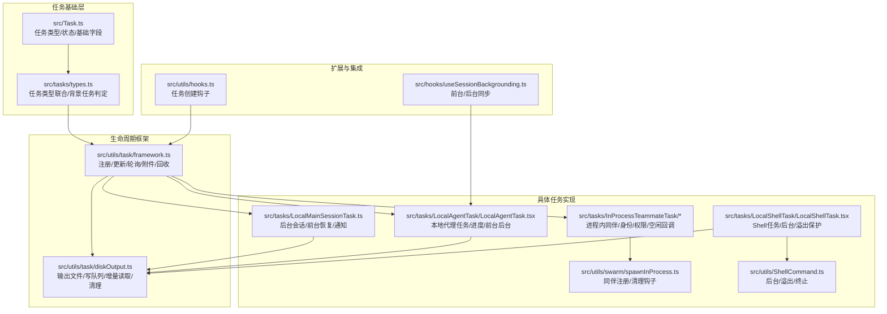
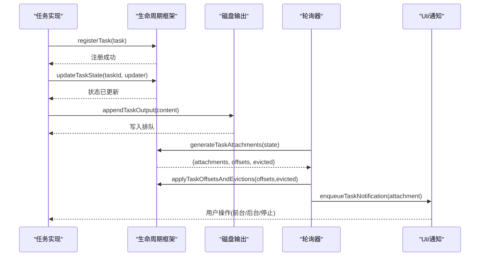
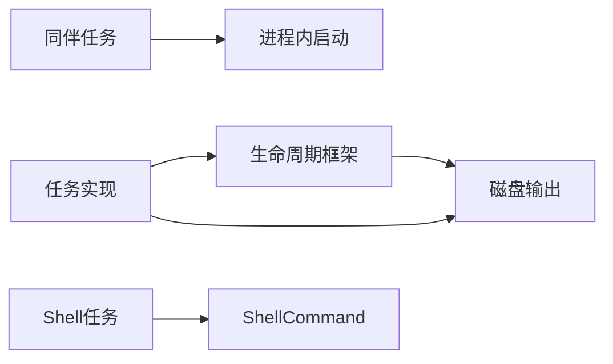

# 任务生命周期管理

<cite>
**本文引用的文件**
- [src/Task.ts](file://src/Task.ts)
- [src/tasks/types.ts](file://src/tasks/types.ts)
- [src/utils/task/framework.ts](file://src/utils/task/framework.ts)
- [src/utils/task/diskOutput.ts](file://src/utils/task/diskOutput.ts)
- [src/tasks/LocalMainSessionTask.ts](file://src/tasks/LocalMainSessionTask.ts)
- [src/tasks/LocalAgentTask/LocalAgentTask.tsx](file://src/tasks/LocalAgentTask/LocalAgentTask.tsx)
- [src/tasks/InProcessTeammateTask/InProcessTeammateTask.tsx](file://src/tasks/InProcessTeammateTask/InProcessTeammateTask.tsx)
- [src/tasks/InProcessTeammateTask/types.ts](file://src/tasks/InProcessTeammateTask/types.ts)
- [src/utils/swarm/spawnInProcess.ts](file://src/utils/swarm/spawnInProcess.ts)
- [src/utils/hooks.ts](file://src/utils/hooks.ts)
- [src/utils/ShellCommand.ts](file://src/utils/ShellCommand.ts)
- [src/hooks/useSessionBackgrounding.ts](file://src/hooks/useSessionBackgrounding.ts)
- [src/tasks/LocalShellTask/LocalShellTask.tsx](file://src/tasks/LocalShellTask/LocalShellTask.tsx)
</cite>

## 目录
1. [引言](#引言)
2. [项目结构](#项目结构)
3. [核心组件](#核心组件)
4. [架构总览](#架构总览)
5. [详细组件分析](#详细组件分析)
6. [依赖关系分析](#依赖关系分析)
7. [性能考量](#性能考量)
8. [故障排查指南](#故障排查指南)
9. [结论](#结论)
10. [附录](#附录)

## 引言
本文件系统性梳理 Claude Code Best 中“任务生命周期管理”的设计与实现，覆盖从任务创建、初始化、执行准备、运行监控、状态转换到最终清理的全流程。重点解析两类关键任务：主会话任务（LocalMainSessionTask）与同伴任务（InProcessTeammateTask），并总结通用任务框架、状态模型、资源管理策略、持久化机制、配置与扩展点以及最佳实践与常见问题。

## 项目结构
围绕任务生命周期的关键模块分布如下：
- 任务类型与基础状态：src/Task.ts 定义任务类型枚举、状态枚举、基础状态字段与工具函数
- 任务集合与筛选：src/tasks/types.ts 统一导出所有任务状态类型，并提供背景任务判定
- 生命周期框架：src/utils/task/framework.ts 提供注册、更新、轮询、附件生成、终端回收等通用能力
- 磁盘输出与容量控制：src/utils/task/diskOutput.ts 负责输出文件路径、写队列、溢出截断、增量读取与清理
- 主会话任务：src/tasks/LocalMainSessionTask.ts 实现后台会话、前台恢复、通知与输出落盘
- 本地代理任务：src/tasks/LocalAgentTask/LocalAgentTask.tsx 定义本地代理任务状态与前台/后台切换
- 同伴任务：src/tasks/InProcessTeammateTask/* 实现进程内同伴的身份、权限、计划模式、空闲回调等
- 进程内同伴启动：src/utils/swarm/spawnInProcess.ts 负责同伴注册与清理钩子
- 钩子与扩展：src/utils/hooks.ts 提供任务创建钩子扩展点
- Shell 任务与后台：src/utils/ShellCommand.ts 与 src/tasks/LocalShellTask/LocalShellTask.tsx 支持后台命令与大小限制
- 会话后台化钩子：src/hooks/useSessionBackgrounding.ts 协调前台/后台同步与中断

图表来源
- [src/Task.ts:1-126](file://src/Task.ts#L1-L126)
- [src/tasks/types.ts:1-47](file://src/tasks/types.ts#L1-L47)
- [src/utils/task/framework.ts:1-309](file://src/utils/task/framework.ts#L1-L309)
- [src/utils/task/diskOutput.ts:1-452](file://src/utils/task/diskOutput.ts#L1-L452)
- [src/tasks/LocalMainSessionTask.ts:1-482](file://src/tasks/LocalMainSessionTask.ts#L1-L482)
- [src/tasks/LocalAgentTask/LocalAgentTask.tsx:1-200](file://src/tasks/LocalAgentTask/LocalAgentTask.tsx#L1-L200)
- [src/tasks/InProcessTeammateTask/InProcessTeammateTask.tsx:1-35](file://src/tasks/InProcessTeammateTask/InProcessTeammateTask.tsx#L1-L35)
- [src/utils/swarm/spawnInProcess.ts:182-216](file://src/utils/swarm/spawnInProcess.ts#L182-L216)
- [src/utils/ShellCommand.ts:318-465](file://src/utils/ShellCommand.ts#L318-L465)
- [src/tasks/LocalShellTask/LocalShellTask.tsx:352-408](file://src/tasks/LocalShellTask/LocalShellTask.tsx#L352-L408)
- [src/utils/hooks.ts:3882-3924](file://src/utils/hooks.ts#L3882-L3924)
- [src/hooks/useSessionBackgrounding.ts:91-121](file://src/hooks/useSessionBackgrounding.ts#L91-L121)

章节来源
- [src/Task.ts:1-126](file://src/Task.ts#L1-L126)
- [src/tasks/types.ts:1-47](file://src/tasks/types.ts#L1-L47)
- [src/utils/task/framework.ts:1-309](file://src/utils/task/framework.ts#L1-L309)
- [src/utils/task/diskOutput.ts:1-452](file://src/utils/task/diskOutput.ts#L1-L452)
- [src/tasks/LocalMainSessionTask.ts:1-482](file://src/tasks/LocalMainSessionTask.ts#L1-L482)
- [src/tasks/LocalAgentTask/LocalAgentTask.tsx:1-200](file://src/tasks/LocalAgentTask/LocalAgentTask.tsx#L1-L200)
- [src/tasks/InProcessTeammateTask/InProcessTeammateTask.tsx:1-35](file://src/tasks/InProcessTeammateTask/InProcessTeammateTask.tsx#L1-L35)
- [src/utils/swarm/spawnInProcess.ts:182-216](file://src/utils/swarm/spawnInProcess.ts#L182-L216)
- [src/utils/ShellCommand.ts:318-465](file://src/utils/ShellCommand.ts#L318-L465)
- [src/tasks/LocalShellTask/LocalShellTask.tsx:352-408](file://src/tasks/LocalShellTask/LocalShellTask.tsx#L352-L408)
- [src/utils/hooks.ts:3882-3924](file://src/utils/hooks.ts#L3882-L3924)
- [src/hooks/useSessionBackgrounding.ts:91-121](file://src/hooks/useSessionBackgrounding.ts#L91-L121)

## 核心组件
- 任务类型与状态
  - 类型：local_bash、local_agent、remote_agent、in_process_teammate、local_workflow、monitor_mcp、dream
  - 状态：pending、running、completed、failed、killed
  - 基础字段：id、type、status、description、toolUseId、startTime、endTime、totalPausedMs、outputFile、outputOffset、notified
- 任务状态判定
  - 终止态：completed、failed、killed；用于回收与防护
- 任务注册与更新
  - registerTask：向全局状态注册新任务，支持替换时保留 UI 状态
  - updateTaskState：类型安全地更新任务状态，避免无变化时的重渲染
- 输出与轮询
  - generateTaskAttachments：按输出偏移增量读取，生成附件并标记可回收任务
  - applyTaskOffsetsAndEvictions：应用偏移更新与回收逻辑
  - pollTasks：主轮询循环，驱动增量推送与回收
- 磁盘输出
  - DiskTaskOutput：单任务写队列，逐块写出，及时 GC；达到上限后截断并追加提示
  - getTaskOutputDelta/getTaskOutput：增量读取与尾部读取，避免全量加载
  - initTaskOutput/initTaskOutputAsSymlink/cleanupTaskOutput/evictTaskOutput：输出文件生命周期管理

章节来源
- [src/Task.ts:6-29](file://src/Task.ts#L6-L29)
- [src/Task.ts:44-57](file://src/Task.ts#L44-L57)
- [src/Task.ts:72-76](file://src/Task.ts#L72-L76)
- [src/utils/task/framework.ts:77-117](file://src/utils/task/framework.ts#L77-L117)
- [src/utils/task/framework.ts:48-72](file://src/utils/task/framework.ts#L48-L72)
- [src/utils/task/framework.ts:158-206](file://src/utils/task/framework.ts#L158-L206)
- [src/utils/task/framework.ts:213-249](file://src/utils/task/framework.ts#L213-L249)
- [src/utils/task/framework.ts:255-269](file://src/utils/task/framework.ts#L255-L269)
- [src/utils/task/diskOutput.ts:97-231](file://src/utils/task/diskOutput.ts#L97-L231)
- [src/utils/task/diskOutput.ts:304-330](file://src/utils/task/diskOutput.ts#L304-L330)
- [src/utils/task/diskOutput.ts:400-451](file://src/utils/task/diskOutput.ts#L400-L451)

## 架构总览
下图展示任务生命周期在系统中的交互关系：任务实现通过框架注册与更新状态，磁盘输出模块负责 IO 与容量控制，轮询器定期生成附件并触发通知，回收器在满足条件时释放内存。

图表来源
- [src/utils/task/framework.ts:77-117](file://src/utils/task/framework.ts#L77-L117)
- [src/utils/task/framework.ts:158-206](file://src/utils/task/framework.ts#L158-L206)
- [src/utils/task/framework.ts:213-249](file://src/utils/task/framework.ts#L213-L249)
- [src/utils/task/framework.ts:255-269](file://src/utils/task/framework.ts#L255-L269)
- [src/utils/task/diskOutput.ts:268-281](file://src/utils/task/diskOutput.ts#L268-L281)

## 详细组件分析

### 主会话任务（LocalMainSessionTask）
- 角色定位
  - 处理用户在会话中按下两次 Ctrl+B 的“后台化”场景：查询继续在后台运行，UI 清空至新提示，完成后发送通知
  - 复用本地代理任务的状态结构，agentType 标记为 main-session
- 关键流程
  - 注册：生成任务 ID、初始化输出链接、创建 AbortController、注册清理钩子、构造任务状态并注册
  - 执行：以异步流方式消费 query() 事件，增量记录侧链转录、统计 token 与工具使用次数、更新进度与消息
  - 完成：根据成功与否设置状态为 completed 或 failed，清理输出，按是否后台化决定是否发送通知
  - 前台恢复：将任务标记为非后台，恢复其消息到主视图
- 特殊处理
  - 使用独立的输出链接，避免与主会话转录冲突
  - 在后台状态下，仅发送一次通知；前台状态下通过 SDK 事件闭合起止
- 相关文件
  - [src/tasks/LocalMainSessionTask.ts:94-162](file://src/tasks/LocalMainSessionTask.ts#L94-L162)
  - [src/tasks/LocalMainSessionTask.ts:168-219](file://src/tasks/LocalMainSessionTask.ts#L168-L219)
  - [src/tasks/LocalMainSessionTask.ts:224-263](file://src/tasks/LocalMainSessionTask.ts#L224-L263)
  - [src/tasks/LocalMainSessionTask.ts:270-302](file://src/tasks/LocalMainSessionTask.ts#L270-L302)
  - [src/tasks/LocalMainSessionTask.ts:338-481](file://src/tasks/LocalMainSessionTask.ts#L338-L481)

章节来源
- [src/tasks/LocalMainSessionTask.ts:1-482](file://src/tasks/LocalMainSessionTask.ts#L1-L482)

### 同伴任务（InProcessTeammateTask）
- 角色定位
  - 进程内同伴，运行于同一 Node.js 进程，使用 AsyncLocalStorage 隔离上下文
  - 具备团队感知身份（agentName@teamName）、计划模式审批、空闲等待与活动回调
- 关键状态
  - identity：存储同伴身份（含团队名、计划模式需求等）
  - awaitingPlanApproval：等待计划模式审批
  - permissionMode：独立于主会话的权限模式
  - isIdle/shutdownRequested：空闲与关闭请求
  - messages/pendingUserMessages：对话历史与待投递用户消息
  - progress/inProgressToolUseIDs：进度与当前执行工具 ID 集
- 生命周期要点
  - 注册：通过 spawnInProcess 创建并注册任务，建立清理钩子
  - 执行：在同伴运行循环中推进消息、更新进度、处理工具调用
  - 回收：支持 kill 操作，清理钩子在进程退出时触发
- 相关文件
  - [src/tasks/InProcessTeammateTask/InProcessTeammateTask.tsx:29-35](file://src/tasks/InProcessTeammateTask/InProcessTeammateTask.tsx#L29-L35)
  - [src/tasks/InProcessTeammateTask/types.ts:22-76](file://src/tasks/InProcessTeammateTask/types.ts#L22-L76)
  - [src/utils/swarm/spawnInProcess.ts:182-216](file://src/utils/swarm/spawnInProcess.ts#L182-L216)

章节来源
- [src/tasks/InProcessTeammateTask/InProcessTeammateTask.tsx:1-35](file://src/tasks/InProcessTeammateTask/InProcessTeammateTask.tsx#L1-L35)
- [src/tasks/InProcessTeammateTask/types.ts:1-122](file://src/tasks/InProcessTeammateTask/types.ts#L1-L122)
- [src/utils/swarm/spawnInProcess.ts:182-216](file://src/utils/swarm/spawnInProcess.ts#L182-L216)

### 本地代理任务（LocalAgentTask）
- 角色定位
  - 本地代理执行器，支持前台运行与自动后台化
- 关键状态
  - isBackgrounded：前台/后台标志
  - progress：工具使用计数、token 计数、最近活动
  - retain/diskLoaded：UI 持有与磁盘侧链加载状态
  - evictAfter：面板可见截止时间
- 前台/后台切换
  - 自动后台：可配置超时后自动标记为后台
  - 手动后台：立即标记并解析后台信号
  - 前台恢复：将任务标记为前台，必要时恢复之前前台任务为后台
- 相关文件
  - [src/tasks/LocalAgentTask/LocalAgentTask.tsx:692-734](file://src/tasks/LocalAgentTask/LocalAgentTask.tsx#L692-L734)
  - [src/tasks/LocalAgentTask/LocalAgentTask.tsx:740-774](file://src/tasks/LocalAgentTask/LocalAgentTask.tsx#L740-L774)
  - [src/tasks/LocalAgentTask/LocalAgentTask.tsx:779-804](file://src/tasks/LocalAgentTask/LocalAgentTask.tsx#L779-L804)
  - [src/hooks/useSessionBackgrounding.ts:91-121](file://src/hooks/useSessionBackgrounding.ts#L91-L121)

章节来源
- [src/tasks/LocalAgentTask/LocalAgentTask.tsx:1-200](file://src/tasks/LocalAgentTask/LocalAgentTask.tsx#L1-L200)
- [src/tasks/LocalAgentTask/LocalAgentTask.tsx:692-734](file://src/tasks/LocalAgentTask/LocalAgentTask.tsx#L692-L734)
- [src/tasks/LocalAgentTask/LocalAgentTask.tsx:740-774](file://src/tasks/LocalAgentTask/LocalAgentTask.tsx#L740-L774)
- [src/tasks/LocalAgentTask/LocalAgentTask.tsx:779-804](file://src/tasks/LocalAgentTask/LocalAgentTask.tsx#L779-L804)
- [src/hooks/useSessionBackgrounding.ts:91-121](file://src/hooks/useSessionBackgrounding.ts#L91-L121)

### Shell 任务与后台化
- 角色定位
  - 本地 Shell 命令执行，支持后台运行、溢出保护与结果回收
- 关键行为
  - background：将运行中的命令置于后台，文件模式开启大小监控，管道模式将缓冲溢出到磁盘
  - kill：终止子进程并返回 killed 结果
  - 输出：通过 TaskOutput 写入磁盘，受 MAX_TASK_OUTPUT_BYTES 限制
- 相关文件
  - [src/utils/ShellCommand.ts:318-465](file://src/utils/ShellCommand.ts#L318-L465)
  - [src/tasks/LocalShellTask/LocalShellTask.tsx:352-408](file://src/tasks/LocalShellTask/LocalShellTask.tsx#L352-L408)

章节来源
- [src/utils/ShellCommand.ts:318-465](file://src/utils/ShellCommand.ts#L318-L465)
- [src/tasks/LocalShellTask/LocalShellTask.tsx:352-408](file://src/tasks/LocalShellTask/LocalShellTask.tsx#L352-L408)

### 生命周期状态转换与监控
- 状态机
  - 初始：pending
  - 运行：running
  - 结束：completed、failed、killed
  - 终止态判定：isTerminalTaskStatus
- 轮询与通知
  - generateTaskAttachments：对 running 任务增量读取输出，生成附件
  - applyTaskOffsetsAndEvictions：应用偏移更新与回收
  - pollTasks：主轮询循环
- 监控要点
  - 增量推送：避免全量读取导致内存压力
  - 终端回收：在 notified 且满足面板宽限期后回收
  - 并发安全：在 apply 阶段重新检查状态，防止竞态

章节来源
- [src/Task.ts:15-29](file://src/Task.ts#L15-L29)
- [src/utils/task/framework.ts:158-206](file://src/utils/task/framework.ts#L158-L206)
- [src/utils/task/framework.ts:213-249](file://src/utils/task/framework.ts#L213-L249)
- [src/utils/task/framework.ts:255-269](file://src/utils/task/framework.ts#L255-L269)

### 资源管理策略
- 内存
  - 任务状态采用不可变更新，避免不必要的重渲染
  - 同伴消息数组上限（TEAMMATE_MESSAGES_UI_CAP=50）降低 UI 内存占用
  - 进度追踪仅维护最近活动，控制数组长度
- 文件句柄与磁盘
  - DiskTaskOutput 使用单文件句柄与写队列，逐块写出并及时释放
  - 达到上限（MAX_TASK_OUTPUT_BYTES）后截断并追加提示
  - 输出文件采用会话隔离目录，支持 /clear 后续任务存活
- 网络连接
  - 通过任务输出与轮询机制间接反映网络 I/O 进度，不直接暴露连接对象
- 清理
  - 注册清理钩子（registerCleanup），在进程退出或任务结束时统一回收
  - 终端任务在 notified 后延迟回收，确保消费者已消费

章节来源
- [src/tasks/InProcessTeammateTask/types.ts:101-121](file://src/tasks/InProcessTeammateTask/types.ts#L101-L121)
- [src/utils/task/diskOutput.ts:97-231](file://src/utils/task/diskOutput.ts#L97-L231)
- [src/utils/task/diskOutput.ts:304-330](file://src/utils/task/diskOutput.ts#L304-L330)
- [src/utils/task/framework.ts:125-144](file://src/utils/task/framework.ts#L125-L144)

### 持久化机制
- 输出持久化
  - initTaskOutput/initTaskOutputAsSymlink：初始化输出文件或符号链接
  - appendTaskOutput：异步追加内容
  - getTaskOutput/getTaskOutputDelta：尾部读取与增量读取
  - evictTaskOutput/cleanupTaskOutput：输出消费后的回收与删除
- 会话与同伴转录
  - LocalMainSessionTask 将后台会话转录写入独立路径，避免与主会话冲突
- 磁盘容量与安全
  - O_NOFOLLOW 防护符号链接攻击
  - 会话级目录隔离，避免并发会话互相影响

章节来源
- [src/utils/task/diskOutput.ts:400-451](file://src/utils/task/diskOutput.ts#L400-L451)
- [src/utils/task/diskOutput.ts:304-330](file://src/utils/task/diskOutput.ts#L304-L330)
- [src/tasks/LocalMainSessionTask.ts:107-110](file://src/tasks/LocalMainSessionTask.ts#L107-L110)

### 配置选项与自定义扩展
- 任务创建钩子
  - executeTaskCreatedHooks：在任务创建前执行外部钩子，支持阻断与超时
- 自动后台化
  - LocalAgentTask 支持按配置超时自动后台化
- 扩展点
  - Task 接口：kill 实现仅依赖 setAppState，便于新增任务类型
  - 任务状态：通过 TaskStateBase 扩展字段，满足不同任务需求

章节来源
- [src/utils/hooks.ts:3896-3924](file://src/utils/hooks.ts#L3896-L3924)
- [src/tasks/LocalAgentTask/LocalAgentTask.tsx:692-734](file://src/tasks/LocalAgentTask/LocalAgentTask.tsx#L692-L734)
- [src/Task.ts:72-76](file://src/Task.ts#L72-L76)
- [src/Task.ts:44-57](file://src/Task.ts#L44-L57)

## 依赖关系分析
- 组件耦合
  - 任务实现依赖框架（register/update）与磁盘输出（append/read）
  - 同伴任务依赖进程内启动器与清理钩子
  - Shell 任务依赖 ShellCommand 与 TaskOutput
- 可能的循环
  - 未见直接循环依赖；框架与磁盘输出为底层模块，被上层任务实现依赖
- 外部依赖
  - 文件系统与进程管理（fs/promises、child_process）
  - 会话与项目临时目录（会话 ID 隔离）

图表来源
- [src/utils/task/framework.ts:77-117](file://src/utils/task/framework.ts#L77-L117)
- [src/utils/task/diskOutput.ts:268-281](file://src/utils/task/diskOutput.ts#L268-L281)
- [src/tasks/InProcessTeammateTask/InProcessTeammateTask.tsx:32-34](file://src/tasks/InProcessTeammateTask/InProcessTeammateTask.tsx#L32-L34)
- [src/utils/swarm/spawnInProcess.ts:182-216](file://src/utils/swarm/spawnInProcess.ts#L182-L216)
- [src/utils/ShellCommand.ts:318-465](file://src/utils/ShellCommand.ts#L318-L465)

章节来源
- [src/utils/task/framework.ts:1-309](file://src/utils/task/framework.ts#L1-L309)
- [src/utils/task/diskOutput.ts:1-452](file://src/utils/task/diskOutput.ts#L1-L452)
- [src/tasks/InProcessTeammateTask/InProcessTeammateTask.tsx:1-35](file://src/tasks/InProcessTeammateTask/InProcessTeammateTask.tsx#L1-L35)
- [src/utils/swarm/spawnInProcess.ts:182-216](file://src/utils/swarm/spawnInProcess.ts#L182-L216)
- [src/utils/ShellCommand.ts:318-465](file://src/utils/ShellCommand.ts#L318-L465)

## 性能考量
- 增量读取与写入
  - 仅读取 outputOffset 之后的内容，避免全量加载
  - 写队列逐块写出，及时释放内存
- 内存上限
  - 同伴消息上限与进度追踪减少 UI 与运行时内存占用
- 并发与竞态
  - 轮询阶段重新检查状态，避免 TOCTOU 导致的错误回收
- I/O 安全
  - O_NOFOLLOW 防护与会话隔离目录降低安全风险

[本节为通用指导，无需列出章节来源]

## 故障排查指南
- 任务未显示通知
  - 检查 notified 标志与状态是否为终止态；终端任务需满足面板宽限期才回收
  - 参考：[src/utils/task/framework.ts:125-144](file://src/utils/task/framework.ts#L125-L144)
- 输出为空或不完整
  - 确认增量读取偏移是否正确推进；检查磁盘容量上限与截断提示
  - 参考：[src/utils/task/framework.ts:158-206](file://src/utils/task/framework.ts#L158-L206)，[src/utils/task/diskOutput.ts:304-330](file://src/utils/task/diskOutput.ts#L304-L330)
- 后台任务无法回收
  - 确认 notified 已设置；检查 evictAfter 是否未到期
  - 参考：[src/utils/task/framework.ts:213-249](file://src/utils/task/framework.ts#L213-L249)
- 同伴任务不响应停止
  - 确认 kill 调用与清理钩子是否注册；检查 abortController 是否生效
  - 参考：[src/tasks/InProcessTeammateTask/InProcessTeammateTask.tsx:32-34](file://src/tasks/InProcessTeammateTask/InProcessTeammateTask.tsx#L32-L34)，[src/utils/swarm/spawnInProcess.ts:182-216](file://src/utils/swarm/spawnInProcess.ts#L182-L216)
- Shell 命令被杀或超时
  - 检查输出文件大小是否超过上限；确认后台模式下的大小监控是否启用
  - 参考：[src/utils/ShellCommand.ts:318-465](file://src/utils/ShellCommand.ts#L318-L465)

章节来源
- [src/utils/task/framework.ts:125-144](file://src/utils/task/framework.ts#L125-L144)
- [src/utils/task/framework.ts:158-206](file://src/utils/task/framework.ts#L158-L206)
- [src/utils/task/framework.ts:213-249](file://src/utils/task/framework.ts#L213-L249)
- [src/utils/task/diskOutput.ts:304-330](file://src/utils/task/diskOutput.ts#L304-L330)
- [src/tasks/InProcessTeammateTask/InProcessTeammateTask.tsx:32-34](file://src/tasks/InProcessTeammateTask/InProcessTeammateTask.tsx#L32-L34)
- [src/utils/swarm/spawnInProcess.ts:182-216](file://src/utils/swarm/spawnInProcess.ts#L182-L216)
- [src/utils/ShellCommand.ts:318-465](file://src/utils/ShellCommand.ts#L318-L465)

## 结论
本系统通过统一的任务类型与状态模型、类型安全的生命周期框架、增量输出与容量控制、以及完善的前台/后台切换与回收机制，实现了稳定高效的多类型任务生命周期管理。主会话任务与同伴任务分别覆盖了“会话后台化”和“进程内团队协作”的关键场景，配合钩子扩展与安全 I/O 设计，满足复杂工作负载的可靠性与可观测性需求。

[本节为总结性内容，无需列出章节来源]

## 附录
- 最佳实践
  - 使用 registerTask 与 updateTaskState 进行状态变更，避免直接修改全局状态
  - 对长时任务启用增量输出与偏移推进，避免全量读取
  - 为任务设置合适的清理钩子，确保异常退出也能回收资源
  - 对 UI 层数据进行上限控制（如同伴消息），降低内存压力
- 常见问题
  - 重复通知：通过 notified 标志与原子检查避免
  - 输出截断：关注磁盘上限提示，必要时调整任务策略
  - 回收延迟：合理设置面板宽限期与 evictAfter，平衡可见性与内存

[本节为通用指导，无需列出章节来源]