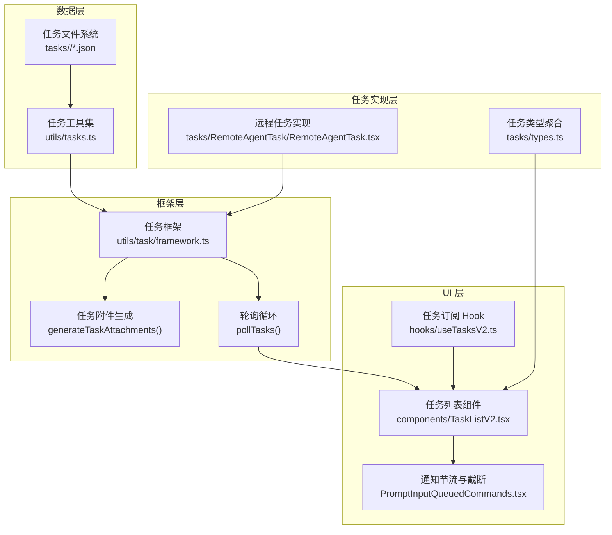
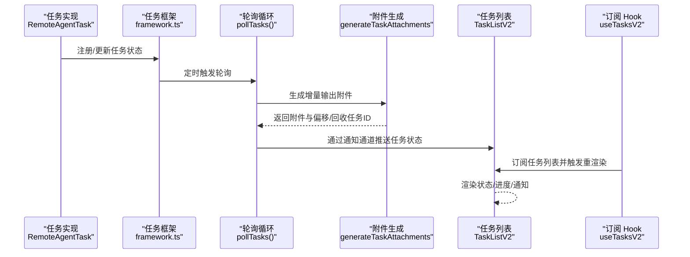
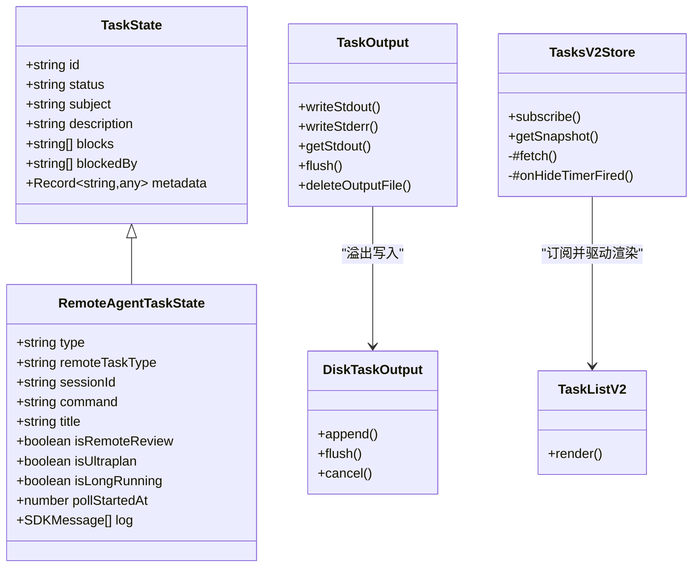

# 任务监控与跟踪

<cite>
**本文引用的文件**
- [src/components/TaskListV2.tsx](file://src/components/TaskListV2.tsx)
- [src/hooks/useTasksV2.ts](file://src/hooks/useTasksV2.ts)
- [src/utils/task/framework.ts](file://src/utils/task/framework.ts)
- [src/tasks/RemoteAgentTask/RemoteAgentTask.tsx](file://src/tasks/RemoteAgentTask/RemoteAgentTask.tsx)
- [src/utils/tasks.ts](file://src/utils/tasks.ts)
- [src/utils/task/TaskOutput.ts](file://src/utils/task/TaskOutput.ts)
- [src/utils/task/diskOutput.ts](file://src/utils/task/diskOutput.ts)
- [src/utils/ShellCommand.ts](file://src/utils/ShellCommand.ts)
- [src/tools/TaskUpdateTool/TaskUpdateTool.ts](file://src/tools/TaskUpdateTool/TaskUpdateTool.ts)
- [src/tools/TaskGetTool/TaskGetTool.ts](file://src/tools/TaskGetTool/TaskGetTool.ts)
- [src/components/PromptInput/PromptInputQueuedCommands.tsx](file://src/components/PromptInput/PromptInputQueuedCommands.tsx)
- [src/tasks/types.ts](file://src/tasks/types.ts)
</cite>

## 目录
1. [简介](#简介)
2. [项目结构](#项目结构)
3. [核心组件](#核心组件)
4. [架构总览](#架构总览)
5. [详细组件分析](#详细组件分析)
6. [依赖关系分析](#依赖关系分析)
7. [性能考量](#性能考量)
8. [故障排查指南](#故障排查指南)
9. [结论](#结论)
10. [附录](#附录)

## 简介
本文件面向 Claude Code Best 的任务监控系统，系统性阐述任务监控的核心能力：实时状态跟踪、进度显示、性能指标采集、可视化展示（任务列表、状态标签、进度条）、本地与远程任务的差异化处理、执行日志记录与查看、通知机制（完成提醒、失败告警、进度更新），以及配置项（刷新频率、历史记录保留）与使用指南、故障诊断方法。

## 项目结构
任务监控体系由“数据层（任务持久化与状态）—框架层（轮询与附件生成）—UI 层（任务列表与通知）—任务实现层（本地/远程任务）”构成，采用文件系统作为任务清单的持久化介质，配合 React Hooks 订阅与文件系统监听，实现低延迟的 UI 刷新；同时通过统一的通知通道将任务状态变化推送到消息队列，供前端渲染与用户提示。

图示来源
- [src/utils/tasks.ts:443-456](file://src/utils/tasks.ts#L443-L456)
- [src/utils/task/framework.ts:255-269](file://src/utils/task/framework.ts#L255-L269)
- [src/components/TaskListV2.tsx:35-260](file://src/components/TaskListV2.tsx#L35-L260)
- [src/components/PromptInput/PromptInputQueuedCommands.tsx:38-75](file://src/components/PromptInput/PromptInputQueuedCommands.tsx#L38-L75)
- [src/hooks/useTasksV2.ts:29-199](file://src/hooks/useTasksV2.ts#L29-L199)
- [src/tasks/RemoteAgentTask/RemoteAgentTask.tsx:1050-1095](file://src/tasks/RemoteAgentTask/RemoteAgentTask.tsx#L1050-L1095)
- [src/tasks/types.ts:12-29](file://src/tasks/types.ts#L12-L29)

章节来源
- [src/utils/tasks.ts:1-863](file://src/utils/tasks.ts#L1-L863)
- [src/utils/task/framework.ts:1-309](file://src/utils/task/framework.ts#L1-L309)
- [src/components/TaskListV2.tsx:1-361](file://src/components/TaskListV2.tsx#L1-L361)
- [src/hooks/useTasksV2.ts:1-251](file://src/hooks/useTasksV2.ts#L1-L251)
- [src/tasks/RemoteAgentTask/RemoteAgentTask.tsx:1-1103](file://src/tasks/RemoteAgentTask/RemoteAgentTask.tsx#L1-L1103)
- [src/tasks/types.ts:1-47](file://src/tasks/types.ts#L1-L47)

## 核心组件
- 任务持久化与工具集：提供任务的创建、查询、更新、删除、阻塞关系维护、团队成员与代理状态统计等能力，基于文件锁保证并发安全。
- 任务框架：统一的任务注册、状态更新、轮询、附件生成与通知入队逻辑，支持增量输出偏移与终端任务回收。
- UI 任务列表：按状态优先级与可见性策略渲染任务列表，支持最近完成任务的短暂高亮、阻塞提示、所有者颜色与活动摘要。
- 远程任务实现：封装远程会话轮询、进度解析、超时控制、完成/失败通知注入，支持直接向消息队列注入结果以避免模式切换。
- 通知节流：对任务通知进行上限控制与溢出提示，避免 UI 被大量完成通知刷屏。
- 日志与输出：内存环形缓冲与磁盘溢出写入，限制最大输出大小并提供尾部截取与全量读取能力。

章节来源
- [src/utils/tasks.ts:284-456](file://src/utils/tasks.ts#L284-L456)
- [src/utils/task/framework.ts:48-206](file://src/utils/task/framework.ts#L48-L206)
- [src/components/TaskListV2.tsx:24-260](file://src/components/TaskListV2.tsx#L24-L260)
- [src/tasks/RemoteAgentTask/RemoteAgentTask.tsx:674-1041](file://src/tasks/RemoteAgentTask/RemoteAgentTask.tsx#L674-L1041)
- [src/components/PromptInput/PromptInputQueuedCommands.tsx:38-75](file://src/components/PromptInput/PromptInputQueuedCommands.tsx#L38-L75)
- [src/utils/task/TaskOutput.ts:211-390](file://src/utils/task/TaskOutput.ts#L211-L390)

## 架构总览
任务监控的运行时流程如下：任务实现（本地/远程）在状态变更或有新输出时，通过框架注册/更新任务状态；框架定时轮询运行中任务，生成增量输出附件并入队通知；UI 通过 Hook 订阅任务列表，文件系统监听与回退轮询确保事件不丢失；最终在任务列表组件中呈现状态、进度与通知。

图示来源
- [src/utils/task/framework.ts:255-269](file://src/utils/task/framework.ts#L255-L269)
- [src/utils/task/framework.ts:158-206](file://src/utils/task/framework.ts#L158-L206)
- [src/hooks/useTasksV2.ts:113-152](file://src/hooks/useTasksV2.ts#L113-L152)
- [src/components/TaskListV2.tsx:35-260](file://src/components/TaskListV2.tsx#L35-L260)

## 详细组件分析

### 任务持久化与工具集（文件系统）
- 任务列表 ID 解析：支持显式环境变量、进程内队友共享、团队名、领导团队名、会话 ID 等多级优先级，确保多代理场景下任务共享与隔离。
- 文件锁与并发：创建、更新、删除任务均使用文件锁，避免并发冲突；高水位标记防止 ID 回绕。
- 任务 CRUD：创建分配自增 ID，更新原子化，删除后自动清理相互阻塞关系。
- 阻塞关系与认领：支持添加/移除阻塞关系；认领任务时可原子检查代理忙碌与阻塞情况。
- 团队状态：根据任务拥有者统计代理空闲/忙碌状态，便于可视化展示。

章节来源
- [src/utils/tasks.ts:19-210](file://src/utils/tasks.ts#L19-L210)
- [src/utils/tasks.ts:284-456](file://src/utils/tasks.ts#L284-L456)
- [src/utils/tasks.ts:541-692](file://src/utils/tasks.ts#L541-L692)
- [src/utils/tasks.ts:763-798](file://src/utils/tasks.ts#L763-L798)

### 任务框架（轮询与通知）
- 注册与更新：统一注册入口，支持替换恢复时保留 UI 状态；更新状态时仅在引用变化时触发重渲染，降低开销。
- 轮询与附件：每秒轮询一次，计算增量输出偏移，生成任务附件；终端任务在被消费后回收。
- 通知入队：将任务状态、类型、输出路径、摘要等打包为 XML 标记的消息，入队等待 UI 消费。

章节来源
- [src/utils/task/framework.ts:48-117](file://src/utils/task/framework.ts#L48-L117)
- [src/utils/task/framework.ts:149-206](file://src/utils/task/framework.ts#L149-L206)
- [src/utils/task/framework.ts:255-290](file://src/utils/task/framework.ts#L255-L290)

### UI 任务列表（可视化展示）
- 可见性与截断：根据终端行数动态决定最大显示数量；最近完成任务（30 秒内）优先显示，其余按“进行中/待定/已完成”分组截断。
- 状态与图标：不同状态使用不同图标与颜色；待定任务显示阻塞来源；进行中且未阻塞时显示所有者活动摘要。
- 响应式布局：根据终端宽度决定是否显示所有者与活动摘要，避免拥挤。

章节来源
- [src/components/TaskListV2.tsx:24-260](file://src/components/TaskListV2.tsx#L24-L260)
- [src/components/TaskListV2.tsx:152-216](file://src/components/TaskListV2.tsx#L152-L216)

### 订阅与刷新（文件监听与回退轮询）
- 单例 Store：集中管理文件监听、隐藏计时器、去抖与回退轮询，多个订阅者共享同一数据源，避免重复监听。
- 隐藏策略：当无未完成任务时延时 5 秒隐藏列表，恢复时若仍全部完成则清空并隐藏。
- 回退轮询：在跨进程或监听失效时，以 5 秒间隔兜底刷新，确保 UI 不卡住。

章节来源
- [src/hooks/useTasksV2.ts:29-199](file://src/hooks/useTasksV2.ts#L29-L199)
- [src/hooks/useTasksV2.ts:113-152](file://src/hooks/useTasksV2.ts#L113-L152)

### 远程任务实现（轮询、进度、通知）
- 轮询与心跳：每秒轮询远程会话事件，累积日志并追加到输出文件；稳定空闲检测避免误判。
- 进度解析：从心跳事件中提取进度标签，解析远程审查阶段与缺陷统计。
- 完成/失败判定：根据结果事件、会话归档、超时（远程审查最长 30 分钟）等条件判断完成或失败。
- 通知注入：远程审查成功时直接将评审内容注入消息队列，无需切换模式；失败时提供明确原因。

章节来源
- [src/tasks/RemoteAgentTask/RemoteAgentTask.tsx:674-1041](file://src/tasks/RemoteAgentTask/RemoteAgentTask.tsx#L674-L1041)
- [src/tasks/RemoteAgentTask/RemoteAgentTask.tsx:933-991](file://src/tasks/RemoteAgentTask/RemoteAgentTask.tsx#L933-L991)
- [src/tasks/RemoteAgentTask/RemoteAgentTask.tsx:1050-1095](file://src/tasks/RemoteAgentTask/RemoteAgentTask.tsx#L1050-L1095)

### 通知节流与溢出控制
- 通知上限：任务通知最多显示 3 条，超出部分以“还有 N 个任务完成”的汇总消息替代，避免 UI 抖动。
- 空闲通知过滤：静默空闲通知不进入队列，减少噪音。

章节来源
- [src/components/PromptInput/PromptInputQueuedCommands.tsx:38-75](file://src/components/PromptInput/PromptInputQueuedCommands.tsx#L38-L75)

### 执行日志与输出管理
- 内存与磁盘：输出缓冲在内存环形缓冲中维护，超过阈值自动溢出到磁盘文件；提供尾部截取与全量读取。
- 进度回调：输出增量到达时触发进度回调，提供最近 N 行、最近 100 行、总行数、总字节数等指标。
- Shell 流管理：标准输出/错误流包装器将数据写入 TaskOutput，支持清理与释放。

章节来源
- [src/utils/task/TaskOutput.ts:211-390](file://src/utils/task/TaskOutput.ts#L211-L390)
- [src/utils/task/diskOutput.ts:106-139](file://src/utils/task/diskOutput.ts#L106-L139)
- [src/utils/ShellCommand.ts:73-104](file://src/utils/ShellCommand.ts#L73-L104)

### 任务类型与背景任务判定
- 类型聚合：统一导出所有任务状态类型，便于 UI 与工具使用。
- 背景任务判定：运行中或待定且非前台任务才视为背景任务，用于指示器显示。

章节来源
- [src/tasks/types.ts:12-47](file://src/tasks/types.ts#L12-L47)

### 工具与接口（任务查询与更新）
- 查询工具：提供任务详情文本化输出，包含状态、描述、阻塞关系等。
- 更新工具：支持批量字段更新、状态变更钩子（完成时执行）、元数据合并与删除键、自动设置所有者等。

章节来源
- [src/tools/TaskGetTool/TaskGetTool.ts:109-128](file://src/tools/TaskGetTool/TaskGetTool.ts#L109-L128)
- [src/tools/TaskUpdateTool/TaskUpdateTool.ts:160-274](file://src/tools/TaskUpdateTool/TaskUpdateTool.ts#L160-L274)

## 依赖关系分析

图示来源
- [src/tasks/types.ts:12-29](file://src/tasks/types.ts#L12-L29)
- [src/tasks/RemoteAgentTask/RemoteAgentTask.tsx:58-95](file://src/tasks/RemoteAgentTask/RemoteAgentTask.tsx#L58-L95)
- [src/utils/task/TaskOutput.ts:211-390](file://src/utils/task/TaskOutput.ts#L211-L390)
- [src/hooks/useTasksV2.ts:29-199](file://src/hooks/useTasksV2.ts#L29-L199)
- [src/components/TaskListV2.tsx:35-260](file://src/components/TaskListV2.tsx#L35-L260)

章节来源
- [src/tasks/types.ts:1-47](file://src/tasks/types.ts#L1-L47)
- [src/tasks/RemoteAgentTask/RemoteAgentTask.tsx:58-95](file://src/tasks/RemoteAgentTask/RemoteAgentTask.tsx#L58-L95)
- [src/utils/task/TaskOutput.ts:211-390](file://src/utils/task/TaskOutput.ts#L211-L390)
- [src/hooks/useTasksV2.ts:29-199](file://src/hooks/useTasksV2.ts#L29-L199)
- [src/components/TaskListV2.tsx:35-260](file://src/components/TaskListV2.tsx#L35-L260)

## 性能考量
- 低开销更新：状态更新仅在引用变化时扩散，避免不必要的重渲染。
- 增量输出：仅计算新增输出偏移，减少 IO 与序列化成本。
- 回退轮询：在监听失效时以固定间隔兜底，避免 UI 长时间无响应。
- 输出溢出：内存缓冲+磁盘溢出，限制最大输出大小，避免内存膨胀。
- 通知节流：限制任务通知数量，降低 UI 抖动与渲染压力。

## 故障排查指南
- 任务列表不刷新
  - 检查文件监听是否建立：目录不存在或权限问题会导致监听失败，系统会回退到轮询。
  - 查看隐藏计时器：无未完成任务时会在 5 秒后隐藏，确认任务状态是否已全部完成。
  - 参考：[src/hooks/useTasksV2.ts:90-105](file://src/hooks/useTasksV2.ts#L90-L105)、[src/hooks/useTasksV2.ts:113-152](file://src/hooks/useTasksV2.ts#L113-L152)
- 通知过多或刷屏
  - 使用通知节流策略，超过 3 条完成通知会被汇总；空闲通知会被过滤。
  - 参考：[src/components/PromptInput/PromptInputQueuedCommands.tsx:38-75](file://src/components/PromptInput/PromptInputQueuedCommands.tsx#L38-L75)
- 远程任务长时间无进展
  - 检查远程会话是否归档或超时（远程审查最长 30 分钟）；查看日志累积与稳定空闲检测。
  - 参考：[src/tasks/RemoteAgentTask/RemoteAgentTask.tsx:674-1041](file://src/tasks/RemoteAgentTask/RemoteAgentTask.tsx#L674-L1041)
- 输出过大导致内存占用高
  - 检查 TaskOutput 是否溢出到磁盘；必要时清理输出文件或调整阈值。
  - 参考：[src/utils/task/TaskOutput.ts:211-390](file://src/utils/task/TaskOutput.ts#L211-L390)、[src/utils/task/diskOutput.ts:106-139](file://src/utils/task/diskOutput.ts#L106-L139)
- 任务状态不一致
  - 确认文件锁保护下的原子操作是否完成；检查高水位标记与 ID 分配。
  - 参考：[src/utils/tasks.ts:284-308](file://src/utils/tasks.ts#L284-L308)

## 结论
该任务监控系统以文件系统为数据基础，结合统一框架与 UI 组件，实现了对本地与远程任务的高效监控与可视化展示。通过增量输出、回退轮询、通知节流与输出溢出策略，系统在复杂场景下保持了良好的性能与稳定性。建议在生产环境中关注任务列表隐藏策略与通知节流参数，以便在多代理协作与高吞吐任务场景下获得更佳体验。

## 附录

### 任务监控界面使用指南
- 启用与可见性
  - 在交互式会话中默认启用任务监控；非交互模式可通过环境变量强制启用。
  - 参考：[src/utils/tasks.ts:133-139](file://src/utils/tasks.ts#L133-L139)
- 任务列表查看
  - 列表按“最近完成（30 秒内）/进行中/待定/较早完成”优先级显示，支持阻塞提示与所有者活动摘要。
  - 参考：[src/components/TaskListV2.tsx:152-216](file://src/components/TaskListV2.tsx#L152-L216)
- 通知查看
  - 任务完成后会生成通知；超过 3 条时以汇总消息替代；空闲通知会被过滤。
  - 参考：[src/components/PromptInput/PromptInputQueuedCommands.tsx:38-75](file://src/components/PromptInput/PromptInputQueuedCommands.tsx#L38-L75)
- 任务查询与更新
  - 使用查询工具获取任务详情；使用更新工具修改状态、所有者、元数据等。
  - 参考：[src/tools/TaskGetTool/TaskGetTool.ts:109-128](file://src/tools/TaskGetTool/TaskGetTool.ts#L109-L128)、[src/tools/TaskUpdateTool/TaskUpdateTool.ts:160-274](file://src/tools/TaskUpdateTool/TaskUpdateTool.ts#L160-L274)

### 配置选项与行为
- 刷新频率
  - 通用轮询间隔：1 秒；回退轮询：5 秒；远程任务轮询：1 秒。
  - 参考：[src/utils/task/framework.ts:21-22](file://src/utils/task/framework.ts#L21-L22)、[src/tasks/RemoteAgentTask/RemoteAgentTask.tsx:679-1031](file://src/tasks/RemoteAgentTask/RemoteAgentTask.tsx#L679-L1031)
- 历史记录保留
  - 最近完成任务短暂高亮（30 秒）；全部完成 5 秒后隐藏列表；终端任务在 notified=true 后回收。
  - 参考：[src/components/TaskListV2.tsx:24-95](file://src/components/TaskListV2.tsx#L24-L95)、[src/utils/task/framework.ts:125-144](file://src/utils/task/framework.ts#L125-L144)
- 输出容量与截断
  - 输出文件最大容量限制；内存缓冲溢出后写入磁盘；提供尾部截取与全量读取。
  - 参考：[src/utils/task/diskOutput.ts:106-139](file://src/utils/task/diskOutput.ts#L106-L139)、[src/utils/task/TaskOutput.ts:211-390](file://src/utils/task/TaskOutput.ts#L211-L390)