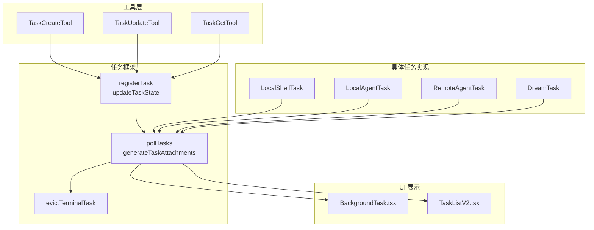
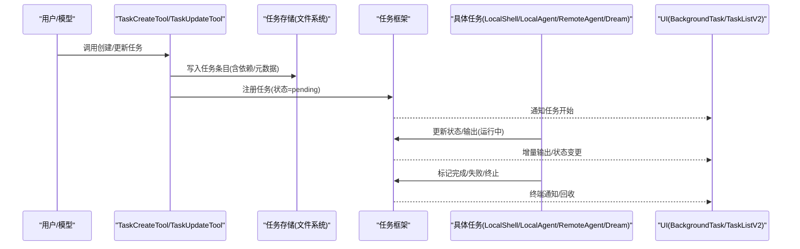
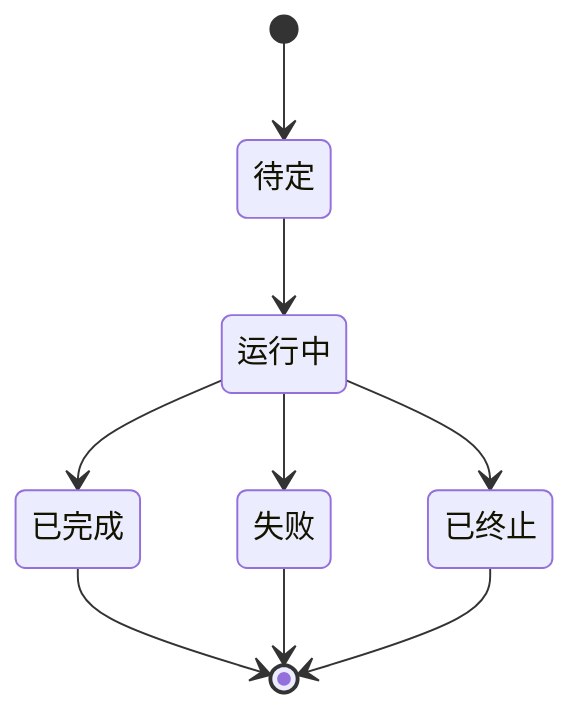
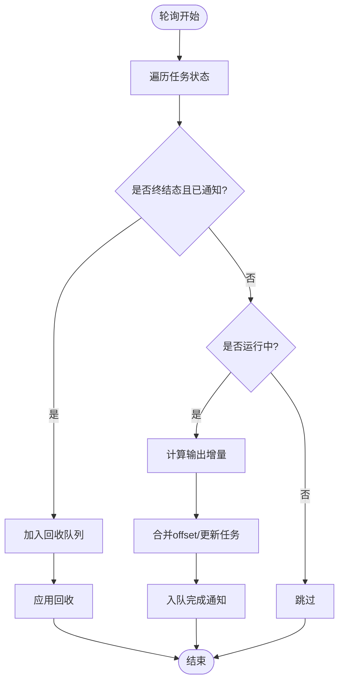
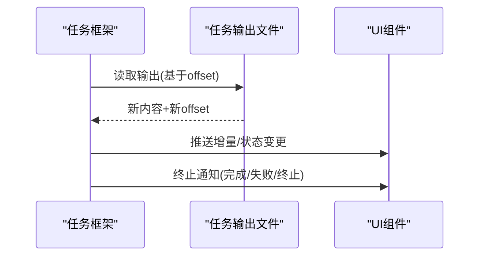
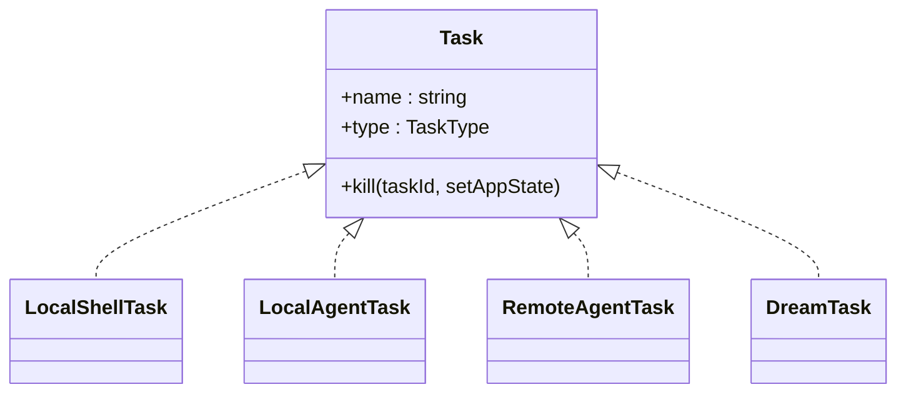

# 任务管理系统

<cite>
**本文引用的文件**
- [src/Task.ts](file://src/Task.ts)
- [src/tasks.ts](file://src/tasks.ts)
- [src/tasks/types.ts](file://src/tasks/types.ts)
- [src/utils/task/framework.ts](file://src/utils/task/framework.ts)
- [src/tasks/LocalShellTask/LocalShellTask.tsx](file://src/tasks/LocalShellTask/LocalShellTask.tsx)
- [src/tasks/LocalAgentTask/LocalAgentTask.tsx](file://src/tasks/LocalAgentTask/LocalAgentTask.tsx)
- [src/tasks/RemoteAgentTask/RemoteAgentTask.tsx](file://src/tasks/RemoteAgentTask/RemoteAgentTask.tsx)
- [src/tasks/DreamTask/DreamTask.ts](file://src/tasks/DreamTask/DreamTask.ts)
- [src/tools/TaskCreateTool/TaskCreateTool.ts](file://src/tools/TaskCreateTool/TaskCreateTool.ts)
- [src/tools/TaskUpdateTool/TaskUpdateTool.ts](file://src/tools/TaskUpdateTool/TaskUpdateTool.ts)
- [src/tools/TaskGetTool/TaskGetTool.ts](file://src/tools/TaskGetTool/TaskGetTool.ts)
- [src/components/tasks/BackgroundTask.tsx](file://src/components/tasks/BackgroundTask.tsx)
- [src/components/TaskListV2.tsx](file://src/components/TaskListV2.tsx)
- [src/utils/messages.ts](file://src/utils/messages.ts)
- [docs/tools/task-management.mdx](file://docs/tools/task-management.mdx)
</cite>

## 目录
1. [简介](#简介)
2. [项目结构](#项目结构)
3. [核心组件](#核心组件)
4. [架构总览](#架构总览)
5. [详细组件分析](#详细组件分析)
6. [依赖关系分析](#依赖关系分析)
7. [性能考量](#性能考量)
8. [故障排查指南](#故障排查指南)
9. [结论](#结论)
10. [附录](#附录)

## 简介
本文件面向 Claude Code Best 的任务管理系统，系统性阐述任务类型、状态机与生命周期管理；解释本地任务、远程任务、代理任务与 Shell 任务的差异与适用场景；梳理任务调度、并发控制与资源分配策略；说明任务监控、进度展示与通知机制；给出启动、暂停、恢复与终止的流程与状态变化；并总结最佳实践与使用示例。

## 项目结构
任务管理由“工具层 + 任务框架 + 具体任务实现 + UI 展示”四部分构成：
- 工具层：提供创建、更新、查询任务的工具接口，驱动任务列表的文件系统持久化与并发安全。
- 任务框架：统一的任务注册、轮询、输出增量推送、终端任务回收等通用逻辑。
- 具体任务：本地 Shell、本地/远程代理、Dream 等任务类型的具体实现。
- UI 展示：后台任务指示器、任务列表的排序与截断策略、状态文本渲染。

图表来源
- [src/tools/TaskCreateTool/TaskCreateTool.ts:1-139](file://src/tools/TaskCreateTool/TaskCreateTool.ts#L1-L139)
- [src/tools/TaskUpdateTool/TaskUpdateTool.ts:1-200](file://src/tools/TaskUpdateTool/TaskUpdateTool.ts#L1-L200)
- [src/tools/TaskGetTool/TaskGetTool.ts:109-128](file://src/tools/TaskGetTool/TaskGetTool.ts#L109-L128)
- [src/utils/task/framework.ts:1-309](file://src/utils/task/framework.ts#L1-L309)
- [src/tasks/LocalShellTask/LocalShellTask.tsx:1-200](file://src/tasks/LocalShellTask/LocalShellTask.tsx#L1-L200)
- [src/tasks/LocalAgentTask/LocalAgentTask.tsx:1-200](file://src/tasks/LocalAgentTask/LocalAgentTask.tsx#L1-L200)
- [src/tasks/RemoteAgentTask/RemoteAgentTask.tsx:1-200](file://src/tasks/RemoteAgentTask/RemoteAgentTask.tsx#L1-L200)
- [src/tasks/DreamTask/DreamTask.ts:1-158](file://src/tasks/DreamTask/DreamTask.ts#L1-L158)
- [src/components/tasks/BackgroundTask.tsx:102-147](file://src/components/tasks/BackgroundTask.tsx#L102-L147)
- [src/components/TaskListV2.tsx:152-184](file://src/components/TaskListV2.tsx#L152-L184)

章节来源
- [docs/tools/task-management.mdx:1-19](file://docs/tools/task-management.mdx#L1-L19)
- [src/tasks.ts:1-40](file://src/tasks.ts#L1-L40)
- [src/tasks/types.ts:1-47](file://src/tasks/types.ts#L1-L47)

## 核心组件
- 任务类型与状态
  - 类型枚举包含本地 Shell、本地/远程代理、进程内同伴、工作流、MCP 监控、Dream 等。
  - 状态包括待定、运行中、已完成、失败、被终止，其中已完成/失败/被终止为终结态。
- 任务 ID 生成与前缀规则
  - 每类任务有固定前缀，保证跨会话可识别与兼容。
- 任务状态基元
  - 统一字段：id、type、status、description、toolUseId、startTime、endTime、totalPausedMs、outputFile、outputOffset、notified。
- 任务框架
  - 注册、更新、轮询、增量输出合并、终端任务回收、SDK 事件上报、通知入队等。
- 工具接口
  - 创建、更新、查询任务，支持依赖阻塞关系、元数据、主动表单等。

章节来源
- [src/Task.ts:6-126](file://src/Task.ts#L6-L126)
- [src/tasks.ts:17-40](file://src/tasks.ts#L17-L40)
- [src/tasks/types.ts:12-47](file://src/tasks/types.ts#L12-L47)
- [src/utils/task/framework.ts:1-309](file://src/utils/task/framework.ts#L1-L309)
- [src/tools/TaskCreateTool/TaskCreateTool.ts:18-139](file://src/tools/TaskCreateTool/TaskCreateTool.ts#L18-L139)
- [src/tools/TaskUpdateTool/TaskUpdateTool.ts:33-200](file://src/tools/TaskUpdateTool/TaskUpdateTool.ts#L33-L200)
- [src/tools/TaskGetTool/TaskGetTool.ts:109-128](file://src/tools/TaskGetTool/TaskGetTool.ts#L109-L128)

## 架构总览
任务系统采用“工具驱动 + 任务框架 + 多任务类型”的分层设计：
- 工具层通过文件系统任务列表进行持久化，支持并发访问与 TOCTOU 防护。
- 任务框架负责轮询、增量输出、通知与回收，确保 UI 与模型侧及时感知状态变化。
- 各任务类型在自身实现中完成具体执行、输出写盘与状态推进，并通过框架统一上报。

图表来源
- [src/tools/TaskCreateTool/TaskCreateTool.ts:80-139](file://src/tools/TaskCreateTool/TaskCreateTool.ts#L80-L139)
- [src/tools/TaskUpdateTool/TaskUpdateTool.ts:136-200](file://src/tools/TaskUpdateTool/TaskUpdateTool.ts#L136-L200)
- [src/utils/task/framework.ts:77-117](file://src/utils/task/framework.ts#L77-L117)
- [src/utils/task/framework.ts:255-290](file://src/utils/task/framework.ts#L255-L290)
- [src/components/tasks/BackgroundTask.tsx:102-147](file://src/components/tasks/BackgroundTask.tsx#L102-L147)
- [src/components/TaskListV2.tsx:152-184](file://src/components/TaskListV2.tsx#L152-L184)

## 详细组件分析

### 任务类型与生命周期
- 本地 Shell 任务
  - 特点：执行命令行脚本，支持“bash/monitor”两类 UI 显示变体；具备卡顿检测（基于输出尾部与交互提示模式）。
  - 生命周期：创建 -> 待定 -> 运行 -> 完成/失败/终止；完成后入队通知，必要时回收输出。
- 本地代理任务
  - 特点：在本地运行智能体，记录工具调用、令牌用量、最近活动摘要；支持前台/后台模式与保留策略。
  - 生命周期：创建 -> 待定 -> 运行 -> 完成/失败/终止；面板有宽限期后回收。
- 远程代理任务
  - 特点：与远端会话联动，支持长任务、审查进度、超时与条件检查器；元数据持久化到会话边车。
  - 生命周期：创建 -> 待定 -> 运行 -> 完成/失败/终止；轮询外部事件推进。
- Dream 任务
  - 特点：内存整合子代理的后台任务，用于记忆巩固；UI 可见但不对外暴露模型通知路径。
  - 生命周期：创建 -> 运行 -> 完成/失败/终止；终止时回滚锁时间戳以允许重试。

图表来源
- [src/Task.ts:15-30](file://src/Task.ts#L15-L30)
- [src/tasks/LocalShellTask/LocalShellTask.tsx:146-200](file://src/tasks/LocalShellTask/LocalShellTask.tsx#L146-L200)
- [src/tasks/LocalAgentTask/LocalAgentTask.tsx:167-200](file://src/tasks/LocalAgentTask/LocalAgentTask.tsx#L167-L200)
- [src/tasks/RemoteAgentTask/RemoteAgentTask.tsx:58-95](file://src/tasks/RemoteAgentTask/RemoteAgentTask.tsx#L58-L95)
- [src/tasks/DreamTask/DreamTask.ts:25-41](file://src/tasks/DreamTask/DreamTask.ts#L25-L41)

章节来源
- [src/tasks/LocalShellTask/LocalShellTask.tsx:1-200](file://src/tasks/LocalShellTask/LocalShellTask.tsx#L1-L200)
- [src/tasks/LocalAgentTask/LocalAgentTask.tsx:1-200](file://src/tasks/LocalAgentTask/LocalAgentTask.tsx#L1-L200)
- [src/tasks/RemoteAgentTask/RemoteAgentTask.tsx:1-200](file://src/tasks/RemoteAgentTask/RemoteAgentTask.tsx#L1-L200)
- [src/tasks/DreamTask/DreamTask.ts:1-158](file://src/tasks/DreamTask/DreamTask.ts#L1-L158)

### 任务调度与并发控制
- 轮询与增量输出
  - 框架以固定轮询间隔扫描所有任务，计算输出增量并合并 offset，避免竞态与覆盖。
- 终端任务回收
  - 在被消费且处于终结态后延迟回收，释放内存；面板保留策略对特定类型生效。
- 并发安全
  - 任务列表基于文件系统持久化，结合高水位标记与 TOCTOU 防护，支持多 Agent 并发访问。
- 依赖与阻塞
  - 支持 blocks 与 blockedBy 字段，更新时校验循环依赖，阻塞任务在依赖未解除前保持待定。

图表来源
- [src/utils/task/framework.ts:158-206](file://src/utils/task/framework.ts#L158-L206)
- [src/utils/task/framework.ts:213-249](file://src/utils/task/framework.ts#L213-L249)
- [src/utils/task/framework.ts:255-290](file://src/utils/task/framework.ts#L255-L290)

章节来源
- [src/utils/task/framework.ts:21-290](file://src/utils/task/framework.ts#L21-L290)

### 任务监控与跟踪
- 输出增量与偏移
  - 每个任务维护 outputOffset，框架仅推送自上次偏移以来的新内容，降低传输与渲染压力。
- 通知与摘要
  - 完成/失败/终止时生成带状态与摘要的 XML 通知，携带任务 ID、类型、输出路径等。
- UI 展示
  - 后台任务指示器根据状态与背景化标志筛选显示；任务列表按“最近完成、进行中、待定、较旧完成”顺序截断显示。

图表来源
- [src/utils/task/framework.ts:158-206](file://src/utils/task/framework.ts#L158-L206)
- [src/utils/task/framework.ts:274-290](file://src/utils/task/framework.ts#L274-L290)
- [src/components/tasks/BackgroundTask.tsx:102-147](file://src/components/tasks/BackgroundTask.tsx#L102-L147)
- [src/components/TaskListV2.tsx:152-184](file://src/components/TaskListV2.tsx#L152-L184)

章节来源
- [src/components/tasks/BackgroundTask.tsx:102-147](file://src/components/tasks/BackgroundTask.tsx#L102-L147)
- [src/components/TaskListV2.tsx:152-184](file://src/components/TaskListV2.tsx#L152-L184)

### 启动、暂停、恢复与终止
- 启动
  - 工具调用创建任务并注册到框架；状态从“待定”进入“运行中”，同时上报 SDK 事件。
- 暂停/恢复
  - 任务框架未直接暴露暂停/恢复 API；可通过任务类型内部机制（如代理任务的保留/回收）间接实现。
- 终止
  - 任一任务类型均可调用 kill，将状态置为“已终止”，并触发回收与锁回滚（如 Dream 任务）。

章节来源
- [src/utils/task/framework.ts:77-117](file://src/utils/task/framework.ts#L77-L117)
- [src/tasks/DreamTask/DreamTask.ts:132-158](file://src/tasks/DreamTask/DreamTask.ts#L132-L158)

### 工具接口与数据模型
- 创建任务
  - 输入：主题、描述、主动表单、元数据；输出：任务 ID 与主题。
- 更新任务
  - 输入：任务 ID、主题/描述/主动表单、状态、阻塞关系、所有者、元数据；输出：更新字段与状态变更摘要。
- 查询任务
  - 输出：任务详情（含阻塞/被阻塞关系）。

章节来源
- [src/tools/TaskCreateTool/TaskCreateTool.ts:18-139](file://src/tools/TaskCreateTool/TaskCreateTool.ts#L18-L139)
- [src/tools/TaskUpdateTool/TaskUpdateTool.ts:33-200](file://src/tools/TaskUpdateTool/TaskUpdateTool.ts#L33-L200)
- [src/tools/TaskGetTool/TaskGetTool.ts:109-128](file://src/tools/TaskGetTool/TaskGetTool.ts#L109-L128)

## 依赖关系分析
- 任务类型注册
  - getAllTasks 动态聚合各任务类型，支持特性开关（如工作流脚本、MCP 监控）。
- 任务状态联合
  - TaskState 聚合所有任务状态类型，供 UI 与工具层统一处理。
- UI 与任务框架耦合
  - UI 通过 isBackgroundTask 判断是否纳入后台任务指示器；任务列表按状态与依赖排序。

图表来源
- [src/tasks.ts:22-40](file://src/tasks.ts#L22-L40)
- [src/tasks/types.ts:12-47](file://src/tasks/types.ts#L12-L47)

章节来源
- [src/tasks.ts:1-40](file://src/tasks.ts#L1-L40)
- [src/tasks/types.ts:1-47](file://src/tasks/types.ts#L1-L47)

## 性能考量
- 轮询间隔与增量推送
  - 固定轮询间隔平衡实时性与开销；仅推送增量输出，减少 IO 与渲染压力。
- 终端任务回收
  - 在被消费后延迟回收，避免频繁创建/销毁带来的抖动。
- UI 截断与排序
  - 任务列表对“最近完成、进行中、待定、较旧完成”进行优先级排序与截断，提升可读性与性能。

章节来源
- [src/utils/task/framework.ts:21-290](file://src/utils/task/framework.ts#L21-L290)
- [src/components/TaskListV2.tsx:152-184](file://src/components/TaskListV2.tsx#L152-L184)

## 故障排查指南
- 任务长时间无输出
  - 检查是否为交互式命令卡住；框架会检测输出尾部是否为交互提示，必要时发出“等待交互输入”的通知。
- 任务状态未更新
  - 确认输出文件偏移是否正确推进；核对框架轮询与增量合并逻辑。
- 任务被提前回收
  - 确认任务是否已终结且被标记为已通知；面板保留策略可能延后回收。
- 提醒未出现
  - 若长时间未使用任务工具，系统会发送温和提醒，可参考相关消息源码位置。

章节来源
- [src/tasks/LocalShellTask/LocalShellTask.tsx:73-144](file://src/tasks/LocalShellTask/LocalShellTask.tsx#L73-L144)
- [src/utils/task/framework.ts:158-249](file://src/utils/task/framework.ts#L158-L249)
- [src/utils/messages.ts:3726-3729](file://src/utils/messages.ts#L3726-L3729)

## 结论
该任务系统通过“工具 + 框架 + 多任务类型 + UI”的清晰分层，实现了跨会话持久化、增量输出、终端回收与统一通知；不同任务类型覆盖本地 Shell、本地/远程代理与后台整合等典型场景。建议在实际使用中充分利用依赖关系、主动表单与元数据，结合 UI 的优先级排序与截断策略，提升任务管理效率与可观测性。

## 附录
- 使用示例与配置要点
  - 创建任务：提供主题、描述与可选主动表单；系统自动展开任务视图。
  - 更新任务：支持修改状态、阻塞关系、所有者与元数据；自动设置所有者（在启用代理集群时）。
  - 查询任务：查看阻塞/被阻塞关系与当前状态摘要。
- 最佳实践
  - 将长耗时任务拆分为可追踪的小步骤，明确依赖关系，及时更新状态。
  - 对交互式命令使用非交互参数或管道输入，避免卡顿通知误报。
  - 合理使用元数据标注任务来源与上下文，便于后续检索与审计。

章节来源
- [src/tools/TaskCreateTool/TaskCreateTool.ts:80-139](file://src/tools/TaskCreateTool/TaskCreateTool.ts#L80-L139)
- [src/tools/TaskUpdateTool/TaskUpdateTool.ts:136-200](file://src/tools/TaskUpdateTool/TaskUpdateTool.ts#L136-L200)
- [src/tools/TaskGetTool/TaskGetTool.ts:109-128](file://src/tools/TaskGetTool/TaskGetTool.ts#L109-L128)