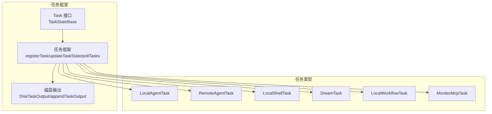
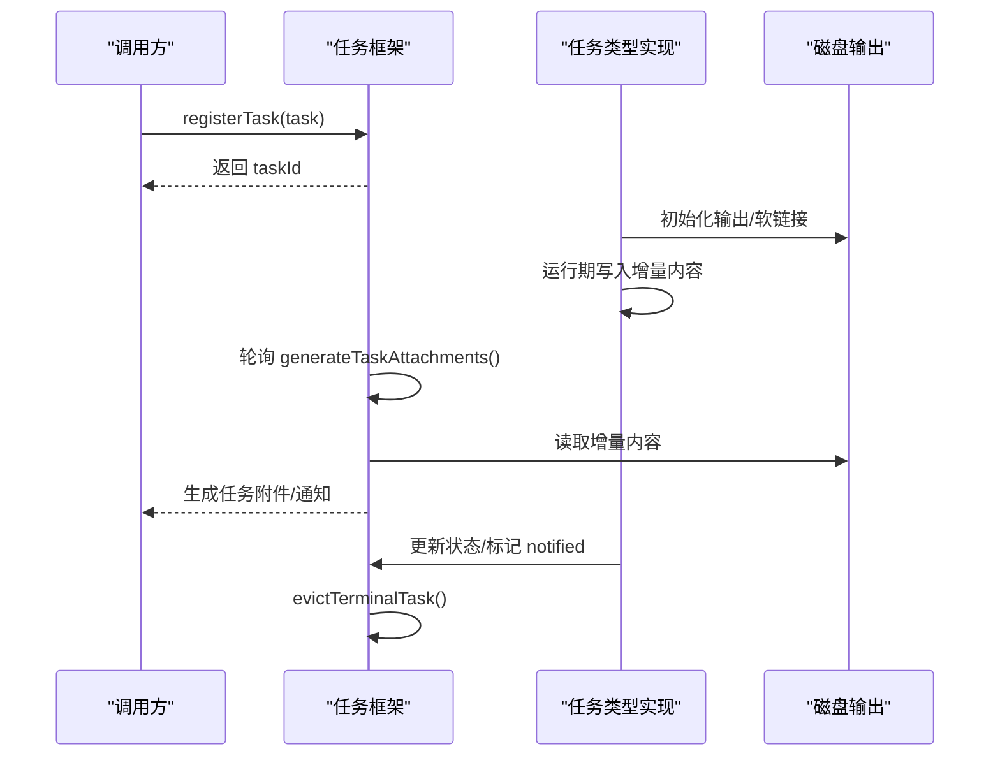
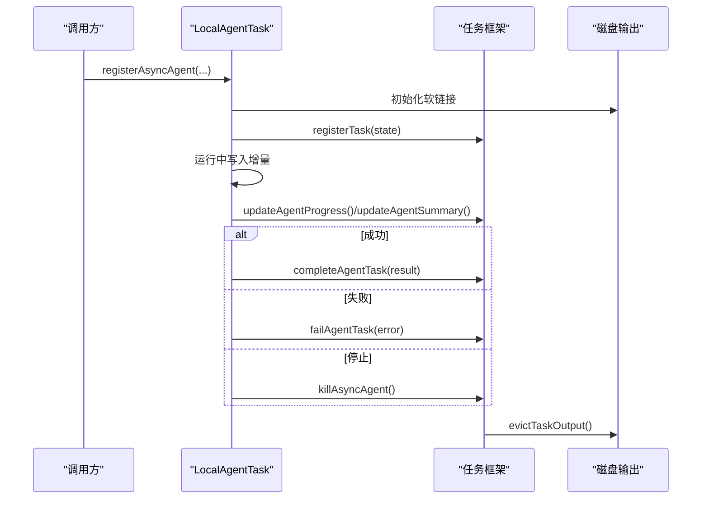
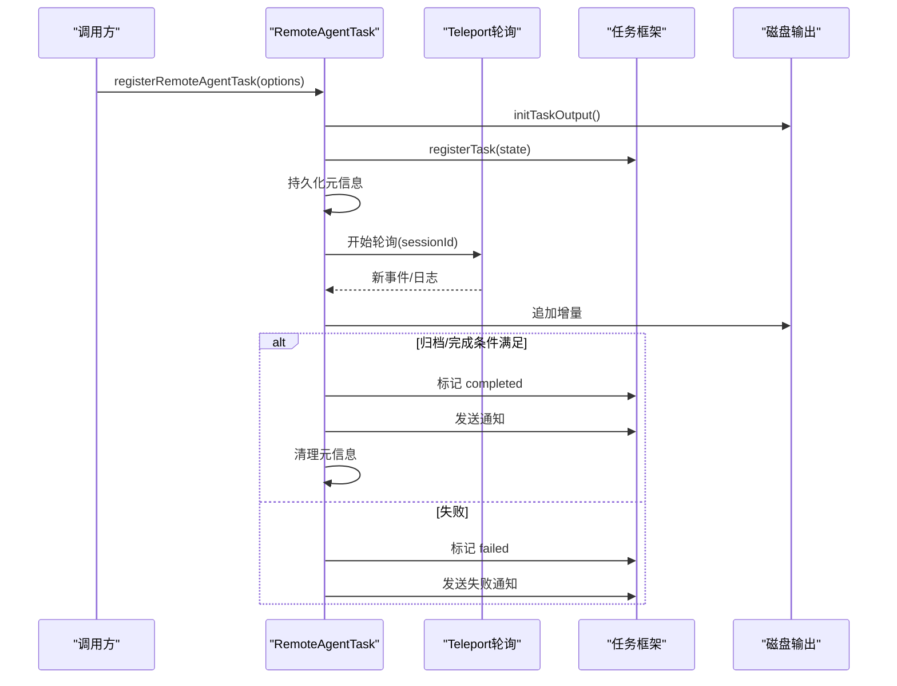
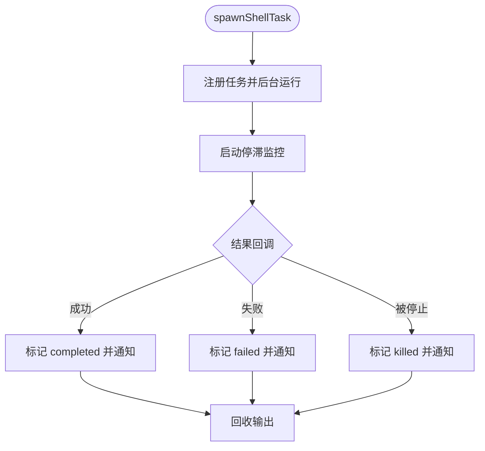
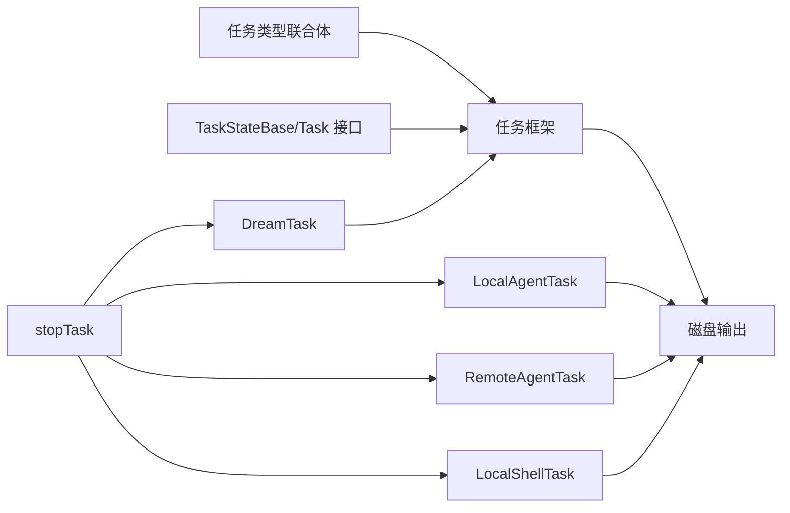

# 任务类型与分类

<cite>
**本文引用的文件**
- [src/tasks/types.ts](file://src/tasks/types.ts)
- [src/Task.ts](file://src/Task.ts)
- [src/utils/task/framework.ts](file://src/utils/task/framework.ts)
- [src/utils/task/diskOutput.ts](file://src/utils/task/diskOutput.ts)
- [src/tasks/LocalAgentTask/LocalAgentTask.tsx](file://src/tasks/LocalAgentTask/LocalAgentTask.tsx)
- [src/tasks/RemoteAgentTask/RemoteAgentTask.tsx](file://src/tasks/RemoteAgentTask/RemoteAgentTask.tsx)
- [src/tasks/LocalShellTask/LocalShellTask.tsx](file://src/tasks/LocalShellTask/LocalShellTask.tsx)
- [src/tasks/DreamTask/DreamTask.ts](file://src/tasks/DreamTask/DreamTask.ts)
- [src/tasks/LocalWorkflowTask/LocalWorkflowTask.ts](file://src/tasks/LocalWorkflowTask/LocalWorkflowTask.ts)
- [src/tasks/MonitorMcpTask/MonitorMcpTask.ts](file://src/tasks/MonitorMcpTask/MonitorMcpTask.ts)
- [src/tasks/stopTask.ts](file://src/tasks/stopTask.ts)
</cite>

## 目录
1. [引言](#引言)
2. [项目结构](#项目结构)
3. [核心组件](#核心组件)
4. [架构总览](#架构总览)
5. [详细组件分析](#详细组件分析)
6. [依赖关系分析](#依赖关系分析)
7. [性能考量](#性能考量)
8. [故障排查指南](#故障排查指南)
9. [结论](#结论)
10. [附录](#附录)

## 引言
本文件系统性梳理 Claude Code Best 的任务类型体系，聚焦以下七类任务：本地代理任务（LocalAgentTask）、远程代理任务（RemoteAgentTask）、本地 Shell 任务（LocalShellTask）、Dream 任务（DreamTask）、本地工作流任务（LocalWorkflowTask）与 MCP 监控任务（MonitorMcpTask）。文档从架构、数据流、执行机制、资源配置、状态管理、生命周期与错误处理等维度进行深入解析，并给出选型建议与最佳实践。

## 项目结构
任务系统围绕统一的任务框架与输出通道构建：
- 统一任务接口与基元：Task 接口、TaskStateBase、任务 ID 生成与注册。
- 任务框架：轮询、增量输出、通知、回收。
- 输出通道：磁盘输出（DiskTaskOutput）与软链接（symlink）桥接，支持安全写入与上限控制。
- 具体任务实现：按类型封装状态、生命周期钩子、资源清理与通知。

图表来源
- [src/Task.ts:1-126](file://src/Task.ts#L1-L126)
- [src/utils/task/framework.ts:1-309](file://src/utils/task/framework.ts#L1-L309)
- [src/utils/task/diskOutput.ts:1-452](file://src/utils/task/diskOutput.ts#L1-L452)
- [src/tasks/LocalAgentTask/LocalAgentTask.tsx:1-805](file://src/tasks/LocalAgentTask/LocalAgentTask.tsx#L1-L805)
- [src/tasks/RemoteAgentTask/RemoteAgentTask.tsx:1-1103](file://src/tasks/RemoteAgentTask/RemoteAgentTask.tsx#L1-L1103)
- [src/tasks/LocalShellTask/LocalShellTask.tsx:1-652](file://src/tasks/LocalShellTask/LocalShellTask.tsx#L1-L652)
- [src/tasks/DreamTask/DreamTask.ts:1-158](file://src/tasks/DreamTask/DreamTask.ts#L1-L158)
- [src/tasks/LocalWorkflowTask/LocalWorkflowTask.ts:1-12](file://src/tasks/LocalWorkflowTask/LocalWorkflowTask.ts#L1-L12)
- [src/tasks/MonitorMcpTask/MonitorMcpTask.ts:1-11](file://src/tasks/MonitorMcpTask/MonitorMcpTask.ts#L1-L11)

章节来源
- [src/Task.ts:1-126](file://src/Task.ts#L1-L126)
- [src/utils/task/framework.ts:1-309](file://src/utils/task/framework.ts#L1-L309)
- [src/utils/task/diskOutput.ts:1-452](file://src/utils/task/diskOutput.ts#L1-L452)

## 核心组件
- 任务类型与联合状态
  - 任务类型枚举与联合状态类型用于 UI 与框架层统一处理不同任务。
  - 背景任务判定逻辑：运行中或待定且未前台化的任务才进入后台指示器。
- 任务基元
  - TaskStateBase：所有任务共享的字段（id、type、status、description、时间戳、输出路径、通知标记等）。
  - Task 接口：统一的 kill 方法，便于通过类型分发停止任意任务。
  - 任务 ID 生成：带前缀的唯一 ID，避免冲突并兼容历史版本。
- 任务框架
  - 注册与更新：registerTask、updateTaskState；支持替换恢复时保留 UI 状态。
  - 轮询与增量：pollTasks、generateTaskAttachments、applyTaskOffsetsAndEvictions。
  - 通知：enqueueTaskNotification，统一输出 XML 标签的任务通知。
  - 回收：evictTerminalTask，终端且已通知的任务延迟回收。
- 磁盘输出
  - DiskTaskOutput：队列化写入、限流、断线重试、容量上限与截断提示。
  - 输出文件管理：初始化、软链接桥接、读取尾部内容、获取偏移增量。

章节来源
- [src/tasks/types.ts:1-47](file://src/tasks/types.ts#L1-L47)
- [src/Task.ts:44-126](file://src/Task.ts#L44-L126)
- [src/utils/task/framework.ts:48-309](file://src/utils/task/framework.ts#L48-L309)
- [src/utils/task/diskOutput.ts:97-452](file://src/utils/task/diskOutput.ts#L97-L452)

## 架构总览
任务系统采用“统一框架 + 多任务类型”的分层设计：
- 框架层负责状态持久化、轮询、增量推送与回收。
- 类型层封装各自生命周期、资源管理与通知策略。
- 输出层以磁盘文件为载体，支持软链接直达会话转录，或管道式追加。

图表来源
- [src/utils/task/framework.ts:77-144](file://src/utils/task/framework.ts#L77-L144)
- [src/utils/task/framework.ts:158-206](file://src/utils/task/framework.ts#L158-L206)
- [src/utils/task/diskOutput.ts:268-330](file://src/utils/task/diskOutput.ts#L268-L330)

## 详细组件分析

### 本地代理任务 LocalAgentTask
- 定义与状态
  - 任务类型：local_agent；扩展状态包含 agentId、prompt、selectedAgent、model、进度追踪、消息队列、保留与回收时间等。
  - 进度追踪：统计工具使用次数、输入/输出 token 数、最近活动列表，支持摘要更新。
- 生命周期
  - 注册：registerAsyncAgent/registerAgentForeground；支持父任务中断联动、自动后台化。
  - 后台化：backgroundAgentTask；触发信号中断主循环，切换 isBackgrounded。
  - 结束：completeAgentTask/failAgentTask/killAsyncAgent；统一清理、通知与输出回收。
- 执行机制
  - 使用 AbortController 与清理注册，确保异常退出时资源释放。
  - 与会话转录目录建立软链接，便于 UI 与 SDK 访问。
- 配置参数
  - agentId、description、prompt、selectedAgent、parentAbortController、toolUseId。
- 错误处理
  - 失败时发送通知并回收输出；可抑制重复通知。
- 最佳实践
  - 长任务建议先前台展示再自动后台，提升交互体验。
  - 使用摘要更新承载后台进度，避免频繁刷新。

图表来源
- [src/tasks/LocalAgentTask/LocalAgentTask.tsx:574-630](file://src/tasks/LocalAgentTask/LocalAgentTask.tsx#L574-L630)
- [src/tasks/LocalAgentTask/LocalAgentTask.tsx:641-734](file://src/tasks/LocalAgentTask/LocalAgentTask.tsx#L641-L734)
- [src/tasks/LocalAgentTask/LocalAgentTask.tsx:509-564](file://src/tasks/LocalAgentTask/LocalAgentTask.tsx#L509-L564)
- [src/tasks/LocalAgentTask/LocalAgentTask.tsx:358-388](file://src/tasks/LocalAgentTask/LocalAgentTask.tsx#L358-L388)
- [src/utils/task/framework.ts:77-117](file://src/utils/task/framework.ts#L77-L117)
- [src/utils/task/diskOutput.ts:427-451](file://src/utils/task/diskOutput.ts#L427-L451)

章节来源
- [src/tasks/LocalAgentTask/LocalAgentTask.tsx:167-199](file://src/tasks/LocalAgentTask/LocalAgentTask.tsx#L167-L199)
- [src/tasks/LocalAgentTask/LocalAgentTask.tsx:426-504](file://src/tasks/LocalAgentTask/LocalAgentTask.tsx#L426-L504)
- [src/tasks/LocalAgentTask/LocalAgentTask.tsx:574-734](file://src/tasks/LocalAgentTask/LocalAgentTask.tsx#L574-L734)
- [src/tasks/LocalAgentTask/LocalAgentTask.tsx:358-388](file://src/tasks/LocalAgentTask/LocalAgentTask.tsx#L358-L388)

### 远程代理任务 RemoteAgentTask
- 定义与状态
  - 任务类型：remote_agent；支持多种 remoteTaskType（如 remote-agent、ultraplan、ultrareview、autofix-pr、background-pr）。
  - 关键字段：sessionId、command、title、todoList、日志累积、长任务标志、审查进度、超时控制。
- 生命周期
  - 注册：registerRemoteAgentTask；初始化输出文件、注册任务、持久化元信息、启动轮询。
  - 恢复：restoreRemoteAgentTasks；重启轮询并重建状态。
  - 结束：轮询检测到归档或自定义检查器返回完成文本后，发送通知并回收。
- 执行机制
  - 通过 Teleport API 轮询事件，增量写入输出文件；支持审查进度标签解析。
  - 支持失败/成功通知模板，ultraplan 特殊失败通知。
- 配置参数
  - remoteTaskType、session（id/title）、command、context、toolUseId、isRemoteReview/isUltraplan/isLongRunning、remoteTaskMetadata。
- 错误处理
  - 网络/权限异常区分处理；404 视为会话不存在，清理侧车元信息。
- 最佳实践
  - 长任务与审查任务需设置超时与稳定空闲检测，避免误判完成。

图表来源
- [src/tasks/RemoteAgentTask/RemoteAgentTask.tsx:500-580](file://src/tasks/RemoteAgentTask/RemoteAgentTask.tsx#L500-L580)
- [src/tasks/RemoteAgentTask/RemoteAgentTask.tsx:591-668](file://src/tasks/RemoteAgentTask/RemoteAgentTask.tsx#L591-L668)
- [src/tasks/RemoteAgentTask/RemoteAgentTask.tsx:674-800](file://src/tasks/RemoteAgentTask/RemoteAgentTask.tsx#L674-L800)
- [src/utils/task/framework.ts:255-269](file://src/utils/task/framework.ts#L255-L269)
- [src/utils/task/diskOutput.ts:268-281](file://src/utils/task/diskOutput.ts#L268-L281)

章节来源
- [src/tasks/RemoteAgentTask/RemoteAgentTask.tsx:58-95](file://src/tasks/RemoteAgentTask/RemoteAgentTask.tsx#L58-L95)
- [src/tasks/RemoteAgentTask/RemoteAgentTask.tsx:500-580](file://src/tasks/RemoteAgentTask/RemoteAgentTask.tsx#L500-L580)
- [src/tasks/RemoteAgentTask/RemoteAgentTask.tsx:674-800](file://src/tasks/RemoteAgentTask/RemoteAgentTask.tsx#L674-L800)

### 本地 Shell 任务 LocalShellTask
- 定义与状态
  - 任务类型：local_bash；支持 bash 与 monitor 两类显示变体。
  - 关键字段：command、completionStatusSentInAttachment、shellCommand、lastReportedTotalLines、isBackgrounded、agentId、kind。
- 生命周期
  - 启动：spawnShellTask；注册任务、后台运行、启动停滞监控。
  - 后台化：backgroundTask/backgroundExistingForegroundTask；切换 isBackgrounded 并继续接收输出。
  - 结束：结果回调中统一标记状态、发送通知、回收输出。
- 执行机制
  - 通过 ShellCommand 的 background/result 生命周期驱动；使用 DiskTaskOutput 自动写入。
  - 停滞检测：基于输出文件大小增长与尾部内容匹配交互式提示模式，触发一次性通知。
- 配置参数
  - command、description、timeout、toolUseId、agentId、kind。
- 错误处理
  - 退出码非零标记失败；对被停止的 bash 任务抑制噪声通知，直接发出 SDK 事件。
- 最佳实践
  - 对可能交互阻塞的命令启用监视模式，提前发现卡住的提示。

图表来源
- [src/tasks/LocalShellTask/LocalShellTask.tsx:235-319](file://src/tasks/LocalShellTask/LocalShellTask.tsx#L235-L319)
- [src/tasks/LocalShellTask/LocalShellTask.tsx:360-461](file://src/tasks/LocalShellTask/LocalShellTask.tsx#L360-L461)
- [src/tasks/LocalShellTask/LocalShellTask.tsx:608-652](file://src/tasks/LocalShellTask/LocalShellTask.tsx#L608-L652)
- [src/utils/task/diskOutput.ts:268-281](file://src/utils/task/diskOutput.ts#L268-L281)

章节来源
- [src/tasks/LocalShellTask/LocalShellTask.tsx:235-319](file://src/tasks/LocalShellTask/LocalShellTask.tsx#L235-L319)
- [src/tasks/LocalShellTask/LocalShellTask.tsx:360-461](file://src/tasks/LocalShellTask/LocalShellTask.tsx#L360-L461)
- [src/tasks/LocalShellTask/LocalShellTask.tsx:608-652](file://src/tasks/LocalShellTask/LocalShellTask.tsx#L608-L652)

### Dream 任务 DreamTask
- 定义与状态
  - 任务类型：dream；用于记忆整合（auto-dream）的 UI 可见化。
  - 关键字段：phase（starting/updating）、sessionsReviewing、filesTouched、turns、abortController、priorMtime。
- 生命周期
  - 注册：registerDreamTask；生成 taskId 并注册。
  - 运行：addDreamTurn；合并最近对话回合与文件触达路径。
  - 结束：completeDreamTask/failDreamTask；立即标记 notified 并回收。
- 执行机制
  - 仅 UI 展示用途，不面向模型输出；终止时回滚锁时间以便重试。
- 配置参数
  - sessionsReviewing、priorMtime、abortController。
- 最佳实践
  - 作为后台记忆整合流程的轻量 UI 通道，避免过度渲染。

章节来源
- [src/tasks/DreamTask/DreamTask.ts:25-41](file://src/tasks/DreamTask/DreamTask.ts#L25-L41)
- [src/tasks/DreamTask/DreamTask.ts:52-104](file://src/tasks/DreamTask/DreamTask.ts#L52-L104)
- [src/tasks/DreamTask/DreamTask.ts:106-158](file://src/tasks/DreamTask/DreamTask.ts#L106-L158)

### 本地工作流任务 LocalWorkflowTask
- 当前状态
  - 为占位桩实现，包含基础状态与占位方法（killWorkflowTask、skipWorkflowAgent、retryWorkflowAgent），尚未实现具体逻辑。
- 选型建议
  - 在工作流编排落地后再行填充，避免过早耦合。

章节来源
- [src/tasks/LocalWorkflowTask/LocalWorkflowTask.ts:4-12](file://src/tasks/LocalWorkflowTask/LocalWorkflowTask.ts#L4-L12)

### MCP 监控任务 MonitorMcpTask
- 当前状态
  - 为占位桩实现，包含基础状态与占位方法（killMonitorMcp、killMonitorMcpTasksForAgent），尚未实现具体逻辑。
- 选型建议
  - 在 MCP 协议监控能力完善后再行填充，确保与任务框架一致的生命周期与通知语义。

章节来源
- [src/tasks/MonitorMcpTask/MonitorMcpTask.ts:6-11](file://src/tasks/MonitorMcpTask/MonitorMcpTask.ts#L6-L11)

## 依赖关系分析
- 类型与框架
  - 任务类型联合体与背景任务判定依赖 TaskStateBase 与 TaskType。
  - 任务框架依赖磁盘输出模块进行增量读取与偏移更新。
- 具体任务
  - LocalAgentTask 依赖会话存储与软链接初始化。
  - RemoteAgentTask 依赖 Teleport 轮询与侧车元信息持久化。
  - LocalShellTask 依赖 ShellCommand 生命周期与磁盘输出。
  - DreamTask 依赖任务框架的回收与锁回滚。
- 停止任务
  - stopTask 通过 getTaskByType 分发到各任务类型的 kill 实现，统一标记 notified 并发出 SDK 事件。

图表来源
- [src/tasks/types.ts:12-29](file://src/tasks/types.ts#L12-L29)
- [src/Task.ts:44-76](file://src/Task.ts#L44-L76)
- [src/utils/task/framework.ts:48-117](file://src/utils/task/framework.ts#L48-L117)
- [src/utils/task/diskOutput.ts:268-330](file://src/utils/task/diskOutput.ts#L268-L330)
- [src/tasks/stopTask.ts:38-100](file://src/tasks/stopTask.ts#L38-L100)

章节来源
- [src/tasks/types.ts:12-47](file://src/tasks/types.ts#L12-L47)
- [src/Task.ts:44-76](file://src/Task.ts#L44-L76)
- [src/utils/task/framework.ts:48-117](file://src/utils/task/framework.ts#L48-L117)
- [src/tasks/stopTask.ts:38-100](file://src/tasks/stopTask.ts#L38-L100)

## 性能考量
- 写入与内存
  - DiskTaskOutput 使用队列与缓冲区即时释放，避免链式闭包导致的内存膨胀。
  - 采用 O_NOFOLLOW 与 EXCL 创建策略，降低攻击面并保证原子性。
- 读取与增量
  - 增量读取限制最大字节数，避免大文件全量加载；偏移更新在轮询阶段批量应用。
- 资源上限
  - 任务输出容量上限与截断提示，防止磁盘耗尽。
- 回收策略
  - 终端且 notified 的任务延迟回收，配合面板宽限期减少 UI 抖动。

章节来源
- [src/utils/task/diskOutput.ts:97-231](file://src/utils/task/diskOutput.ts#L97-L231)
- [src/utils/task/diskOutput.ts:304-330](file://src/utils/task/diskOutput.ts#L304-L330)
- [src/utils/task/framework.ts:125-144](file://src/utils/task/framework.ts#L125-L144)

## 故障排查指南
- 停止任务
  - 不在运行状态或任务不存在会抛出 StopTaskError，并携带错误码（not_found/not_running/unsupported_type）。
  - 对于本地 Shell 任务，停止时会抑制噪声通知并直接发出 SDK 事件。
- 远程任务
  - 404 表示会话不存在，侧车元信息将被清理；网络/权限错误视为可恢复，继续轮询。
  - 审查任务需稳定空闲检测，避免误判完成。
- 本地 Shell 任务
  - 若输出长时间无增长且尾部匹配交互提示，将触发一次性通知提醒用户；可通过管道或非交互参数解决。
- 本地代理任务
  - 失败时会发送通知并回收输出；摘要更新不会被进度覆盖，保持后台总结可见。

章节来源
- [src/tasks/stopTask.ts:10-18](file://src/tasks/stopTask.ts#L10-L18)
- [src/tasks/stopTask.ts:38-100](file://src/tasks/stopTask.ts#L38-L100)
- [src/tasks/RemoteAgentTask/RemoteAgentTask.tsx:601-668](file://src/tasks/RemoteAgentTask/RemoteAgentTask.tsx#L601-L668)
- [src/tasks/LocalShellTask/LocalShellTask.tsx:73-144](file://src/tasks/LocalShellTask/LocalShellTask.tsx#L73-L144)
- [src/tasks/LocalAgentTask/LocalAgentTask.tsx:426-504](file://src/tasks/LocalAgentTask/LocalAgentTask.tsx#L426-L504)

## 结论
该任务类型体系以统一框架为核心，结合磁盘输出与软链接机制，为本地与远程任务提供了稳定、可观测、可回收的执行环境。不同类型任务在生命周期、资源管理与通知策略上各有侧重：本地代理任务强调进度与摘要、远程代理任务强调轮询与审查、本地 Shell 任务强调交互与停滞监控、Dream 任务强调轻量 UI 可见化。对于尚未实现的工作流与 MCP 监控任务，建议在能力成熟后再行填充，确保与现有框架一致的契约与行为。

## 附录
- 任务类型选择建议
  - 需要模型驱动的多轮对话与工具调用：优先 LocalAgentTask。
  - 需要云端环境执行并长期轮询：优先 RemoteAgentTask。
  - 需要后台执行命令并观察输出：优先 LocalShellTask（monitor 变体适合持续流）。
  - 需要记忆整合的 UI 可见化：使用 DreamTask。
  - 工作流编排与团队协作：等待 LocalWorkflowTask 完善。
  - MCP 协议监控：等待 MonitorMcpTask 完善。