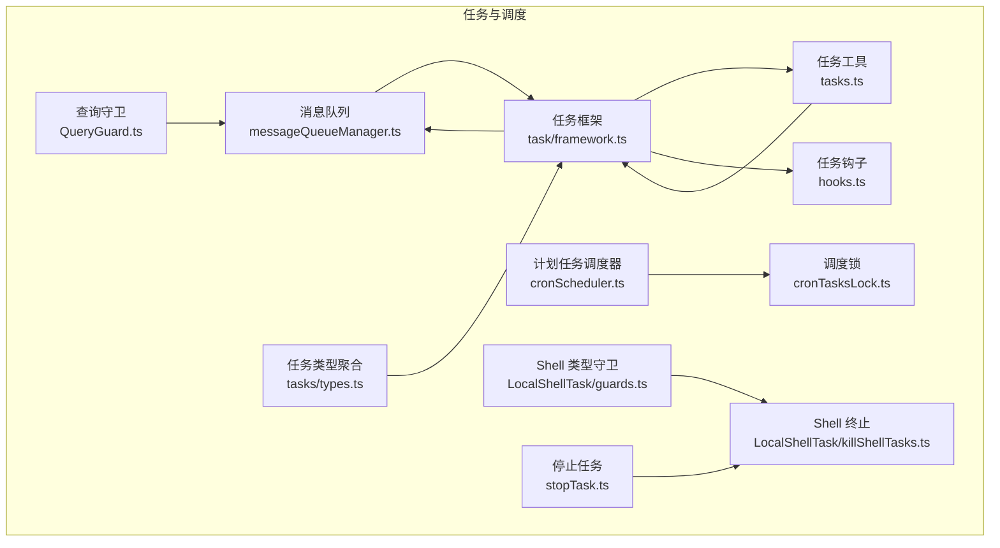
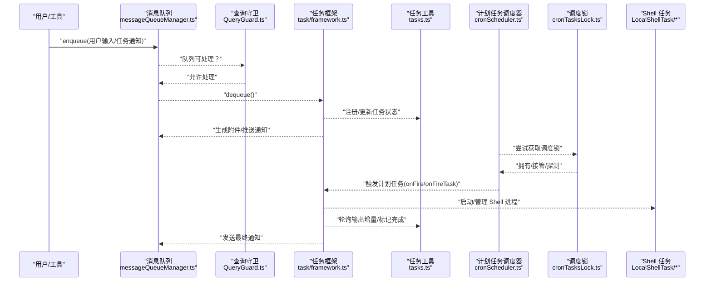
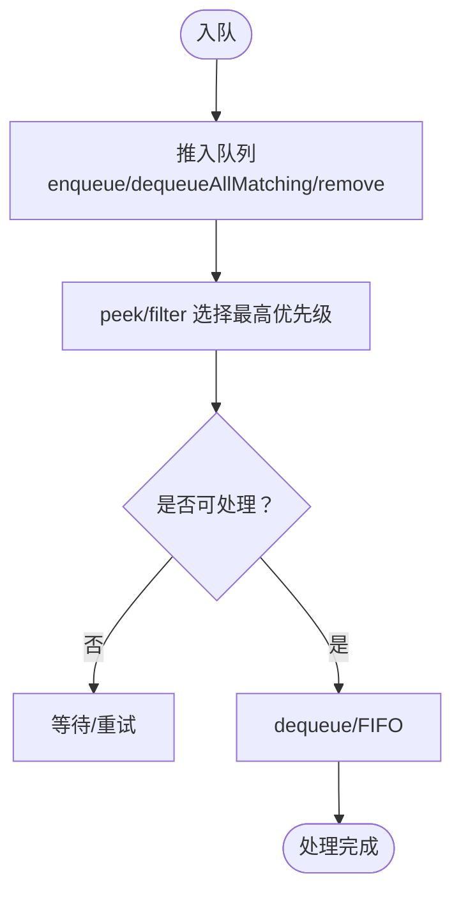
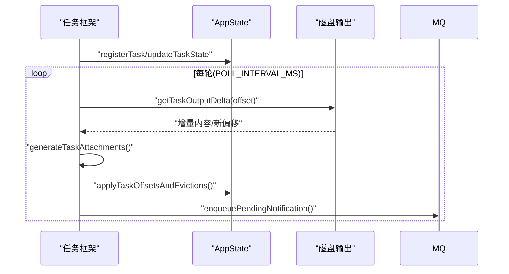
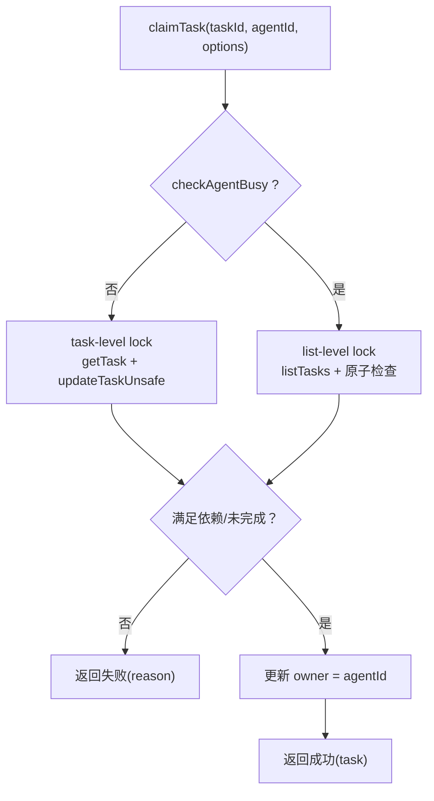
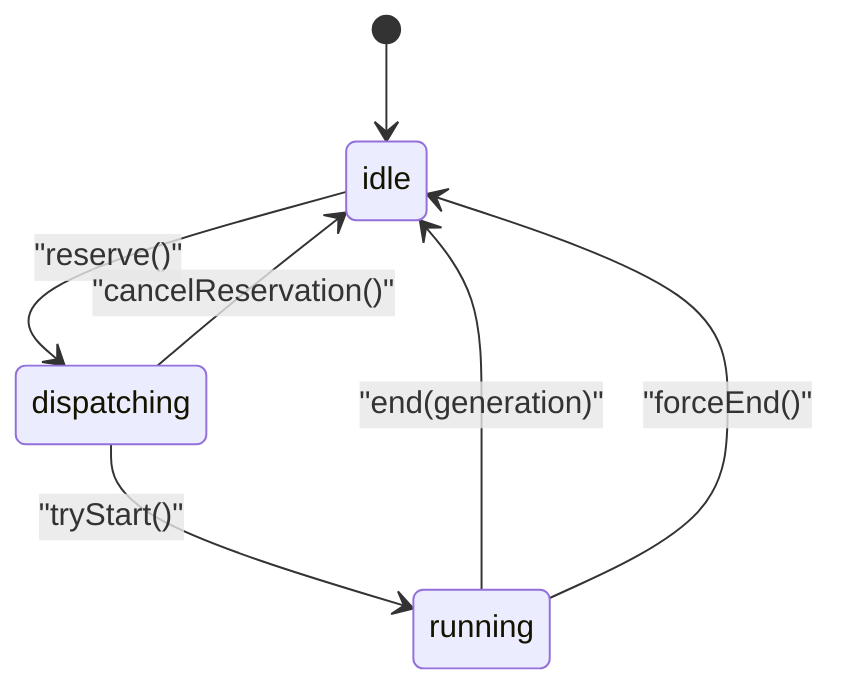
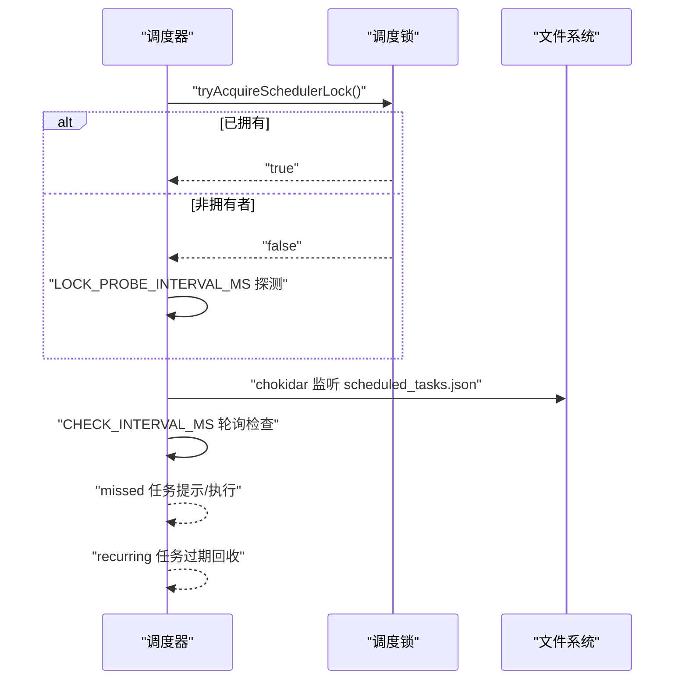
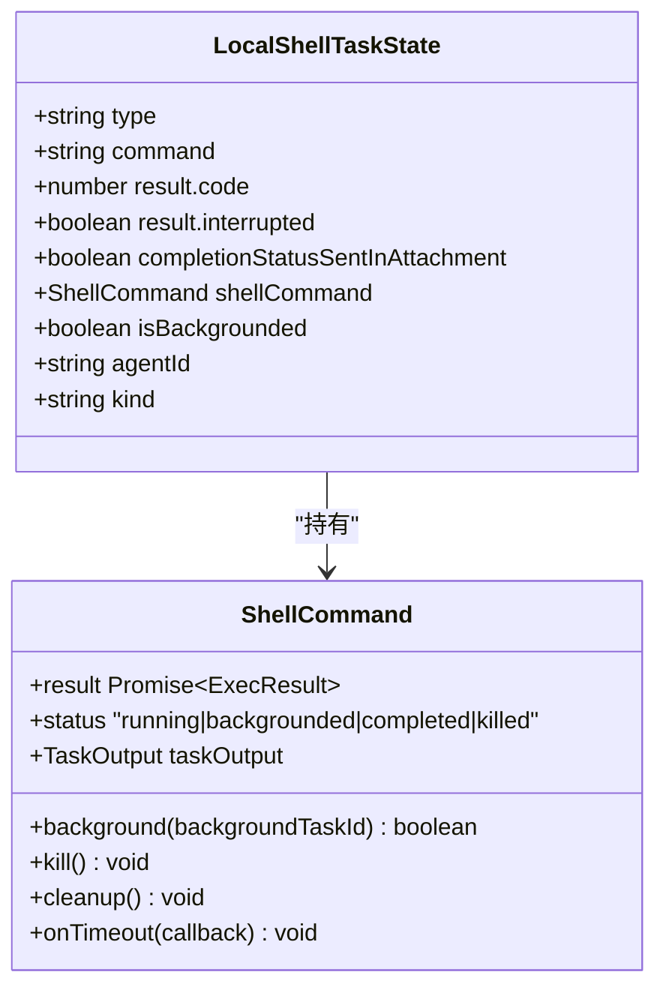
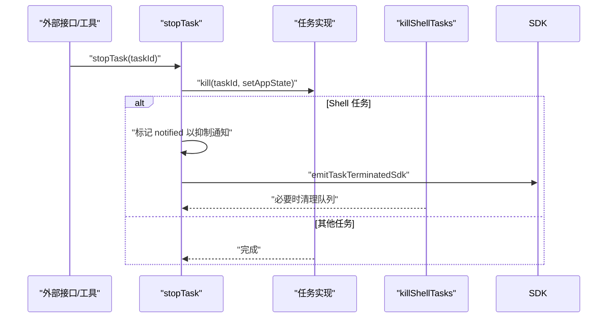
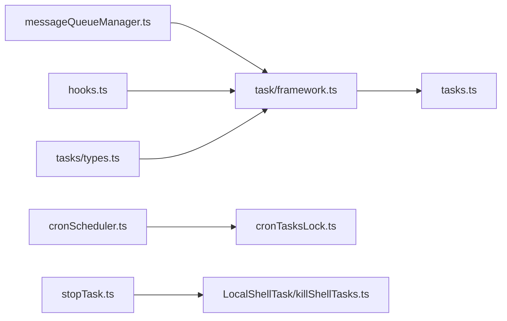

# 任务调度与执行

<cite>
**本文档引用的文件**
- [src/utils/messageQueueManager.ts](file://src/utils/messageQueueManager.ts)
- [src/utils/tasks.ts](file://src/utils/tasks.ts)
- [src/utils/task/framework.ts](file://src/utils/task/framework.ts)
- [src/utils/cronScheduler.ts](file://src/utils/cronScheduler.ts)
- [src/utils/cronTasksLock.ts](file://src/utils/cronTasksLock.ts)
- [src/utils/QueryGuard.ts](file://src/utils/QueryGuard.ts)
- [src/tasks/LocalShellTask/guards.ts](file://src/tasks/LocalShellTask/guards.ts)
- [src/tasks/LocalShellTask/killShellTasks.ts](file://src/tasks/LocalShellTask/killShellTasks.ts)
- [src/tasks/stopTask.ts](file://src/tasks/stopTask.ts)
- [src/utils/hooks.ts](file://src/utils/hooks.ts)
- [src/tasks/types.ts](file://src/tasks/types.ts)
- [docs/tools/task-management.mdx](file://docs/tools/task-management.mdx)
</cite>

## 目录
1. [简介](#简介)
2. [项目结构](#项目结构)
3. [核心组件](#核心组件)
4. [架构总览](#架构总览)
5. [详细组件分析](#详细组件分析)
6. [依赖关系分析](#依赖关系分析)
7. [性能考量](#性能考量)
8. [故障排除指南](#故障排除指南)
9. [结论](#结论)
10. [附录](#附录)

## 简介
本文件系统性梳理 Claude Code Best 的任务调度与执行体系，覆盖任务队列管理、优先级与并发控制、任务生命周期、停止与中断机制、任务守卫（guards）、Shell 任务的进程与资源管理，以及调度配置与调优建议。目标是帮助读者在理解整体设计的同时，掌握关键实现细节与最佳实践。

## 项目结构
围绕任务调度的关键模块分布如下：
- 任务数据模型与并发控制：src/utils/tasks.ts
- 任务框架与轮询：src/utils/task/framework.ts
- 统一命令队列与优先级：src/utils/messageQueueManager.ts
- 计划任务调度器：src/utils/cronScheduler.ts 及其锁机制 src/utils/cronTasksLock.ts
- 查询守卫（防止并发查询重入）：src/utils/QueryGuard.ts
- Shell 任务类型与终止：src/tasks/LocalShellTask/guards.ts、src/tasks/LocalShellTask/killShellTasks.ts、src/tasks/stopTask.ts
- 任务钩子（创建/完成等）：src/utils/hooks.ts
- 任务类型聚合：src/tasks/types.ts
- 任务依赖与并发控制说明：docs/tools/task-management.mdx

图表来源
- [src/utils/messageQueueManager.ts:128-193](file://src/utils/messageQueueManager.ts#L128-L193)
- [src/utils/task/framework.ts:255-269](file://src/utils/task/framework.ts#L255-L269)
- [src/utils/tasks.ts:541-612](file://src/utils/tasks.ts#L541-L612)
- [src/utils/cronScheduler.ts:142-157](file://src/utils/cronScheduler.ts#L142-L157)
- [src/utils/cronTasksLock.ts:111-173](file://src/utils/cronTasksLock.ts#L111-L173)
- [src/utils/QueryGuard.ts:29-80](file://src/utils/QueryGuard.ts#L29-L80)
- [src/tasks/LocalShellTask/guards.ts:34-42](file://src/tasks/LocalShellTask/guards.ts#L34-L42)
- [src/tasks/LocalShellTask/killShellTasks.ts:16-46](file://src/tasks/LocalShellTask/killShellTasks.ts#L16-L46)
- [src/tasks/stopTask.ts:38-100](file://src/tasks/stopTask.ts#L38-L100)
- [src/utils/hooks.ts:3896-3924](file://src/utils/hooks.ts#L3896-L3924)
- [src/tasks/types.ts:12-29](file://src/tasks/types.ts#L12-L29)

章节来源
- [src/utils/messageQueueManager.ts:128-193](file://src/utils/messageQueueManager.ts#L128-L193)
- [src/utils/tasks.ts:541-612](file://src/utils/tasks.ts#L541-L612)
- [src/utils/task/framework.ts:255-269](file://src/utils/task/framework.ts#L255-L269)
- [src/utils/cronScheduler.ts:142-157](file://src/utils/cronScheduler.ts#L142-L157)
- [src/utils/cronTasksLock.ts:111-173](file://src/utils/cronTasksLock.ts#L111-L173)
- [src/utils/QueryGuard.ts:29-80](file://src/utils/QueryGuard.ts#L29-L80)
- [src/tasks/LocalShellTask/guards.ts:34-42](file://src/tasks/LocalShellTask/guards.ts#L34-L42)
- [src/tasks/LocalShellTask/killShellTasks.ts:16-46](file://src/tasks/LocalShellTask/killShellTasks.ts#L16-L46)
- [src/tasks/stopTask.ts:38-100](file://src/tasks/stopTask.ts#L38-L100)
- [src/utils/hooks.ts:3896-3924](file://src/utils/hooks.ts#L3896-L3924)
- [src/tasks/types.ts:12-29](file://src/tasks/types.ts#L12-L29)

## 核心组件
- 任务队列与优先级：统一命令队列支持 now/next/later 三优先级，按优先级与 FIFO 处理；任务通知默认低优先级，避免阻塞用户输入。
- 任务生命周期与轮询：框架负责轮询运行中任务输出增量、生成附件并推送通知，支持终端态任务的惰性回收。
- 并发与依赖：任务认领支持“任务级锁”和“列表级锁+Agent忙碌检查”，双向维护 blocks/blockedBy，保证依赖满足与并发安全。
- 查询守卫：QueryGuard 提供 idle/dispatching/running 三态机，防止队列处理器与用户直接提交并发进入。
- 计划任务：基于文件的计划任务调度器，带锁接管、错过的任务提示、抖动与过期回收。
- Shell 任务：本地 Shell 任务类型定义、进程管理与资源清理，支持优雅终止与后台模式。
- 钩子：任务创建/完成等事件钩子，可阻断或异步反馈。

章节来源
- [src/utils/messageQueueManager.ts:151-155](file://src/utils/messageQueueManager.ts#L151-L155)
- [src/utils/task/framework.ts:255-269](file://src/utils/task/framework.ts#L255-L269)
- [src/utils/tasks.ts:541-612](file://src/utils/tasks.ts#L541-L612)
- [src/utils/QueryGuard.ts:29-80](file://src/utils/QueryGuard.ts#L29-L80)
- [src/utils/cronScheduler.ts:142-157](file://src/utils/cronScheduler.ts#L142-L157)
- [src/tasks/LocalShellTask/guards.ts:11-32](file://src/tasks/LocalShellTask/guards.ts#L11-L32)
- [src/utils/hooks.ts:3896-3924](file://src/utils/hooks.ts#L3896-L3924)

## 架构总览
下图展示从任务创建到执行完成的端到端流程，包括队列、框架轮询、计划任务与 Shell 进程管理：

图表来源
- [src/utils/messageQueueManager.ts:167-193](file://src/utils/messageQueueManager.ts#L167-L193)
- [src/utils/QueryGuard.ts:38-67](file://src/utils/QueryGuard.ts#L38-L67)
- [src/utils/task/framework.ts:255-269](file://src/utils/task/framework.ts#L255-L269)
- [src/utils/tasks.ts:77-116](file://src/utils/tasks.ts#L77-L116)
- [src/utils/cronScheduler.ts:406-436](file://src/utils/cronScheduler.ts#L406-L436)
- [src/utils/cronTasksLock.ts:111-173](file://src/utils/cronTasksLock.ts#L111-L173)
- [src/tasks/LocalShellTask/killShellTasks.ts:16-46](file://src/tasks/LocalShellTask/killShellTasks.ts#L16-L46)

## 详细组件分析

### 任务队列与优先级
- 优先级顺序：now > next > later；同优先级 FIFO。
- 任务通知默认低优先级，避免饿死用户输入。
- 支持过滤、批量出队、按条件删除、清空队列等操作，便于中间链路节流与隔离。

图表来源
- [src/utils/messageQueueManager.ts:167-193](file://src/utils/messageQueueManager.ts#L167-L193)
- [src/utils/messageQueueManager.ts:244-266](file://src/utils/messageQueueManager.ts#L244-L266)
- [src/utils/messageQueueManager.ts:322-328](file://src/utils/messageQueueManager.ts#L322-L328)

章节来源
- [src/utils/messageQueueManager.ts:128-193](file://src/utils/messageQueueManager.ts#L128-L193)
- [src/utils/messageQueueManager.ts:244-266](file://src/utils/messageQueueManager.ts#L244-L266)
- [src/utils/messageQueueManager.ts:322-328](file://src/utils/messageQueueManager.ts#L322-L328)

### 任务生命周期与轮询
- 注册任务：框架负责在 AppState 中登记任务，并发出 SDK 事件。
- 轮询运行中任务：周期性计算输出增量，生成附件并入队通知；终端态任务延迟回收。
- 输出偏移与惰性回收：先生成附件再应用偏移，避免竞态；终端且已通知的任务被回收。

图表来源
- [src/utils/task/framework.ts:77-117](file://src/utils/task/framework.ts#L77-L117)
- [src/utils/task/framework.ts:255-269](file://src/utils/task/framework.ts#L255-L269)
- [src/utils/task/framework.ts:158-206](file://src/utils/task/framework.ts#L158-L206)
- [src/utils/task/framework.ts:213-249](file://src/utils/task/framework.ts#L213-L249)

章节来源
- [src/utils/task/framework.ts:77-117](file://src/utils/task/framework.ts#L77-L117)
- [src/utils/task/framework.ts:255-269](file://src/utils/task/framework.ts#L255-L269)
- [src/utils/task/framework.ts:158-206](file://src/utils/task/framework.ts#L158-L206)
- [src/utils/task/framework.ts:213-249](file://src/utils/task/framework.ts#L213-L249)

### 并发控制与依赖管理
- 任务认领（claimTask）支持两种粒度：
  - 任务级锁：仅锁定目标任务文件，适合单 Agent 场景。
  - 列表级锁 + Agent 忙碌检查：原子性检查 Agent 是否已有未完成任务后再认领，避免跨任务争用。
- 依赖关系：双向维护 blocks 与 blockedBy；认领前检查未完成的 blocker。
- 文档补充：依赖通过 blocks/blockedBy 维护，删除任务时自动清理引用。

图表来源
- [src/utils/tasks.ts:541-612](file://src/utils/tasks.ts#L541-L612)
- [src/utils/tasks.ts:618-692](file://src/utils/tasks.ts#L618-L692)
- [docs/tools/task-management.mdx:107-149](file://docs/tools/task-management.mdx#L107-L149)

章节来源
- [src/utils/tasks.ts:541-612](file://src/utils/tasks.ts#L541-L612)
- [src/utils/tasks.ts:618-692](file://src/utils/tasks.ts#L618-L692)
- [docs/tools/task-management.mdx:107-149](file://docs/tools/task-management.mdx#L107-L149)

### 查询守卫（防止并发查询重入）
- 三态机：idle → dispatching → running；cancelReservation 将 dispatching 回退至 idle。
- tryStart 返回 generation，end 以 generation 对比确保清理不会被陈旧 finally 块执行。
- forceEnd 强制结束并递增 generation，避免陈旧清理。

图表来源
- [src/utils/QueryGuard.ts:29-80](file://src/utils/QueryGuard.ts#L29-L80)
- [src/utils/QueryGuard.ts:88-93](file://src/utils/QueryGuard.ts#L88-L93)

章节来源
- [src/utils/QueryGuard.ts:29-80](file://src/utils/QueryGuard.ts#L29-L80)
- [src/utils/QueryGuard.ts:88-93](file://src/utils/QueryGuard.ts#L88-L93)

### 计划任务调度器与锁
- 锁机制：使用文件锁确保同一工作区只有一个调度器实例；非拥有者定期探测接管。
- 错过任务：首次加载时检测错过的一次性任务，提示用户确认后执行。
- 抖动与过期：一次性任务在特定分钟模数上做抖动，避免全网同刻高峰；循环任务可按最大存活时间到期删除。
- 生命周期：start 启动监听与定时器，stop 清理定时器与锁。

图表来源
- [src/utils/cronScheduler.ts:406-436](file://src/utils/cronScheduler.ts#L406-L436)
- [src/utils/cronScheduler.ts:230-394](file://src/utils/cronScheduler.ts#L230-L394)
- [src/utils/cronTasksLock.ts:111-173](file://src/utils/cronTasksLock.ts#L111-L173)

章节来源
- [src/utils/cronScheduler.ts:142-157](file://src/utils/cronScheduler.ts#L142-L157)
- [src/utils/cronScheduler.ts:406-436](file://src/utils/cronScheduler.ts#L406-L436)
- [src/utils/cronScheduler.ts:230-394](file://src/utils/cronScheduler.ts#L230-L394)
- [src/utils/cronTasksLock.ts:111-173](file://src/utils/cronTasksLock.ts#L111-L173)

### Shell 任务的进程与资源管理
- 类型与字段：LocalShellTaskState 包含命令、结果、shellCommand、是否后台、Agent 标识等。
- 进程管理：ShellCommand 提供 kill/cleanup/status/result/onTimeout 等能力；支持超时自动后台化或终止。
- 终止与清理：stopTask 调用具体任务实现的 kill；LocalShellTask.killTask 杀掉子进程、清理回调与定时器、标记 killed 并回收输出。

图表来源
- [src/tasks/LocalShellTask/guards.ts:11-32](file://src/tasks/LocalShellTask/guards.ts#L11-L32)
- [src/utils/ShellCommand.ts:32-47](file://src/utils/ShellCommand.ts#L32-L47)

章节来源
- [src/tasks/LocalShellTask/guards.ts:11-32](file://src/tasks/LocalShellTask/guards.ts#L11-L32)
- [src/tasks/LocalShellTask/killShellTasks.ts:16-46](file://src/tasks/LocalShellTask/killShellTasks.ts#L16-L46)
- [src/tasks/stopTask.ts:38-100](file://src/tasks/stopTask.ts#L38-L100)
- [src/utils/ShellCommand.ts:32-47](file://src/utils/ShellCommand.ts#L32-L47)

### 任务停止与中断机制
- 停止流程：校验任务存在、状态为 running、支持的任务类型，然后调用具体实现 kill。
- Shell 任务特殊处理：抑制噪音通知，直接发出 SDK 事件，避免重复通知。
- Agent 退出时的孤儿 Shell 清理：遍历运行中的 Shell 任务并终止，同时清理队列中针对该 Agent 的通知。

图表来源
- [src/tasks/stopTask.ts:38-100](file://src/tasks/stopTask.ts#L38-L100)
- [src/tasks/LocalShellTask/killShellTasks.ts:53-76](file://src/tasks/LocalShellTask/killShellTasks.ts#L53-L76)

章节来源
- [src/tasks/stopTask.ts:38-100](file://src/tasks/stopTask.ts#L38-L100)
- [src/tasks/LocalShellTask/killShellTasks.ts:53-76](file://src/tasks/LocalShellTask/killShellTasks.ts#L53-L76)

### 任务守卫（Guards）与安全执行
- 任务守卫用于确保任务执行的安全性与正确性，常见于：
  - 阻止并发任务重入（QueryGuard）。
  - 任务类型识别（如 LocalShellTask/guards.ts）。
  - 钩子执行前后的安全门禁（hooks.ts）。
- 建议：在任务实现中优先使用类型守卫与钩子，避免误判与越权操作。

章节来源
- [src/utils/QueryGuard.ts:29-80](file://src/utils/QueryGuard.ts#L29-L80)
- [src/tasks/LocalShellTask/guards.ts:34-42](file://src/tasks/LocalShellTask/guards.ts#L34-L42)
- [src/utils/hooks.ts:3896-3924](file://src/utils/hooks.ts#L3896-L3924)

### 任务类型与可见性
- 任务类型聚合：统一导出各任务状态类型，便于组件按需处理。
- 后台任务判定：根据状态与是否后台化决定是否显示在后台任务指示器中。

章节来源
- [src/tasks/types.ts:12-47](file://src/tasks/types.ts#L12-L47)

## 依赖关系分析
- 低耦合高内聚：消息队列、任务框架、任务工具、计划任务调度器各自职责清晰，通过 AppState 与文件系统交互。
- 关键依赖链：
  - messageQueueManager.ts ← task/framework.ts（通知与附件）
  - task/framework.ts ← tasks.ts（任务状态与注册）
  - cronScheduler.ts ← cronTasksLock.ts（锁与接管）
  - stopTask.ts → LocalShellTask/killShellTasks.ts（Shell 任务终止）
  - hooks.ts ← task/framework.ts（任务生命周期钩子）

图表来源
- [src/utils/messageQueueManager.ts:128-193](file://src/utils/messageQueueManager.ts#L128-L193)
- [src/utils/task/framework.ts:77-117](file://src/utils/task/framework.ts#L77-L117)
- [src/utils/tasks.ts:77-116](file://src/utils/tasks.ts#L77-L116)
- [src/utils/cronScheduler.ts:142-157](file://src/utils/cronScheduler.ts#L142-L157)
- [src/utils/cronTasksLock.ts:111-173](file://src/utils/cronTasksLock.ts#L111-L173)
- [src/tasks/stopTask.ts:38-100](file://src/tasks/stopTask.ts#L38-L100)
- [src/tasks/LocalShellTask/killShellTasks.ts:16-46](file://src/tasks/LocalShellTask/killShellTasks.ts#L16-L46)
- [src/utils/hooks.ts:3896-3924](file://src/utils/hooks.ts#L3896-L3924)
- [src/tasks/types.ts:12-29](file://src/tasks/types.ts#L12-L29)

章节来源
- [src/utils/messageQueueManager.ts:128-193](file://src/utils/messageQueueManager.ts#L128-L193)
- [src/utils/task/framework.ts:77-117](file://src/utils/task/framework.ts#L77-L117)
- [src/utils/tasks.ts:77-116](file://src/utils/tasks.ts#L77-L116)
- [src/utils/cronScheduler.ts:142-157](file://src/utils/cronScheduler.ts#L142-L157)
- [src/utils/cronTasksLock.ts:111-173](file://src/utils/cronTasksLock.ts#L111-L173)
- [src/tasks/stopTask.ts:38-100](file://src/tasks/stopTask.ts#L38-L100)
- [src/tasks/LocalShellTask/killShellTasks.ts:16-46](file://src/tasks/LocalShellTask/killShellTasks.ts#L16-L46)
- [src/utils/hooks.ts:3896-3924](file://src/utils/hooks.ts#L3896-L3924)
- [src/tasks/types.ts:12-29](file://src/tasks/types.ts#L12-L29)

## 性能考量
- 队列轮询间隔：框架轮询周期固定，建议在高负载场景适当增大轮询间隔以降低 IO 压力。
- 输出增量读取：磁盘输出增量读取可能成为瓶颈，建议合理设置输出上限与清理策略。
- 计划任务抖动：一次性任务在特定分钟模数上做抖动，避免全网同刻高峰，提升整体稳定性。
- 并发控制：列表级锁 + Agent 忙碌检查可有效减少竞争，但会增加一次全量任务扫描；在大型任务集下应评估开销。
- Shell 任务：后台模式与大小监控可避免磁盘写满，建议结合超时策略与资源配额使用。

## 故障排除指南
- 任务无法认领
  - 检查是否已被其他 Agent 占用、是否已完成、是否存在未完成的 blocker。
  - 若启用“Agent 忙碌检查”，确认列表级锁是否正常获取。
- 任务卡住或未完成
  - 查看任务状态与输出偏移，确认框架轮询是否正常；检查磁盘输出文件是否存在异常。
  - 对于 Shell 任务，确认进程是否仍在运行，必要时手动终止并清理。
- 计划任务未触发
  - 确认调度锁是否被占用；查看日志中“acquired/released scheduler lock”信息。
  - 检查 scheduled_tasks.json 是否存在且格式正确；一次性任务是否在分钟模数上被抖动。
- 任务停止无效
  - 确认任务状态为 running；不同任务类型的 kill 实现不同，Shell 任务需调用 killShellTasks。
  - 对于 Shell 任务，注意抑制噪音通知的行为，可通过 SDK 事件确认任务已终止。

章节来源
- [src/utils/tasks.ts:574-612](file://src/utils/tasks.ts#L574-L612)
- [src/utils/tasks.ts:644-692](file://src/utils/tasks.ts#L644-L692)
- [src/utils/task/framework.ts:255-269](file://src/utils/task/framework.ts#L255-L269)
- [src/utils/cronTasksLock.ts:111-173](file://src/utils/cronTasksLock.ts#L111-L173)
- [src/tasks/LocalShellTask/killShellTasks.ts:16-46](file://src/tasks/LocalShellTask/killShellTasks.ts#L16-L46)
- [src/tasks/stopTask.ts:38-100](file://src/tasks/stopTask.ts#L38-L100)

## 结论
本调度系统通过“统一队列 + 任务框架 + 并发与依赖控制 + 计划任务 + Shell 进程管理 + 钩子”的组合，实现了稳定、可观测、可扩展的任务执行体系。合理配置优先级、并发策略与计划任务抖动，可在保证吞吐的同时提升系统鲁棒性。对于 Shell 任务，务必关注进程生命周期与资源清理，避免僵尸进程与磁盘耗尽。

## 附录
- 任务依赖与并发控制要点
  - 依赖通过 blocks/blockedBy 维护，删除任务时自动清理。
  - 并发控制支持任务级锁与列表级锁 + Agent 忙碌检查。
- 任务钩子
  - 任务创建/完成等事件钩子可用于安全门禁与异步反馈。
- Shell 任务注意事项
  - 后台模式与超时策略配合使用；及时清理资源与回调。

章节来源
- [docs/tools/task-management.mdx:107-149](file://docs/tools/task-management.mdx#L107-L149)
- [src/utils/hooks.ts:3896-3924](file://src/utils/hooks.ts#L3896-L3924)
- [src/utils/ShellCommand.ts:32-47](file://src/utils/ShellCommand.ts#L32-L47)