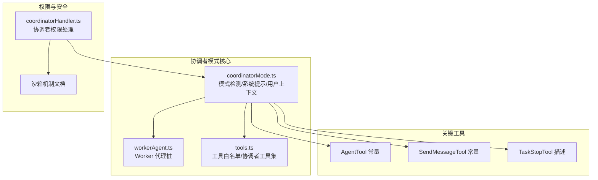
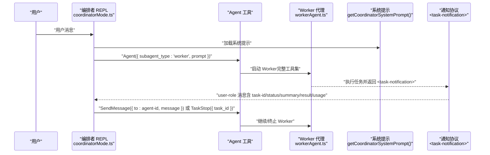
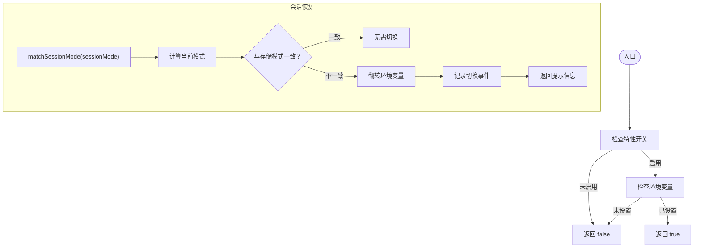
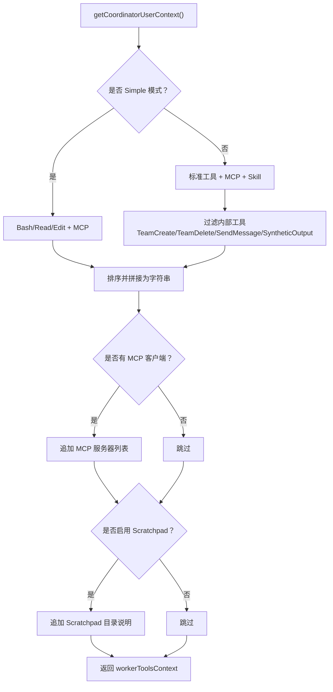
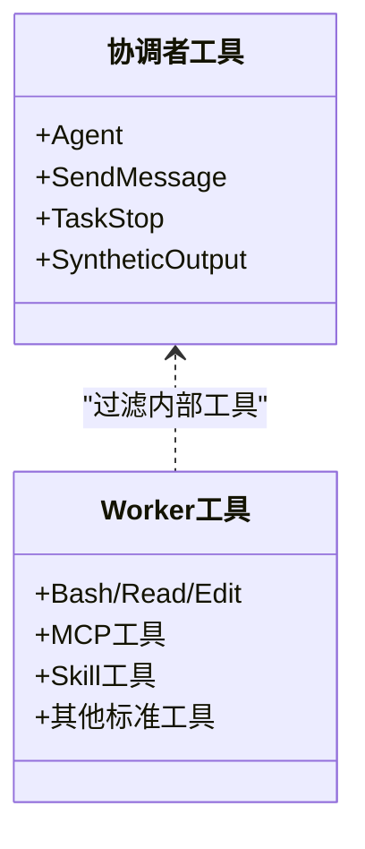
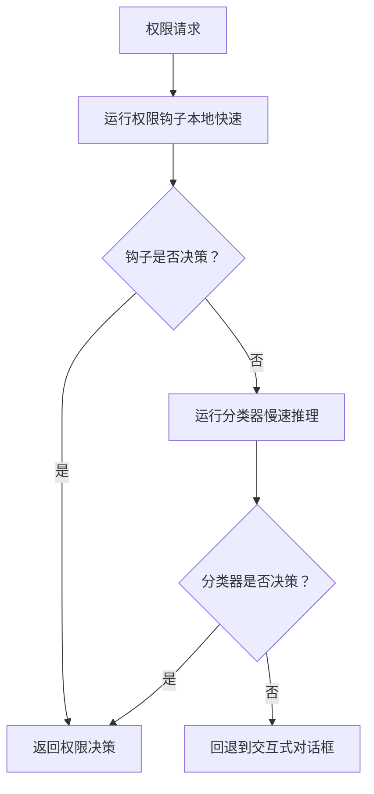
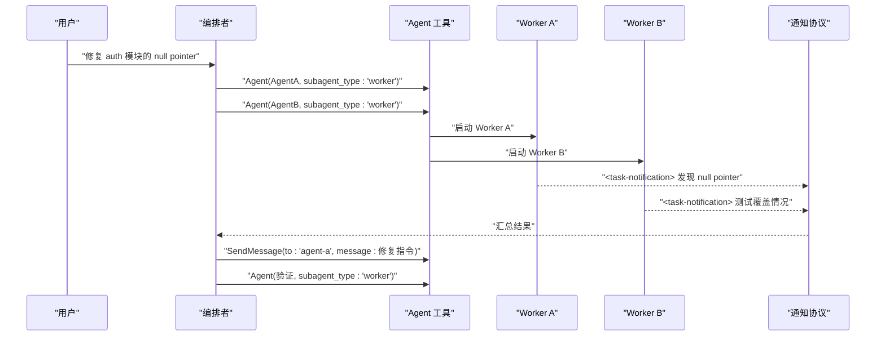
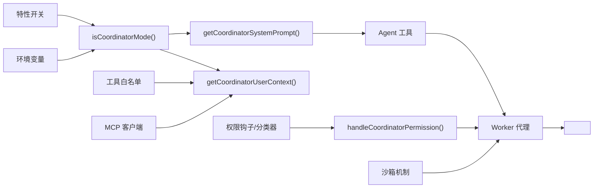

# 协调者模式

<cite>
**本文引用的文件**
- [coordinatorMode.ts](file://src/coordinator/coordinatorMode.ts)
- [workerAgent.ts](file://src/coordinator/workerAgent.ts)
- [tools.ts](file://src/constants/tools.ts)
- [AgentTool 常量](file://src/tools/AgentTool/constants.ts)
- [SendMessageTool 常量](file://src/tools/SendMessageTool/constants.ts)
- [TaskStopTool 描述](file://src/tools/TaskStopTool/prompt.ts)
- [coordinatorHandler.ts](file://src/hooks/toolPermission/handlers/coordinatorHandler.ts)
- [沙箱机制文档](file://docs/safety/sandbox.mdx)
- [协调者模式特性文档](file://docs/features/coordinator-mode.md)
- [Fork 子代理特性文档](file://docs/features/fork-subagent.md)
</cite>

## 目录
1. [简介](#简介)
2. [项目结构](#项目结构)
3. [核心组件](#核心组件)
4. [架构总览](#架构总览)
5. [详细组件分析](#详细组件分析)
6. [依赖关系分析](#依赖关系分析)
7. [性能考量](#性能考量)
8. [故障排查指南](#故障排查指南)
9. [结论](#结论)
10. [附录](#附录)

## 简介
协调者模式将 Claude Code 的 CLI 变为“编排者”，专注于任务拆分、并行派发与结果综合，而不直接动手修改文件。编排者通过受限工具集（Agent、SendMessage、TaskStop）委派工作给“工作者”（Worker），工作者拥有完整的工具集（Bash、Read、Edit、MCP、Skill 等），并在完成后以标准化的 <task-notification> XML 形式回传结果。该模式强调“并行优先”“综合而非转发”“工作者不可见编排者对话”等设计原则，适合大型任务拆分、并行研究、实现与验证分离等场景。

## 项目结构
与协调者模式直接相关的代码主要位于以下位置：
- 模式检测与系统提示：src/coordinator/coordinatorMode.ts
- Worker 代理定义（桩文件）：src/coordinator/workerAgent.ts
- 工具白名单与协调者工具集：src/constants/tools.ts
- 关键工具常量：AgentTool、SendMessageTool、TaskStopTool
- 协调者权限处理：src/hooks/toolPermission/handlers/coordinatorHandler.ts
- 安全与沙箱：docs/safety/sandbox.mdx
- 使用说明与最佳实践：docs/features/coordinator-mode.md、docs/features/fork-subagent.md

图表来源
- [coordinatorMode.ts:1-370](file://src/coordinator/coordinatorMode.ts#L1-L370)
- [workerAgent.ts:1-5](file://src/coordinator/workerAgent.ts#L1-L5)
- [tools.ts:1-111](file://src/constants/tools.ts#L1-L111)
- [AgentTool 常量:1-13](file://src/tools/AgentTool/constants.ts#L1-L13)
- [SendMessageTool 常量:1-2](file://src/tools/SendMessageTool/constants.ts#L1-L2)
- [TaskStopTool 描述:1-8](file://src/tools/TaskStopTool/prompt.ts#L1-L8)
- [coordinatorHandler.ts:1-66](file://src/hooks/toolPermission/handlers/coordinatorHandler.ts#L1-L66)
- [沙箱机制文档:1-216](file://docs/safety/sandbox.mdx#L1-L216)

章节来源
- [coordinatorMode.ts:1-370](file://src/coordinator/coordinatorMode.ts#L1-L370)
- [workerAgent.ts:1-5](file://src/coordinator/workerAgent.ts#L1-L5)
- [tools.ts:1-111](file://src/constants/tools.ts#L1-L111)
- [AgentTool 常量:1-13](file://src/tools/AgentTool/constants.ts#L1-L13)
- [SendMessageTool 常量:1-2](file://src/tools/SendMessageTool/constants.ts#L1-L2)
- [TaskStopTool 描述:1-8](file://src/tools/TaskStopTool/prompt.ts#L1-L8)
- [coordinatorHandler.ts:1-66](file://src/hooks/toolPermission/handlers/coordinatorHandler.ts#L1-L66)
- [沙箱机制文档:1-216](file://docs/safety/sandbox.mdx#L1-L216)

## 核心组件
- 模式检测与会话恢复
  - isCoordinatorMode()：结合特性开关与环境变量判断是否处于协调者模式
  - matchSessionMode(sessionMode)：在会话恢复时自动切换环境变量，保证模式一致性
- 系统提示与用户上下文
  - getCoordinatorSystemPrompt()：约 260 行的系统提示，定义角色、工具、Worker 能力、任务流程、提示词编写规范与示例
  - getCoordinatorUserContext(mcpClients, scratchpadDir)：动态注入 Worker 工具集、MCP 服务器、可选 Scratchpad 共享目录
- 工具集与角色边界
  - 协调者工具集：Agent、SendMessage、TaskStop、SyntheticOutput（以及可选的 PR 订阅工具）
  - Worker 工具集：标准工具 + MCP 工具 + Skill 工具（可选 Simple 模式仅 Bash/Read/Edit）

章节来源
- [coordinatorMode.ts:36-78](file://src/coordinator/coordinatorMode.ts#L36-L78)
- [coordinatorMode.ts:80-109](file://src/coordinator/coordinatorMode.ts#L80-L109)
- [coordinatorMode.ts:111-369](file://src/coordinator/coordinatorMode.ts#L111-L369)
- [tools.ts:102-111](file://src/constants/tools.ts#L102-L111)

## 架构总览
协调者模式采用“星型编排”架构：用户消息经由编排者 REPL，编排者使用受限工具派发给多个 Worker 并行执行，Worker 以 <task-notification> XML 形式回传结果，编排者负责综合与下一步指令。

图表来源
- [coordinatorMode.ts:95-119](file://src/coordinator/coordinatorMode.ts#L95-L119)
- [coordinatorMode.ts:111-369](file://src/coordinator/coordinatorMode.ts#L111-L369)
- [workerAgent.ts:1-5](file://src/coordinator/workerAgent.ts#L1-L5)
- [AgentTool 常量:1-13](file://src/tools/AgentTool/constants.ts#L1-L13)
- [TaskStopTool 描述:1-8](file://src/tools/TaskStopTool/prompt.ts#L1-L8)
- [SendMessageTool 常量:1-2](file://src/tools/SendMessageTool/constants.ts#L1-L2)

## 详细组件分析

### 组件 A：模式检测与会话恢复
- isCoordinatorMode()：双重门控（特性开关 + 环境变量），确保编译时可用、运行时可控
- matchSessionMode(sessionMode)：在会话恢复时自动翻转环境变量，防止模式不一致导致的异常行为

图表来源
- [coordinatorMode.ts:36-41](file://src/coordinator/coordinatorMode.ts#L36-L41)
- [coordinatorMode.ts:49-78](file://src/coordinator/coordinatorMode.ts#L49-L78)

章节来源
- [coordinatorMode.ts:36-41](file://src/coordinator/coordinatorMode.ts#L36-L41)
- [coordinatorMode.ts:49-78](file://src/coordinator/coordinatorMode.ts#L49-L78)

### 组件 B：系统提示与用户上下文
- getCoordinatorSystemPrompt()：定义角色、工具、Worker 能力、任务流程（研究→综合→实现→验证）、并发策略、失败处理、停止机制、提示词编写规范与示例
- getCoordinatorUserContext()：根据环境变量与 MCP 客户端动态注入 Worker 工具集，支持可选 Scratchpad 共享目录

图表来源
- [coordinatorMode.ts:80-109](file://src/coordinator/coordinatorMode.ts#L80-L109)
- [tools.ts:52-71](file://src/constants/tools.ts#L52-L71)
- [tools.ts:102-111](file://src/constants/tools.ts#L102-L111)

章节来源
- [coordinatorMode.ts:80-109](file://src/coordinator/coordinatorMode.ts#L80-L109)
- [coordinatorMode.ts:111-369](file://src/coordinator/coordinatorMode.ts#L111-L369)
- [tools.ts:52-71](file://src/constants/tools.ts#L52-L71)
- [tools.ts:102-111](file://src/constants/tools.ts#L102-L111)

### 组件 C：协调者工具集与 Worker 工具集
- 协调者工具集（COORINATOR_MODE_ALLOWED_TOOLS）：Agent、SendMessage、TaskStop、SyntheticOutput
- Worker 工具集（ASYNC_AGENT_ALLOWED_TOOLS）：标准工具 + MCP + Skill（Simple 模式仅 Bash/Read/Edit）
- 内部工具过滤：TeamCreate、TeamDelete、SendMessage、SyntheticOutput 对 Worker 隐藏

图表来源
- [tools.ts:102-111](file://src/constants/tools.ts#L102-L111)
- [tools.ts:52-71](file://src/constants/tools.ts#L52-L71)
- [coordinatorMode.ts:29-34](file://src/coordinator/coordinatorMode.ts#L29-L34)

章节来源
- [tools.ts:102-111](file://src/constants/tools.ts#L102-L111)
- [tools.ts:52-71](file://src/constants/tools.ts#L52-L71)
- [coordinatorMode.ts:29-34](file://src/coordinator/coordinatorMode.ts#L29-L34)

### 组件 D：权限控制与安全
- 协调者权限处理：handleCoordinatorPermission() 顺序执行权限钩子与分类器，失败时回退到交互式对话框
- 沙箱机制：即使通过权限审批，沙箱仍可限制命令的行为范围，提供文件系统隔离、网络限制与资源约束

图表来源
- [coordinatorHandler.ts:26-62](file://src/hooks/toolPermission/handlers/coordinatorHandler.ts#L26-L62)
- [沙箱机制文档:15-55](file://docs/safety/sandbox.mdx#L15-L55)

章节来源
- [coordinatorHandler.ts:26-62](file://src/hooks/toolPermission/handlers/coordinatorHandler.ts#L26-L62)
- [沙箱机制文档:1-216](file://docs/safety/sandbox.mdx#L1-L216)

### 组件 E：使用示例与工作流
- 启用方式：同时设置特性开关与环境变量；可配合 Fork 子代理与 Simple 模式
- 典型工作流：并行派发两个 Worker → 收到 <task-notification> → 综合发现 → 继续 Worker → 派发验证
- 提示词编写：必须自包含（Worker 无法看到编排者对话），避免“based on your findings”等懒惰委托

图表来源
- [协调者模式特性文档:19-46](file://docs/features/coordinator-mode.md#L19-L46)
- [coordinatorMode.ts:166-190](file://src/coordinator/coordinatorMode.ts#L166-L190)

章节来源
- [协调者模式特性文档:19-46](file://docs/features/coordinator-mode.md#L19-L46)
- [coordinatorMode.ts:166-190](file://src/coordinator/coordinatorMode.ts#L166-L190)

## 依赖关系分析
- 模式检测依赖特性开关与环境变量，避免在未启用时误判
- 用户上下文依赖工具白名单与 MCP 客户端列表，动态注入 Worker 能力
- 系统提示依赖工具常量与环境变量（Simple 模式），定义 Worker 能力与任务流程
- 权限处理依赖钩子与分类器，失败时回退到交互式对话框
- 安全控制依赖沙箱机制，即使通过权限审批也受 OS 级约束

图表来源
- [coordinatorMode.ts:36-109](file://src/coordinator/coordinatorMode.ts#L36-L109)
- [tools.ts:52-111](file://src/constants/tools.ts#L52-L111)
- [coordinatorHandler.ts:26-62](file://src/hooks/toolPermission/handlers/coordinatorHandler.ts#L26-L62)
- [沙箱机制文档:15-55](file://docs/safety/sandbox.mdx#L15-L55)

章节来源
- [coordinatorMode.ts:36-109](file://src/coordinator/coordinatorMode.ts#L36-L109)
- [tools.ts:52-111](file://src/constants/tools.ts#L52-L111)
- [coordinatorHandler.ts:26-62](file://src/hooks/toolPermission/handlers/coordinatorHandler.ts#L26-L62)
- [沙箱机制文档:15-55](file://docs/safety/sandbox.mdx#L15-L55)

## 性能考量
- 并行优先：研究类任务尽量并行，实现类任务按文件区域串行，验证类任务可与实现并行但需隔离文件区域
- Prompt Cache 优化：Fork 子代理在协调者模式下互斥，避免不必要的上下文继承；普通 fork 子代理通过占位符与共享前缀提升缓存命中
- 工具过滤：Worker 工具集按需过滤内部工具，减少冗余提示与权限检查开销
- 会话恢复：matchSessionMode() 自动切换环境变量，避免重复初始化成本

章节来源
- [coordinatorMode.ts:211-238](file://src/coordinator/coordinatorMode.ts#L211-L238)
- [Fork 子代理特性文档:142-172](file://docs/features/fork-subagent.md#L142-L172)
- [coordinatorMode.ts:49-78](file://src/coordinator/coordinatorMode.ts#L49-L78)

## 故障排查指南
- 模式未生效
  - 检查特性开关与环境变量是否同时设置
  - 会话恢复时确认 matchSessionMode() 是否正确翻转环境变量
- Worker 无法启动或权限不足
  - 检查 handleCoordinatorPermission() 是否成功通过钩子与分类器
  - 若失败回退到交互式对话框，确认用户授权
- 命令被拒绝或越权
  - 沙箱机制可能限制网络/文件系统访问，检查沙箱配置与违规标签
- 通知格式异常
  - 确认 <task-notification> XML 格式是否完整（task-id/status/summary/result/usage）

章节来源
- [coordinatorMode.ts:36-78](file://src/coordinator/coordinatorMode.ts#L36-L78)
- [coordinatorHandler.ts:26-62](file://src/hooks/toolPermission/handlers/coordinatorHandler.ts#L26-L62)
- [沙箱机制文档:182-216](file://docs/safety/sandbox.mdx#L182-L216)

## 结论
协调者模式通过“编排者受限 + Worker 完整”的分工，实现了高效的任务拆分与并行执行。配合严格的系统提示、权限处理与沙箱安全机制，既能保障安全性，又能提升工程效率。建议在大型任务、并行研究与实现验证分离场景中优先采用该模式，并遵循“综合而非转发”“自包含提示词”“并行优先”等最佳实践。

## 附录
- 启用方式与示例
  - 基本启用：同时设置特性开关与环境变量
  - 配合 Fork 子代理：在协调者模式下禁用 fork，避免委派模型冲突
  - Simple 模式：Worker 仅 Bash/Read/Edit，降低复杂度
- 关键工具参考
  - AgentTool：用于派发 Worker
  - SendMessageTool：用于继续已有 Worker
  - TaskStopTool：用于中途停止 Worker

章节来源
- [协调者模式特性文档:130-143](file://docs/features/coordinator-mode.md#L130-L143)
- [Fork 子代理特性文档:38-51](file://docs/features/fork-subagent.md#L38-L51)
- [AgentTool 常量:1-13](file://src/tools/AgentTool/constants.ts#L1-L13)
- [SendMessageTool 常量:1-2](file://src/tools/SendMessageTool/constants.ts#L1-L2)
- [TaskStopTool 描述:1-8](file://src/tools/TaskStopTool/prompt.ts#L1-L8)