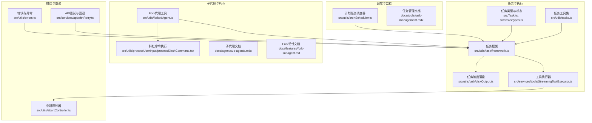
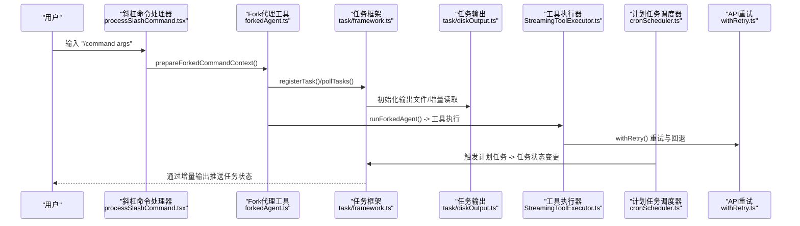
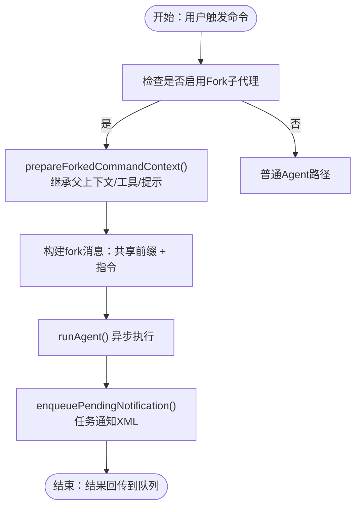
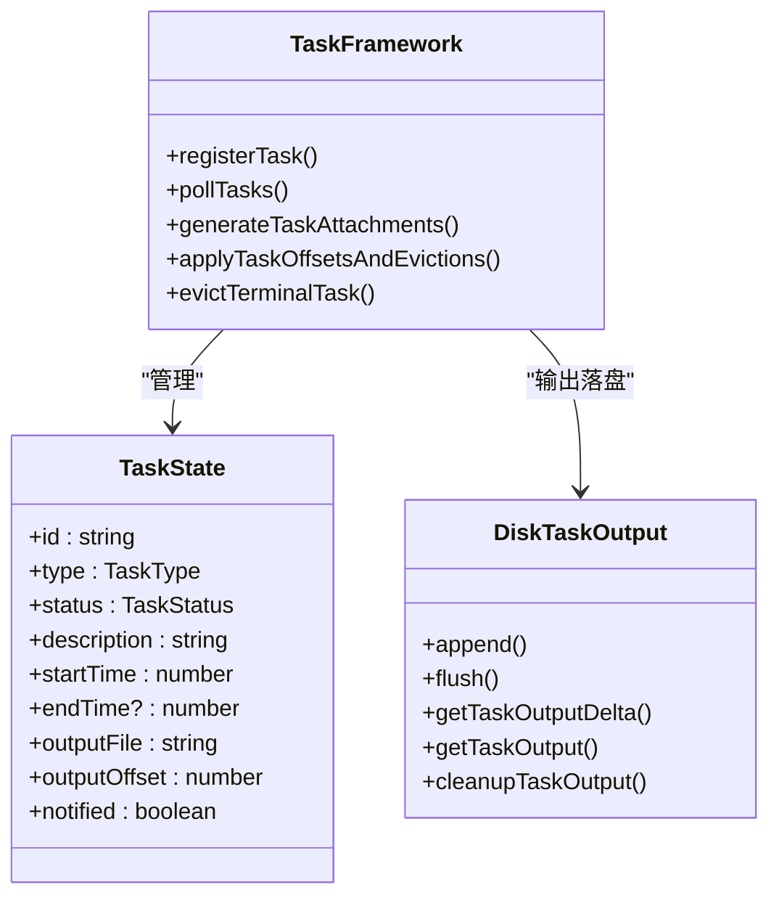
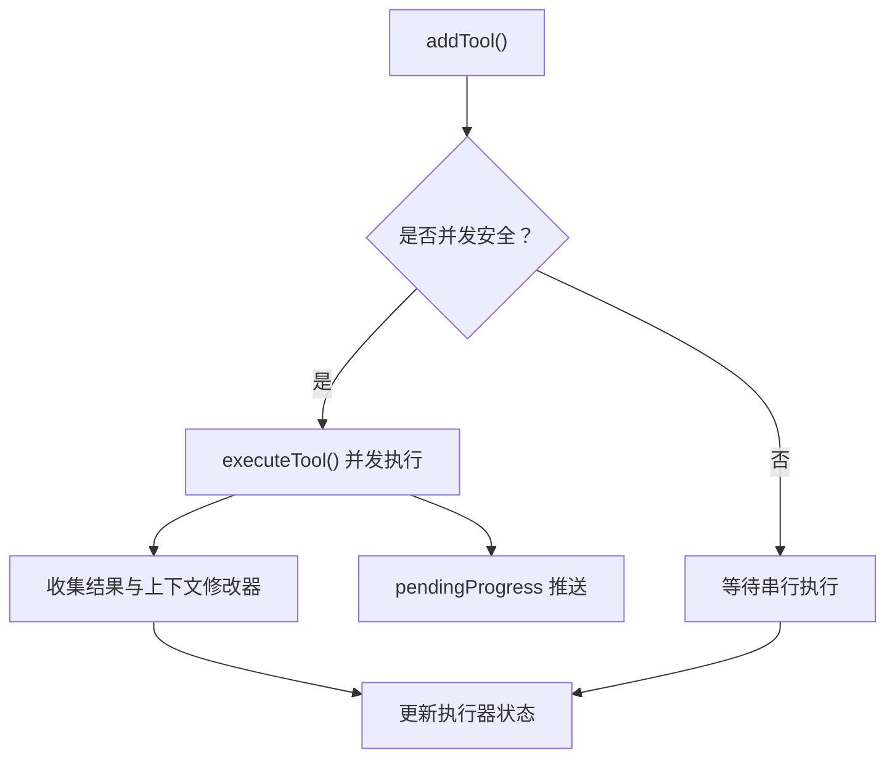
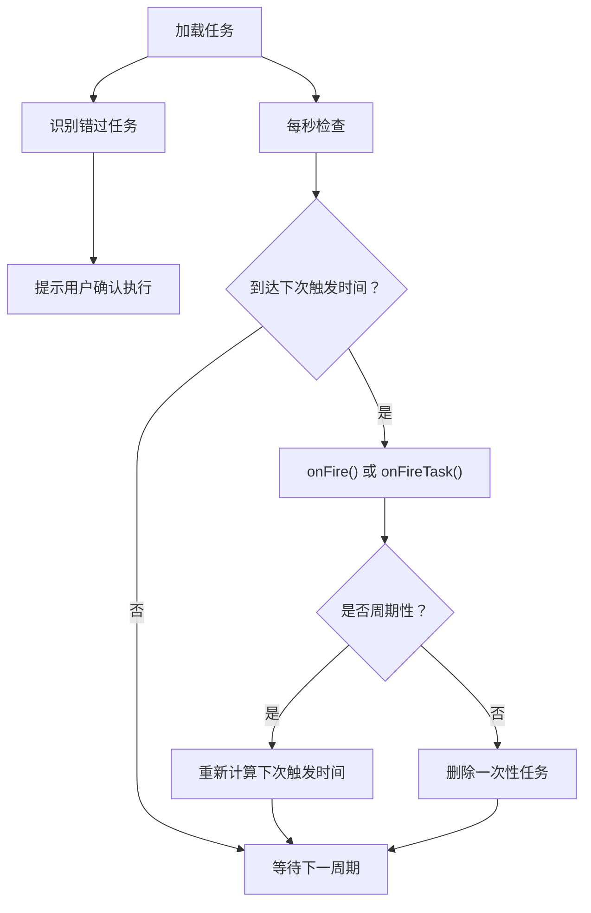
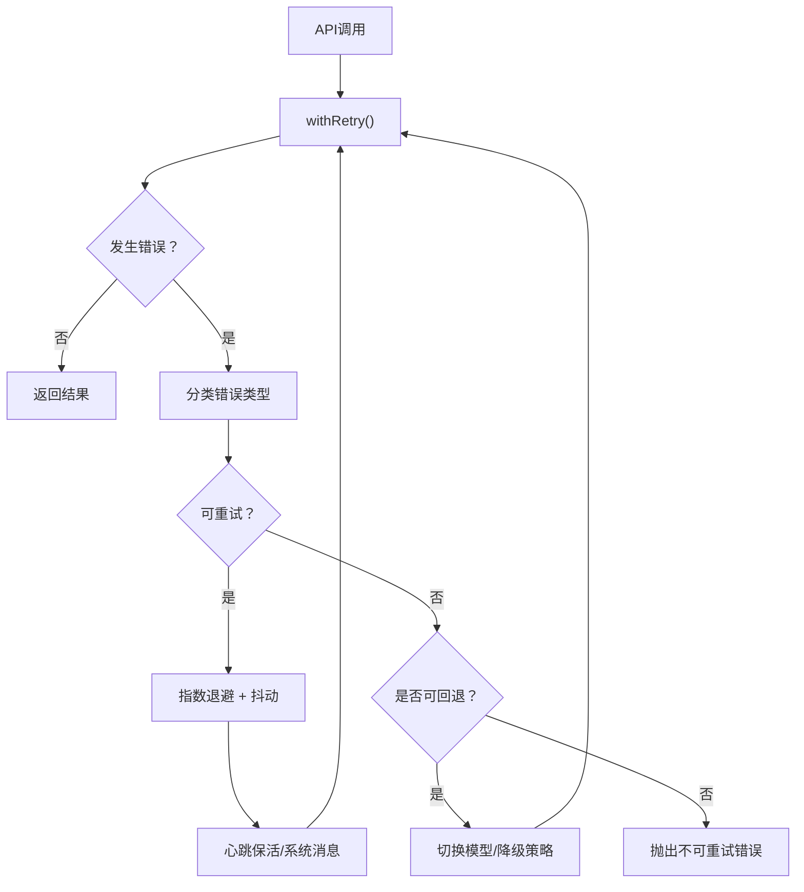
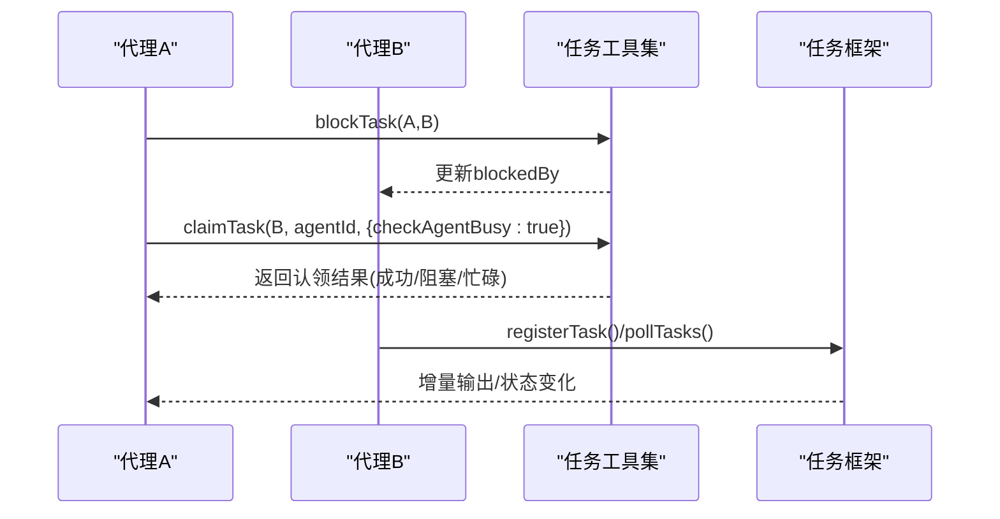
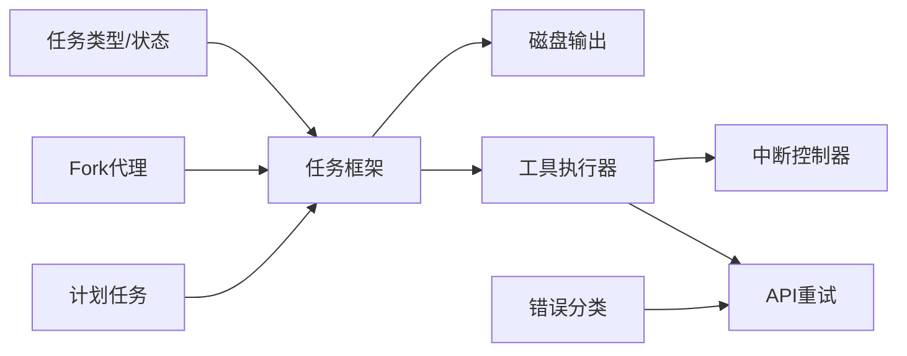

# 代理任务执行

<cite>
**本文档引用的文件**
- [src/utils/forkedAgent.ts](file://src/utils/forkedAgent.ts)
- [src/utils/processUserInput/processSlashCommand.tsx](file://src/utils/processUserInput/processSlashCommand.tsx)
- [src/utils/task/framework.ts](file://src/utils/task/framework.ts)
- [src/utils/task/diskOutput.ts](file://src/utils/task/diskOutput.ts)
- [src/utils/tasks.ts](file://src/utils/tasks.ts)
- [src/services/tools/StreamingToolExecutor.ts](file://src/services/tools/StreamingToolExecutor.ts)
- [src/utils/cronScheduler.ts](file://src/utils/cronScheduler.ts)
- [src/utils/errors.ts](file://src/utils/errors.ts)
- [src/utils/abortController.ts](file://src/utils/abortController.ts)
- [src/services/api/withRetry.ts](file://src/services/api/withRetry.ts)
- [src/tasks/types.ts](file://src/tasks/types.ts)
- [src/Task.ts](file://src/Task.ts)
- [docs/agent/sub-agents.mdx](file://docs/agent/sub-agents.mdx)
- [docs/features/fork-subagent.md](file://docs/features/fork-subagent.md)
- [docs/tools/task-management.mdx](file://docs/tools/task-management.mdx)
</cite>

## 目录
1. [简介](#简介)
2. [项目结构](#项目结构)
3. [核心组件](#核心组件)
4. [架构总览](#架构总览)
5. [详细组件分析](#详细组件分析)
6. [依赖关系分析](#依赖关系分析)
7. [性能考虑](#性能考虑)
8. [故障排除指南](#故障排除指南)
9. [结论](#结论)

## 简介
本文件系统性阐述代理任务执行机制，覆盖子代理的任务创建、调度分配与执行监控；任务队列管理（优先级、并发控制、资源分配）；子代理的 Fork 机制与进程管理（隔离、内存与资源限制）；代理间任务协作（任务分解、结果聚合、状态同步）；以及错误处理与异常恢复（失败重试、超时处理、状态回滚）。同时提供性能优化建议与监控指标，帮助开发者在复杂场景下稳定高效地运行代理任务。

## 项目结构
该机制由多模块协同构成：
- 任务框架与状态管理：任务类型定义、状态机、任务注册与轮询、输出落盘与增量推送
- 工具执行与并发控制：流式工具执行器，支持并发安全与串行工具的有序执行
- 子代理与 Fork：继承父上下文的子代理执行路径，Prompt Cache 共享与异步化
- 调度与定时：计划任务调度器，支持会话与文件任务、锁竞争与错过任务处理
- 错误处理与重试：统一的 API 重试与回退策略，支持持久化重试与心跳保活
- 进程与中断：AbortController 体系，弱引用传播与清理，避免内存泄漏

**图表来源**
- [src/Task.ts:1-126](file://src/Task.ts#L1-L126)
- [src/tasks/types.ts:1-47](file://src/tasks/types.ts#L1-L47)
- [src/utils/task/framework.ts:1-309](file://src/utils/task/framework.ts#L1-L309)
- [src/utils/task/diskOutput.ts:1-452](file://src/utils/task/diskOutput.ts#L1-L452)
- [src/services/tools/StreamingToolExecutor.ts:1-531](file://src/services/tools/StreamingToolExecutor.ts#L1-L531)
- [src/utils/forkedAgent.ts:1-690](file://src/utils/forkedAgent.ts#L1-L690)
- [src/utils/processUserInput/processSlashCommand.tsx:1-800](file://src/utils/processUserInput/processSlashCommand.tsx#L1-L800)
- [src/utils/cronScheduler.ts:1-566](file://src/utils/cronScheduler.ts#L1-L566)
- [src/utils/errors.ts:1-239](file://src/utils/errors.ts#L1-L239)
- [src/utils/abortController.ts:1-100](file://src/utils/abortController.ts#L1-L100)
- [src/services/api/withRetry.ts:1-823](file://src/services/api/withRetry.ts#L1-L823)

**章节来源**
- [src/Task.ts:1-126](file://src/Task.ts#L1-L126)
- [src/tasks/types.ts:1-47](file://src/tasks/types.ts#L1-L47)
- [src/utils/task/framework.ts:1-309](file://src/utils/task/framework.ts#L1-L309)
- [src/utils/task/diskOutput.ts:1-452](file://src/utils/task/diskOutput.ts#L1-L452)
- [src/services/tools/StreamingToolExecutor.ts:1-531](file://src/services/tools/StreamingToolExecutor.ts#L1-L531)
- [src/utils/forkedAgent.ts:1-690](file://src/utils/forkedAgent.ts#L1-L690)
- [src/utils/processUserInput/processSlashCommand.tsx:1-800](file://src/utils/processUserInput/processSlashCommand.tsx#L1-L800)
- [src/utils/cronScheduler.ts:1-566](file://src/utils/cronScheduler.ts#L1-L566)
- [src/utils/errors.ts:1-239](file://src/utils/errors.ts#L1-L239)
- [src/utils/abortController.ts:1-100](file://src/utils/abortController.ts#L1-L100)
- [src/services/api/withRetry.ts:1-823](file://src/services/api/withRetry.ts#L1-L823)

## 核心组件
- 任务类型与状态：统一的任务类型枚举、状态机与生命周期钩子，支持终端态检测与任务 ID 生成
- 任务框架：任务注册、轮询、增量输出推送、终端态回收与 SDK 事件通知
- 任务输出：磁盘输出封装，带容量上限与 O_NOFOLLOW 安全策略，支持增量读取与尾部读取
- 工具执行器：并发安全工具与串行工具的混合执行，支持进度消息即时推送与兄弟进程级联中断
- 子代理与 Fork：继承父上下文的子代理执行路径，Prompt Cache 共享与异步化，权限冒泡与占位符复用
- 计划任务调度：文件与会话任务分离、锁竞争接管、错过任务提示与老化回收
- 错误与重试：统一的 API 重试与回退策略，持久化重试与心跳保活，错误分类与可观测性事件

**章节来源**
- [src/Task.ts:1-126](file://src/Task.ts#L1-L126)
- [src/tasks/types.ts:1-47](file://src/tasks/types.ts#L1-L47)
- [src/utils/task/framework.ts:1-309](file://src/utils/task/framework.ts#L1-L309)
- [src/utils/task/diskOutput.ts:1-452](file://src/utils/task/diskOutput.ts#L1-L452)
- [src/services/tools/StreamingToolExecutor.ts:1-531](file://src/services/tools/StreamingToolExecutor.ts#L1-L531)
- [src/utils/forkedAgent.ts:1-690](file://src/utils/forkedAgent.ts#L1-L690)
- [src/utils/cronScheduler.ts:1-566](file://src/utils/cronScheduler.ts#L1-L566)
- [src/services/api/withRetry.ts:1-823](file://src/services/api/withRetry.ts#L1-L823)

## 架构总览
代理任务执行的整体流程如下：
- 用户输入触发斜杠命令或技能调用，进入 fork 子代理执行路径
- 子代理继承父上下文，构建共享的 Prompt Cache 前缀，异步启动
- 任务框架负责任务注册、状态轮询与增量输出推送
- 工具执行器按并发策略执行工具，支持进度消息即时推送
- 计划任务调度器在后台按时间窗口触发任务
- 错误与重试模块贯穿 API 调用，提供持久化重试与心跳保活

**图表来源**
- [src/utils/processUserInput/processSlashCommand.tsx:112-374](file://src/utils/processUserInput/processSlashCommand.tsx#L112-L374)
- [src/utils/forkedAgent.ts:489-626](file://src/utils/forkedAgent.ts#L489-L626)
- [src/utils/task/framework.ts:255-269](file://src/utils/task/framework.ts#L255-L269)
- [src/utils/task/diskOutput.ts:304-357](file://src/utils/task/diskOutput.ts#L304-L357)
- [src/services/tools/StreamingToolExecutor.ts:140-151](file://src/services/tools/StreamingToolExecutor.ts#L140-L151)
- [src/utils/cronScheduler.ts:230-394](file://src/utils/cronScheduler.ts#L230-L394)
- [src/services/api/withRetry.ts:170-517](file://src/services/api/withRetry.ts#L170-L517)

## 详细组件分析

### 子代理任务执行流程（Fork 机制）
- 上下文继承：子代理继承父级完整对话历史、工具集与系统提示，共享 Prompt Cache 前缀
- 异步化：当启用 fork 子代理时，所有 agent 启动强制异步，统一通过任务通知 XML 交互
- 权限冒泡：子代理权限提示上浮到父终端显示，便于用户感知
- 占位符复用：所有 fork 使用相同的占位符文本，最大化 prompt cache 命中率
- 递归防护：通过查询来源与消息扫描防止 fork 嵌套

**图表来源**
- [src/utils/processUserInput/processSlashCommand.tsx:112-251](file://src/utils/processUserInput/processSlashCommand.tsx#L112-L251)
- [src/utils/forkedAgent.ts:191-232](file://src/utils/forkedAgent.ts#L191-L232)
- [docs/features/fork-subagent.md:1-171](file://docs/features/fork-subagent.md#L1-L171)
- [docs/agent/sub-agents.mdx:36-54](file://docs/agent/sub-agents.mdx#L36-L54)

**章节来源**
- [src/utils/processUserInput/processSlashCommand.tsx:112-374](file://src/utils/processUserInput/processSlashCommand.tsx#L112-L374)
- [src/utils/forkedAgent.ts:1-690](file://src/utils/forkedAgent.ts#L1-L690)
- [docs/features/fork-subagent.md:1-171](file://docs/features/fork-subagent.md#L1-L171)
- [docs/agent/sub-agents.mdx:36-54](file://docs/agent/sub-agents.mdx#L36-L54)

### 任务队列管理（优先级、并发控制、资源分配）
- 任务状态与生命周期：统一的状态机与终端态检测，支持任务注册、轮询与增量输出推送
- 并发控制：工具执行器区分并发安全与串行工具，保证有序性与吞吐
- 依赖管理：通过 blocks/blockedBy 维护任务间依赖，支持原子化认领与阻塞检查
- 资源分配：任务输出落盘容量上限、输出文件安全策略（O_NOFOLLOW）、增量读取与尾部读取

**图表来源**
- [src/Task.ts:44-125](file://src/Task.ts#L44-L125)
- [src/utils/task/framework.ts:48-309](file://src/utils/task/framework.ts#L48-L309)
- [src/utils/task/diskOutput.ts:97-394](file://src/utils/task/diskOutput.ts#L97-L394)

**章节来源**
- [src/Task.ts:1-126](file://src/Task.ts#L1-L126)
- [src/utils/task/framework.ts:1-309](file://src/utils/task/framework.ts#L1-L309)
- [src/utils/task/diskOutput.ts:1-452](file://src/utils/task/diskOutput.ts#L1-L452)
- [src/services/tools/StreamingToolExecutor.ts:129-151](file://src/services/tools/StreamingToolExecutor.ts#L129-L151)
- [src/utils/tasks.ts:458-486](file://src/utils/tasks.ts#L458-L486)

### 工具执行与并发控制
- 并发策略：并发安全工具可并行执行，串行工具需独占执行；进度消息即时推送
- 兄弟进程级联中断：Bash 错误会触发兄弟进程级联中断，避免无效执行
- 上下文隔离：工具执行器内部维护工具上下文修改器，支持执行期上下文更新

**图表来源**
- [src/services/tools/StreamingToolExecutor.ts:76-151](file://src/services/tools/StreamingToolExecutor.ts#L76-L151)
- [src/services/tools/StreamingToolExecutor.ts:265-405](file://src/services/tools/StreamingToolExecutor.ts#L265-L405)

**章节来源**
- [src/services/tools/StreamingToolExecutor.ts:1-531](file://src/services/tools/StreamingToolExecutor.ts#L1-L531)

### 计划任务调度与资源限制
- 文件与会话任务分离：文件任务受锁保护，会话任务进程私有
- 锁竞争与接管：多会话共享同一项目时，通过锁竞争决定调度器所有权
- 错过任务处理：首次加载时识别错过的一次性任务，提示用户确认
- 老化回收：周期性任务可配置老化时间，到期后最后一次触发后删除

**图表来源**
- [src/utils/cronScheduler.ts:179-394](file://src/utils/cronScheduler.ts#L179-L394)
- [src/utils/cronScheduler.ts:462-531](file://src/utils/cronScheduler.ts#L462-L531)

**章节来源**
- [src/utils/cronScheduler.ts:1-566](file://src/utils/cronScheduler.ts#L1-L566)

### 错误处理与异常恢复
- 统一错误分类：Abort、Shell、配置解析、网络、HTTP 等错误分类与提取
- API 重试与回退：指数退避、随机抖动、持久化重试与心跳保活、529/429 特殊处理
- 中断传播：AbortController 弱引用传播，避免强引用导致的内存泄漏
- 任务级错误：工具执行器对兄弟进程级联中断与用户中断的处理

**图表来源**
- [src/services/api/withRetry.ts:170-517](file://src/services/api/withRetry.ts#L170-L517)
- [src/utils/errors.ts:1-239](file://src/utils/errors.ts#L1-L239)
- [src/utils/abortController.ts:68-99](file://src/utils/abortController.ts#L68-L99)

**章节来源**
- [src/services/api/withRetry.ts:1-823](file://src/services/api/withRetry.ts#L1-L823)
- [src/utils/errors.ts:1-239](file://src/utils/errors.ts#L1-L239)
- [src/utils/abortController.ts:1-100](file://src/utils/abortController.ts#L1-L100)

### 代理间任务协作（分解、聚合、同步）
- 依赖管理：通过 blocks/blockedBy 维护任务间依赖，认领时原子检查阻塞关系
- 并发控制：任务级锁与列表级锁结合，支持代理忙碌检查与并发控制
- 状态同步：任务框架通过增量输出与 SDK 事件进行状态同步，终端态及时回收

**图表来源**
- [src/utils/tasks.ts:458-486](file://src/utils/tasks.ts#L458-L486)
- [src/utils/tasks.ts:541-692](file://src/utils/tasks.ts#L541-L692)
- [src/utils/task/framework.ts:255-309](file://src/utils/task/framework.ts#L255-L309)

**章节来源**
- [src/utils/tasks.ts:1-863](file://src/utils/tasks.ts#L1-L863)
- [src/utils/task/framework.ts:1-309](file://src/utils/task/framework.ts#L1-L309)
- [docs/tools/task-management.mdx:107-149](file://docs/tools/task-management.mdx#L107-L149)

## 依赖关系分析
- 低耦合高内聚：任务框架与工具执行器通过接口解耦，Fork 代理通过上下文隔离与缓存共享实现松耦合
- 关键依赖链：
  - 任务框架依赖任务类型与状态机
  - 任务框架依赖磁盘输出模块进行增量读取与尾部读取
  - 工具执行器依赖 AbortController 体系与重试模块
  - 计划任务调度器依赖任务框架进行状态变更
  - 错误与重试模块贯穿 API 调用路径

**图表来源**
- [src/Task.ts:1-126](file://src/Task.ts#L1-L126)
- [src/utils/task/framework.ts:1-309](file://src/utils/task/framework.ts#L1-L309)
- [src/utils/task/diskOutput.ts:1-452](file://src/utils/task/diskOutput.ts#L1-L452)
- [src/services/tools/StreamingToolExecutor.ts:1-531](file://src/services/tools/StreamingToolExecutor.ts#L1-L531)
- [src/utils/abortController.ts:1-100](file://src/utils/abortController.ts#L1-L100)
- [src/services/api/withRetry.ts:1-823](file://src/services/api/withRetry.ts#L1-L823)
- [src/utils/forkedAgent.ts:1-690](file://src/utils/forkedAgent.ts#L1-L690)
- [src/utils/cronScheduler.ts:1-566](file://src/utils/cronScheduler.ts#L1-L566)
- [src/utils/errors.ts:1-239](file://src/utils/errors.ts#L1-L239)

**章节来源**
- [src/Task.ts:1-126](file://src/Task.ts#L1-L126)
- [src/utils/task/framework.ts:1-309](file://src/utils/task/framework.ts#L1-L309)
- [src/utils/task/diskOutput.ts:1-452](file://src/utils/task/diskOutput.ts#L1-L452)
- [src/services/tools/StreamingToolExecutor.ts:1-531](file://src/services/tools/StreamingToolExecutor.ts#L1-L531)
- [src/utils/abortController.ts:1-100](file://src/utils/abortController.ts#L1-L100)
- [src/services/api/withRetry.ts:1-823](file://src/services/api/withRetry.ts#L1-L823)
- [src/utils/forkedAgent.ts:1-690](file://src/utils/forkedAgent.ts#L1-L690)
- [src/utils/cronScheduler.ts:1-566](file://src/utils/cronScheduler.ts#L1-L566)
- [src/utils/errors.ts:1-239](file://src/utils/errors.ts#L1-L239)

## 性能考虑
- Prompt Cache 共享：fork 子代理通过共享父上下文与占位符，最大化缓存命中，降低 API 成本
- 并发与有序：工具执行器区分并发安全与串行工具，减少不必要的串行等待
- 输出落盘优化：增量读取与尾部读取避免全量加载，容量上限防止磁盘膨胀
- 重试与退避：指数退避与抖动降低服务器压力，持久化重试与心跳保活提升长任务稳定性
- 任务并发控制：列表级锁与代理忙碌检查避免过度竞争，提高吞吐

[本节为通用指导，无需具体文件分析]

## 故障排除指南
- 任务无法认领：检查任务是否已被他人认领、是否处于已完成状态、是否存在阻塞任务、代理是否已拥有未完成任务
- 工具执行失败：查看工具执行器的合成错误消息，确认是否因兄弟进程级联中断或用户中断导致
- API 超时/限流：启用持久化重试与心跳保活，关注 529/429 与速率限制头信息
- 输出文件异常：检查磁盘输出容量上限与 O_NOFOLLOW 安全策略，确认文件是否存在与权限
- 中断与内存泄漏：确认 AbortController 的弱引用传播与自动清理，避免强引用导致的泄漏

**章节来源**
- [src/utils/tasks.ts:541-692](file://src/utils/tasks.ts#L541-L692)
- [src/services/tools/StreamingToolExecutor.ts:153-205](file://src/services/tools/StreamingToolExecutor.ts#L153-L205)
- [src/services/api/withRetry.ts:170-517](file://src/services/api/withRetry.ts#L170-L517)
- [src/utils/task/diskOutput.ts:304-357](file://src/utils/task/diskOutput.ts#L304-L357)
- [src/utils/abortController.ts:68-99](file://src/utils/abortController.ts#L68-L99)

## 结论
该代理任务执行机制通过子代理 Fork 与上下文继承、任务框架与并发控制、工具执行器与错误重试的协同，实现了高吞吐、低延迟、可观测的任务执行闭环。Prompt Cache 共享与异步化进一步提升了成本效率与用户体验。在复杂场景下，建议结合依赖管理、资源限制与监控指标，持续优化任务执行性能与稳定性。