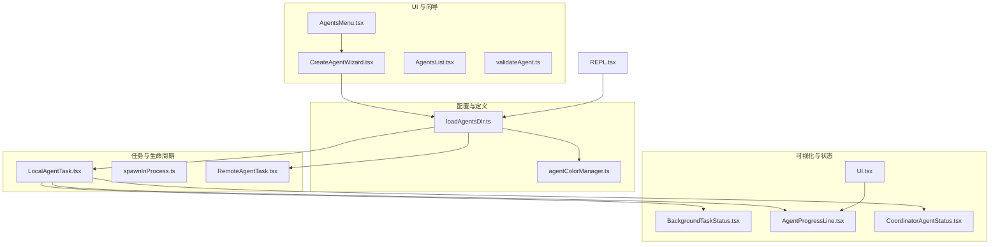
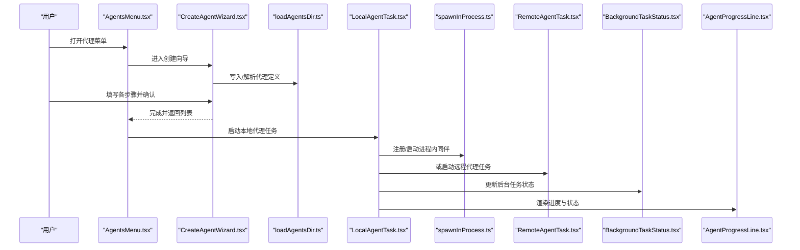
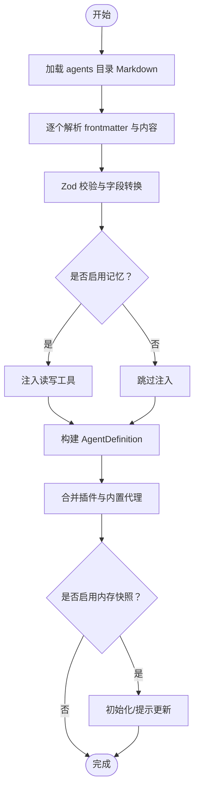
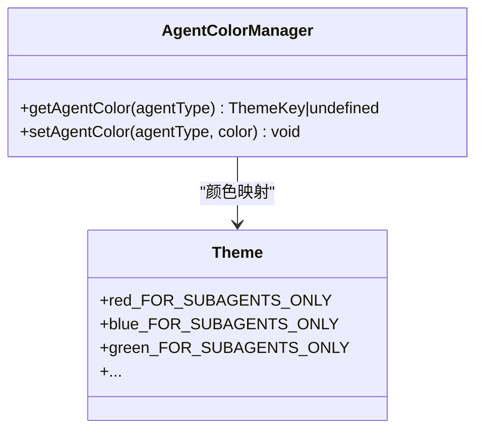
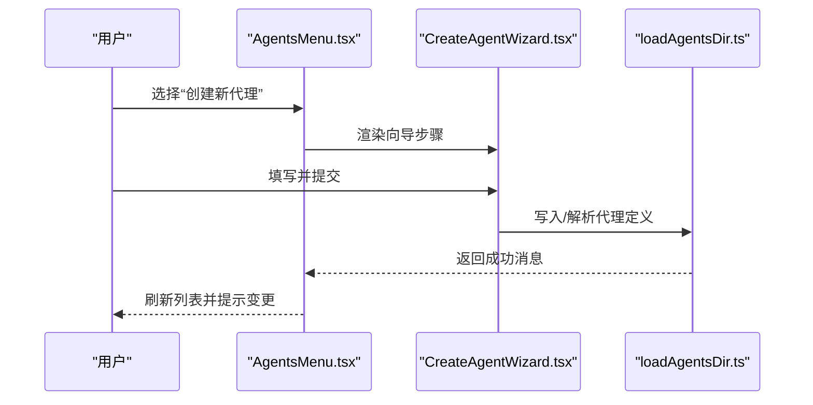
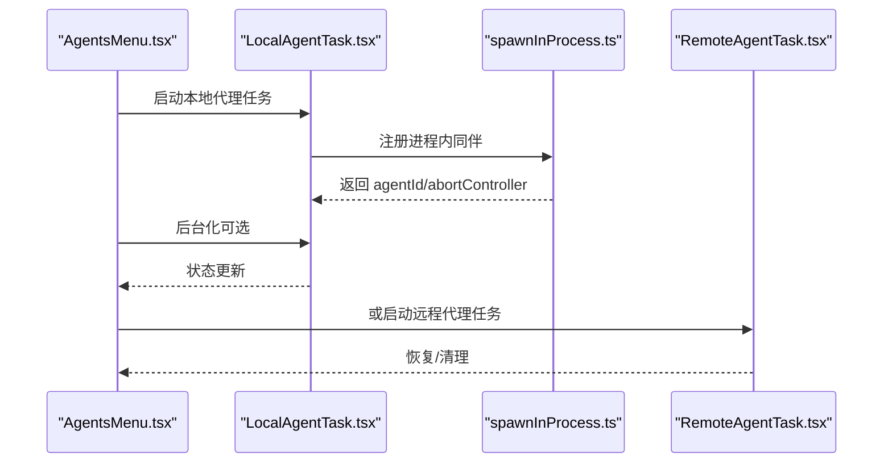
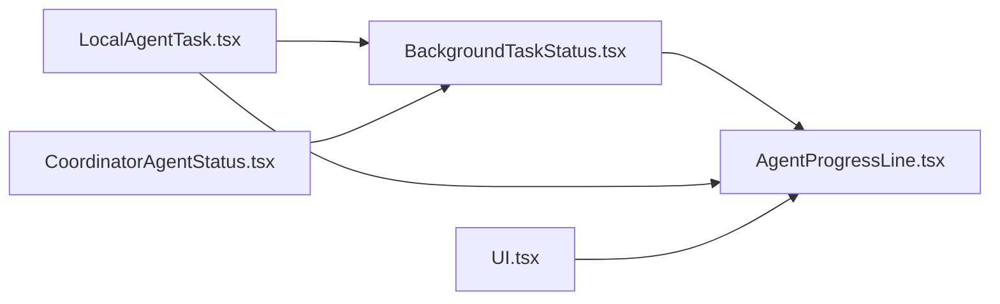
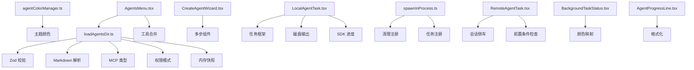

# 代理创建与管理

<cite>
**本文引用的文件**
- [loadAgentsDir.ts](file://src/tools/AgentTool/loadAgentsDir.ts)
- [agentColorManager.ts](file://src/tools/AgentTool/agentColorManager.ts)
- [AgentsMenu.tsx](file://src/components/agents/AgentsMenu.tsx)
- [CreateAgentWizard.tsx](file://src/components/agents/new-agent-creation/CreateAgentWizard.tsx)
- [AgentsList.tsx](file://src/components/agents/AgentsList.tsx)
- [validateAgent.ts](file://src/components/agents/validateAgent.ts)
- [LocalAgentTask.tsx](file://src/tasks/LocalAgentTask/LocalAgentTask.tsx)
- [BackgroundTaskStatus.tsx](file://src/components/tasks/BackgroundTaskStatus.tsx)
- [AgentProgressLine.tsx](file://src/components/AgentProgressLine.tsx)
- [CoordinatorAgentStatus.tsx](file://src/components/CoordinatorAgentStatus.tsx)
- [UI.tsx](file://src/tools/AgentTool/UI.tsx)
- [spawnInProcess.ts](file://src/utils/swarm/spawnInProcess.ts)
- [LocalAgentTask.tsx（后台管理）](file://src/tasks/LocalAgentTask/LocalAgentTask.tsx)
- [RemoteAgentTask.tsx](file://src/tasks/RemoteAgentTask/RemoteAgentTask.tsx)
- [REPL.tsx](file://src/screens/REPL.tsx)
</cite>

## 目录
1. [简介](#简介)
2. [项目结构](#项目结构)
3. [核心组件](#核心组件)
4. [架构总览](#架构总览)
5. [详细组件分析](#详细组件分析)
6. [依赖关系分析](#依赖关系分析)
7. [性能考量](#性能考量)
8. [故障排查指南](#故障排查指南)
9. [结论](#结论)
10. [附录：最佳实践与示例](#附录最佳实践与示例)

## 简介
本文件系统性阐述代理（Agent）的创建与管理能力，涵盖从“如何通过 AgentTool 创建子代理”到“代理生命周期管理”“配置文件结构与校验”“可视化与状态监控”的完整链路。目标是帮助开发者快速上手并稳定落地代理系统。

## 项目结构
围绕代理创建与管理的关键目录与文件如下：
- 配置加载与定义：src/tools/AgentTool/loadAgentsDir.ts
- 颜色管理：src/tools/AgentTool/agentColorManager.ts
- UI 入口与向导：src/components/agents/AgentsMenu.tsx、src/components/agents/new-agent-creation/CreateAgentWizard.tsx
- 列表与校验：src/components/agents/AgentsList.tsx、src/components/agents/validateAgent.ts
- 生命周期与任务：src/tasks/LocalAgentTask/LocalAgentTask.tsx、src/utils/swarm/spawnInProcess.ts、src/tasks/RemoteAgentTask/RemoteAgentTask.tsx
- 可视化与状态：src/components/tasks/BackgroundTaskStatus.tsx、src/components/AgentProgressLine.tsx、src/components/CoordinatorAgentStatus.tsx、src/tools/AgentTool/UI.tsx
- 恢复与会话：src/screens/REPL.tsx

**图表来源**
- [loadAgentsDir.ts:105-166](file://src/tools/AgentTool/loadAgentsDir.ts#L105-L166)
- [agentColorManager.ts:1-67](file://src/tools/AgentTool/agentColorManager.ts#L1-L67)
- [AgentsMenu.tsx:1-370](file://src/components/agents/AgentsMenu.tsx#L1-L370)
- [CreateAgentWizard.tsx:1-69](file://src/components/agents/new-agent-creation/CreateAgentWizard.tsx#L1-L69)
- [AgentsList.tsx:44-233](file://src/components/agents/AgentsList.tsx#L44-L233)
- [validateAgent.ts:1-92](file://src/components/agents/validateAgent.ts#L1-L92)
- [LocalAgentTask.tsx:1-200](file://src/tasks/LocalAgentTask/LocalAgentTask.tsx#L1-L200)
- [spawnInProcess.ts:182-216](file://src/utils/swarm/spawnInProcess.ts#L182-L216)
- [RemoteAgentTask.tsx:143-605](file://src/tasks/RemoteAgentTask/RemoteAgentTask.tsx#L143-L605)
- [BackgroundTaskStatus.tsx:1-200](file://src/components/tasks/BackgroundTaskStatus.tsx#L1-L200)
- [AgentProgressLine.tsx:1-105](file://src/components/AgentProgressLine.tsx#L1-L105)
- [CoordinatorAgentStatus.tsx:132-185](file://src/components/CoordinatorAgentStatus.tsx#L132-L185)
- [UI.tsx:932-972](file://src/tools/AgentTool/UI.tsx#L932-L972)
- [REPL.tsx:2070-2097](file://src/screens/REPL.tsx#L2070-L2097)

**章节来源**
- [loadAgentsDir.ts:105-166](file://src/tools/AgentTool/loadAgentsDir.ts#L105-L166)
- [AgentsMenu.tsx:1-370](file://src/components/agents/AgentsMenu.tsx#L1-L370)
- [CreateAgentWizard.tsx:1-69](file://src/components/agents/new-agent-creation/CreateAgentWizard.tsx#L1-L69)

## 核心组件
- 代理定义与解析：负责从 Markdown/JSON 加载并校验代理定义，生成统一的 AgentDefinition，并支持内存快照初始化、MCP 服务器注入、权限模式等。
- 颜色管理：为代理分配主题色，用于 UI 展示与区分。
- UI 菜单与向导：提供“创建新代理”的分步向导，包含位置、方法、生成、类型、提示词、描述、工具、模型、颜色、记忆等步骤。
- 列表与校验：渲染代理列表、覆盖关系解析、编辑/删除入口；提供代理字段的前端校验。
- 任务与生命周期：本地/远程代理任务的注册、运行、后台化、恢复、销毁。
- 可视化与状态：背景任务状态条、进度线、协调者状态、聚合 UI。

**章节来源**
- [loadAgentsDir.ts:105-166](file://src/tools/AgentTool/loadAgentsDir.ts#L105-L166)
- [agentColorManager.ts:1-67](file://src/tools/AgentTool/agentColorManager.ts#L1-L67)
- [AgentsMenu.tsx:1-370](file://src/components/agents/AgentsMenu.tsx#L1-L370)
- [CreateAgentWizard.tsx:1-69](file://src/components/agents/new-agent-creation/CreateAgentWizard.tsx#L1-L69)
- [AgentsList.tsx:44-233](file://src/components/agents/AgentsList.tsx#L44-L233)
- [validateAgent.ts:1-92](file://src/components/agents/validateAgent.ts#L1-L92)
- [LocalAgentTask.tsx:1-200](file://src/tasks/LocalAgentTask/LocalAgentTask.tsx#L1-L200)
- [BackgroundTaskStatus.tsx:1-200](file://src/components/tasks/BackgroundTaskStatus.tsx#L1-L200)
- [AgentProgressLine.tsx:1-105](file://src/components/AgentProgressLine.tsx#L1-L105)
- [CoordinatorAgentStatus.tsx:132-185](file://src/components/CoordinatorAgentStatus.tsx#L132-L185)
- [UI.tsx:932-972](file://src/tools/AgentTool/UI.tsx#L932-L972)

## 架构总览
下图展示了从“创建代理”到“任务执行与状态可视化”的端到端流程。

**图表来源**
- [AgentsMenu.tsx:159-167](file://src/components/agents/AgentsMenu.tsx#L159-L167)
- [CreateAgentWizard.tsx:34-52](file://src/components/agents/new-agent-creation/CreateAgentWizard.tsx#L34-L52)
- [loadAgentsDir.ts:445-536](file://src/tools/AgentTool/loadAgentsDir.ts#L445-L536)
- [LocalAgentTask.tsx:190-203](file://src/tasks/LocalAgentTask/LocalAgentTask.tsx#L190-L203)
- [spawnInProcess.ts:182-216](file://src/utils/swarm/spawnInProcess.ts#L182-L216)
- [RemoteAgentTask.tsx:575-580](file://src/tasks/RemoteAgentTask/RemoteAgentTask.tsx#L575-L580)
- [BackgroundTaskStatus.tsx:37-200](file://src/components/tasks/BackgroundTaskStatus.tsx#L37-L200)
- [AgentProgressLine.tsx:24-105](file://src/components/AgentProgressLine.tsx#L24-L105)

## 详细组件分析

### 组件一：代理定义与解析（loadAgentsDir）
- 职责
  - 解析 Markdown/JSON 代理定义，构建统一 AgentDefinition。
  - 校验字段（描述、提示词、模型、工具、权限模式、MCP 服务器、记忆、隔离模式等）。
  - 支持内存快照初始化、工具自动注入（启用记忆时自动加入读写工具）、钩子解析。
  - 过滤与去重策略，按来源合并活跃代理。
- 关键数据结构
  - BaseAgentDefinition、BuiltInAgentDefinition、CustomAgentDefinition、PluginAgentDefinition。
  - AgentMcpServerSpec 与 Zod Schema 校验。
- 处理逻辑
  - 从 agents 子目录加载 Markdown 文件，逐个解析并收集失败项。
  - 并发加载插件代理与内存快照初始化。
  - 初始化代理颜色映射。
- 错误处理
  - 解析失败记录错误并上报，保留内置代理作为兜底。

**图表来源**
- [loadAgentsDir.ts:307-393](file://src/tools/AgentTool/loadAgentsDir.ts#L307-L393)
- [loadAgentsDir.ts:541-756](file://src/tools/AgentTool/loadAgentsDir.ts#L541-L756)
- [loadAgentsDir.ts:445-536](file://src/tools/AgentTool/loadAgentsDir.ts#L445-L536)

**章节来源**
- [loadAgentsDir.ts:105-166](file://src/tools/AgentTool/loadAgentsDir.ts#L105-L166)
- [loadAgentsDir.ts:296-393](file://src/tools/AgentTool/loadAgentsDir.ts#L296-L393)
- [loadAgentsDir.ts:541-756](file://src/tools/AgentTool/loadAgentsDir.ts#L541-L756)

### 组件二：颜色管理（agentColorManager）
- 职责
  - 定义可用颜色集合与主题映射。
  - 为代理类型分配/查询颜色，支持删除。
- 使用场景
  - 在 UI 中为代理名称着色，便于识别与区分。

**图表来源**
- [agentColorManager.ts:1-67](file://src/tools/AgentTool/agentColorManager.ts#L1-L67)

**章节来源**
- [agentColorManager.ts:1-67](file://src/tools/AgentTool/agentColorManager.ts#L1-L67)

### 组件三：UI 菜单与创建向导（AgentsMenu、CreateAgentWizard）
- 职责
  - AgentsMenu 提供代理列表、详情、编辑、删除、创建入口。
  - CreateAgentWizard 分步引导：位置、方法、生成、类型、提示词、描述、工具、模型、颜色、记忆、确认。
- 流程
  - 用户选择“创建新代理”，进入向导。
  - 向导完成后，刷新代理列表并记录变更。

**图表来源**
- [AgentsMenu.tsx:159-167](file://src/components/agents/AgentsMenu.tsx#L159-L167)
- [CreateAgentWizard.tsx:34-52](file://src/components/agents/new-agent-creation/CreateAgentWizard.tsx#L34-L52)
- [loadAgentsDir.ts:445-536](file://src/tools/AgentTool/loadAgentsDir.ts#L445-L536)

**章节来源**
- [AgentsMenu.tsx:1-370](file://src/components/agents/AgentsMenu.tsx#L1-L370)
- [CreateAgentWizard.tsx:1-69](file://src/components/agents/new-agent-creation/CreateAgentWizard.tsx#L1-L69)

### 组件四：列表与校验（AgentsList、validateAgent）
- 职责
  - AgentsList 渲染代理列表，支持分组、覆盖关系、阴影提示、模型与记忆显示。
  - validateAgent 对代理类型、描述、工具进行前端校验，给出错误与警告。
- 关键点
  - 列表渲染时对内置/插件/用户代理做差异化显示。
  - 校验工具集时解析实际可用工具，避免无效工具名。

**章节来源**
- [AgentsList.tsx:44-233](file://src/components/agents/AgentsList.tsx#L44-L233)
- [validateAgent.ts:1-92](file://src/components/agents/validateAgent.ts#L1-L92)

### 组件五：生命周期管理（本地/远程代理任务）
- 本地代理（LocalAgentTask）
  - 注册任务、跟踪进度（工具使用次数、令牌数、最近活动）、支持后台化与取消。
  - 提供 backgroundAgentTask 将前台任务转为后台。
- 进程内同伴（spawnInProcess）
  - 注册清理函数、在 AppState 中登记任务，返回可控制的 abortController。
- 远程代理（RemoteAgentTask）
  - 检查远程会话前置条件、持久化元数据、恢复任务、清理侧车文件。

**图表来源**
- [LocalAgentTask.tsx:190-203](file://src/tasks/LocalAgentTask/LocalAgentTask.tsx#L190-L203)
- [spawnInProcess.ts:182-216](file://src/utils/swarm/spawnInProcess.ts#L182-L216)
- [LocalAgentTask.tsx（后台管理）:740-774](file://src/tasks/LocalAgentTask/LocalAgentTask.tsx#L740-L774)
- [RemoteAgentTask.tsx:183-193](file://src/tasks/RemoteAgentTask/RemoteAgentTask.tsx#L183-L193)

**章节来源**
- [LocalAgentTask.tsx:1-200](file://src/tasks/LocalAgentTask/LocalAgentTask.tsx#L1-L200)
- [LocalAgentTask.tsx（后台管理）:740-774](file://src/tasks/LocalAgentTask/LocalAgentTask.tsx#L740-L774)
- [spawnInProcess.ts:182-216](file://src/utils/swarm/spawnInProcess.ts#L182-L216)
- [RemoteAgentTask.tsx:143-605](file://src/tasks/RemoteAgentTask/RemoteAgentTask.tsx#L143-L605)

### 组件六：可视化与状态监控
- BackgroundTaskStatus：聚合显示所有后台任务，支持滚动查看、选择聚焦、空闲态标识。
- AgentProgressLine：以树形展示每个代理的任务进度、工具使用次数、令牌数、最后活动等。
- CoordinatorAgentStatus：主代理与团队代理的状态行，包含耗时、令牌统计、视图状态。
- AgentTool UI：在工具使用结果中汇总背景代理数量、展开提示、逐条进度。

**图表来源**
- [BackgroundTaskStatus.tsx:37-200](file://src/components/tasks/BackgroundTaskStatus.tsx#L37-L200)
- [AgentProgressLine.tsx:24-105](file://src/components/AgentProgressLine.tsx#L24-L105)
- [CoordinatorAgentStatus.tsx:132-185](file://src/components/CoordinatorAgentStatus.tsx#L132-L185)
- [UI.tsx:932-972](file://src/tools/AgentTool/UI.tsx#L932-L972)

**章节来源**
- [BackgroundTaskStatus.tsx:1-200](file://src/components/tasks/BackgroundTaskStatus.tsx#L1-L200)
- [AgentProgressLine.tsx:1-105](file://src/components/AgentProgressLine.tsx#L1-L105)
- [CoordinatorAgentStatus.tsx:132-185](file://src/components/CoordinatorAgentStatus.tsx#L132-L185)
- [UI.tsx:932-972](file://src/tools/AgentTool/UI.tsx#L932-L972)

## 依赖关系分析
- 配置层依赖
  - loadAgentsDir.ts 依赖 Zod 校验、Markdown 解析、MCP 类型、权限模式、内存快照等模块。
  - agentColorManager.ts 依赖主题与状态缓存。
- UI 层依赖
  - AgentsMenu.tsx 依赖工具合并、代理解析与覆盖、文件操作（删除）。
  - CreateAgentWizard.tsx 依赖多步组件与自动记忆开关。
- 任务层依赖
  - LocalAgentTask.tsx 依赖任务框架、磁盘输出、SDK 进度、AbortController。
  - spawnInProcess.ts 依赖清理注册、任务注册、工具解析。
  - RemoteAgentTask.tsx 依赖会话侧车、前置条件检查、恢复流程。
- 可视化层依赖
  - BackgroundTaskStatus.tsx 依赖颜色映射、终端尺寸、任务类型判断。
  - AgentProgressLine.tsx 依赖格式化与主题颜色。

**图表来源**
- [loadAgentsDir.ts:1-756](file://src/tools/AgentTool/loadAgentsDir.ts#L1-L756)
- [agentColorManager.ts:1-67](file://src/tools/AgentTool/agentColorManager.ts#L1-L67)
- [AgentsMenu.tsx:1-370](file://src/components/agents/AgentsMenu.tsx#L1-L370)
- [CreateAgentWizard.tsx:1-69](file://src/components/agents/new-agent-creation/CreateAgentWizard.tsx#L1-L69)
- [LocalAgentTask.tsx:1-200](file://src/tasks/LocalAgentTask/LocalAgentTask.tsx#L1-L200)
- [spawnInProcess.ts:182-216](file://src/utils/swarm/spawnInProcess.ts#L182-L216)
- [RemoteAgentTask.tsx:143-605](file://src/tasks/RemoteAgentTask/RemoteAgentTask.tsx#L143-L605)
- [BackgroundTaskStatus.tsx:1-200](file://src/components/tasks/BackgroundTaskStatus.tsx#L1-L200)
- [AgentProgressLine.tsx:1-105](file://src/components/AgentProgressLine.tsx#L1-L105)

**章节来源**
- [loadAgentsDir.ts:1-756](file://src/tools/AgentTool/loadAgentsDir.ts#L1-L756)
- [AgentsMenu.tsx:1-370](file://src/components/agents/AgentsMenu.tsx#L1-L370)
- [LocalAgentTask.tsx:1-200](file://src/tasks/LocalAgentTask/LocalAgentTask.tsx#L1-L200)

## 性能考量
- 缓存与并发
  - getAgentDefinitionsWithOverrides 使用 memoize 缓存，减少重复解析。
  - 并发初始化插件代理与内存快照，避免串行阻塞。
- I/O 与渲染
  - 任务状态更新采用增量上报，避免频繁重渲染。
  - 终端宽度计算与滚动窗口裁剪，降低长列表渲染压力。
- 资源回收
  - 任务完成后清理输出、注销清理器、移除侧车元数据，防止资源泄漏。

[本节为通用指导，无需特定文件来源]

## 故障排查指南
- 代理解析失败
  - 现象：创建后列表无该代理或弹出错误。
  - 排查：检查 agents 目录下 Markdown 的 frontmatter 字段（name/description/prompt 等），确认 JSON/Markdown 格式与 Zod 校验规则一致。
  - 参考：解析失败记录与错误上报路径。
- 工具不可用
  - 现象：代理提示工具不存在。
  - 排查：使用 validateAgent 校验工具列表，确认工具名拼写与可用工具集合。
- 记忆功能异常
  - 现象：启用记忆但未生效。
  - 排查：确认 isAutoMemoryEnabled 开关、内存快照初始化日志、注入的读写工具是否存在。
- 进程内同伴无法启动
  - 现象：同伴任务未注册或立即退出。
  - 排查：检查清理注册、任务注册、AbortController 是否正确传递。
- 远程代理不可用
  - 现象：远程会话前置条件不满足。
  - 排查：检查 checkRemoteAgentEligibility 返回的错误列表，确保会话与环境满足要求。

**章节来源**
- [loadAgentsDir.ts:307-393](file://src/tools/AgentTool/loadAgentsDir.ts#L307-L393)
- [validateAgent.ts:35-92](file://src/components/agents/validateAgent.ts#L35-L92)
- [spawnInProcess.ts:182-216](file://src/utils/swarm/spawnInProcess.ts#L182-L216)
- [RemoteAgentTask.tsx:183-193](file://src/tasks/RemoteAgentTask/RemoteAgentTask.tsx#L183-L193)

## 结论
本系统通过“配置解析—UI 向导—任务执行—可视化监控”的完整闭环，实现了代理的高效创建与稳定管理。建议在生产环境中：
- 严格遵循配置字段与校验规则；
- 合理规划工具集与权限模式；
- 使用颜色与记忆增强可运维性；
- 善用后台化与恢复机制提升稳定性。

[本节为总结，无需特定文件来源]

## 附录：最佳实践与示例

- 代理配置参数清单（YAML/Markdown frontmatter）
  - 必填：name、description、prompt
  - 常用：model、effort、permissionMode、maxTurns、initialPrompt、memory、isolation、background
  - 工具：tools/disallowedTools、skills
  - MCP：mcpServers
  - 钩子：hooks
  - 颜色：color（受 AGENT_COLORS 限制）

- 提示词设计建议
  - 明确角色与边界，限定上下文范围；
  - 提供可执行的指令与期望输出格式；
  - 使用 initialPrompt 作为首次交互的引导。

- 初始设置要点
  - 工具集最小可用原则：先从少量关键工具开始；
  - 权限模式与最大轮次：根据任务复杂度设定；
  - 记忆与隔离：在需要长期上下文或安全隔离时启用。

- 生命周期管理
  - 启动：通过 AgentsMenu 启动本地/远程代理任务；
  - 暂停/后台化：使用 backgroundAgentTask 将前台任务转为后台；
  - 重启：通过任务恢复或重新触发启动；
  - 销毁：结束会话或删除代理文件后刷新定义。

- 可视化与状态监控
  - 使用 BackgroundTaskStatus 查看全局状态；
  - 使用 AgentProgressLine 观察单个代理进度；
  - 使用 CoordinatorAgentStatus 关注主代理与团队代理状态；
  - 使用 AgentTool UI 聚合背景代理运行情况。

- 配置文件示例（字段参考）
  - name: 示例代理
  - description: 用于演示的示例代理
  - prompt: 你的系统提示词内容
  - model: inherit 或具体模型名
  - effort: 高级或整数
  - permissionMode: 选择合适的权限模式
  - tools: ["工具A","工具B"]
  - disallowedTools: ["工具C"]
  - skills: ["/技能命令"]
  - initialPrompt: 首次输入前缀
  - memory: user|project|local
  - isolation: worktree|remote（ant 环境）
  - background: true/false
  - color: red|blue|green|yellow|purple|orange|pink|cyan
  - mcpServers: [{...}]
  - hooks: {...}

**章节来源**
- [loadAgentsDir.ts:70-99](file://src/tools/AgentTool/loadAgentsDir.ts#L70-L99)
- [loadAgentsDir.ts:541-756](file://src/tools/AgentTool/loadAgentsDir.ts#L541-L756)
- [validateAgent.ts:35-92](file://src/components/agents/validateAgent.ts#L35-L92)
- [LocalAgentTask.tsx:740-774](file://src/tasks/LocalAgentTask/LocalAgentTask.tsx#L740-L774)
- [BackgroundTaskStatus.tsx:37-200](file://src/components/tasks/BackgroundTaskStatus.tsx#L37-L200)
- [AgentProgressLine.tsx:24-105](file://src/components/AgentProgressLine.tsx#L24-L105)
- [CoordinatorAgentStatus.tsx:132-185](file://src/components/CoordinatorAgentStatus.tsx#L132-L185)
- [UI.tsx:932-972](file://src/tools/AgentTool/UI.tsx#L932-L972)
- [REPL.tsx:2070-2097](file://src/screens/REPL.tsx#L2070-L2097)