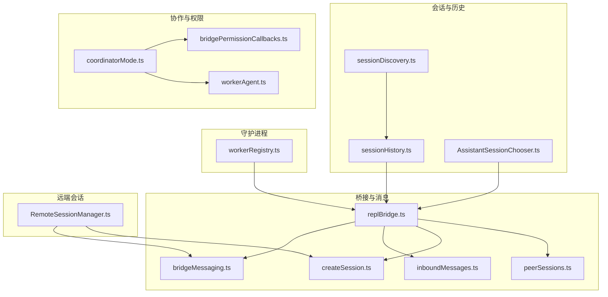
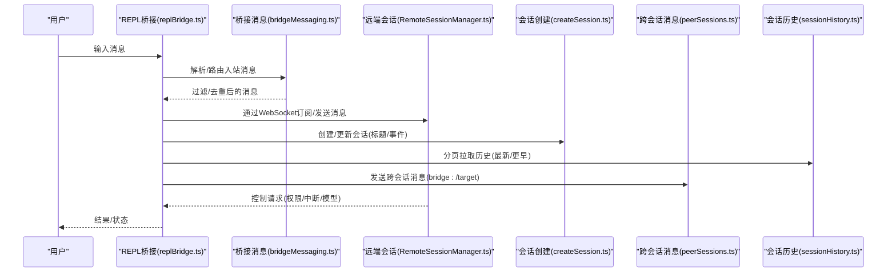
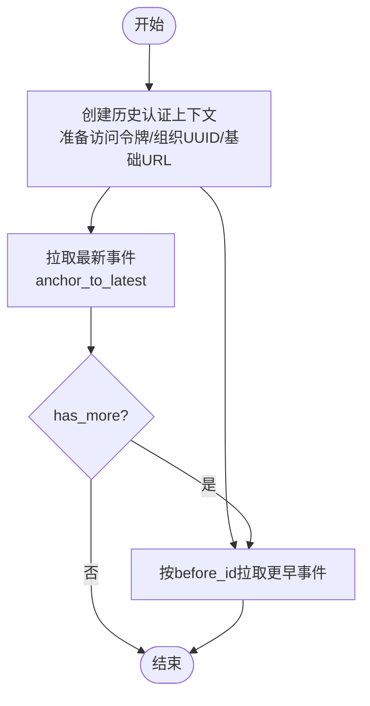
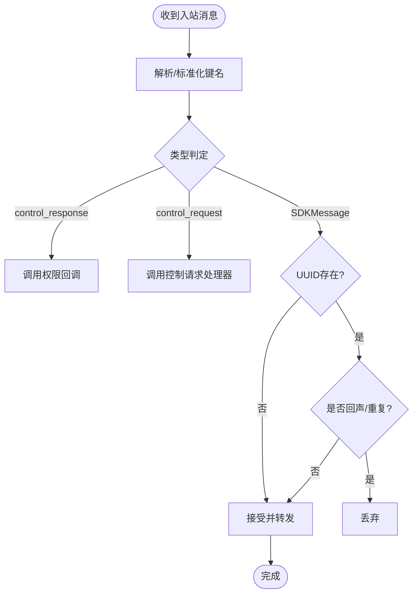
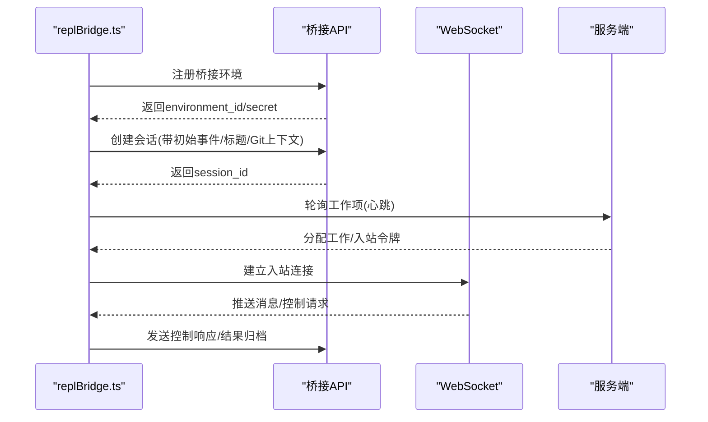
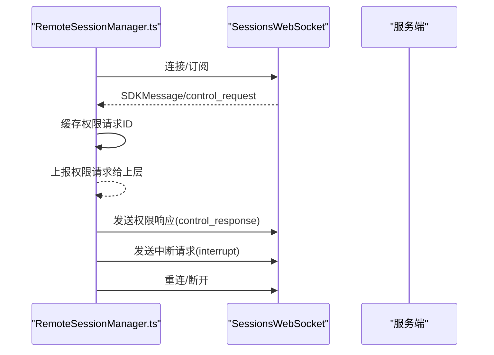
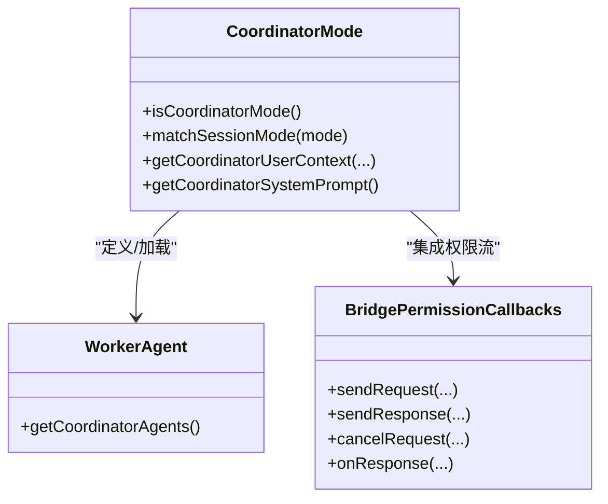
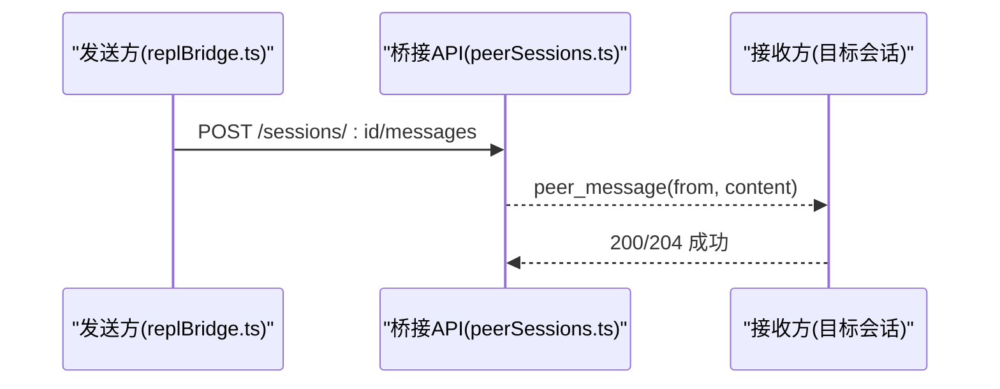
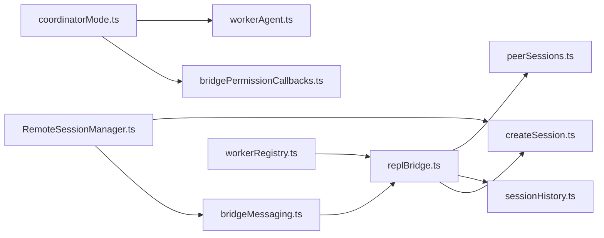

# 代理通信与协作

<cite>
**本文引用的文件**
- [assistant/sessionDiscovery.ts](file://src/assistant/sessionDiscovery.ts)
- [assistant/sessionHistory.ts](file://src/assistant/sessionHistory.ts)
- [assistant/AssistantSessionChooser.ts](file://src/assistant/AssistantSessionChooser.ts)
- [bridge/bridgeMessaging.ts](file://src/bridge/bridgeMessaging.ts)
- [bridge/replBridge.ts](file://src/bridge/replBridge.ts)
- [bridge/inboundMessages.ts](file://src/bridge/inboundMessages.ts)
- [bridge/createSession.ts](file://src/bridge/createSession.ts)
- [bridge/peerSessions.ts](file://src/bridge/peerSessions.ts)
- [remote/RemoteSessionManager.ts](file://src/remote/RemoteSessionManager.ts)
- [bridge/bridgePermissionCallbacks.ts](file://src/bridge/bridgePermissionCallbacks.ts)
- [coordinator/coordinatorMode.ts](file://src/coordinator/coordinatorMode.ts)
- [coordinator/workerAgent.ts](file://src/coordinator/workerAgent.ts)
- [daemon/workerRegistry.ts](file://src/daemon/workerRegistry.ts)
</cite>

## 目录
1. [引言](#引言)
2. [项目结构](#项目结构)
3. [核心组件](#核心组件)
4. [架构总览](#架构总览)
5. [详细组件分析](#详细组件分析)
6. [依赖关系分析](#依赖关系分析)
7. [性能考量](#性能考量)
8. [故障排查指南](#故障排查指南)
9. [结论](#结论)
10. [附录](#附录)

## 引言
本文件聚焦于“代理通信与协作”能力，系统性梳理子代理之间的通信机制（消息传递、状态同步、资源共享）、协作模式与策略（任务分工、信息共享、结果整合）、会话发现与历史管理（状态跟踪、历史记录保存、状态恢复）、代理助手的交互设计（会话选择器、状态切换、上下文维护），以及在协作场景下的权限控制与安全机制，并给出最佳实践与常见应用场景。

## 项目结构
围绕代理通信与协作的关键模块主要分布在以下路径：
- 会话与历史：assistant/sessionDiscovery.ts、assistant/sessionHistory.ts、assistant/AssistantSessionChooser.ts
- 桥接与消息：bridge/bridgeMessaging.ts、bridge/replBridge.ts、bridge/inboundMessages.ts、bridge/createSession.ts、bridge/peerSessions.ts
- 远端会话管理：remote/RemoteSessionManager.ts
- 权限回调与协作模式：bridge/bridgePermissionCallbacks.ts、coordinator/coordinatorMode.ts、coordinator/workerAgent.ts
- 守护进程与工作注册：daemon/workerRegistry.ts

**图表来源**
- [assistant/sessionDiscovery.ts:1-4](file://src/assistant/sessionDiscovery.ts#L1-L4)
- [assistant/sessionHistory.ts:1-88](file://src/assistant/sessionHistory.ts#L1-L88)
- [assistant/AssistantSessionChooser.ts:1-4](file://src/assistant/AssistantSessionChooser.ts#L1-L4)
- [bridge/bridgeMessaging.ts:1-463](file://src/bridge/bridgeMessaging.ts#L1-L463)
- [bridge/replBridge.ts:1-800](file://src/bridge/replBridge.ts#L1-L800)
- [bridge/inboundMessages.ts:1-81](file://src/bridge/inboundMessages.ts#L1-L81)
- [bridge/createSession.ts:1-385](file://src/bridge/createSession.ts#L1-L385)
- [bridge/peerSessions.ts:1-85](file://src/bridge/peerSessions.ts#L1-L85)
- [remote/RemoteSessionManager.ts:1-345](file://src/remote/RemoteSessionManager.ts#L1-L345)
- [bridge/bridgePermissionCallbacks.ts:1-44](file://src/bridge/bridgePermissionCallbacks.ts#L1-L44)
- [coordinator/coordinatorMode.ts:1-370](file://src/coordinator/coordinatorMode.ts#L1-L370)
- [coordinator/workerAgent.ts:1-5](file://src/coordinator/workerAgent.ts#L1-L5)
- [daemon/workerRegistry.ts:1-4](file://src/daemon/workerRegistry.ts#L1-L4)

**章节来源**
- [assistant/sessionDiscovery.ts:1-4](file://src/assistant/sessionDiscovery.ts#L1-L4)
- [assistant/sessionHistory.ts:1-88](file://src/assistant/sessionHistory.ts#L1-L88)
- [assistant/AssistantSessionChooser.ts:1-4](file://src/assistant/AssistantSessionChooser.ts#L1-L4)
- [bridge/bridgeMessaging.ts:1-463](file://src/bridge/bridgeMessaging.ts#L1-L463)
- [bridge/replBridge.ts:1-800](file://src/bridge/replBridge.ts#L1-L800)
- [bridge/inboundMessages.ts:1-81](file://src/bridge/inboundMessages.ts#L1-L81)
- [bridge/createSession.ts:1-385](file://src/bridge/createSession.ts#L1-L385)
- [bridge/peerSessions.ts:1-85](file://src/bridge/peerSessions.ts#L1-L85)
- [remote/RemoteSessionManager.ts:1-345](file://src/remote/RemoteSessionManager.ts#L1-L345)
- [bridge/bridgePermissionCallbacks.ts:1-44](file://src/bridge/bridgePermissionCallbacks.ts#L1-L44)
- [coordinator/coordinatorMode.ts:1-370](file://src/coordinator/coordinatorMode.ts#L1-L370)
- [coordinator/workerAgent.ts:1-5](file://src/coordinator/workerAgent.ts#L1-L5)
- [daemon/workerRegistry.ts:1-4](file://src/daemon/workerRegistry.ts#L1-L4)

## 核心组件
- 会话发现与选择：提供会话枚举与选择器接口，支撑用户在多会话间切换与导航。
- 历史管理：以分页方式拉取会话事件，支持“最新事件”和“更早事件”的增量加载，保障历史可追溯与可恢复。
- 桥接消息处理：统一解析与路由入站消息，过滤非桥接消息，去重回声与重复提示，处理服务端控制请求与响应。
- 本地 REPL 桥接：注册环境、创建/重连会话、心跳轮询、传输层切换、标题派生、断线重连策略与持久化指针。
- 远端会话管理：通过 WebSocket 订阅会话事件，使用 HTTP 发送用户消息，处理权限请求/取消/响应。
- 子代理协作：协调者模式定义工具集与工作流，权限回调封装跨代理授权流程，支持消息转发与状态同步。
- 跨会话消息：通过桥接 API 向其他 Claude 会话发送纯文本消息，实现子代理间即时通信。

**章节来源**
- [assistant/sessionDiscovery.ts:1-4](file://src/assistant/sessionDiscovery.ts#L1-L4)
- [assistant/sessionHistory.ts:1-88](file://src/assistant/sessionHistory.ts#L1-L88)
- [assistant/AssistantSessionChooser.ts:1-4](file://src/assistant/AssistantSessionChooser.ts#L1-L4)
- [bridge/bridgeMessaging.ts:1-463](file://src/bridge/bridgeMessaging.ts#L1-L463)
- [bridge/replBridge.ts:1-800](file://src/bridge/replBridge.ts#L1-L800)
- [remote/RemoteSessionManager.ts:1-345](file://src/remote/RemoteSessionManager.ts#L1-L345)
- [bridge/bridgePermissionCallbacks.ts:1-44](file://src/bridge/bridgePermissionCallbacks.ts#L1-L44)
- [coordinator/coordinatorMode.ts:1-370](file://src/coordinator/coordinatorMode.ts#L1-L370)
- [bridge/peerSessions.ts:1-85](file://src/bridge/peerSessions.ts#L1-L85)

## 架构总览
下图展示从用户输入到子代理协作与跨会话通信的整体链路，涵盖消息入站、权限决策、消息转发、历史拉取与会话恢复等关键环节。

**图表来源**
- [bridge/replBridge.ts:1-800](file://src/bridge/replBridge.ts#L1-L800)
- [bridge/bridgeMessaging.ts:1-463](file://src/bridge/bridgeMessaging.ts#L1-L463)
- [remote/RemoteSessionManager.ts:1-345](file://src/remote/RemoteSessionManager.ts#L1-L345)
- [bridge/createSession.ts:1-385](file://src/bridge/createSession.ts#L1-L385)
- [bridge/peerSessions.ts:1-85](file://src/bridge/peerSessions.ts#L1-L85)
- [assistant/sessionHistory.ts:1-88](file://src/assistant/sessionHistory.ts#L1-L88)

## 详细组件分析

### 组件A：会话发现与历史管理
- 会话发现：提供会话枚举与选择器接口，便于在多会话环境中进行切换与导航。
- 历史分页：以“锚定最新”和“基于游标前溯”的方式分页拉取事件，支持“是否还有更多”与“首条ID”，保证历史可追溯与增量加载。
- 认证上下文：统一准备访问令牌、组织UUID与API头，避免重复计算与错误传播。

**图表来源**
- [assistant/sessionHistory.ts:1-88](file://src/assistant/sessionHistory.ts#L1-L88)

**章节来源**
- [assistant/sessionDiscovery.ts:1-4](file://src/assistant/sessionDiscovery.ts#L1-L4)
- [assistant/AssistantSessionChooser.ts:1-4](file://src/assistant/AssistantSessionChooser.ts#L1-L4)
- [assistant/sessionHistory.ts:1-88](file://src/assistant/sessionHistory.ts#L1-L88)

### 组件B：桥接消息处理与去重
- 类型守卫：对入站消息进行类型校验，区分 SDKMessage、control_request、control_response。
- 入站路由：仅转发用户/助理对话与特定系统命令；对虚拟消息与非人类来源内容进行过滤。
- 回声与重复防护：通过“最近已发UUID集合”与“最近已收UUID集合”实现双向去重，避免回环与重复注入。
- 控制请求处理：对服务器发起的初始化、设置模型、最大思考令牌、权限模式、中断等请求进行快速响应，防止连接超时。

**图表来源**
- [bridge/bridgeMessaging.ts:1-463](file://src/bridge/bridgeMessaging.ts#L1-L463)

**章节来源**
- [bridge/bridgeMessaging.ts:1-463](file://src/bridge/bridgeMessaging.ts#L1-L463)

### 组件C：本地 REPL 桥接与会话生命周期
- 环境注册：生成桥接ID与环境ID，注册桥接环境并获取环境密钥。
- 会话创建：通过HTTP创建会话，携带标题、初始事件、Git源/产出上下文、权限模式等。
- 心跳轮询：周期性轮询工作项，获取入站令牌后建立WebSocket；异常断开时快速重连并携带SSE序列号。
- 断线重连：支持“原地重连”与“全新会话”两种策略，保留或重建会话，确保URL与上下文一致性。
- 标题派生：在首次真实用户消息到达时派生会话标题，避免空标题影响体验。
- 结果归档：会话结束前构造最小结果事件，触发服务端归档。

**图表来源**
- [bridge/replBridge.ts:1-800](file://src/bridge/replBridge.ts#L1-L800)
- [bridge/createSession.ts:1-385](file://src/bridge/createSession.ts#L1-L385)

**章节来源**
- [bridge/replBridge.ts:1-800](file://src/bridge/replBridge.ts#L1-L800)
- [bridge/createSession.ts:1-385](file://src/bridge/createSession.ts#L1-L385)

### 组件D：远端会话管理与权限流
- WebSocket 订阅：连接指定会话，接收SDK消息与控制请求。
- HTTP 发送：向远端会话发送用户消息，支持UUID标注。
- 权限请求：接收服务器发起的工具使用许可请求，缓存请求ID，回调通知上层决策。
- 取消与响应：支持取消未决请求与发送允许/拒绝响应，保持与服务器的握手一致。
- 中断与重连：支持中断当前请求、主动断开与强制重连，适配容器重启等场景。

**图表来源**
- [remote/RemoteSessionManager.ts:1-345](file://src/remote/RemoteSessionManager.ts#L1-L345)

**章节来源**
- [remote/RemoteSessionManager.ts:1-345](file://src/remote/RemoteSessionManager.ts#L1-L345)

### 组件E：子代理协作与权限回调
- 协调者模式：定义工具集、工作流与提示词，指导子代理研究、合成、实现与验证阶段的并发与顺序。
- 权限回调：抽象跨代理授权流程，支持允许、拒绝与建议更新，屏蔽具体策略细节。
- 工作代理：提供工作代理定义入口，配合协调者模式进行任务分发与结果整合。

**图表来源**
- [coordinator/coordinatorMode.ts:1-370](file://src/coordinator/coordinatorMode.ts#L1-L370)
- [bridge/bridgePermissionCallbacks.ts:1-44](file://src/bridge/bridgePermissionCallbacks.ts#L1-L44)
- [coordinator/workerAgent.ts:1-5](file://src/coordinator/workerAgent.ts#L1-L5)

**章节来源**
- [coordinator/coordinatorMode.ts:1-370](file://src/coordinator/coordinatorMode.ts#L1-L370)
- [bridge/bridgePermissionCallbacks.ts:1-44](file://src/bridge/bridgePermissionCallbacks.ts#L1-L44)
- [coordinator/workerAgent.ts:1-5](file://src/coordinator/workerAgent.ts#L1-L5)

### 组件F：跨会话消息与资源体裁剪
- 跨会话消息：通过桥接API向目标会话发送“peer_message”，携带来源会话ID与纯文本内容，支持路径校验与超时控制。
- 图像块规范化：对来自移动端/网页客户端的图像块进行媒体类型规范化，避免因字段缺失导致后续API失败。

**图表来源**
- [bridge/peerSessions.ts:1-85](file://src/bridge/peerSessions.ts#L1-L85)
- [bridge/inboundMessages.ts:1-81](file://src/bridge/inboundMessages.ts#L1-L81)

**章节来源**
- [bridge/peerSessions.ts:1-85](file://src/bridge/peerSessions.ts#L1-L85)
- [bridge/inboundMessages.ts:1-81](file://src/bridge/inboundMessages.ts#L1-L81)

## 依赖关系分析
- 模块内聚：桥接消息处理与REPL桥接紧密耦合，共同负责入站消息的解析、去重与控制请求响应。
- 外部依赖：历史拉取依赖OAuth配置与组织UUID；跨会话消息依赖桥接访问令牌与会话兼容ID转换。
- 权限边界：权限回调在桥接层与协调者模式之间形成清晰边界，既保证策略隔离，又便于扩展。

**图表来源**
- [bridge/bridgeMessaging.ts:1-463](file://src/bridge/bridgeMessaging.ts#L1-L463)
- [bridge/replBridge.ts:1-800](file://src/bridge/replBridge.ts#L1-L800)
- [bridge/createSession.ts:1-385](file://src/bridge/createSession.ts#L1-L385)
- [assistant/sessionHistory.ts:1-88](file://src/assistant/sessionHistory.ts#L1-L88)
- [bridge/peerSessions.ts:1-85](file://src/bridge/peerSessions.ts#L1-L85)
- [remote/RemoteSessionManager.ts:1-345](file://src/remote/RemoteSessionManager.ts#L1-L345)
- [bridge/bridgePermissionCallbacks.ts:1-44](file://src/bridge/bridgePermissionCallbacks.ts#L1-L44)
- [coordinator/coordinatorMode.ts:1-370](file://src/coordinator/coordinatorMode.ts#L1-L370)
- [coordinator/workerAgent.ts:1-5](file://src/coordinator/workerAgent.ts#L1-L5)
- [daemon/workerRegistry.ts:1-4](file://src/daemon/workerRegistry.ts#L1-L4)

**章节来源**
- [bridge/bridgeMessaging.ts:1-463](file://src/bridge/bridgeMessaging.ts#L1-L463)
- [bridge/replBridge.ts:1-800](file://src/bridge/replBridge.ts#L1-L800)
- [bridge/createSession.ts:1-385](file://src/bridge/createSession.ts#L1-L385)
- [assistant/sessionHistory.ts:1-88](file://src/assistant/sessionHistory.ts#L1-L88)
- [bridge/peerSessions.ts:1-85](file://src/bridge/peerSessions.ts#L1-L85)
- [remote/RemoteSessionManager.ts:1-345](file://src/remote/RemoteSessionManager.ts#L1-L345)
- [bridge/bridgePermissionCallbacks.ts:1-44](file://src/bridge/bridgePermissionCallbacks.ts#L1-L44)
- [coordinator/coordinatorMode.ts:1-370](file://src/coordinator/coordinatorMode.ts#L1-L370)
- [coordinator/workerAgent.ts:1-5](file://src/coordinator/workerAgent.ts#L1-L5)
- [daemon/workerRegistry.ts:1-4](file://src/daemon/workerRegistry.ts#L1-L4)

## 性能考量
- 历史分页：采用固定页大小与“锚定最新/前溯游标”策略，降低单次拉取成本，适合长历史会话增量加载。
- 去重窗口：BoundedUUIDSet容量固定，内存占用稳定，有效抑制回声与重复提示带来的抖动。
- 心跳与重连：指数退避与快速重试结合，缩短异常恢复时间；SSE序列号携带避免全量历史重放。
- 权限流：控制请求必须快速响应，避免服务器挂起；权限决策尽量本地化，减少网络往返。

[本节为通用性能讨论，不直接分析具体文件]

## 故障排查指南
- 入站消息未达：检查类型守卫与过滤逻辑，确认消息是否被误判为虚拟/非人类来源；查看回声与重复防护日志。
- 权限请求无响应：确认控制请求处理器是否正确返回响应；检查回调是否注册与订阅。
- 会话历史丢失：核对分页参数与游标，确保“锚定最新”与“前溯”组合使用；检查has_more与first_id。
- 跨会话消息失败：确认目标会话ID合法性、访问令牌有效性与超时设置；关注HTTP状态码与错误详情。
- 断线重连异常：检查环境ID复用与会话重连策略；核对SSE序列号是否正确传递与更新。

**章节来源**
- [bridge/bridgeMessaging.ts:1-463](file://src/bridge/bridgeMessaging.ts#L1-L463)
- [remote/RemoteSessionManager.ts:1-345](file://src/remote/RemoteSessionManager.ts#L1-L345)
- [assistant/sessionHistory.ts:1-88](file://src/assistant/sessionHistory.ts#L1-L88)
- [bridge/peerSessions.ts:1-85](file://src/bridge/peerSessions.ts#L1-L85)
- [bridge/replBridge.ts:1-800](file://src/bridge/replBridge.ts#L1-L800)

## 结论
该体系通过“桥接消息处理 + REPL会话生命周期 + 远端会话管理 + 协调者模式 + 权限回调 + 跨会话消息”构建了完整的代理通信与协作闭环。其特性包括：
- 明确的消息边界与严格的去重机制，确保消息可靠与高效。
- 分页历史与SSE序列号保障状态可恢复与可追踪。
- 权限流与控制请求快速响应，提升交互稳定性。
- 跨会话消息与协作模式，支持复杂任务的分工与整合。

[本节为总结性内容，不直接分析具体文件]

## 附录
- 最佳实践
  - 使用“锚定最新 + 游标前溯”组合拉取历史，避免一次性加载过大数据。
  - 在REPL桥接中启用标题派生与SSE序列号携带，提升用户体验与恢复能力。
  - 将权限决策下沉至回调层，保持策略与实现解耦。
  - 对跨会话消息进行路径校验与超时控制，增强安全性与鲁棒性。
- 常见场景
  - 并行研究与验证：协调者模式下多子代理并行执行，最终由协调者整合结果。
  - 任务继续与修正：通过“继续消息”保持上下文连续，针对失败进行针对性修正。
  - 远端协作：通过远端会话管理与HTTP/WS通道实现远程控制与权限协商。

[本节为概念性内容，不直接分析具体文件]