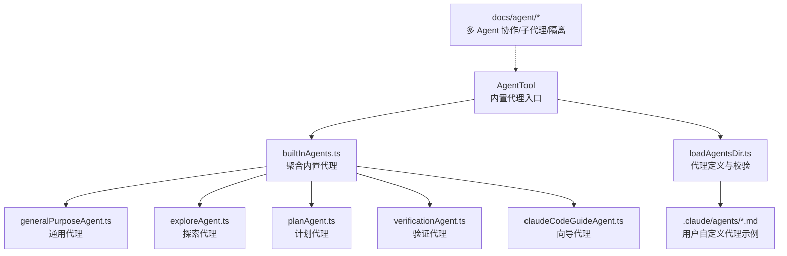
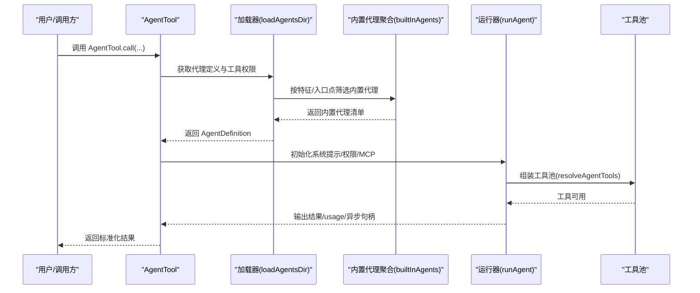
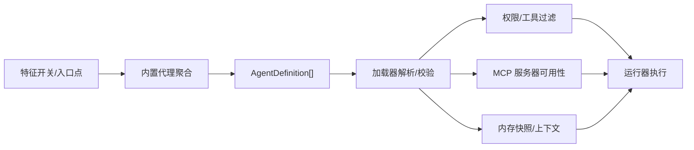

# 内置代理

<cite>
**本文引用的文件**
- [src/tools/AgentTool/builtInAgents.ts](file://src/tools/AgentTool/builtInAgents.ts)
- [src/tools/AgentTool/loadAgentsDir.ts](file://src/tools/AgentTool/loadAgentsDir.ts)
- [src/tools/AgentTool/built-in/generalPurposeAgent.ts](file://src/tools/AgentTool/built-in/generalPurposeAgent.ts)
- [src/tools/AgentTool/built-in/exploreAgent.ts](file://src/tools/AgentTool/built-in/exploreAgent.ts)
- [src/tools/AgentTool/built-in/planAgent.ts](file://src/tools/AgentTool/built-in/planAgent.ts)
- [src/tools/AgentTool/built-in/verificationAgent.ts](file://src/tools/AgentTool/built-in/verificationAgent.ts)
- [src/tools/AgentTool/built-in/claudeCodeGuideAgent.ts](file://src/tools/AgentTool/built-in/claudeCodeGuideAgent.ts)
- [.claude/agents/hello-agent.md](file://.claude/agents/hello-agent.md)
- [docs/agent/coordinator-and-swarm.mdx](file://docs/agent/coordinator-and-swarm.mdx)
- [docs/agent/sub-agents.mdx](file://docs/agent/sub-agents.mdx)
- [docs/agent/worktree-isolation.mdx](file://docs/agent/worktree-isolation.mdx)
</cite>

## 目录
1. [简介](#简介)
2. [项目结构](#项目结构)
3. [核心组件](#核心组件)
4. [架构总览](#架构总览)
5. [详细组件分析](#详细组件分析)
6. [依赖关系分析](#依赖关系分析)
7. [性能考量](#性能考量)
8. [故障排查指南](#故障排查指南)
9. [结论](#结论)
10. [附录](#附录)

## 简介
本章节面向希望使用并理解 Claude Code 内置代理能力的开发者与使用者。文档系统性介绍内置代理的类型、用途、工具集与能力边界，并结合实际工作流说明如何选择与定制合适的内置代理。内置代理包括通用代理、探索代理、计划代理、验证代理以及“向导”代理等，它们通过统一的 Agent 定义与加载机制接入系统，支持工具权限隔离、子代理委派、工作树隔离、后台运行等高级能力。

## 项目结构
内置代理的定义与加载集中在 AgentTool 的内置代理模块与加载器中，同时配合文档说明其协作模式与隔离机制。

图表来源
- [src/tools/AgentTool/builtInAgents.ts:22-72](file://src/tools/AgentTool/builtInAgents.ts#L22-L72)
- [src/tools/AgentTool/loadAgentsDir.ts:296-393](file://src/tools/AgentTool/loadAgentsDir.ts#L296-L393)
- [src/tools/AgentTool/built-in/generalPurposeAgent.ts:25-34](file://src/tools/AgentTool/built-in/generalPurposeAgent.ts#L25-L34)
- [src/tools/AgentTool/built-in/exploreAgent.ts:64-83](file://src/tools/AgentTool/built-in/exploreAgent.ts#L64-L83)
- [src/tools/AgentTool/built-in/planAgent.ts:73-92](file://src/tools/AgentTool/built-in/planAgent.ts#L73-L92)
- [src/tools/AgentTool/built-in/verificationAgent.ts:134-152](file://src/tools/AgentTool/built-in/verificationAgent.ts#L134-L152)
- [src/tools/AgentTool/built-in/claudeCodeGuideAgent.ts:98-205](file://src/tools/AgentTool/built-in/claudeCodeGuideAgent.ts#L98-L205)
- [.claude/agents/hello-agent.md:1-18](file://.claude/agents/hello-agent.md#L1-L18)
- [docs/agent/coordinator-and-swarm.mdx:1-197](file://docs/agent/coordinator-and-swarm.mdx#L1-L197)
- [docs/agent/sub-agents.mdx:1-195](file://docs/agent/sub-agents.mdx#L1-L195)
- [docs/agent/worktree-isolation.mdx:1-181](file://docs/agent/worktree-isolation.mdx#L1-L181)

章节来源
- [src/tools/AgentTool/builtInAgents.ts:22-72](file://src/tools/AgentTool/builtInAgents.ts#L22-L72)
- [src/tools/AgentTool/loadAgentsDir.ts:296-393](file://src/tools/AgentTool/loadAgentsDir.ts#L296-L393)
- [.claude/agents/hello-agent.md:1-18](file://.claude/agents/hello-agent.md#L1-L18)

## 核心组件
- 内置代理聚合器：负责在运行期按特征开关、入口点与特性标志动态装配内置代理集合。
- 代理定义加载器：负责解析用户自定义代理与插件代理，统一为 AgentDefinition 类型，提供工具权限、MCP 服务器、内存快照、隔离模式等能力。
- 具体内置代理：通用代理、探索代理、计划代理、验证代理、向导代理，分别针对不同任务域与工作流阶段提供专用系统提示与工具限制。

章节来源
- [src/tools/AgentTool/builtInAgents.ts:22-72](file://src/tools/AgentTool/builtInAgents.ts#L22-L72)
- [src/tools/AgentTool/loadAgentsDir.ts:105-184](file://src/tools/AgentTool/loadAgentsDir.ts#L105-L184)

## 架构总览
内置代理通过统一的 AgentDefinition 接口与加载器进行注册与调度，支持：
- 工具权限与工具白/黑名单控制
- MCP 服务器声明与可用性等待
- 内存快照与持久化上下文
- 子代理委派与工作树隔离
- 后台运行与异步生命周期管理

图表来源
- [src/tools/AgentTool/builtInAgents.ts:22-72](file://src/tools/AgentTool/builtInAgents.ts#L22-L72)
- [src/tools/AgentTool/loadAgentsDir.ts:296-393](file://src/tools/AgentTool/loadAgentsDir.ts#L296-L393)
- [docs/agent/sub-agents.mdx:9-34](file://docs/agent/sub-agents.mdx#L9-L34)

## 详细组件分析

### 通用代理 General Purpose Agent
- 用途：通用型研究与多步骤任务代理，适合复杂问题探索、大规模代码搜索与跨文件分析。
- 工具集：默认开放全部工具（通配符），具体可用工具由运行时权限与 MCP 工具继承决定。
- 系统提示：强调“完成任务、避免过度修饰”，并提供通用能力与指导原则。
- 适用场景：日常开发中的“广撒网式”搜索、跨模块关联分析、多轮研究任务。

章节来源
- [src/tools/AgentTool/built-in/generalPurposeAgent.ts:25-34](file://src/tools/AgentTool/built-in/generalPurposeAgent.ts#L25-L34)

### 探索代理 Explore Agent
- 用途：专注文件与代码探索的只读代理，用于快速定位文件、搜索关键字与理解现有实现。
- 工具集：默认开放搜索与只读工具，禁用一切文件写入与编辑工具。
- 系统提示：严格限制“不得修改项目”，强调高效并行搜索与报告产出。
- 性能优化：内置标志位可省略 CLAUDE.md 上下文，减少 token 消耗。
- 适用场景：大规模代码库的快速检索、关键词/文件模式搜索、初步问题定位。

章节来源
- [src/tools/AgentTool/built-in/exploreAgent.ts:64-83](file://src/tools/AgentTool/built-in/exploreAgent.ts#L64-L83)

### 计划代理 Plan Agent
- 用途：软件架构与规划专家，基于探索结果设计实现方案，输出可执行的步骤与关键文件清单。
- 工具集：与探索代理一致，禁用一切文件写入与编辑工具。
- 系统提示：定义“理解需求—深入探索—设计解法—详细计划”的四步流程，要求输出关键实现文件。
- 适用场景：功能设计阶段、技术方案评审、实现路径规划。

章节来源
- [src/tools/AgentTool/built-in/planAgent.ts:73-92](file://src/tools/AgentTool/built-in/planAgent.ts#L73-L92)

### 验证代理 Verification Agent
- 用途：对抗性验证专家，目标是“尽可能破坏实现”，对前端、后端、CLI、基础设施等进行系统性验证。
- 工具集：默认开放全部工具，禁用一切项目内写入与编辑工具（临时目录除外）。
- 系统提示：提供通用验证策略与输出格式规范，强调“必须包含命令执行证据”。
- 适用场景：实现完成后进行回归与边界测试、对抗性探针、多环境验证。

章节来源
- [src/tools/AgentTool/built-in/verificationAgent.ts:134-152](file://src/tools/AgentTool/built-in/verificationAgent.ts#L134-L152)

### 向导代理 Claude Code Guide Agent
- 用途：帮助用户理解 Claude Code、Agent SDK 与 Claude API 的官方向导，提供文档驱动的问答与建议。
- 工具集：根据构建类型动态选择本地搜索工具（嵌入式或专用工具），并具备网络搜索与抓取能力。
- 系统提示：动态注入当前项目的自定义技能、自定义代理、MCP 服务器与用户设置，使回答更具针对性。
- 适用场景：新用户引导、功能发现、最佳实践建议。

章节来源
- [src/tools/AgentTool/built-in/claudeCodeGuideAgent.ts:98-205](file://src/tools/AgentTool/built-in/claudeCodeGuideAgent.ts#L98-L205)

### 子代理与工作流
- 子代理机制：支持命名代理与 Fork 子进程两类路径，前者用于专业委派，后者用于 Prompt Cache 共享与高命中率。
- 工具池独立组装：子代理拥有独立的工具权限上下文与 MCP 工具继承，避免权限泄露。
- 工作树隔离：通过 git worktree 为子代理提供文件级隔离，支持快速恢复与安全清理。
- 异步生命周期：支持后台运行与自动后台化，便于长时间任务与并行实验。

章节来源
- [docs/agent/sub-agents.mdx:9-34](file://docs/agent/sub-agents.mdx#L9-L34)
- [docs/agent/worktree-isolation.mdx:1-181](file://docs/agent/worktree-isolation.mdx#L1-L181)

### 协调者与蜂群模式
- 协调者模式：星型拓扑，Coordinator 负责编排与综合，Worker 仅执行，通信采用定向消息与任务通知协议。
- 蜂群模式：网状拓扑，Agent 自主认领任务，通过共享任务列表与文件锁实现并发安全。
- 二者可叠加：在蜂群之上运行协调者，将协调者作为特殊 Leader Agent。

章节来源
- [docs/agent/coordinator-and-swarm.mdx:1-197](file://docs/agent/coordinator-and-swarm.mdx#L1-L197)

## 依赖关系分析
内置代理的加载与调度遵循统一接口，同时受以下因素影响：
- 特征开关：如探索/计划代理的启用、验证代理的启用与模型策略。
- 入口点：SDK 与非 SDK 入口对内置代理集合的影响。
- MCP 服务器：代理可声明所需 MCP 服务器，系统在调用前等待可用。
- 内存快照：自定义代理可启用内存快照，自动注入读写工具以访问持久化上下文。

图表来源
- [src/tools/AgentTool/builtInAgents.ts:13-72](file://src/tools/AgentTool/builtInAgents.ts#L13-L72)
- [src/tools/AgentTool/loadAgentsDir.ts:229-255](file://src/tools/AgentTool/loadAgentsDir.ts#L229-L255)
- [src/tools/AgentTool/loadAgentsDir.ts:262-294](file://src/tools/AgentTool/loadAgentsDir.ts#L262-L294)

章节来源
- [src/tools/AgentTool/builtInAgents.ts:13-72](file://src/tools/AgentTool/builtInAgents.ts#L13-L72)
- [src/tools/AgentTool/loadAgentsDir.ts:229-255](file://src/tools/AgentTool/loadAgentsDir.ts#L229-L255)
- [src/tools/AgentTool/loadAgentsDir.ts:262-294](file://src/tools/AgentTool/loadAgentsDir.ts#L262-L294)

## 性能考量
- Prompt Cache 共享：Fork 子进程通过共享父代理的 assistant 消息与占位符，最大化缓存命中，降低重复 token 开销。
- 上下文裁剪：探索与计划代理可省略 CLAUDE.md 上下文，显著减少 token 消耗。
- 工具权限收敛：子代理独立组装工具池，避免不必要的工具调用与权限检查。
- 异步执行：后台运行与自动后台化减少主线程阻塞，提升吞吐。

章节来源
- [docs/agent/sub-agents.mdx:50-58](file://docs/agent/sub-agents.mdx#L50-L58)
- [src/tools/AgentTool/built-in/exploreAgent.ts:79-81](file://src/tools/AgentTool/built-in/exploreAgent.ts#L79-L81)
- [src/tools/AgentTool/built-in/planAgent.ts:88-90](file://src/tools/AgentTool/built-in/planAgent.ts#L88-L90)

## 故障排查指南
- 代理不可见或未生效
  - 检查特征开关与入口点是否满足内置代理的启用条件。
  - 确认是否处于简单模式（仅内置代理）或自定义代理解析错误导致回退。
- 工具不可用
  - 检查代理定义中的工具白/黑名单与权限模式。
  - 若声明了 MCP 服务器，确认其已连接且名称匹配。
- 文件写入失败
  - 探索/计划/验证代理默认禁用写入工具，需使用通用代理或自定义代理放宽限制。
- 工作树异常
  - 确认工作树创建/删除流程中的变更统计与安全防护逻辑，必要时手动清理或保留。
- 验证报告被拒
  - 确保每一步验证均包含可复现实验命令与输出，避免仅“阅读代码”的结论。

章节来源
- [src/tools/AgentTool/builtInAgents.ts:22-72](file://src/tools/AgentTool/builtInAgents.ts#L22-L72)
- [src/tools/AgentTool/loadAgentsDir.ts:229-255](file://src/tools/AgentTool/loadAgentsDir.ts#L229-L255)
- [src/tools/AgentTool/built-in/exploreAgent.ts:67-73](file://src/tools/AgentTool/built-in/exploreAgent.ts#L67-L73)
- [src/tools/AgentTool/built-in/planAgent.ts:77-83](file://src/tools/AgentTool/built-in/planAgent.ts#L77-L83)
- [src/tools/AgentTool/built-in/verificationAgent.ts:139-145](file://src/tools/AgentTool/built-in/verificationAgent.ts#L139-L145)
- [docs/agent/worktree-isolation.mdx:103-142](file://docs/agent/worktree-isolation.mdx#L103-L142)

## 结论
内置代理体系通过统一的定义与加载机制，为不同任务域提供专业化、可组合、可隔离的智能体能力。结合子代理委派、工作树隔离与后台运行等机制，开发者可以在保证安全性与可维护性的前提下，灵活地组织复杂任务的执行流程。建议在日常工作中优先使用探索/计划代理进行前期研究与方案设计，再以通用代理执行具体实现，并在关键节点引入验证代理进行对抗性测试。

## 附录

### 内置代理一览与适用场景
- 通用代理：适用于复杂研究与多步骤任务，工具全开放。
- 探索代理：适用于只读文件与代码探索，快速定位与检索。
- 计划代理：适用于架构设计与实现规划，输出关键文件清单。
- 验证代理：适用于对抗性验证，确保实现质量与鲁棒性。
- 向导代理：适用于用户引导与功能发现，提供文档驱动的建议。

章节来源
- [src/tools/AgentTool/built-in/generalPurposeAgent.ts:25-34](file://src/tools/AgentTool/built-in/generalPurposeAgent.ts#L25-L34)
- [src/tools/AgentTool/built-in/exploreAgent.ts:64-83](file://src/tools/AgentTool/built-in/exploreAgent.ts#L64-L83)
- [src/tools/AgentTool/built-in/planAgent.ts:73-92](file://src/tools/AgentTool/built-in/planAgent.ts#L73-L92)
- [src/tools/AgentTool/built-in/verificationAgent.ts:134-152](file://src/tools/AgentTool/built-in/verificationAgent.ts#L134-L152)
- [src/tools/AgentTool/built-in/claudeCodeGuideAgent.ts:98-205](file://src/tools/AgentTool/built-in/claudeCodeGuideAgent.ts#L98-L205)

### 用户自定义代理参考
- 示例文件展示了如何在 .claude/agents/ 目录下编写自定义代理，包含系统提示、工具限制与描述字段。

章节来源
- [.claude/agents/hello-agent.md:1-18](file://.claude/agents/hello-agent.md#L1-L18)