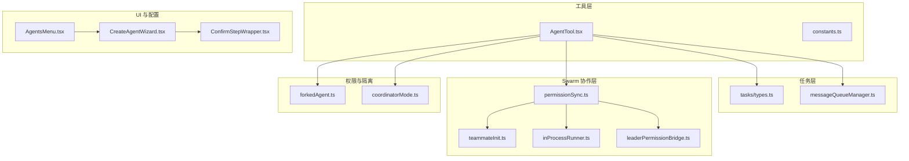
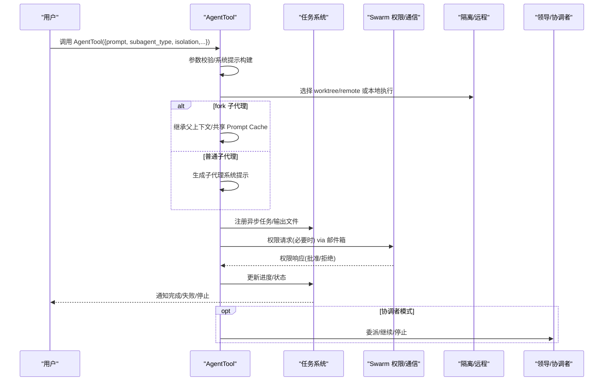
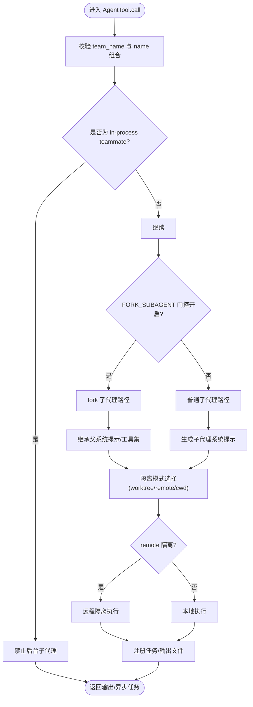
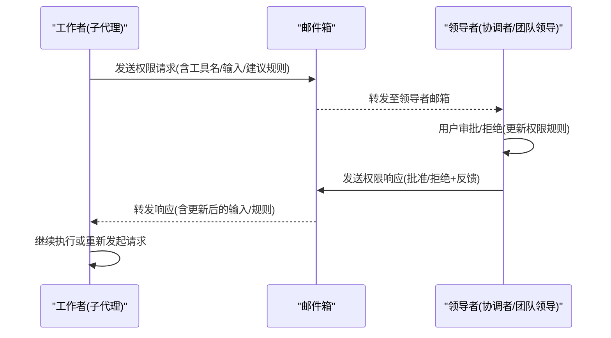
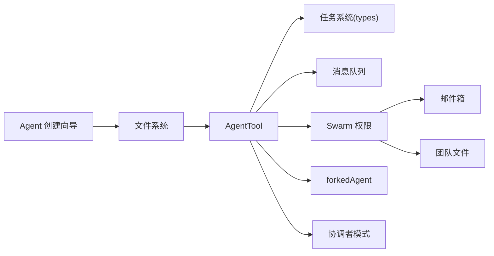

# 子代理系统

<cite>
**本文引用的文件**
- [src/tools/AgentTool/AgentTool.tsx](file://src/tools/AgentTool/AgentTool.tsx)
- [src/tools/AgentTool/constants.ts](file://src/tools/AgentTool/constants.ts)
- [src/utils/forkedAgent.ts](file://src/utils/forkedAgent.ts)
- [src/utils/swarm/permissionSync.ts](file://src/utils/swarm/permissionSync.ts)
- [src/utils/swarm/teammateInit.ts](file://src/utils/swarm/teammateInit.ts)
- [src/utils/swarm/inProcessRunner.ts](file://src/utils/swarm/inProcessRunner.ts)
- [src/utils/swarm/leaderPermissionBridge.ts](file://src/utils/swarm/leaderPermissionBridge.ts)
- [src/coordinator/coordinatorMode.ts](file://src/coordinator/coordinatorMode.ts)
- [src/tasks/types.ts](file://src/tasks/types.ts)
- [src/utils/messageQueueManager.ts](file://src/utils/messageQueueManager.ts)
- [src/components/agents/new-agent-creation/CreateAgentWizard.tsx](file://src/components/agents/new-agent-creation/CreateAgentWizard.tsx)
- [src/components/agents/new-agent-creation/wizard-steps/ConfirmStepWrapper.tsx](file://src/components/agents/new-agent-creation/wizard-steps/ConfirmStepWrapper.tsx)
- [src/components/agents/AgentsMenu.tsx](file://src/components/agents/AgentsMenu.tsx)
- [docs/agent/sub-agents.mdx](file://docs/agent/sub-agents.mdx)
- [docs/agent/coordinator-and-swarm.mdx](file://docs/agent/coordinator-and-swarm.mdx)
- [docs/features/fork-subagent.md](file://docs/features/fork-subagent.md)
- [V6.md](file://V6.md)
</cite>

## 目录
1. [引言](#引言)
2. [项目结构](#项目结构)
3. [核心组件](#核心组件)
4. [架构总览](#架构总览)
5. [详细组件分析](#详细组件分析)
6. [依赖关系分析](#依赖关系分析)
7. [性能考量](#性能考量)
8. [故障排查指南](#故障排查指南)
9. [结论](#结论)
10. [附录](#附录)

## 引言
本文件系统性阐述 Claude Code Best 的子代理（Sub-Agent）体系：从概念、创建与配置，到生命周期与任务执行；从权限与隔离，到跨代理通信与协作；再到故障处理与恢复策略。目标是帮助开发者高效、安全地利用子代理系统提升开发效率。

## 项目结构
子代理系统横跨工具层、任务层、Swarm 协作层与权限/隔离基础设施，关键目录与文件如下：
- 工具层：AgentTool 负责子代理的创建、参数校验、系统提示构建与执行分发
- 任务层：统一的任务类型定义与后台任务判定，支撑子代理的异步执行与进度通知
- Swarm 协作层：权限同步、邮件箱通信、团队初始化钩子、领导权限桥接
- 权限与隔离：fork 子代理上下文继承、工作树隔离、远程隔离
- 协调者模式：与子代理的委派与系统提示协同

**图表来源**
- [src/tools/AgentTool/AgentTool.tsx:385-800](file://src/tools/AgentTool/AgentTool.tsx#L385-L800)
- [src/tasks/types.ts:1-47](file://src/tasks/types.ts#L1-L47)
- [src/utils/messageQueueManager.ts:123-292](file://src/utils/messageQueueManager.ts#L123-L292)
- [src/utils/swarm/permissionSync.ts:1-800](file://src/utils/swarm/permissionSync.ts#L1-L800)
- [src/utils/swarm/teammateInit.ts:1-130](file://src/utils/swarm/teammateInit.ts#L1-L130)
- [src/utils/swarm/inProcessRunner.ts:350-392](file://src/utils/swarm/inProcessRunner.ts#L350-L392)
- [src/utils/swarm/leaderPermissionBridge.ts:1-55](file://src/utils/swarm/leaderPermissionBridge.ts#L1-L55)
- [src/utils/forkedAgent.ts:339-374](file://src/utils/forkedAgent.ts#L339-L374)
- [src/coordinator/coordinatorMode.ts:1-370](file://src/coordinator/coordinatorMode.ts#L1-L370)
- [src/components/agents/new-agent-creation/CreateAgentWizard.tsx:20-68](file://src/components/agents/new-agent-creation/CreateAgentWizard.tsx#L20-L68)
- [src/components/agents/new-agent-creation/wizard-steps/ConfirmStepWrapper.tsx:32-71](file://src/components/agents/new-agent-creation/wizard-steps/ConfirmStepWrapper.tsx#L32-L71)
- [src/components/agents/AgentsMenu.tsx:130-176](file://src/components/agents/AgentsMenu.tsx#L130-L176)

**章节来源**
- [src/tools/AgentTool/AgentTool.tsx:385-800](file://src/tools/AgentTool/AgentTool.tsx#L385-L800)
- [src/tasks/types.ts:1-47](file://src/tasks/types.ts#L1-L47)
- [src/utils/swarm/permissionSync.ts:1-800](file://src/utils/swarm/permissionSync.ts#L1-L800)
- [src/utils/swarm/teammateInit.ts:1-130](file://src/utils/swarm/teammateInit.ts#L1-L130)
- [src/utils/swarm/inProcessRunner.ts:350-392](file://src/utils/swarm/inProcessRunner.ts#L350-L392)
- [src/utils/swarm/leaderPermissionBridge.ts:1-55](file://src/utils/swarm/leaderPermissionBridge.ts#L1-L55)
- [src/utils/forkedAgent.ts:339-374](file://src/utils/forkedAgent.ts#L339-L374)
- [src/coordinator/coordinatorMode.ts:1-370](file://src/coordinator/coordinatorMode.ts#L1-L370)
- [src/components/agents/new-agent-creation/CreateAgentWizard.tsx:20-68](file://src/components/agents/new-agent-creation/CreateAgentWizard.tsx#L20-L68)
- [src/components/agents/new-agent-creation/wizard-steps/ConfirmStepWrapper.tsx:32-71](file://src/components/agents/new-agent-creation/wizard-steps/ConfirmStepWrapper.tsx#L32-L71)
- [src/components/agents/AgentsMenu.tsx:130-176](file://src/components/agents/AgentsMenu.tsx#L130-L176)

## 核心组件
- AgentTool：子代理创建与执行的入口，负责参数解析、系统提示构建、隔离模式选择、远程/本地执行分发、异步生命周期管理与进度通知。
- 任务系统：统一的任务类型与后台任务判定，支撑子代理的异步执行、输出文件与进度追踪。
- Swarm 权限与通信：通过文件系统或邮件箱实现请求/响应的权限同步，支持领导与工作者之间的协作。
- 权限与隔离：fork 子代理上下文继承、工作树隔离、远程隔离，保障 Prompt Cache 共享与执行安全。
- 协调者模式：与子代理委派协同，提供系统提示与工具集约束，避免与 fork 子代理的委派模型冲突。

**章节来源**
- [src/tools/AgentTool/AgentTool.tsx:385-800](file://src/tools/AgentTool/AgentTool.tsx#L385-L800)
- [src/tasks/types.ts:1-47](file://src/tasks/types.ts#L1-L47)
- [src/utils/swarm/permissionSync.ts:1-800](file://src/utils/swarm/permissionSync.ts#L1-L800)
- [src/utils/forkedAgent.ts:339-374](file://src/utils/forkedAgent.ts#L339-L374)
- [src/coordinator/coordinatorMode.ts:1-370](file://src/coordinator/coordinatorMode.ts#L1-L370)

## 架构总览
子代理系统由“工具层—任务层—协作层—权限与隔离层”构成，形成“创建—执行—通信—权限—隔离”的闭环。

**图表来源**
- [src/tools/AgentTool/AgentTool.tsx:385-800](file://src/tools/AgentTool/AgentTool.tsx#L385-L800)
- [src/utils/swarm/permissionSync.ts:676-783](file://src/utils/swarm/permissionSync.ts#L676-L783)
- [src/utils/forkedAgent.ts:339-374](file://src/utils/forkedAgent.ts#L339-L374)
- [src/coordinator/coordinatorMode.ts:111-370](file://src/coordinator/coordinatorMode.ts#L111-L370)

## 详细组件分析

### AgentTool：子代理创建与执行
- 输入参数与校验
  - 基础参数：description、prompt、subagent_type、model、run_in_background
  - 多代理参数：name、team_name、mode
  - 隔离参数：isolation（worktree/remote）、cwd
  - 动态 schema：根据特性开关与环境变量裁剪字段，避免暴露未启用能力
- 系统提示构建
  - fork 路径：继承父代理的已渲染系统提示，避免重复渲染，最大化 Prompt Cache 命中
  - 普通路径：按子代理定义生成系统提示，并增强环境细节
- 执行分发
  - 远程隔离：检查远程资格，打包会话并注册远程任务
  - 本地/进程内：注册本地任务，支持后台自动挂起与前台切换
- 生命周期与进度
  - 注册异步任务、更新进度、失败/终止处理、进度通知
  - 输出格式：同步/异步/远程启动三种形态，便于 UI 与 SDK 适配

**图表来源**
- [src/tools/AgentTool/AgentTool.tsx:385-800](file://src/tools/AgentTool/AgentTool.tsx#L385-L800)
- [src/tools/AgentTool/constants.ts:1-13](file://src/tools/AgentTool/constants.ts#L1-L13)

**章节来源**
- [src/tools/AgentTool/AgentTool.tsx:385-800](file://src/tools/AgentTool/AgentTool.tsx#L385-L800)
- [src/tools/AgentTool/constants.ts:1-13](file://src/tools/AgentTool/constants.ts#L1-L13)

### 任务系统：类型与后台判定
- 统一任务类型：LocalAgentTask、RemoteAgentTask、InProcessTeammateTask、MonitorMcpTask 等
- 后台任务判定：运行中/待运行且被标记为后台的任务才计入后台指示器
- 输出与附件：生成任务附件用于推送通知，支持终端任务回收

**章节来源**
- [src/tasks/types.ts:1-47](file://src/tasks/types.ts#L1-L47)

### Swarm 权限与通信：请求/响应与邮件箱
- 权限请求/响应
  - 文件系统：pending/resolved 目录，原子写入与锁文件保证一致性
  - 邮件箱：新式 via 邮件箱的消息封装，支持 in-process 与文件路由
- 领导者桥接
  - REPL 注册工具确认队列与权限上下文设置，供 in-process runner 使用
- 工作者初始化
  - 注册 Stop 钩子，空闲时通知领导者，应用团队级允许路径规则

**图表来源**
- [src/utils/swarm/permissionSync.ts:676-783](file://src/utils/swarm/permissionSync.ts#L676-L783)
- [src/utils/swarm/teammateInit.ts:28-129](file://src/utils/swarm/teammateInit.ts#L28-L129)
- [src/utils/swarm/leaderPermissionBridge.ts:1-55](file://src/utils/swarm/leaderPermissionBridge.ts#L1-L55)

**章节来源**
- [src/utils/swarm/permissionSync.ts:1-800](file://src/utils/swarm/permissionSync.ts#L1-L800)
- [src/utils/swarm/teammateInit.ts:1-130](file://src/utils/swarm/teammateInit.ts#L1-L130)
- [src/utils/swarm/leaderPermissionBridge.ts:1-55](file://src/utils/swarm/leaderPermissionBridge.ts#L1-L55)

### 权限与隔离：fork 上下文继承与工作树
- fork 子代理上下文
  - 继承父代理的系统提示、工具集、思考配置与占位符结果，减少重复计算
  - 可选择共享或新建 AbortController，避免不必要的权限提示弹窗
- 工作树隔离
  - 为子代理创建临时 worktree，执行变更与提交，结束后清理或合并
- 远程隔离
  - ant 专属：将子代理在远程 CCR 环境中执行，适合高算力/隔离需求

**章节来源**
- [src/utils/forkedAgent.ts:339-374](file://src/utils/forkedAgent.ts#L339-L374)
- [docs/features/fork-subagent.md:1-171](file://docs/features/fork-subagent.md#L1-L171)

### 协调者模式：委派与系统提示
- 激活条件：特性开关与环境变量组合
- 系统提示：明确角色、工具集、任务流程与并发策略
- 委派机制：spawn/continue/stop，强调合成与清晰指令，避免模糊委托

**章节来源**
- [src/coordinator/coordinatorMode.ts:1-370](file://src/coordinator/coordinatorMode.ts#L1-L370)
- [docs/agent/coordinator-and-swarm.mdx:1-196](file://docs/agent/coordinator-and-swarm.mdx#L1-L196)

### Agent 创建与配置：向导与持久化
- 创建向导
  - 步骤化收集位置、方法、类型、提示词、描述、工具、模型、颜色、内存等
  - 条件步骤：如自动记忆开关
- 持久化与编辑
  - 写入文件并更新应用状态，可直接在编辑器中打开

**章节来源**
- [src/components/agents/new-agent-creation/CreateAgentWizard.tsx:20-68](file://src/components/agents/new-agent-creation/CreateAgentWizard.tsx#L20-L68)
- [src/components/agents/new-agent-creation/wizard-steps/ConfirmStepWrapper.tsx:32-71](file://src/components/agents/new-agent-creation/wizard-steps/ConfirmStepWrapper.tsx#L32-L71)
- [src/components/agents/AgentsMenu.tsx:130-176](file://src/components/agents/AgentsMenu.tsx#L130-L176)

## 依赖关系分析
- AgentTool 依赖任务系统进行生命周期管理，依赖权限系统进行工具授权，依赖隔离模块进行 worktree/remote 执行，依赖协调者模式进行委派约束
- Swarm 权限模块依赖邮件箱与团队文件，提供请求/响应与清理机制
- UI 向导与 AgentTool 解耦，通过文件系统与应用状态更新集成

**图表来源**
- [src/tools/AgentTool/AgentTool.tsx:385-800](file://src/tools/AgentTool/AgentTool.tsx#L385-L800)
- [src/tasks/types.ts:1-47](file://src/tasks/types.ts#L1-L47)
- [src/utils/swarm/permissionSync.ts:1-800](file://src/utils/swarm/permissionSync.ts#L1-L800)
- [src/utils/forkedAgent.ts:339-374](file://src/utils/forkedAgent.ts#L339-L374)
- [src/coordinator/coordinatorMode.ts:1-370](file://src/coordinator/coordinatorMode.ts#L1-L370)

**章节来源**
- [src/tools/AgentTool/AgentTool.tsx:385-800](file://src/tools/AgentTool/AgentTool.tsx#L385-L800)
- [src/tasks/types.ts:1-47](file://src/tasks/types.ts#L1-L47)
- [src/utils/swarm/permissionSync.ts:1-800](file://src/utils/swarm/permissionSync.ts#L1-L800)

## 性能考量
- Prompt Cache 共享：fork 子代理继承父系统提示，避免重复渲染，显著提升缓存命中率
- 工具集直传：fork 子代理直接复用父工具集，减少过滤与组装开销
- 后台任务与自动挂起：通过环境变量与特性开关控制后台任务行为，降低前台阻塞
- 文件锁与原子写：权限请求/响应采用文件锁与原子写，避免竞态与数据损坏

[本节为通用指导，无需具体文件来源]

## 故障排查指南
- 子代理无法启动
  - 检查 required MCP 服务器是否连接并具备工具
  - 确认隔离模式参数与环境限制（如 cwd 与 worktree 互斥）
- 权限请求卡住
  - 查看权限请求/响应文件是否存在，确认锁文件释放
  - 使用邮件箱接口检查消息是否送达/读取
- fork 子代理递归错误
  - 确认不在 fork 子代理内部再次 fork
- 协调者模式冲突
  - fork 子代理与协调者委派模型互斥，需在相应门控下选择合适路径
- 进度与通知异常
  - 检查任务输出文件与附件生成，确认后台任务判定逻辑

**章节来源**
- [src/tools/AgentTool/AgentTool.tsx:560-630](file://src/tools/AgentTool/AgentTool.tsx#L560-L630)
- [src/utils/swarm/permissionSync.ts:215-250](file://src/utils/swarm/permissionSync.ts#L215-L250)
- [src/utils/swarm/permissionSync.ts:360-443](file://src/utils/swarm/permissionSync.ts#L360-L443)
- [docs/features/fork-subagent.md:1-171](file://docs/features/fork-subagent.md#L1-L171)
- [src/coordinator/coordinatorMode.ts:1-370](file://src/coordinator/coordinatorMode.ts#L1-L370)

## 结论
子代理系统通过 AgentTool 的统一入口、任务系统的生命周期管理、Swarm 的权限与通信机制、以及 fork 与隔离能力，实现了高效、安全、可扩展的多代理协作。结合协调者模式与后台任务策略，开发者可以按需选择委派与并行策略，最大化开发效率与安全性。

[本节为总结，无需具体文件来源]

## 附录

### AgentTool 参数与提示词设计要点
- 参数
  - 基础：description、prompt、subagent_type、model、run_in_background
  - 多代理：name、team_name、mode
  - 隔离：isolation（worktree/remote）、cwd
- 提示词
  - fork：继承父上下文，聚焦直接执行与结果汇报
  - 普通：自包含、明确目的、精确文件/行号、状态“完成”标准

**章节来源**
- [src/tools/AgentTool/AgentTool.tsx:385-800](file://src/tools/AgentTool/AgentTool.tsx#L385-L800)
- [docs/features/fork-subagent.md:142-171](file://docs/features/fork-subagent.md#L142-L171)

### 任务执行机制与监控
- 任务类型：LocalAgentTask、RemoteAgentTask、InProcessTeammateTask、MonitorMcpTask 等
- 后台任务：运行中/待运行且标记为后台的任务计入指示器
- 进度与通知：输出文件、附件生成、终端任务回收

**章节来源**
- [src/tasks/types.ts:1-47](file://src/tasks/types.ts#L1-L47)

### 通信与协作模式
- 邮件箱：工作者向领导者发送请求，领导者审批后回传响应
- 团队初始化：应用团队级允许路径规则，注册空闲通知钩子

**章节来源**
- [src/utils/swarm/permissionSync.ts:676-783](file://src/utils/swarm/permissionSync.ts#L676-L783)
- [src/utils/swarm/teammateInit.ts:28-129](file://src/utils/swarm/teammateInit.ts#L28-L129)

### 权限控制与隔离
- fork 上下文：继承系统提示、工具集、思考配置与占位符结果
- 工作树：隔离执行、提交与清理
- 远程：ant 专属，远程 CCR 执行

**章节来源**
- [src/utils/forkedAgent.ts:339-374](file://src/utils/forkedAgent.ts#L339-L374)
- [docs/features/fork-subagent.md:1-171](file://docs/features/fork-subagent.md#L1-L171)

### 配置示例与使用场景
- 场景一：并行研究与实现
  - 使用协调者模式并行启动多个 worker，分别研究与实现，最后合成结果
- 场景二：独立小任务并行
  - 使用 Swarm 的任务认领机制，多子代理竞争任务，提高吞吐
- 场景三：需要 Prompt Cache 共享
  - 使用 fork 子代理继承父上下文，最大化缓存命中
- 场景四：高风险操作隔离
  - 使用 worktree 隔离，变更在独立分支，结束后清理或合并

**章节来源**
- [docs/agent/coordinator-and-swarm.mdx:1-196](file://docs/agent/coordinator-and-swarm.mdx#L1-L196)
- [docs/features/fork-subagent.md:1-171](file://docs/features/fork-subagent.md#L1-L171)
- [V6.md:696-746](file://V6.md#L696-L746)