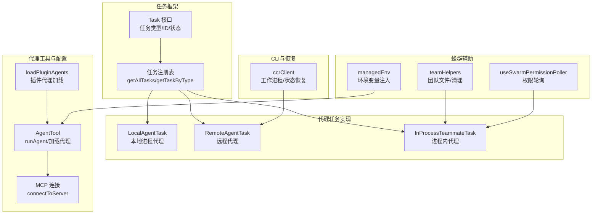
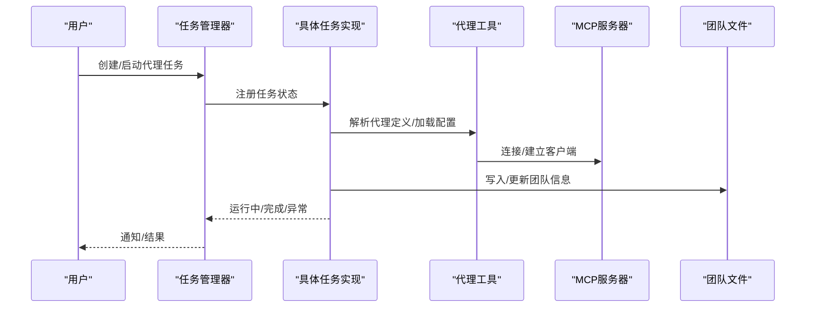
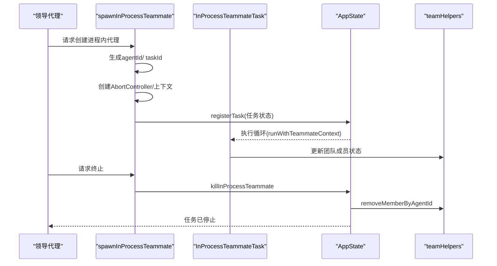
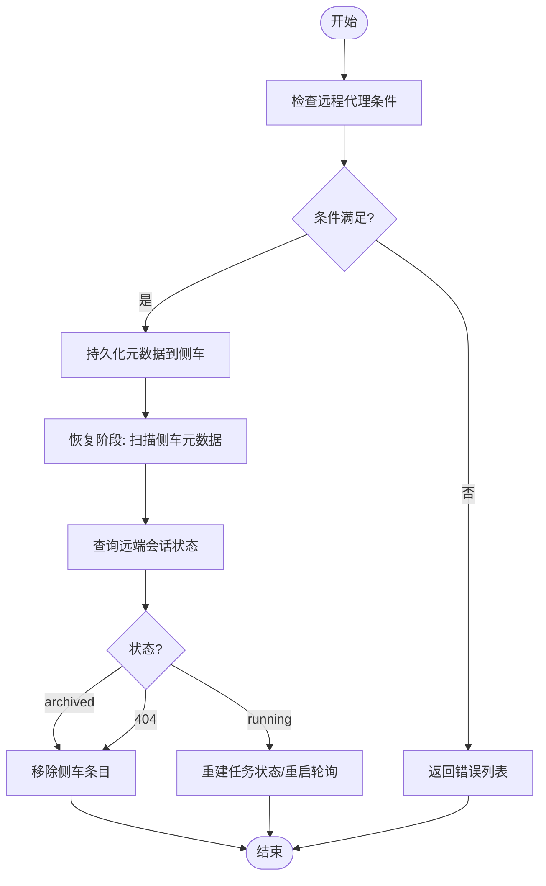
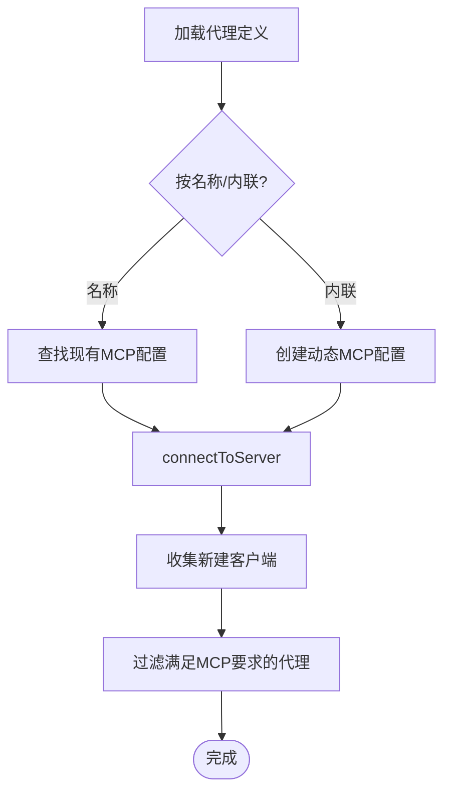
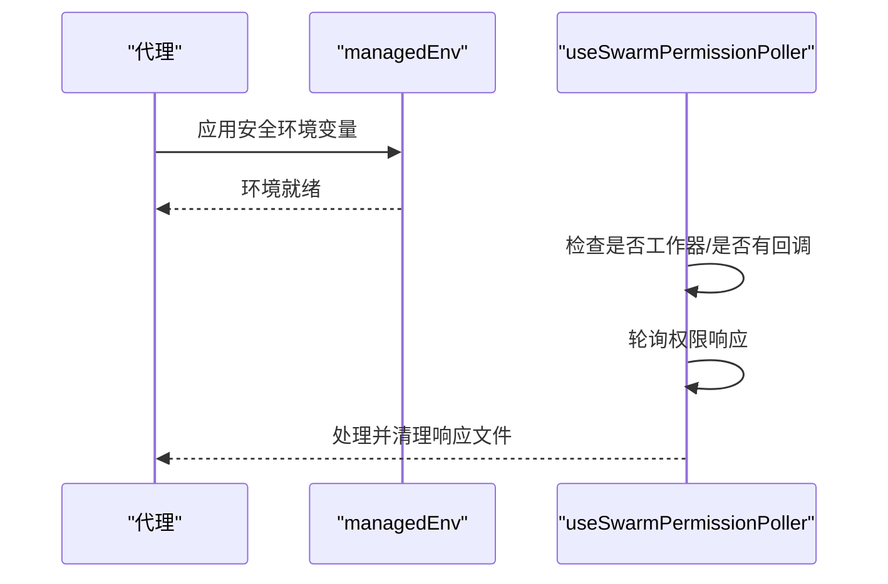
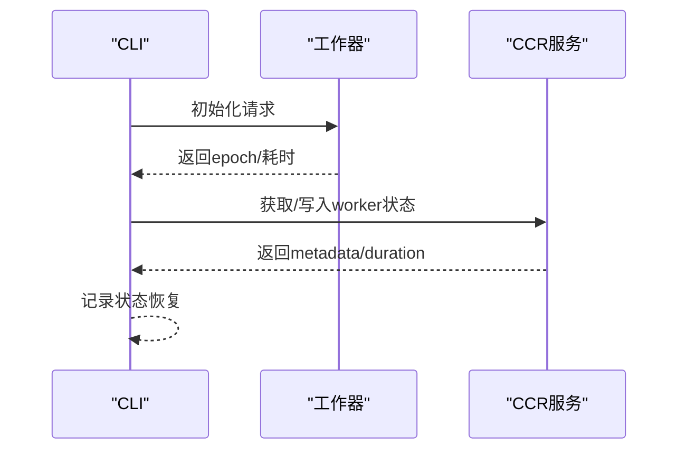
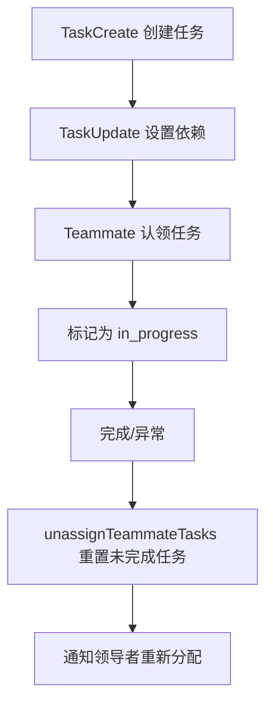
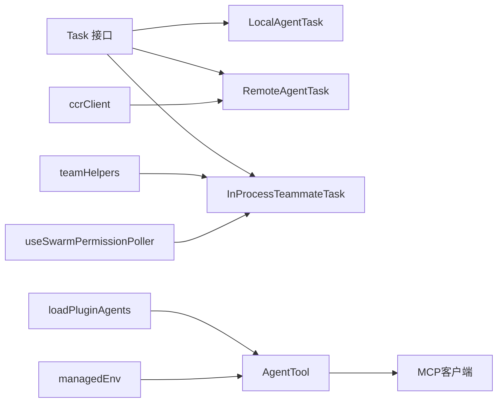

# 代理管理机制

<cite>
**本文档引用的文件**
- [src/utils/swarm/spawnInProcess.ts](file://src/utils/swarm/spawnInProcess.ts)
- [src/tasks/InProcessTeammateTask/InProcessTeammateTask.tsx](file://src/tasks/InProcessTeammateTask/InProcessTeammateTask.tsx)
- [src/tasks/RemoteAgentTask/RemoteAgentTask.tsx](file://src/tasks/RemoteAgentTask/RemoteAgentTask.tsx)
- [src/Task.ts](file://src/Task.ts)
- [src/tasks.ts](file://src/tasks.ts)
- [src/utils/swarm/teamHelpers.ts](file://src/utils/swarm/teamHelpers.ts)
- [src/utils/managedEnv.ts](file://src/utils/managedEnv.ts)
- [src/hooks/useSwarmPermissionPoller.ts](file://src/hooks/useSwarmPermissionPoller.ts)
- [src/tools/AgentTool/runAgent.ts](file://src/tools/AgentTool/runAgent.ts)
- [src/utils/plugins/loadPluginAgents.ts](file://src/utils/plugins/loadPluginAgents.ts)
- [src/tools/AgentTool/loadAgentsDir.ts](file://src/tools/AgentTool/loadAgentsDir.ts)
- [src/cli/transports/ccrClient.ts](file://src/cli/transports/ccrClient.ts)
- [docs/tools/task-management.mdx](file://docs/tools/task-management.mdx)
</cite>

## 目录
1. [简介](#简介)
2. [项目结构](#项目结构)
3. [核心组件](#核心组件)
4. [架构总览](#架构总览)
5. [详细组件分析](#详细组件分析)
6. [依赖分析](#依赖分析)
7. [性能考虑](#性能考虑)
8. [故障排除指南](#故障排除指南)
9. [结论](#结论)

## 简介
本文件系统性梳理蜂群系统中代理的创建、启动与销毁流程，覆盖进程管理、资源分配与生命周期控制；阐述代理初始化过程（配置加载、环境设置、权限验证）；说明运行时管理（状态监控、健康检查、异常恢复）；解释动态调度机制（负载均衡、任务分配、资源优化）；并提供最佳实践与故障排除建议，帮助用户高效管理蜂群中的代理实例。

## 项目结构
蜂群代理管理涉及以下关键模块：
- 任务框架：定义任务类型、任务ID生成、任务状态基类与通用任务注册接口
- 本地/远程/进程内代理任务实现：分别对应不同后端与执行方式
- 代理工具与配置：负责代理定义解析、MCP服务器连接、插件代理加载
- 蜂群辅助工具：团队文件管理、环境变量注入、权限轮询等
- CLI与会话恢复：CLI工作进程生命周期、工作器状态恢复

**图表来源**
- [src/Task.ts:59-125](file://src/Task.ts#L59-L125)
- [src/tasks.ts:17-39](file://src/tasks.ts#L17-L39)
- [src/tasks/LocalAgentTask/LocalAgentTask.tsx](file://src/tasks/LocalAgentTask/LocalAgentTask.tsx)
- [src/tasks/RemoteAgentTask/RemoteAgentTask.tsx](file://src/tasks/RemoteAgentTask/RemoteAgentTask.tsx)
- [src/tasks/InProcessTeammateTask/InProcessTeammateTask.tsx](file://src/tasks/InProcessTeammateTask/InProcessTeammateTask.tsx)
- [src/tools/AgentTool/runAgent.ts:140-177](file://src/tools/AgentTool/runAgent.ts#L140-L177)
- [src/utils/plugins/loadPluginAgents.ts:242-273](file://src/utils/plugins/loadPluginAgents.ts#L242-L273)
- [src/utils/swarm/teamHelpers.ts:575-590](file://src/utils/swarm/teamHelpers.ts#L575-L590)
- [src/utils/managedEnv.ts:159-199](file://src/utils/managedEnv.ts#L159-L199)
- [src/hooks/useSwarmPermissionPoller.ts:268-303](file://src/hooks/useSwarmPermissionPoller.ts#L268-L303)
- [src/cli/transports/ccrClient.ts:508-548](file://src/cli/transports/ccrClient.ts#L508-L548)

**章节来源**
- [src/Task.ts:59-125](file://src/Task.ts#L59-L125)
- [src/tasks.ts:17-39](file://src/tasks.ts#L17-L39)

## 核心组件
- 任务框架与任务ID生成：统一的任务类型、状态与ID前缀映射，确保跨任务一致的生命周期管理
- 代理任务实现：
  - 进程内代理：在同一Node.js进程中以AsyncLocalStorage隔离上下文，支持计划模式与权限模式切换
  - 远程代理：基于会话侧车元数据持久化与恢复，支持工作器状态恢复
  - 本地代理：作为任务框架的一部分，用于本地进程执行
- 代理工具与配置：解析代理定义、连接MCP服务器、按需清理新建客户端、过滤满足MCP要求的代理
- 蜂群辅助：团队文件读写、成员移除、工作树清理、环境变量注入、权限轮询

**章节来源**
- [src/Task.ts:59-125](file://src/Task.ts#L59-L125)
- [src/tasks/InProcessTeammateTask/InProcessTeammateTask.tsx:29-35](file://src/tasks/InProcessTeammateTask/InProcessTeammateTask.tsx#L29-L35)
- [src/tasks/RemoteAgentTask/RemoteAgentTask.tsx:143-193](file://src/tasks/RemoteAgentTask/RemoteAgentTask.tsx#L143-L193)
- [src/tasks.ts:17-39](file://src/tasks.ts#L17-L39)
- [src/utils/swarm/spawnInProcess.ts:104-216](file://src/utils/swarm/spawnInProcess.ts#L104-L216)
- [src/utils/swarm/teamHelpers.ts:575-590](file://src/utils/swarm/teamHelpers.ts#L575-L590)
- [src/utils/managedEnv.ts:159-199](file://src/utils/managedEnv.ts#L159-L199)
- [src/hooks/useSwarmPermissionPoller.ts:268-303](file://src/hooks/useSwarmPermissionPoller.ts#L268-L303)
- [src/tools/AgentTool/runAgent.ts:140-177](file://src/tools/AgentTool/runAgent.ts#L140-L177)
- [src/utils/plugins/loadPluginAgents.ts:242-273](file://src/utils/plugins/loadPluginAgents.ts#L242-L273)
- [src/tools/AgentTool/loadAgentsDir.ts:220-255](file://src/tools/AgentTool/loadAgentsDir.ts#L220-L255)

## 架构总览
蜂群代理管理采用“任务框架 + 多后端任务实现 + 工具链”的分层设计：
- 任务框架提供统一的任务抽象与生命周期管理
- 不同任务实现对应不同的执行后端（本地进程、远程会话、进程内隔离）
- 代理工具负责代理定义解析、MCP连接与插件代理加载
- 蜂群辅助模块处理团队状态、环境注入与权限轮询
- CLI负责工作器生命周期与状态恢复

**图表来源**
- [src/Task.ts:59-125](file://src/Task.ts#L59-L125)
- [src/tasks.ts:17-39](file://src/tasks.ts#L17-L39)
- [src/tools/AgentTool/runAgent.ts:140-177](file://src/tools/AgentTool/runAgent.ts#L140-L177)
- [src/utils/swarm/teamHelpers.ts:126-182](file://src/utils/swarm/teamHelpers.ts#L126-L182)

## 详细组件分析

### 进程内代理管理（InProcessTeammateTask）
- 创建流程：生成确定性agentId与任务ID，创建AbortController与AsyncLocalStorage上下文，注册任务状态，记录调试日志
- 启动流程：通过InProcessTeammateTask组件驱动执行循环，使用runWithTeammateContext进行上下文隔离
- 销毁流程：调用killInProcessTeammate，中断AbortController，清理清理回调，更新任务状态，移除团队上下文，触发SDK事件与输出清理
- 生命周期控制：支持空闲状态切换、计划模式与默认权限模式、消息与工具计数跟踪

**图表来源**
- [src/utils/swarm/spawnInProcess.ts:104-216](file://src/utils/swarm/spawnInProcess.ts#L104-L216)
- [src/tasks/InProcessTeammateTask/InProcessTeammateTask.tsx:29-35](file://src/tasks/InProcessTeammateTask/InProcessTeammateTask.tsx#L29-L35)
- [src/utils/swarm/teamHelpers.ts:326-348](file://src/utils/swarm/teamHelpers.ts#L326-L348)

**章节来源**
- [src/utils/swarm/spawnInProcess.ts:104-216](file://src/utils/swarm/spawnInProcess.ts#L104-L216)
- [src/tasks/InProcessTeammateTask/InProcessTeammateTask.tsx:29-35](file://src/tasks/InProcessTeammateTask/InProcessTeammateTask.tsx#L29-L35)
- [src/utils/swarm/teamHelpers.ts:326-348](file://src/utils/swarm/teamHelpers.ts#L326-L348)

### 远程代理管理（RemoteAgentTask）
- 元数据持久化：将远程代理元数据写入会话侧车目录，失败不阻塞任务注册
- 条件检查：在创建远程代理前检查后台会话条件，返回错误列表或允许
- 任务恢复：在会话恢复时扫描侧车元数据，查询远端会话状态，重建任务状态并重启轮询
- 清理策略：对已归档或404的会话移除侧车条目，避免复活已完成任务

**图表来源**
- [src/tasks/RemoteAgentTask/RemoteAgentTask.tsx:180-193](file://src/tasks/RemoteAgentTask/RemoteAgentTask.tsx#L180-L193)
- [src/tasks/RemoteAgentTask/RemoteAgentTask.tsx:591-635](file://src/tasks/RemoteAgentTask/RemoteAgentTask.tsx#L591-L635)

**章节来源**
- [src/tasks/RemoteAgentTask/RemoteAgentTask.tsx:143-193](file://src/tasks/RemoteAgentTask/RemoteAgentTask.tsx#L143-L193)
- [src/tasks/RemoteAgentTask/RemoteAgentTask.tsx:591-635](file://src/tasks/RemoteAgentTask/RemoteAgentTask.tsx#L591-L635)

### 代理初始化与配置加载
- 代理定义解析：支持按名称引用MCP配置或内联定义，内联定义会被标记为动态作用域以便清理
- MCP连接：通过connectToServer建立客户端，按需收集新建客户端用于后续清理
- 插件代理加载：并行加载插件默认目录与自定义路径，去重与错误过滤，统计加载数量
- MCP要求过滤：根据可用服务器名称匹配代理所需MCP服务器，仅返回满足条件的代理

**图表来源**
- [src/tools/AgentTool/runAgent.ts:140-177](file://src/tools/AgentTool/runAgent.ts#L140-L177)
- [src/utils/plugins/loadPluginAgents.ts:242-273](file://src/utils/plugins/loadPluginAgents.ts#L242-L273)
- [src/tools/AgentTool/loadAgentsDir.ts:220-255](file://src/tools/AgentTool/loadAgentsDir.ts#L220-L255)

**章节来源**
- [src/tools/AgentTool/runAgent.ts:140-177](file://src/tools/AgentTool/runAgent.ts#L140-L177)
- [src/utils/plugins/loadPluginAgents.ts:242-273](file://src/utils/plugins/loadPluginAgents.ts#L242-L273)
- [src/tools/AgentTool/loadAgentsDir.ts:220-255](file://src/tools/AgentTool/loadAgentsDir.ts#L220-L255)

### 环境设置与权限验证
- 环境变量注入：从策略设置与全局配置合并应用安全环境变量，必要时清除缓存并重新配置代理
- 权限轮询：在蜂群工作器模式下定时轮询权限响应，处理响应后清理临时文件，避免并发轮询

**图表来源**
- [src/utils/managedEnv.ts:159-199](file://src/utils/managedEnv.ts#L159-L199)
- [src/hooks/useSwarmPermissionPoller.ts:268-303](file://src/hooks/useSwarmPermissionPoller.ts#L268-L303)

**章节来源**
- [src/utils/managedEnv.ts:159-199](file://src/utils/managedEnv.ts#L159-L199)
- [src/hooks/useSwarmPermissionPoller.ts:268-303](file://src/hooks/useSwarmPermissionPoller.ts#L268-L303)

### CLI工作器生命周期与状态恢复
- 初始化：记录epoch与耗时，等待GET/PUT完成后记录状态恢复
- 状态恢复：读取worker端元数据，包含外部元信息，记录had_state标志

**图表来源**
- [src/cli/transports/ccrClient.ts:508-548](file://src/cli/transports/ccrClient.ts#L508-L548)

**章节来源**
- [src/cli/transports/ccrClient.ts:508-548](file://src/cli/transports/ccrClient.ts#L508-L548)

### 任务生命周期与动态调度
- 任务生命周期：创建→设置依赖→发现可认领→认领→完成/异常→重分配
- 动态调度：基于任务状态与依赖关系自动解锁，异常退出时重置任务状态并通知领导者重新分配

**图表来源**
- [docs/tools/task-management.mdx:149-187](file://docs/tools/task-management.mdx#L149-L187)

**章节来源**
- [docs/tools/task-management.mdx:149-187](file://docs/tools/task-management.mdx#L149-L187)

## 依赖分析
- 组件耦合与内聚：
  - 任务框架与任务实现解耦，通过统一接口与类型约束保证一致性
  - 代理工具与MCP连接解耦，支持共享客户端与动态客户端清理
  - 蜂群辅助模块与任务实现解耦，通过文件I/O与状态更新交互
- 外部依赖与集成点：
  - MCP协议客户端：用于代理能力扩展与外部服务集成
  - CLI与CCR：用于工作器生命周期与状态恢复
  - 文件系统：团队文件与任务输出的持久化

**图表来源**
- [src/Task.ts:59-125](file://src/Task.ts#L59-L125)
- [src/tasks.ts:17-39](file://src/tasks.ts#L17-L39)
- [src/tools/AgentTool/runAgent.ts:140-177](file://src/tools/AgentTool/runAgent.ts#L140-L177)
- [src/utils/plugins/loadPluginAgents.ts:242-273](file://src/utils/plugins/loadPluginAgents.ts#L242-L273)
- [src/utils/swarm/teamHelpers.ts:575-590](file://src/utils/swarm/teamHelpers.ts#L575-L590)
- [src/utils/managedEnv.ts:159-199](file://src/utils/managedEnv.ts#L159-L199)
- [src/hooks/useSwarmPermissionPoller.ts:268-303](file://src/hooks/useSwarmPermissionPoller.ts#L268-L303)
- [src/cli/transports/ccrClient.ts:508-548](file://src/cli/transports/ccrClient.ts#L508-L548)

**章节来源**
- [src/Task.ts:59-125](file://src/Task.ts#L59-L125)
- [src/tasks.ts:17-39](file://src/tasks.ts#L17-L39)

## 性能考虑
- 并行加载：插件代理加载采用Promise.all并行处理，显著提升启动速度
- 资源清理：动态MCP客户端在连接失败时及时清理，避免资源泄漏
- 输出与缓存：任务输出与代理缓存（证书、代理、mTLS）在环境变更时清理并重新配置，确保一致性
- 轮询节流：权限轮询设置防并发标志，避免重复轮询与竞争条件

[本节为通用指导，无需特定文件分析]

## 故障排除指南
- 进程内代理无法启动
  - 检查任务状态注册与AbortController创建是否成功
  - 查看调试日志中的失败原因，确认上下文创建与任务注册顺序
  - 参考：[src/utils/swarm/spawnInProcess.ts:104-216](file://src/utils/swarm/spawnInProcess.ts#L104-L216)
- 远程代理恢复失败
  - 检查侧车元数据是否存在与可访问
  - 关注404/归档状态的清理逻辑，确认会话是否仍存活
  - 参考：[src/tasks/RemoteAgentTask/RemoteAgentTask.tsx:591-635](file://src/tasks/RemoteAgentTask/RemoteAgentTask.tsx#L591-L635)
- MCP连接问题
  - 确认MCP服务器名称存在且可解析
  - 对于内联定义，检查动态作用域标记与清理流程
  - 参考：[src/tools/AgentTool/runAgent.ts:140-177](file://src/tools/AgentTool/runAgent.ts#L140-L177)
- 环境变量未生效
  - 确认安全环境变量已正确合并与应用
  - 触发缓存清理与代理重新配置
  - 参考：[src/utils/managedEnv.ts:159-199](file://src/utils/managedEnv.ts#L159-L199)
- 权限轮询无响应
  - 确认当前为蜂群工作器模式且存在待处理回调
  - 检查轮询间隔与响应文件清理
  - 参考：[src/hooks/useSwarmPermissionPoller.ts:268-303](file://src/hooks/useSwarmPermissionPoller.ts#L268-L303)

**章节来源**
- [src/utils/swarm/spawnInProcess.ts:104-216](file://src/utils/swarm/spawnInProcess.ts#L104-L216)
- [src/tasks/RemoteAgentTask/RemoteAgentTask.tsx:591-635](file://src/tasks/RemoteAgentTask/RemoteAgentTask.tsx#L591-L635)
- [src/tools/AgentTool/runAgent.ts:140-177](file://src/tools/AgentTool/runAgent.ts#L140-L177)
- [src/utils/managedEnv.ts:159-199](file://src/utils/managedEnv.ts#L159-L199)
- [src/hooks/useSwarmPermissionPoller.ts:268-303](file://src/hooks/useSwarmPermissionPoller.ts#L268-L303)

## 结论
蜂群代理管理通过任务框架与多后端任务实现，结合代理工具链与蜂群辅助模块，实现了从创建、启动到销毁的全生命周期管理。进程内代理提供隔离与低开销，远程代理支持会话恢复与跨环境协作，本地代理满足常规场景。配合MCP连接、插件加载、环境注入与权限轮询，系统在灵活性与可控性之间取得平衡。遵循本文最佳实践与故障排除建议，可有效提升代理实例的稳定性与运维效率。