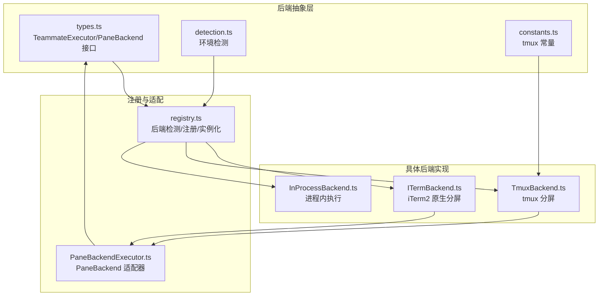
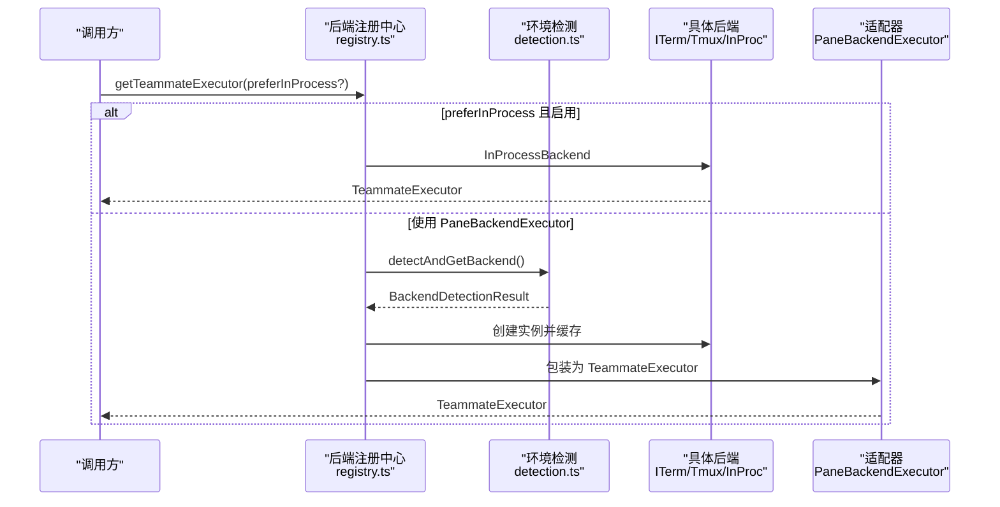
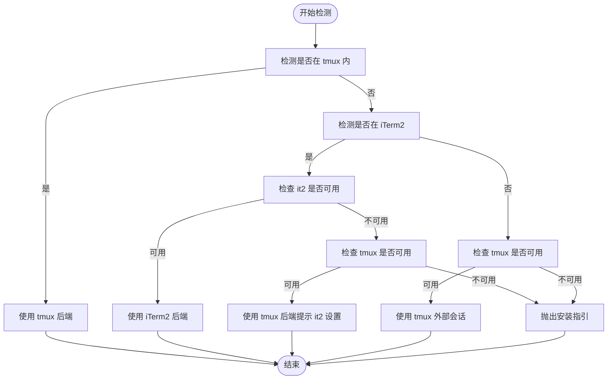
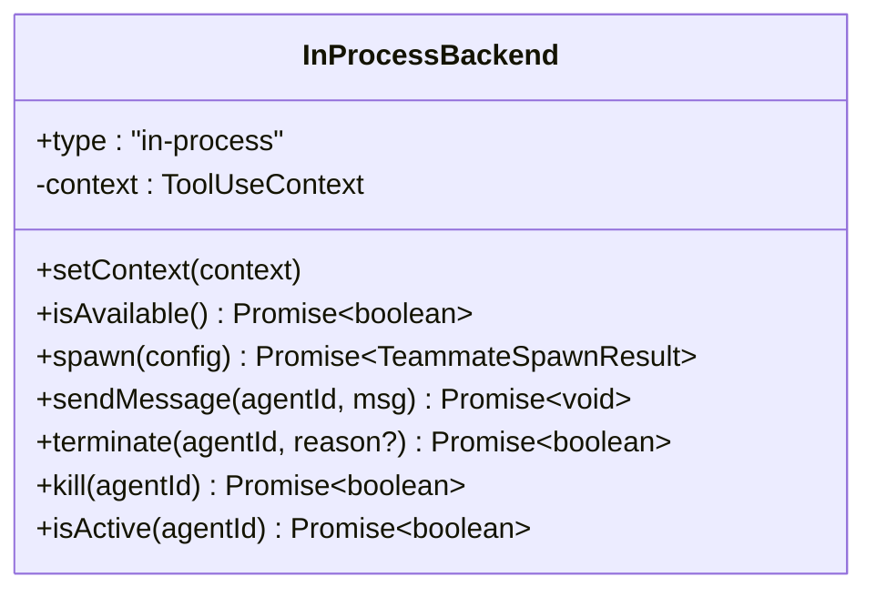
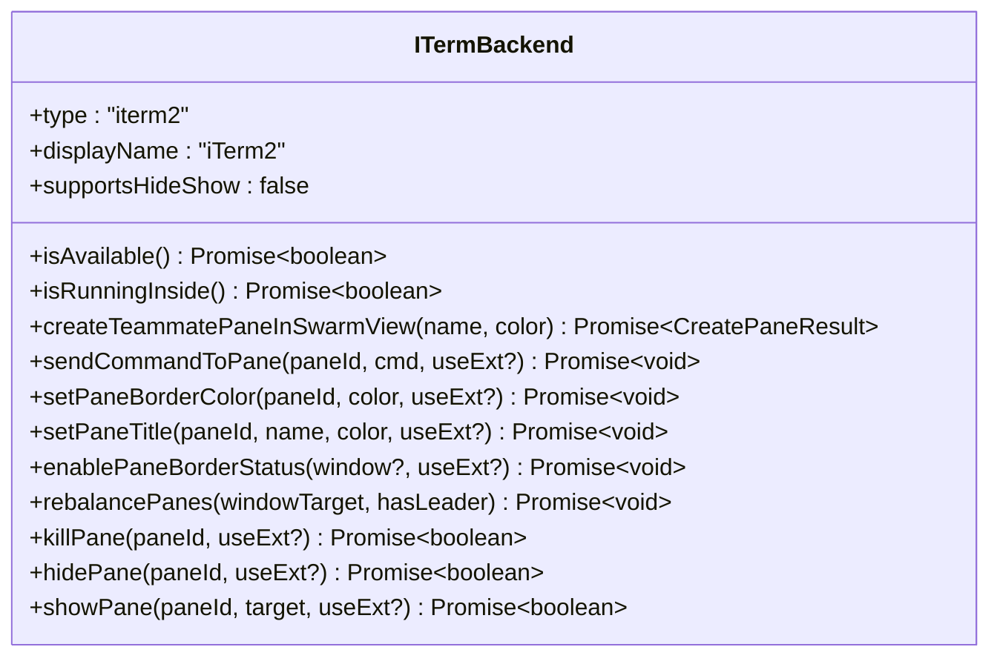
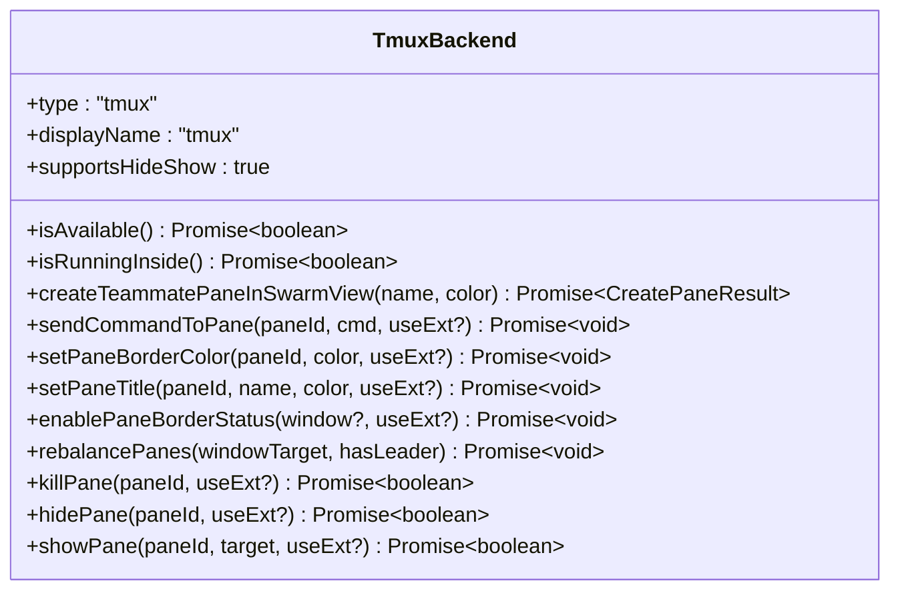
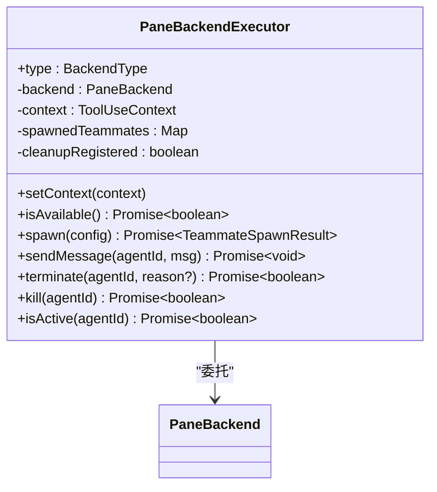
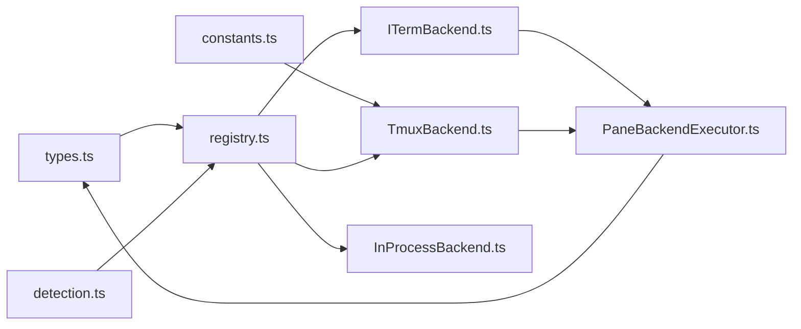

# 后端执行器与平台支持

<cite>
**本文档引用的文件**
- [registry.ts](file://src/utils/swarm/backends/registry.ts)
- [InProcessBackend.ts](file://src/utils/swarm/backends/InProcessBackend.ts)
- [ITermBackend.ts](file://src/utils/swarm/backends/ITermBackend.ts)
- [TmuxBackend.ts](file://src/utils/swarm/backends/TmuxBackend.ts)
- [PaneBackendExecutor.ts](file://src/utils/swarm/backends/PaneBackendExecutor.ts)
- [detection.ts](file://src/utils/swarm/backends/detection.ts)
- [types.ts](file://src/utils/swarm/backends/types.ts)
- [it2Setup.ts](file://src/utils/swarm/backends/it2Setup.ts)
- [constants.ts](file://src/utils/swarm/constants.ts)
</cite>

## 目录
1. [简介](#简介)
2. [项目结构](#项目结构)
3. [核心组件](#核心组件)
4. [架构总览](#架构总览)
5. [详细组件分析](#详细组件分析)
6. [依赖关系分析](#依赖关系分析)
7. [性能考量](#性能考量)
8. [故障排查指南](#故障排查指南)
9. [结论](#结论)
10. [附录：平台适配开发指南](#附录平台适配开发指南)

## 简介
本文件系统性梳理蜂群系统的后端执行器与平台支持，覆盖以下主题：
- 后端执行器实现：InProcessBackend（进程内）、ITermBackend（iTerm2 原生分屏）、TmuxBackend（tmux 分屏）
- 后端检测与选择机制：平台识别、兼容性检查、自动切换策略
- 特点与适用场景：性能差异、功能限制、配置要求
- 注册与管理机制：动态加载、状态监控、故障转移
- 开发指南与最佳实践：如何扩展新的后端支持

## 项目结构
后端相关代码集中在 src/utils/swarm/backends 目录，采用“接口抽象 + 多实现 + 统一注册”的设计模式：
- types.ts 定义统一类型与接口
- detection.ts 提供环境检测能力
- registry.ts 负责后端检测、注册与实例获取
- PaneBackendExecutor.ts 将 PaneBackend 适配为 TeammateExecutor
- ITermBackend.ts、TmuxBackend.ts、InProcessBackend.ts 实现具体后端
- it2Setup.ts 提供 iTerm2 it2 工具安装与验证流程
- constants.ts 定义 tmux 相关常量与外部会话隔离

图表来源
- [types.ts:39-168](file://src/utils/swarm/backends/types.ts#L39-L168)
- [detection.ts:1-129](file://src/utils/swarm/backends/detection.ts#L1-L129)
- [constants.ts:1-34](file://src/utils/swarm/constants.ts#L1-L34)
- [registry.ts:1-465](file://src/utils/swarm/backends/registry.ts#L1-L465)
- [PaneBackendExecutor.ts:1-355](file://src/utils/swarm/backends/PaneBackendExecutor.ts#L1-L355)
- [ITermBackend.ts:1-371](file://src/utils/swarm/backends/ITermBackend.ts#L1-L371)
- [TmuxBackend.ts:1-765](file://src/utils/swarm/backends/TmuxBackend.ts#L1-L765)
- [InProcessBackend.ts:1-340](file://src/utils/swarm/backends/InProcessBackend.ts#L1-L340)

章节来源
- [registry.ts:1-465](file://src/utils/swarm/backends/registry.ts#L1-L465)
- [types.ts:1-312](file://src/utils/swarm/backends/types.ts#L1-L312)

## 核心组件
- TeammateExecutor 抽象：统一的队友执行器接口，屏蔽后端差异
- PaneBackend 抽象：终端分屏操作接口，定义 pane 的创建、命令发送、样式设置、隐藏/显示等
- PaneBackendExecutor 适配器：将 PaneBackend 适配为 TeammateExecutor，负责命令构建、环境变量继承、清理钩子注册等
- 具体后端：
  - InProcessBackend：在同进程内运行，共享资源，使用 AbortController 生命周期管理
  - ITermBackend：基于 it2 CLI 的原生分屏，适合 macOS iTerm2 环境
  - TmuxBackend：跨平台 tmux 分屏，支持外部会话隔离与隐藏窗口
- 检测与注册：
  - detection.ts：同步/异步检测是否在 tmux、是否在 iTerm2、it2 可用性
  - registry.ts：后端检测优先级、缓存、动态导入、实例获取、故障回退
  - it2Setup.ts：it2 安装、验证、偏好设置（tmux vs iTerm2）

章节来源
- [types.ts:279-300](file://src/utils/swarm/backends/types.ts#L279-L300)
- [PaneBackendExecutor.ts:25-56](file://src/utils/swarm/backends/PaneBackendExecutor.ts#L25-L56)
- [InProcessBackend.ts:25-37](file://src/utils/swarm/backends/InProcessBackend.ts#L25-L37)
- [ITermBackend.ts:75-82](file://src/utils/swarm/backends/ITermBackend.ts#L75-L82)
- [TmuxBackend.ts:93-107](file://src/utils/swarm/backends/TmuxBackend.ts#L93-L107)
- [detection.ts:28-129](file://src/utils/swarm/backends/detection.ts#L28-L129)
- [registry.ts:128-254](file://src/utils/swarm/backends/registry.ts#L128-L254)
- [it2Setup.ts:1-246](file://src/utils/swarm/backends/it2Setup.ts#L1-L246)

## 架构总览
后端体系通过“检测优先级 + 缓存 + 适配器 + 统一接口”实现高可用与可扩展：

图表来源
- [registry.ts:425-436](file://src/utils/swarm/backends/registry.ts#L425-L436)
- [detection.ts:136-254](file://src/utils/swarm/backends/detection.ts#L136-L254)
- [PaneBackendExecutor.ts:39-56](file://src/utils/swarm/backends/PaneBackendExecutor.ts#L39-L56)

## 详细组件分析

### 后端检测与选择机制
- 检测优先级（detectAndGetBackend）：
  1) 若在 tmux 内部：强制使用 tmux 后端（保证与用户会话一致）
  2) 若在 iTerm2：优先使用 it2 原生分屏；若 it2 不可用但 tmux 可用，则回退 tmux 并提示 it2 设置需求
  3) 否则：尝试 tmux 外部会话（独立 socket 隔离）
  4) 若均不可用：抛出安装指引（按平台输出）
- 缓存策略：检测结果与后端实例缓存于进程生命周期内，避免重复检测与昂贵操作
- 自动切换策略：
  - isInProcessEnabled() 在“auto”模式下根据环境决定是否回退到 in-process
  - 非交互模式（-p）始终启用 in-process
  - 一旦发生“无 pane 后端可用”的回退，后续 spawn 将固定走 in-process

图表来源
- [registry.ts:136-254](file://src/utils/swarm/backends/registry.ts#L136-L254)
- [detection.ts:50-104](file://src/utils/swarm/backends/detection.ts#L50-L104)

章节来源
- [registry.ts:128-285](file://src/utils/swarm/backends/registry.ts#L128-L285)
- [detection.ts:28-129](file://src/utils/swarm/backends/detection.ts#L28-L129)

### InProcessBackend（进程内执行）
- 设计要点：
  - 运行在同一 Node.js 进程中，共享资源（API 客户端、MCP 连接），减少开销
  - 通过 AsyncLocalStorage 隔离上下文，避免全局污染
  - 使用 AbortController 管理生命周期，支持立即强制终止
  - 通过文件邮箱与 pane 后端保持一致的消息通道
- 生命周期管理：
  - spawn：创建任务、生成 AbortController、启动执行循环
  - terminate：向邮箱发送关闭请求，等待队友自决
  - kill：AbortController.abort() 强制终止
  - isActive：检查任务状态与控制器是否已中止
- 适用场景：非交互模式、无终端 UI、或无法满足 pane 后端条件时的回退

图表来源
- [InProcessBackend.ts:38-331](file://src/utils/swarm/backends/InProcessBackend.ts#L38-L331)

章节来源
- [InProcessBackend.ts:25-340](file://src/utils/swarm/backends/InProcessBackend.ts#L25-L340)

### ITermBackend（iTerm2 原生分屏）
- 设计要点：
  - 基于 it2 CLI 的原生分屏，适合 macOS 环境
  - 通过锁机制串行化 pane 创建，避免并发冲突
  - 首个队友垂直分割，后续水平/垂直交错布局
  - 支持目标 pane 分割（-s 参数）以确保布局稳定
  - 对死目标 pane 的容错：探测后修剪列表并重试
- 能力边界：
  - 不支持隐藏/显示 pane（无对应 tmux break-pane/join-pane）
  - 标题与颜色通过 it2 调用实现，为性能考虑默认跳过
- 适用场景：macOS 下首选原生体验，需安装 it2 并启用 Python API

图表来源
- [ITermBackend.ts:79-365](file://src/utils/swarm/backends/ITermBackend.ts#L79-L365)

章节来源
- [ITermBackend.ts:75-371](file://src/utils/swarm/backends/ITermBackend.ts#L75-L371)

### TmuxBackend（tmux 分屏）
- 设计要点：
  - 支持两种模式：内部 tmux（与 leader 共享窗口）与外部 tmux（独立 socket）
  - 内部模式：主面板 30%，队友面板 70%，自动重平衡
  - 外部模式：创建 claude-swarm 会话与 swarm-view 窗口，等分布局
  - 支持隐藏/显示 pane（break-pane/join-pane），并维护隐藏会话
  - 通过缓存 leader 窗口目标，确保跨窗口操作正确
- 能力边界：
  - 需要 tmux 命令可用；外部模式使用独立 socket 隔离
  - pane 边框颜色与标题通过 tmux 选项设置
- 适用场景：Linux/macOS/WSL 等通用场景，或需要与用户 tmux 会话解耦

图表来源
- [TmuxBackend.ts:104-765](file://src/utils/swarm/backends/TmuxBackend.ts#L104-L765)

章节来源
- [TmuxBackend.ts:93-765](file://src/utils/swarm/backends/TmuxBackend.ts#L93-L765)

### PaneBackendExecutor（PaneBackend 适配器）
- 设计要点：
  - 将 PaneBackend 适配为 TeammateExecutor，统一路由 spawn/sendMessage/terminate/kill/isActive
  - 构建命令：继承 CLI 标志、工作目录、环境变量，注入队友身份参数
  - 首个队友在 tmux 内启用边框状态显示
  - 注册清理钩子：领导退出时自动回收所有 pane
  - 通过邮箱发送初始提示，保持与 in-process 一致的消息通道
- 适用场景：封装 tmux/iTerm2 的复杂细节，向上暴露统一接口

图表来源
- [PaneBackendExecutor.ts:39-355](file://src/utils/swarm/backends/PaneBackendExecutor.ts#L39-L355)

章节来源
- [PaneBackendExecutor.ts:25-355](file://src/utils/swarm/backends/PaneBackendExecutor.ts#L25-L355)

### 注册与管理机制
- 动态加载：ensureBackendsRegistered() 按需导入后端模块，避免编译期依赖环
- 注册回调：各后端模块导入时自我注册（registerTmuxBackend/registerITermBackend），避免循环依赖
- 实例缓存：getTeammateExecutor()/getPaneBackendExecutor() 缓存后端实例，避免重复创建
- 故障回退：markInProcessFallback() 记录“无 pane 后端可用”的回退状态，后续 spawn 固定走 in-process
- 模式解析：getResolvedTeammateMode() 返回当前会话实际使用的模式（in-process 或 tmux）

章节来源
- [registry.ts:74-127](file://src/utils/swarm/backends/registry.ts#L74-L127)
- [registry.ts:326-398](file://src/utils/swarm/backends/registry.ts#L326-L398)

### 平台适配与配置要求
- iTerm2：
  - 需要 it2 CLI 工具与 iTerm2 Python API 启用
  - 可通过 it2Setup.ts 自动检测包管理器并安装
  - 用户可选择“更喜欢 tmux 而非 iTerm2 分屏”
- tmux：
  - 需要 tmux 命令可用；外部模式使用独立 socket 隔离
  - 支持隐藏/显示 pane，适合复杂布局管理
- 进程内：
  - 无外部依赖，适合非交互模式与回退场景

章节来源
- [it2Setup.ts:34-246](file://src/utils/swarm/backends/it2Setup.ts#L34-L246)
- [constants.ts:12-14](file://src/utils/swarm/constants.ts#L12-L14)
- [registry.ts:256-285](file://src/utils/swarm/backends/registry.ts#L256-L285)

## 依赖关系分析

图表来源
- [types.ts:1-312](file://src/utils/swarm/backends/types.ts#L1-L312)
- [registry.ts:1-465](file://src/utils/swarm/backends/registry.ts#L1-L465)
- [detection.ts:1-129](file://src/utils/swarm/backends/detection.ts#L1-L129)
- [constants.ts:1-34](file://src/utils/swarm/constants.ts#L1-L34)
- [ITermBackend.ts:1-371](file://src/utils/swarm/backends/ITermBackend.ts#L1-L371)
- [TmuxBackend.ts:1-765](file://src/utils/swarm/backends/TmuxBackend.ts#L1-L765)
- [InProcessBackend.ts:1-340](file://src/utils/swarm/backends/InProcessBackend.ts#L1-L340)
- [PaneBackendExecutor.ts:1-355](file://src/utils/swarm/backends/PaneBackendExecutor.ts#L1-L355)

章节来源
- [registry.ts:1-465](file://src/utils/swarm/backends/registry.ts#L1-L465)
- [types.ts:1-312](file://src/utils/swarm/backends/types.ts#L1-L312)

## 性能考量
- InProcessBackend：
  - 最低开销：共享进程与连接，无需外部进程通信
  - 适合非交互与回退场景
- ITermBackend：
  - 每次 it2 调用成本较高（Python 进程启动），建议减少调用频率（如跳过标题/颜色设置）
  - 通过锁串行化创建，避免竞争导致的失败重试风暴
- TmuxBackend：
  - 外部会话使用独立 socket，避免干扰用户 tmux 会话
  - pane 初始化延迟（等待 shell rc 文件加载）约 200ms，适配大多数 shell 配置
  - 隐藏/显示 pane 通过 break-pane/join-pane 实现，布局重排成本可控

[本节为通用指导，不直接分析具体文件]

## 故障排查指南
- “未检测到可用后端”
  - 检查 tmux 是否安装与可用（isTmuxAvailable）
  - 在 iTerm2 中确认 it2 CLI 可用且 Python API 已启用（verifyIt2Setup）
  - 若仅在 iTerm2 且 it2 不可用，可选择“更喜欢 tmux”，或安装 tmux
- “pane 创建失败”
  - ITermBackend：检查目标 pane 是否已死；系统性失败时避免误删活 ID
  - TmuxBackend：确认 leader pane ID 与窗口目标缓存有效；必要时重试
- “无法发送命令到 pane”
  - 确认 pane 存在且未被意外关闭
  - 外部 tmux 模式需使用独立 socket
- “队友无法终止”
  - 通过邮箱发送关闭请求（terminate），等待队友自决
  - 必要时使用 kill 强制终止（pane 后端）或 AbortController（进程内）

章节来源
- [detection.ts:70-129](file://src/utils/swarm/backends/detection.ts#L70-L129)
- [it2Setup.ts:146-195](file://src/utils/swarm/backends/it2Setup.ts#L146-L195)
- [ITermBackend.ts:177-208](file://src/utils/swarm/backends/ITermBackend.ts#L177-L208)
- [TmuxBackend.ts:550-630](file://src/utils/swarm/backends/TmuxBackend.ts#L550-L630)
- [PaneBackendExecutor.ts:246-290](file://src/utils/swarm/backends/PaneBackendExecutor.ts#L246-L290)

## 结论
该后端体系通过清晰的抽象与严格的检测/适配流程，在多平台与多环境下实现了高可用的队友执行与可视化。其关键优势在于：
- 统一接口屏蔽差异，便于上层调用
- 智能检测与回退策略，提升鲁棒性
- 外部会话隔离与隐藏 pane 等高级特性，增强可用性
- 渐进式扩展能力，便于新增后端

[本节为总结性内容，不直接分析具体文件]

## 附录：平台适配开发指南

### 新增后端步骤
1) 定义接口与类型
- 在 types.ts 中声明新后端类型与方法签名
- 明确是否支持 hide/show、是否需要外部会话等属性
2) 实现 PaneBackend
- 参考 ITermBackend/TmuxBackend 的实现风格，提供 isAvailable/isRunningInside/createTeammatePaneInSwarmView/sendCommandToPane 等方法
- 注意错误处理与日志记录
3) 注册与导出
- 在 registry.ts 中：
  - 动态导入模块（ensureBackendsRegistered）
  - 提供 registerXxxBackend() 与 createXxxBackend() 方法
  - 在 detectAndGetBackend() 中加入检测分支
4) 适配器与工具
- 如为 pane 后端，通常由 PaneBackendExecutor 统一封装
- 参考 spawnUtils.ts 构建命令与环境变量传递
5) 测试与验证
- 使用 resetDetectionCache()/resetBackendDetection() 清理缓存进行测试
- 验证在不同环境（tmux 内/外、iTerm2、非交互）下的行为

章节来源
- [types.ts:39-168](file://src/utils/swarm/backends/types.ts#L39-L168)
- [registry.ts:74-127](file://src/utils/swarm/backends/registry.ts#L74-L127)
- [ITermBackend.ts:75-371](file://src/utils/swarm/backends/ITermBackend.ts#L75-L371)
- [TmuxBackend.ts:93-765](file://src/utils/swarm/backends/TmuxBackend.ts#L93-L765)
- [PaneBackendExecutor.ts:25-56](file://src/utils/swarm/backends/PaneBackendExecutor.ts#L25-L56)

### 最佳实践
- 优先使用缓存与懒加载，避免重复检测与昂贵初始化
- 在 pane 后端中串行化创建操作，防止竞态
- 通过邮箱统一消息通道，保证与进程内后端一致性
- 外部会话使用独立 socket，避免与用户 tmux 冲突
- 提供明确的错误信息与安装指引，提升用户体验

[本节为通用指导，不直接分析具体文件]