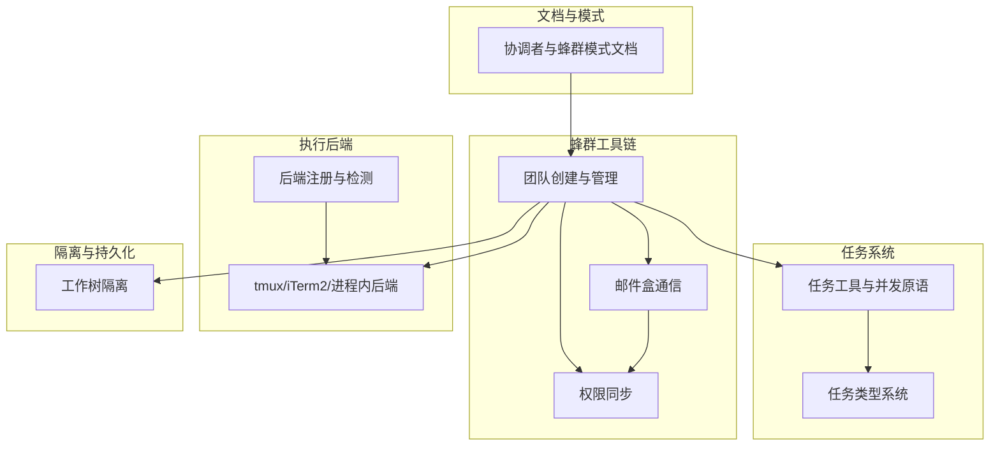
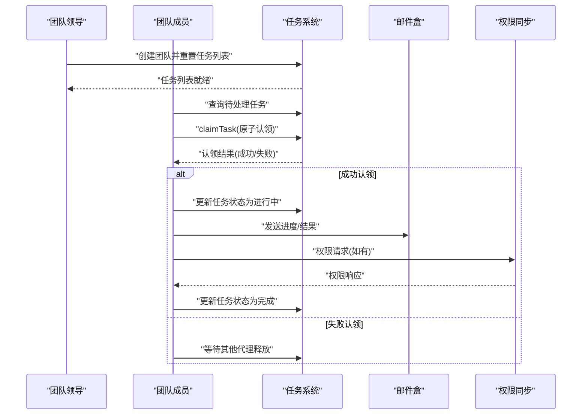
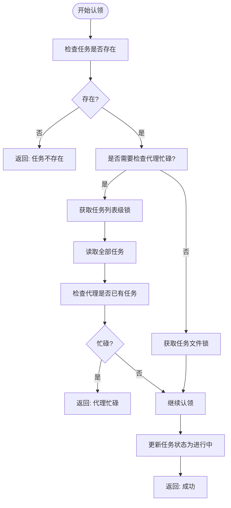
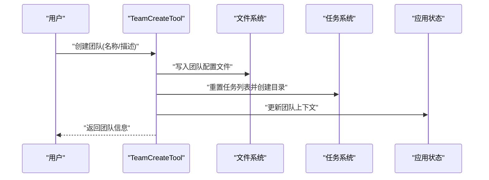
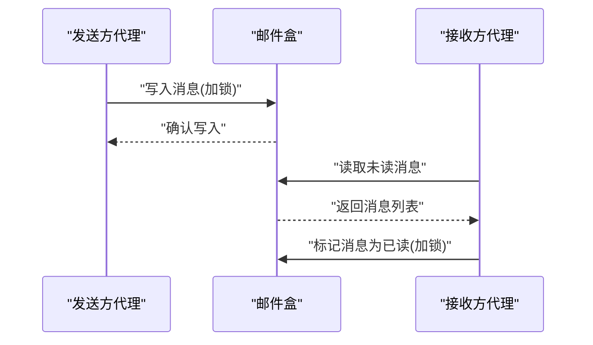
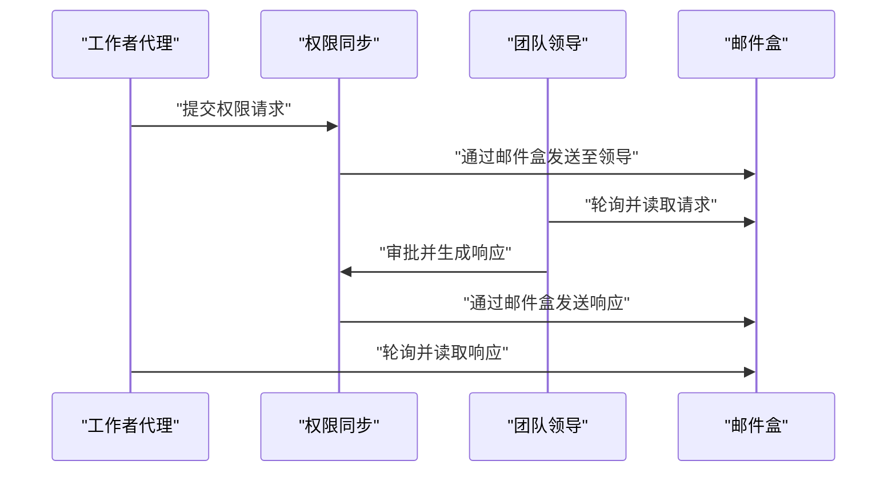
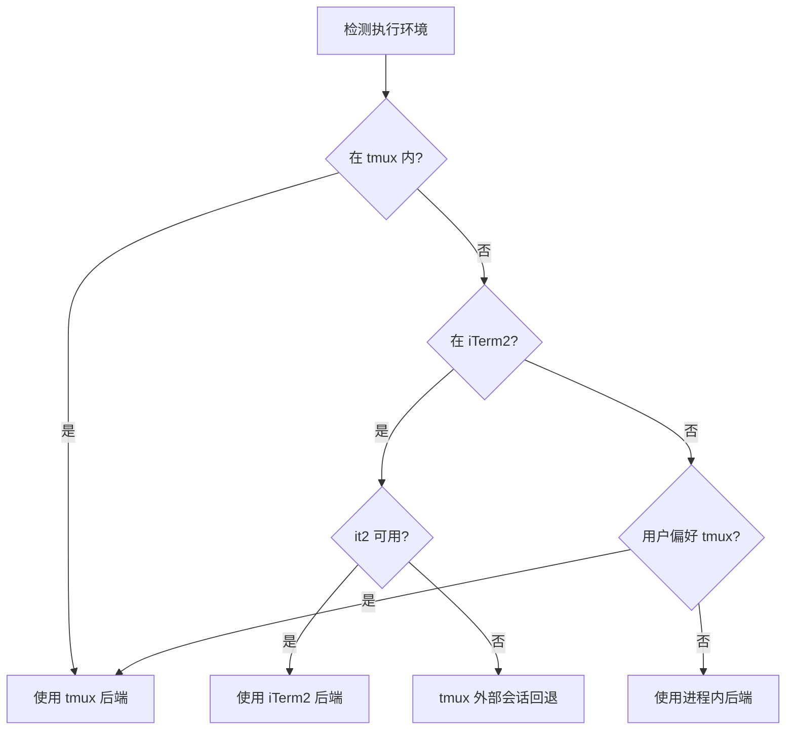
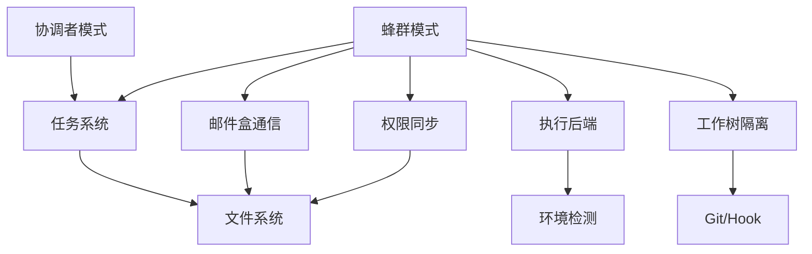

# 蜂群架构设计

<cite>
**本文档引用的文件**
- [docs/agent/coordinator-and-swarm.mdx](file://docs/agent/coordinator-and-swarm.mdx)
- [src/coordinator/coordinatorMode.ts](file://src/coordinator/coordinatorMode.ts)
- [src/tools/TeamCreateTool/TeamCreateTool.ts](file://src/tools/TeamCreateTool/TeamCreateTool.ts)
- [src/utils/tasks.ts](file://src/utils/tasks.ts)
- [src/utils/swarm/teamHelpers.ts](file://src/utils/swarm/teamHelpers.ts)
- [src/utils/swarm/constants.ts](file://src/utils/swarm/constants.ts)
- [src/utils/swarm/backends/registry.ts](file://src/utils/swarm/backends/registry.ts)
- [src/utils/swarm/permissionSync.ts](file://src/utils/swarm/permissionSync.ts)
- [src/utils/teammateMailbox.ts](file://src/utils/teammateMailbox.ts)
- [src/tools/SendMessageTool/SendMessageTool.ts](file://src/tools/SendMessageTool/SendMessageTool.ts)
- [src/tasks/types.ts](file://src/tasks/types.ts)
- [src/utils/worktree.ts](file://src/utils/worktree.ts)
- [V6.md](file://V6.md)
</cite>

## 目录
1. [简介](#简介)
2. [项目结构](#项目结构)
3. [核心组件](#核心组件)
4. [架构总览](#架构总览)
5. [详细组件分析](#详细组件分析)
6. [依赖关系分析](#依赖关系分析)
7. [性能考虑](#性能考虑)
8. [故障排查指南](#故障排查指南)
9. [结论](#结论)

## 简介
本文件面向希望深入理解并扩展 Claude Code 蜂群系统（Agent Swarms）的开发者，系统阐述蜂群模式的整体架构设计理念、多代理协作的核心原理与设计模式。文档重点覆盖以下方面：
- 蜂群系统的组件结构：代理模型、团队管理器、通信层
- 状态管理机制：代理状态同步、团队状态维护、分布式协调策略
- 扩展性与可配置性：代理数量调节、角色分配、动态重组机制
- 架构图表与组件交互流程，帮助快速建立对系统实现原理的理解

## 项目结构
蜂群系统围绕“任务驱动 + 文件系统 + 邮件盒通信”的核心范式构建，主要分布在如下模块：
- 协调者模式与蜂群模式文档：定义两种协作模式的边界与选择策略
- 任务系统：统一的任务数据模型、并发原语（认领/更新）、高水位标记与文件锁
- 蜂群工具链：团队创建、成员管理、权限同步、邮件盒通信
- 执行后端：进程内/外部终端后端（tmux/iTerm2）的自动检测与选择
- 工作树隔离：子代理的沙箱化执行与资源隔离

**图示来源**
- [docs/agent/coordinator-and-swarm.mdx:1-197](file://docs/agent/coordinator-and-swarm.mdx#L1-L197)
- [src/utils/tasks.ts:1-200](file://src/utils/tasks.ts#L1-L200)
- [src/utils/swarm/teamHelpers.ts:1-200](file://src/utils/swarm/teamHelpers.ts#L1-L200)
- [src/utils/swarm/backends/registry.ts:1-200](file://src/utils/swarm/backends/registry.ts#L1-L200)
- [src/utils/worktree.ts:702-952](file://src/utils/worktree.ts#L702-L952)

**章节来源**
- [docs/agent/coordinator-and-swarm.mdx:1-197](file://docs/agent/coordinator-and-swarm.mdx#L1-L197)
- [V6.md:696-746](file://V6.md#L696-L746)

## 核心组件
- 任务系统与并发原语
  - 任务创建、更新、删除均采用文件锁保障并发安全，支持高水位标记避免 ID 重用
  - 任务认领（claimTask）是蜂群的核心并发原语，支持原子检查代理忙碌状态与任务状态
- 团队管理器
  - 团队创建（TeamCreateTool）负责初始化任务列表、设置团队名称、写入团队配置文件
  - 团队成员管理（teamHelpers）提供成员增删、权限模式同步、会话清理等能力
- 通信层
  - 邮件盒（TeammateMailbox）提供点对点与广播通信，支持文件锁保证消息写入一致性
  - SendMessageTool 将消息路由到指定接收者或全体成员
- 权限同步
  - 基于文件系统的权限请求/响应流水线，支持领导者审批与规则应用
- 执行后端
  - 后端注册表根据环境自动选择 tmux、iTerm2 或进程内执行，支持回退策略
- 工作树隔离
  - 为子代理创建独立工作树，支持成功保留与失败清理，确保资源隔离

**章节来源**
- [src/utils/tasks.ts:279-647](file://src/utils/tasks.ts#L279-L647)
- [src/tools/TeamCreateTool/TeamCreateTool.ts:128-241](file://src/tools/TeamCreateTool/TeamCreateTool.ts#L128-L241)
- [src/utils/swarm/teamHelpers.ts:131-182](file://src/utils/swarm/teamHelpers.ts#L131-L182)
- [src/utils/teammateMailbox.ts:134-342](file://src/utils/teammateMailbox.ts#L134-L342)
- [src/tools/SendMessageTool/SendMessageTool.ts:149-266](file://src/tools/SendMessageTool/SendMessageTool.ts#L149-L266)
- [src/utils/swarm/permissionSync.ts:167-443](file://src/utils/swarm/permissionSync.ts#L167-L443)
- [src/utils/swarm/backends/registry.ts:136-254](file://src/utils/swarm/backends/registry.ts#L136-L254)
- [src/utils/worktree.ts:702-952](file://src/utils/worktree.ts#L702-L952)

## 架构总览
蜂群系统采用“共享任务列表 + 竞争认领”的去中心化协作范式，结合文件系统与邮件盒实现轻量级分布式协调。核心流程：
- 团队初始化：Leader 创建团队并重置任务列表，所有成员共享同一任务列表
- 任务认领：代理通过 claimTask 原子竞争任务，成功者执行并更新状态
- 通信与权限：代理通过邮件盒进行点对点/广播通信；权限请求经领导者审批
- 执行后端：根据环境选择 tmux/iTerm2 或进程内执行，支持回退与外部会话
- 隔离与清理：子代理在独立工作树中运行，按结果保留或清理

**图示来源**
- [src/tools/TeamCreateTool/TeamCreateTool.ts:182-191](file://src/tools/TeamCreateTool/TeamCreateTool.ts#L182-L191)
- [src/utils/tasks.ts:541-647](file://src/utils/tasks.ts#L541-L647)
- [src/utils/teammateMailbox.ts:134-342](file://src/utils/teammateMailbox.ts#L134-L342)
- [src/utils/swarm/permissionSync.ts:676-722](file://src/utils/swarm/permissionSync.ts#L676-L722)

## 详细组件分析

### 任务系统与并发原语
- 数据模型与状态
  - 任务包含标识、主题、描述、活动形态、拥有者、状态、阻塞关系与元数据
  - 状态枚举：待处理、进行中、已完成
- 并发控制
  - 任务创建/更新/删除均使用文件锁，确保多代理并发下的原子性
  - 高水位标记防止任务 ID 重用，支持任务列表重置
- 任务认领
  - claimTask 支持原子检查代理忙碌状态与任务状态，避免重复认领
  - 返回原因包括：任务不存在、已被认领、已解决、阻塞、代理忙碌

**图示来源**
- [src/utils/tasks.ts:541-647](file://src/utils/tasks.ts#L541-L647)
- [src/utils/tasks.ts:284-308](file://src/utils/tasks.ts#L284-L308)

**章节来源**
- [src/utils/tasks.ts:69-89](file://src/utils/tasks.ts#L69-L89)
- [src/utils/tasks.ts:102-108](file://src/utils/tasks.ts#L102-L108)
- [src/utils/tasks.ts:541-647](file://src/utils/tasks.ts#L541-L647)

### 团队管理器
- 团队创建
  - 初始化团队配置文件，写入领导信息、会话 ID、成员列表
  - 重置并创建任务列表目录，设置领导团队名称，确保任务存储路径一致
- 团队成员管理
  - 成员增删、权限模式同步、隐藏面板管理、会话清理
  - 注册会话清理钩子，支持优雅关闭时回收资源

**图示来源**
- [src/tools/TeamCreateTool/TeamCreateTool.ts:128-241](file://src/tools/TeamCreateTool/TeamCreateTool.ts#L128-L241)
- [src/utils/swarm/teamHelpers.ts:131-182](file://src/utils/swarm/teamHelpers.ts#L131-L182)

**章节来源**
- [src/tools/TeamCreateTool/TeamCreateTool.ts:128-241](file://src/tools/TeamCreateTool/TeamCreateTool.ts#L128-L241)
- [src/utils/swarm/teamHelpers.ts:560-590](file://src/utils/swarm/teamHelpers.ts#L560-L590)

### 通信层（邮件盒）
- 点对点与广播通信
  - sendMessage 支持定向发送与广播，自动解析团队上下文
  - 邮件盒提供文件锁保障消息写入一致性，支持批量标记已读与清空
- 消息格式
  - 支持带颜色、摘要的消息标签，便于 UI 展示与过滤

**图示来源**
- [src/tools/SendMessageTool/SendMessageTool.ts:149-266](file://src/tools/SendMessageTool/SendMessageTool.ts#L149-L266)
- [src/utils/teammateMailbox.ts:134-342](file://src/utils/teammateMailbox.ts#L134-L342)

**章节来源**
- [src/tools/SendMessageTool/SendMessageTool.ts:149-266](file://src/tools/SendMessageTool/SendMessageTool.ts#L149-L266)
- [src/utils/teammateMailbox.ts:115-125](file://src/utils/teammateMailbox.ts#L115-L125)

### 权限同步
- 请求/响应流水线
  - 工作者发起权限请求，写入团队权限目录；领导者轮询并审批
  - 支持反馈、输入修改与权限规则更新
- 邮件盒集成
  - 新版采用邮件盒直接路由请求/响应，简化文件系统依赖

**图示来源**
- [src/utils/swarm/permissionSync.ts:167-443](file://src/utils/swarm/permissionSync.ts#L167-L443)
- [src/utils/swarm/permissionSync.ts:676-722](file://src/utils/swarm/permissionSync.ts#L676-L722)

**章节来源**
- [src/utils/swarm/permissionSync.ts:1-200](file://src/utils/swarm/permissionSync.ts#L1-L200)

### 执行后端与环境适配
- 后端检测与选择
  - 优先级：tmux（内部会话）> iTerm2（原生面板）> tmux（外部会话）> 进程内
  - 支持回退标记，避免环境变化导致的执行模式漂移
- 执行器抽象
  - 统一 TeammateExecutor 接口，屏蔽后端差异

**图示来源**
- [src/utils/swarm/backends/registry.ts:136-254](file://src/utils/swarm/backends/registry.ts#L136-L254)
- [src/utils/swarm/backends/registry.ts:351-389](file://src/utils/swarm/backends/registry.ts#L351-L389)

**章节来源**
- [src/utils/swarm/backends/registry.ts:1-200](file://src/utils/swarm/backends/registry.ts#L1-L200)

### 工作树隔离
- 子代理沙箱化
  - 为子代理创建独立工作树，支持成功保留与失败清理
  - 支持 Hook-based 与 Git-based 两种创建方式
- 会话状态持久化
  - 通过 WorktreeSession 对象持久化到磁盘，包含原始工作目录、工作树路径、分支等

**章节来源**
- [src/utils/worktree.ts:702-952](file://src/utils/worktree.ts#L702-L952)
- [src/utils/worktree.ts:961-985](file://src/utils/worktree.ts#L961-L985)

## 依赖关系分析

**图示来源**
- [src/coordinator/coordinatorMode.ts:1-370](file://src/coordinator/coordinatorMode.ts#L1-L370)
- [src/utils/tasks.ts:1-200](file://src/utils/tasks.ts#L1-L200)
- [src/utils/teammateMailbox.ts:1-200](file://src/utils/teammateMailbox.ts#L1-L200)
- [src/utils/swarm/permissionSync.ts:1-200](file://src/utils/swarm/permissionSync.ts#L1-L200)
- [src/utils/swarm/backends/registry.ts:1-200](file://src/utils/swarm/backends/registry.ts#L1-L200)
- [src/utils/worktree.ts:702-952](file://src/utils/worktree.ts#L702-L952)

**章节来源**
- [src/tasks/types.ts:1-47](file://src/tasks/types.ts#L1-L47)

## 性能考虑
- 并发控制
  - 文件锁与高水位标记有效避免竞态条件，但需注意锁等待时间与磁盘 I/O 开销
  - 建议在高并发场景下合理设置重试参数与批处理策略
- 通信与权限
  - 邮件盒与权限文件的加锁操作应尽量减少频繁小文件写入
  - 可通过批量读取与延迟落盘优化吞吐
- 执行后端
  - tmux/iTerm2 外部会话带来额外进程开销；在非交互场景建议使用进程内执行
  - 回退策略避免环境变化导致的执行失败

## 故障排查指南
- 任务认领失败
  - 检查任务是否存在与状态是否已解决
  - 若代理忙碌，等待其释放后再试
- 邮件盒读写异常
  - 确认收件人邮箱存在且未被意外删除
  - 检查锁文件是否遗留，必要时手动清理
- 权限请求未响应
  - 确认领导者已轮询并处理请求
  - 检查权限目录结构与文件权限
- 执行后端不可用
  - 检查 tmux/iTerm2 安装与 it2 CLI 可用性
  - 查看后端检测日志，确认回退策略是否生效

**章节来源**
- [src/utils/tasks.ts:488-499](file://src/utils/tasks.ts#L488-L499)
- [src/utils/teammateMailbox.ts:201-342](file://src/utils/teammateMailbox.ts#L201-L342)
- [src/utils/swarm/permissionSync.ts:354-443](file://src/utils/swarm/permissionSync.ts#L354-L443)
- [src/utils/swarm/backends/registry.ts:256-285](file://src/utils/swarm/backends/registry.ts#L256-L285)

## 结论
蜂群系统通过“共享任务列表 + 竞争认领 + 文件系统 + 邮件盒通信”的组合，实现了轻量、可扩展、可配置的多代理协作框架。其设计强调：
- 去中心化的任务分发与状态同步
- 基于文件系统的强一致与可观测性
- 灵活的执行后端与工作树隔离
- 渐进式的权限治理与通信协议

该架构既适合并行度高的独立子任务，也支持在协调者模式之上进行高级编排。通过合理的配置与扩展点，开发者可以按需调整代理数量、角色分配与动态重组策略，满足不同规模与复杂度的工程需求。