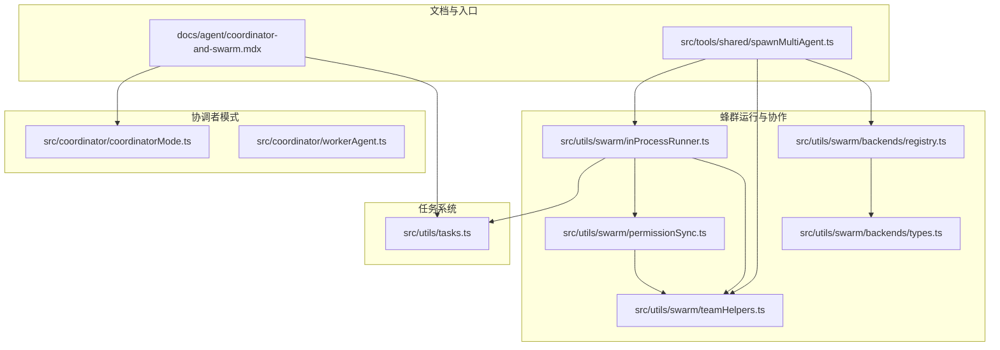
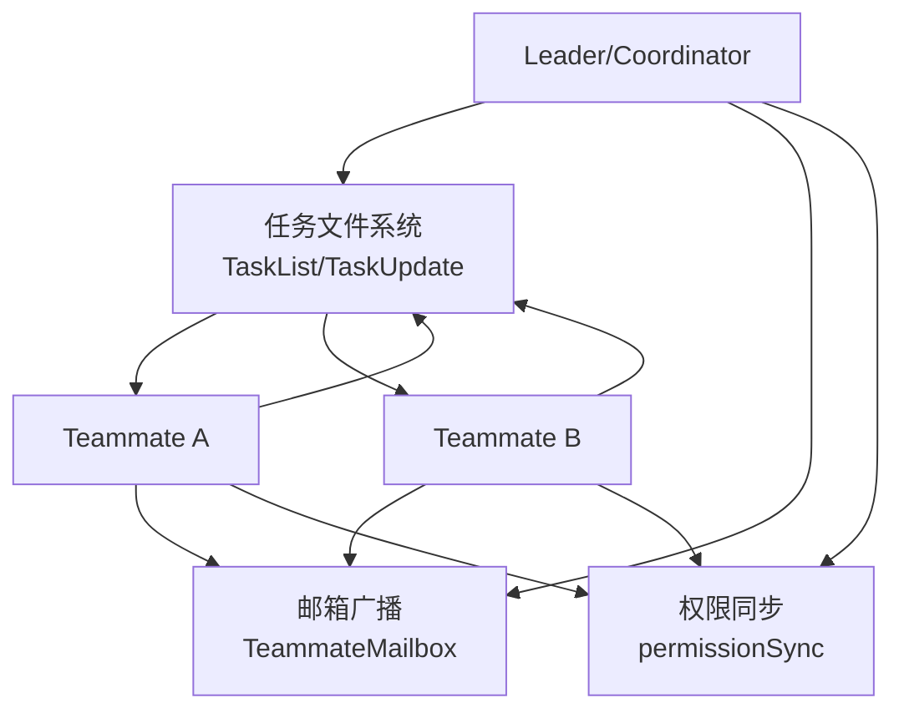
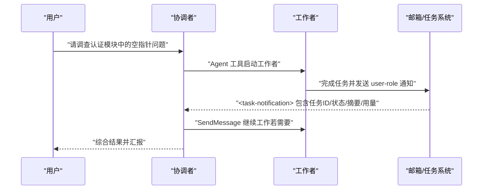
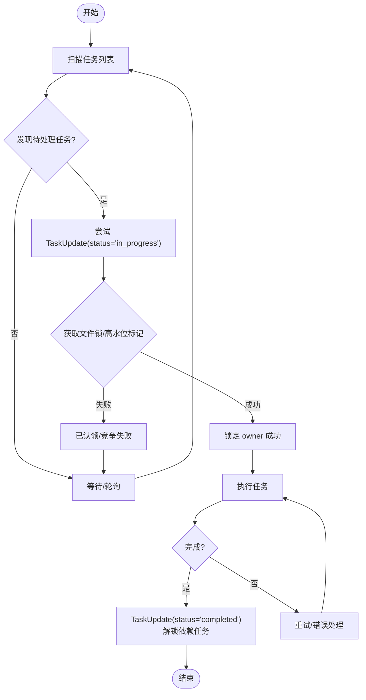
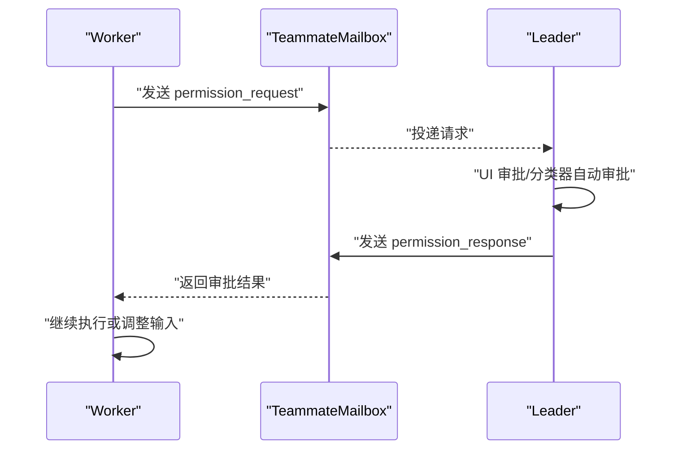
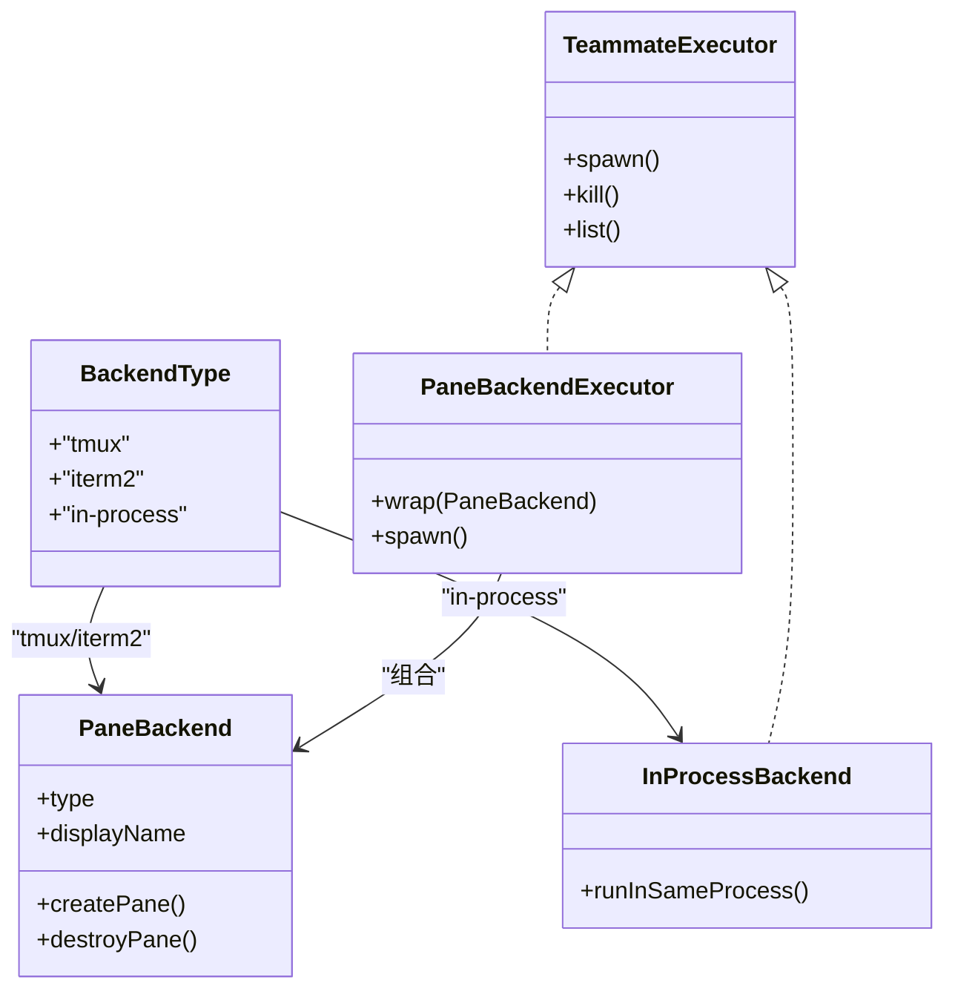
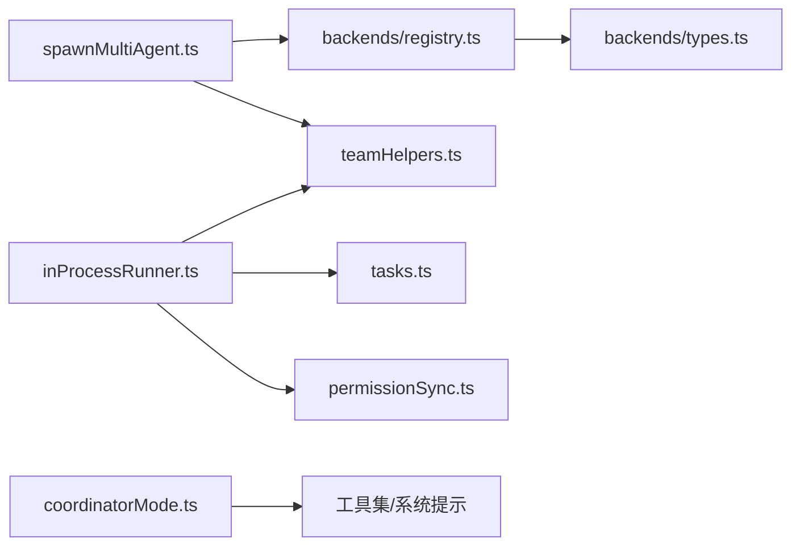

# 蜂群系统

<cite>
**本文引用的文件**
- [docs/agent/coordinator-and-swarm.mdx](file://docs/agent/coordinator-and-swarm.mdx)
- [src/coordinator/coordinatorMode.ts](file://src/coordinator/coordinatorMode.ts)
- [src/coordinator/workerAgent.ts](file://src/coordinator/workerAgent.ts)
- [src/utils/agentSwarmsEnabled.ts](file://src/utils/agentSwarmsEnabled.ts)
- [src/utils/swarm/inProcessRunner.ts](file://src/utils/swarm/inProcessRunner.ts)
- [src/utils/swarm/permissionSync.ts](file://src/utils/swarm/permissionSync.ts)
- [src/utils/swarm/teamHelpers.ts](file://src/utils/swarm/teamHelpers.ts)
- [src/utils/swarm/backends/registry.ts](file://src/utils/swarm/backends/registry.ts)
- [src/utils/swarm/backends/types.ts](file://src/utils/swarm/backends/types.ts)
- [src/utils/tasks.ts](file://src/utils/tasks.ts)
- [src/tools/shared/spawnMultiAgent.ts](file://src/tools/shared/spawnMultiAgent.ts)
- [V6.md](file://V6.md)
</cite>

## 目录
1. [引言](#引言)
2. [项目结构](#项目结构)
3. [核心组件](#核心组件)
4. [架构总览](#架构总览)
5. [详细组件分析](#详细组件分析)
6. [依赖关系分析](#依赖关系分析)
7. [性能考量](#性能考量)
8. [故障排查指南](#故障排查指南)
9. [结论](#结论)
10. [附录](#附录)

## 引言
本文件系统性梳理 Claude Code Best 的“蜂群系统”（Agent Swarms）设计与实现，聚焦多代理并行协作的架构与机制。文档围绕以下主题展开：
- 蜂群模式的设计理念与实现路径：共享任务列表、竞争认领、去中心化协作。
- 代理发现、任务分配、负载均衡与状态同步机制。
- 代理间通信协议与消息传递：邮箱广播、权限请求与响应、任务通知。
- 性能优化与资源管理：并发控制、内存与 CPU 使用、执行后端选择。
- 配置选项与调优参数：如何按需调整蜂群规模与行为。
- 实际使用案例：在复杂项目中应用蜂群系统进行并行开发与任务处理。

## 项目结构
蜂群系统主要分布在如下区域：
- 文档层：位于 docs/agent/coordinator-and-swarm.mdx，系统阐述 Coordinator Mode 与 Swarm 的差异、任务通信协议与协作流程。
- 协调器模式：src/coordinator/coordinatorMode.ts 与 workerAgent.ts，定义协调者与工作者的角色边界与系统提示。
- 蜂群运行与协作：src/utils/swarm/*，涵盖进程内运行器、权限同步、团队文件与后端注册表等。
- 任务系统：src/utils/tasks.ts，提供任务声明周期、并发原语（认领/更新）与阻塞关系。
- 多代理启动：src/tools/shared/spawnMultiAgent.ts，统一入口负责环境变量继承、面板布局与任务框架集成。
- 架构演进：V6.md，记录 packages/swarm 的体量与模块分布，体现系统扩展性与拆分意图。

**图表来源**
- [docs/agent/coordinator-and-swarm.mdx:1-197](file://docs/agent/coordinator-and-swarm.mdx#L1-L197)
- [src/coordinator/coordinatorMode.ts:1-370](file://src/coordinator/coordinatorMode.ts#L1-L370)
- [src/coordinator/workerAgent.ts:1-5](file://src/coordinator/workerAgent.ts#L1-L5)
- [src/utils/swarm/inProcessRunner.ts:1-200](file://src/utils/swarm/inProcessRunner.ts#L1-L200)
- [src/utils/swarm/permissionSync.ts:1-200](file://src/utils/swarm/permissionSync.ts#L1-L200)
- [src/utils/swarm/teamHelpers.ts:1-200](file://src/utils/swarm/teamHelpers.ts#L1-L200)
- [src/utils/swarm/backends/registry.ts:1-465](file://src/utils/swarm/backends/registry.ts#L1-L465)
- [src/utils/swarm/backends/types.ts:1-44](file://src/utils/swarm/backends/types.ts#L1-L44)
- [src/utils/tasks.ts:485-692](file://src/utils/tasks.ts#L485-L692)
- [src/tools/shared/spawnMultiAgent.ts:36-70](file://src/tools/shared/spawnMultiAgent.ts#L36-L70)

**章节来源**
- [docs/agent/coordinator-and-swarm.mdx:1-197](file://docs/agent/coordinator-and-swarm.mdx#L1-L197)
- [V6.md:696-746](file://V6.md#L696-L746)

## 核心组件
- 协调者模式（Coordinator Mode）：定义“理解—分配—综合”的工作流，强调集中决策与结果合成，Worker 不具备直接操作工具的能力，仅执行协调者分配的任务。
- 蜂群模式（Agent Swarms）：基于任务系统 V2 的“共享任务列表 + 竞争认领”，每个 Agent 自主发现并认领任务，实现高并行度的去中心化协作。
- 任务系统：提供任务生命周期管理、并发原语（claimTask）、阻塞关系与原子性保障（文件锁 + 高水位标记）。
- 权限同步：通过邮箱广播实现权限请求与响应，支持分类器自动审批与领导者的交互式确认。
- 执行后端：支持 tmux/iTerm2 面板后端与进程内后端，依据环境自动选择或强制指定，保障 UI 可视化与非交互场景的兼容。
- 团队文件：维护团队元信息、成员状态、工作树路径与权限规则，支撑重连与生命周期管理。

**章节来源**
- [src/coordinator/coordinatorMode.ts:80-370](file://src/coordinator/coordinatorMode.ts#L80-L370)
- [docs/agent/coordinator-and-swarm.mdx:116-197](file://docs/agent/coordinator-and-swarm.mdx#L116-L197)
- [src/utils/tasks.ts:485-692](file://src/utils/tasks.ts#L485-L692)
- [src/utils/swarm/permissionSync.ts:1-200](file://src/utils/swarm/permissionSync.ts#L1-L200)
- [src/utils/swarm/backends/registry.ts:136-398](file://src/utils/swarm/backends/registry.ts#L136-L398)
- [src/utils/swarm/teamHelpers.ts:64-200](file://src/utils/swarm/teamHelpers.ts#L64-L200)

## 架构总览
蜂群系统采用“网状拓扑 + 共享任务列表”的协作架构：
- 代理发现：通过任务列表与团队文件共享，所有 Agent 指向同一 taskListId，无需额外协调。
- 任务分配：claimTask() 为核心并发原语，结合文件锁与高水位标记，确保原子性与一致性。
- 负载均衡：多个 Agent 并发扫描任务列表，竞争认领，天然实现负载均衡。
- 状态同步：任务状态变更通过任务文件与邮箱广播传播，依赖方任务自动解锁。
- 通信协议：任务文件系统 + 邮箱广播；Worker 完成后以 user-role message 形式携带 XML 通知，便于协调者识别。

**图表来源**
- [docs/agent/coordinator-and-swarm.mdx:77-96](file://docs/agent/coordinator-and-swarm.mdx#L77-L96)
- [src/utils/tasks.ts:525-692](file://src/utils/tasks.ts#L525-L692)
- [src/utils/swarm/permissionSync.ts:12-19](file://src/utils/swarm/permissionSync.ts#L12-L19)

## 详细组件分析

### 协调者模式（Coordinator Mode）
- 激活机制：构建时 feature('COORDINATOR_MODE') 与运行时环境变量 CLAUDE_CODE_COORDINATOR_MODE=1 双重门控；会话恢复时 matchSessionMode() 自动同步模式状态。
- 工具集：仅保留 Agent、SendMessage、TaskStop 等编排工具，Worker 不具备“动手”工具，避免递归嵌套团队。
- 通信协议：<task-notification> XML 以 user-role message 形式送达，包含任务 ID、状态、摘要与用量统计，便于定向续传。
- 综合职责：必须先理解再分配，禁止将“理解”责任推给 Worker，强调协调者对结果的合成与沟通。

**图表来源**
- [src/coordinator/coordinatorMode.ts:146-165](file://src/coordinator/coordinatorMode.ts#L146-L165)
- [docs/agent/coordinator-and-swarm.mdx:77-96](file://docs/agent/coordinator-and-swarm.mdx#L77-L96)

**章节来源**
- [src/coordinator/coordinatorMode.ts:26-78](file://src/coordinator/coordinatorMode.ts#L26-L78)
- [src/coordinator/coordinatorMode.ts:80-370](file://src/coordinator/coordinatorMode.ts#L80-L370)
- [docs/agent/coordinator-and-swarm.mdx:21-115](file://docs/agent/coordinator-and-swarm.mdx#L21-L115)

### 蜂群模式（Agent Swarms）
- 团队初始化：Leader 创建团队（TeamCreateTool），随后所有 Teammate 自动获得相同的 taskListId；启动时多级优先级确保指向同一任务列表。
- 任务认领与竞争：claimTask() 是核心并发原语，文件锁 + 高水位标记保证原子性；第一个写入者获得 owner 锁定，第二个收到 already_claimed 错误；完成后自动解锁依赖任务。
- Teammate 生命周期：异常退出时 unassignTeammateTasks() 将其未完成任务重置为 pending；Leader 通过 mailbox 收到通知并重新分配或创建新 Teammate。
- 任务类型：LocalAgentTask、LocalShellTask、InProcessTeammateTask、RemoteAgentTask、DreamTask、LocalWorkflowTask、MonitorMcpTask，其中 InProcessTeammateTask 与 LocalAgentTask 的关键差异在于进程内共享状态与独立对话上下文。

**图表来源**
- [docs/agent/coordinator-and-swarm.mdx:118-158](file://docs/agent/coordinator-and-swarm.mdx#L118-L158)
- [src/utils/tasks.ts:525-692](file://src/utils/tasks.ts#L525-L692)

**章节来源**
- [docs/agent/coordinator-and-swarm.mdx:116-187](file://docs/agent/coordinator-and-swarm.mdx#L116-L187)
- [src/utils/tasks.ts:485-692](file://src/utils/tasks.ts#L485-L692)

### 权限同步与消息传递
- 权限请求与响应：Worker 通过邮箱向 Leader 发送 permission_request，Leader 在 UI 中审批后返回 permission_response；支持分类器自动审批与“总是允许”规则持久化。
- 邮箱广播：TeammateMailbox 提供 send/receive/broadcast 能力，支持跨 Agent 的消息传递与状态同步。
- 通信协议：XML 通知（Coordinator Mode）与 JSON 请求/响应（Swarm 权限）双通道并存，分别服务于不同协作阶段。

**图表来源**
- [src/utils/swarm/permissionSync.ts:12-19](file://src/utils/swarm/permissionSync.ts#L12-L19)
- [src/utils/swarm/permissionSync.ts:167-200](file://src/utils/swarm/permissionSync.ts#L167-L200)

**章节来源**
- [src/utils/swarm/permissionSync.ts:1-200](file://src/utils/swarm/permissionSync.ts#L1-L200)

### 执行后端与终端集成
- 后端类型：tmux、iTerm2、in-process，分别面向面板可视化、终端原生分割与非交互场景。
- 自动检测：优先级策略依据是否在 tmux/iTerm2、it2 可用性与 tmux 可用性决定；支持用户偏好与回退策略。
- 执行器封装：PaneBackendExecutor 封装面板后端，InProcessBackend 提供进程内执行；统一 TeammateExecutor 接口屏蔽后端细节。

**图表来源**
- [src/utils/swarm/backends/types.ts:1-44](file://src/utils/swarm/backends/types.ts#L1-L44)
- [src/utils/swarm/backends/registry.ts:136-398](file://src/utils/swarm/backends/registry.ts#L136-L398)

**章节来源**
- [src/utils/swarm/backends/registry.ts:136-398](file://src/utils/swarm/backends/registry.ts#L136-L398)
- [src/utils/swarm/backends/types.ts:1-44](file://src/utils/swarm/backends/types.ts#L1-L44)

### 多代理启动与环境继承
- 统一入口：spawnMultiAgent.ts 负责环境变量继承（如 CLAUDE_CODE_TASK_LIST_ID、CLAUDE_CODE_TEAM_NAME）、面板布局与任务框架集成。
- 队友布局：支持 tmux/iTerm2 面板创建与边框状态显示，便于可视化监控。
- 模型与颜色：为每个 Teammate 分配唯一颜色与模型配置，提升可读性与调试效率。

**章节来源**
- [src/tools/shared/spawnMultiAgent.ts:36-70](file://src/tools/shared/spawnMultiAgent.ts#L36-L70)
- [src/utils/swarm/teamHelpers.ts:64-200](file://src/utils/swarm/teamHelpers.ts#L64-L200)

## 依赖关系分析
- 组件耦合与内聚：
  - inProcessRunner.ts 与 tasks.ts、teammateMailbox.ts、permissionSync.ts 高度耦合，体现进程内执行与权限/任务/邮箱的紧密协作。
  - backends/registry.ts 与 backends/types.ts 解耦后端类型与执行器封装，降低上层复杂度。
- 直接与间接依赖：
  - spawnMultiAgent.ts 间接依赖 backends/registry.ts、teamHelpers.ts、teammateLayoutManager.ts 等，形成启动链路。
  - coordinatorMode.ts 与工具集、系统提示与会话状态交互，形成编排闭环。
- 外部依赖与集成点：
  - tmux/iTerm2 CLI 与 it2 工具链，用于面板后端；非交互场景依赖 in-process 后端。
  - 任务系统依赖文件系统锁与任务目录结构，确保并发安全。

**图表来源**
- [src/tools/shared/spawnMultiAgent.ts:36-70](file://src/tools/shared/spawnMultiAgent.ts#L36-L70)
- [src/utils/swarm/inProcessRunner.ts:87-110](file://src/utils/swarm/inProcessRunner.ts#L87-L110)
- [src/utils/swarm/backends/registry.ts:136-398](file://src/utils/swarm/backends/registry.ts#L136-L398)
- [src/utils/swarm/backends/types.ts:1-44](file://src/utils/swarm/backends/types.ts#L1-L44)
- [src/coordinator/coordinatorMode.ts:111-370](file://src/coordinator/coordinatorMode.ts#L111-L370)

**章节来源**
- [src/utils/swarm/inProcessRunner.ts:1-200](file://src/utils/swarm/inProcessRunner.ts#L1-L200)
- [src/utils/tasks.ts:485-692](file://src/utils/tasks.ts#L485-L692)
- [src/utils/swarm/permissionSync.ts:1-200](file://src/utils/swarm/permissionSync.ts#L1-L200)
- [src/utils/swarm/backends/registry.ts:136-398](file://src/utils/swarm/backends/registry.ts#L136-L398)

## 性能考量
- 并发控制：
  - claimTask() 使用文件锁与高水位标记，避免 TOCTOU 竞态；支持“检查代理忙碌”原子化策略，减少死锁与资源争用。
  - inProcessRunner.ts 通过 AsyncLocalStorage 实现上下文隔离，避免全局状态污染；支持进度跟踪与空闲通知，降低无效轮询。
- 资源管理：
  - tmux/iTerm2 面板后端适合可视化场景；非交互场景（-p 模式）强制 in-process，避免面板开销。
  - 权限请求采用分类器自动审批与“总是允许”规则持久化，减少 UI 交互延迟。
- 内存与 CPU：
  - InProcessTeammateTask 与 LocalAgentTask 的差异：前者共享进程状态但独立上下文，适合轻量协作；后者完全隔离，启动开销更高但更安全。
  - 任务输出与终端任务清理（evictTaskOutput、evictTerminalTask）降低长期运行的内存占用。

**章节来源**
- [src/utils/tasks.ts:525-692](file://src/utils/tasks.ts#L525-L692)
- [src/utils/swarm/inProcessRunner.ts:114-127](file://src/utils/swarm/inProcessRunner.ts#L114-L127)
- [src/utils/swarm/backends/registry.ts:351-398](file://src/utils/swarm/backends/registry.ts#L351-L398)

## 故障排查指南
- 模式切换与会话恢复：
  - 若会话恢复时模式不一致，matchSessionMode() 会自动翻转环境变量以匹配历史模式，并记录日志。
- 权限问题：
  - 权限请求未返回：检查邮箱广播是否正常、Leader 是否在处理请求、分类器是否启用且通过。
  - “总是允许”规则未生效：确认 permissionUpdates 是否正确持久化与应用。
- 任务认领冲突：
  - already_claimed：多个 Agent 同时认领同一任务，属预期行为；可适当增加轮询间隔或减少并发。
  - agent_busy：代理已在处理其他任务，建议启用 claimTaskWithBusyCheck 以原子化检查。
- 后端不可用：
  - iTerm2 无 it2 或 tmux 未安装：根据提示安装并重启；必要时回退至 in-process 模式。
- 团队文件异常：
  - 读写失败：检查团队目录权限与磁盘空间；必要时清理临时文件或重建团队。

**章节来源**
- [src/coordinator/coordinatorMode.ts:49-78](file://src/coordinator/coordinatorMode.ts#L49-L78)
- [src/utils/swarm/permissionSync.ts:167-200](file://src/utils/swarm/permissionSync.ts#L167-L200)
- [src/utils/tasks.ts:525-692](file://src/utils/tasks.ts#L525-L692)
- [src/utils/swarm/backends/registry.ts:259-285](file://src/utils/swarm/backends/registry.ts#L259-L285)
- [src/utils/swarm/teamHelpers.ts:131-182](file://src/utils/swarm/teamHelpers.ts#L131-L182)

## 结论
蜂群系统通过“共享任务列表 + 竞争认领”的去中心化协作范式，实现了高并行度与强扩展性的多代理编排。配合权限同步、任务通知与多种执行后端，系统在复杂项目中能够高效处理并行开发与任务处理。通过合理的配置与调优，用户可在不同环境下平衡性能、可观测性与安全性。

## 附录
- 配置选项与调优参数（节选）：
  - 门控开关：CLAUDE_CODE_EXPERIMENTAL_AGENT_TEAMS（外部构建需开启）、--agent-teams CLI 标志。
  - 模式开关：CLAUDE_CODE_COORDINATOR_MODE（协调者模式）、COOR_MODE 匹配（会话恢复时自动同步）。
  - 后端偏好：teammateMode（auto/tmux/in-process），以及用户对 tmux/iTerm2 的偏好设置。
  - 并发策略：claimTaskWithBusyCheck 的原子化检查、轮询间隔与任务粒度划分。
- 实际使用案例（概念性说明）：
  - 并行修复多个独立 lint 警告：Swarm 模式下每个 Agent 独立认领任务，最大化并行度。
  - 大仓库搜索与分类：无依赖任务，各自领任务即可，适合大规模并行扫描。
  - 需要集中决策的重构：Coordinator Mode 下由协调者统一理解与合成，再分配给 Worker 执行。

[本节为概念性总结，不直接分析具体文件]