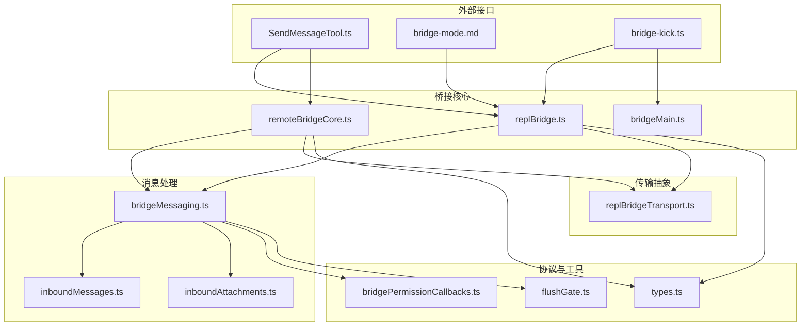
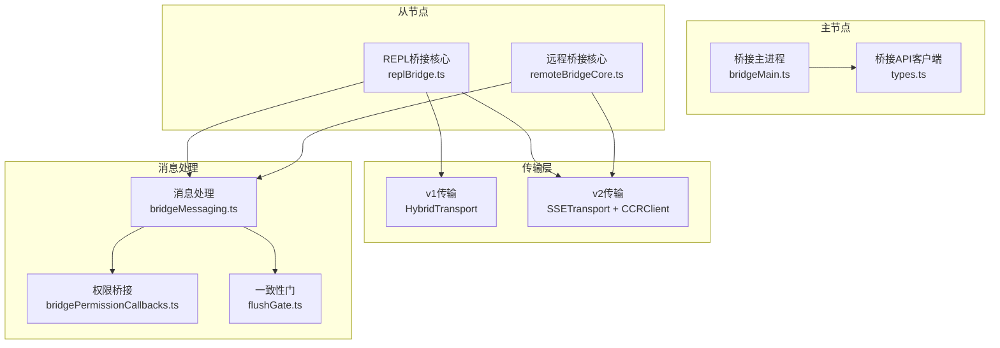
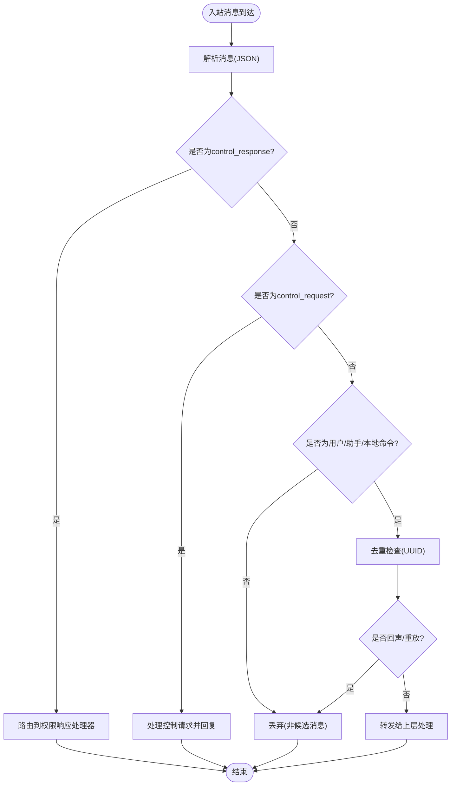
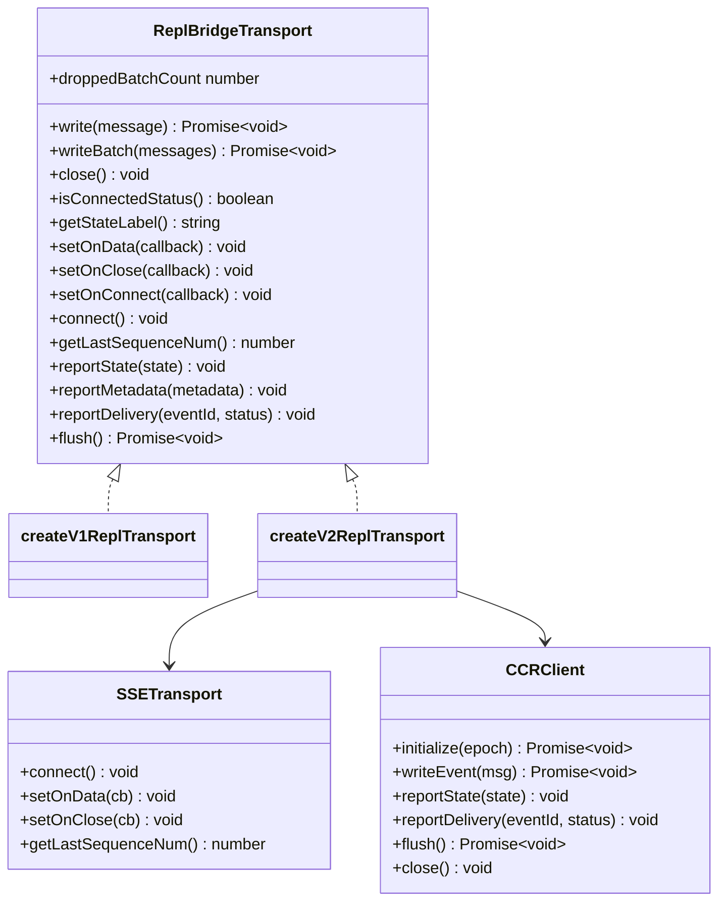
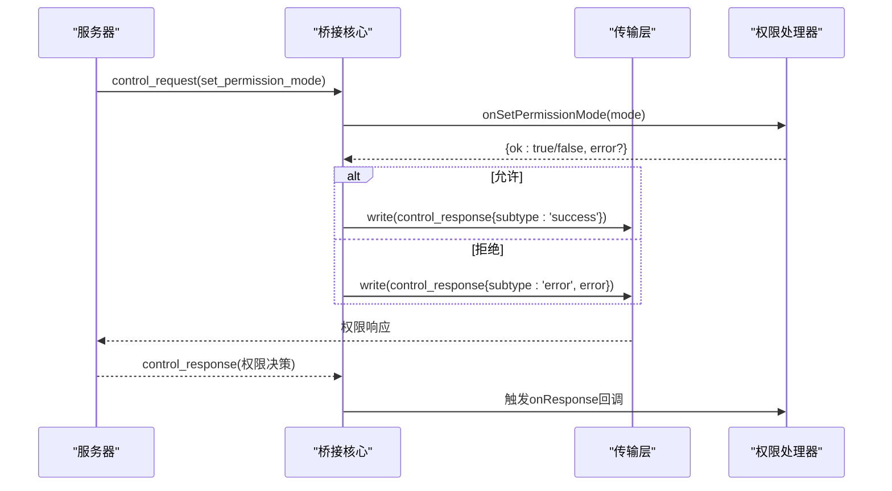
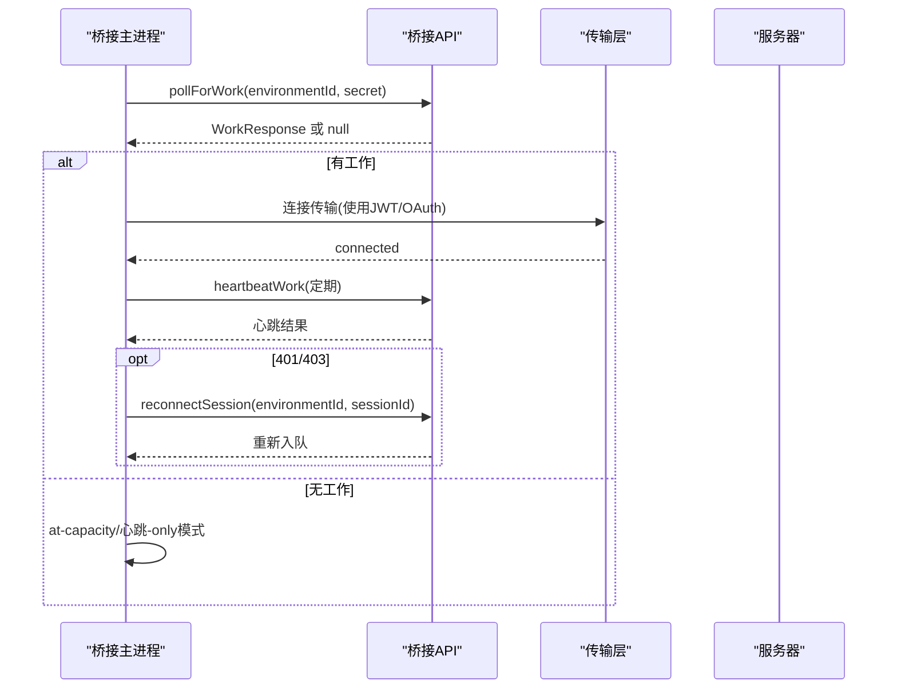
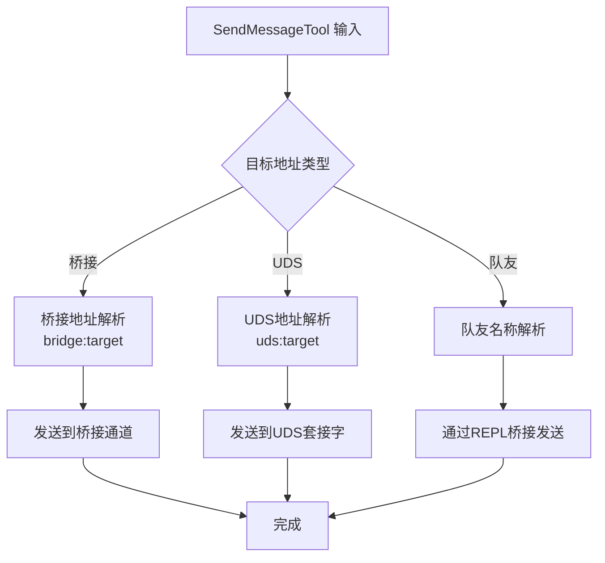
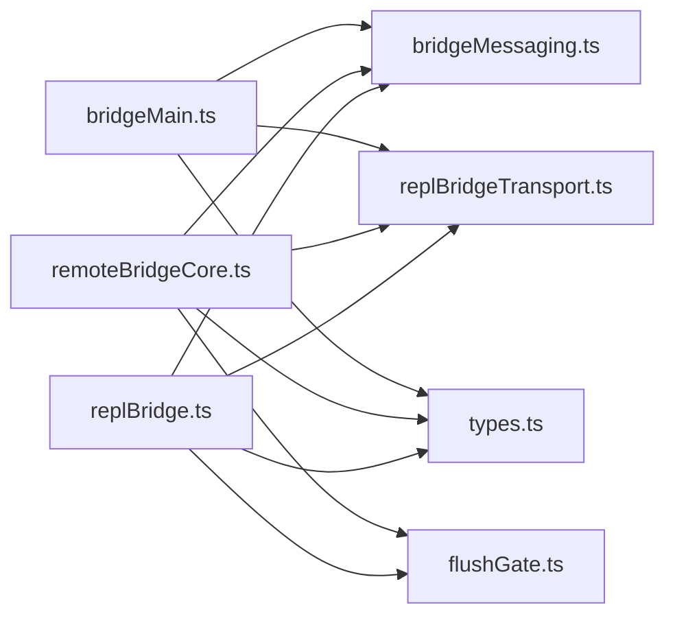

# 通信协议与消息传递

<cite>
**本文档引用的文件**
- [bridgeMain.ts](file://src/bridge/bridgeMain.ts)
- [replBridge.ts](file://src/bridge/replBridge.ts)
- [remoteBridgeCore.ts](file://src/bridge/remoteBridgeCore.ts)
- [bridgeMessaging.ts](file://src/bridge/bridgeMessaging.ts)
- [replBridgeTransport.ts](file://src/bridge/replBridgeTransport.ts)
- [types.ts](file://src/bridge/types.ts)
- [inboundMessages.ts](file://src/bridge/inboundMessages.ts)
- [inboundAttachments.ts](file://src/bridge/inboundAttachments.ts)
- [bridgePermissionCallbacks.ts](file://src/bridge/bridgePermissionCallbacks.ts)
- [flushGate.ts](file://src/bridge/flushGate.ts)
- [bridge-kick.ts](file://src/commands/bridge-kick.ts)
- [SendMessageTool.ts](file://src/tools/SendMessageTool/SendMessageTool.ts)
- [bridge-mode.md](file://docs/features/bridge-mode.md)
</cite>

## 目录
1. [简介](#简介)
2. [项目结构](#项目结构)
3. [核心组件](#核心组件)
4. [架构总览](#架构总览)
5. [详细组件分析](#详细组件分析)
6. [依赖关系分析](#依赖关系分析)
7. [性能考虑](#性能考虑)
8. [故障排除指南](#故障排除指南)
9. [结论](#结论)

## 简介
本文件系统性梳理蜂群系统的通信协议与消息传递机制，涵盖主从模式、分布式通信、消息路由、权限桥接、重连容错以及调试方法。重点解析两类桥接路径：基于环境工作流的 REPL 桥接（env-based）与无环境直接会话桥接（env-less）。文档同时给出协议数据模型、传输层抽象、权限控制与安全通信策略，并提供可操作的排障建议。

## 项目结构
蜂群通信相关代码主要位于 `src/bridge/` 目录，围绕以下关键模块组织：
- 桥接核心：bridgeMain.ts、replBridge.ts、remoteBridgeCore.ts
- 消息处理：bridgeMessaging.ts、inboundMessages.ts、inboundAttachments.ts
- 传输抽象：replBridgeTransport.ts
- 协议类型：types.ts
- 权限桥接：bridgePermissionCallbacks.ts
- 容错与一致性：flushGate.ts、bridge-kick.ts
- 外部接口：SendMessageTool.ts、bridge-mode.md

**图表来源**
- [bridgeMain.ts:141-800](file://src/bridge/bridgeMain.ts#L141-L800)
- [replBridge.ts:260-1200](file://src/bridge/replBridge.ts#L260-L1200)
- [remoteBridgeCore.ts:140-1009](file://src/bridge/remoteBridgeCore.ts#L140-L1009)
- [bridgeMessaging.ts:1-463](file://src/bridge/bridgeMessaging.ts#L1-L463)
- [replBridgeTransport.ts:1-371](file://src/bridge/replBridgeTransport.ts#L1-L371)
- [types.ts:1-263](file://src/bridge/types.ts#L1-L263)
- [flushGate.ts:1-50](file://src/bridge/flushGate.ts#L1-L50)
- [bridgePermissionCallbacks.ts:1-44](file://src/bridge/bridgePermissionCallbacks.ts#L1-L44)
- [SendMessageTool.ts:520-798](file://src/tools/SendMessageTool/SendMessageTool.ts#L520-L798)
- [bridge-mode.md:33-56](file://docs/features/bridge-mode.md#L33-L56)
- [bridge-kick.ts:24-157](file://src/commands/bridge-kick.ts#L24-L157)

**章节来源**
- [bridgeMain.ts:141-800](file://src/bridge/bridgeMain.ts#L141-L800)
- [replBridge.ts:260-1200](file://src/bridge/replBridge.ts#L260-L1200)
- [remoteBridgeCore.ts:140-1009](file://src/bridge/remoteBridgeCore.ts#L140-L1009)

## 核心组件
- 桥接主循环（bridgeMain.ts）：负责环境注册、工作轮询、心跳保活、会话生命周期管理与多会话容量控制。
- REPL 桥接核心（replBridge.ts）：封装环境-会话-传输的完整生命周期，支持 v1/v2 传输切换、权限控制请求、标题推导与崩溃恢复。
- 远程桥接核心（remoteBridgeCore.ts）：无环境直连会话，直接通过 /code/sessions 接口创建会话并建立 v2 传输。
- 消息处理（bridgeMessaging.ts）：统一解析入站消息、去重、权限响应分发、控制请求处理与结果消息构造。
- 传输抽象（replBridgeTransport.ts）：统一 v1（HybridTransport）与 v2（SSETransport + CCRClient）写入接口。
- 类型定义（types.ts）：定义工作秘密、客户端接口、桥接配置与日志器接口。
- 权限桥接（bridgePermissionCallbacks.ts）：定义权限决策回调与响应验证。
- 容错与一致性（flushGate.ts）：在初始历史刷写期间对新消息进行排队，确保顺序一致性。
- 外部接口（SendMessageTool.ts）：跨会话消息发送工具，支持桥接地址与 UDS 地址。
- 文档规范（bridge-mode.md）：对外暴露的桥接 API 行为与认证流程说明。

**章节来源**
- [bridgeMain.ts:141-800](file://src/bridge/bridgeMain.ts#L141-L800)
- [replBridge.ts:260-1200](file://src/bridge/replBridge.ts#L260-L1200)
- [remoteBridgeCore.ts:140-1009](file://src/bridge/remoteBridgeCore.ts#L140-L1009)
- [bridgeMessaging.ts:1-463](file://src/bridge/bridgeMessaging.ts#L1-L463)
- [replBridgeTransport.ts:1-371](file://src/bridge/replBridgeTransport.ts#L1-L371)
- [types.ts:1-263](file://src/bridge/types.ts#L1-L263)
- [bridgePermissionCallbacks.ts:1-44](file://src/bridge/bridgePermissionCallbacks.ts#L1-L44)
- [flushGate.ts:1-50](file://src/bridge/flushGate.ts#L1-L50)
- [SendMessageTool.ts:520-798](file://src/tools/SendMessageTool/SendMessageTool.ts#L520-L798)
- [bridge-mode.md:33-56](file://docs/features/bridge-mode.md#L33-L56)

## 架构总览
蜂群通信采用“主从 + 分布式”的混合架构：
- 主节点：桥接主进程（bridgeMain.ts）负责环境注册、工作轮询与心跳保活。
- 从节点：REPL 桥接（replBridge.ts）或远程桥接（remoteBridgeCore.ts）负责具体会话的传输与消息处理。
- 传输层：v1 使用 WebSocket + Session-Ingress，v2 使用 SSE + CCRClient，二者通过统一接口适配。
- 权限桥接：通过 control_request/control_response 实现权限决策的双向通信。
- 一致性保障：FlushGate 在初始历史刷写期间对新消息进行排队，避免乱序。

**图表来源**
- [bridgeMain.ts:141-800](file://src/bridge/bridgeMain.ts#L141-L800)
- [replBridge.ts:260-1200](file://src/bridge/replBridge.ts#L260-L1200)
- [remoteBridgeCore.ts:140-1009](file://src/bridge/remoteBridgeCore.ts#L140-L1009)
- [bridgeMessaging.ts:1-463](file://src/bridge/bridgeMessaging.ts#L1-L463)
- [replBridgeTransport.ts:1-371](file://src/bridge/replBridgeTransport.ts#L1-L371)
- [types.ts:133-176](file://src/bridge/types.ts#L133-L176)
- [bridgePermissionCallbacks.ts:1-44](file://src/bridge/bridgePermissionCallbacks.ts#L1-L44)
- [flushGate.ts:1-50](file://src/bridge/flushGate.ts#L1-L50)

## 详细组件分析

### 1) 消息传递协议与路由
- 入站消息解析：bridgeMessaging.handleIngressMessage 解析 SDKMessage，过滤 echo 与重复消息，仅转发用户/助手/本地命令消息。
- 控制请求处理：handleServerControlRequest 支持 initialize、set_model、set_max_thinking_tokens、set_permission_mode、interrupt 等子类型，未识别子类型返回错误。
- 结果消息构造：makeResultMessage 用于会话归档前的最终事件。
- 去重机制：BoundedUUIDSet 维护最近发送/接收的 UUID，防止回声与重放。
- 标题提取：extractTitleText 从用户消息中提取标题文本，用于自动会话标题推导。

**图表来源**
- [bridgeMessaging.ts:132-208](file://src/bridge/bridgeMessaging.ts#L132-L208)
- [bridgeMessaging.ts:243-392](file://src/bridge/bridgeMessaging.ts#L243-L392)
- [bridgeMessaging.ts:400-417](file://src/bridge/bridgeMessaging.ts#L400-L417)

**章节来源**
- [bridgeMessaging.ts:1-463](file://src/bridge/bridgeMessaging.ts#L1-L463)

### 2) 传输层抽象与主从模式
- v1 传输：HybridTransport（WebSocket 读 + Session-Ingress POST 写），适用于传统 WebSocket 模式。
- v2 传输：SSETransport（读）+ CCRClient（写/心跳/状态上报），适用于 CCR v2 协议。
- 传输选择：由服务器工作秘密中的 use_code_sessions 字段决定；开发可通过环境变量强制使用 v2。
- 状态上报：reportState/reportMetadata/reportDelivery 用于向 CCR 上报会话状态与交付进度。

**图表来源**
- [replBridgeTransport.ts:23-70](file://src/bridge/replBridgeTransport.ts#L23-L70)
- [replBridgeTransport.ts:119-371](file://src/bridge/replBridgeTransport.ts#L119-L371)

**章节来源**
- [replBridgeTransport.ts:1-371](file://src/bridge/replBridgeTransport.ts#L1-L371)

### 3) 权限桥接机制
- 请求/响应模型：bridgePermissionCallbacks 定义了 sendRequest/sendResponse/cancelRequest/onResponse 回调。
- 响应验证：isBridgePermissionResponse 类型谓词确保响应包含 behavior 字段（allow/deny）。
- REPL 桥接：replBridge.ts 中 handleServerControlRequest 对 set_permission_mode 子类型进行策略校验，必要时拒绝并返回错误。
- 远程桥接：remoteBridgeCore.ts 在收到权限响应时触发 transport.reportState('running') 并回调上层。

**图表来源**
- [bridgePermissionCallbacks.ts:1-44](file://src/bridge/bridgePermissionCallbacks.ts#L1-L44)
- [bridgeMessaging.ts:243-392](file://src/bridge/bridgeMessaging.ts#L243-L392)
- [replBridge.ts:1193-1200](file://src/bridge/replBridge.ts#L1193-L1200)
- [remoteBridgeCore.ts:422-448](file://src/bridge/remoteBridgeCore.ts#L422-L448)

**章节来源**
- [bridgePermissionCallbacks.ts:1-44](file://src/bridge/bridgePermissionCallbacks.ts#L1-L44)
- [bridgeMessaging.ts:243-392](file://src/bridge/bridgeMessaging.ts#L243-L392)
- [replBridge.ts:1193-1200](file://src/bridge/replBridge.ts#L1193-L1200)
- [remoteBridgeCore.ts:422-448](file://src/bridge/remoteBridgeCore.ts#L422-L448)

### 4) 重连与容错机制
- 环境重连策略：replBridge.ts 的 doReconnect 实现双策略（重连入位/全新会话），最多尝试有限次数。
- v2 传输重建：remoteBridgeCore.ts 的 rebuildTransport 在 JWT 过期或 401 时重建传输，携带上次序列号以避免历史重放。
- 心跳保活：bridgeMain.ts 的 heartbeatActiveWorkItems 定期心跳，遇到 401/403 自动通过 reconnectSession 重新入队。
- FlushGate：在初始历史刷写期间对新消息排队，确保 [历史...，实时...] 的顺序一致性。
- 故障注入与调试：bridge-kick 提供 /bridge-kick 注入故障的能力，便于测试重连与恢复路径。

**图表来源**
- [bridgeMain.ts:202-270](file://src/bridge/bridgeMain.ts#L202-L270)
- [replBridge.ts:605-836](file://src/bridge/replBridge.ts#L605-L836)
- [remoteBridgeCore.ts:468-590](file://src/bridge/remoteBridgeCore.ts#L468-L590)
- [flushGate.ts:16-50](file://src/bridge/flushGate.ts#L16-L50)
- [bridge-kick.ts:24-157](file://src/commands/bridge-kick.ts#L24-L157)

**章节来源**
- [bridgeMain.ts:202-270](file://src/bridge/bridgeMain.ts#L202-L270)
- [replBridge.ts:605-836](file://src/bridge/replBridge.ts#L605-L836)
- [remoteBridgeCore.ts:468-590](file://src/bridge/remoteBridgeCore.ts#L468-L590)
- [flushGate.ts:16-50](file://src/bridge/flushGate.ts#L16-L50)
- [bridge-kick.ts:24-157](file://src/commands/bridge-kick.ts#L24-L157)

### 5) 外部接口与消息路由
- SendMessageTool：支持向队友发送消息，支持广播（*）与点对点，支持桥接地址（bridge:target）与 UDS 地址（uds:target）。
- 入站消息处理：inboundMessages.extractInboundMessageFields 与 normalizeImageBlocks 确保内容块字段规范化。
- 附件解析：inboundAttachments.resolveInboundAttachments 将 file_attachments 下载到本地并生成 @path 引用。

**图表来源**
- [SendMessageTool.ts:604-798](file://src/tools/SendMessageTool/SendMessageTool.ts#L604-L798)
- [inboundMessages.ts:21-40](file://src/bridge/inboundMessages.ts#L21-L40)
- [inboundAttachments.ts:123-176](file://src/bridge/inboundAttachments.ts#L123-L176)

**章节来源**
- [SendMessageTool.ts:520-798](file://src/tools/SendMessageTool/SendMessageTool.ts#L520-L798)
- [inboundMessages.ts:1-81](file://src/bridge/inboundMessages.ts#L1-L81)
- [inboundAttachments.ts:1-176](file://src/bridge/inboundAttachments.ts#L1-L176)

## 依赖关系分析
- 模块耦合：
  - replBridge.ts 依赖 bridgeMessaging.ts、replBridgeTransport.ts、types.ts 与 flushGate.ts。
  - remoteBridgeCore.ts 依赖 bridgeMessaging.ts、replBridgeTransport.ts、types.ts 与 flushGate.ts。
  - bridgeMain.ts 依赖 types.ts、bridgeApi.ts、bridgeStatusUtil.ts 等。
- 外部依赖：
  - Axios 用于 HTTP 请求（远程桥接与归档）。
  - Crypto、FS、Path 等 Node 内置模块用于令牌与文件处理。
- 可能的循环依赖：
  - 通过接口与类型导入避免运行时循环，传输层与消息层通过函数参数解耦。

**图表来源**
- [replBridge.ts:1-120](file://src/bridge/replBridge.ts#L1-L120)
- [remoteBridgeCore.ts:1-80](file://src/bridge/remoteBridgeCore.ts#L1-L80)
- [bridgeMain.ts:1-60](file://src/bridge/bridgeMain.ts#L1-L60)
- [bridgeMessaging.ts:1-30](file://src/bridge/bridgeMessaging.ts#L1-L30)
- [replBridgeTransport.ts:1-20](file://src/bridge/replBridgeTransport.ts#L1-L20)
- [types.ts:1-40](file://src/bridge/types.ts#L1-L40)
- [flushGate.ts:1-20](file://src/bridge/flushGate.ts#L1-L20)

**章节来源**
- [replBridge.ts:1-120](file://src/bridge/replBridge.ts#L1-L120)
- [remoteBridgeCore.ts:1-80](file://src/bridge/remoteBridgeCore.ts#L1-L80)
- [bridgeMain.ts:1-60](file://src/bridge/bridgeMain.ts#L1-L60)

## 性能考虑
- 传输选择：v2 传输在写入路径使用 CCRClient 的批处理与心跳，减少网络往返；v1 传输适合低延迟场景但需注意历史重放。
- 心跳策略：bridgeMain.ts 的 heartbeatActiveWorkItems 在鉴权失败时触发 reconnectSession，避免长时间空转。
- 去重与顺序：BoundedUUIDSet 与 FlushGate 降低乱序与重复风险，提升一致性体验。
- 超时与退避：replBridge.ts 的 doReconnect 与 remoteBridgeCore.ts 的 rebuildTransport 使用指数退避与抖动，避免雪崩效应。

## 故障排除指南
- 环境丢失（404）：执行 reconnectEnvironmentWithSession，优先尝试重连入位，失败则创建新会话。
- 401/403：通过 reconnectSession 重新入队工作项；远程桥接通过 fetchRemoteCredentials 与 rebuildTransport 重建传输。
- 传输关闭：handleTransportPermanentClose 根据关闭码区分清理关闭与永久失败，触发重连或终止。
- 故障注入：使用 /bridge-kick 注入 register/poll/heartbeat 失败，验证重连与恢复路径。
- 权限问题：检查 set_permission_mode 的策略校验与回调返回值，确保 onSetPermissionMode 返回明确的 ok/error。

**章节来源**
- [replBridge.ts:887-966](file://src/bridge/replBridge.ts#L887-L966)
- [remoteBridgeCore.ts:530-590](file://src/bridge/remoteBridgeCore.ts#L530-L590)
- [bridge-kick.ts:24-157](file://src/commands/bridge-kick.ts#L24-L157)

## 结论
蜂群通信协议通过清晰的主从分离、v1/v2 传输抽象与严格的权限桥接机制，实现了高可用、可扩展且安全的消息传递。FlushGate 与去重机制保障了消息顺序与一致性；心跳与重连策略提升了鲁棒性；权限控制与安全通信确保了访问合规。结合本文档提供的架构图与排障指南，开发者可以快速理解并优化蜂群通信性能。