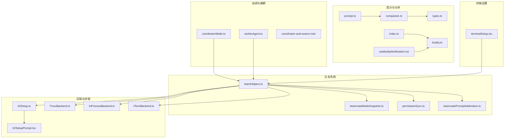
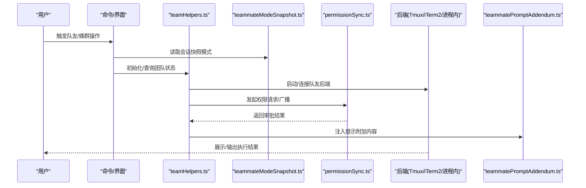
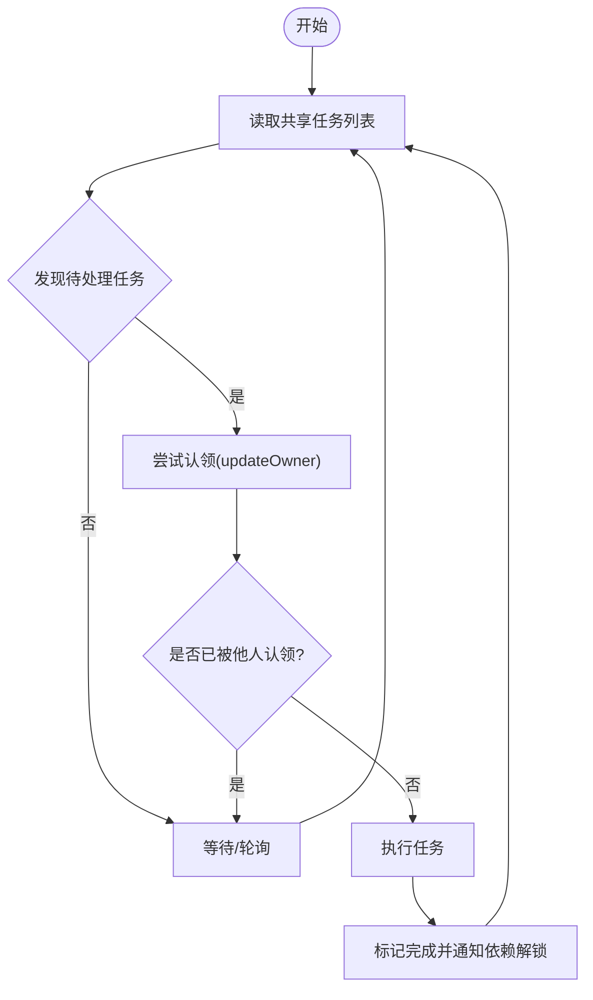
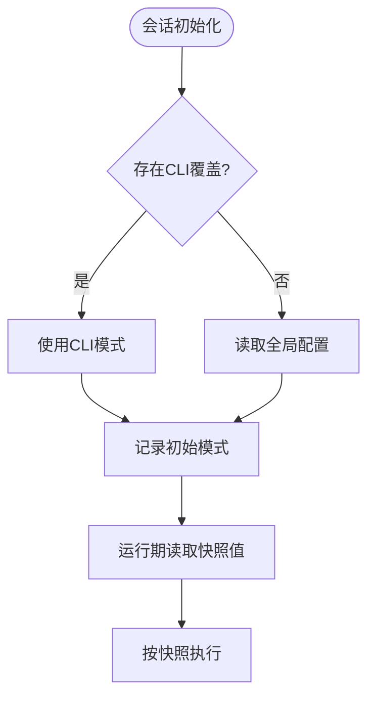
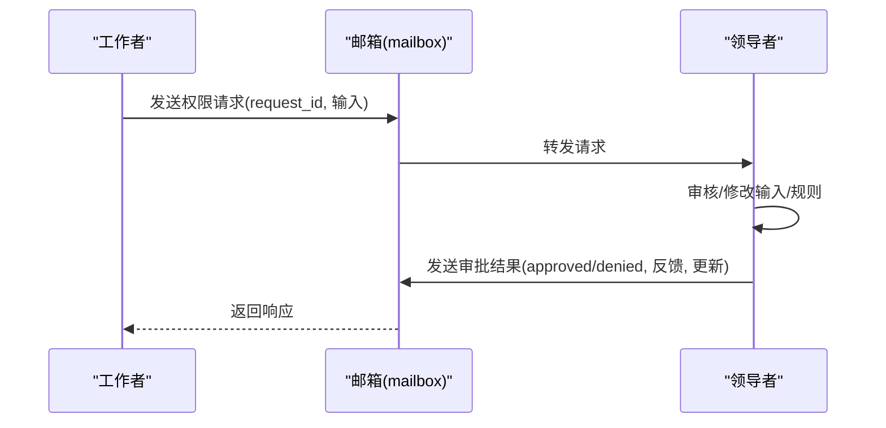
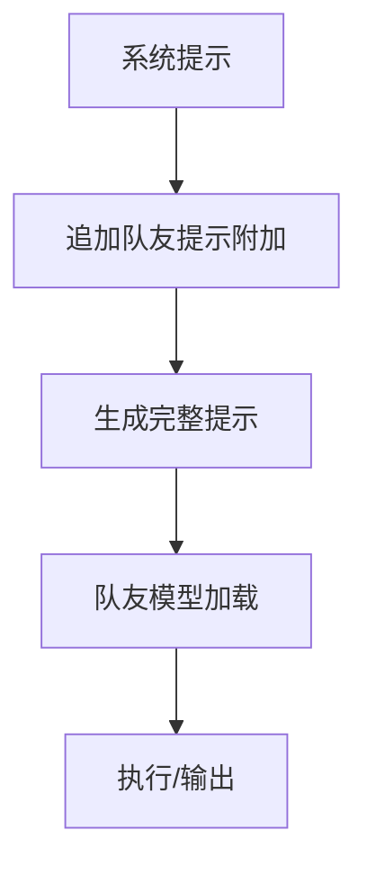
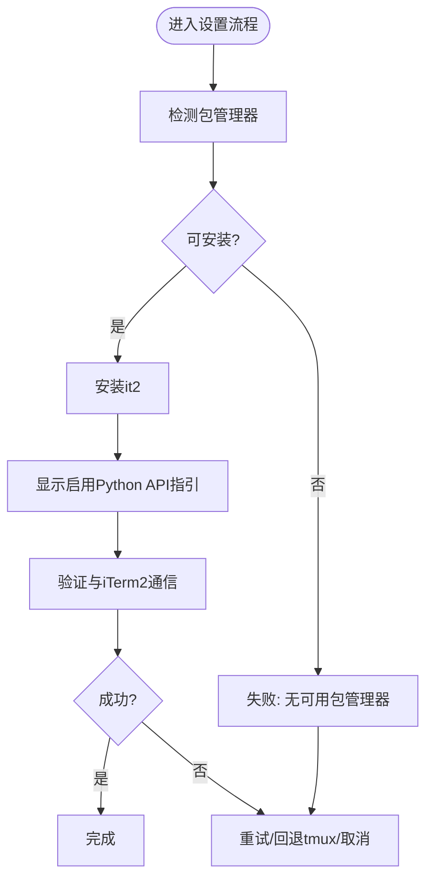
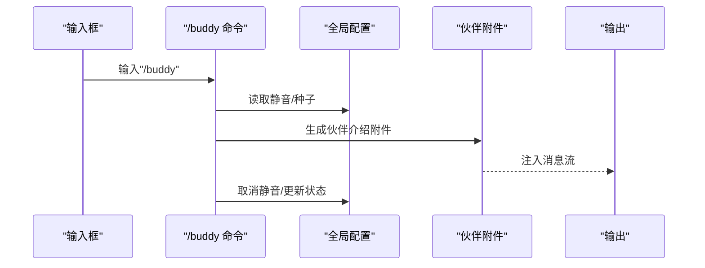
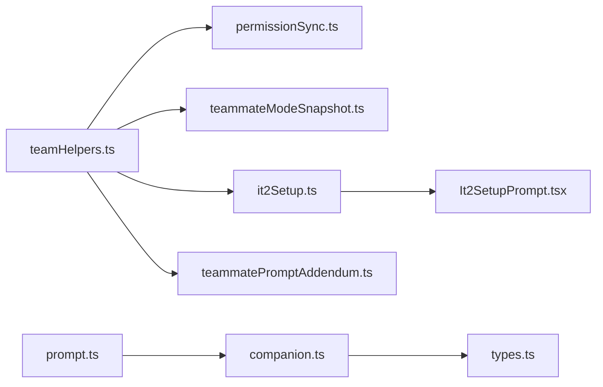

# 队友集成与协作

<cite>
**本文引用的文件**
- [coordinatorMode.ts](file://src/coordinator/coordinatorMode.ts)
- [workerAgent.ts](file://src/coordinator/workerAgent.ts)
- [coordinator-and-swarm.mdx](file://docs/agent/coordinator-and-swarm.mdx)
- [teammateModeSnapshot.ts](file://src/utils/swarm/backends/teammateModeSnapshot.ts)
- [teamHelpers.ts](file://src/utils/swarm/teamHelpers.ts)
- [it2Setup.ts](file://src/utils/swarm/backends/it2Setup.ts)
- [It2SetupPrompt.tsx](file://src/utils/swarm/It2SetupPrompt.tsx)
- [prompt.ts](file://src/buddy/prompt.ts)
- [companion.ts](file://src/buddy/companion.ts)
- [types.ts](file://src/buddy/types.ts)
- [index.ts](file://src/commands/buddy/index.ts)
- [buddy.ts](file://src/commands/buddy/buddy.ts)
- [useBuddyNotification.tsx](file://src/buddy/useBuddyNotification.tsx)
- [teammatePromptAddendum.ts](file://src/utils/swarm/teammatePromptAddendum.ts)
- [permissionSync.ts](file://src/utils/swarm/permissionSync.ts)
- [tasks.ts](file://src/utils/tasks.ts)
- [terminalSetup.tsx](file://src/commands/terminalSetup/terminalSetup.tsx)
</cite>

## 目录
1. [引言](#引言)
2. [项目结构](#项目结构)
3. [核心组件](#核心组件)
4. [架构总览](#架构总览)
5. [详细组件分析](#详细组件分析)
6. [依赖关系分析](#依赖关系分析)
7. [性能考量](#性能考量)
8. [故障排查指南](#故障排查指南)
9. [结论](#结论)
10. [附录](#附录)

## 引言
本文件面向希望深度理解并高效使用蜂群系统“队友”协作能力的用户与开发者。文档聚焦以下目标：
- 解释队友模式的设计理念与多代理协作机制，包括任务系统、权限同步与交互策略
- 描述队友提示补充机制：上下文增强、信息共享与协同决策
- 讲解队友模式快照功能：状态保存、恢复与版本管理
- 说明 IT2 设置与集成流程：终端适配、环境配置与用户体验优化
- 提供最佳实践与使用指南，帮助最大化发挥多代理协作效率

## 项目结构
蜂群系统的队友协作由“任务系统 + 多后端执行 + 权限同步 + 提示补充 + UI/命令行工具”构成。关键目录与职责如下：
- 协调器与蜂群：coordinator 目录负责领导者/工作者角色与模式选择；docs/agent/coordinator-and-swarm.mdx 提供高层设计说明
- 队友模式与后端：src/utils/swarm/backends 下包含 iTerm2、Tmux、进程内等后端实现，以及模式快照、权限同步、提示附加等模块
- 队友提示与伙伴：src/buddy 提供“伙伴”提示补充与 UI 交互
- 终端设置：src/commands/terminalSetup 提供 Terminal.app 体验优化

**图表来源**
- [coordinatorMode.ts](file://src/coordinator/coordinatorMode.ts)
- [workerAgent.ts](file://src/coordinator/workerAgent.ts)
- [coordinator-and-swarm.mdx](file://docs/agent/coordinator-and-swarm.mdx)
- [teamHelpers.ts](file://src/utils/swarm/teamHelpers.ts)
- [teammateModeSnapshot.ts](file://src/utils/swarm/backends/teammateModeSnapshot.ts)
- [permissionSync.ts](file://src/utils/swarm/permissionSync.ts)
- [teammatePromptAddendum.ts](file://src/utils/swarm/teammatePromptAddendum.ts)
- [it2Setup.ts](file://src/utils/swarm/backends/it2Setup.ts)
- [It2SetupPrompt.tsx](file://src/utils/swarm/It2SetupPrompt.tsx)
- [prompt.ts](file://src/buddy/prompt.ts)
- [companion.ts](file://src/buddy/companion.ts)
- [types.ts](file://src/buddy/types.ts)
- [index.ts](file://src/commands/buddy/index.ts)
- [buddy.ts](file://src/commands/buddy/buddy.ts)
- [useBuddyNotification.tsx](file://src/buddy/useBuddyNotification.tsx)
- [terminalSetup.tsx](file://src/commands/terminalSetup/terminalSetup.tsx)

**章节来源**
- [coordinator-and-swarm.mdx](file://docs/agent/coordinator-and-swarm.mdx)
- [teamHelpers.ts](file://src/utils/swarm/teamHelpers.ts)
- [teammateModeSnapshot.ts](file://src/utils/swarm/backends/teammateModeSnapshot.ts)
- [it2Setup.ts](file://src/utils/swarm/backends/it2Setup.ts)
- [It2SetupPrompt.tsx](file://src/utils/swarm/It2SetupPrompt.tsx)
- [prompt.ts](file://src/buddy/prompt.ts)
- [companion.ts](file://src/buddy/companion.ts)
- [types.ts](file://src/buddy/types.ts)
- [index.ts](file://src/commands/buddy/index.ts)
- [buddy.ts](file://src/commands/buddy/buddy.ts)
- [useBuddyNotification.tsx](file://src/buddy/useBuddyNotification.tsx)
- [terminalSetup.tsx](file://src/commands/terminalSetup/terminalSetup.tsx)

## 核心组件
- 协调器模式与蜂群协作：通过“共享任务列表 + 竞争认领”的并发原语，实现多代理并行协作与依赖解析
- 队友模式快照：在会话启动时捕获并固化队友模式（auto/tmux/in-process），避免运行时配置变更影响当前会话
- 权限同步：通过邮箱式请求/响应通道，实现领导者对工作者的权限审批与规则同步
- 提示补充：为队友注入团队通信规范，确保消息可见性与协作一致性
- IT2 集成：提供 iTerm2 split pane 的安装、验证与回退策略（tmux）
- 伙伴提示：在对话中动态插入“伙伴”介绍附件，增强上下文与陪伴感
- 终端设置：优化 Terminal.app 的键盘与铃声体验，提升交互效率

**章节来源**
- [coordinator-and-swarm.mdx](file://docs/agent/coordinator-and-swarm.mdx)
- [teamHelpers.ts](file://src/utils/swarm/teamHelpers.ts)
- [teammateModeSnapshot.ts](file://src/utils/swarm/backends/teammateModeSnapshot.ts)
- [permissionSync.ts](file://src/utils/swarm/permissionSync.ts)
- [teammatePromptAddendum.ts](file://src/utils/swarm/teammatePromptAddendum.ts)
- [it2Setup.ts](file://src/utils/swarm/backends/it2Setup.ts)
- [It2SetupPrompt.tsx](file://src/utils/swarm/It2SetupPrompt.tsx)
- [prompt.ts](file://src/buddy/prompt.ts)
- [companion.ts](file://src/buddy/companion.ts)
- [terminalSetup.tsx](file://src/commands/terminalSetup/terminalSetup.tsx)

## 架构总览
蜂群协作以“任务驱动 + 后端执行 + 权限治理 + 提示增强”为核心闭环。下图展示从用户触发到队友执行的关键路径。

**图表来源**
- [teamHelpers.ts](file://src/utils/swarm/teamHelpers.ts)
- [teammateModeSnapshot.ts](file://src/utils/swarm/backends/teammateModeSnapshot.ts)
- [permissionSync.ts](file://src/utils/swarm/permissionSync.ts)
- [teammatePromptAddendum.ts](file://src/utils/swarm/teammatePromptAddendum.ts)

## 详细组件分析

### 协调器模式与蜂群协作
- 设计约束：先理解，再分配。协调器必须先明确任务与依赖，再进行资源分配
- 任务系统：共享任务列表 + 竞争认领，使用文件锁与高水位标记保证原子性
- 生命周期：团队初始化、任务认领、完成通知、清理回收

**图表来源**
- [coordinator-and-swarm.mdx](file://docs/agent/coordinator-and-swarm.mdx)
- [tasks.ts](file://src/utils/tasks.ts)

**章节来源**
- [coordinator-and-swarm.mdx](file://docs/agent/coordinator-and-swarm.mdx)
- [tasks.ts](file://src/utils/tasks.ts)

### 队友模式快照
- 目标：在会话启动时捕获队友模式，避免运行时配置变更影响当前会话
- 机制：CLI 优先于配置；支持清除 CLI 覆盖以允许 UI 变更生效
- 使用：在主流程早期调用捕获，在后续各模块统一读取快照值

**图表来源**
- [teammateModeSnapshot.ts](file://src/utils/swarm/backends/teammateModeSnapshot.ts)

**章节来源**
- [teammateModeSnapshot.ts](file://src/utils/swarm/backends/teammateModeSnapshot.ts)

### 权限同步与协作决策
- 请求/响应：工作者通过邮箱通道向领导者发起权限请求，领导者审批后返回结果
- 规则同步：支持批量更新权限模式，避免竞态
- 审批反馈：可携带反馈与输入更新，便于工作者自适应

**图表来源**
- [permissionSync.ts](file://src/utils/swarm/permissionSync.ts)

**章节来源**
- [permissionSync.ts](file://src/utils/swarm/permissionSync.ts)

### 提示补充与上下文增强
- 队友提示附加：为队友注入团队通信规范，强调必须使用 SendMessage 工具进行可见沟通
- 伙伴提示：在对话中动态插入“伙伴”介绍附件，避免重复与噪音

**图表来源**
- [teammatePromptAddendum.ts](file://src/utils/swarm/teammatePromptAddendum.ts)
- [prompt.ts](file://src/buddy/prompt.ts)

**章节来源**
- [teammatePromptAddendum.ts](file://src/utils/swarm/teammatePromptAddendum.ts)
- [prompt.ts](file://src/buddy/prompt.ts)

### IT2 设置与集成流程
- 自动检测：优先 uvx，其次 pipx，最后 pip；检查 it2 CLI 是否可用
- 安装：在用户目录执行安装，避免项目级配置污染
- 验证：通过 it2 session list 测试与 iTerm2 的 Python API 连通性
- 回退策略：若不满足条件，引导用户选择 tmux 或取消
- 用户体验：提供步骤化 UI，支持重试、取消与 tmux 回退

**图表来源**
- [it2Setup.ts](file://src/utils/swarm/backends/it2Setup.ts)
- [It2SetupPrompt.tsx](file://src/utils/swarm/It2SetupPrompt.tsx)

**章节来源**
- [it2Setup.ts](file://src/utils/swarm/backends/it2Setup.ts)
- [It2SetupPrompt.tsx](file://src/utils/swarm/It2SetupPrompt.tsx)

### 伙伴提示补充机制
- 动态触发：根据命令或输入中的触发词，生成伙伴提示附件
- 配置开关：受全局配置控制，支持静音/取消静音/抚摸触发动画
- 个性化：基于用户标识生成确定性伙伴外观与属性

**图表来源**
- [index.ts](file://src/commands/buddy/index.ts)
- [buddy.ts](file://src/commands/buddy/buddy.ts)
- [useBuddyNotification.tsx](file://src/buddy/useBuddyNotification.tsx)
- [prompt.ts](file://src/buddy/prompt.ts)
- [companion.ts](file://src/buddy/companion.ts)
- [types.ts](file://src/buddy/types.ts)

**章节来源**
- [index.ts](file://src/commands/buddy/index.ts)
- [buddy.ts](file://src/commands/buddy/buddy.ts)
- [useBuddyNotification.tsx](file://src/buddy/useBuddyNotification.tsx)
- [prompt.ts](file://src/buddy/prompt.ts)
- [companion.ts](file://src/buddy/companion.ts)
- [types.ts](file://src/buddy/types.ts)

### 终端设置与用户体验优化
- Terminal.app 优化：启用 Option 作为 Meta 键、禁用音频铃声、刷新偏好缓存
- 失败回滚：尝试恢复备份，确保系统稳定
- 与队友后端联动：在 iTerm2 环境下优先 split pane，否则回退 tmux

**章节来源**
- [terminalSetup.tsx](file://src/commands/terminalSetup/terminalSetup.tsx)

## 依赖关系分析
- 组件耦合
  - teamHelpers.ts 与 permissionSync.ts：前者维护团队状态，后者负责权限治理，二者通过邮箱通道交互
  - teammateModeSnapshot.ts 与 teamHelpers.ts：前者提供模式快照，后者在执行时读取并应用
  - it2Setup.ts 与 It2SetupPrompt.tsx：前者提供能力检测与安装逻辑，后者提供交互 UI
  - prompt.ts 与 companion.ts/types.ts：前者决定何时注入附件，后者生成确定性伙伴数据
- 外部依赖
  - iTerm2 Python API、tmux、进程内线程模型
  - 任务系统文件锁与高水位标记

**图表来源**
- [teamHelpers.ts](file://src/utils/swarm/teamHelpers.ts)
- [permissionSync.ts](file://src/utils/swarm/permissionSync.ts)
- [teammateModeSnapshot.ts](file://src/utils/swarm/backends/teammateModeSnapshot.ts)
- [it2Setup.ts](file://src/utils/swarm/backends/it2Setup.ts)
- [It2SetupPrompt.tsx](file://src/utils/swarm/It2SetupPrompt.tsx)
- [prompt.ts](file://src/buddy/prompt.ts)
- [companion.ts](file://src/buddy/companion.ts)
- [types.ts](file://src/buddy/types.ts)
- [teammatePromptAddendum.ts](file://src/utils/swarm/teammatePromptAddendum.ts)

**章节来源**
- [teamHelpers.ts](file://src/utils/swarm/teamHelpers.ts)
- [permissionSync.ts](file://src/utils/swarm/permissionSync.ts)
- [teammateModeSnapshot.ts](file://src/utils/swarm/backends/teammateModeSnapshot.ts)
- [it2Setup.ts](file://src/utils/swarm/backends/it2Setup.ts)
- [It2SetupPrompt.tsx](file://src/utils/swarm/It2SetupPrompt.tsx)
- [prompt.ts](file://src/buddy/prompt.ts)
- [companion.ts](file://src/buddy/companion.ts)
- [types.ts](file://src/buddy/types.ts)
- [teammatePromptAddendum.ts](file://src/utils/swarm/teammatePromptAddendum.ts)

## 性能考量
- 任务认领的原子性：通过文件锁与高水位标记减少冲突开销，避免频繁重试
- 缓存与快照：teammateModeSnapshot 在会话内复用，避免重复读取配置
- I/O 优化：权限请求/响应采用邮箱通道，减少跨进程通信成本
- UI 交互：it2 设置流程异步执行，避免阻塞主线程

## 故障排查指南
- IT2 无法通信
  - 症状：验证失败，提示 Python API 未启用
  - 处理：启用 iTerm2 → 设置 → General → Magic → Enable Python API；重启 iTerm2 后重试
  - 回退：选择 tmux 作为队友后端
- 安装失败
  - 症状：安装命令返回错误
  - 处理：确认 uvx/pipx/pip 可用；手动执行安装命令；重试
- 权限审批卡住
  - 症状：工作者长时间等待审批
  - 处理：检查领导者是否收到请求；查看邮箱通道日志；必要时重新发起请求
- 任务认领冲突
  - 症状：多个队友同时尝试认领同一任务
  - 处理：确认文件锁与高水位标记正常；避免并发过高导致的抖动

**章节来源**
- [it2Setup.ts](file://src/utils/swarm/backends/it2Setup.ts)
- [It2SetupPrompt.tsx](file://src/utils/swarm/It2SetupPrompt.tsx)
- [permissionSync.ts](file://src/utils/swarm/permissionSync.ts)
- [tasks.ts](file://src/utils/tasks.ts)

## 结论
蜂群系统的队友集成与协作以“任务驱动 + 权限治理 + 提示增强 + 终端适配”为核心，既保证了多代理的高效并行，又确保了协作的一致性与可观测性。通过模式快照、权限同步与 IT2 集成，系统在复杂场景下仍能保持稳定与易用。建议在大型任务中优先采用蜂群模式，在需要集中决策时采用协调器模式；在需要沉浸式协作时启用 IT2 split pane，并结合伙伴提示提升上下文质量。

## 附录
- 最佳实践
  - 使用任务系统明确依赖与边界，避免重复劳动
  - 在团队中统一沟通协议（SendMessage 工具），减少信息孤岛
  - 利用模式快照固化当前会话行为，避免中途变更带来的不确定性
  - 在 iTerm2 环境下启用 split pane，配合 Terminal.app 优化键鼠体验
  - 通过伙伴提示增强陪伴感，但注意避免过度干扰