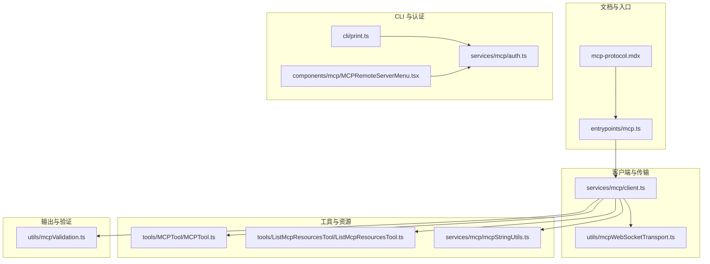
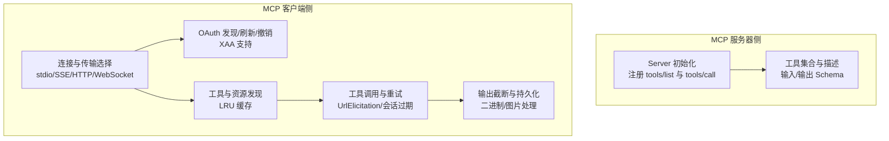
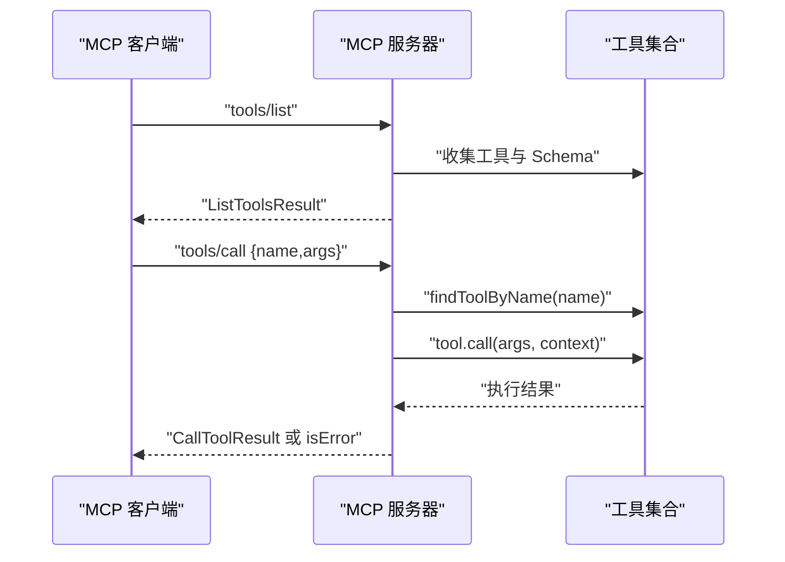
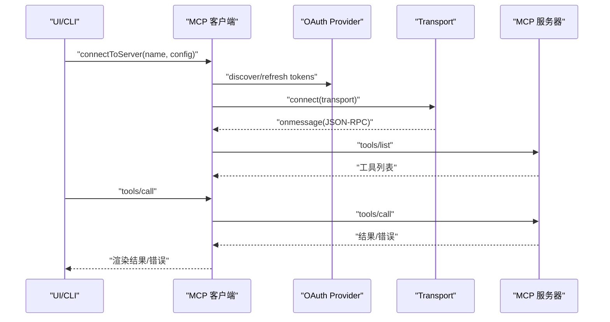
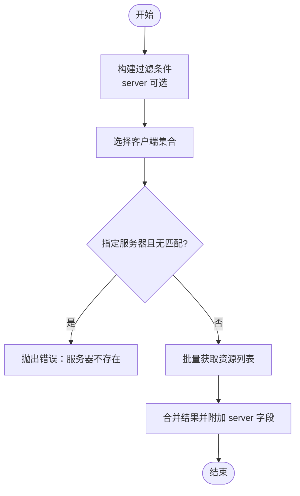
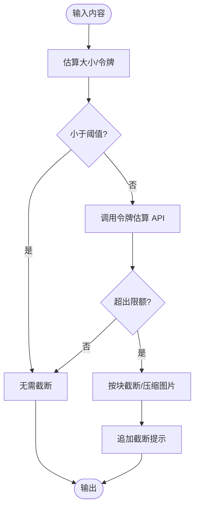
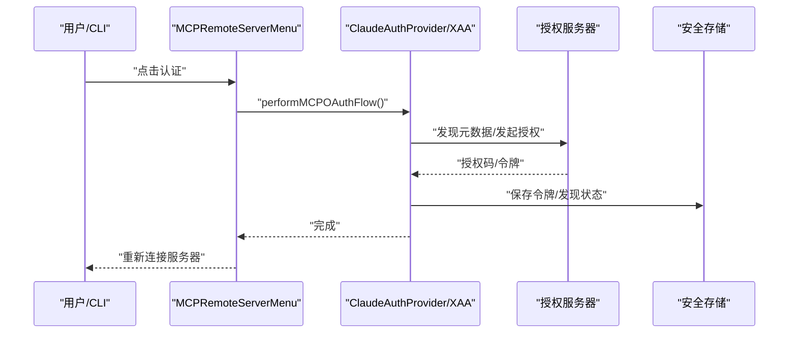
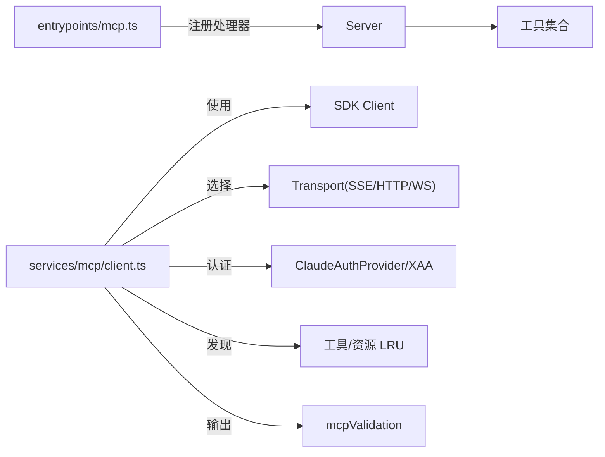

# MCP 协议规范

<cite>
**本文引用的文件**
- [mcp-protocol.mdx](file://docs/extensibility/mcp-protocol.mdx)
- [mcp.ts](file://src/entrypoints/mcp.ts)
- [client.ts](file://src/services/mcp/client.ts)
- [mcpStringUtils.ts](file://src/services/mcp/mcpStringUtils.ts)
- [mcpValidation.ts](file://src/utils/mcpValidation.ts)
- [mcpWebSocketTransport.ts](file://src/utils/mcpWebSocketTransport.ts)
- [MCPTool.ts](file://src/tools/MCPTool/MCPTool.ts)
- [ListMcpResourcesTool.ts](file://src/tools/ListMcpResourcesTool/ListMcpResourcesTool.ts)
- [print.ts](file://src/cli/print.ts)
- [MCPRemoteServerMenu.tsx](file://src/components/mcp/MCPRemoteServerMenu.tsx)
- [auth.ts](file://src/services/mcp/auth.ts)
</cite>

## 目录
1. [简介](#简介)
2. [项目结构](#项目结构)
3. [核心组件](#核心组件)
4. [架构总览](#架构总览)
5. [详细组件分析](#详细组件分析)
6. [依赖关系分析](#依赖关系分析)
7. [性能考量](#性能考量)
8. [故障排查指南](#故障排查指南)
9. [结论](#结论)
10. [附录](#附录)

## 简介
本文件面向 Claude Code Best 的 MCP（Model Context Protocol）集成，系统化梳理协议在代码中的实现形态与运行机制，覆盖协议版本与能力声明、消息格式与通信模式、握手与认证、错误处理、同步/异步交互、兼容性与版本演进、调试方法与示例。文档以仓库内现有实现为依据，不臆造未在代码中出现的功能。

## 项目结构
围绕 MCP 的实现主要分布在以下模块：
- 文档与概览：docs/extensibility/mcp-protocol.mdx
- MCP 服务器入口：src/entrypoints/mcp.ts
- MCP 客户端与传输层：src/services/mcp/client.ts、src/utils/mcpWebSocketTransport.ts
- 工具与资源发现：src/tools/MCPTool/MCPTool.ts、src/tools/ListMcpResourcesTool/ListMcpResourcesTool.ts
- 名称与前缀工具：src/services/mcp/mcpStringUtils.ts
- 输出截断与令牌估算：src/utils/mcpValidation.ts
- CLI 控制与 OAuth：src/cli/print.ts、src/components/mcp/MCPRemoteServerMenu.tsx、src/services/mcp/auth.ts

**图表来源**
- [mcp-protocol.mdx](file://docs/extensibility/mcp-protocol.mdx)
- [mcp.ts](file://src/entrypoints/mcp.ts)
- [client.ts](file://src/services/mcp/client.ts)
- [mcpWebSocketTransport.ts](file://src/utils/mcpWebSocketTransport.ts)
- [MCPTool.ts](file://src/tools/MCPTool/MCPTool.ts)
- [ListMcpResourcesTool.ts](file://src/tools/ListMcpResourcesTool/ListMcpResourcesTool.ts)
- [mcpStringUtils.ts](file://src/services/mcp/mcpStringUtils.ts)
- [mcpValidation.ts](file://src/utils/mcpValidation.ts)
- [print.ts](file://src/cli/print.ts)
- [MCPRemoteServerMenu.tsx](file://src/components/mcp/MCPRemoteServerMenu.tsx)
- [auth.ts](file://src/services/mcp/auth.ts)

**章节来源**
- [mcp-protocol.mdx](file://docs/extensibility/mcp-protocol.mdx)

## 核心组件
- MCP 服务器入口：负责初始化 Server、注册工具列表与调用处理器，暴露工具能力给 MCP 客户端。
- MCP 客户端：封装连接、传输选择、认证、工具发现与调用、错误处理与会话过期检测、输出截断与持久化。
- 传输层：支持 stdio、SSE、HTTP、WebSocket 等多种传输；WebSocketTransport 提供通用 WebSocket 适配。
- 工具与资源：MCPTool 作为统一工具包装；ListMcpResourcesTool 提供资源列举能力。
- 名称与前缀：mcpStringUtils 提供工具/命令命名与权限匹配所需的前缀与显示名处理。
- 输出验证：mcpValidation 提供输出大小估算、截断阈值与截断逻辑。
- CLI 与认证：CLI 控制台处理 OAuth 回调、清理认证、菜单触发认证流程；auth 提供 OAuth 发现、刷新、撤销与 XAA 支持。

**章节来源**
- [mcp.ts](file://src/entrypoints/mcp.ts)
- [client.ts](file://src/services/mcp/client.ts)
- [mcpWebSocketTransport.ts](file://src/utils/mcpWebSocketTransport.ts)
- [MCPTool.ts](file://src/tools/MCPTool/MCPTool.ts)
- [ListMcpResourcesTool.ts](file://src/tools/ListMcpResourcesTool/ListMcpResourcesTool.ts)
- [mcpStringUtils.ts](file://src/services/mcp/mcpStringUtils.ts)
- [mcpValidation.ts](file://src/utils/mcpValidation.ts)
- [print.ts](file://src/cli/print.ts)
- [MCPRemoteServerMenu.tsx](file://src/components/mcp/MCPRemoteServerMenu.tsx)
- [auth.ts](file://src/services/mcp/auth.ts)

## 架构总览
下图展示 MCP 服务器与客户端在代码中的交互关系与职责边界。

**图表来源**
- [mcp.ts](file://src/entrypoints/mcp.ts)
- [client.ts](file://src/services/mcp/client.ts)
- [auth.ts](file://src/services/mcp/auth.ts)
- [mcpValidation.ts](file://src/utils/mcpValidation.ts)

## 详细组件分析

### 服务器端：MCP 入口与能力声明
- 服务器初始化：设置 name/version/capabilities（工具能力），注册 tools/list 与 tools/call 请求处理器。
- 工具列表：遍历内置工具，转换输入/输出 Schema，生成描述文本，返回给客户端。
- 工具调用：根据名称查找工具，构造上下文，执行工具调用，返回文本或 JSON 内容；异常时记录并返回错误内容。

**图表来源**
- [mcp.ts](file://src/entrypoints/mcp.ts)

**章节来源**
- [mcp.ts](file://src/entrypoints/mcp.ts)

### 客户端：连接、传输与认证
- 连接与传输：根据配置分派到不同 Transport（stdio/SSE/HTTP/WebSocket），设置 User-Agent、自定义头、超时与步进检测。
- 认证：ClaudeAuthProvider 驱动 OAuth 发现、刷新与撤销；支持 XAA（跨应用访问）；远程传输在 401 时进入 needs-auth 状态并缓存。
- 工具发现：LRU 缓存工具与资源列表；工具名前缀与权限匹配基于 mcpStringUtils。
- 工具调用：带 UrlElicitation 重试、会话过期检测与自动重连、输出截断与二进制持久化。

**图表来源**
- [client.ts](file://src/services/mcp/client.ts)
- [auth.ts](file://src/services/mcp/auth.ts)
- [mcpWebSocketTransport.ts](file://src/utils/mcpWebSocketTransport.ts)

**章节来源**
- [client.ts](file://src/services/mcp/client.ts)
- [auth.ts](file://src/services/mcp/auth.ts)
- [mcpWebSocketTransport.ts](file://src/utils/mcpWebSocketTransport.ts)

### 工具与资源发现
- MCPTool：统一工具包装，权限检查行为为 passthrough，确保进入权限确认流程；显示名与前缀由 mcpStringUtils 管理。
- ListMcpResourcesTool：列举已连接服务器的资源，支持按服务器过滤；输出包含资源 URI、名称、MIME 类型与服务器标识。

**图表来源**
- [ListMcpResourcesTool.ts](file://src/tools/ListMcpResourcesTool/ListMcpResourcesTool.ts)
- [MCPTool.ts](file://src/tools/MCPTool/MCPTool.ts)
- [mcpStringUtils.ts](file://src/services/mcp/mcpStringUtils.ts)

**章节来源**
- [ListMcpResourcesTool.ts](file://src/tools/ListMcpResourcesTool/ListMcpResourcesTool.ts)
- [MCPTool.ts](file://src/tools/MCPTool/MCPTool.ts)
- [mcpStringUtils.ts](file://src/services/mcp/mcpStringUtils.ts)

### 输出截断与内容处理
- 令牌估算与截断阈值：基于内容大小启发式判断是否需要进一步计算令牌数；超过阈值则调用 API 估算，决定是否截断。
- 截断策略：字符串直接裁剪；富内容块按剩余字符逐块拼接，图片尝试压缩以适应剩余预算；最终追加截断提示信息。
- 二进制与图片：大输出通过持久化写入文件并返回路径；图片自动缩放与下采样。

**图表来源**
- [mcpValidation.ts](file://src/utils/mcpValidation.ts)

**章节来源**
- [mcpValidation.ts](file://src/utils/mcpValidation.ts)

### OAuth 与认证流程
- OAuth 发现与刷新：支持标准元数据发现与非标准错误体归一化；为每次请求创建独立超时信号，避免 AbortSignal GC 延迟问题。
- 令牌撤销：优先撤销刷新令牌，再撤销访问令牌；对非 RFC 7009 兼容服务器提供回退方案。
- XAA（跨应用访问）：单点 IdP 登录复用，执行 RFC 8693+jwt-bearer 交换，保存与常规 OAuth 相同的存储结构。
- UI/CLI 触发：菜单触发 OAuth 流程；CLI 支持清理认证与回调 URL 获取。

**图表来源**
- [MCPRemoteServerMenu.tsx](file://src/components/mcp/MCPRemoteServerMenu.tsx)
- [auth.ts](file://src/services/mcp/auth.ts)
- [print.ts](file://src/cli/print.ts)

**章节来源**
- [MCPRemoteServerMenu.tsx](file://src/components/mcp/MCPRemoteServerMenu.tsx)
- [auth.ts](file://src/services/mcp/auth.ts)
- [print.ts](file://src/cli/print.ts)

## 依赖关系分析
- 服务器端依赖：SDK Server、工具集合、消息与日志工具、模型与权限工具。
- 客户端依赖：SDK Client、多种 Transport、OAuth Provider、工具/资源发现缓存、输出验证与持久化工具。
- UI/CLI 依赖：认证菜单、OAuth 回调处理、连接状态与权限检查。

**图表来源**
- [mcp.ts](file://src/entrypoints/mcp.ts)
- [client.ts](file://src/services/mcp/client.ts)
- [auth.ts](file://src/services/mcp/auth.ts)
- [mcpValidation.ts](file://src/utils/mcpValidation.ts)

**章节来源**
- [mcp.ts](file://src/entrypoints/mcp.ts)
- [client.ts](file://src/services/mcp/client.ts)
- [auth.ts](file://src/services/mcp/auth.ts)
- [mcpValidation.ts](file://src/utils/mcpValidation.ts)

## 性能考量
- 连接缓存：connectToServer 使用 memoize 缓存，键为 name+config，连接关闭时清理工具/资源/连接缓存，避免重复建立。
- 请求超时：HTTP 请求使用独立超时定时器，避免 AbortSignal.timeout 的 GC 延迟导致原生内存占用。
- 并发控制：本地 stdio 服务器默认并发 3，远程 HTTP 服务器默认并发 20。
- 工具发现缓存：工具与资源发现使用 LRU（上限 20），降低重复查询成本。
- 输出截断：先启发式估算，必要时再调用 API，减少不必要的令牌估算开销。

**章节来源**
- [mcp-protocol.mdx](file://docs/extensibility/mcp-protocol.mdx)
- [client.ts](file://src/services/mcp/client.ts)

## 故障排查指南
- 401 Unauthorized 与 needs-auth：远程传输在 401 时进入 needs-auth 状态并写入 15 分钟 TTL 缓存，避免频繁弹窗；可通过 CLI 清理认证后重连。
- 会话过期：HTTP 传输检测到“Session not found”（404 + JSON-RPC -32001）时关闭传输并触发重连；工具调用层捕获 McpSessionExpiredError 自动重试一次。
- WebSocket 异常：WebSocketTransport 在错误/关闭事件中清理监听器并记录诊断日志；发送/启动前检查连接状态。
- OAuth 失败：分析 analytics 事件原因（如 metadata_discovery_failed、invalid_grant、token_exchange_failed 等）；必要时清理令牌并重新授权。
- CLI 控制：支持 mcp_oauth_callback_url、mcp_clear_auth 等控制消息，便于自动化与调试。

**章节来源**
- [client.ts](file://src/services/mcp/client.ts)
- [mcpWebSocketTransport.ts](file://src/utils/mcpWebSocketTransport.ts)
- [auth.ts](file://src/services/mcp/auth.ts)
- [print.ts](file://src/cli/print.ts)

## 结论
本规范基于仓库现有实现，明确了 MCP 在 Claude Code 中的服务器与客户端形态、传输与认证机制、工具与资源发现、输出处理与错误恢复策略。实际部署中应关注连接缓存、请求超时、并发控制与 OAuth 生命周期管理，结合 CLI 与 UI 的控制能力进行调试与运维。

## 附录

### 协议版本与能力
- 服务器能力：tools（工具能力）。
- 版本：由入口设置 name/version，具体版本号在构建宏中注入。

**章节来源**
- [mcp.ts](file://src/entrypoints/mcp.ts)

### 消息类型与处理
- 请求：tools/list、tools/call。
- 响应：ListToolsResult、CallToolResult（含 isError 标记与内容块）。
- 通知：由传输层承载 JSON-RPC 消息，客户端注册 onmessage/onerror/onclose 处理。

**章节来源**
- [mcp.ts](file://src/entrypoints/mcp.ts)
- [client.ts](file://src/services/mcp/client.ts)

### 传输层与认证矩阵
- stdio：本地子进程，无额外认证。
- SSE/HTTP：ClaudeAuthProvider + OAuth，支持 XAA。
- WebSocket：支持 Authorization 头（会话 ingress token 或自定义头）。
- SSE-IDE/WS-IDE：IDE 集成场景，使用 lockfile token 或 X-Claude-Code-Ide-Authorization。

**章节来源**
- [mcp-protocol.mdx](file://docs/extensibility/mcp-protocol.mdx)
- [client.ts](file://src/services/mcp/client.ts)
- [auth.ts](file://src/services/mcp/auth.ts)

### 同步与异步通信
- 同步：stdio 传输在进程内同步读写。
- 异步：SSE/HTTP/WebSocket 通过事件驱动与回调处理消息；客户端维护 onmessage/onerror/onclose。

**章节来源**
- [mcp-protocol.mdx](file://docs/extensibility/mcp-protocol.mdx)
- [mcpWebSocketTransport.ts](file://src/utils/mcpWebSocketTransport.ts)

### 兼容性与版本演进
- 代码中未显式声明 MCP 协议版本号；服务器能力声明为 tools。
- OAuth 与 XAA 支持体现了对多授权服务器与跨应用访问的兼容性增强。

**章节来源**
- [mcp.ts](file://src/entrypoints/mcp.ts)
- [auth.ts](file://src/services/mcp/auth.ts)

### 调试方法与示例
- 日志：使用 logMCPDebug/logMCPError 输出调试信息。
- CLI：支持 OAuth 回调 URL 获取与认证清理；菜单触发认证流程。
- 输出：工具调用返回文本或富内容块；错误结果携带 isError 与内容。

**章节来源**
- [client.ts](file://src/services/mcp/client.ts)
- [print.ts](file://src/cli/print.ts)
- [MCPRemoteServerMenu.tsx](file://src/components/mcp/MCPRemoteServerMenu.tsx)
- [mcp.ts](file://src/entrypoints/mcp.ts)