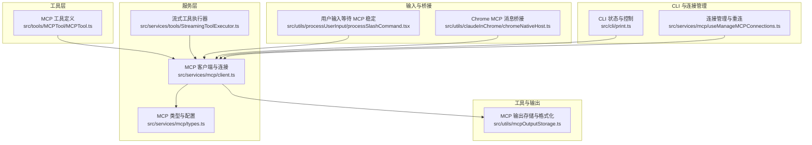
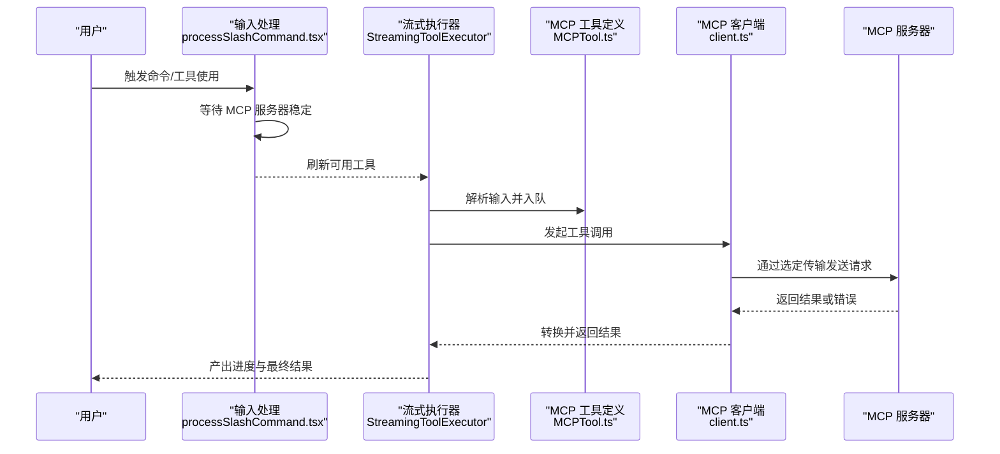
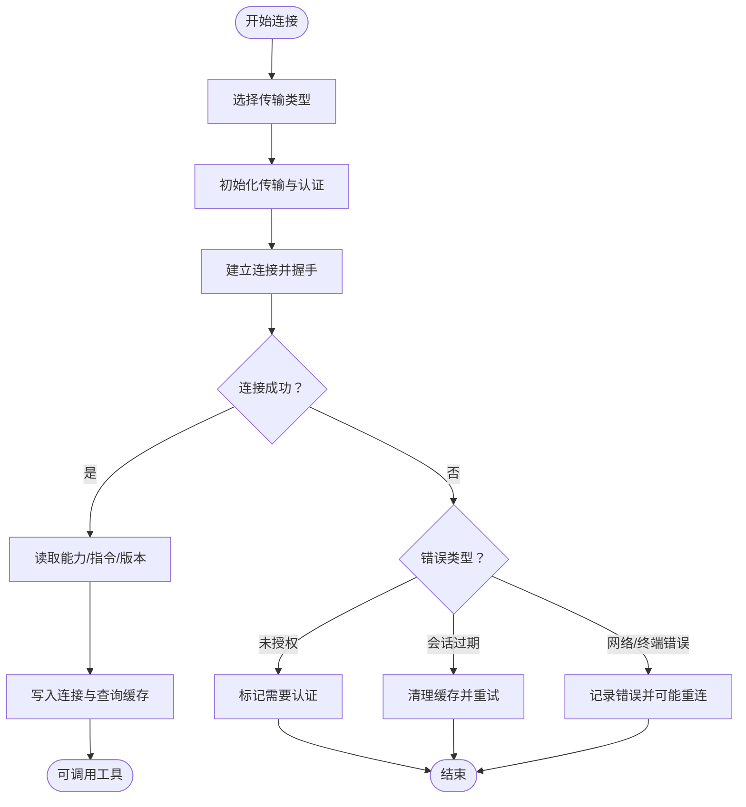
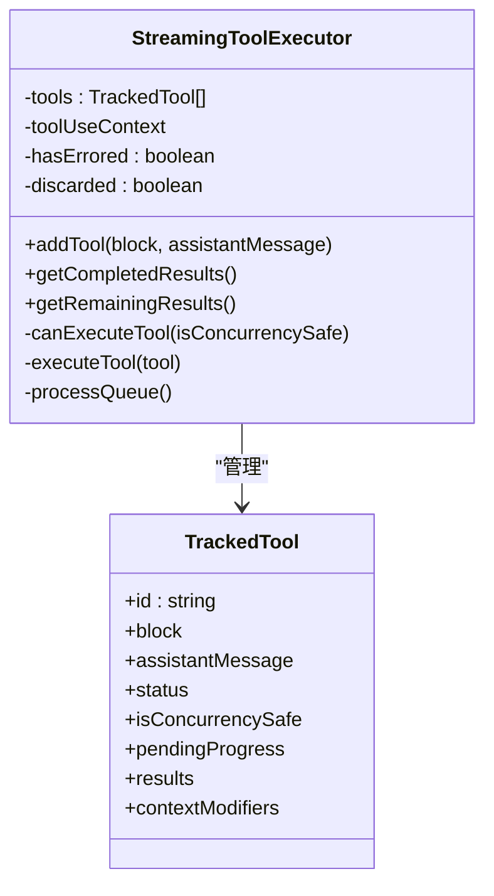
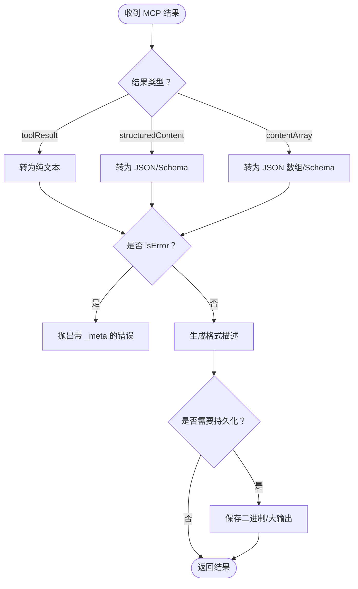
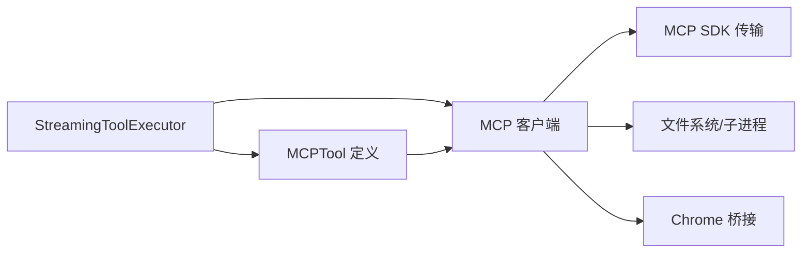

# MCP 工具调用

<cite>
**本文引用的文件**
- [src/services/mcp/client.ts](file://src/services/mcp/client.ts)
- [src/tools/MCPTool/MCPTool.ts](file://src/tools/MCPTool/MCPTool.ts)
- [src/services/tools/StreamingToolExecutor.ts](file://src/services/tools/StreamingToolExecutor.ts)
- [src/services/mcp/types.ts](file://src/services/mcp/types.ts)
- [src/utils/mcpOutputStorage.ts](file://src/utils/mcpOutputStorage.ts)
- [src/utils/processUserInput/processSlashCommand.tsx](file://src/utils/processUserInput/processSlashCommand.tsx)
- [src/utils/claudeInChrome/chromeNativeHost.ts](file://src/utils/claudeInChrome/chromeNativeHost.ts)
- [src/services/mcp/useManageMCPConnections.ts](file://src/services/mcp/useManageMCPConnections.ts)
- [src/cli/print.ts](file://src/cli/print.ts)
</cite>

## 目录
1. [简介](#简介)
2. [项目结构](#项目结构)
3. [核心组件](#核心组件)
4. [架构总览](#架构总览)
5. [详细组件分析](#详细组件分析)
6. [依赖关系分析](#依赖关系分析)
7. [性能考量](#性能考量)
8. [故障排查指南](#故障排查指南)
9. [结论](#结论)
10. [附录](#附录)

## 简介
本文件面向 Claude Code Best 的 MCP（Model Context Protocol）工具调用系统，系统性阐述从参数构建、请求发送到响应处理的完整流程；解释工具执行的生命周期（准备、执行、清理）；说明结果处理机制（数据转换、格式化、错误处理）；给出并发控制策略（队列管理、优先级调度、资源分配）；并提供监控与诊断方法及调用示例与性能优化建议。

## 项目结构
围绕 MCP 工具调用的关键模块分布如下：
- 服务端连接与工具发现：在服务层负责连接不同传输类型的 MCP 服务器、缓存连接、拉取工具/命令/资源，并将 MCP 能力映射为内部工具定义。
- 工具定义与调用：MCP 工具在运行时动态生成，调用路径由服务层封装，最终通过 MCP 客户端发起工具调用。
- 流式执行器：对工具调用进行排队、并发控制、进度与结果产出、中断与取消。
- 类型与配置：统一的 MCP 配置类型、连接状态类型与序列化结构。
- 输出存储与格式化：对 MCP 结果进行格式描述、二进制内容持久化等。
- 输入处理与桥接：用户输入触发的等待 MCP 服务器稳定、通知转发至 Chrome MCP 客户端等。
- 连接管理：重连、禁用切换、批量连接与批大小控制。

图表来源
- [src/services/mcp/client.ts](file://src/services/mcp/client.ts)
- [src/tools/MCPTool/MCPTool.ts](file://src/tools/MCPTool/MCPTool.ts)
- [src/services/tools/StreamingToolExecutor.ts](file://src/services/tools/StreamingToolExecutor.ts)
- [src/services/mcp/types.ts](file://src/services/mcp/types.ts)
- [src/utils/mcpOutputStorage.ts](file://src/utils/mcpOutputStorage.ts)
- [src/utils/processUserInput/processSlashCommand.tsx](file://src/utils/processUserInput/processSlashCommand.tsx)
- [src/utils/claudeInChrome/chromeNativeHost.ts](file://src/utils/claudeInChrome/chromeNativeHost.ts)
- [src/cli/print.ts](file://src/cli/print.ts)
- [src/services/mcp/useManageMCPConnections.ts](file://src/services/mcp/useManageMCPConnections.ts)

章节来源
- [src/services/mcp/client.ts](file://src/services/mcp/client.ts)
- [src/tools/MCPTool/MCPTool.ts](file://src/tools/MCPTool/MCPTool.ts)
- [src/services/tools/StreamingToolExecutor.ts](file://src/services/tools/StreamingToolExecutor.ts)
- [src/services/mcp/types.ts](file://src/services/mcp/types.ts)
- [src/utils/mcpOutputStorage.ts](file://src/utils/mcpOutputStorage.ts)
- [src/utils/processUserInput/processSlashCommand.tsx](file://src/utils/processUserInput/processSlashCommand.tsx)
- [src/utils/claudeInChrome/chromeNativeHost.ts](file://src/utils/claudeInChrome/chromeNativeHost.ts)
- [src/cli/print.ts](file://src/cli/print.ts)
- [src/services/mcp/useManageMCPConnections.ts](file://src/services/mcp/useManageMCPConnections.ts)

## 核心组件
- MCP 客户端与连接管理：负责选择传输（stdio/SSE/HTTP/WebSocket/SDK/代理）、建立连接、超时与错误处理、能力探测、缓存失效与重连、清理资源。
- MCP 工具定义：动态生成工具，注入 MCP 服务器与工具名、权限检查、并发安全提示、只读/破坏性/开放世界等注解。
- 流式工具执行器：维护工具队列，按并发安全策略执行，支持进度消息立即产出、中断与取消、上下文修改累积。
- 类型与配置：统一的服务器配置类型、连接状态类型、序列化结构，确保跨模块一致性。
- 输出存储与格式化：根据结果类型生成格式描述，必要时持久化二进制内容。
- 输入处理与桥接：等待 MCP 服务器稳定后再刷新工具列表；向 Chrome MCP 客户端转发工具响应与通知。
- CLI 与连接管理：批量连接、重连、禁用切换、通道启用等。

章节来源
- [src/services/mcp/client.ts](file://src/services/mcp/client.ts)
- [src/tools/MCPTool/MCPTool.ts](file://src/tools/MCPTool/MCPTool.ts)
- [src/services/tools/StreamingToolExecutor.ts](file://src/services/tools/StreamingToolExecutor.ts)
- [src/services/mcp/types.ts](file://src/services/mcp/types.ts)
- [src/utils/mcpOutputStorage.ts](file://src/utils/mcpOutputStorage.ts)
- [src/utils/processUserInput/processSlashCommand.tsx](file://src/utils/processUserInput/processSlashCommand.tsx)
- [src/utils/claudeInChrome/chromeNativeHost.ts](file://src/utils/claudeInChrome/chromeNativeHost.ts)
- [src/cli/print.ts](file://src/cli/print.ts)
- [src/services/mcp/useManageMCPConnections.ts](file://src/services/mcp/useManageMCPConnections.ts)

## 架构总览
下图展示 MCP 工具调用从“用户输入”到“结果产出”的关键交互：

图表来源
- [src/utils/processUserInput/processSlashCommand.tsx](file://src/utils/processUserInput/processSlashCommand.tsx)
- [src/services/tools/StreamingToolExecutor.ts](file://src/services/tools/StreamingToolExecutor.ts)
- [src/tools/MCPTool/MCPTool.ts](file://src/tools/MCPTool/MCPTool.ts)
- [src/services/mcp/client.ts](file://src/services/mcp/client.ts)

## 详细组件分析

### 组件一：MCP 客户端与连接管理
- 传输选择与初始化：根据配置类型选择 SSE/HTTP/WebSocket/STDIO/SDK/代理传输，设置认证、超时、代理、头部、用户代理等。
- 连接超时与错误分类：统一超时与错误处理，区分未授权、会话过期、终端错误等，触发缓存清理与重连。
- 能力探测与缓存：连接后读取服务器能力、指令、版本，限制描述长度，注册默认请求处理器，缓存连接与工具/资源/命令列表。
- 工具/命令/资源获取：将 MCP 工具映射为内部工具定义，注入并发安全、只读、破坏性、开放世界等属性；命令映射为内部命令；资源支持时补充资源工具。
- 会话恢复与重试：检测会话过期错误时清理缓存并重试一次；包装 SDK 错误以便遥测识别。
- 清理与关闭：针对不同传输类型进行进程终止、连接关闭、缓存清理，避免资源泄漏。

图表来源
- [src/services/mcp/client.ts](file://src/services/mcp/client.ts)

章节来源
- [src/services/mcp/client.ts](file://src/services/mcp/client.ts)

### 组件二：MCP 工具定义与动态生成
- 动态命名与元数据：根据服务器名与工具名构建全限定名，注入搜索提示、是否始终加载、只读/破坏性/开放世界等注解。
- 并发安全与只读：依据 MCP 注解推断工具是否并发安全与只读，用于执行器的队列与并发策略。
- 权限与可见性：提供权限检查与用户可见名称，支持跳过前缀以覆盖内置工具。
- 输入编码：将工具输入编码为自动模式分类器输入，便于安全策略评估。

章节来源
- [src/tools/MCPTool/MCPTool.ts](file://src/tools/MCPTool/MCPTool.ts)
- [src/services/mcp/client.ts](file://src/services/mcp/client.ts)

### 组件三：流式工具执行器（并发控制与生命周期）
- 生命周期
  - 准备阶段：解析输入、判断并发安全、入队。
  - 执行阶段：按并发策略启动工具，收集进度与结果，处理兄弟工具错误传播与中断行为。
  - 清理阶段：标记完成、更新上下文、释放资源。
- 并发控制
  - 并发安全：仅当当前无执行中工具，或全部执行中工具均为并发安全时，才允许非并发安全工具进入执行。
  - 非并发工具独占：非并发安全工具会阻塞后续工具，直至其完成。
- 进度与结果
  - 进度消息立即产出，保证用户体验。
  - 结果按到达顺序产出，非并发工具阻塞后续工具。
- 中断与取消
  - 支持用户中断、兄弟工具错误导致的级联取消、流式回退丢弃。
  - 子 AbortController 传播到父链路，确保查询循环正确结束回合。

图表来源
- [src/services/tools/StreamingToolExecutor.ts](file://src/services/tools/StreamingToolExecutor.ts)

章节来源
- [src/services/tools/StreamingToolExecutor.ts](file://src/services/tools/StreamingToolExecutor.ts)

### 组件四：结果处理与格式化
- 结果类型与转换：支持纯文本、结构化内容、内容数组等类型，按 MCP 规范进行转换与校验。
- 错误处理：捕获工具返回的错误，提取内容或错误字段，构造带 _meta 的错误对象，便于上层处理。
- 格式描述：根据结果类型与 schema 生成人类可读的格式描述，辅助用户理解输出。
- 大输出与二进制：对大输出进行截断与提示，必要时持久化二进制内容并生成消息。

图表来源
- [src/services/mcp/client.ts](file://src/services/mcp/client.ts)
- [src/utils/mcpOutputStorage.ts](file://src/utils/mcpOutputStorage.ts)

章节来源
- [src/services/mcp/client.ts](file://src/services/mcp/client.ts)
- [src/utils/mcpOutputStorage.ts](file://src/utils/mcpOutputStorage.ts)

### 组件五：输入处理与桥接
- 用户输入等待 MCP 稳定：在启动阶段轮询等待“待定”客户端清空，避免工具列表过早刷新导致不一致。
- Chrome MCP 桥接：将工具响应与通知转发给已连接的 MCP 客户端，处理长度前缀与缓冲区拼接，限制最大消息大小。

章节来源
- [src/utils/processUserInput/processSlashCommand.tsx](file://src/utils/processUserInput/processSlashCommand.tsx)
- [src/utils/claudeInChrome/chromeNativeHost.ts](file://src/utils/claudeInChrome/chromeNativeHost.ts)

### 组件六：CLI 与连接管理
- CLI 控制：在 CLI 中注册与重新连接 MCP 服务器，处理通道启用、鉴权等控制请求。
- 连接管理：暴露重连与启用/禁用切换函数，内部管理定时器与状态，避免重复连接。

章节来源
- [src/cli/print.ts](file://src/cli/print.ts)
- [src/services/mcp/useManageMCPConnections.ts](file://src/services/mcp/useManageMCPConnections.ts)

## 依赖关系分析
- 模块耦合
  - 流式执行器依赖工具定义与上下文，但不直接依赖具体传输细节。
  - MCP 客户端集中处理传输、认证、缓存与错误分类，向上提供统一的工具调用接口。
  - 工具定义依赖 MCP 客户端提供的能力与注解，形成“能力驱动”的工具生成。
- 外部依赖
  - MCP SDK 客户端与传输实现（SSE/HTTP/WebSocket/STDIO/SDK/代理）。
  - 文件系统与子进程（STDIO 传输），用于本地服务器的进程管理与清理。
  - Chrome 桥接模块，用于将工具响应与通知转发给外部客户端。

图表来源
- [src/services/tools/StreamingToolExecutor.ts](file://src/services/tools/StreamingToolExecutor.ts)
- [src/tools/MCPTool/MCPTool.ts](file://src/tools/MCPTool/MCPTool.ts)
- [src/services/mcp/client.ts](file://src/services/mcp/client.ts)
- [src/utils/claudeInChrome/chromeNativeHost.ts](file://src/utils/claudeInChrome/chromeNativeHost.ts)

章节来源
- [src/services/tools/StreamingToolExecutor.ts](file://src/services/tools/StreamingToolExecutor.ts)
- [src/tools/MCPTool/MCPTool.ts](file://src/tools/MCPTool/MCPTool.ts)
- [src/services/mcp/client.ts](file://src/services/mcp/client.ts)
- [src/utils/claudeInChrome/chromeNativeHost.ts](file://src/utils/claudeInChrome/chromeNativeHost.ts)

## 性能考量
- 连接批处理与并发
  - 使用分批连接与并发映射（pMap）替代固定边界串行批次，提升慢服务器占用槽位时的整体吞吐。
  - 本地服务器（STDIO/SDK）采用较低并发，远程服务器采用较高并发，避免进程/网络资源争用。
- 缓存与去重
  - 连接与查询结果缓存（LRU），减少重复连接与重复拉取成本。
  - 认证失败缓存（15 分钟），避免频繁探测无令牌服务器。
- 超时与健壮性
  - 请求级超时（60 秒）与连接级超时（默认 30 秒），防止长时间挂起。
  - 对 SSE/HTTP 传输的终端错误进行统计与自动重连，提升稳定性。
- 输出与内存
  - 大输出截断与二进制持久化，避免内存膨胀。
  - 进度消息即时产出，降低等待延迟。

## 故障排查指南
- 连接失败
  - 未授权：检查认证头/令牌，查看“需要认证”状态并触发鉴权流程。
  - 会话过期：捕获 404 + JSON-RPC -32001，清理缓存后重试。
  - 终端错误：ECONNRESET/ETIMEDOUT/EPIPE/EHOSTUNREACH 等，记录错误并尝试重连。
- 工具调用超时
  - 默认工具超时约 27.8 小时，可通过环境变量调整；若仍超时，检查服务器性能与网络。
- 结果错误
  - 工具返回 isError 时，提取内容或错误字段，结合 _meta 获取上下文信息。
- 进程清理
  - STDIO 传输采用 SIGINT → SIGTERM → SIGKILL 三级清理，确保进程退出。
- Chrome 桥接
  - 检查长度前缀与缓冲区拼接逻辑，限制最大消息大小，避免异常断开。

章节来源
- [src/services/mcp/client.ts](file://src/services/mcp/client.ts)
- [src/utils/claudeInChrome/chromeNativeHost.ts](file://src/utils/claudeInChrome/chromeNativeHost.ts)

## 结论
该系统通过“传输无关”的 MCP 客户端抽象、动态工具生成与流式执行器，实现了高可靠、高性能的 MCP 工具调用。并发控制与错误处理策略兼顾了易用性与稳定性，配合完善的监控与诊断手段，能够满足复杂场景下的工具集成需求。

## 附录

### 调用示例（步骤说明）
- 准备阶段
  - 等待 MCP 服务器稳定：在用户输入处理中轮询“待定”客户端，直到无待定状态再刷新工具。
  - 连接与能力探测：客户端根据配置选择传输，建立连接并读取能力、指令与版本。
- 执行阶段
  - 入队与并发判定：执行器根据工具并发安全属性决定是否立即执行或等待。
  - 工具调用：客户端调用 MCP 工具，设置进度回调与超时，接收结果或错误。
- 清理阶段
  - 进度与结果产出：进度消息即时产出，完成后按序产出结果并更新上下文。
  - 资源清理：关闭连接、清理缓存、终止子进程（如适用）。

章节来源
- [src/utils/processUserInput/processSlashCommand.tsx](file://src/utils/processUserInput/processSlashCommand.tsx)
- [src/services/mcp/client.ts](file://src/services/mcp/client.ts)
- [src/services/tools/StreamingToolExecutor.ts](file://src/services/tools/StreamingToolExecutor.ts)