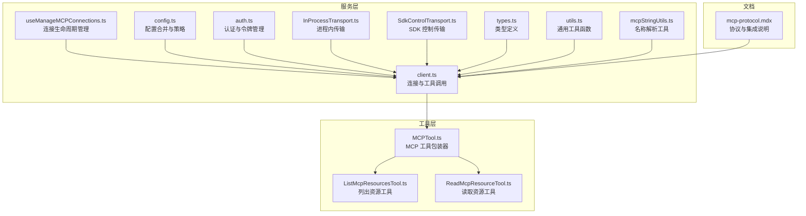
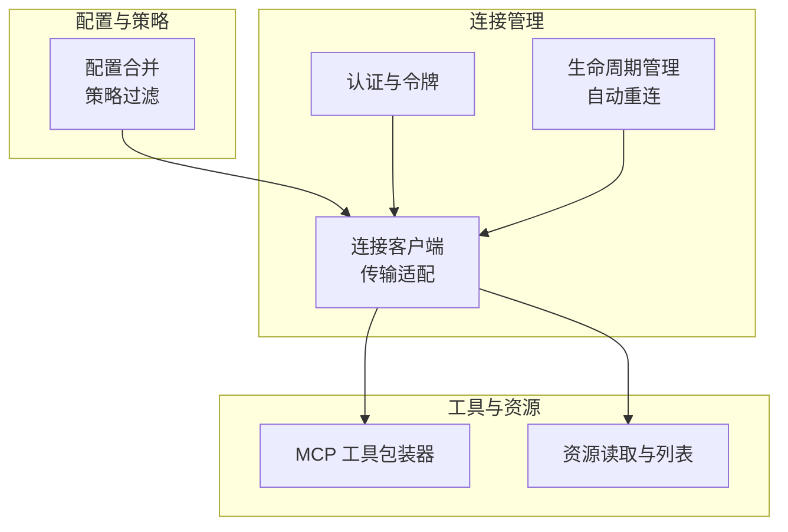
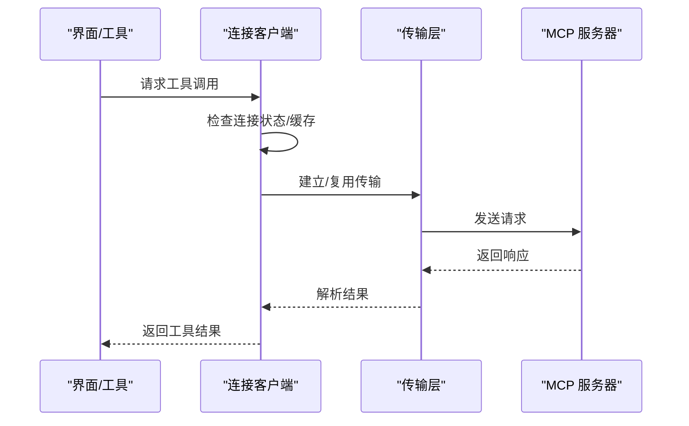
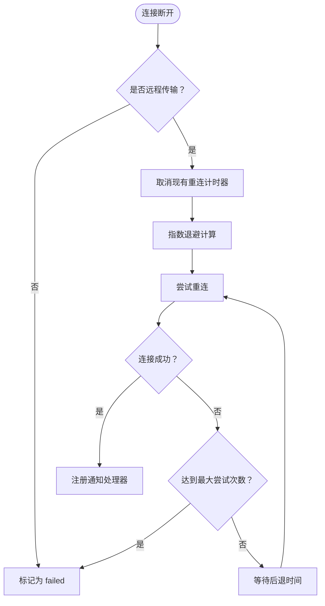
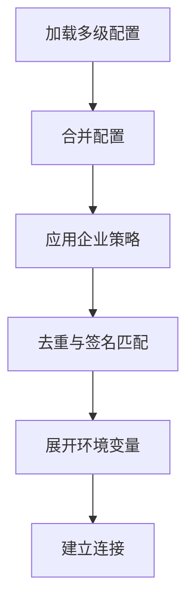
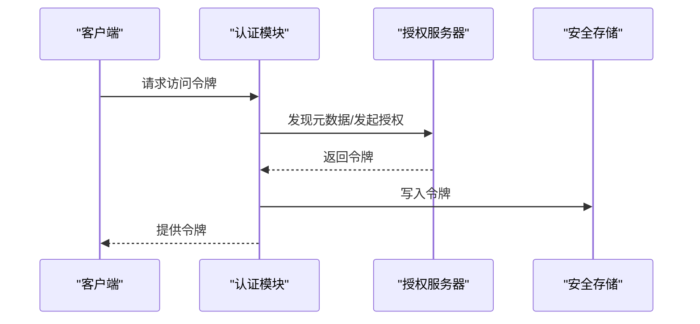
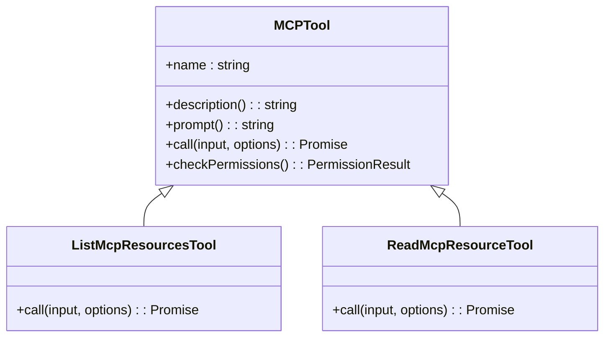
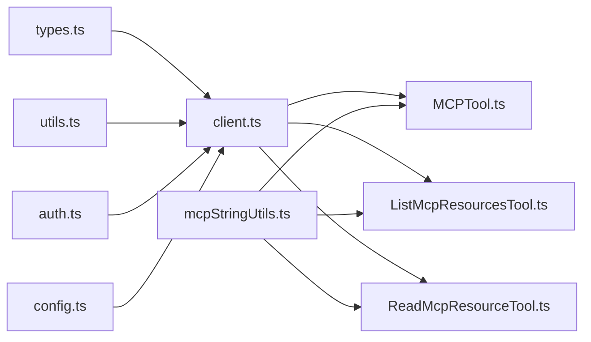

# MCP 工具集成

<cite>
**本文引用的文件**
- [client.ts](file://src/services/mcp/client.ts)
- [useManageMCPConnections.ts](file://src/services/mcp/useManageMCPConnections.ts)
- [config.ts](file://src/services/mcp/config.ts)
- [auth.ts](file://src/services/mcp/auth.ts)
- [types.ts](file://src/services/mcp/types.ts)
- [utils.ts](file://src/services/mcp/utils.ts)
- [InProcessTransport.ts](file://src/services/mcp/InProcessTransport.ts)
- [SdkControlTransport.ts](file://src/services/mcp/SdkControlTransport.ts)
- [mcpStringUtils.ts](file://src/services/mcp/mcpStringUtils.ts)
- [MCPTool.ts](file://src/tools/MCPTool/MCPTool.ts)
- [ListMcpResourcesTool.ts](file://src/tools/ListMcpResourcesTool/ListMcpResourcesTool.ts)
- [ReadMcpResourceTool.ts](file://src/tools/ReadMcpResourceTool/ReadMcpResourceTool.ts)
- [mcp-protocol.mdx](file://docs/extensibility/mcp-protocol.mdx)
</cite>

## 目录
1. [简介](#简介)
2. [项目结构](#项目结构)
3. [核心组件](#核心组件)
4. [架构总览](#架构总览)
5. [详细组件分析](#详细组件分析)
6. [依赖关系分析](#依赖关系分析)
7. [性能考虑](#性能考虑)
8. [故障排除指南](#故障排除指南)
9. [结论](#结论)
10. [附录](#附录)

## 简介
本文件面向 Claude Code Best 的 MCP（Model Context Protocol）工具集成系统，提供从底层协议实现到上层工具调用的完整技术文档。内容涵盖：
- MCP 协议集成架构：协议规范、传输机制与认证方式
- MCP 工具的发现与注册：资源列表获取、工具元数据解析与动态加载
- MCP 服务器连接管理：连接建立、心跳维护与断线重连策略
- MCP 工具调用流程：请求格式、参数传递与响应处理
- MCP 服务器配置指南：服务器发现、权限设置与性能优化
- 具体集成示例与故障排除方法

## 项目结构
MCP 集成相关代码主要分布在以下模块：
- 服务层：连接管理、配置解析、认证与传输封装
- 工具层：MCP 工具包装器与资源读取工具
- 类型与工具函数：统一的类型定义与字符串处理工具
- 文档：协议说明与集成要点

**图表来源**
- [client.ts](file://src/services/mcp/client.ts)
- [useManageMCPConnections.ts](file://src/services/mcp/useManageMCPConnections.ts)
- [config.ts](file://src/services/mcp/config.ts)
- [auth.ts](file://src/services/mcp/auth.ts)
- [InProcessTransport.ts](file://src/services/mcp/InProcessTransport.ts)
- [SdkControlTransport.ts](file://src/services/mcp/SdkControlTransport.ts)
- [types.ts](file://src/services/mcp/types.ts)
- [utils.ts](file://src/services/mcp/utils.ts)
- [mcpStringUtils.ts](file://src/services/mcp/mcpStringUtils.ts)
- [MCPTool.ts](file://src/tools/MCPTool/MCPTool.ts)
- [ListMcpResourcesTool.ts](file://src/tools/ListMcpResourcesTool/ListMcpResourcesTool.ts)
- [ReadMcpResourceTool.ts](file://src/tools/ReadMcpResourceTool/ReadMcpResourceTool.ts)
- [mcp-protocol.mdx](file://docs/extensibility/mcp-protocol.mdx)

**章节来源**
- [mcp-protocol.mdx](file://docs/extensibility/mcp-protocol.mdx)

## 核心组件
- 连接客户端与传输层：封装 @modelcontextprotocol/sdk 的 Client，支持 stdio、SSE、HTTP、WebSocket、SDK、IDE 等多种传输，并提供连接缓存与超时控制。
- 连接生命周期管理：React Hook 管理服务器连接状态、自动重连、通知处理与批量状态更新。
- 配置系统：合并用户/项目/本地/企业等多级配置，支持策略过滤、去重与签名匹配。
- 认证与令牌：OAuth 发现、令牌刷新、跨应用访问（XAA）、令牌撤销与安全存储。
- 工具与资源：MCP 工具包装器、资源列表与读取工具，支持二进制内容持久化与输出截断处理。

**章节来源**
- [client.ts](file://src/services/mcp/client.ts)
- [useManageMCPConnections.ts](file://src/services/mcp/useManageMCPConnections.ts)
- [config.ts](file://src/services/mcp/config.ts)
- [auth.ts](file://src/services/mcp/auth.ts)
- [types.ts](file://src/services/mcp/types.ts)
- [utils.ts](file://src/services/mcp/utils.ts)
- [mcpStringUtils.ts](file://src/services/mcp/mcpStringUtils.ts)
- [MCPTool.ts](file://src/tools/MCPTool/MCPTool.ts)
- [ListMcpResourcesTool.ts](file://src/tools/ListMcpResourcesTool/ListMcpResourcesTool.ts)
- [ReadMcpResourceTool.ts](file://src/tools/ReadMcpResourceTool/ReadMcpResourceTool.ts)

## 架构总览
MCP 集成采用“配置驱动 + 生命周期管理 + 多传输适配”的架构模式：
- 配置层：合并多源配置，应用企业策略，生成可连接的服务器集合。
- 连接层：按类型选择传输，建立连接，处理认证失败与会话过期，缓存连接以提升性能。
- 工具层：发现工具与资源，动态包装为统一工具接口，支持权限检查与 UI 渲染。
- 工具调用：标准化请求格式，处理错误与进度反馈，输出结果持久化与截断处理。

**图表来源**
- [client.ts](file://src/services/mcp/client.ts)
- [useManageMCPConnections.ts](file://src/services/mcp/useManageMCPConnections.ts)
- [config.ts](file://src/services/mcp/config.ts)
- [auth.ts](file://src/services/mcp/auth.ts)
- [MCPTool.ts](file://src/tools/MCPTool/MCPTool.ts)
- [ListMcpResourcesTool.ts](file://src/tools/ListMcpResourcesTool/ListMcpResourcesTool.ts)
- [ReadMcpResourceTool.ts](file://src/tools/ReadMcpResourceTool/ReadMcpResourceTool.ts)

## 详细组件分析

### 连接客户端与传输层
- 传输类型分发：根据配置类型选择 SSE、HTTP、WebSocket、stdio、SDK 或 IDE 传输；每个传输封装了连接、发送与关闭逻辑。
- 连接缓存与超时：使用 memoize 缓存连接，避免重复建立；对请求设置独立超时信号，防止单次超时信号失效导致后续请求失败。
- 代理与 TLS：支持 HTTP/WS 代理与 mTLS 配置，确保在受限网络环境下的稳定连接。
- 会话与错误处理：识别会话过期错误，触发重连或重新认证；对工具调用中的错误进行分类与上报。

**图表来源**
- [client.ts](file://src/services/mcp/client.ts)
- [InProcessTransport.ts](file://src/services/mcp/InProcessTransport.ts)
- [SdkControlTransport.ts](file://src/services/mcp/SdkControlTransport.ts)

**章节来源**
- [client.ts](file://src/services/mcp/client.ts)
- [InProcessTransport.ts](file://src/services/mcp/InProcessTransport.ts)
- [SdkControlTransport.ts](file://src/services/mcp/SdkControlTransport.ts)

### 连接生命周期管理
- 批量状态更新：通过定时器聚合连接事件，减少频繁的状态更新开销。
- 自动重连：对远程传输（非 stdio/sdK）启用指数退避重连，支持取消与最大尝试次数限制。
- 通知处理：注册工具/提示/资源变更通知处理器，实现增量更新与技能索引清理。
- 通道权限：在特定特性开启时，注册通道消息与权限通知处理器，支持权限回调与去重提示。

**图表来源**
- [useManageMCPConnections.ts](file://src/services/mcp/useManageMCPConnections.ts)

**章节来源**
- [useManageMCPConnections.ts](file://src/services/mcp/useManageMCPConnections.ts)

### 配置系统与策略
- 多级配置合并：优先级为项目/本地 > 用户 > 企业 > claude.ai > 动态注入，最终写入 .mcp.json。
- 企业策略：允许/拒绝列表支持名称、命令行与 URL 模式匹配；CLI 与 SDK 输入点分别应用策略过滤。
- 去重与签名：基于命令数组或 URL（去除代理路径）生成签名，避免插件与手动配置重复。
- 环境变量展开：在连接前对配置中的环境变量进行展开，缺失变量记录以便诊断。

**图表来源**
- [config.ts](file://src/services/mcp/config.ts)

**章节来源**
- [config.ts](file://src/services/mcp/config.ts)

### 认证与令牌管理
- OAuth 发现与刷新：支持标准 OAuth 流程与非标准错误码归一化；提供令牌撤销与安全存储。
- 跨应用访问（XAA）：通过 IdP 一次性登录，交换 AS 令牌，统一存储与刷新。
- 步进式认证：支持保留发现状态与作用域，减少重复探测成本。
- 401 处理：在连接与代理请求中统一处理 401，触发缓存与重试逻辑。

**图表来源**
- [auth.ts](file://src/services/mcp/auth.ts)

**章节来源**
- [auth.ts](file://src/services/mcp/auth.ts)

### 工具与资源管理
- 工具发现：通过 tools/list 获取工具清单，包装为统一工具接口，支持权限检查与 UI 渲染。
- 资源管理：通过 resources/list 获取资源列表，支持按服务器过滤与读取；二进制内容自动持久化并替换为文件路径。
- 名称解析：提供 MCP 工具/命令名称解析与显示名提取，支持权限规则匹配。

**图表来源**
- [MCPTool.ts](file://src/tools/MCPTool/MCPTool.ts)
- [ListMcpResourcesTool.ts](file://src/tools/ListMcpResourcesTool/ListMcpResourcesTool.ts)
- [ReadMcpResourceTool.ts](file://src/tools/ReadMcpResourceTool/ReadMcpResourceTool.ts)

**章节来源**
- [MCPTool.ts](file://src/tools/MCPTool/MCPTool.ts)
- [ListMcpResourcesTool.ts](file://src/tools/ListMcpResourcesTool/ListMcpResourcesTool.ts)
- [ReadMcpResourceTool.ts](file://src/tools/ReadMcpResourceTool/ReadMcpResourceTool.ts)
- [mcpStringUtils.ts](file://src/services/mcp/mcpStringUtils.ts)

## 依赖关系分析
- 组件耦合：连接客户端依赖传输层、认证模块与配置系统；工具层依赖连接客户端与工具字符串工具。
- 外部依赖：@modelcontextprotocol/sdk 提供协议实现；lodash-es 用于缓存与映射；ws/axios 等用于传输与网络请求。
- 循环依赖规避：通过延迟求值与模块拆分避免循环导入。

**图表来源**
- [types.ts](file://src/services/mcp/types.ts)
- [client.ts](file://src/services/mcp/client.ts)
- [auth.ts](file://src/services/mcp/auth.ts)
- [config.ts](file://src/services/mcp/config.ts)
- [utils.ts](file://src/services/mcp/utils.ts)
- [mcpStringUtils.ts](file://src/services/mcp/mcpStringUtils.ts)
- [MCPTool.ts](file://src/tools/MCPTool/MCPTool.ts)
- [ListMcpResourcesTool.ts](file://src/tools/ListMcpResourcesTool/ListMcpResourcesTool.ts)
- [ReadMcpResourceTool.ts](file://src/tools/ReadMcpResourceTool/ReadMcpResourceTool.ts)

**章节来源**
- [client.ts](file://src/services/mcp/client.ts)
- [types.ts](file://src/services/mcp/types.ts)
- [utils.ts](file://src/services/mcp/utils.ts)
- [mcpStringUtils.ts](file://src/services/mcp/mcpStringUtils.ts)
- [MCPTool.ts](file://src/tools/MCPTool/MCPTool.ts)
- [ListMcpResourcesTool.ts](file://src/tools/ListMcpResourcesTool/ListMcpResourcesTool.ts)
- [ReadMcpResourceTool.ts](file://src/tools/ReadMcpResourceTool/ReadMcpResourceTool.ts)

## 性能考虑
- 连接缓存：使用 memoize 缓存连接，避免重复建立；连接键包含配置哈希，确保配置变更时重建连接。
- 请求超时：对非 GET 请求设置独立超时信号，防止单次超时信号失效；GET 请求（SSE 流）不应用超时。
- 批量更新：生命周期管理中使用定时器聚合状态更新，降低频繁渲染与状态写入的成本。
- 并发控制：工具调用支持并发安全，资源读取工具对各服务器并行拉取，失败不影响整体结果。
- 输出截断：对长输出进行行截断检测，避免上下文溢出。

[本节为通用性能建议，无需具体文件引用]

## 故障排除指南
- 连接失败与认证问题
  - 检查服务器类型与传输配置是否正确；确认代理与 TLS 设置。
  - 若出现 401，查看认证缓存与令牌状态，必要时清除缓存并重新认证。
  - 对于 claude.ai 代理，确认 OAuth 令牌有效并支持重试。
- 断线与重连
  - 确认自动重连策略已启用（非 stdio/sdK）；检查指数退避参数与最大尝试次数。
  - 查看连接日志与事件统计，定位重连失败原因。
- 工具调用错误
  - 检查工具名称前缀与服务器命名规范化；确认工具清单缓存未过期。
  - 对返回 isError 的结果，提取 _meta 字段进行诊断。
- 资源读取异常
  - 确认服务器具备 resources 能力；检查 URI 是否存在且可访问。
  - 二进制内容保存失败时，检查磁盘权限与 MIME 类型。

**章节来源**
- [client.ts](file://src/services/mcp/client.ts)
- [useManageMCPConnections.ts](file://src/services/mcp/useManageMCPConnections.ts)
- [auth.ts](file://src/services/mcp/auth.ts)
- [ListMcpResourcesTool.ts](file://src/tools/ListMcpResourcesTool/ListMcpResourcesTool.ts)
- [ReadMcpResourceTool.ts](file://src/tools/ReadMcpResourceTool/ReadMcpResourceTool.ts)

## 结论
Claude Code Best 的 MCP 工具集成系统通过清晰的分层设计与完善的生命周期管理，实现了对多传输、多认证场景的稳健支持。其配置驱动与策略过滤机制确保了在复杂企业环境中的可控性，而连接缓存与批量更新等性能优化则保障了用户体验。配合工具与资源的动态发现与包装，系统能够灵活扩展并满足多样化的工具调用需求。

[本节为总结性内容，无需具体文件引用]

## 附录

### MCP 协议与传输规范
- 传输类型：stdio、SSE、HTTP、WebSocket、SDK、IDE（sse-ide、ws-ide）。
- 认证方式：OAuth 发现与令牌管理、跨应用访问（XAA）、步进式认证。
- 请求格式：遵循 MCP 协议规范，工具调用通过统一的 Client.request 接口发送。

**章节来源**
- [client.ts](file://src/services/mcp/client.ts)
- [types.ts](file://src/services/mcp/types.ts)
- [auth.ts](file://src/services/mcp/auth.ts)

### 工具调用流程
- 请求准备：构建工具输入参数，确保名称前缀与规范化一致。
- 发送请求：通过连接客户端的 Client.request 发送 JSON-RPC 请求。
- 响应处理：解析结果，处理二进制内容持久化与输出截断，捕获错误并上报。

**章节来源**
- [client.ts](file://src/services/mcp/client.ts)
- [MCPTool.ts](file://src/tools/MCPTool/MCPTool.ts)
- [ReadMcpResourceTool.ts](file://src/tools/ReadMcpResourceTool/ReadMcpResourceTool.ts)

### 配置与权限设置
- 服务器添加与移除：支持多级配置写入与验证，应用企业策略过滤。
- 权限策略：允许/拒绝列表支持名称、命令行与 URL 模式匹配；CLI 与 SDK 输入点分别处理。
- 环境变量：在连接前展开配置中的环境变量，缺失变量记录以便诊断。

**章节来源**
- [config.ts](file://src/services/mcp/config.ts)
- [mcp-protocol.mdx](file://docs/extensibility/mcp-protocol.mdx)