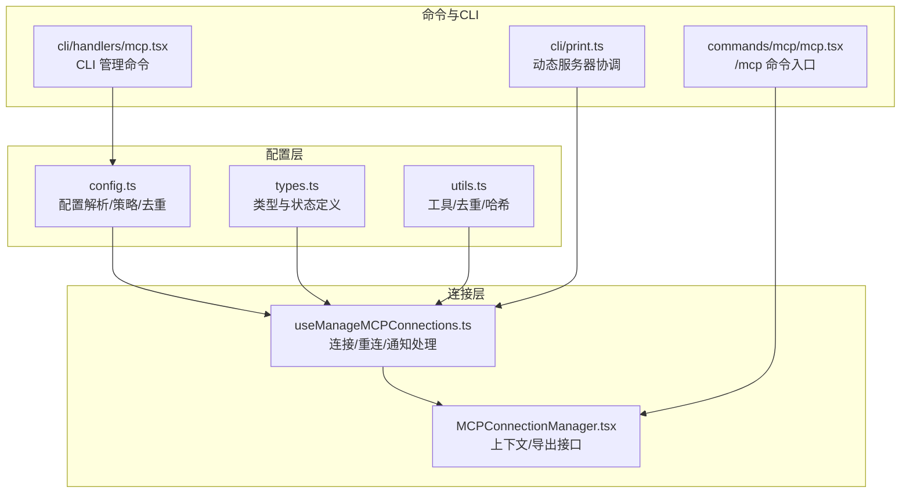
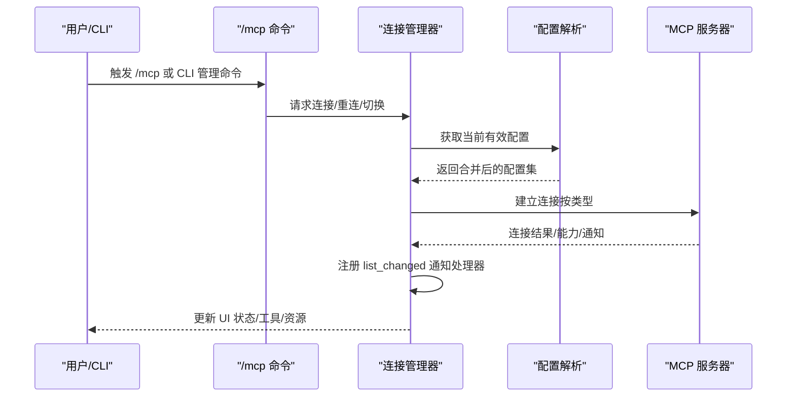
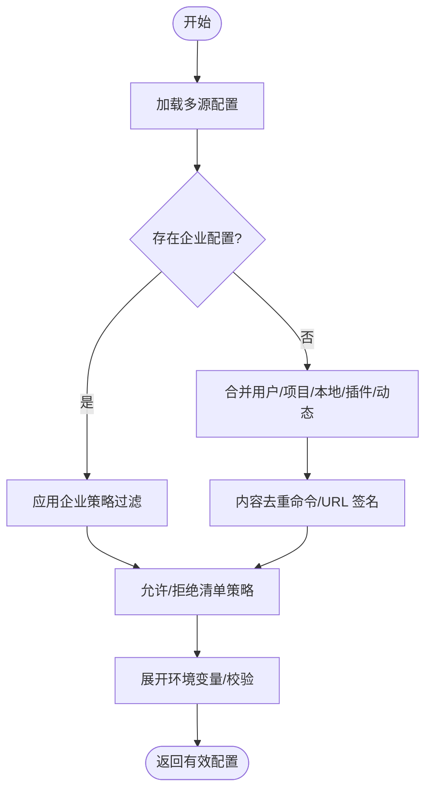
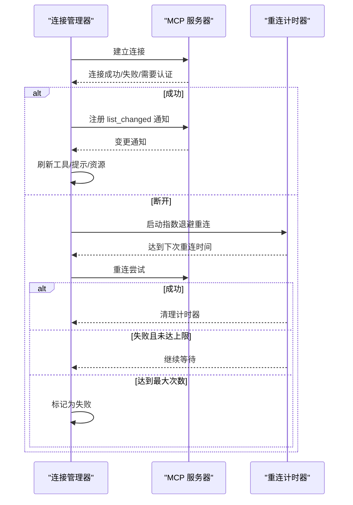
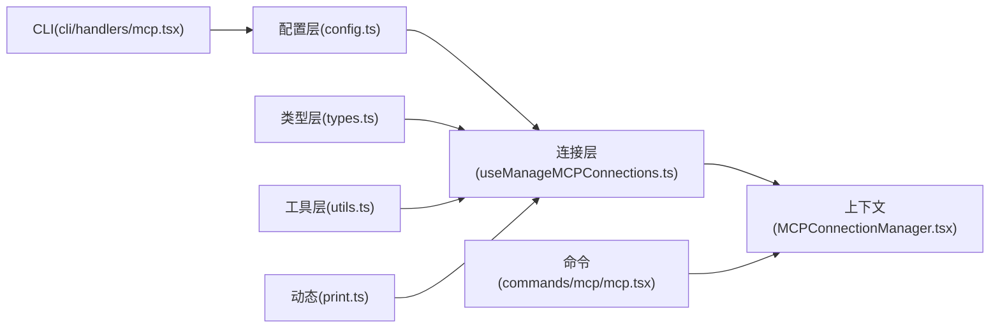

# MCP 服务器管理

<cite>
**本文引用的文件**
- [config.ts](file://src/services/mcp/config.ts)
- [types.ts](file://src/services/mcp/types.ts)
- [utils.ts](file://src/services/mcp/utils.ts)
- [useManageMCPConnections.ts](file://src/services/mcp/useManageMCPConnections.ts)
- [MCPConnectionManager.tsx](file://src/services/mcp/MCPConnectionManager.tsx)
- [mcp.tsx](file://src/commands/mcp/mcp.tsx)
- [mcp.tsx](file://src/cli/handlers/mcp.tsx)
- [print.ts](file://src/cli/print.ts)
</cite>

## 目录
1. [简介](#简介)
2. [项目结构](#项目结构)
3. [核心组件](#核心组件)
4. [架构总览](#架构总览)
5. [详细组件分析](#详细组件分析)
6. [依赖关系分析](#依赖关系分析)
7. [性能考量](#性能考量)
8. [故障排除指南](#故障排除指南)
9. [结论](#结论)
10. [附录](#附录)

## 简介
本文件面向 Claude Code Best 的 MCP（Model Context Protocol）服务器管理系统，系统性阐述以下主题：
- 服务器发现与注册：如何从多源配置加载、合并与去重，以及企业级策略过滤。
- 连接管理：连接建立、状态监控、自动重连与断线处理。
- 配置管理：连接参数、环境变量展开、超时与重试策略。
- 权限控制：访问授权、资源限制与安全策略（含企业策略、通道权限等）。
- 故障排除与性能优化：常见问题定位、日志与调试技巧、性能建议。
- 配置示例与管理命令：基于仓库实现的配置格式与 CLI 操作。

## 项目结构
围绕 MCP 的核心代码主要分布在以下模块：
- 配置解析与策略：src/services/mcp/config.ts
- 类型定义与状态：src/services/mcp/types.ts
- 工具函数与去重：src/services/mcp/utils.ts
- 连接生命周期与自动重连：src/services/mcp/useManageMCPConnections.ts
- UI 上下文与导出接口：src/services/mcp/MCPConnectionManager.tsx
- 命令入口与交互：src/commands/mcp/mcp.tsx
- CLI 管理命令：src/cli/handlers/mcp.tsx
- 动态服务器协调与应用：src/cli/print.ts

**图表来源**
- [config.ts:1071-1251](file://src/services/mcp/config.ts#L1071-L1251)
- [types.ts:180-227](file://src/services/mcp/types.ts#L180-L227)
- [utils.ts:185-224](file://src/services/mcp/utils.ts#L185-L224)
- [useManageMCPConnections.ts:143-146](file://src/services/mcp/useManageMCPConnections.ts#L143-L146)
- [MCPConnectionManager.tsx:54-74](file://src/services/mcp/MCPConnectionManager.tsx#L54-L74)
- [mcp.tsx:60-105](file://src/commands/mcp/mcp.tsx#L60-L105)
- [mcp.tsx:236-254](file://src/cli/handlers/mcp.tsx#L236-L254)
- [print.ts:5448-5481](file://src/cli/print.ts#L5448-L5481)

**章节来源**
- [config.ts:1071-1251](file://src/services/mcp/config.ts#L1071-L1251)
- [types.ts:180-227](file://src/services/mcp/types.ts#L180-L227)
- [utils.ts:185-224](file://src/services/mcp/utils.ts#L185-L224)
- [useManageMCPConnections.ts:143-146](file://src/services/mcp/useManageMCPConnections.ts#L143-L146)
- [MCPConnectionManager.tsx:54-74](file://src/services/mcp/MCPConnectionManager.tsx#L54-L74)
- [mcp.tsx:60-105](file://src/commands/mcp/mcp.tsx#L60-L105)
- [mcp.tsx:236-254](file://src/cli/handlers/mcp.tsx#L236-L254)
- [print.ts:5448-5481](file://src/cli/print.ts#L5448-L5481)

## 核心组件
- 配置与策略
  - 多源配置加载：用户、项目、本地、企业、插件、动态等来源合并与优先级。
  - 企业策略：允许/拒绝清单、名称/命令/URL 匹配、托管策略开关。
  - 去重与签名：基于命令数组或 URL（含代理 URL 解包）的去重逻辑。
- 连接与状态
  - 连接状态模型：已连接、失败、需要认证、待定、禁用。
  - 自动重连：指数退避、最大尝试次数、断线回调与取消。
  - 通知处理：工具/提示/资源变更通知，按能力声明注册。
- UI 与命令
  - /mcp 命令入口与切换启用/禁用。
  - CLI 管理命令：添加、删除、查看、健康检查。
  - 动态服务器协调：与 SDK 控制消息同步，增删改一致性。

**章节来源**
- [config.ts:357-508](file://src/services/mcp/config.ts#L357-L508)
- [types.ts:180-227](file://src/services/mcp/types.ts#L180-L227)
- [useManageMCPConnections.ts:87-91](file://src/services/mcp/useManageMCPConnections.ts#L87-L91)
- [mcp.tsx:60-105](file://src/commands/mcp/mcp.tsx#L60-L105)
- [mcp.tsx:236-254](file://src/cli/handlers/mcp.tsx#L236-L254)
- [print.ts:5448-5481](file://src/cli/print.ts#L5448-L5481)

## 架构总览
MCP 管理系统采用“配置驱动 + 生命周期管理 + 事件通知”的分层架构：
- 配置层负责解析、验证、策略过滤与去重；
- 连接层负责建立连接、维护状态、自动重连与通知；
- UI 层通过命令与上下文暴露操作接口；
- CLI 与 SDK 作为外部入口参与动态配置同步。

**图表来源**
- [useManageMCPConnections.ts:310-763](file://src/services/mcp/useManageMCPConnections.ts#L310-L763)
- [config.ts:1071-1251](file://src/services/mcp/config.ts#L1071-L1251)
- [mcp.tsx:60-105](file://src/commands/mcp/mcp.tsx#L60-L105)

## 详细组件分析

### 组件一：服务器发现与注册（配置与策略）
- 发现流程
  - 企业配置优先：若存在企业 MCP 配置，仅使用企业配置并应用策略过滤。
  - 其他来源：用户、项目、本地、插件、动态合并；插件服务器命名空间化避免键冲突。
  - 内容去重：基于命令数组或 URL（含代理 URL 解包）签名，手动配置优先于插件与 claude.ai 连接器。
- 策略过滤
  - 拒绝清单：支持名称、命令、URL 三种维度匹配。
  - 允许清单：支持名称、命令、URL 三种维度匹配；空允许清单默认阻断。
  - 托管策略：可强制仅来自托管设置的允许清单。
- 环境变量展开与校验
  - 对命令/URL/头信息进行环境变量展开，并报告缺失变量。
  - Windows 下 npx 使用需 cmd 包装的警告。
- 服务器状态与启用控制
  - 默认内置服务器需显式启用；普通服务器可通过禁用列表控制。

**图表来源**
- [config.ts:1071-1251](file://src/services/mcp/config.ts#L1071-L1251)
- [config.ts:223-310](file://src/services/mcp/config.ts#L223-L310)
- [config.ts:357-508](file://src/services/mcp/config.ts#L357-L508)
- [config.ts:556-616](file://src/services/mcp/config.ts#L556-L616)

**章节来源**
- [config.ts:1071-1251](file://src/services/mcp/config.ts#L1071-L1251)
- [config.ts:223-310](file://src/services/mcp/config.ts#L223-L310)
- [config.ts:357-508](file://src/services/mcp/config.ts#L357-L508)
- [config.ts:556-616](file://src/services/mcp/config.ts#L556-L616)

### 组件二：服务器连接管理（建立、监控与断线处理）
- 连接状态模型
  - 已连接、失败、需要认证、待定、禁用。
- 连接建立与回调
  - 成功后注册提示词/工具/资源变更通知处理器。
  - 注册通道消息与权限通知处理器（受能力与策略门控）。
- 断线与自动重连
  - 仅远程传输（非 stdio/sd）触发自动重连。
  - 指数退避（初始 1s，上限 30s），最多 5 次尝试。
  - 断开时清理缓存，若服务器被禁用则停止重连。
- 批量状态更新
  - 将多个服务器更新在 16ms 时间窗口内批量写入状态，降低抖动。

**图表来源**
- [useManageMCPConnections.ts:333-468](file://src/services/mcp/useManageMCPConnections.ts#L333-L468)
- [useManageMCPConnections.ts:87-91](file://src/services/mcp/useManageMCPConnections.ts#L87-L91)

**章节来源**
- [types.ts:180-227](file://src/services/mcp/types.ts#L180-L227)
- [useManageMCPConnections.ts:310-763](file://src/services/mcp/useManageMCPConnections.ts#L310-L763)
- [MCPConnectionManager.tsx:54-74](file://src/services/mcp/MCPConnectionManager.tsx#L54-L74)

### 组件三：服务器配置管理（参数、超时与重试）
- 配置类型
  - 支持 stdio、sse、http、ws、sdk、claudeai-proxy 等传输类型。
  - OAuth 配置（客户端 ID、回调端口、元数据 URL、跨应用访问标记）。
- 参数与校验
  - 命令行参数、URL、头信息、OAuth 字段均进行严格校验。
  - 环境变量展开与缺失变量告警。
- 超时与重试
  - 自动重连采用指数退避与最大尝试次数，适用于远程传输。
  - 本地进程（stdio）与内部传输（sdk）不自动重连。

**章节来源**
- [types.ts:28-122](file://src/services/mcp/types.ts#L28-L122)
- [config.ts:556-616](file://src/services/mcp/config.ts#L556-L616)
- [useManageMCPConnections.ts:87-91](file://src/services/mcp/useManageMCPConnections.ts#L87-L91)

### 组件四：权限控制（访问授权、资源限制与安全策略）
- 企业策略
  - 拒绝/允许清单：名称、命令、URL 三类匹配；允许清单为空时默认阻断。
  - 托管策略：仅从托管设置读取允许清单。
- 通道权限
  - 基于能力声明与会话/市场策略门控注册通道消息与权限通知。
  - 不同阻断原因（禁用、认证、策略、市场、白名单）给出差异化提示。
- 安全与合规
  - URL 代理路径识别与原始 URL 提取，确保策略匹配正确。
  - 日志安全：记录 URL 时去除查询参数与尾随斜杠。

**章节来源**
- [config.ts:357-508](file://src/services/mcp/config.ts#L357-L508)
- [config.ts:182-193](file://src/services/mcp/config.ts#L182-L193)
- [useManageMCPConnections.ts:473-614](file://src/services/mcp/useManageMCPConnections.ts#L473-L614)
- [utils.ts:561-575](file://src/services/mcp/utils.ts#L561-L575)

### 组件五：动态服务器协调与应用
- 动态配置变更
  - 通过 SDK 控制消息或后台安装插件触发动态服务器变更。
  - 按名称集合计算新增、移除与替换，保证幂等与一致性。
- 配置哈希与去滞留
  - 基于稳定序列化的配置哈希判断是否需要断开并重建连接。
  - 移除过期插件服务器，避免“幽灵”工具残留。

**章节来源**
- [print.ts:5448-5481](file://src/cli/print.ts#L5448-L5481)
- [utils.ts:157-224](file://src/services/mcp/utils.ts#L157-L224)

## 依赖关系分析
- 组件耦合
  - 连接层依赖配置层提供的有效配置与策略过滤结果。
  - UI 层通过上下文暴露重连与切换接口，降低对底层细节的耦合。
- 外部依赖
  - 通道权限依赖会话与市场策略门控；OAuth 依赖服务端元数据。
- 潜在循环
  - 配置层与连接层通过状态更新形成单向依赖，无直接循环。

**图表来源**
- [config.ts:1071-1251](file://src/services/mcp/config.ts#L1071-L1251)
- [useManageMCPConnections.ts:143-146](file://src/services/mcp/useManageMCPConnections.ts#L143-L146)
- [MCPConnectionManager.tsx:54-74](file://src/services/mcp/MCPConnectionManager.tsx#L54-L74)
- [mcp.tsx:60-105](file://src/commands/mcp/mcp.tsx#L60-L105)
- [mcp.tsx:236-254](file://src/cli/handlers/mcp.tsx#L236-L254)
- [print.ts:5448-5481](file://src/cli/print.ts#L5448-L5481)

**章节来源**
- [config.ts:1071-1251](file://src/services/mcp/config.ts#L1071-L1251)
- [useManageMCPConnections.ts:143-146](file://src/services/mcp/useManageMCPConnections.ts#L143-L146)
- [MCPConnectionManager.tsx:54-74](file://src/services/mcp/MCPConnectionManager.tsx#L54-L74)
- [mcp.tsx:60-105](file://src/commands/mcp/mcp.tsx#L60-L105)
- [mcp.tsx:236-254](file://src/cli/handlers/mcp.tsx#L236-L254)
- [print.ts:5448-5481](file://src/cli/print.ts#L5448-L5481)

## 性能考量
- 批量状态更新：16ms 时间窗口聚合多次连接回调，减少 UI 抖动。
- 缓存与去重：工具/命令/资源缓存配合失效策略，避免重复拉取。
- 去重与签名：基于命令/URL 的签名去重，减少重复连接与资源浪费。
- 重连退避：指数退避与上限控制，避免风暴式重试。
- I/O 优化：网络请求与文件读取尽量并行与缓存，减少阻塞。

[本节为通用指导，无需特定文件来源]

## 故障排除指南
- 常见问题
  - 无法连接：检查服务器 URL/头信息/认证；查看“需要认证”状态并完成授权。
  - 连接频繁断开：确认是否为远程传输，观察自动重连日志；检查网络与服务器稳定性。
  - 工具/提示/资源未更新：确认服务器具备对应能力声明；检查通知处理是否注册。
  - 企业策略阻断：核对允许/拒绝清单与托管策略；必要时调整策略或联系管理员。
- 调试与日志
  - 使用 --debug 输出 MCP 相关日志，关注重连、失败与通知处理。
  - 查看 CLI 健康检查输出，定位具体错误。
- 诊断步骤
  - 使用 CLI 查看服务器状态与来源范围。
  - 在 UI 中切换启用/禁用，观察状态变化。
  - 清理缓存后重连，确认配置变更生效。

**章节来源**
- [mcp.tsx:236-254](file://src/cli/handlers/mcp.tsx#L236-L254)
- [useManageMCPConnections.ts:333-468](file://src/services/mcp/useManageMCPConnections.ts#L333-L468)

## 结论
该 MCP 服务器管理系统以“配置驱动 + 生命周期管理 + 事件通知”为核心，实现了从配置解析、策略过滤、去重合并到连接建立、状态监控与自动重连的完整闭环。通过严格的类型约束、企业策略与通道权限门控，系统在功能扩展与安全性之间取得平衡。结合批量状态更新与缓存策略，系统在复杂场景下仍保持良好的性能与可用性。

[本节为总结，无需特定文件来源]

## 附录

### 配置示例与管理命令
- 配置文件位置与范围
  - 用户配置：全局配置文件
  - 项目配置：工作目录下的 .mcp.json
  - 本地配置：项目私有配置（与用户配置组合）
  - 企业配置：组织托管配置（独占控制）
  - 插件与动态配置：插件注入与运行时动态配置
- 管理命令
  - /mcp：打开 MCP 设置界面；支持启用/禁用与重连子命令。
  - CLI 管理命令：查看服务器详情与健康状态。
- 动态服务器协调
  - 通过 SDK 控制消息或后台安装插件触发动态配置变更，系统自动增删改并保持一致性。

**章节来源**
- [utils.ts:259-280](file://src/services/mcp/utils.ts#L259-L280)
- [mcp.tsx:60-105](file://src/commands/mcp/mcp.tsx#L60-L105)
- [mcp.tsx:236-254](file://src/cli/handlers/mcp.tsx#L236-L254)
- [print.ts:5448-5481](file://src/cli/print.ts#L5448-L5481)