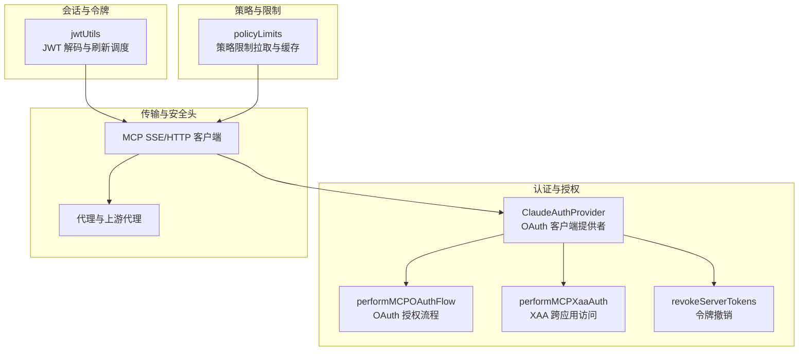
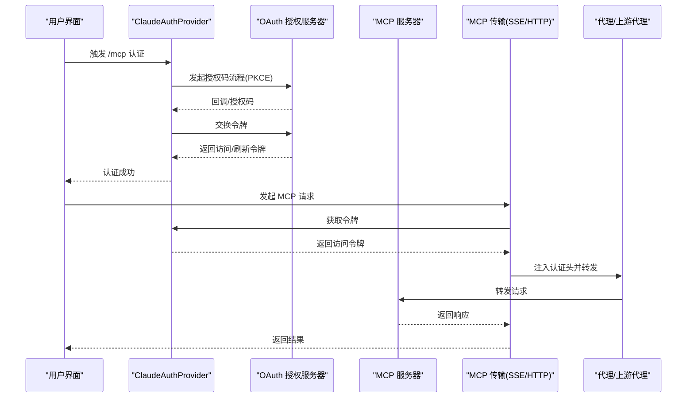
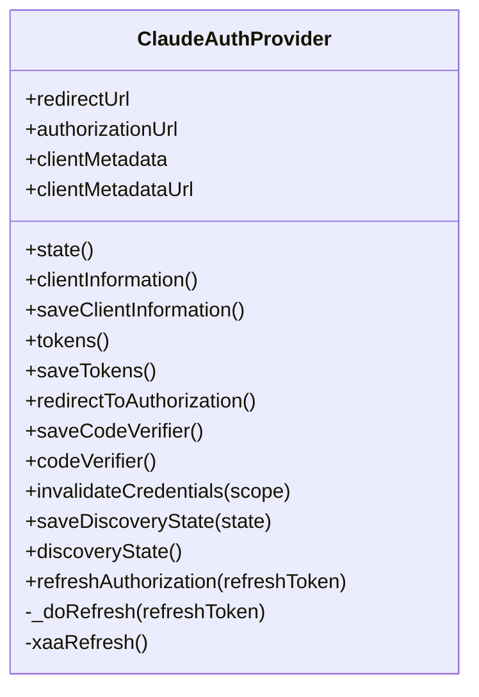
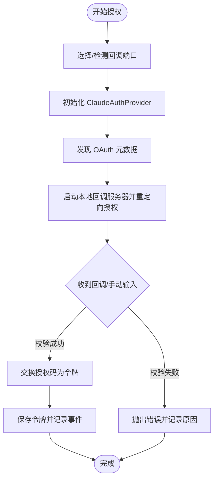
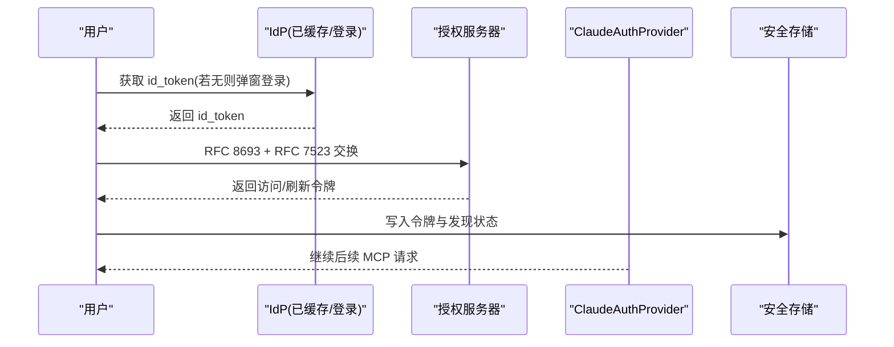
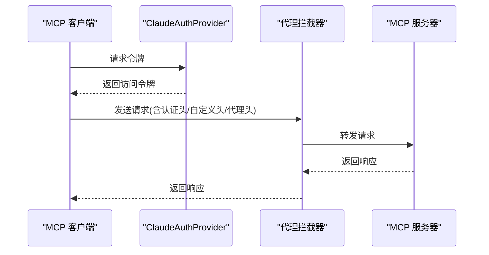
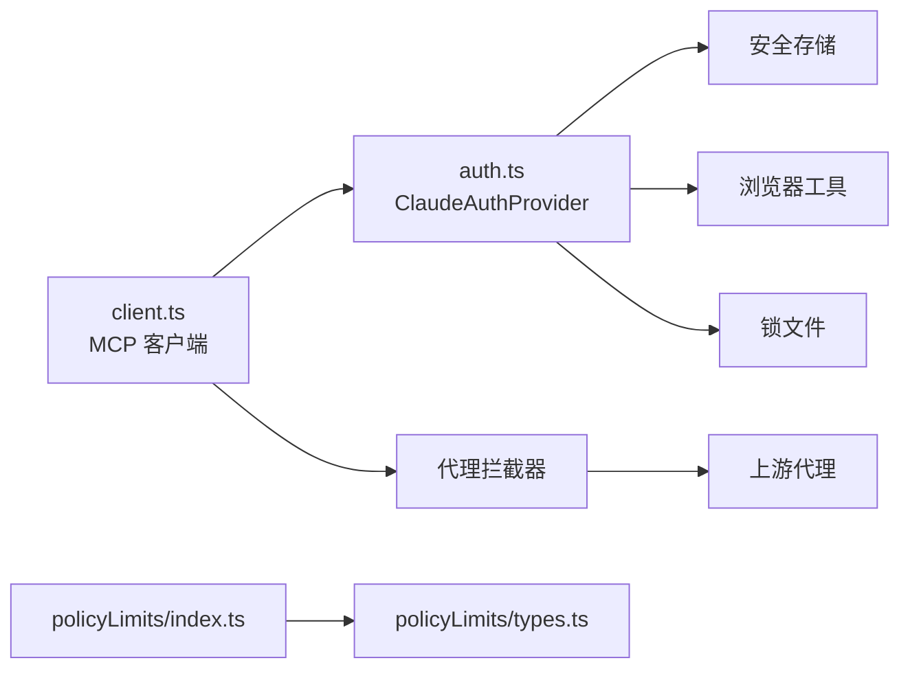

# MCP 认证与安全

<cite>
**本文引用的文件**
- [src/services/mcp/auth.ts](file://src/services/mcp/auth.ts)
- [src/services/mcp/oauthPort.ts](file://src/services/mcp/oauthPort.ts)
- [src/bridge/jwtUtils.ts](file://src/bridge/jwtUtils.ts)
- [src/services/mcp/client.ts](file://src/services/mcp/client.ts)
- [src/services/policyLimits/index.ts](file://src/services/policyLimits/index.ts)
- [src/services/policyLimits/types.ts](file://src/services/policyLimits/types.ts)
- [src/commands/security-review.ts](file://src/commands/security-review.ts)
- [src/services/api/client.ts](file://src/services/api/client.ts)
- [src/upstreamproxy/upstreamproxy.ts](file://src/upstreamproxy/upstreamproxy.ts)
- [src/utils/proxy.ts](file://src/utils/proxy.ts)
</cite>

## 目录
1. [简介](#简介)
2. [项目结构](#项目结构)
3. [核心组件](#核心组件)
4. [架构总览](#架构总览)
5. [详细组件分析](#详细组件分析)
6. [依赖关系分析](#依赖关系分析)
7. [性能考量](#性能考量)
8. [故障排查指南](#故障排查指南)
9. [结论](#结论)
10. [附录](#附录)

## 简介
本文件面向 Claude Code 的 MCP（Model Context Protocol）认证与安全体系，系统性阐述其认证机制（OAuth 集成、API 密钥管理、会话令牌）、安全头处理（认证头、代理头、自定义头）、服务器安全策略（访问控制、IP 白名单、速率限制）、安全事件监控与告警、最佳实践与常见问题解决方案，以及认证配置示例与安全审计方法。内容基于仓库中实际实现进行技术解读，帮助开发者与运维人员正确配置与使用 MCP 安全能力。

## 项目结构
围绕 MCP 认证与安全的关键模块分布如下：
- 认证与授权：OAuth 动态客户端注册、PKCE 授权码流程、刷新令牌、跨应用访问（XAA）与 IdP 集成、令牌撤销与清理
- 传输层安全：SSE/HTTP 传输注入认证头、代理与上游代理配置、HTTPS 代理代理器
- 会话与令牌：JWT 解码与过期调度、令牌刷新计划器
- 策略与限制：策略限制拉取与缓存、失效策略（fail-open/fail-close）
- 安全审计：安全审查命令、遥测与远程配置审计

**图表来源**
- [src/services/mcp/auth.ts:847-1342](file://src/services/mcp/auth.ts#L847-L1342)
- [src/services/mcp/client.ts:644-672](file://src/services/mcp/client.ts#L644-L672)
- [src/bridge/jwtUtils.ts:72-256](file://src/bridge/jwtUtils.ts#L72-L256)
- [src/services/policyLimits/index.ts:510-526](file://src/services/policyLimits/index.ts#L510-L526)
- [src/upstreamproxy/upstreamproxy.ts:187-218](file://src/upstreamproxy/upstreamproxy.ts#L187-L218)

**章节来源**
- [src/services/mcp/auth.ts:1-2466](file://src/services/mcp/auth.ts#L1-L2466)
- [src/services/mcp/client.ts:644-672](file://src/services/mcp/client.ts#L644-L672)
- [src/bridge/jwtUtils.ts:1-257](file://src/bridge/jwtUtils.ts#L1-L257)
- [src/services/policyLimits/index.ts:50-549](file://src/services/policyLimits/index.ts#L50-L549)
- [src/upstreamproxy/upstreamproxy.ts:187-218](file://src/upstreamproxy/upstreamproxy.ts#L187-L218)

## 核心组件
- OAuth 客户端提供者（ClaudeAuthProvider）
  - 实现动态客户端注册、PKCE 授权码流程、令牌保存与刷新、发现状态持久化、撤销与清理
  - 支持 CIMD（URL 基客户端元数据）与环境覆盖
- OAuth 授权流程（performMCPOAuthFlow）
  - 启动本地回调服务器、生成 state、处理回调、完成授权码交换、记录成功/失败事件
  - 支持手动粘贴回调 URL、端口占用检测、超时控制
- XAA 跨应用访问（performMCPXaaAuth）
  - 共享 IdP 登录（一次性浏览器弹窗），随后无浏览器的 RFC 8693 + RFC 7523 交换获取访问令牌
  - 与标准 OAuth 流程共享存储槽位，保持一致的令牌生命周期
- 令牌撤销（revokeServerTokens）
  - 优先按 RFC 7009 撤销刷新令牌，再撤销访问令牌；对非合规服务回退至 Bearer 方案
- 传输层注入认证头（MCP 客户端）
  - 在 SSE/HTTP 请求中注入 Authorization: Bearer 令牌，合并自定义与代理头
- 会话令牌刷新（jwtUtils）
  - 基于 JWT exp 过期时间的主动刷新调度，支持缓冲区与失败重试
- 策略限制（policyLimits）
  - 拉取/缓存策略限制，未知或不可用时采用 fail-open 或 fail-close 策略（特定场景）

**章节来源**
- [src/services/mcp/auth.ts:847-1342](file://src/services/mcp/auth.ts#L847-L1342)
- [src/services/mcp/auth.ts:1376-2360](file://src/services/mcp/auth.ts#L1376-L2360)
- [src/services/mcp/client.ts:644-672](file://src/services/mcp/client.ts#L644-L672)
- [src/bridge/jwtUtils.ts:72-256](file://src/bridge/jwtUtils.ts#L72-L256)
- [src/services/policyLimits/index.ts:510-526](file://src/services/policyLimits/index.ts#L510-L526)

## 架构总览
下图展示 MCP 认证与安全在请求链路中的交互：

**图表来源**
- [src/services/mcp/auth.ts:847-1342](file://src/services/mcp/auth.ts#L847-L1342)
- [src/services/mcp/client.ts:644-672](file://src/services/mcp/client.ts#L644-L672)
- [src/upstreamproxy/upstreamproxy.ts:187-218](file://src/upstreamproxy/upstreamproxy.ts#L187-L218)

## 详细组件分析

### OAuth 客户端提供者（ClaudeAuthProvider）
- 动态客户端注册与 CIMD
  - 支持通过 URL 基客户端元数据避免动态注册，可通过环境变量覆盖
- 授权码流程（PKCE）
  - 生成 state、启动本地回调服务器、校验 state、提取授权码、交换令牌
  - 支持手动粘贴回调 URL、端口占用检测、超时控制
- 令牌管理
  - 保存/读取令牌、过期检查、主动刷新（缓冲区）、撤销与清理
  - 对 XAA 场景提供静默刷新路径
- 发现与元数据
  - 缓存授权服务器元数据，避免每次刷新都重新发现
- 错误归因与遥测
  - 对授权失败、端口不可用、SDK 失败等进行稳定原因归类并上报

**图表来源**
- [src/services/mcp/auth.ts:1376-2360](file://src/services/mcp/auth.ts#L1376-L2360)

**章节来源**
- [src/services/mcp/auth.ts:1376-2360](file://src/services/mcp/auth.ts#L1376-L2360)

### OAuth 授权流程（performMCPOAuthFlow）
- 启动本地回调服务器，监听 /callback，校验 state 并提取授权码
- 调用 SDK 完成授权码交换，保存令牌并记录事件
- 支持取消（AbortSignal）、手动回调输入、端口冲突与超时处理
- 对不同失败路径进行稳定原因归类（timeout、state_mismatch、provider_denied、port_unavailable、sdk_auth_failed、token_exchange_failed）

**图表来源**
- [src/services/mcp/auth.ts:847-1342](file://src/services/mcp/auth.ts#L847-L1342)

**章节来源**
- [src/services/mcp/auth.ts:847-1342](file://src/services/mcp/auth.ts#L847-L1342)

### XAA 跨应用访问（performMCPXaaAuth）
- 共享 IdP 登录（一次性浏览器弹窗），随后无浏览器的 RFC 8693 + RFC 7523 交换
- 将令牌写入与标准 OAuth 相同的存储槽位，复用后续流程
- 对 IdP 与 AS 交换失败进行阶段归类与可操作提示

**图表来源**
- [src/services/mcp/auth.ts:664-845](file://src/services/mcp/auth.ts#L664-L845)

**章节来源**
- [src/services/mcp/auth.ts:664-845](file://src/services/mcp/auth.ts#L664-L845)

### 令牌撤销与清理（revokeServerTokens）
- 优先撤销刷新令牌（更长寿命），再撤销访问令牌
- 对不兼容 RFC 7009 的服务回退至 Bearer 方案
- 清理本地令牌与发现状态，支持保留“提升权限”状态以减少下次认证成本

**章节来源**
- [src/services/mcp/auth.ts:467-618](file://src/services/mcp/auth.ts#L467-L618)

### 传输层安全头注入（MCP 客户端）
- 在 SSE/HTTP 请求中注入 Authorization: Bearer 访问令牌
- 合并自定义头与代理头，统一 User-Agent 设置
- 通过代理拦截器支持 HTTPS 代理与 mTLS/CA bundle

**图表来源**
- [src/services/mcp/client.ts:644-672](file://src/services/mcp/client.ts#L644-L672)
- [src/services/api/client.ts:339-356](file://src/services/api/client.ts#L339-L356)
- [src/utils/proxy.ts:168-192](file://src/utils/proxy.ts#L168-L192)
- [src/upstreamproxy/upstreamproxy.ts:187-218](file://src/upstreamproxy/upstreamproxy.ts#L187-L218)

**章节来源**
- [src/services/mcp/client.ts:644-672](file://src/services/mcp/client.ts#L644-L672)
- [src/services/api/client.ts:339-356](file://src/services/api/client.ts#L339-L356)
- [src/utils/proxy.ts:168-192](file://src/utils/proxy.ts#L168-L192)
- [src/upstreamproxy/upstreamproxy.ts:187-218](file://src/upstreamproxy/upstreamproxy.ts#L187-L218)

### 会话令牌刷新（jwtUtils）
- 基于 JWT exp 解析与过期调度，支持缓冲区提前刷新
- 提供失败重试与后续定时刷新，保障长连接会话稳定性

**章节来源**
- [src/bridge/jwtUtils.ts:72-256](file://src/bridge/jwtUtils.ts#L72-L256)

### 策略限制（policyLimits）
- 拉取/缓存策略限制，未知或不可用时采用 fail-open 或 fail-close 策略
- 特定场景（如 essential-traffic-only）下对关键策略默认拒绝

**章节来源**
- [src/services/policyLimits/index.ts:510-526](file://src/services/policyLimits/index.ts#L510-L526)
- [src/services/policyLimits/types.ts:8-27](file://src/services/policyLimits/types.ts#L8-L27)

## 依赖关系分析
- 认证提供者依赖安全存储（密钥链/本地存储）与平台工具（浏览器打开、锁文件）
- 传输层依赖代理拦截器与上游代理配置
- 策略限制独立于认证，但影响功能可用性判定

**图表来源**
- [src/services/mcp/auth.ts:1-2466](file://src/services/mcp/auth.ts#L1-L2466)
- [src/services/mcp/client.ts:644-672](file://src/services/mcp/client.ts#L644-L672)
- [src/services/policyLimits/index.ts:50-549](file://src/services/policyLimits/index.ts#L50-L549)
- [src/services/policyLimits/types.ts:1-27](file://src/services/policyLimits/types.ts#L1-L27)
- [src/upstreamproxy/upstreamproxy.ts:187-218](file://src/upstreamproxy/upstreamproxy.ts#L187-L218)

**章节来源**
- [src/services/mcp/auth.ts:1-2466](file://src/services/mcp/auth.ts#L1-L2466)
- [src/services/mcp/client.ts:644-672](file://src/services/mcp/client.ts#L644-L672)
- [src/services/policyLimits/index.ts:50-549](file://src/services/policyLimits/index.ts#L50-L549)
- [src/services/policyLimits/types.ts:1-27](file://src/services/policyLimits/types.ts#L1-L27)
- [src/upstreamproxy/upstreamproxy.ts:187-218](file://src/upstreamproxy/upstreamproxy.ts#L187-L218)

## 性能考量
- 令牌刷新去重与并发控制
  - 刷新令牌时使用锁文件避免多进程竞争，减少无效往返
- 主动刷新与缓冲区
  - 在过期前主动刷新，降低首次请求失败带来的延迟
- 本地回调端口随机选择
  - 减少端口冲突概率，提高授权成功率
- 代理与上游代理
  - 通过代理拦截器统一注入头与代理，避免重复握手与网络绕行

[本节为通用指导，无需具体文件分析]

## 故障排查指南
- 授权失败原因归类
  - timeout：授权超时（通常为网络或服务端问题）
  - state_mismatch：CSRF 防护触发（可能被中间件或代理篡改）
  - provider_denied：授权服务器拒绝（如用户拒绝授权）
  - port_unavailable：回调端口被占用或不可用
  - sdk_auth_failed：SDK 初始化或调用失败
  - token_exchange_failed：授权码交换失败
- 令牌刷新失败原因归类
  - metadata_discovery_failed：无法发现授权服务器元数据
  - no_client_info：缺少客户端信息
  - no_tokens_returned：刷新未返回令牌
  - invalid_grant：刷新令牌无效/已撤销/过期
  - transient_retries_exhausted：瞬时错误重试耗尽
  - request_failed：请求失败（非瞬时错误）
- 常见问题与解决
  - 端口占用：根据提示查找占用进程并释放端口
  - 令牌无效：执行令牌撤销并重新授权
  - 代理配置：确认代理 URL、NO_PROXY 列表与 CA bundle 正确
  - 策略限制：检查策略限制缓存与网络可达性

**章节来源**
- [src/services/mcp/auth.ts:1265-1341](file://src/services/mcp/auth.ts#L1265-L1341)
- [src/services/mcp/auth.ts:2182-2359](file://src/services/mcp/auth.ts#L2182-L2359)

## 结论
Claude Code 的 MCP 认证与安全体系通过标准化 OAuth 2.0/PKCE、动态客户端注册、令牌主动刷新与撤销、XAA 跨应用访问、传输层安全头注入、代理与上游代理支持，以及策略限制缓存与 fail-open/fail-close 策略，构建了完整且可审计的安全闭环。结合遥测与告警、安全审查命令与最佳实践，能够有效降低认证与传输风险，保障 MCP 服务器接入的安全性与稳定性。

[本节为总结，无需具体文件分析]

## 附录

### 安全头处理清单
- 认证头
  - Authorization: Bearer <access_token>（由传输层自动注入）
- 代理头
  - HTTPS_PROXY/https_proxy、NO_PROXY/no_proxy、SSL_CERT_FILE/NODE_EXTRA_CA_CERTS/REQUESTS_CA_BUNDLE/CURL_CA_BUNDLE（上游代理）
- 自定义头
  - 用户通过命令行或配置传入的自定义头（如 x-client-request-id）

**章节来源**
- [src/services/mcp/client.ts:644-672](file://src/services/mcp/client.ts#L644-L672)
- [src/services/api/client.ts:339-356](file://src/services/api/client.ts#L339-L356)
- [src/upstreamproxy/upstreamproxy.ts:187-218](file://src/upstreamproxy/upstreamproxy.ts#L187-L218)

### MCP 服务器安全策略建议
- 访问控制
  - 仅允许受信 MCP 服务器加入，使用 .mcp.json 中的服务器配置进行白名单管理
- IP 白名单与速率限制
  - 在网关/反向代理层实施 IP 白名单与速率限制，结合策略限制缓存进行 fail-open/fail-close 控制
- 令牌安全
  - 严格遵循 RFC 7009 撤销刷新令牌优先；启用 XAA 时确保 IdP 与 AS 配置正确
- 日志与审计
  - 使用遥测与远程配置审计，记录 OAuth 成功/失败、刷新成功/失败、授权流程事件

**章节来源**
- [src/services/policyLimits/index.ts:510-526](file://src/services/policyLimits/index.ts#L510-L526)
- [src/services/mcp/auth.ts:467-618](file://src/services/mcp/auth.ts#L467-L618)
- [docs/telemetry-remote-config-audit.md:1-24](file://docs/telemetry-remote-config-audit.md#L1-L24)

### 认证配置示例（步骤说明）
- OAuth 授权码流程
  - 添加 MCP 服务器并配置回调端口（可选），运行 /mcp 触发授权
  - 若浏览器未自动打开，使用手动粘贴回调 URL 功能
- XAA 跨应用访问
  - 先配置 IdP（issuer、client-id、client-secret），再为 MCP 服务器开启 oauth.xaa 并设置 AS 客户端凭据
- 代理与上游代理
  - 设置 HTTPS 代理与 NO_PROXY 列表，必要时配置 CA bundle

**章节来源**
- [src/services/mcp/auth.ts:847-1342](file://src/services/mcp/auth.ts#L847-L1342)
- [src/services/mcp/oauthPort.ts:36-78](file://src/services/mcp/oauthPort.ts#L36-L78)
- [src/upstreamproxy/upstreamproxy.ts:187-218](file://src/upstreamproxy/upstreamproxy.ts#L187-L218)

### 安全审计方法
- 安全审查命令
  - 使用 security-review 命令对当前分支变更进行安全审查，聚焦高置信度漏洞
- 遥测与远程配置审计
  - 检查 Datadog 与 BigQuery 事件导出配置，确认事件白名单与环境变量设置

**章节来源**
- [src/commands/security-review.ts:1-244](file://src/commands/security-review.ts#L1-L244)
- [docs/telemetry-remote-config-audit.md:1-24](file://docs/telemetry-remote-config-audit.md#L1-L24)