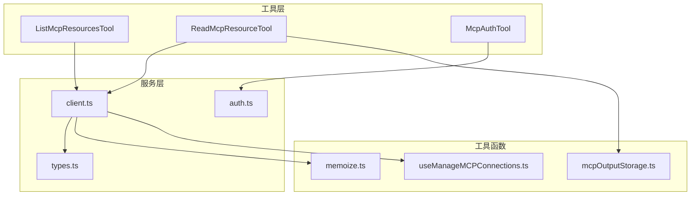
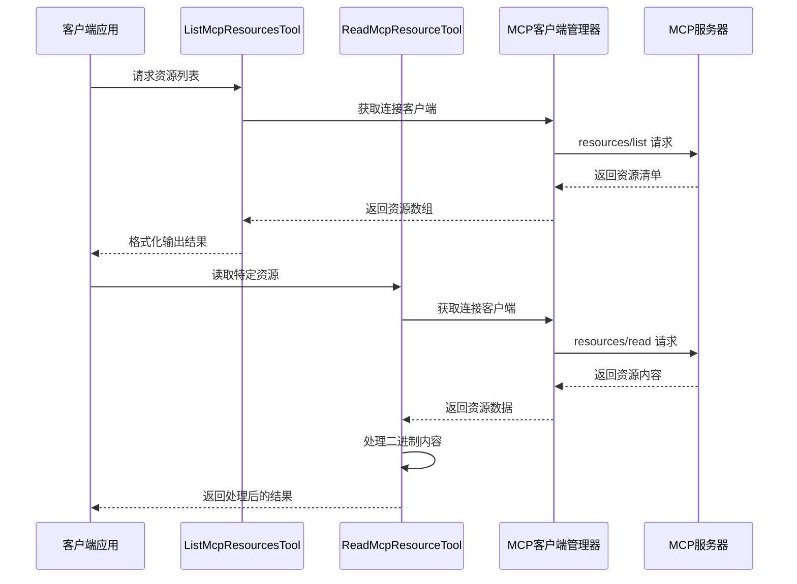
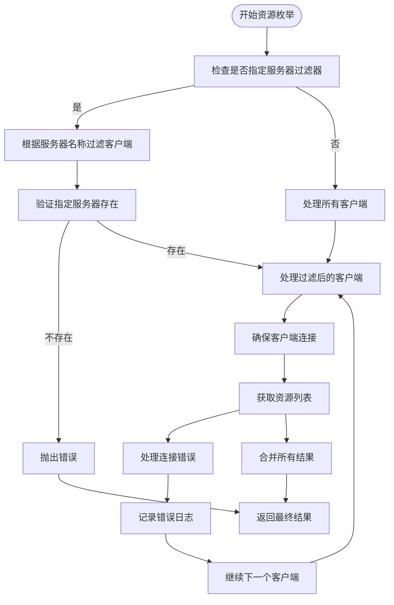
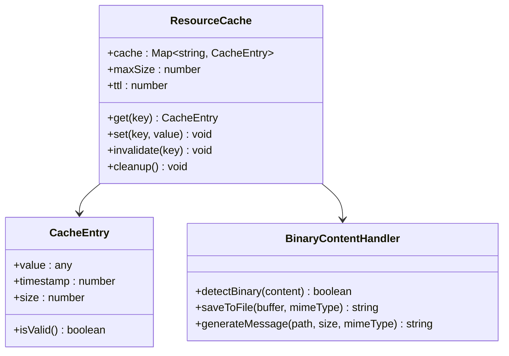

# MCP 资源发现

<cite>
**本文档引用的文件**
- [ListMcpResourcesTool.ts](file://src/tools/ListMcpResourcesTool/ListMcpResourcesTool.ts)
- [ReadMcpResourceTool.ts](file://src/tools/ReadMcpResourceTool/ReadMcpResourceTool.ts)
- [McpAuthTool.ts](file://src/tools/McpAuthTool/McpAuthTool.ts)
- [client.ts](file://src/services/mcp/client.ts)
- [types.ts](file://src/services/mcp/types.ts)
- [auth.ts](file://src/services/mcp/auth.ts)
- [mcpOutputStorage.ts](file://src/utils/mcpOutputStorage.ts)
- [useManageMCPConnections.ts](file://src/services/mcp/useManageMCPConnections.ts)
- [memoize.ts](file://src/utils/memoize.ts)
</cite>

## 目录
1. [简介](#简介)
2. [项目结构](#项目结构)
3. [核心组件](#核心组件)
4. [架构概览](#架构概览)
5. [详细组件分析](#详细组件分析)
6. [依赖关系分析](#依赖关系分析)
7. [性能考虑](#性能考虑)
8. [故障排除指南](#故障排除指南)
9. [结论](#结论)

## 简介

MCP（Model Context Protocol）资源发现系统是 Claude Code 中用于枚举、获取和管理 MCP 服务器资源的核心功能模块。该系统提供了完整的资源生命周期管理，包括资源枚举、元数据获取、分类组织、内容读取、格式转换和缓存策略。

该系统支持多种 MCP 传输协议（stdio、sse、http、ws、sdk），并实现了智能的连接管理和错误处理机制。通过统一的资源发现接口，用户可以轻松地从多个 MCP 服务器中发现和使用资源。

## 项目结构

MCP 资源发现系统的代码主要分布在以下目录结构中：



**图表来源**
- [ListMcpResourcesTool.ts:1-124](file://src/tools/ListMcpResourcesTool/ListMcpResourcesTool.ts#L1-L124)
- [ReadMcpResourceTool.ts:1-159](file://src/tools/ReadMcpResourceTool/ReadMcpResourceTool.ts#L1-L159)
- [client.ts:1-800](file://src/services/mcp/client.ts#L1-L800)

**章节来源**
- [ListMcpResourcesTool.ts:1-124](file://src/tools/ListMcpResourcesTool/ListMcpResourcesTool.ts#L1-L124)
- [ReadMcpResourceTool.ts:1-159](file://src/tools/ReadMcpResourceTool/ReadMcpResourceTool.ts#L1-L159)
- [client.ts:1-800](file://src/services/mcp/client.ts#L1-L800)

## 核心组件

### 资源发现工具

系统提供了两个核心工具来处理 MCP 资源发现：

1. **ListMcpResourcesTool**: 用于枚举 MCP 服务器中的所有可用资源
2. **ReadMcpResourceTool**: 用于读取特定的 MCP 资源内容

### 连接管理器

client.ts 模块负责管理 MCP 服务器的连接状态，包括：
- 连接建立和维护
- 错误处理和重连机制
- 缓存管理
- 资源发现和更新

### 认证工具

McpAuthTool 提供了 MCP 服务器的认证功能，支持：
- OAuth 流程管理
- 自动化认证流程
- 认证状态跟踪

**章节来源**
- [client.ts:1689-1706](file://src/services/mcp/client.ts#L1689-L1706)
- [auth.ts:1-800](file://src/services/mcp/auth.ts#L1-L800)

## 架构概览

MCP 资源发现系统采用分层架构设计，确保了良好的可维护性和扩展性：



**图表来源**
- [ListMcpResourcesTool.ts:66-101](file://src/tools/ListMcpResourcesTool/ListMcpResourcesTool.ts#L66-L101)
- [ReadMcpResourceTool.ts:75-101](file://src/tools/ReadMcpResourceTool/ReadMcpResourceTool.ts#L75-L101)
- [client.ts:2002-2033](file://src/services/mcp/client.ts#L2002-L2033)

## 详细组件分析

### ListMcpResourcesTool 组件分析

ListMcpResourcesTool 是资源发现系统的核心组件之一，负责枚举 MCP 服务器中的所有可用资源。

#### 查询参数和过滤条件

该工具支持以下查询参数：
- `server`: 可选的服务器名称，用于过滤特定服务器的资源
- 如果未指定服务器名称，则返回所有已连接服务器的资源

#### 排序和组织规则

资源结果按照以下方式组织：
- 每个资源对象包含标准 MCP 字段
- 添加 `server` 字段标识资源来源服务器
- 结果按服务器名称进行逻辑分组

#### 实现细节



**图表来源**
- [ListMcpResourcesTool.ts:66-101](file://src/tools/ListMcpResourcesTool/ListMcpResourcesTool.ts#L66-L101)

**章节来源**
- [ListMcpResourcesTool.ts:15-38](file://src/tools/ListMcpResourcesTool/ListMcpResourcesTool.ts#L15-L38)
- [ListMcpResourcesTool.ts:66-101](file://src/tools/ListMcpResourcesTool/ListMcpResourcesTool.ts#L66-L101)

### ReadMcpResourceTool 组件分析

ReadMcpResourceTool 负责读取特定的 MCP 资源内容，并提供智能的内容处理和缓存功能。

#### 内容获取机制

该工具支持两种资源内容类型：
- **文本内容**: 直接返回文本数据
- **二进制内容**: 自动检测并保存到本地文件系统

#### 格式转换策略

系统实现了智能的格式转换：
- 文本内容保持原样
- 二进制内容自动转换为本地文件路径
- MIME 类型驱动文件扩展名选择
- 提供人类可读的文件大小信息

#### 缓存策略



**图表来源**
- [mcpOutputStorage.ts:148-174](file://src/utils/mcpOutputStorage.ts#L148-L174)
- [ReadMcpResourceTool.ts:106-139](file://src/tools/ReadMcpResourceTool/ReadMcpResourceTool.ts#L106-L139)

**章节来源**
- [ReadMcpResourceTool.ts:22-47](file://src/tools/ReadMcpResourceTool/ReadMcpResourceTool.ts#L22-L47)
- [ReadMcpResourceTool.ts:106-139](file://src/tools/ReadMcpResourceTool/ReadMcpResourceTool.ts#L106-L139)

### 连接管理器分析

client.ts 模块提供了完整的 MCP 服务器连接管理功能：

#### 连接类型支持

系统支持多种 MCP 传输协议：
- **stdio**: 本地进程通信
- **sse**: 服务器发送事件
- **http**: HTTP REST API
- **ws**: WebSocket
- **sdk**: 内部 SDK 集成

#### 连接状态管理

连接状态包括：
- `connected`: 已连接
- `failed`: 连接失败
- `needs-auth`: 需要认证
- `pending`: 连接中
- `disabled`: 已禁用

#### 错误处理机制

系统实现了多层次的错误处理：
- 连接超时检测
- 会话过期处理
- 认证失败重定向
- 网络异常恢复

**章节来源**
- [client.ts:179-227](file://src/services/mcp/client.ts#L179-L227)
- [client.ts:564-574](file://src/services/mcp/client.ts#L564-L574)

### 认证系统分析

McpAuthTool 提供了完整的 MCP 服务器认证功能：

#### OAuth 流程管理

系统支持标准的 OAuth 2.0 流程：
- 授权服务器元数据发现
- 授权码流程
- 刷新令牌机制
- 令牌撤销功能

#### 认证状态跟踪

认证状态包括：
- `auth_url`: 需要用户授权的 URL
- `unsupported`: 不支持的认证方式
- `error`: 认证过程中出现的错误

#### 自动化认证

系统支持自动化认证流程：
- 无浏览器启动模式
- 后台认证完成通知
- 自动重新连接机制

**章节来源**
- [McpAuthTool.ts:26-30](file://src/tools/McpAuthTool/McpAuthTool.ts#L26-L30)
- [McpAuthTool.ts:82-84](file://src/tools/McpAuthTool/McpAuthTool.ts#L82-L84)

## 依赖关系分析

MCP 资源发现系统的依赖关系如下：

```mermaid
graph TB
subgraph "外部依赖"
A[@modelcontextprotocol/sdk]
B[zod]
C[lodash-es]
D[p-map]
end
subgraph "内部模块"
E[ListMcpResourcesTool]
F[ReadMcpResourceTool]
G[McpAuthTool]
H[client.ts]
I[auth.ts]
J[mcpOutputStorage.ts]
K[memoize.ts]
end
E --> H
F --> H
G --> I
H --> A
H --> B
H --> C
H --> D
F --> J
H --> K
```

**图表来源**
- [client.ts:1-50](file://src/services/mcp/client.ts#L1-L50)
- [ListMcpResourcesTool.ts:1-15](file://src/tools/ListMcpResourcesTool/ListMcpResourcesTool.ts#L1-L15)
- [ReadMcpResourceTool.ts:1-15](file://src/tools/ReadMcpResourceTool/ReadMcpResourceTool.ts#L1-L15)

### 关键依赖关系

1. **@modelcontextprotocol/sdk**: 提供 MCP 协议实现
2. **zod**: 数据验证和类型安全
3. **lodash-es**: 工具函数库
4. **p-map**: 并发处理库

这些依赖关系确保了系统的稳定性和可靠性。

**章节来源**
- [client.ts:1-50](file://src/services/mcp/client.ts#L1-L50)
- [types.ts:1-10](file://src/services/mcp/types.ts#L1-L10)

## 性能考虑

### 缓存策略

系统实现了多层缓存机制以提高性能：

1. **连接缓存**: 使用 memoize 缓存连接状态
2. **资源缓存**: LRU 缓存资源列表
3. **认证缓存**: 15分钟 TTL 的认证状态缓存
4. **工具缓存**: 缓存工具定义和命令

### 并发处理

系统采用智能的并发处理策略：
- **批量连接**: 支持批量服务器连接
- **异步处理**: 使用 Promise.all 并行处理
- **资源限制**: 限制最大并发数防止资源耗尽

### 内存管理

系统实现了有效的内存管理：
- **缓存清理**: 自动清理过期缓存
- **连接池**: 复用连接减少资源消耗
- **垃圾回收**: 及时释放不再使用的资源

## 故障排除指南

### 常见问题及解决方案

#### 连接问题

**问题**: 服务器无法连接
**原因**: 网络问题、认证失败、服务器不可用
**解决方案**: 
1. 检查网络连接状态
2. 验证服务器配置
3. 查看认证状态
4. 重新尝试连接

#### 资源获取失败

**问题**: 资源列表为空
**原因**: 服务器不支持资源功能、权限不足、网络问题
**解决方案**:
1. 检查服务器能力声明
2. 验证用户权限
3. 确认网络连接
4. 查看服务器日志

#### 内容读取错误

**问题**: 资源内容读取失败
**原因**: 服务器错误、网络中断、资源不存在
**解决方案**:
1. 重新尝试读取操作
2. 检查资源 URI
3. 验证服务器状态
4. 查看详细错误信息

### 调试技巧

1. **启用调试日志**: 设置适当的日志级别查看详细信息
2. **检查连接状态**: 使用连接状态 API 验证连接状态
3. **监控性能指标**: 监控缓存命中率和响应时间
4. **分析错误报告**: 查看详细的错误堆栈信息

**章节来源**
- [client.ts:1385-1404](file://src/services/mcp/client.ts#L1385-L1404)
- [auth.ts:1-100](file://src/services/mcp/auth.ts#L1-L100)

## 结论

MCP 资源发现系统是一个功能完整、设计合理的资源管理解决方案。它提供了以下关键特性：

1. **全面的资源发现**: 支持多种 MCP 服务器和传输协议
2. **智能缓存机制**: 通过多层缓存提高性能
3. **健壮的错误处理**: 提供完善的错误处理和恢复机制
4. **灵活的认证支持**: 支持多种认证方式和自动化流程
5. **高效的并发处理**: 优化的并发策略确保系统响应性

该系统为 Claude Code 提供了强大的 MCP 资源管理能力，能够满足各种复杂的资源发现和管理需求。通过合理的架构设计和实现细节，系统在功能完整性、性能表现和用户体验方面都达到了很高的水平。