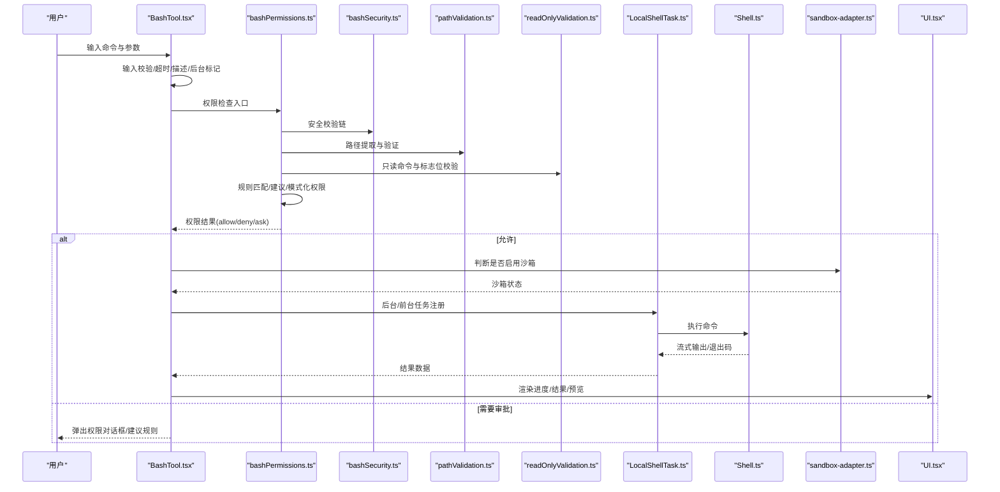
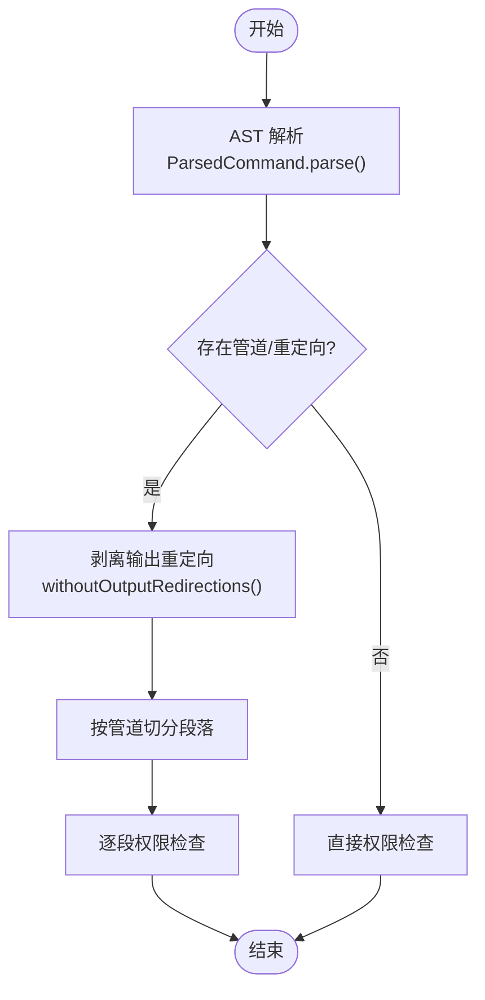
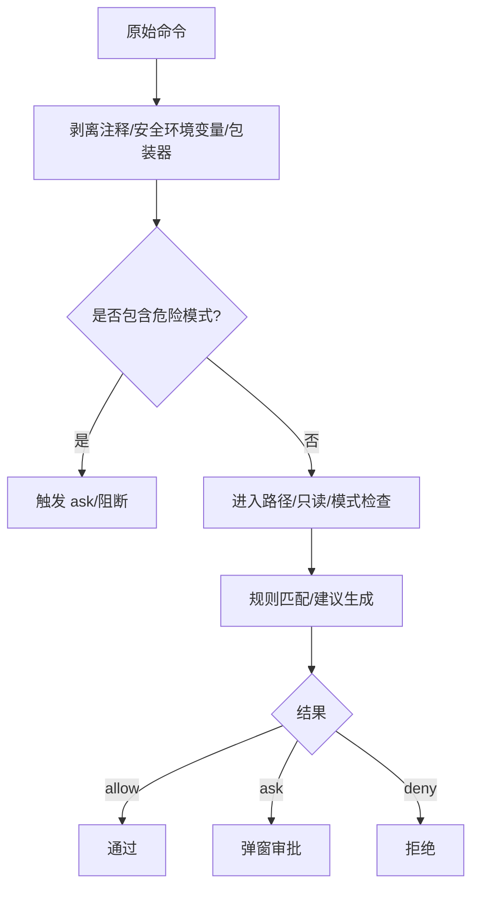
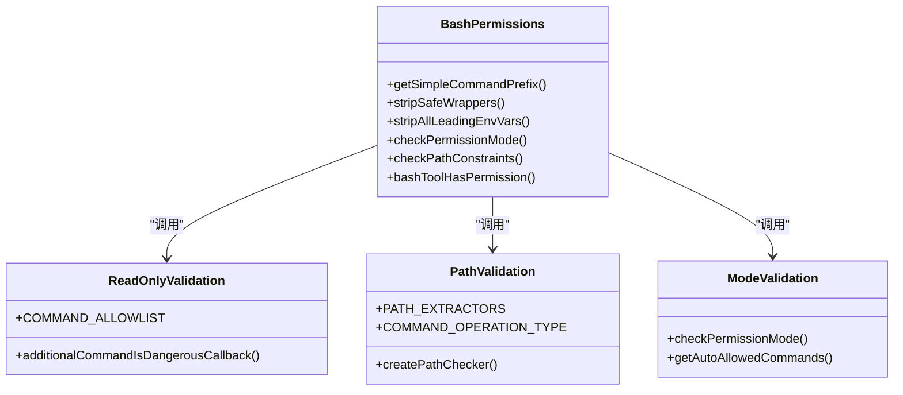
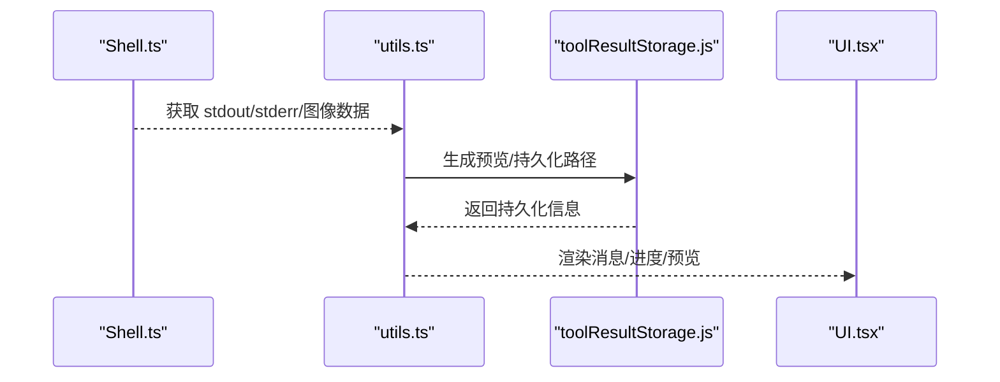
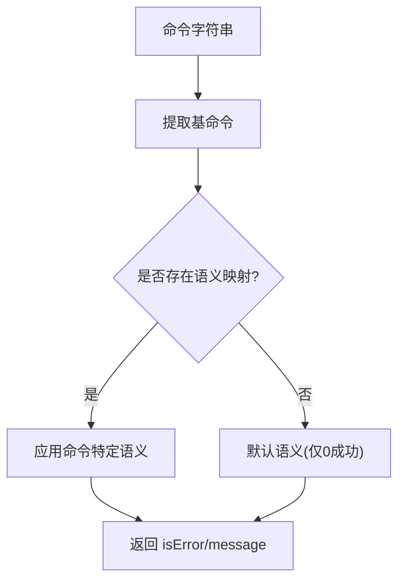
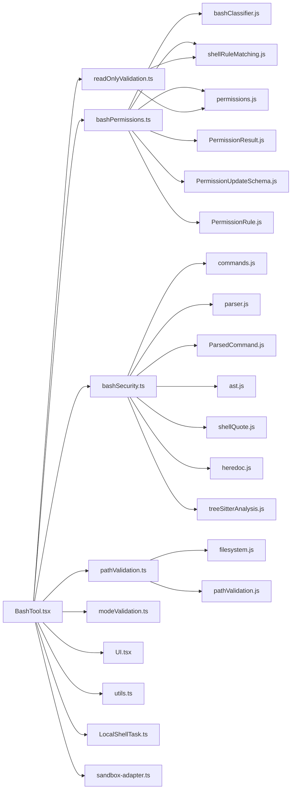

# Bash 工具

<cite>
**本文引用的文件**
- [BashTool.tsx](file://src/tools/BashTool/BashTool.tsx)
- [bashPermissions.ts](file://src/tools/BashTool/bashPermissions.ts)
- [bashSecurity.ts](file://src/tools/BashTool/bashSecurity.ts)
- [commandSemantics.ts](file://src/tools/BashTool/commandSemantics.ts)
- [destructiveCommandWarning.ts](file://src/tools/BashTool/destructiveCommandWarning.ts)
- [modeValidation.ts](file://src/tools/BashTool/modeValidation.ts)
- [pathValidation.ts](file://src/tools/BashTool/pathValidation.ts)
- [readOnlyValidation.ts](file://src/tools/BashTool/readOnlyValidation.ts)
- [bashCommandHelpers.ts](file://src/tools/BashTool/bashCommandHelpers.ts)
- [sedEditParser.ts](file://src/tools/BashTool/sedEditParser.ts)
- [sedValidation.ts](file://src/tools/BashTool/sedValidation.ts)
- [shouldUseSandbox.ts](file://src/tools/BashTool/shouldUseSandbox.ts)
- [UI.tsx](file://src/tools/BashTool/UI.tsx)
- [utils.ts](file://src/tools/BashTool/utils.ts)
- [toolName.ts](file://src/tools/BashTool/toolName.ts)
- [prompt.ts](file://src/tools/BashTool/prompt.ts)
- [commentLabel.ts](file://src/tools/BashTool/commentLabel.ts)
- [LocalShellTask.ts](file://src/tasks/LocalShellTask/LocalShellTask.ts)
- [Shell.ts](file://src/utils/Shell.ts)
- [sandbox-adapter.ts](file://src/utils/sandbox/sandbox-adapter.ts)
- [permissions.js](file://src/utils/permissions/permissions.js)
- [PermissionResult.js](file://src/utils/permissions/PermissionResult.js)
- [PermissionUpdateSchema.js](file://src/utils/permissions/PermissionUpdateSchema.js)
- [PermissionRule.js](file://src/utils/permissions/PermissionRule.js)
- [shellRuleMatching.js](file://src/utils/permissions/shellRuleMatching.js)
- [bashClassifier.js](file://src/utils/permissions/bashClassifier.js)
- [filesystem.js](file://src/utils/permissions/filesystem.js)
- [pathValidation.js](file://src/utils/permissions/pathValidation.js)
- [commands.js](file://src/utils/bash/commands.js)
- [parser.js](file://src/utils/bash/parser.js)
- [ParsedCommand.js](file://src/utils/bash/ParsedCommand.js)
- [ast.js](file://src/utils/bash/ast.js)
- [shellQuote.js](file://src/utils/bash/shellQuote.js)
- [heredoc.js](file://src/utils/bash/heredoc.js)
- [treeSitterAnalysis.js](file://src/utils/bash/treeSitterAnalysis.js)
- [cwd.js](file://src/utils/cwd.js)
- [platform.js](file://src/utils/platform.js)
- [envUtils.js](file://src/utils/envUtils.js)
- [errors.js](file://src/utils/errors.js)
- [file.js](file://src/utils/file.js)
- [fileHistory.js](file://src/utils/fileHistory.js)
- [task/diskOutput.js](file://src/utils/task/diskOutput.js)
- [task/TaskOutput.js](file://src/utils/task/TaskOutput.js)
- [terminal.js](file://src/utils/terminal.js)
- [toolResultStorage.js](file://src/utils/toolResultStorage.js)
- [vscodeSdkMcp.js](file://src/services/mcp/vscodeSdkMcp.js)
- [analytics/index.js](file://src/services/analytics/index.js)
- [growthbook.ts](file://src/services/analytics/growthbook.ts)
- [shared/gitOperationTracking.js](file://src/tools/shared/gitOperationTracking.js)
- [Tool.js](file://src/Tool.js)
- [tools.ts](file://src/tools.ts)
- [__tests__/destructiveCommandWarning.test.ts](file://src/tools/BashTool/__tests__/destructiveCommandWarning.test.ts)
- [__tests__/commandSemantics.test.ts](file://src/tools/BashTool/__tests__/commandSemantics.test.ts)
</cite>

## 目录
1. [简介](#简介)
2. [项目结构](#项目结构)
3. [核心组件](#核心组件)
4. [架构总览](#架构总览)
5. [详细组件分析](#详细组件分析)
6. [依赖关系分析](#依赖关系分析)
7. [性能考虑](#性能考虑)
8. [故障排除指南](#故障排除指南)
9. [结论](#结论)
10. [附录](#附录)

## 简介
本文件系统化梳理 Bash 工具在本仓库中的实现与设计，围绕命令执行机制、安全控制策略、输出处理流程展开，重点覆盖以下方面：
- 命令解析与拆分：基于语法树与正则的多层解析，确保复杂命令（含管道、重定向、子壳等）被正确拆解与逐段校验。
- 安全控制策略：环境变量剥离、包装器剥离、危险模式检测、只读模式与路径验证、破坏性命令提示、沙箱开关与权限规则匹配。
- 权限控制系统：细粒度命令与标志位白名单、命令语义分析、分类器集成、模式化权限决策（如 Accept Edits 模式）。
- 输出处理流程：流式输出、图像输出、大结果落盘、预览生成、截断与去噪、进度与排队消息渲染。
- 错误处理与超时控制：输入校验、阻塞命令限制、中断与异常捕获、资源清理与状态回滚。

## 项目结构
Bash 工具位于 src/tools/BashTool 目录，采用“功能域”组织方式，核心模块如下：
- 核心入口与工具定义：BashTool.tsx
- 权限与安全：bashPermissions.ts、bashSecurity.ts、modeValidation.ts、pathValidation.ts、readOnlyValidation.ts、destructiveCommandWarning.ts、bashCommandHelpers.ts
- 解析与建模：commands.js、parser.js、ParsedCommand.js、ast.js、shellQuote.js、heredoc.js、treeSitterAnalysis.js
- 执行与沙箱：LocalShellTask.ts、Shell.ts、sandbox-adapter.ts
- 输出与 UI：UI.tsx、utils.ts、toolResultStorage.js、terminal.js
- 权限系统与规则：permissions.js、PermissionResult.js、PermissionUpdateSchema.js、PermissionRule.js、shellRuleMatching.js、bashClassifier.js
- 辅助与常量：prompt.ts、toolName.ts、commentLabel.ts、filesystem.js、pathValidation.js、cwd.js、platform.js、envUtils.js、errors.js、file.js、fileHistory.js、task/diskOutput.js、task/TaskOutput.js、vscodeSdkMcp.js、analytics/index.js、growthbook.ts、shared/gitOperationTracking.js、Tool.js、tools.ts

```mermaid
graph TB
subgraph "Bash 工具层"
BT["BashTool.tsx"]
BP["bashPermissions.ts"]
BS["bashSecurity.ts"]
CM["commandSemantics.ts"]
DCW["destructiveCommandWarning.ts"]
MV["modeValidation.ts"]
PV["pathValidation.ts"]
ROV["readOnlyValidation.ts"]
BCH["bashCommandHelpers.ts"]
SEDE["sedEditParser.ts"]
SEV["sedValidation.ts"]
SUS["shouldUseSandbox.ts"]
UI["UI.tsx"]
UT["utils.ts"]
end
subgraph "解析与建模"
CMD["commands.js"]
PARSER["parser.js"]
PCMD["ParsedCommand.js"]
AST["ast.js"]
SQ["shellQuote.js"]
HD["heredoc.js"]
TSA["treeSitterAnalysis.js"]
end
subgraph "执行与沙箱"
LST["LocalShellTask.ts"]
SH["Shell.ts"]
SAN["sandbox-adapter.ts"]
end
subgraph "权限系统"
PERM["permissions.js"]
PR["PermissionResult.js"]
PUR["PermissionUpdateSchema.js"]
PRU["PermissionRule.js"]
SRM["shellRuleMatching.js"]
CLF["bashClassifier.js"]
end
BT --> BP
BT --> BS
BT --> CM
BT --> UI
BT --> UT
BT --> LST
BT --> SAN
BP --> BCH
BP --> PV
BP --> ROV
BP --> MV
BP --> DCW
BP --> PERM
BP --> PR
BP --> PUR
BP --> PRU
BP --> SRM
BP --> CLF
BS --> CMD
BS --> PARSER
BS --> PCMD
BS --> AST
BS --> SQ
BS --> HD
BS --> TSA
PV --> ROV
PV --> SRM
PV --> PERM
PV --> PRU
ROV --> SRM
ROV --> PERM
ROV --> PRU
UI --> UT
UI --> SAN
UI --> LST
```

图示来源
- [BashTool.tsx](file://src/tools/BashTool/BashTool.tsx)
- [bashPermissions.ts](file://src/tools/BashTool/bashPermissions.ts)
- [bashSecurity.ts](file://src/tools/BashTool/bashSecurity.ts)
- [pathValidation.ts](file://src/tools/BashTool/pathValidation.ts)
- [readOnlyValidation.ts](file://src/tools/BashTool/readOnlyValidation.ts)
- [modeValidation.ts](file://src/tools/BashTool/modeValidation.ts)
- [destructiveCommandWarning.ts](file://src/tools/BashTool/destructiveCommandWarning.ts)
- [bashCommandHelpers.ts](file://src/tools/BashTool/bashCommandHelpers.ts)
- [UI.tsx](file://src/tools/BashTool/UI.tsx)
- [utils.ts](file://src/tools/BashTool/utils.ts)
- [LocalShellTask.ts](file://src/tasks/LocalShellTask/LocalShellTask.ts)
- [sandbox-adapter.ts](file://src/utils/sandbox/sandbox-adapter.ts)
- [permissions.js](file://src/utils/permissions/permissions.js)
- [PermissionResult.js](file://src/utils/permissions/PermissionResult.js)
- [PermissionUpdateSchema.js](file://src/utils/permissions/PermissionUpdateSchema.js)
- [PermissionRule.js](file://src/utils/permissions/PermissionRule.js)
- [shellRuleMatching.js](file://src/utils/permissions/shellRuleMatching.js)
- [bashClassifier.js](file://src/utils/permissions/bashClassifier.js)
- [commands.js](file://src/utils/bash/commands.js)
- [parser.js](file://src/utils/bash/parser.js)
- [ParsedCommand.js](file://src/utils/bash/ParsedCommand.js)
- [ast.js](file://src/utils/bash/ast.js)
- [shellQuote.js](file://src/utils/bash/shellQuote.js)
- [heredoc.js](file://src/utils/bash/heredoc.js)
- [treeSitterAnalysis.js](file://src/utils/bash/treeSitterAnalysis.js)

章节来源
- [BashTool.tsx](file://src/tools/BashTool/BashTool.tsx)
- [bashPermissions.ts](file://src/tools/BashTool/bashPermissions.ts)
- [pathValidation.ts](file://src/tools/BashTool/pathValidation.ts)
- [readOnlyValidation.ts](file://src/tools/BashTool/readOnlyValidation.ts)
- [modeValidation.ts](file://src/tools/BashTool/modeValidation.ts)
- [destructiveCommandWarning.ts](file://src/tools/BashTool/destructiveCommandWarning.ts)
- [bashCommandHelpers.ts](file://src/tools/BashTool/bashCommandHelpers.ts)
- [UI.tsx](file://src/tools/BashTool/UI.tsx)
- [utils.ts](file://src/tools/BashTool/utils.ts)
- [LocalShellTask.ts](file://src/tasks/LocalShellTask/LocalShellTask.ts)
- [sandbox-adapter.ts](file://src/utils/sandbox/sandbox-adapter.ts)
- [permissions.js](file://src/utils/permissions/permissions.js)
- [PermissionResult.js](file://src/utils/permissions/PermissionResult.js)
- [PermissionUpdateSchema.js](file://src/utils/permissions/PermissionUpdateSchema.js)
- [PermissionRule.js](file://src/utils/permissions/PermissionRule.js)
- [shellRuleMatching.js](file://src/utils/permissions/shellRuleMatching.js)
- [bashClassifier.js](file://src/utils/permissions/bashClassifier.js)
- [commands.js](file://src/utils/bash/commands.js)
- [parser.js](file://src/utils/bash/parser.js)
- [ParsedCommand.js](file://src/utils/bash/ParsedCommand.js)
- [ast.js](file://src/utils/bash/ast.js)
- [shellQuote.js](file://src/utils/bash/shellQuote.js)
- [heredoc.js](file://src/utils/bash/heredoc.js)
- [treeSitterAnalysis.js](file://src/utils/bash/treeSitterAnalysis.js)

## 核心组件
- BashTool：工具定义、输入/输出模式、并发安全判定、只读判定、权限检查钩子、UI 渲染、结果映射、摘要与活动描述、搜索文本提取、自动背景运行策略、阻塞 sleep 检测、超时与提示配置。
- bashPermissions：权限主流程，包含命令前缀提取、安全环境变量剥离、包装器剥离、命令操作符权限检查（管道/重定向）、分类器集成、规则匹配与建议、模式化权限（Accept Edits）。
- bashSecurity：安全校验链，覆盖不完整命令、heredoc-in-substitution、git commit 消息注入、jq system 函数、危险元字符、Zsh 危险命令、命令替换与反引号、重定向剥离、brace expansion 等。
- pathValidation/readOnlyValidation：路径提取器与操作类型映射，危险路径阻断（如 rm -rf /），POSIX -- 处理，命令特定校验（mv/cp 禁止 flags），cd 写操作组合阻断，建议添加目录或切换 Accept Edits 模式。
- modeValidation：根据当前模式（如 acceptEdits）对文件系统命令进行自动放行。
- destructiveCommandWarning：破坏性命令提示（如 git reset --hard、强制推送、rm -rf 等）。
- bashCommandHelpers：管道/重定向段落剥离、复合命令跨段 cd+git 检测、树形结构分析、unsafe compound 命令识别。
- UI/utils：进度/排队消息、工具结果消息、图像输出、大结果落盘与预览、截断处理、终端输出适配。
- 执行与沙箱：LocalShellTask 负责任务生命周期与前台/后台调度；Shell 提供执行封装；SandboxManager 提供沙箱能力与开关判断。

章节来源
- [BashTool.tsx](file://src/tools/BashTool/BashTool.tsx)
- [bashPermissions.ts](file://src/tools/BashTool/bashPermissions.ts)
- [bashSecurity.ts](file://src/tools/BashTool/bashSecurity.ts)
- [pathValidation.ts](file://src/tools/BashTool/pathValidation.ts)
- [readOnlyValidation.ts](file://src/tools/BashTool/readOnlyValidation.ts)
- [modeValidation.ts](file://src/tools/BashTool/modeValidation.ts)
- [destructiveCommandWarning.ts](file://src/tools/BashTool/destructiveCommandWarning.ts)
- [bashCommandHelpers.ts](file://src/tools/BashTool/bashCommandHelpers.ts)
- [UI.tsx](file://src/tools/BashTool/UI.tsx)
- [utils.ts](file://src/tools/BashTool/utils.ts)
- [LocalShellTask.ts](file://src/tasks/LocalShellTask/LocalShellTask.ts)
- [sandbox-adapter.ts](file://src/utils/sandbox/sandbox-adapter.ts)

## 架构总览
下图展示从用户输入到最终输出的关键交互路径，涵盖解析、权限、执行与输出：

图示来源
- [BashTool.tsx](file://src/tools/BashTool/BashTool.tsx)
- [bashPermissions.ts](file://src/tools/BashTool/bashPermissions.ts)
- [bashSecurity.ts](file://src/tools/BashTool/bashSecurity.ts)
- [pathValidation.ts](file://src/tools/BashTool/pathValidation.ts)
- [readOnlyValidation.ts](file://src/tools/BashTool/readOnlyValidation.ts)
- [LocalShellTask.ts](file://src/tasks/LocalShellTask/LocalShellTask.ts)
- [Shell.ts](file://src/utils/Shell.ts)
- [sandbox-adapter.ts](file://src/utils/sandbox/sandbox-adapter.ts)
- [UI.tsx](file://src/tools/BashTool/UI.tsx)

## 详细组件分析

### 命令解析与拆分
- 多层解析策略：
  - 语法树分析：使用 ParsedCommand 与 TreeSitter 分析复合结构（子壳、命令组、管道段）。
  - 正则拆分：splitCommandWithOperators/splitCommand_DEPRECATED 用于安全边界内的快速拆分。
  - 重定向剥离：buildSegmentWithoutRedirections 使用 AST 去除输出重定向，避免将文件名误判为命令。
- 管道/重定向处理：
  - bashCommandHelpers 对管道段进行剥离并逐段权限检查，防止跨段绕过（如 cd + git 跨段组合）。
  - extractOutputRedirections 在路径验证前剥离重定向，确保规则匹配不受 I/O 影响。

图示来源
- [bashCommandHelpers.ts](file://src/tools/BashTool/bashCommandHelpers.ts)
- [ParsedCommand.js](file://src/utils/bash/ParsedCommand.js)
- [ast.js](file://src/utils/bash/ast.js)
- [commands.js](file://src/utils/bash/commands.js)

章节来源
- [bashCommandHelpers.ts](file://src/tools/BashTool/bashCommandHelpers.ts)
- [ParsedCommand.js](file://src/utils/bash/ParsedCommand.js)
- [ast.js](file://src/utils/bash/ast.js)
- [commands.js](file://src/utils/bash/commands.js)

### 安全控制策略
- 环境变量与包装器剥离：
  - stripSafeWrappers：仅对安全环境变量（如 NODE_ENV、LANG 等）与安全包装器（timeout、time、nice、stdbuf、nohup）进行剥离，保留注释与安全前缀。
  - stripAllLeadingEnvVars：用于拒绝规则匹配与沙箱排除列表，更严格地剥离所有前导环境变量，阻断二进制劫持风险。
- 危险模式检测：
  - bashSecurity：覆盖 heredoc-in-substitution 安全模式、git commit 消息注入检测、jq system 函数、Zsh 危险命令、命令替换与反引号、重定向剥离、brace expansion 等。
  - stripSafeHeredocSubstitutions：预筛安全 heredoc 替换，避免后续验证链被绕过。
- 分类器与规则匹配：
  - bashPermissions 集成 bashClassifier，支持基于分类器的行为描述与置信度，结合通配规则与前缀规则进行匹配，并生成建议规则。

图示来源
- [bashSecurity.ts](file://src/tools/BashTool/bashSecurity.ts)
- [bashPermissions.ts](file://src/tools/BashTool/bashPermissions.ts)
- [bashClassifier.js](file://src/utils/permissions/bashClassifier.js)

章节来源
- [bashSecurity.ts](file://src/tools/BashTool/bashSecurity.ts)
- [bashPermissions.ts](file://src/tools/BashTool/bashPermissions.ts)
- [bashClassifier.js](file://src/utils/permissions/bashClassifier.js)

### 权限控制系统
- 命令与标志位白名单：
  - readOnlyValidation 维护大量命令的安全标志位集合，仅允许只读相关选项，阻断写入、网络或代码执行风险。
  - pathValidation 对 mv/cp 等可能绕过路径提取的命令禁用 flags，确保路径提取正确性。
- 模式化权限：
  - modeValidation 在 acceptEdits 模式下对文件系统命令自动放行，减少误报。
- 规则匹配与建议：
  - shellRuleMatching 支持精确匹配与前缀匹配，permissionRuleExtractPrefix 与 matchWildcardPattern 实现灵活规则匹配。
  - createPathChecker 在路径验证后追加建议：添加目录读取/写入权限、切换 acceptEdits 模式。

图示来源
- [bashPermissions.ts](file://src/tools/BashTool/bashPermissions.ts)
- [readOnlyValidation.ts](file://src/tools/BashTool/readOnlyValidation.ts)
- [pathValidation.ts](file://src/tools/BashTool/pathValidation.ts)
- [modeValidation.ts](file://src/tools/BashTool/modeValidation.ts)

章节来源
- [bashPermissions.ts](file://src/tools/BashTool/bashPermissions.ts)
- [readOnlyValidation.ts](file://src/tools/BashTool/readOnlyValidation.ts)
- [pathValidation.ts](file://src/tools/BashTool/pathValidation.ts)
- [modeValidation.ts](file://src/tools/BashTool/modeValidation.ts)
- [shellRuleMatching.js](file://src/utils/permissions/shellRuleMatching.js)
- [PermissionResult.js](file://src/utils/permissions/PermissionResult.js)
- [PermissionUpdateSchema.js](file://src/utils/permissions/PermissionUpdateSchema.js)

### 输出处理流程
- 流式输出与图像处理：utils.ts 提供图像输出格式化、尺寸调整、空行去除、重置消息拼接。
- 大结果落盘与预览：toolResultStorage.js 负责结果持久化、预览生成、大小阈值控制；task/diskOutput.js 与 task/TaskOutput.js 提供磁盘输出路径与对象。
- UI 渲染：UI.tsx 提供进度、排队、结果消息渲染，支持结构化内容与图片块。
- 截断与去噪：terminal.js 与工具内部逻辑对长输出进行截断与去噪，避免 UI 卡顿。

图示来源
- [utils.ts](file://src/tools/BashTool/utils.ts)
- [toolResultStorage.js](file://src/utils/toolResultStorage.js)
- [task/diskOutput.js](file://src/utils/task/diskOutput.js)
- [task/TaskOutput.js](file://src/utils/task/TaskOutput.js)
- [UI.tsx](file://src/tools/BashTool/UI.tsx)

章节来源
- [utils.ts](file://src/tools/BashTool/utils.ts)
- [toolResultStorage.js](file://src/utils/toolResultStorage.js)
- [task/diskOutput.js](file://src/utils/task/diskOutput.js)
- [task/TaskOutput.js](file://src/utils/task/TaskOutput.js)
- [UI.tsx](file://src/tools/BashTool/UI.tsx)

### 命令语义分析与解释
- commandSemantics.ts 将命令退出码映射为语义化错误/成功，例如 grep/rg 的 1 表示“无匹配”，find 的 1 表示“部分目录不可访问”，test 的 1 表示条件为假。
- interpretCommandResult 根据命令基名选择对应语义，统一错误消息输出。

图示来源
- [commandSemantics.ts](file://src/tools/BashTool/commandSemantics.ts)

章节来源
- [commandSemantics.ts](file://src/tools/BashTool/commandSemantics.ts)

### 破坏性命令警告机制
- destructiveCommandWarning.ts 维护破坏性模式列表（如 git reset --hard、强制推送、rm -rf、数据库 DROP/TRUNCATE 等），匹配到时仅提示警告，不影响权限逻辑，但增强用户意识。

章节来源
- [destructiveCommandWarning.ts](file://src/tools/BashTool/destructiveCommandWarning.ts)

### 只读模式验证与路径验证规则
- readOnlyValidation.ts：
  - 维护 COMMAND_ALLOWLIST，限定命令安全标志位，阻断潜在危险选项。
  - 对 date/hostname 等位置参数进行危险性回调校验。
- pathValidation.ts：
  - PATH_EXTRACTORS 映射不同命令的路径提取逻辑（如 find、grep、sed、jq 等）。
  - COMMAND_OPERATION_TYPE 将命令映射为读/写/创建操作类型。
  - createPathChecker 在路径验证后追加建议（添加目录读取/写入权限、切换 acceptEdits 模式）。
  - checkDangerousRemovalPaths 对危险路径（如 rm -rf /）直接阻断并禁止建议。

章节来源
- [readOnlyValidation.ts](file://src/tools/BashTool/readOnlyValidation.ts)
- [pathValidation.ts](file://src/tools/BashTool/pathValidation.ts)

### 沙箱机制与命令语义分析
- shouldUseSandbox.ts：根据环境变量与动态配置决定是否启用沙箱。
- sandbox-adapter.ts：提供沙箱管理器接口，BashTool 在 UI 中显示沙箱指示。
- 命令语义分析：commandSemantics.ts 与 interpretCommandResult 提供非错误语义解释，辅助 UI 与日志更友好。

章节来源
- [shouldUseSandbox.ts](file://src/tools/BashTool/shouldUseSandbox.ts)
- [sandbox-adapter.ts](file://src/utils/sandbox/sandbox-adapter.ts)
- [commandSemantics.ts](file://src/tools/BashTool/commandSemantics.ts)

### 执行与资源管理
- LocalShellTask.ts：负责任务注册/注销、前台/后台切换、任务生命周期管理。
- Shell.ts：封装命令执行、流式输出、中断与异常处理。
- 资源管理：文件历史跟踪、VS Code 文件变更通知、读取时间戳更新、磁盘输出路径管理。

章节来源
- [LocalShellTask.ts](file://src/tasks/LocalShellTask/LocalShellTask.ts)
- [Shell.ts](file://src/utils/Shell.ts)
- [fileHistory.js](file://src/utils/fileHistory.js)
- [vscodeSdkMcp.js](file://src/services/mcp/vscodeSdkMcp.js)

## 依赖关系分析
- 组件耦合：
  - BashTool.tsx 作为门面，依赖 bashPermissions.ts、bashSecurity.ts、pathValidation.ts、readOnlyValidation.ts、modeValidation.ts、UI.tsx、utils.ts、LocalShellTask.ts、sandbox-adapter.ts。
  - bashPermissions.ts 依赖分类器、规则匹配、路径与只读验证、模式化权限。
  - bashSecurity.ts 依赖解析与 AST 工具（commands.js、parser.js、ParsedCommand.js、ast.js、shellQuote.js、heredoc.js、treeSitterAnalysis.js）。
  - pathValidation.ts 与 readOnlyValidation.ts 依赖权限系统与路径工具（filesystem.js、pathValidation.js、shellRuleMatching.js）。
- 外部依赖：
  - 分析与增长：analytics/index.js、growthbook.ts。
  - 平台与环境：platform.js、envUtils.js、cwd.js。
  - 错误与文件：errors.js、file.js。

图示来源
- [BashTool.tsx](file://src/tools/BashTool/BashTool.tsx)
- [bashPermissions.ts](file://src/tools/BashTool/bashPermissions.ts)
- [bashSecurity.ts](file://src/tools/BashTool/bashSecurity.ts)
- [pathValidation.ts](file://src/tools/BashTool/pathValidation.ts)
- [readOnlyValidation.ts](file://src/tools/BashTool/readOnlyValidation.ts)
- [modeValidation.ts](file://src/tools/BashTool/modeValidation.ts)
- [UI.tsx](file://src/tools/BashTool/UI.tsx)
- [utils.ts](file://src/tools/BashTool/utils.ts)
- [LocalShellTask.ts](file://src/tasks/LocalShellTask/LocalShellTask.ts)
- [sandbox-adapter.ts](file://src/utils/sandbox/sandbox-adapter.ts)
- [bashClassifier.js](file://src/utils/permissions/bashClassifier.js)
- [shellRuleMatching.js](file://src/utils/permissions/shellRuleMatching.js)
- [permissions.js](file://src/utils/permissions/permissions.js)
- [PermissionResult.js](file://src/utils/permissions/PermissionResult.js)
- [PermissionUpdateSchema.js](file://src/utils/permissions/PermissionUpdateSchema.js)
- [PermissionRule.js](file://src/utils/permissions/PermissionRule.js)
- [commands.js](file://src/utils/bash/commands.js)
- [parser.js](file://src/utils/bash/parser.js)
- [ParsedCommand.js](file://src/utils/bash/ParsedCommand.js)
- [ast.js](file://src/utils/bash/ast.js)
- [shellQuote.js](file://src/utils/bash/shellQuote.js)
- [heredoc.js](file://src/utils/bash/heredoc.js)
- [treeSitterAnalysis.js](file://src/utils/bash/treeSitterAnalysis.js)
- [filesystem.js](file://src/utils/permissions/filesystem.js)
- [pathValidation.js](file://src/utils/permissions/pathValidation.js)

章节来源
- [BashTool.tsx](file://src/tools/BashTool/BashTool.tsx)
- [bashPermissions.ts](file://src/tools/BashTool/bashPermissions.ts)
- [bashSecurity.ts](file://src/tools/BashTool/bashSecurity.ts)
- [pathValidation.ts](file://src/tools/BashTool/pathValidation.ts)
- [readOnlyValidation.ts](file://src/tools/BashTool/readOnlyValidation.ts)
- [modeValidation.ts](file://src/tools/BashTool/modeValidation.ts)
- [UI.tsx](file://src/tools/BashTool/UI.tsx)
- [utils.ts](file://src/tools/BashTool/utils.ts)
- [LocalShellTask.ts](file://src/tasks/LocalShellTask/LocalShellTask.ts)
- [sandbox-adapter.ts](file://src/utils/sandbox/sandbox-adapter.ts)
- [bashClassifier.js](file://src/utils/permissions/bashClassifier.js)
- [shellRuleMatching.js](file://src/utils/permissions/shellRuleMatching.js)
- [permissions.js](file://src/utils/permissions/permissions.js)
- [PermissionResult.js](file://src/utils/permissions/PermissionResult.js)
- [PermissionUpdateSchema.js](file://src/utils/permissions/PermissionUpdateSchema.js)
- [PermissionRule.js](file://src/utils/permissions/PermissionRule.js)
- [commands.js](file://src/utils/bash/commands.js)
- [parser.js](file://src/utils/bash/parser.js)
- [ParsedCommand.js](file://src/utils/bash/ParsedCommand.js)
- [ast.js](file://src/utils/bash/ast.js)
- [shellQuote.js](file://src/utils/bash/shellQuote.js)
- [heredoc.js](file://src/utils/bash/heredoc.js)
- [treeSitterAnalysis.js](file://src/utils/bash/treeSitterAnalysis.js)
- [filesystem.js](file://src/utils/permissions/filesystem.js)
- [pathValidation.js](file://src/utils/permissions/pathValidation.js)

## 性能考虑
- 解析与验证的复杂度：
  - MAX_SUBCOMMANDS_FOR_SECURITY_CHECK 与 MAX_SUGGESTED_RULES_FOR_COMPOUND 限制复合命令的拆分宽度与建议数量，避免事件循环饥饿。
  - stripSafeHeredocSubstitutions 与 isSafeHeredoc 采用线性扫描与正则匹配，确保在安全前提下快速通过。
- I/O 与输出：
  - 流式输出与预览生成避免一次性加载大结果；工具结果持久化与预览大小阈值控制内存占用。
- 并发与后台：
  - isConcurrencySafe 基于 isReadOnly 判定，只读命令可并发执行；run_in_background 控制后台执行，避免阻塞主线程。

## 故障排除指南
- 常见问题与定位：
  - 输入校验失败：检查命令是否为空、是否以操作符开头、是否包含不完整片段；查看 validateInput 的阻塞 sleep 检测提示。
  - 权限拒绝：查看 bashPermissions 的 deny/ask 原因，关注规则匹配与建议；必要时手动添加规则或切换模式。
  - 路径验证失败：确认路径是否在允许工作目录内，是否包含危险路径；mv/cp 等命令的 flags 是否导致路径提取失败。
  - 沙箱相关：检查 shouldUseSandbox 的环境变量与动态配置；沙箱模式下某些命令可能被限制。
- 调试建议：
  - 开启分析事件记录（analytics/index.js）以追踪分类器评估与安全检查触发。
  - 使用调试工具与日志（logForDebugging）定位解析与验证链路中的异常节点。

章节来源
- [BashTool.tsx](file://src/tools/BashTool/BashTool.tsx)
- [bashPermissions.ts](file://src/tools/BashTool/bashPermissions.ts)
- [pathValidation.ts](file://src/tools/BashTool/pathValidation.ts)
- [analytics/index.js](file://src/services/analytics/index.js)

## 结论
本实现通过“解析-安全-权限-执行-输出”的闭环设计，将 Bash 命令的安全性与可用性平衡到工程实践中。其关键优势包括：
- 多层解析与验证，覆盖复杂命令结构与危险模式；
- 细粒度的命令与标志位白名单，结合规则匹配与建议；
- 只读模式与路径验证的双重约束，有效降低误操作风险；
- 沙箱与后台执行策略，兼顾安全性与用户体验；
- 完整的输出处理与 UI 渲染，提升可观测性与交互体验。

## 附录
- 命令执行示例（概念性说明）
  - 只读查询：git status、find . -name "*.txt"、grep -r "pattern" . → 自动放行或审批后执行。
  - 文件编辑：sed -i 's/old/new/g' file → 通过 sed 预览与权限请求，确认后再写入。
  - 后台构建：npm install、python -m pytest → run_in_background: true 或由工具自动后台化。
  - 图像输出：convert input.png output.jpg → 自动识别图像并渲染图片块。
- 最佳实践
  - 优先使用只读命令与安全标志位，避免危险选项。
  - 复杂命令尽量拆分为多个简单步骤，便于权限与安全检查。
  - 启用沙箱模式，限制系统级访问；必要时通过规则与建议逐步放宽。
  - 对大输出命令设置超时与后台执行，避免阻塞交互。