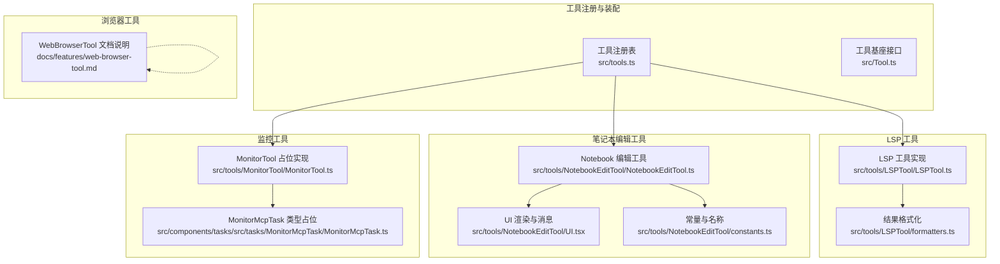
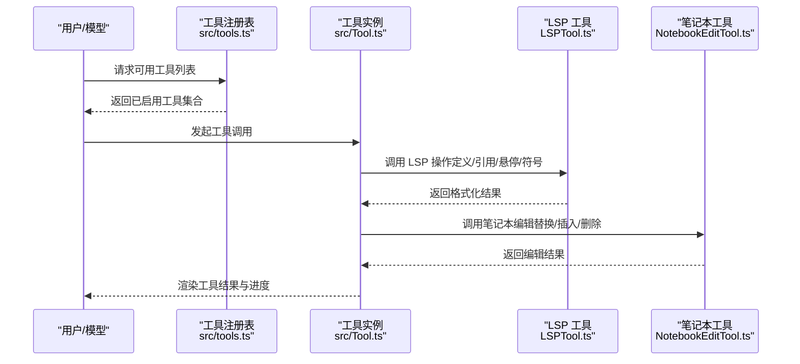
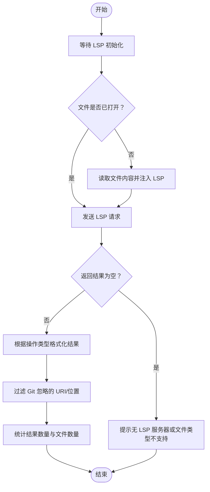
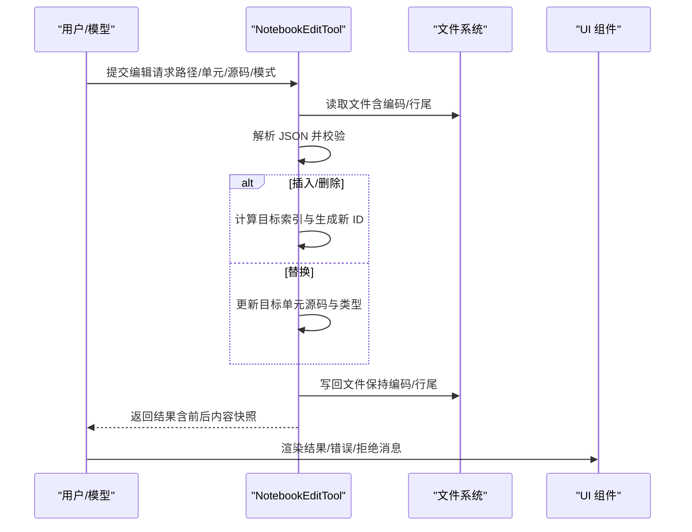
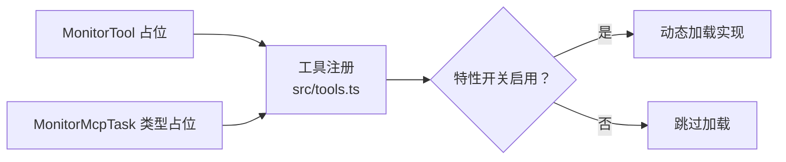
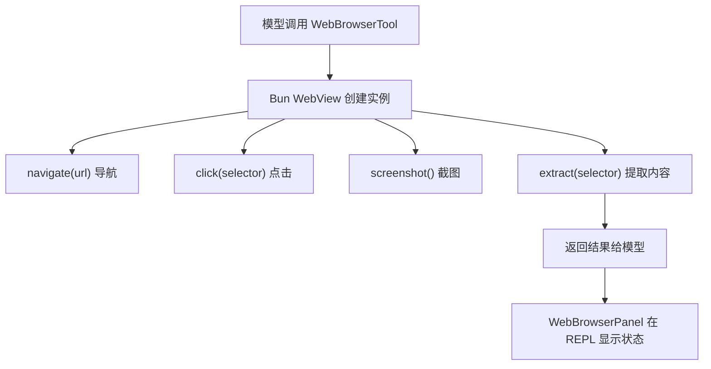
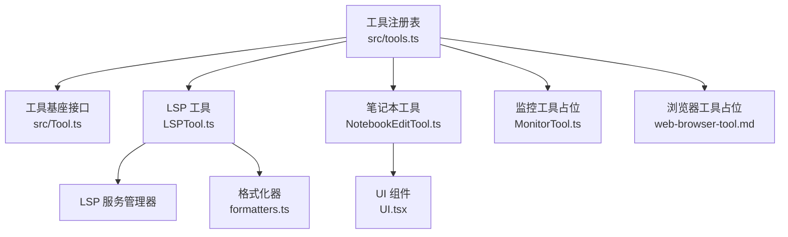

# 专用工具

<cite>
**本文引用的文件**
- [src/tools.ts](file://src/tools.ts)
- [src/Tool.ts](file://src/Tool.ts)
- [src/tools/LSPTool/LSPTool.ts](file://src/tools/LSPTool/LSPTool.ts)
- [src/tools/LSPTool/formatters.ts](file://src/tools/LSPTool/formatters.ts)
- [src/tools/LSPTool/__tests__/schemas.test.ts](file://src/tools/LSPTool/__tests__/schemas.test.ts)
- [src/tools/NotebookEditTool/NotebookEditTool.ts](file://src/tools/NotebookEditTool/NotebookEditTool.ts)
- [src/tools/NotebookEditTool/UI.tsx](file://src/tools/NotebookEditTool/UI.tsx)
- [src/tools/NotebookEditTool/constants.ts](file://src/tools/NotebookEditTool/constants.ts)
- [src/components/permissions/NotebookEditPermissionRequest/NotebookEditToolDiff.tsx](file://src/components/permissions/NotebookEditPermissionRequest/NotebookEditToolDiff.tsx)
- [src/components/NotebookEditToolUseRejectedMessage.tsx](file://src/components/NotebookEditToolUseRejectedMessage.tsx)
- [src/tools/MonitorTool/MonitorTool.ts](file://src/tools/MonitorTool/MonitorTool.ts)
- [src/components/tasks/src/tasks/MonitorMcpTask/MonitorMcpTask.ts](file://src/components/tasks/src/tasks/MonitorMcpTask/MonitorMcpTask.ts)
- [docs/features/web-browser-tool.md](file://docs/features/web-browser-tool.md)
- [packages/@ant/computer-use-mcp/src/executor.ts](file://packages/@ant/computer-use-mcp/src/executor.ts)
- [src/utils/computerUse/executorCrossPlatform.ts](file://src/utils/computerUse/executorCrossPlatform.ts)
- [src/utils/computerUse/win32/accessibilitySnapshot.ts](file://src/utils/computerUse/win32/accessibilitySnapshot.ts)
</cite>

## 目录
1. [简介](#简介)
2. [项目结构](#项目结构)
3. [核心组件](#核心组件)
4. [架构总览](#架构总览)
5. [详细组件分析](#详细组件分析)
6. [依赖关系分析](#依赖关系分析)
7. [性能考量](#性能考量)
8. [故障排查指南](#故障排查指南)
9. [结论](#结论)
10. [附录](#附录)

## 简介
本文件面向“专用工具系列”的技术文档，聚焦以下四类工具的能力与实现：
- 语言服务器协议（LSP）工具：符号解析、代码补全、诊断与导航
- 监控工具：系统监控、性能指标与告警机制（当前为占位实现）
- 笔记本编辑工具：Jupyter Notebook 的代码块管理、执行环境与输出展示
- 网页浏览器工具：页面渲染、用户交互与自动化操作（当前为占位实现）

文档将从系统架构、组件关系、数据流、处理逻辑、集成点与错误处理等方面进行深入剖析，并提供可视化图示与实践建议。

## 项目结构
专用工具在系统中的定位如下：
- 工具注册与装配：通过统一入口集中注册与筛选工具，支持按特性开关启用/禁用特定工具
- 工具基座：所有工具遵循统一的工具接口定义，具备输入/输出模式、权限校验、渲染与进度回调等能力
- LSP 工具：封装 LSP 协议请求、结果格式化与过滤、位置/URI 解析与计数统计
- 笔记本编辑工具：对 .ipynb 文件进行读取、解析、修改与写回，确保一致性与幂等性
- 监控工具：当前为占位实现，后续可扩展为系统级监控与告警
- 浏览器工具：当前为占位实现，计划基于 Bun WebView 提供无头/有头浏览能力

**图表来源**
- [src/tools.ts:191-249](file://src/tools.ts#L191-L249)
- [src/Tool.ts:362-695](file://src/Tool.ts#L362-L695)
- [src/tools/LSPTool/LSPTool.ts:127-422](file://src/tools/LSPTool/LSPTool.ts#L127-L422)
- [src/tools/LSPTool/formatters.ts:1-593](file://src/tools/LSPTool/formatters.ts#L1-L593)
- [src/tools/NotebookEditTool/NotebookEditTool.ts:90-491](file://src/tools/NotebookEditTool/NotebookEditTool.ts#L90-L491)
- [src/tools/NotebookEditTool/UI.tsx:1-125](file://src/tools/NotebookEditTool/UI.tsx#L1-L125)
- [src/tools/NotebookEditTool/constants.ts:1-2](file://src/tools/NotebookEditTool/constants.ts#L1-L2)
- [src/tools/MonitorTool/MonitorTool.ts:1-4](file://src/tools/MonitorTool/MonitorTool.ts#L1-L4)
- [src/components/tasks/src/tasks/MonitorMcpTask/MonitorMcpTask.ts:1-2](file://src/components/tasks/src/tasks/MonitorMcpTask/MonitorMcpTask.ts#L1-L2)
- [docs/features/web-browser-tool.md:1-70](file://docs/features/web-browser-tool.md#L1-L70)

**章节来源**
- [src/tools.ts:191-249](file://src/tools.ts#L191-L249)
- [src/Tool.ts:362-695](file://src/Tool.ts#L362-L695)

## 核心组件
- 工具注册与装配：集中管理工具集合，按特性开关与权限规则动态启用/过滤工具
- LSP 工具：封装 LSP 请求映射、文件打开策略、结果格式化与过滤、URI/位置解析与统计
- 笔记本编辑工具：对 .ipynb 进行安全读取、解析、修改与写回，保证一致性与幂等性
- 监控工具：当前为占位实现，后续可扩展为系统级监控与告警
- 浏览器工具：当前为占位实现，计划基于 Bun WebView 提供无头/有头浏览能力

**章节来源**
- [src/tools.ts:191-249](file://src/tools.ts#L191-L249)
- [src/tools/LSPTool/LSPTool.ts:127-422](file://src/tools/LSPTool/LSPTool.ts#L127-L422)
- [src/tools/NotebookEditTool/NotebookEditTool.ts:90-491](file://src/tools/NotebookEditTool/NotebookEditTool.ts#L90-L491)
- [src/tools/MonitorTool/MonitorTool.ts:1-4](file://src/tools/MonitorTool/MonitorTool.ts#L1-L4)
- [docs/features/web-browser-tool.md:1-70](file://docs/features/web-browser-tool.md#L1-L70)

## 架构总览
专用工具的整体架构围绕“工具注册—工具调用—权限校验—结果渲染”展开，LSP 与笔记本编辑工具分别承担符号解析与文档编辑职责；监控与浏览器工具作为占位实现预留扩展空间。

**图表来源**
- [src/tools.ts:191-249](file://src/tools.ts#L191-L249)
- [src/Tool.ts:379-403](file://src/Tool.ts#L379-L403)
- [src/tools/LSPTool/LSPTool.ts:224-414](file://src/tools/LSPTool/LSPTool.ts#L224-L414)
- [src/tools/NotebookEditTool/NotebookEditTool.ts:295-489](file://src/tools/NotebookEditTool/NotebookEditTool.ts#L295-L489)

## 详细组件分析

### LSP 工具：符号解析、代码补全与诊断
- 能力范围
  - 支持的操作：跳转定义、查找引用、悬停信息、文档符号、工作区符号、跳转实现、调用层次准备、入站/出站调用
  - 输入参数：目标文件路径、行列坐标（1 基）、操作类型
  - 输出结构：包含格式化结果、结果数量、涉及文件数量
- 关键流程
  - 初始化与连接检查：等待 LSP 初始化完成，避免“无服务器可用”
  - 文件打开策略：若文件未在 LSP 中打开，则读取并注入内容，限制最大文件大小
  - LSP 方法映射：将操作映射为对应 LSP 方法与参数
  - 结果处理：针对不同操作类型进行格式化；对位置/URI 结果进行 Git 忽略过滤与去重统计
  - 错误处理：捕获异常并记录日志，返回可读错误信息
- 数据结构与复杂度
  - URI/位置解析与去重：时间复杂度 O(n)，n 为结果条目数
  - 符号树统计：递归统计 DocumentSymbol 子节点，时间复杂度 O(N)
- 权限与安全
  - UNC 路径跳过文件系统操作，防止凭据泄露
  - 仅允许只读操作（isReadOnly 为真）

**图表来源**
- [src/tools/LSPTool/LSPTool.ts:224-414](file://src/tools/LSPTool/LSPTool.ts#L224-L414)
- [src/tools/LSPTool/formatters.ts:127-169](file://src/tools/LSPTool/formatters.ts#L127-L169)

**章节来源**
- [src/tools/LSPTool/LSPTool.ts:127-422](file://src/tools/LSPTool/LSPTool.ts#L127-L422)
- [src/tools/LSPTool/formatters.ts:1-593](file://src/tools/LSPTool/formatters.ts#L1-L593)
- [src/tools/LSPTool/__tests__/schemas.test.ts:1-37](file://src/tools/LSPTool/__tests__/schemas.test.ts#L1-L37)

### 笔记本编辑工具：代码块管理、执行环境与输出展示
- 能力范围
  - 支持操作：替换、插入、删除指定单元格；自动推断新单元格 ID；重置代码单元执行计数与输出
  - 输入参数：笔记本绝对路径、目标单元格 ID 或索引、新源码、单元类型（code/markdown）、编辑模式
  - 输出结构：包含新源码、单元类型、语言、编辑模式、错误信息及前后文件内容快照
- 关键流程
  - 路径与类型校验：必须为 .ipynb；编辑模式合法；读取后进行 JSON 校验
  - 读取与解析：一次性读取内容、编码与行尾信息，使用非缓存解析以避免缓存污染
  - 修改与写回：根据编辑模式更新/插入/删除单元；写回时保留编码与行尾风格
  - 一致性保障：读写后更新读取状态的时间戳，避免“静默覆盖”
- UI 与权限
  - UI 渲染：成功时高亮显示更新后的代码；失败时显示错误消息
  - 权限校验：写权限检查，拒绝未读先写或文件被外部修改的情况
  - 拒绝与错误消息：提供可读的拒绝与错误提示组件

**图表来源**
- [src/tools/NotebookEditTool/NotebookEditTool.ts:295-489](file://src/tools/NotebookEditTool/NotebookEditTool.ts#L295-L489)
- [src/tools/NotebookEditTool/UI.tsx:100-125](file://src/tools/NotebookEditTool/UI.tsx#L100-L125)
- [src/components/permissions/NotebookEditPermissionRequest/NotebookEditToolDiff.tsx:39-87](file://src/components/permissions/NotebookEditPermissionRequest/NotebookEditToolDiff.tsx#L39-L87)
- [src/components/NotebookEditToolUseRejectedMessage.tsx:1-49](file://src/components/NotebookEditToolUseRejectedMessage.tsx#L1-L49)

**章节来源**
- [src/tools/NotebookEditTool/NotebookEditTool.ts:90-491](file://src/tools/NotebookEditTool/NotebookEditTool.ts#L90-L491)
- [src/tools/NotebookEditTool/UI.tsx:1-125](file://src/tools/NotebookEditTool/UI.tsx#L1-L125)
- [src/tools/NotebookEditTool/constants.ts:1-2](file://src/tools/NotebookEditTool/constants.ts#L1-L2)
- [src/components/permissions/NotebookEditPermissionRequest/NotebookEditToolDiff.tsx:39-87](file://src/components/permissions/NotebookEditPermissionRequest/NotebookEditToolDiff.tsx#L39-L87)
- [src/components/NotebookEditToolUseRejectedMessage.tsx:1-49](file://src/components/NotebookEditToolUseRejectedMessage.tsx#L1-L49)

### 监控工具：系统监控、性能指标与告警机制
- 当前状态
  - MonitorTool 为占位实现，MonitorMcpTask 为类型占位
  - 工具注册中通过特性开关条件加载
- 后续扩展方向
  - 可接入系统指标采集（CPU/内存/磁盘/网络）
  - 可集成告警规则与通知通道
  - 可与任务系统联动，触发响应式动作

**图表来源**
- [src/tools/MonitorTool/MonitorTool.ts:1-4](file://src/tools/MonitorTool/MonitorTool.ts#L1-L4)
- [src/components/tasks/src/tasks/MonitorMcpTask/MonitorMcpTask.ts:1-2](file://src/components/tasks/src/tasks/MonitorMcpTask/MonitorMcpTask.ts#L1-L2)
- [src/tools.ts:37-39](file://src/tools.ts#L37-L39)

**章节来源**
- [src/tools/MonitorTool/MonitorTool.ts:1-4](file://src/tools/MonitorTool/MonitorTool.ts#L1-L4)
- [src/components/tasks/src/tasks/MonitorMcpTask/MonitorMcpTask.ts:1-2](file://src/components/tasks/src/tasks/MonitorMcpTask/MonitorMcpTask.ts#L1-L2)
- [src/tools.ts:37-39](file://src/tools.ts#L37-L39)

### 网页浏览器工具：页面渲染、用户交互与自动化操作
- 当前状态
  - WebBrowserTool 为占位实现，WebBrowserPanel 为 Stub
  - 工具注册中通过特性开关条件加载
  - 文档说明了预期数据流与关键设计决策（Bun WebView、REPL 面板、特性检测）
- 后续扩展方向
  - 基于 Bun WebView 实现浏览器实例创建、导航、点击、截图、内容提取
  - 在 REPL 侧边栏渲染浏览器状态面板
  - 提供跨平台的自动化操作（键盘/鼠标/滚动/窗口激活）

**图表来源**
- [docs/features/web-browser-tool.md:23-41](file://docs/features/web-browser-tool.md#L23-L41)
- [src/tools.ts:115-117](file://src/tools.ts#L115-L117)

**章节来源**
- [docs/features/web-browser-tool.md:1-70](file://docs/features/web-browser-tool.md#L1-L70)
- [src/tools.ts:115-117](file://src/tools.ts#L115-L117)

## 依赖关系分析
- 工具注册与装配
  - 工具注册表集中导入各工具模块，按特性开关与权限规则动态启用
  - 工具基座接口统一约束工具行为（输入/输出、权限、渲染、进度等）
- LSP 工具依赖
  - LSP 服务管理器：负责连接、初始化、请求分发与文件打开
  - 结果格式化器：将 LSP 原始结果转换为人类可读文本
- 笔记本工具依赖
  - 文件系统与 JSON 解析：一次性读取并解析，避免缓存污染
  - UI 组件：提供成功/错误/拒绝消息渲染
- 监控与浏览器工具
  - 当前为占位实现，后续扩展需引入系统指标与浏览器自动化库

**图表来源**
- [src/tools.ts:191-249](file://src/tools.ts#L191-L249)
- [src/Tool.ts:362-695](file://src/Tool.ts#L362-L695)
- [src/tools/LSPTool/LSPTool.ts:127-422](file://src/tools/LSPTool/LSPTool.ts#L127-L422)
- [src/tools/LSPTool/formatters.ts:1-593](file://src/tools/LSPTool/formatters.ts#L1-L593)
- [src/tools/NotebookEditTool/NotebookEditTool.ts:90-491](file://src/tools/NotebookEditTool/NotebookEditTool.ts#L90-L491)
- [src/tools/NotebookEditTool/UI.tsx:1-125](file://src/tools/NotebookEditTool/UI.tsx#L1-L125)
- [src/tools/MonitorTool/MonitorTool.ts:1-4](file://src/tools/MonitorTool/MonitorTool.ts#L1-L4)
- [docs/features/web-browser-tool.md:1-70](file://docs/features/web-browser-tool.md#L1-L70)

**章节来源**
- [src/tools.ts:191-249](file://src/tools.ts#L191-L249)
- [src/Tool.ts:362-695](file://src/Tool.ts#L362-L695)

## 性能考量
- LSP 工具
  - 文件大小限制：超过阈值直接返回提示，避免大文件带来的 I/O 与解析开销
  - 结果过滤：批量过滤 Git 忽略路径，减少无关结果的展示与处理
  - URI/位置解析：使用去重与相对路径策略，降低输出冗余
- 笔记本工具
  - 一次性读取与解析：减少多次 IO 与解析成本
  - 写回时保持编码与行尾风格：避免不必要的差异导致的二次写入
- 监控与浏览器工具
  - 当前为占位实现，后续扩展应考虑异步采集与批处理，避免阻塞主线程

[本节为通用指导，无需具体文件分析]

## 故障排查指南
- LSP 工具
  - “无 LSP 服务器可用”：确认 LSP 初始化状态，检查文件类型是否受支持
  - 结果为空：检查光标位置是否位于有效符号上，或 LSP 服务器是否已完成索引
  - URI/位置异常：格式化器会记录警告，检查 LSP 服务器返回数据的完整性
- 笔记本工具
  - “文件未读取”或“已被外部修改”：先读取再写入，避免静默覆盖
  - “单元不存在”：确认单元 ID 或索引格式正确；支持 cell-N 形式的索引
  - “JSON 不合法”：检查 .ipynb 文件完整性
- 监控与浏览器工具
  - 当前为占位实现：按特性开关启用后逐步完善

**章节来源**
- [src/tools/LSPTool/LSPTool.ts:224-414](file://src/tools/LSPTool/LSPTool.ts#L224-L414)
- [src/tools/LSPTool/formatters.ts:24-72](file://src/tools/LSPTool/formatters.ts#L24-L72)
- [src/tools/NotebookEditTool/NotebookEditTool.ts:176-294](file://src/tools/NotebookEditTool/NotebookEditTool.ts#L176-L294)
- [src/tools/MonitorTool/MonitorTool.ts:1-4](file://src/tools/MonitorTool/MonitorTool.ts#L1-L4)
- [docs/features/web-browser-tool.md:1-70](file://docs/features/web-browser-tool.md#L1-L70)

## 结论
专用工具系列在当前版本中，LSP 工具与笔记本编辑工具已具备完整的功能闭环与良好的错误处理；监控与浏览器工具处于占位阶段，为后续扩展预留了清晰的接口与装配路径。通过统一的工具注册与权限体系，系统能够灵活启用/禁用工具并保障安全性与可观测性。

[本节为总结性内容，无需具体文件分析]

## 附录
- 应用场景与集成示例
  - 开发环境配置：通过工具注册表启用 LSP 与笔记本工具，结合权限系统控制访问范围
  - 系统监控：在监控工具占位基础上接入指标采集与告警，按需启用
  - 数据分析工具：利用笔记本工具对 .ipynb 进行自动化编辑与执行，配合输出展示组件
- 最佳实践
  - 对写操作进行“读取-校验-写回”的三段式流程，避免静默覆盖
  - 使用特性开关控制工具启用，便于灰度与回滚
  - 对大文件与高并发场景设置合理的超时与限流策略

[本节为概念性内容，无需具体文件分析]