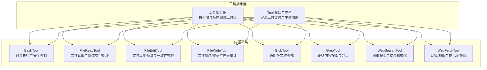
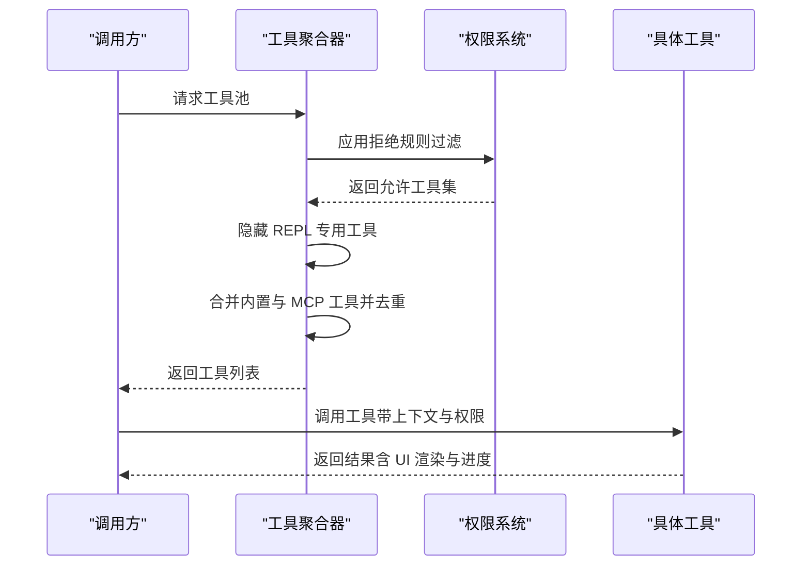
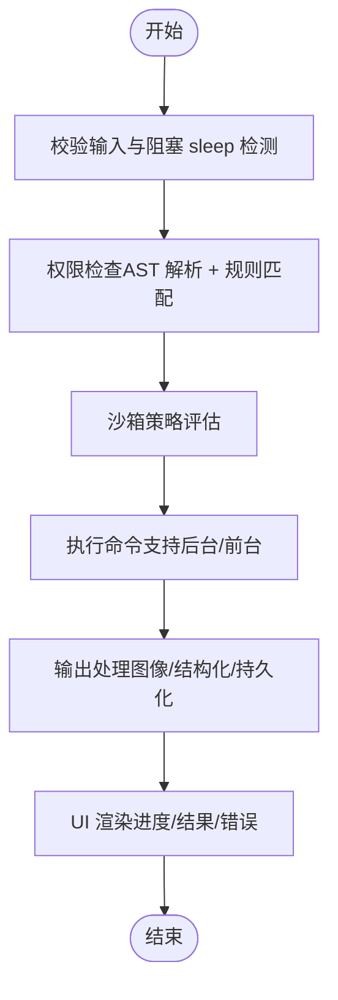
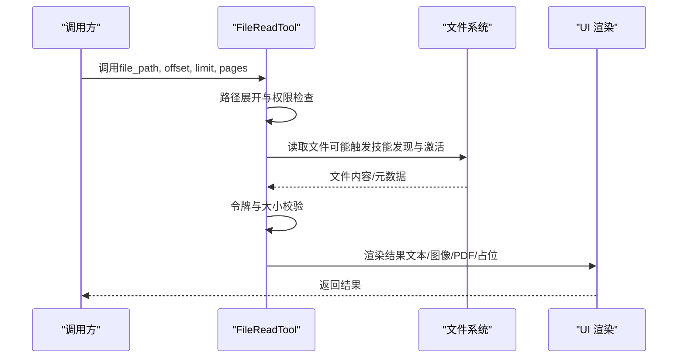
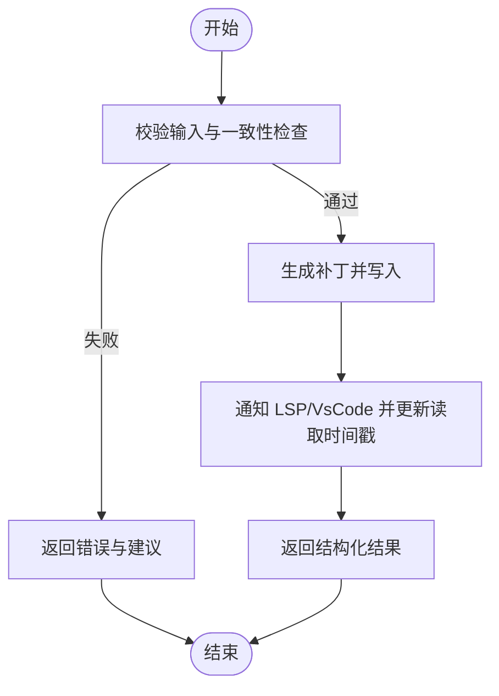
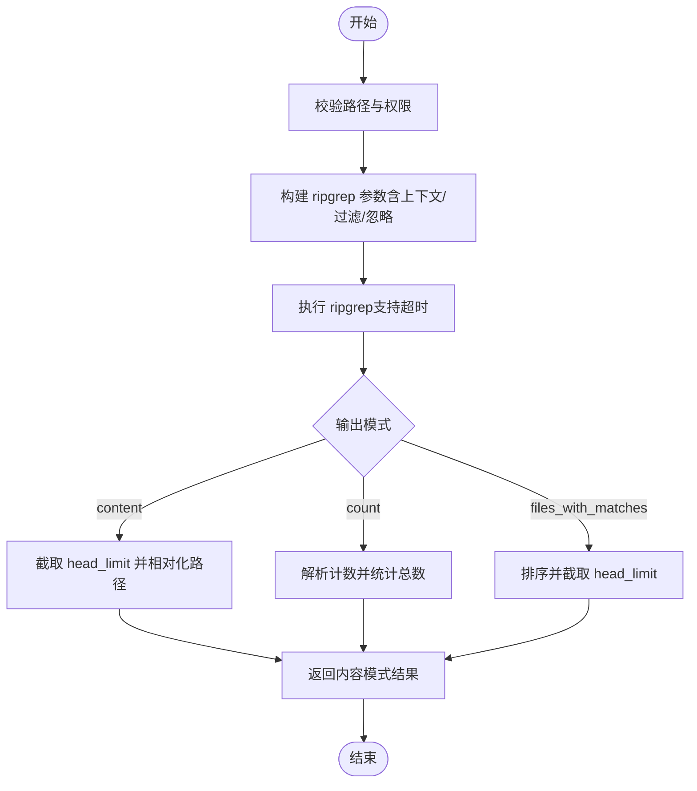
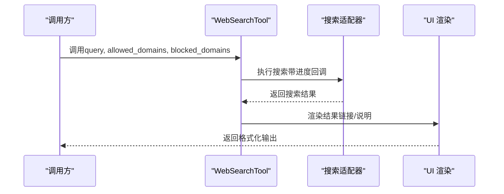
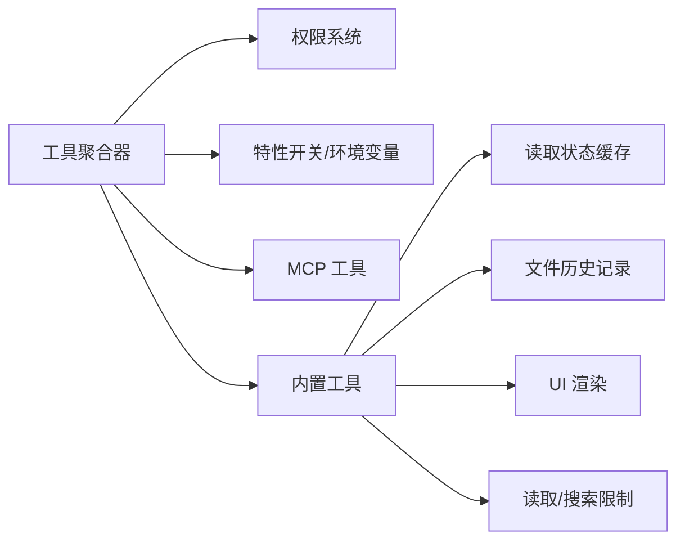

# 内置工具详解

<cite>
**本文档引用的文件**
- [src/tools.ts](file://src/tools.ts)
- [src/Tool.ts](file://src/Tool.ts)
- [src/tools/BashTool/BashTool.tsx](file://src/tools/BashTool/BashTool.tsx)
- [src/tools/BashTool/UI.tsx](file://src/tools/BashTool/UI.tsx)
- [src/tools/FileReadTool/FileReadTool.ts](file://src/tools/FileReadTool/FileReadTool.ts)
- [src/tools/FileReadTool/UI.tsx](file://src/tools/FileReadTool/UI.tsx)
- [src/tools/FileEditTool/FileEditTool.ts](file://src/tools/FileEditTool/FileEditTool.ts)
- [src/tools/FileEditTool/UI.tsx](file://src/tools/FileEditTool/UI.tsx)
- [src/tools/FileWriteTool/FileWriteTool.ts](file://src/tools/FileWriteTool/FileWriteTool.ts)
- [src/tools/GlobTool/GlobTool.ts](file://src/tools/GlobTool/GlobTool.ts)
- [src/tools/GrepTool/GrepTool.ts](file://src/tools/GrepTool/GrepTool.ts)
- [src/tools/WebSearchTool/WebSearchTool.ts](file://src/tools/WebSearchTool/WebSearchTool.ts)
- [src/tools/WebFetchTool/WebFetchTool.ts](file://src/tools/WebFetchTool/WebFetchTool.ts)
</cite>

## 更新摘要
**所做更改**
- 更新了 Bash 工具的中文注释翻译和本地化改进
- 增强了文件读取工具的错误处理和权限检查说明
- 完善了文件编辑工具的一致性校验和安全防护机制
- 优化了搜索工具的参数配置和性能优化策略
- 改进了 Web 工具的权限控制和错误处理说明

## 目录
1. [简介](#简介)
2. [项目结构](#项目结构)
3. [核心组件](#核心组件)
4. [架构总览](#架构总览)
5. [详细组件分析](#详细组件分析)
6. [依赖关系分析](#依赖关系分析)
7. [性能考量](#性能考量)
8. [故障排查指南](#故障排查指南)
9. [结论](#结论)
10. [附录](#附录)

## 简介
本文件面向 Claude Code Best 的内置工具系统，系统性梳理并解释各工具的功能特性、参数配置、返回值格式、错误处理与安全控制策略，并提供使用示例与最佳实践。重点覆盖以下工具类别：
- Bash 工具：命令执行、安全控制、输出处理与并发安全
- 文件操作工具：读取、编辑、写入、权限管理与文件系统集成
- 搜索工具：文本检索、正则表达式支持、结果分页与性能优化
- Web 浏览工具：网页抓取、内容解析与权限控制

## 项目结构
内置工具通过统一的工具抽象层进行定义与装配，核心入口位于工具聚合模块，按权限上下文与特性开关动态组装可用工具集合。

**图表来源**
- [src/tools.ts:191-249](file://src/tools.ts#L191-L249)
- [src/Tool.ts:362-695](file://src/Tool.ts#L362-L695)

**章节来源**
- [src/tools.ts:191-387](file://src/tools.ts#L191-L387)
- [src/Tool.ts:362-793](file://src/Tool.ts#L362-L793)

## 核心组件
- 工具接口与类型：定义工具的输入/输出模式、权限检查、并发安全、UI 渲染、进度回调等统一契约。
- 工具聚合器：根据权限上下文、特性开关与运行环境，动态筛选与合并内置工具与 MCP 工具，保证去重与顺序稳定。

关键职责与约定：
- 输入/输出模式：通过 Zod 或 JSON Schema 定义严格输入输出结构，便于模型调用与 UI 呈现。
- 权限系统：支持"允许/拒绝/询问"三态决策，结合路径/规则匹配与用户交互。
- 并发安全：声明工具是否可并发，避免竞态与状态不一致。
- UI 与渲染：提供工具使用消息、进度消息、结果消息与拒绝/错误 UI 的定制化渲染。
- 结果持久化：对大结果采用磁盘持久化并提供预览，避免超长内联输出。

**章节来源**
- [src/Tool.ts:362-793](file://src/Tool.ts#L362-L793)
- [src/tools.ts:269-387](file://src/tools.ts#L269-L387)

## 架构总览
工具系统采用"抽象层 + 聚合器 + 具体工具"的分层设计。聚合器负责：
- 过滤黑名单工具（基于权限规则）
- 隐藏 REPL 专用工具（当启用 REPL 时）
- 合并内置工具与 MCP 工具，保持内置工具前缀连续以稳定提示缓存键
- 统一启用条件（如特性开关、环境变量、工作树模式等）

**图表来源**
- [src/tools.ts:269-365](file://src/tools.ts#L269-L365)

**章节来源**
- [src/tools.ts:269-365](file://src/tools.ts#L269-L365)

## 详细组件分析

### Bash 工具（命令执行）
- 功能特性
  - 支持任意 shell 命令执行，具备自动后台化、阻塞命令保护、只读约束与沙箱策略。
  - 输出处理：支持图像输出、结构化内容、大结果持久化与预览。
  - UI 呈现：进度消息、排队消息、结果消息与错误消息的定制化渲染。
- 参数配置
  - command：必填，待执行命令字符串
  - timeout：可选，毫秒级超时上限受全局限制
  - description：可选，人类可读的活动描述
  - run_in_background：可选，强制后台执行（受禁用后台任务环境变量影响）
  - dangerouslyDisableSandbox：可选，危险地绕过沙箱（仅用于调试）
  - _simulatedSedEdit：内部字段，用于权限对话后直接应用 sed 预览结果
- 返回值
  - stdout/stderr：标准输出与错误输出
  - rawOutputPath/persistedOutputPath/persistedOutputSize：大结果持久化路径与大小
  - backgroundTaskId/backgroundedByUser/assistantAutoBackgrounded：后台任务相关标记
  - isImage：指示 stdout 是否为图像数据
  - returnCodeInterpretation/noOutputExpected：语义化返回码解释与无输出预期标记
  - structuredContent：结构化内容块数组
- 错误处理
  - 阻塞 sleep 检测：检测长时间 sleep 并建议使用 Monitor 或后台执行
  - 权限检查：基于 AST 解析的安全规则匹配，支持通配符与前缀匹配
  - 只读约束：对 cd、写操作等进行约束判定
  - 沙箱策略：根据环境变量与命令特征决定是否启用沙箱
- 性能与安全
  - 搜索/读取命令折叠显示，减少 UI 噪音
  - 大输出自动落盘，避免内存与令牌溢出
  - 严格的权限与只读约束，防止破坏性操作

**图表来源**
- [src/tools/BashTool/BashTool.tsx:738-796](file://src/tools/BashTool/BashTool.tsx#L738-L796)

**章节来源**
- [src/tools/BashTool/BashTool.tsx:337-506](file://src/tools/BashTool/BashTool.tsx#L337-L506)
- [src/tools/BashTool/BashTool.tsx:640-796](file://src/tools/BashTool/BashTool.tsx#L640-L796)

### 文件读取工具（FileReadTool）
- 功能特性
  - 支持文本、图片、PDF、Jupyter Notebook 等多类型文件读取
  - 自动去重：对同一范围且未变更的文件返回"未变更"占位，节省缓存
  - 会话文件类型检测与分析事件记录
  - macOS 截图路径兼容（AM/PM 间空格差异）
- 参数配置
  - file_path：必填，绝对路径
  - offset/limit：可选，行号范围读取，适用于大文件
  - pages：可选，PDF 页面范围（如 "1-5"、"3"），最大每请求页数受限制
- 返回值
  - text/image/notebook/pdf/parts/file_unchanged：根据文件类型返回对应结构
  - 对于 text：包含文件路径、内容、行数统计与起止行号
  - 对于 image/pdf/parts：包含 base64 数据或页面目录与计数
- 错误处理
  - 设备文件阻断：/dev/zero、/dev/random 等无限输出或阻塞输入设备禁止读取
  - UNC 路径安全：Windows UNC 路径跳过 I/O，由权限流程统一处理
  - 二进制扩展检测：除 PDF、图片、SVG 外的二进制文件禁止直接读取
  - 文件不存在：提供相似文件名与当前工作目录建议
- 性能与安全
  - 读取令牌上限与大小上限控制，超限时抛出异常
  - 自动去重减少重复传输，降低缓存压力

**图表来源**
- [src/tools/FileReadTool/FileReadTool.ts:496-718](file://src/tools/FileReadTool/FileReadTool.ts#L496-L718)

**章节来源**
- [src/tools/FileReadTool/FileReadTool.ts:227-335](file://src/tools/FileReadTool/FileReadTool.ts#L227-L335)
- [src/tools/FileReadTool/FileReadTool.ts:496-718](file://src/tools/FileReadTool/FileReadTool.ts#L496-L718)

### 文件编辑工具（FileEditTool）
- 功能特性
  - 就地替换字符串，支持"全部替换"与逐个替换
  - 一致性校验：要求文件必须先被读取，且自上次读取后未被外部修改
  - 替换前后差异计算与 LSP/VsCode 通知
  - 团队记忆文件敏感内容防护
- 参数配置
  - file_path：必填，绝对路径
  - old_string/new_string：必填，旧/新字符串
  - replace_all：可选，是否全部替换
- 返回值
  - filePath/oldString/newString/originalFile/structuredPatch/userModified/replaceAll/gitDiff
- 错误处理
  - 空旧字符串但文件存在：拒绝新建文件尝试
  - 旧字符串不存在：提示未找到
  - 多处匹配且未开启全部替换：提示需要明确上下文或开启 replace_all
  - 文件已修改：提示重新读取后再写入
  - UNC 路径：跳过 I/O，交由权限流程处理
  - 设置文件验证：对 Claude 配置文件进行额外校验
- 性能与安全
  - 最大可编辑文件大小限制，防止 OOM
  - 写入前确保父目录存在，原子读改写，更新读取时间戳

**图表来源**
- [src/tools/FileEditTool/FileEditTool.ts:137-362](file://src/tools/FileEditTool/FileEditTool.ts#L137-L362)
- [src/tools/FileEditTool/FileEditTool.ts:387-574](file://src/tools/FileEditTool/FileEditTool.ts#L387-L574)

**章节来源**
- [src/tools/FileEditTool/FileEditTool.ts:86-132](file://src/tools/FileEditTool/FileEditTool.ts#L86-L132)
- [src/tools/FileEditTool/FileEditTool.ts:137-362](file://src/tools/FileEditTool/FileEditTool.ts#L137-L362)
- [src/tools/FileEditTool/FileEditTool.ts:387-574](file://src/tools/FileEditTool/FileEditTool.ts#L387-L574)

### 文件写入工具（FileWriteTool）
- 功能特性
  - 创建或覆盖文件，全量内容替换
  - 一致性校验：要求文件先被读取，且未被外部修改
  - 差异统计与 Git Diff 计算（可选）
- 参数配置
  - file_path：必填，绝对路径
  - content：必填，完整内容
- 返回值
  - type（create/update）、filePath/content、originalFile、structuredPatch、gitDiff
- 错误处理
  - 未读取即写：提示先读取
  - 文件已修改：提示重新读取
  - UNC 路径：跳过 I/O，交由权限流程处理
  - 敏感内容防护：团队记忆文件禁止写入敏感内容
- 性能与安全
  - 写入前确保父目录存在，原子写入，更新读取时间戳

**章节来源**
- [src/tools/FileWriteTool/FileWriteTool.ts:56-91](file://src/tools/FileWriteTool/FileWriteTool.ts#L56-L91)
- [src/tools/FileWriteTool/FileWriteTool.ts:153-222](file://src/tools/FileWriteTool/FileWriteTool.ts#L153-L222)
- [src/tools/FileWriteTool/FileWriteTool.ts:223-417](file://src/tools/FileWriteTool/FileWriteTool.ts#L223-L417)

### 搜索工具（GlobTool 与 GrepTool）
- GlobTool
  - 功能：按通配符模式查找文件，支持相对路径与默认工作目录
  - 参数：pattern 必填；path 可选（默认当前工作目录）
  - 返回：durationMs、numFiles、filenames、truncated
  - 错误：路径不存在、非目录、UNC 路径跳过 I/O
- GrepTool
  - 功能：基于 ripgrep 的正则内容搜索，支持多种输出模式与分页
  - 参数：pattern 必填；path/glob/type 可选；output_mode 默认 files_with_matches
  - 上下文与行号：-B/-A/-C/context、-n 控制
  - 过滤：大小写忽略 -i、多行模式 -U/--multiline-dotall
  - 分页：head_limit（默认 250）、offset
  - 返回：mode、numFiles、filenames/content、numLines/numMatches、appliedLimit/appliedOffset
  - 错误：路径不存在、UNC 路径跳过 I/O
- 性能优化
  - 默认 head_limit 限制，避免超大结果集
  - 相对路径输出节省令牌
  - VCS 目录排除与忽略模式整合，减少噪声
  - 多文件排序按修改时间优先，文件名次之

**图表来源**
- [src/tools/GlobTool/GlobTool.ts:154-176](file://src/tools/GlobTool/GlobTool.ts#L154-L176)
- [src/tools/GrepTool/GrepTool.ts:310-576](file://src/tools/GrepTool/GrepTool.ts#L310-L576)

**章节来源**
- [src/tools/GlobTool/GlobTool.ts:57-148](file://src/tools/GlobTool/GlobTool.ts#L57-L148)
- [src/tools/GlobTool/GlobTool.ts:154-198](file://src/tools/GlobTool/GlobTool.ts#L154-L198)
- [src/tools/GrepTool/GrepTool.ts:160-240](file://src/tools/GrepTool/GrepTool.ts#L160-L240)
- [src/tools/GrepTool/GrepTool.ts:310-576](file://src/tools/GrepTool/GrepTool.ts#L310-L576)

### Web 搜索与抓取工具
- WebSearchTool
  - 功能：网络搜索，支持域名白名单/黑名单过滤
  - 参数：query 必填；allowed_domains/blocked_domains 互斥
  - 返回：query、results（链接数组或文本说明）、durationSeconds
  - 权限：需要显式授权
- WebFetchTool
  - 功能：从 URL 抓取内容并应用提示词提取摘要，支持预批准主机与二进制内容落盘
  - 参数：url 必填；prompt 必填
  - 返回：bytes/code/codeText/result/durationMs/url
  - 权限：基于主机名规则（allow/ask/deny），支持预批准主机
  - 错误：无效 URL、重定向到不同主机（需重新调用）

**图表来源**
- [src/tools/WebSearchTool/WebSearchTool.ts:143-183](file://src/tools/WebSearchTool/WebSearchTool.ts#L143-L183)

**章节来源**
- [src/tools/WebSearchTool/WebSearchTool.ts:65-124](file://src/tools/WebSearchTool/WebSearchTool.ts#L65-L124)
- [src/tools/WebSearchTool/WebSearchTool.ts:143-183](file://src/tools/WebSearchTool/WebSearchTool.ts#L143-L183)
- [src/tools/WebFetchTool/WebFetchTool.ts:66-104](file://src/tools/WebFetchTool/WebFetchTool.ts#L66-L104)
- [src/tools/WebFetchTool/WebFetchTool.ts:208-299](file://src/tools/WebFetchTool/WebFetchTool.ts#L208-L299)

## 依赖关系分析
- 工具聚合器依赖权限系统与特性开关，动态组装工具集并保证内置工具前缀连续以稳定缓存键。
- 具体工具共享通用的输入/输出模式、权限检查、UI 渲染与结果映射逻辑，遵循统一的工具契约。
- 文件类工具共享读取状态缓存（readFileState）与历史记录（fileHistory），确保一致性与可回溯性。

**图表来源**
- [src/tools.ts:269-365](file://src/tools.ts#L269-L365)
- [src/Tool.ts:158-300](file://src/Tool.ts#L158-L300)

**章节来源**
- [src/tools.ts:269-365](file://src/tools.ts#L269-L365)
- [src/Tool.ts:158-300](file://src/Tool.ts#L158-L300)

## 性能考量
- 结果持久化阈值：超过阈值（如 Bash 工具 30K 字符、Grep 工具 20K 字符、FileRead 工具无上限）自动落盘并提供预览，避免超长内联输出。
- 默认分页与截断：GrepTool 默认 head_limit=250，避免大结果集占用上下文；GlobTool 限制最多 100 项。
- 相对路径输出：Glob/Grep 将绝对路径转换为相对路径，减少令牌消耗。
- 缓存与去重：FileReadTool 对相同范围且未变更的文件返回"未变更"占位，显著降低重复传输。
- 超时与中断：Bash 使用 AbortController 控制超时；GrepTool 通过 ripgrep 超时机制保障稳定性。

## 故障排查指南
- Bash 工具
  - 阻塞 sleep：检测到长时间 sleep 提示使用后台执行或 Monitor 工具
  - 权限拒绝：检查安全规则匹配与权限对话；必要时添加允许规则
  - 沙箱问题：可通过 dangerouslyDisableSandbox 临时绕过（仅调试）
- 文件读取
  - 设备文件阻断：禁止读取 /dev/zero、/dev/random 等
  - UNC 路径：Windows UNC 路径跳过 I/O，需在权限流程中处理
  - 二进制文件：除 PDF/图片/矢量图外禁止直接读取
- 文件编辑/写入
  - 未读取即写：先调用 FileReadTool 读取目标文件
  - 文件已修改：提示重新读取后再写入
  - 多处匹配：设置 replace_all=true 或提供更明确的上下文
- 搜索工具
  - 路径不存在：检查路径拼写与当前工作目录；使用 suggestPathUnderCwd 获取建议
  - 结果过多：使用 head_limit 与 offset 实现分页
- Web 工具
  - URL 无效：确认 URL 格式正确
  - 重定向：若检测到跨主机重定向，按提示使用新 URL 重新调用

**章节来源**
- [src/tools/BashTool/BashTool.tsx:738-754](file://src/tools/BashTool/BashTool.tsx#L738-L754)
- [src/tools/FileReadTool/FileReadTool.ts:418-494](file://src/tools/FileReadTool/FileReadTool.ts#L418-L494)
- [src/tools/FileEditTool/FileEditTool.ts:137-362](file://src/tools/FileEditTool/FileEditTool.ts#L137-L362)
- [src/tools/GlobTool/GlobTool.ts:94-134](file://src/tools/GlobTool/GlobTool.ts#L94-L134)
- [src/tools/GrepTool/GrepTool.ts:201-232](file://src/tools/GrepTool/GrepTool.ts#L201-L232)
- [src/tools/WebFetchTool/WebFetchTool.ts:191-204](file://src/tools/WebFetchTool/WebFetchTool.ts#L191-L204)

## 结论
内置工具系统通过统一的抽象层与聚合器，实现了高内聚、低耦合的工具生态。各工具在权限、安全、UI 与性能方面均有完善的约束与优化策略。配合工具间的协作（如先 Read 后 Edit/Write、先搜索后抓取）可形成高效的开发工作流。建议在生产环境中充分利用权限规则、分页与去重机制，以获得更稳定与高性能的体验。

## 附录
- 使用示例与最佳实践
  - Bash：对长时间阻塞命令使用 run_in_background；对破坏性命令开启只读检查；必要时使用沙箱
  - 文件：先 Read 再 Edit/Write，避免并发写入；对大文件使用 offset/limit 或 head_limit
  - 搜索：使用更精确的 glob 与 type 过滤；对大结果集使用 head_limit 与 offset 分页
  - Web：优先使用预批准主机；遇到重定向请按提示使用新 URL；对私有/认证内容使用专门的 MCP 工具
- 工具协作模式
  - 搜索 + 抓取：先用 Grep/Glob 定位文件，再用 WebFetch 抓取特定 URL
  - 读取 + 编辑：先 FileRead 获取上下文，再 FileEdit 进行就地修改
  - 编辑 + 写入：小范围修改用 FileEdit，批量/全新文件用 FileWrite