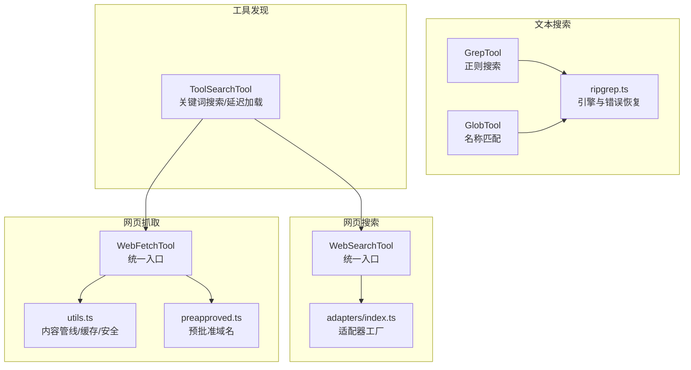
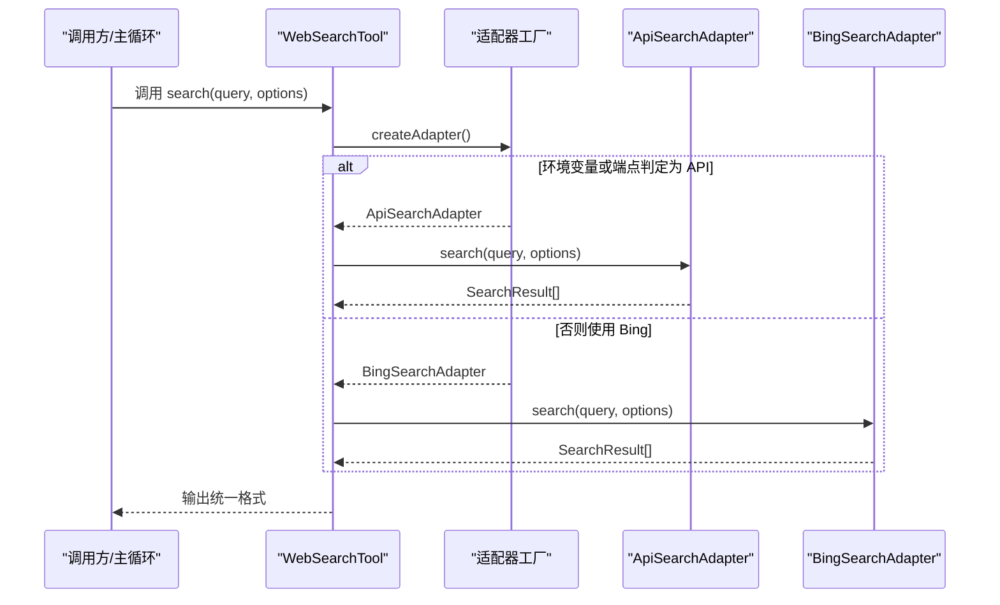
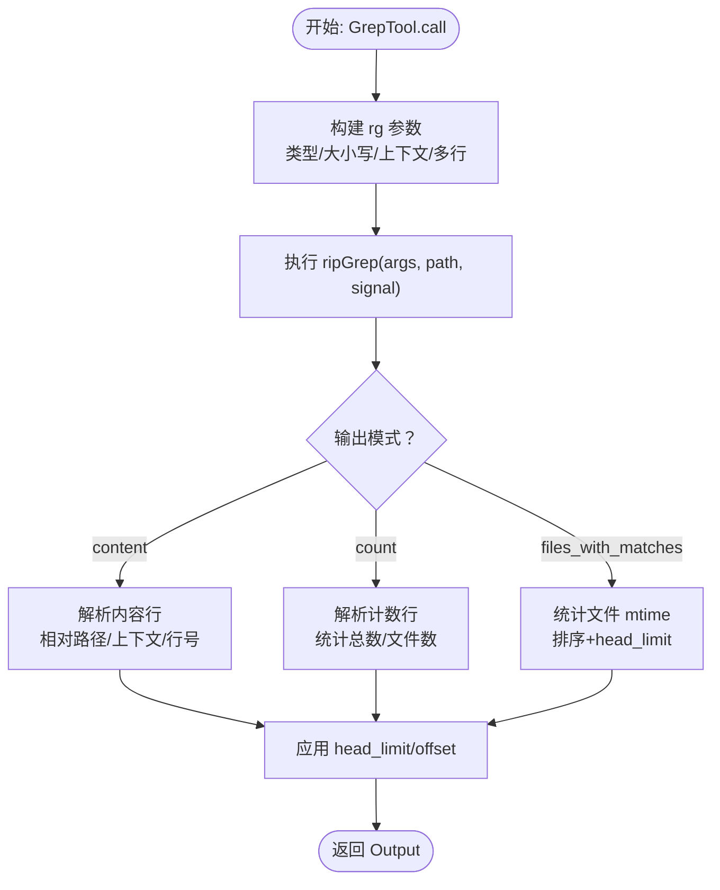
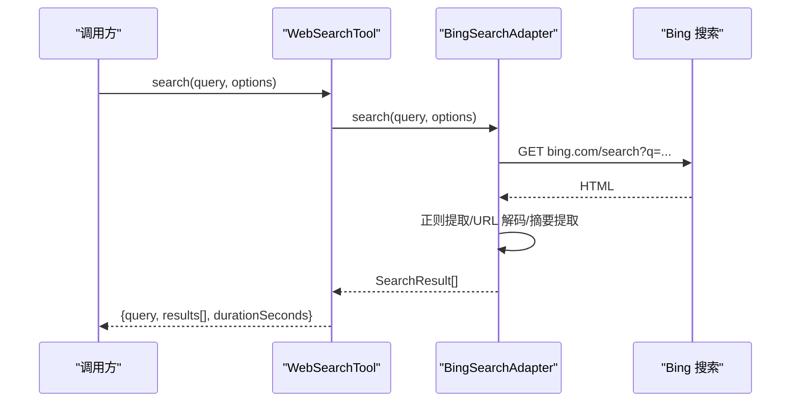
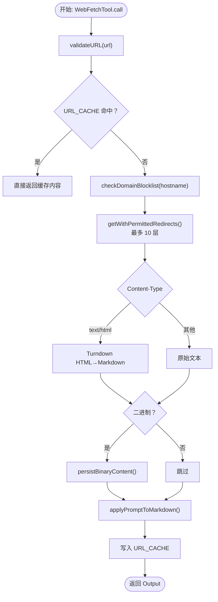
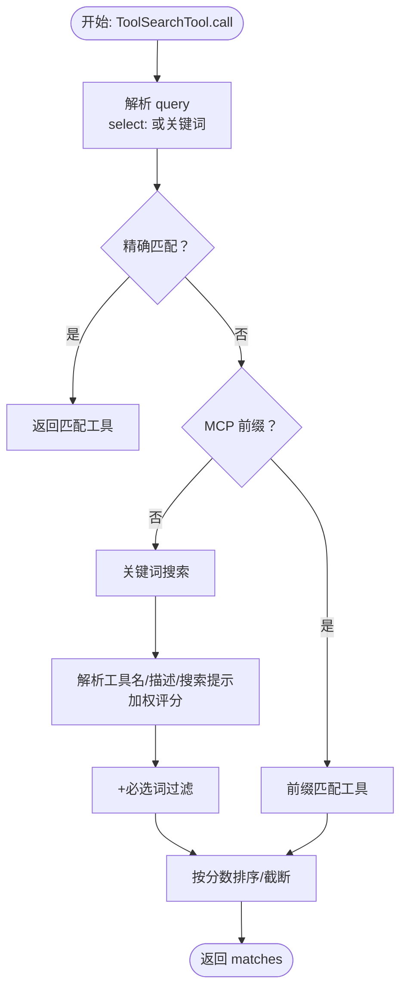
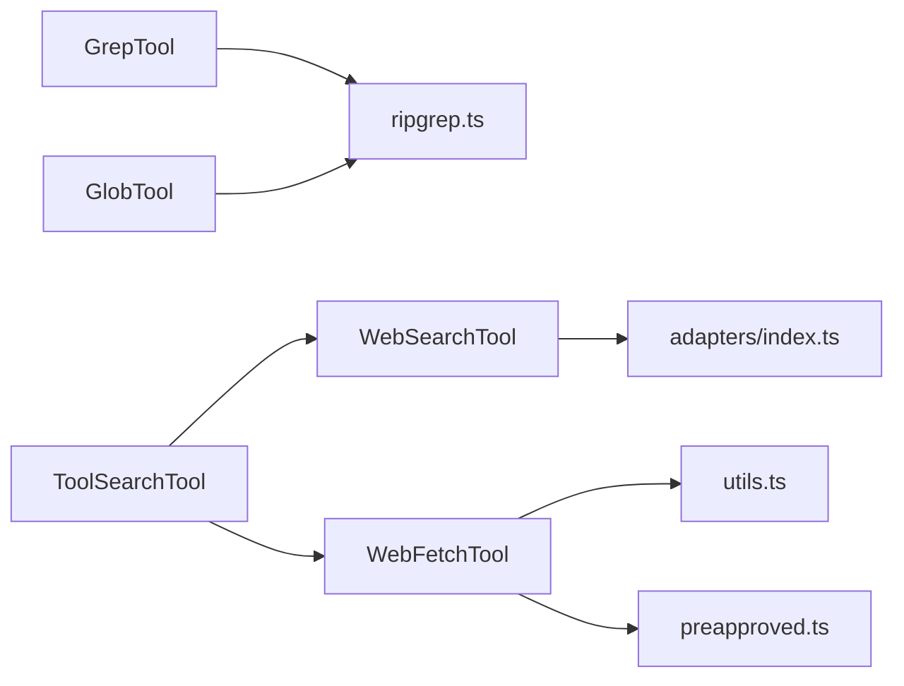

# 搜索与导航工具

<cite>
**本文引用的文件**
- [搜索与导航工具 - 代码库精准定位](file://docs/tools/search-and-navigation.mdx)
- [WebSearchTool.ts](file://src/tools/WebSearchTool/WebSearchTool.ts)
- [WebFetchTool.ts](file://src/tools/WebFetchTool/WebFetchTool.ts)
- [GrepTool.ts](file://src/tools/GrepTool/GrepTool.ts)
- [ripgrep.ts](file://src/utils/ripgrep.ts)
- [GlobTool.ts](file://src/tools/GlobTool/GlobTool.ts)
- [utils.ts](file://src/tools/WebFetchTool/utils.ts)
- [preapproved.ts](file://src/tools/WebFetchTool/preapproved.ts)
- [index.ts](file://src/tools/WebSearchTool/adapters/index.ts)
- [ToolSearchTool.ts](file://src/tools/ToolSearchTool/ToolSearchTool.ts)
</cite>

## 目录
1. [简介](#简介)
2. [项目结构](#项目结构)
3. [核心组件](#核心组件)
4. [架构总览](#架构总览)
5. [详细组件分析](#详细组件分析)
6. [依赖关系分析](#依赖关系分析)
7. [性能考量](#性能考量)
8. [故障排查指南](#故障排查指南)
9. [结论](#结论)
10. [附录](#附录)

## 简介
本文件系统性梳理“搜索与导航工具”系列，覆盖文本搜索（Glob/Grep）、网页搜索（WebSearch）、网页抓取（WebFetch）与工具发现（ToolSearch）四大类能力。重点阐述：
- 文本搜索：正则表达式支持、性能优化（ripgrep 三段式降级、流式输出、超时与中断）、结果高亮与分页
- 网页搜索：搜索引擎集成（Anthropic API 服务端搜索 vs. Bing 页面解析）、结果排序与去重
- 网页抓取：内容提取（HTML→Markdown）、缓存策略、反爬虫与安全防护
- 最佳实践：查询语法、过滤条件、结果处理与应用场景

## 项目结构
围绕“搜索与导航”，核心模块分布如下：
- 文本搜索：GlobTool（按名称）、GrepTool（按内容/正则）
- 网页搜索：WebSearchTool（统一入口，适配器工厂）
- 网页抓取：WebFetchTool（统一入口，内容管线）
- 工具发现：ToolSearchTool（延迟加载、缓存、关键词搜索）

图示来源
- [GrepTool.ts:310-577](file://src/tools/GrepTool/GrepTool.ts#L310-L577)
- [GlobTool.ts:154-176](file://src/tools/GlobTool/GlobTool.ts#L154-L176)
- [ripgrep.ts:345-463](file://src/utils/ripgrep.ts#L345-L463)
- [WebSearchTool.ts:143-183](file://src/tools/WebSearchTool/WebSearchTool.ts#L143-L183)
- [index.ts:15-41](file://src/tools/WebSearchTool/adapters/index.ts#L15-L41)
- [WebFetchTool.ts:208-299](file://src/tools/WebFetchTool/WebFetchTool.ts#L208-L299)
- [utils.ts:347-482](file://src/tools/WebFetchTool/utils.ts#L347-L482)
- [preapproved.ts:14-167](file://src/tools/WebFetchTool/preapproved.ts#L14-L167)
- [ToolSearchTool.ts:328-434](file://src/tools/ToolSearchTool/ToolSearchTool.ts#L328-L434)

章节来源
- [搜索与导航工具 - 代码库精准定位:7-14](file://docs/tools/search-and-navigation.mdx#L7-L14)
- [GrepTool.ts:160-577](file://src/tools/GrepTool/GrepTool.ts#L160-L577)
- [GlobTool.ts:57-199](file://src/tools/GlobTool/GlobTool.ts#L57-L199)
- [WebSearchTool.ts:65-222](file://src/tools/WebSearchTool/WebSearchTool.ts#L65-L222)
- [WebFetchTool.ts:66-319](file://src/tools/WebFetchTool/WebFetchTool.ts#L66-L319)
- [utils.ts:347-531](file://src/tools/WebFetchTool/utils.ts#L347-L531)
- [preapproved.ts:14-167](file://src/tools/WebFetchTool/preapproved.ts#L14-L167)
- [index.ts:15-41](file://src/tools/WebSearchTool/adapters/index.ts#L15-L41)
- [ToolSearchTool.ts:304-472](file://src/tools/ToolSearchTool/ToolSearchTool.ts#L304-L472)

## 核心组件
- 文本搜索（Glob/Grep）
  - GlobTool：基于 glob 的文件名匹配，返回相对路径列表，支持截断提示
  - GrepTool：基于 ripgrep 的正则搜索，支持上下文、行号、大小写忽略、类型过滤、计数模式、head_limit 分页
  - ripgrep.ts：三段式降级（系统/内置/vendor）、错误恢复链（EAGAIN 单线程重试、超时/溢出截断、SIGKILL 升级）
- 网页搜索（WebSearch）
  - WebSearchTool：统一入口，适配器工厂自动选择后端（API 或 Bing），支持域过滤、进度回调
- 网页抓取（WebFetch）
  - WebFetchTool：统一入口，内容管线（URL 校验→域名预检→受限重定向→HTML→Markdown→摘要/持久化）
  - utils.ts：LRU 缓存、域名预检缓存、重定向控制、超时/大小限制、二进制持久化
- 工具发现（ToolSearch）
  - ToolSearchTool：关键词搜索（含必选词 + 前缀匹配）、延迟加载、描述缓存、select 直选

章节来源
- [GlobTool.ts:57-199](file://src/tools/GlobTool/GlobTool.ts#L57-L199)
- [GrepTool.ts:160-577](file://src/tools/GrepTool/GrepTool.ts#L160-L577)
- [ripgrep.ts:31-78](file://src/utils/ripgrep.ts#L31-L78)
- [WebSearchTool.ts:65-222](file://src/tools/WebSearchTool/WebSearchTool.ts#L65-L222)
- [index.ts:15-41](file://src/tools/WebSearchTool/adapters/index.ts#L15-L41)
- [WebFetchTool.ts:66-319](file://src/tools/WebFetchTool/WebFetchTool.ts#L66-L319)
- [utils.ts:50-129](file://src/tools/WebFetchTool/utils.ts#L50-L129)
- [ToolSearchTool.ts:304-472](file://src/tools/ToolSearchTool/ToolSearchTool.ts#L304-L472)

## 架构总览
文本搜索与网页搜索/抓取在“工具层”统一对外暴露，底层分别依赖 ripgrep 与 HTTP 抓取管线。

图示来源
- [WebSearchTool.ts:143-183](file://src/tools/WebSearchTool/WebSearchTool.ts#L143-L183)
- [index.ts:15-41](file://src/tools/WebSearchTool/adapters/index.ts#L15-L41)

## 详细组件分析

### 文本搜索：Glob 与 Grep
- GlobTool
  - 输入：glob 模式与可选路径
  - 行为：调用通用 glob 工具，返回相对路径数组与截断标志
  - 输出：文件数量、耗时、截断标记
- GrepTool
  - 输入：正则模式、可选路径/类型/glob/大小写忽略/上下文/行号/多行/head_limit/offset
  - 行为：构建 ripgrep 参数，执行搜索，按模式输出（内容/文件/计数），对文件列表按 mtime 排序并应用 head_limit
  - 输出：mode、numFiles/filenames/content/numLines/numMatches/appliedLimit/appliedOffset
- ripgrep.ts
  - 三段式降级：系统 > 内置 > vendor
  - 错误恢复链：EAGAIN 单线程重试、超时/溢出截断、SIGKILL 升级
  - 流式输出：支持边遍历边回调，便于交互式快速反馈

图示来源
- [GrepTool.ts:310-577](file://src/tools/GrepTool/GrepTool.ts#L310-L577)
- [ripgrep.ts:345-463](file://src/utils/ripgrep.ts#L345-L463)

章节来源
- [GlobTool.ts:154-176](file://src/tools/GlobTool/GlobTool.ts#L154-L176)
- [GrepTool.ts:310-577](file://src/tools/GrepTool/GrepTool.ts#L310-L577)
- [ripgrep.ts:108-463](file://src/utils/ripgrep.ts#L108-L463)

### 网页搜索：搜索引擎集成与结果处理
- WebSearchTool
  - 统一输入：query、allowed_domains、blocked_domains
  - 统一输出：query/results/durationSeconds（results 可为 SearchResult 数组或字符串）
  - 适配器选择：根据环境变量/端点判定 API 或 Bing
- 适配器工厂
  - 当前实现固定返回 Bing 适配器（保留官方 API 适配器的分支逻辑）
- ApiSearchAdapter（保留分支）
  - 通过 Anthropic API 的 server tool 执行搜索，支持模型选择、域过滤、进度回调
- BingSearchAdapter
  - 直接抓取 Bing 搜索页面，使用浏览器级请求头绕过反爬，正则提取标题/URL/摘要，支持客户端域过滤与中止信号

图示来源
- [WebSearchTool.ts:143-183](file://src/tools/WebSearchTool/WebSearchTool.ts#L143-L183)
- [index.ts:15-41](file://src/tools/WebSearchTool/adapters/index.ts#L15-L41)

章节来源
- [WebSearchTool.ts:65-222](file://src/tools/WebSearchTool/WebSearchTool.ts#L65-L222)
- [index.ts:15-41](file://src/tools/WebSearchTool/adapters/index.ts#L15-L41)

### 网页抓取：内容提取、缓存与反爬虫
- WebFetchTool
  - 输入：url、prompt
  - 行为：URL 校验→域名预检→受限重定向→内容类型判断→HTML→Markdown→摘要/持久化→缓存
  - 输出：bytes/code/codeText/result/durationMs/url
- utils.ts
  - URL 缓存：LRU（15 分钟 TTL、50MB 上限）
  - 域名预检：api.anthropic.com 域信息接口，5 分钟缓存
  - 重定向控制：仅允许同源（含 www 变体）或路径变更，最多 10 层
  - 超时/大小：主请求 60 秒，最大响应 10MB
  - 二进制内容：按 MIME 类型持久化到磁盘，返回保存路径
- preapproved.ts
  - 预批准域名清单（~130 个），支持 hostname-only 与 path-prefix 两类，查找 O(1)

图示来源
- [WebFetchTool.ts:208-299](file://src/tools/WebFetchTool/WebFetchTool.ts#L208-L299)
- [utils.ts:347-482](file://src/tools/WebFetchTool/utils.ts#L347-L482)
- [preapproved.ts:14-167](file://src/tools/WebFetchTool/preapproved.ts#L14-L167)

章节来源
- [WebFetchTool.ts:66-319](file://src/tools/WebFetchTool/WebFetchTool.ts#L66-L319)
- [utils.ts:50-129](file://src/tools/WebFetchTool/utils.ts#L50-L129)
- [utils.ts:347-531](file://src/tools/WebFetchTool/utils.ts#L347-L531)
- [preapproved.ts:14-167](file://src/tools/WebFetchTool/preapproved.ts#L14-L167)

### 工具发现：关键词搜索与延迟加载
- ToolSearchTool
  - 输入：query（支持 select: 直选或多选）、max_results
  - 行为：精确匹配/前缀匹配/MCP 前缀匹配/关键词拆分/加权评分/必选词过滤
  - 输出：matches、query、total_deferred_tools、pending_mcp_servers
  - 性能：描述 memo 缓存（按延迟工具集排序后的名称拼接为 key），减少重复获取描述带来的 token 开销

图示来源
- [ToolSearchTool.ts:328-434](file://src/tools/ToolSearchTool/ToolSearchTool.ts#L328-L434)

章节来源
- [ToolSearchTool.ts:304-472](file://src/tools/ToolSearchTool/ToolSearchTool.ts#L304-L472)

## 依赖关系分析
- 文本搜索
  - GrepTool/GlobTool 依赖 ripgrep.ts 提供的引擎与错误恢复
  - GrepTool 在文件模式下对文件统计结果按 mtime 排序，体现“最近修改优先”的设计意图
- 网页搜索
  - WebSearchTool 通过适配器工厂解耦后端（API/Bing），统一输出格式
- 网页抓取
  - WebFetchTool 依赖 utils.ts 的内容管线、缓存与安全策略
  - 预批准域名清单用于快速放行常见技术文档站点
- 工具发现
  - ToolSearchTool 依赖工具注册表与延迟工具集合，结合描述缓存提升性能

图示来源
- [GrepTool.ts:441-577](file://src/tools/GrepTool/GrepTool.ts#L441-L577)
- [GlobTool.ts:154-176](file://src/tools/GlobTool/GlobTool.ts#L154-L176)
- [WebSearchTool.ts:147-161](file://src/tools/WebSearchTool/WebSearchTool.ts#L147-L161)
- [index.ts:15-41](file://src/tools/WebSearchTool/adapters/index.ts#L15-L41)
- [WebFetchTool.ts:214-299](file://src/tools/WebFetchTool/WebFetchTool.ts#L214-L299)
- [utils.ts:347-482](file://src/tools/WebFetchTool/utils.ts#L347-L482)
- [preapproved.ts:14-167](file://src/tools/WebFetchTool/preapproved.ts#L14-L167)
- [ToolSearchTool.ts:328-434](file://src/tools/ToolSearchTool/ToolSearchTool.ts#L328-L434)

章节来源
- [GrepTool.ts:160-577](file://src/tools/GrepTool/GrepTool.ts#L160-L577)
- [GlobTool.ts:57-199](file://src/tools/GlobTool/GlobTool.ts#L57-L199)
- [WebSearchTool.ts:65-222](file://src/tools/WebSearchTool/WebSearchTool.ts#L65-L222)
- [WebFetchTool.ts:66-319](file://src/tools/WebFetchTool/WebFetchTool.ts#L66-L319)
- [utils.ts:50-129](file://src/tools/WebFetchTool/utils.ts#L50-L129)
- [preapproved.ts:14-167](file://src/tools/WebFetchTool/preapproved.ts#L14-L167)
- [index.ts:15-41](file://src/tools/WebSearchTool/adapters/index.ts#L15-L41)
- [ToolSearchTool.ts:304-472](file://src/tools/ToolSearchTool/ToolSearchTool.ts#L304-L472)

## 性能考量
- 文本搜索
  - head_limit 默认 250，避免大结果集占用上下文预算；offset 支持分页
  - ripgrep 三段式降级与 EAGAIN 单线程重试，保障在资源受限环境稳定运行
  - 流式输出（ripgrepStream）支持交互式快速反馈
- 网页搜索
  - 适配器选择优先 API 后端（保留分支），否则回退至 Bing；支持域过滤减少无关结果
- 网页抓取
  - URL 缓存（15 分钟、50MB）与域名预检缓存（5 分钟）降低重复请求
  - 重定向深度限制与受限重定向策略防止滥用与循环
  - 二进制内容持久化，避免大体积内容反复传输
- 工具发现
  - 描述缓存按延迟工具集合 key 缓存，集合变化时自动失效

## 故障排查指南
- 文本搜索
  - ripgrep 超时：检查 head_limit/offset 是否过大；确认路径范围是否合理；观察是否触发 WSL 超时（默认 60 秒）
  - EAGAIN：系统资源紧张时自动单线程重试；若频繁出现，建议缩小搜索范围或减少并发
  - 结果为空：确认 glob/正则是否过于宽泛；检查忽略模式与 VCS 目录排除
- 网页搜索
  - API 后端不可用：切换到 Bing 适配器；检查网络与端点配置
  - Bing 反爬：确保使用浏览器级请求头；注意地域参数与重定向链接解码
- 网页抓取
  - 域名被阻止：查看域名预检返回；必要时手动添加规则
  - 重定向异常：确认是否跨域；超出最大重定向层数会报错
  - 二进制内容：检查持久化路径与大小，确认是否需要进一步处理
- 工具发现
  - 未找到工具：确认是否处于延迟加载状态；等待 MCP 服务器连接完成；使用 select: 直选

章节来源
- [ripgrep.ts:87-106](file://src/utils/ripgrep.ts#L87-L106)
- [ripgrep.ts:411-463](file://src/utils/ripgrep.ts#L411-L463)
- [WebSearchTool.ts:133-142](file://src/tools/WebSearchTool/WebSearchTool.ts#L133-L142)
- [utils.ts:176-203](file://src/tools/WebFetchTool/utils.ts#L176-L203)
- [utils.ts:262-330](file://src/tools/WebFetchTool/utils.ts#L262-L330)
- [utils.ts:484-531](file://src/tools/WebFetchTool/utils.ts#L484-L531)
- [ToolSearchTool.ts:358-406](file://src/tools/ToolSearchTool/ToolSearchTool.ts#L358-L406)

## 结论
本套“搜索与导航工具”以统一的工具接口与清晰的分层架构，兼顾本地代码检索（Glob/Grep）与外部信息获取（WebSearch/WebFetch），并通过缓存、反爬与安全策略保障稳定性与安全性。配合 ToolSearch 的关键词搜索与延迟加载，可在大规模工具集下高效定位目标工具，降低上下文开销。

## 附录

### 查询最佳实践
- 文本搜索
  - 正则表达式：优先使用锚点与单词边界；必要时启用多行模式
  - 上下文：content 模式下使用 -C/--context 获取前后文；行号 -n 便于定位
  - 分页：head_limit 控制总量，offset 实现分页浏览
  - 类型过滤：type 指定语言类型，减少噪声
- 网页搜索
  - 域过滤：allowed_domains/blocked_domains 精准限定来源
  - 进度回调：利用 onProgress 实时反馈搜索进展
- 网页抓取
  - URL 校验：避免长链与凭据；尽量使用 HTTPS
  - 预批准域名：技术文档站点可直接抓取，避免二次摘要
  - 二进制内容：关注持久化路径，便于后续人工审阅

### 应用场景示例
- 代码分析：先用 Glob 定位文件，再用 Grep 提取关键调用/定义
- 文档检索：WebSearch 获取最新资料，WebFetch 抓取并摘要
- 信息获取：ToolSearch 发现所需工具，结合上述搜索/抓取完成闭环

章节来源
- [搜索与导航工具 - 代码库精准定位:58-282](file://docs/tools/search-and-navigation.mdx#L58-L282)
- [GrepTool.ts:35-89](file://src/tools/GrepTool/GrepTool.ts#L35-L89)
- [WebSearchTool.ts:17-26](file://src/tools/WebSearchTool/WebSearchTool.ts#L17-L26)
- [WebFetchTool.ts:24-28](file://src/tools/WebFetchTool/WebFetchTool.ts#L24-L28)
- [ToolSearchTool.ts:22-33](file://src/tools/ToolSearchTool/ToolSearchTool.ts#L22-L33)