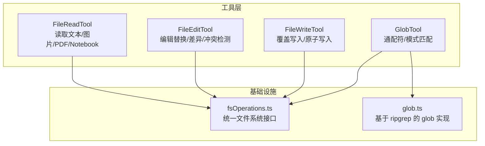
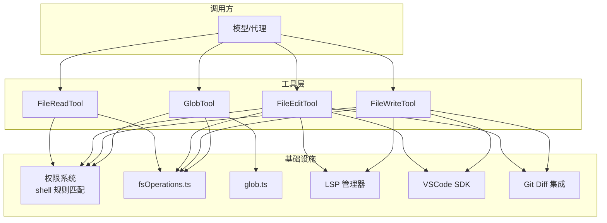
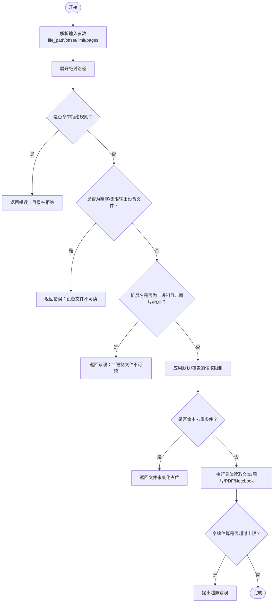
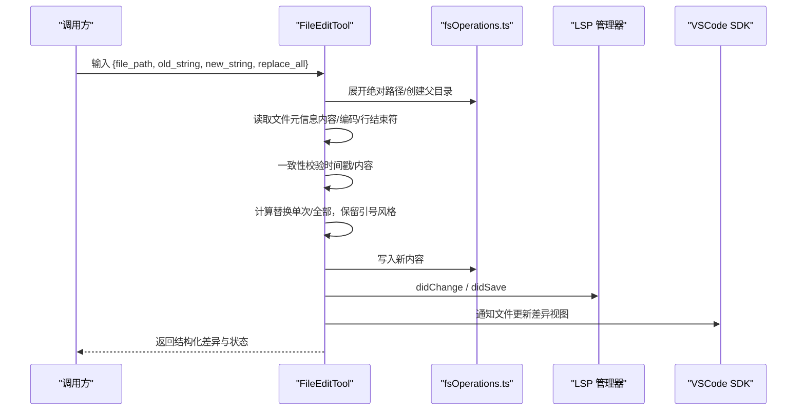
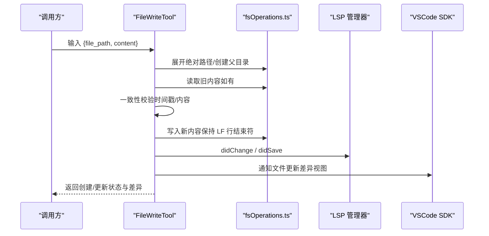
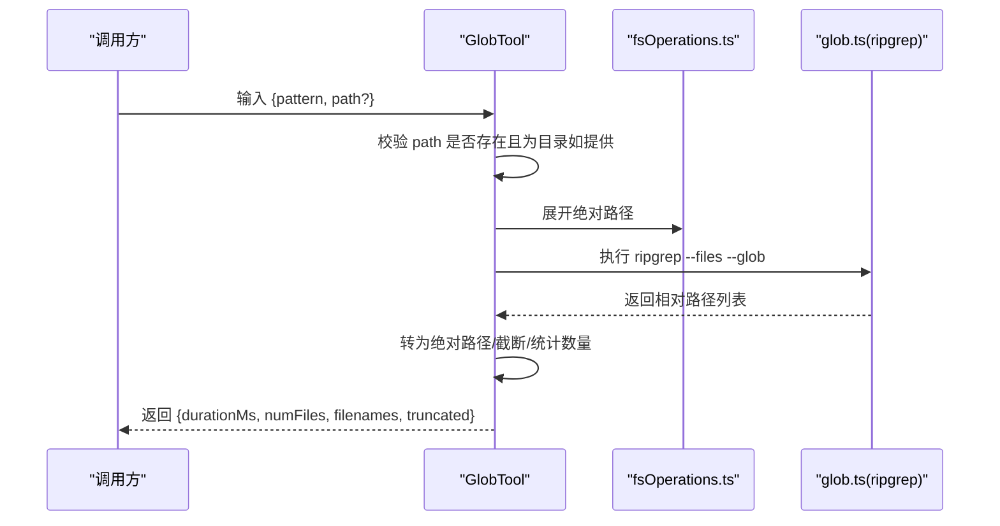
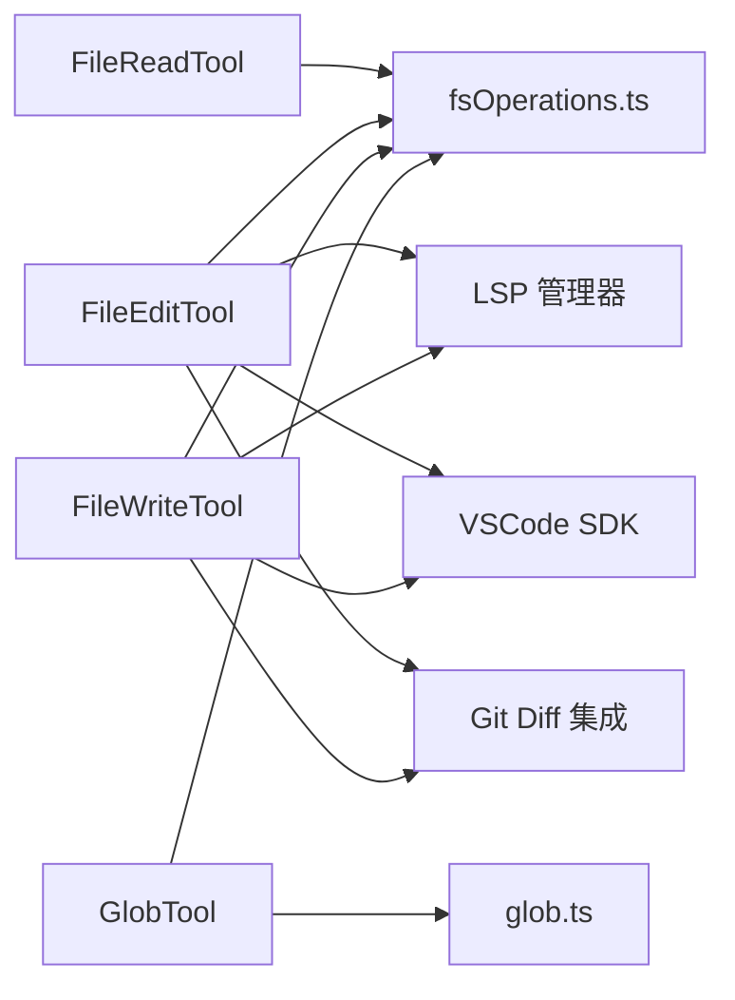

# 文件操作工具

<cite>
**本文引用的文件**
- [src/tools/FileReadTool/FileReadTool.ts](file://src/tools/FileReadTool/FileReadTool.ts)
- [src/tools/FileEditTool/FileEditTool.ts](file://src/tools/FileEditTool/FileEditTool.ts)
- [src/tools/FileWriteTool/FileWriteTool.ts](file://src/tools/FileWriteTool/FileWriteTool.ts)
- [src/tools/GlobTool/GlobTool.ts](file://src/tools/GlobTool/GlobTool.ts)
- [src/tools/FileReadTool/limits.ts](file://src/tools/FileReadTool/limits.ts)
- [src/tools/FileEditTool/constants.ts](file://src/tools/FileEditTool/constants.ts)
- [src/tools/FileEditTool/types.ts](file://src/tools/FileEditTool/types.ts)
- [src/tools/FileWriteTool/prompt.ts](file://src/tools/FileWriteTool/prompt.ts)
- [src/tools/GlobTool/prompt.ts](file://src/tools/GlobTool/prompt.ts)
- [src/utils/fsOperations.ts](file://src/utils/fsOperations.ts)
- [src/utils/glob.ts](file://src/utils/glob.ts)
</cite>

## 目录
1. [简介](#简介)
2. [项目结构](#项目结构)
3. [核心组件](#核心组件)
4. [架构总览](#架构总览)
5. [详细组件分析](#详细组件分析)
6. [依赖关系分析](#依赖关系分析)
7. [性能考量](#性能考量)
8. [故障排查指南](#故障排查指南)
9. [结论](#结论)
10. [附录](#附录)

## 简介
本文件面向“文件操作工具系列”，系统性梳理以下工具的能力边界与实现要点：
- 文件读取工具：文本、图片、PDF、Jupyter Notebook 的多格式读取，行范围读取、令牌计数与上限控制、设备文件与二进制文件安全过滤、macOS 截图路径兼容等。
- 文件编辑工具：基于“先读后写”的一致性校验、差异生成与展示、冲突检测（意外修改）、版本控制 Diff 集成、VSCode 差异视图联动。
- 文件写入工具：覆盖式写入、一致性校验、原子化写入保障、行结束符处理、LSP 通知、版本控制 Diff 集成。
- 全局匹配工具：基于 ripgrep 的高性能通配符/模式匹配、忽略规则与隐藏文件控制、结果截断与相对路径输出。

本技术文档兼顾工程实现细节与非技术读者可读性，提供流程图、序列图与类图帮助理解。

## 项目结构
文件操作工具位于 src/tools 下，分别对应 FileReadTool、FileEditTool、FileWriteTool、GlobTool；底层文件系统抽象在 src/utils/fsOperations.ts；全局匹配逻辑在 src/utils/glob.ts 中复用 ripgrep。

图表来源
- [src/tools/FileReadTool/FileReadTool.ts:337-718](file://src/tools/FileReadTool/FileReadTool.ts#L337-L718)
- [src/tools/FileEditTool/FileEditTool.ts:86-595](file://src/tools/FileEditTool/FileEditTool.ts#L86-L595)
- [src/tools/FileWriteTool/FileWriteTool.ts:94-434](file://src/tools/FileWriteTool/FileWriteTool.ts#L94-L434)
- [src/tools/GlobTool/GlobTool.ts:57-198](file://src/tools/GlobTool/GlobTool.ts#L57-L198)
- [src/utils/fsOperations.ts:23-123](file://src/utils/fsOperations.ts#L23-L123)
- [src/utils/glob.ts:66-130](file://src/utils/glob.ts#L66-L130)

章节来源
- [src/tools/FileReadTool/FileReadTool.ts:1-1184](file://src/tools/FileReadTool/FileReadTool.ts#L1-L1184)
- [src/tools/FileEditTool/FileEditTool.ts:1-626](file://src/tools/FileEditTool/FileEditTool.ts#L1-L626)
- [src/tools/FileWriteTool/FileWriteTool.ts:1-435](file://src/tools/FileWriteTool/FileWriteTool.ts#L1-L435)
- [src/tools/GlobTool/GlobTool.ts:1-199](file://src/tools/GlobTool/GlobTool.ts#L1-L199)
- [src/utils/fsOperations.ts:1-771](file://src/utils/fsOperations.ts#L1-L771)
- [src/utils/glob.ts:1-131](file://src/utils/glob.ts#L1-L131)

## 核心组件
- 文件读取工具（FileReadTool）
  - 支持文本、图片、PDF、Jupyter Notebook、部分文件的页面拆分输出。
  - 行范围读取与偏移/限制参数，结合令牌估算与上限控制，避免超限。
  - 设备文件与二进制文件安全过滤，macOS 截图路径兼容。
  - 内容去重（同一范围且未变更时返回“文件未变化”占位）。
- 文件编辑工具（FileEditTool）
  - 基于“先读后写”的一致性校验，防止并发修改导致的意外。
  - 替换策略（单次/全部），自动识别引号风格并保留原意。
  - 结构化差异（hunk）生成，可选 Git Diff 集成，VSCode 差异视图联动。
- 文件写入工具（FileWriteTool）
  - 覆盖式写入，显式内容即最终内容，不自动推断行结束符。
  - 一致性校验与原子写入保障，LSP 通知与 VSCode 差异视图联动。
- 全局匹配工具（GlobTool）
  - 基于 ripgrep 的高效文件发现，支持排序、忽略规则、隐藏文件控制。
  - 结果截断与相对路径输出，便于对话上下文管理。

章节来源
- [src/tools/FileReadTool/FileReadTool.ts:337-718](file://src/tools/FileReadTool/FileReadTool.ts#L337-L718)
- [src/tools/FileEditTool/FileEditTool.ts:86-595](file://src/tools/FileEditTool/FileEditTool.ts#L86-L595)
- [src/tools/FileWriteTool/FileWriteTool.ts:94-434](file://src/tools/FileWriteTool/FileWriteTool.ts#L94-L434)
- [src/tools/GlobTool/GlobTool.ts:57-198](file://src/tools/GlobTool/GlobTool.ts#L57-L198)

## 架构总览
文件操作工具通过统一的文件系统接口与权限系统协作，读取工具负责内容解析与安全过滤，编辑/写入工具负责一致性校验与原子写入，并与 LSP、VSCode、Git Diff 等生态集成。

图表来源
- [src/tools/FileReadTool/FileReadTool.ts:398-405](file://src/tools/FileReadTool/FileReadTool.ts#L398-L405)
- [src/tools/FileEditTool/FileEditTool.ts:125-132](file://src/tools/FileEditTool/FileEditTool.ts#L125-L132)
- [src/tools/FileWriteTool/FileWriteTool.ts:135-142](file://src/tools/FileWriteTool/FileWriteTool.ts#L135-L142)
- [src/tools/GlobTool/GlobTool.ts:135-142](file://src/tools/GlobTool/GlobTool.ts#L135-L142)
- [src/utils/fsOperations.ts:23-123](file://src/utils/fsOperations.ts#L23-L123)
- [src/utils/glob.ts:66-130](file://src/utils/glob.ts#L66-L130)

## 详细组件分析

### 文件读取工具（FileReadTool）
- 功能特性
  - 多格式支持：文本、图片（含尺寸元数据）、PDF（整包或页面拆分）、Jupyter Notebook。
  - 行范围读取：offset/limit 参数，结合令牌估算与上限控制，避免超限。
  - 安全过滤：设备文件（无限输出/阻塞输入）、二进制扩展名过滤、UNC 路径延迟访问。
  - 兼容性：macOS 截图路径的空格字符兼容（常规空格与窄空格）。
  - 去重：对同一范围且未变更的文件返回“文件未变化”占位，降低重复传输。
- 关键流程（令牌估算与上限控制）

图表来源
- [src/tools/FileReadTool/FileReadTool.ts:418-495](file://src/tools/FileReadTool/FileReadTool.ts#L418-L495)
- [src/tools/FileReadTool/FileReadTool.ts:594-651](file://src/tools/FileReadTool/FileReadTool.ts#L594-L651)
- [src/tools/FileReadTool/FileReadTool.ts:755-772](file://src/tools/FileReadTool/FileReadTool.ts#L755-L772)
- [src/tools/FileReadTool/limits.ts:53-92](file://src/tools/FileReadTool/limits.ts#L53-L92)

- 输出形态
  - 文本：带行号前缀与可选安全提醒。
  - 图片：Base64 编码与尺寸元数据。
  - PDF：整包或页面拆分输出。
  - Notebook：单元格数组。
  - 未变化：占位消息。

- 令牌上限与大小限制
  - 默认最大输出令牌数与最大文件字节数可通过环境变量与实验开关覆盖。
  - 读取前按总文件大小校验，读取后按实际令牌数校验。

章节来源
- [src/tools/FileReadTool/FileReadTool.ts:337-718](file://src/tools/FileReadTool/FileReadTool.ts#L337-L718)
- [src/tools/FileReadTool/limits.ts:1-93](file://src/tools/FileReadTool/limits.ts#L1-L93)

### 文件编辑工具（FileEditTool）
- 功能特性
  - 一致性校验：读取时间戳与内容对比，防止并发修改导致的意外。
  - 替换策略：单次替换或全部替换，自动识别引号风格并保留原意。
  - 差异生成：结构化 hunk，可选 Git Diff 集成。
  - 原子写入：确保“读-改-写”过程中的原子性与一致性。
  - 生态集成：LSP didChange/didSave 通知、VSCode 差异视图联动。
- 关键流程（编辑调用）

图表来源
- [src/tools/FileEditTool/FileEditTool.ts:387-595](file://src/tools/FileEditTool/FileEditTool.ts#L387-L595)
- [src/tools/FileEditTool/types.ts:36-85](file://src/tools/FileEditTool/types.ts#L36-L85)

- 冲突检测与版本控制集成
  - 意外修改检测：若自上次读取以来文件被修改，直接报错，避免覆盖。
  - 可选 Git Diff：远程模式下可计算单文件 Diff 并返回。

章节来源
- [src/tools/FileEditTool/FileEditTool.ts:137-362](file://src/tools/FileEditTool/FileEditTool.ts#L137-L362)
- [src/tools/FileEditTool/FileEditTool.ts:387-595](file://src/tools/FileEditTool/FileEditTool.ts#L387-L595)
- [src/tools/FileEditTool/constants.ts:1-12](file://src/tools/FileEditTool/constants.ts#L1-L12)
- [src/tools/FileEditTool/types.ts:1-86](file://src/tools/FileEditTool/types.ts#L1-L86)

### 文件写入工具（FileWriteTool）
- 功能特性
  - 覆盖式写入：显式内容即最终内容，不自动推断行结束符。
  - 一致性校验：与读取状态对比，防止并发修改导致的意外。
  - 原子写入：确保“读-改-写”过程中的原子性与一致性。
  - 生态集成：LSP didChange/didSave 通知、VSCode 差异视图联动。
- 关键流程（写入调用）

图表来源
- [src/tools/FileWriteTool/FileWriteTool.ts:223-434](file://src/tools/FileWriteTool/FileWriteTool.ts#L223-L434)
- [src/tools/FileWriteTool/prompt.ts:1-19](file://src/tools/FileWriteTool/prompt.ts#L1-L19)

- 安全验证与权限检查
  - 团队记忆敏感内容拦截：禁止向团队记忆文件写入敏感信息。
  - 权限规则匹配：基于通配符规则进行读/写权限判定。

章节来源
- [src/tools/FileWriteTool/FileWriteTool.ts:153-222](file://src/tools/FileWriteTool/FileWriteTool.ts#L153-L222)
- [src/tools/FileWriteTool/FileWriteTool.ts:223-434](file://src/tools/FileWriteTool/FileWriteTool.ts#L223-L434)

### 全局匹配工具（GlobTool）
- 功能特性
  - 基于 ripgrep 的高效文件发现，支持排序、忽略规则、隐藏文件控制。
  - 结果截断与相对路径输出，便于对话上下文管理。
  - 通配符/模式匹配：支持如 "**/*.js" 或 "src/**/*.ts" 等模式。
- 关键流程（glob 调用）

图表来源
- [src/tools/GlobTool/GlobTool.ts:154-176](file://src/tools/GlobTool/GlobTool.ts#L154-L176)
- [src/utils/glob.ts:66-130](file://src/utils/glob.ts#L66-L130)

章节来源
- [src/tools/GlobTool/GlobTool.ts:57-198](file://src/tools/GlobTool/GlobTool.ts#L57-L198)
- [src/utils/glob.ts:1-131](file://src/utils/glob.ts#L1-L131)
- [src/tools/GlobTool/prompt.ts:1-8](file://src/tools/GlobTool/prompt.ts#L1-L8)

## 依赖关系分析
- 组件耦合
  - FileReadTool/FileEditTool/FileWriteTool 均依赖统一文件系统接口 fsOperations.ts，便于替换实现与测试。
  - GlobTool 依赖 fsOperations.ts 与 utils/glob.ts，后者封装 ripgrep 调用。
  - FileEditTool/FileWriteTool 与 LSP、VSCode、Git Diff 存在运行时集成点。
- 权限系统
  - 读/写权限均通过 shell 规则匹配进行判定，支持 UNC 路径安全跳过与路径规范化。
- 外部依赖
  - ripgrep 用于高效文件发现与匹配。
  - LSP/VSCode/版本控制 Diff 作为可选增强功能。

图表来源
- [src/tools/FileReadTool/FileReadTool.ts:398-405](file://src/tools/FileReadTool/FileReadTool.ts#L398-L405)
- [src/tools/FileEditTool/FileEditTool.ts:125-132](file://src/tools/FileEditTool/FileEditTool.ts#L125-L132)
- [src/tools/FileWriteTool/FileWriteTool.ts:135-142](file://src/tools/FileWriteTool/FileWriteTool.ts#L135-L142)
- [src/tools/GlobTool/GlobTool.ts:135-142](file://src/tools/GlobTool/GlobTool.ts#L135-L142)
- [src/utils/fsOperations.ts:23-123](file://src/utils/fsOperations.ts#L23-L123)
- [src/utils/glob.ts:66-130](file://src/utils/glob.ts#L66-L130)

章节来源
- [src/utils/fsOperations.ts:23-123](file://src/utils/fsOperations.ts#L23-L123)
- [src/utils/glob.ts:66-130](file://src/utils/glob.ts#L66-L130)

## 性能考量
- 读取性能
  - 令牌估算先行，避免超限后的大对象传输。
  - 行范围读取与去重策略减少重复内容传输。
- 匹配性能
  - 基于 ripgrep 的文件发现，支持排序、忽略规则与隐藏文件控制，显著降低内存占用。
- 写入性能
  - 原子写入与一致性校验在“读-改-写”关键段内保持最小异步间隔，避免并发交错。
- 大文件处理
  - 读取：通过行范围与令牌上限控制输出规模。
  - 编辑/写入：对超大文件设置硬上限，避免 OOM；必要时采用范围读取与增量处理策略。

[本节为通用性能建议，不直接分析具体文件，故无章节来源]

## 故障排查指南
- “文件不存在”
  - 工具会尝试 macOS 截图的窄空格/常规空格变体；若仍失败，提供相似文件与当前工作目录建议。
- “超出最大令牌数”
  - 使用 offset/limit 进行范围读取，或改用更小的读取范围。
- “意外修改”
  - 若文件在上次读取后被外部修改，工具会拒绝写入；请重新读取后再写。
- “二进制文件不可读”
  - 该工具不支持直接读取二进制文件，请使用专用工具或转换后再读。
- “UNC 路径”
  - 在 Windows 上，UNC 路径会延迟文件系统操作以避免凭据泄露；请在授权后继续。
- “权限被拒绝”
  - 检查权限规则与通配符匹配，确认目标路径是否在允许范围内。

章节来源
- [src/tools/FileReadTool/FileReadTool.ts:609-650](file://src/tools/FileReadTool/FileReadTool.ts#L609-L650)
- [src/tools/FileReadTool/FileReadTool.ts:418-495](file://src/tools/FileReadTool/FileReadTool.ts#L418-L495)
- [src/tools/FileEditTool/FileEditTool.ts:275-311](file://src/tools/FileEditTool/FileEditTool.ts#L275-L311)
- [src/tools/FileWriteTool/FileWriteTool.ts:198-221](file://src/tools/FileWriteTool/FileWriteTool.ts#L198-L221)

## 结论
文件操作工具系列围绕“安全、一致、可观测”设计：
- 安全：设备文件/二进制文件过滤、UNC 路径防护、团队记忆敏感内容拦截、权限规则匹配。
- 一致：先读后写的一致性校验、原子写入、行结束符处理、LSP/VSCode 生态联动。
- 可观测：差异生成、可选 Git Diff、事件日志与指标上报。
- 性能：令牌上限与范围读取、ripgrep 高效匹配、结果截断与相对路径输出。

[本节为总结性内容，不直接分析具体文件，故无章节来源]

## 附录
- 最佳实践
  - 读取：优先使用行范围与令牌上限控制；对大文件采用分段读取。
  - 编辑：先读取再编辑，避免并发修改；需要全部替换时明确设置 replace_all。
  - 写入：覆盖式写入需先读取；避免向团队记忆文件写入敏感内容。
  - 匹配：使用更具体的模式与路径，避免一次性返回过多结果。
- 常见使用场景
  - 查找并读取特定类型文件：先用 GlobTool 定位，再用 FileReadTool 读取。
  - 修改配置文件：先用 FileReadTool 读取，再用 FileEditTool 或 FileWriteTool 写入。
  - 生成新文件：使用 FileWriteTool，确保内容完整且符合预期。

[本节为通用指导，不直接分析具体文件，故无章节来源]