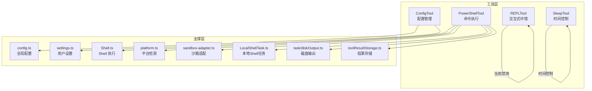
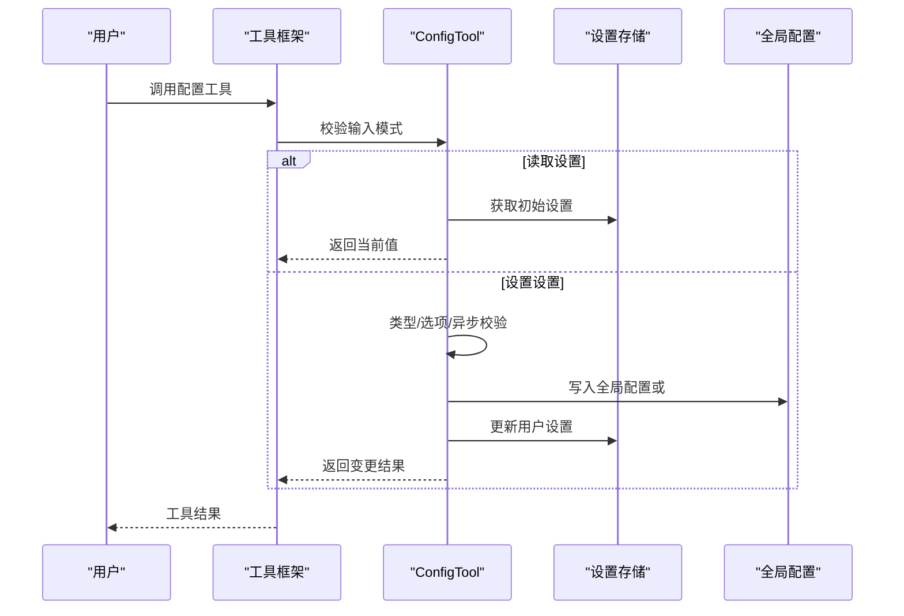
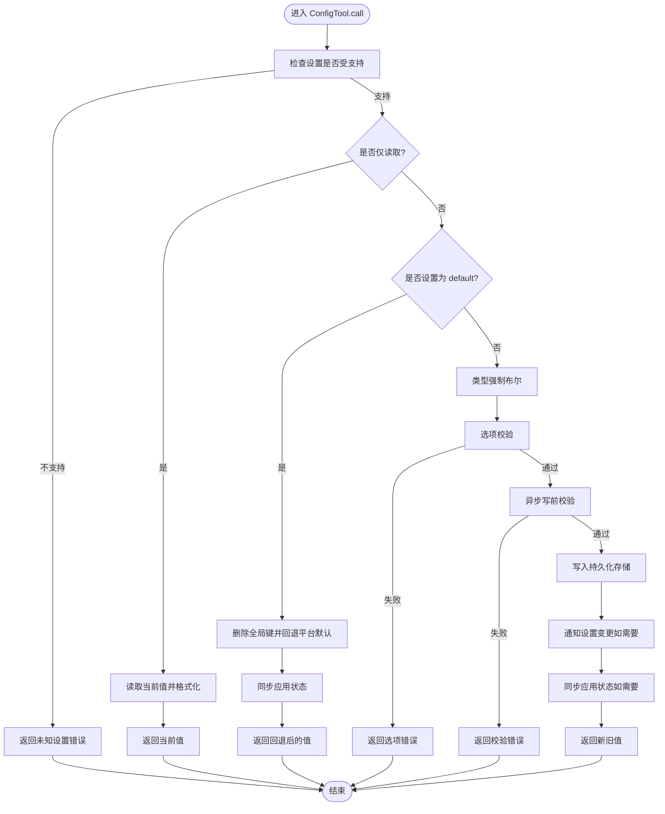
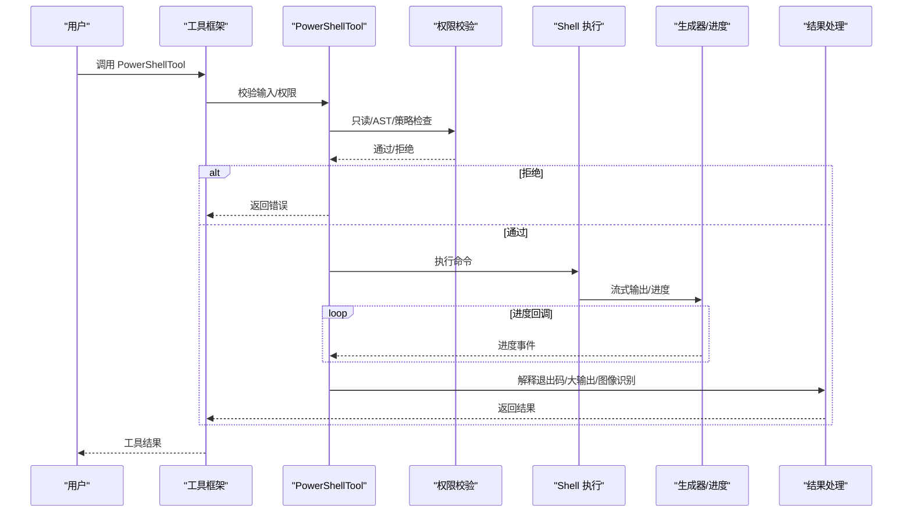
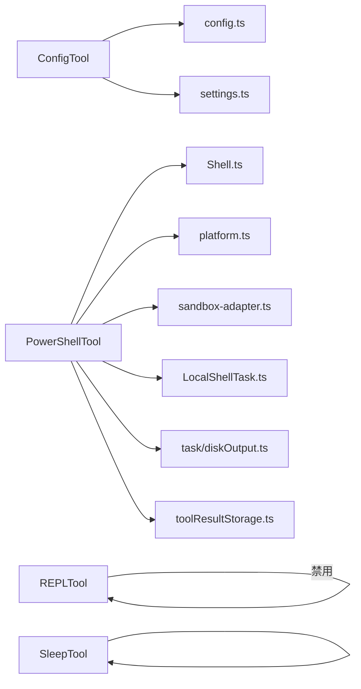

# 系统控制工具

<cite>
**本文引用的文件**
- [ConfigTool.ts](file://src/tools/ConfigTool/ConfigTool.ts)
- [PowerShellTool.tsx](file://src/tools/PowerShellTool/PowerShellTool.tsx)
- [REPLTool.js](file://src/tools/REPLTool/REPLTool.js)
- [SleepTool.ts](file://src/tools/SleepTool/SleepTool.ts)
- [config.ts](file://src/utils/config.ts)
- [settings.ts](file://src/utils/settings/settings.ts)
- [shell.ts](file://src/utils/Shell.ts)
- [platform.ts](file://src/utils/platform.ts)
- [sandbox-adapter.ts](file://src/utils/sandbox/sandbox-adapter.ts)
- [task/diskOutput.ts](file://src/utils/task/diskOutput.ts)
- [toolResultStorage.ts](file://src/utils/toolResultStorage.ts)
- [LocalShellTask.ts](file://src/tasks/LocalShellTask/LocalShellTask.ts)
- [promptShellExecution.ts](file://src/screens/REPL/promptShellExecution.ts)
- [prompt.js](file://src/tools/PowerShellTool/prompt.js)
- [readOnlyValidation.js](file://src/tools/PowerShellTool/readOnlyValidation.js)
- [commandSemantics.js](file://src/tools/PowerShellTool/commandSemantics.js)
- [powershellPermissions.js](file://src/tools/PowerShellTool/powershellPermissions.js)
- [toolName.js](file://src/tools/PowerShellTool/toolName.js)
- [UI.js](file://src/tools/PowerShellTool/UI.js)
- [constants.js](file://src/tools/ConfigTool/constants.js)
- [supportedSettings.js](file://src/tools/ConfigTool/supportedSettings.js)
- [prompt.js](file://src/tools/ConfigTool/prompt.js)
- [UI.js](file://src/tools/ConfigTool/UI.js)
- [voiceModeEnabled.js](file://src/voice/voiceModeEnabled.js)
- [voiceStreamSTT.js](file://src/services/voiceStreamSTT.js)
- [voice.js](file://src/services/voice.js)
- [auth.js](file://src/utils/auth.js)
- [changeDetector.js](file://src/utils/settings/changeDetector.js)
- [analytics/index.js](file://src/services/analytics/index.js)
- [errors.js](file://src/utils/errors.js)
- [log.js](file://src/utils/log.js)
- [terminal.js](file://src/utils/terminal.js)
- [format.js](file://src/utils/format.js)
- [lazySchema.js](file://src/utils/lazySchema.js)
- [semanticBoolean.js](file://src/utils/semanticBoolean.js)
- [semanticNumber.js](file://src/utils/semanticNumber.js)
- [shell/powershellDetection.js](file://src/utils/shell/powershellDetection.js)
- [stringUtils.js](file://src/utils/stringUtils.js)
- [TaskOutput.js](file://src/utils/task/TaskOutput.js)
- [gitOperationTracking.js](file://src/utils/plugins/gitOperationTracking.js)
- [shouldUseSandbox.js](file://src/tools/BashTool/shouldUseSandbox.js)
- [UI.js](file://src/tools/BashTool/UI.js)
- [utils.js](file://src/tools/BashTool/utils.js)
- [shared/gitOperationTracking.js](file://src/tools/shared/gitOperationTracking.js)
- [index.ts](file://src/replLauncher.tsx)
- [REPL.tsx](file://src/screens/REPL.tsx)
</cite>

## 目录
1. [简介](#简介)
2. [项目结构](#项目结构)
3. [核心组件](#核心组件)
4. [架构总览](#架构总览)
5. [详细组件分析](#详细组件分析)
6. [依赖关系分析](#依赖关系分析)
7. [性能考量](#性能考量)
8. [故障排查指南](#故障排查指南)
9. [结论](#结论)
10. [附录](#附录)

## 简介
本技术文档聚焦“系统控制工具”系列，围绕以下目标展开：配置管理工具（ConfigTool）的设置项管理、验证机制与持久化存储；PowerShell 工具（PowerShellTool）的命令执行、参数传递与跨平台兼容；REPL 工具（REPLTool）的交互式编程环境与调试支持现状；以及睡眠工具（SleepTool）的时间控制、唤醒机制与系统集成。同时提供使用场景与最佳实践，覆盖自动化脚本、系统监控与故障诊断等典型应用。

## 项目结构
系统控制工具位于 src/tools 下，按功能模块划分：
- 配置管理：ConfigTool 及其支持文件（设置项定义、提示词、UI 渲染）
- 命令执行：PowerShellTool（含权限校验、只读检测、输出处理、后台任务）
- 交互式环境：REPLTool（当前处于禁用态）
- 时间控制：SleepTool（时间控制与唤醒）

图表来源
- [ConfigTool.ts:67-434](file://src/tools/ConfigTool/ConfigTool.ts#L67-L434)
- [PowerShellTool.tsx:400-840](file://src/tools/PowerShellTool/PowerShellTool.tsx#L400-L840)
- [REPLTool.js:1-2](file://src/tools/REPLTool/REPLTool.js#L1-L2)
- [SleepTool.ts](file://src/tools/SleepTool/SleepTool.ts)
- [config.ts](file://src/utils/config.ts)
- [settings.ts](file://src/utils/settings/settings.ts)
- [shell.ts](file://src/utils/Shell.ts)
- [platform.ts](file://src/utils/platform.ts)
- [sandbox-adapter.ts](file://src/utils/sandbox/sandbox-adapter.ts)
- [LocalShellTask.ts](file://src/tasks/LocalShellTask/LocalShellTask.ts)
- [task/diskOutput.ts](file://src/utils/task/diskOutput.ts)
- [toolResultStorage.ts](file://src/utils/toolResultStorage.ts)

章节来源
- [ConfigTool.ts:1-468](file://src/tools/ConfigTool/ConfigTool.ts#L1-L468)
- [PowerShellTool.tsx:1-1268](file://src/tools/PowerShellTool/PowerShellTool.tsx#L1-L1268)
- [REPLTool.js:1-2](file://src/tools/REPLTool/REPLTool.js#L1-L2)
- [SleepTool.ts](file://src/tools/SleepTool/SleepTool.ts)

## 核心组件
- 配置管理工具（ConfigTool）
  - 支持读取/设置多种设置项，内置类型校验、选项限制、异步写前校验与格式化读取
  - 持久化到全局配置或用户设置源，并在必要时同步到应用状态
- PowerShell 工具（PowerShellTool）
  - 提供命令执行、参数传递、只读检测、安全校验、进度回调、后台任务与大输出落盘
  - 跨平台兼容：在 Windows 原生环境下遵循企业策略与沙箱限制
- REPL 工具（REPLTool）
  - 当前处于禁用态，后续可扩展为交互式编程与调试支持
- 睡眠工具（SleepTool）
  - 提供时间控制与唤醒机制，便于自动化流程中的延时与系统集成

章节来源
- [ConfigTool.ts:67-434](file://src/tools/ConfigTool/ConfigTool.ts#L67-L434)
- [PowerShellTool.tsx:400-840](file://src/tools/PowerShellTool/PowerShellTool.tsx#L400-L840)
- [REPLTool.js:1-2](file://src/tools/REPLTool/REPLTool.js#L1-L2)
- [SleepTool.ts](file://src/tools/SleepTool/SleepTool.ts)

## 架构总览
系统控制工具通过统一的工具框架构建，输入输出采用 Zod 模式校验，权限与安全在调用前进行严格检查。PowerShell 工具在执行路径中贯穿“只读检测—权限校验—沙箱策略—命令执行—进度回调—结果处理”的闭环；ConfigTool 在设置变更时进行格式化读取、选项校验、异步验证与持久化。

图表来源
- [ConfigTool.ts:111-411](file://src/tools/ConfigTool/ConfigTool.ts#L111-L411)
- [config.ts](file://src/utils/config.ts)
- [settings.ts](file://src/utils/settings/settings.ts)

## 详细组件分析

### 配置管理工具（ConfigTool）
- 功能要点
  - 输入/输出模式：严格对象结构，支持字符串/布尔/数字值，可选获取或设置
  - 设置项支持：基于支持清单判断是否受支持，对特定设置（如语音）进行运行时门控
  - 读取流程：格式化读取器（formatOnRead）用于展示友好值
  - 设置流程：类型强制（布尔）、选项列表校验、异步写前校验（validateOnWrite）
  - 权限与安全：读取自动放行，设置需权限弹窗确认
  - 持久化：全局配置写入全局配置，用户设置写入用户设置源；部分设置同步到应用状态以触发即时 UI 更新
  - 特殊键：remoteControlAtStartup 的“default”语义用于回退平台默认值
- 数据流与复杂度
  - 读取：O(k)（k 为路径层级），依赖配置源与初始设置缓存
  - 设置：O(k)（路径构建）+ 校验开销，写入为常数级更新
- 错误处理
  - 未知设置、非法值、异步校验失败、权限拒绝、平台门控等均有明确错误返回
- 最佳实践
  - 使用选项列表限制枚举值，避免歧义
  - 对外部服务的设置采用异步校验，提前发现无效配置
  - 对影响 UI 的设置使用 appStateKey 同步应用状态

图表来源
- [ConfigTool.ts:111-411](file://src/tools/ConfigTool/ConfigTool.ts#L111-L411)
- [supportedSettings.js](file://src/tools/ConfigTool/supportedSettings.js)
- [constants.js](file://src/tools/ConfigTool/constants.js)
- [prompt.js](file://src/tools/ConfigTool/prompt.js)
- [UI.js](file://src/tools/ConfigTool/UI.js)

章节来源
- [ConfigTool.ts:36-62](file://src/tools/ConfigTool/ConfigTool.ts#L36-L62)
- [ConfigTool.ts:98-107](file://src/tools/ConfigTool/ConfigTool.ts#L98-L107)
- [ConfigTool.ts:111-411](file://src/tools/ConfigTool/ConfigTool.ts#L111-L411)
- [supportedSettings.js](file://src/tools/ConfigTool/supportedSettings.js)
- [constants.js](file://src/tools/ConfigTool/constants.js)
- [prompt.js](file://src/tools/ConfigTool/prompt.js)
- [UI.js](file://src/tools/ConfigTool/UI.js)

### PowerShell 工具（PowerShellTool）
- 功能要点
  - 命令执行：封装 Shell 执行、输出累积、图像输出识别、大输出落盘与预览
  - 参数传递：command、timeout、description、run_in_background、dangerouslyDisableSandbox
  - 只读检测：同步安全启发式（正则）+ 异步 AST 解析（权限校验阶段）
  - 安全与权限：Windows 原生沙箱策略拒绝、阻塞式 sleep 检测、后台任务预算
  - 进度与回调：生成器驱动的进度事件，支持长时间运行命令
  - 输出处理：截断、预览、大文件链接/复制、插件提示提取与清理
- 跨平台兼容
  - Windows 原生：企业策略要求沙箱且不可用时直接拒绝执行
  - 其他平台：遵循通用沙箱策略与权限模型
- 数据流与复杂度
  - 执行路径：输入校验 → 权限校验 → 命令生成器 → 进度回调 → 结果解释 → 大输出处理 → 返回
  - 复杂度近似：O(n)（n 为输出字节数），大输出落盘为 O(m)（m 为文件大小）
- 错误处理
  - 预飞行哨兵（preSpawnError）直接抛错，避免误计数
  - 用户中断与超时区分处理，ShellError 抛出由上层统一处理
- 最佳实践
  - 长耗时命令使用 run_in_background，避免阻塞对话
  - 对可能产生图像输出的命令启用图像识别
  - 使用 description 提升可读性，便于审计与复现

图表来源
- [PowerShellTool.tsx:491-840](file://src/tools/PowerShellTool/PowerShellTool.tsx#L491-L840)
- [promptShellExecution.ts](file://src/screens/REPL/promptShellExecution.ts)
- [prompt.js](file://src/tools/PowerShellTool/prompt.js)
- [readOnlyValidation.js](file://src/tools/PowerShellTool/readOnlyValidation.js)
- [commandSemantics.js](file://src/tools/PowerShellTool/commandSemantics.js)
- [powershellPermissions.js](file://src/tools/PowerShellTool/powershellPermissions.js)
- [toolName.js](file://src/tools/PowerShellTool/toolName.js)
- [UI.js](file://src/tools/PowerShellTool/UI.js)
- [shell.ts](file://src/utils/Shell.ts)
- [LocalShellTask.ts](file://src/tasks/LocalShellTask/LocalShellTask.ts)
- [task/diskOutput.ts](file://src/utils/task/diskOutput.ts)
- [toolResultStorage.ts](file://src/utils/toolResultStorage.ts)
- [platform.ts](file://src/utils/platform.ts)
- [sandbox-adapter.ts](file://src/utils/sandbox/sandbox-adapter.ts)

章节来源
- [PowerShellTool.tsx:277-354](file://src/tools/PowerShellTool/PowerShellTool.tsx#L277-L354)
- [PowerShellTool.tsx:491-522](file://src/tools/PowerShellTool/PowerShellTool.tsx#L491-L522)
- [PowerShellTool.tsx:595-840](file://src/tools/PowerShellTool/PowerShellTool.tsx#L595-L840)
- [promptShellExecution.ts](file://src/screens/REPL/promptShellExecution.ts)
- [prompt.js](file://src/tools/PowerShellTool/prompt.js)
- [readOnlyValidation.js](file://src/tools/PowerShellTool/readOnlyValidation.js)
- [commandSemantics.js](file://src/tools/PowerShellTool/commandSemantics.js)
- [powershellPermissions.js](file://src/tools/PowerShellTool/powershellPermissions.js)
- [toolName.js](file://src/tools/PowerShellTool/toolName.js)
- [UI.js](file://src/tools/PowerShellTool/UI.js)
- [shell.ts](file://src/utils/Shell.ts)
- [LocalShellTask.ts](file://src/tasks/LocalShellTask/LocalShellTask.ts)
- [task/diskOutput.ts](file://src/utils/task/diskOutput.ts)
- [toolResultStorage.ts](file://src/utils/toolResultStorage.ts)
- [platform.ts](file://src/utils/platform.ts)
- [sandbox-adapter.ts](file://src/utils/sandbox/sandbox-adapter.ts)

### REPL 工具（REPLTool）
- 现状
  - 当前实现为占位，isEnabled 返回 false，未提供交互式编程与调试能力
- 后续建议
  - 基于现有 REPL 屏幕与桥接机制扩展，提供命令执行、历史记录、补全与调试会话
  - 与 PowerShell/Shell 工具共享权限与安全策略，确保一致的执行体验

章节来源
- [REPLTool.js:1-2](file://src/tools/REPLTool/REPLTool.js#L1-L2)
- [index.ts](file://src/replLauncher.tsx)
- [REPL.tsx](file://src/screens/REPL.tsx)

### 睡眠工具（SleepTool）
- 功能要点
  - 提供时间控制与唤醒机制，便于自动化流程中的延时
  - 与系统集成：可作为定时任务或流程节点的一部分
- 使用建议
  - 在长流程中使用后台任务或子代理，避免阻塞主线程
  - 对需要精确唤醒的场景，结合监控工具进行事件驱动

章节来源
- [SleepTool.ts](file://src/tools/SleepTool/SleepTool.ts)

## 依赖关系分析
- 组件耦合
  - ConfigTool 依赖配置与设置存储，耦合度低，内聚高
  - PowerShellTool 依赖 Shell、平台、沙箱、任务与输出存储，耦合度较高但职责清晰
- 外部依赖
  - 平台检测与沙箱策略决定执行路径
  - 文件系统用于大输出落盘与结果存储
- 循环依赖
  - 未见循环依赖迹象，各模块边界清晰

图表来源
- [ConfigTool.ts:1-468](file://src/tools/ConfigTool/ConfigTool.ts#L1-L468)
- [PowerShellTool.tsx:1-1268](file://src/tools/PowerShellTool/PowerShellTool.tsx#L1-L1268)
- [REPLTool.js:1-2](file://src/tools/REPLTool/REPLTool.js#L1-L2)
- [SleepTool.ts](file://src/tools/SleepTool/SleepTool.ts)
- [config.ts](file://src/utils/config.ts)
- [settings.ts](file://src/utils/settings/settings.ts)
- [shell.ts](file://src/utils/Shell.ts)
- [platform.ts](file://src/utils/platform.ts)
- [sandbox-adapter.ts](file://src/utils/sandbox/sandbox-adapter.ts)
- [LocalShellTask.ts](file://src/tasks/LocalShellTask/LocalShellTask.ts)
- [task/diskOutput.ts](file://src/utils/task/diskOutput.ts)
- [toolResultStorage.ts](file://src/utils/toolResultStorage.ts)

章节来源
- [ConfigTool.ts:1-468](file://src/tools/ConfigTool/ConfigTool.ts#L1-L468)
- [PowerShellTool.tsx:1-1268](file://src/tools/PowerShellTool/PowerShellTool.tsx#L1-L1268)
- [REPLTool.js:1-2](file://src/tools/REPLTool/REPLTool.js#L1-L2)
- [SleepTool.ts](file://src/tools/SleepTool/SleepTool.ts)

## 性能考量
- PowerShell 工具
  - 大输出落盘：超过阈值时复制/链接至工具结果目录，避免内存压力
  - 进度回调：生成器驱动，降低 UI 卡顿
  - 后台任务：长命令自动后台化，保持对话响应性
- 配置工具
  - 读取路径短、格式化读取可减少显示成本
  - 异步校验仅在设置时触发，避免频繁 IO
- 建议
  - 对高频设置操作使用缓存与批量更新
  - 对大输出场景优先使用落盘而非内存驻留

## 故障排查指南
- PowerShell 工具
  - Windows 原生沙箱策略拒绝：检查企业策略与沙箱开关，必要时调整执行模式
  - 阻塞式 sleep：使用 run_in_background 或 Monitor 工具替代
  - 输出过大：查看 persistedOutputPath 与 persistedOutputSize，确认落盘位置
  - 用户中断 vs 超时：区分 abortController.signal.reason，避免误判
- 配置工具
  - 未知设置：核对 supportedSettings 列表与门控逻辑
  - 选项错误：确认允许值集合，避免拼写差异
  - 异步校验失败：根据返回错误信息修正配置
- 通用
  - 查看日志与错误消息，定位具体环节
  - 使用 analytics 事件与错误追踪辅助定位问题

章节来源
- [PowerShellTool.tsx:491-522](file://src/tools/PowerShellTool/PowerShellTool.tsx#L491-L522)
- [PowerShellTool.tsx:595-840](file://src/tools/PowerShellTool/PowerShellTool.tsx#L595-L840)
- [errors.js](file://src/utils/errors.js)
- [log.js](file://src/utils/log.js)
- [analytics/index.js](file://src/services/analytics/index.js)

## 结论
系统控制工具系列在配置管理、命令执行、交互式环境与时间控制方面提供了清晰的模块化设计。ConfigTool 通过严格的模式校验与持久化策略保障设置一致性；PowerShellTool 在跨平台与安全策略下实现了稳健的命令执行与输出管理；REPLTool 当前处于禁用态，具备扩展潜力；SleepTool 提供基础的时间控制能力。建议在生产环境中结合后台任务、权限校验与输出落盘策略，提升稳定性与可观测性。

## 附录
- 使用场景与最佳实践
  - 自动化脚本：使用 PowerShellTool 的 run_in_background 与大输出落盘，配合 SleepTool 实现延时与节流
  - 系统监控：结合 Monitor 工具与 PowerShellTool 的只读命令，持续采集系统指标
  - 故障诊断：利用 PowerShellTool 的进度回调与图像识别，快速定位问题并输出可视化结果
  - 配置治理：通过 ConfigTool 的异步校验与选项约束，确保关键配置的有效性与一致性