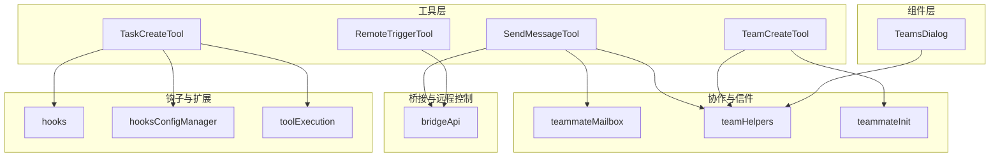
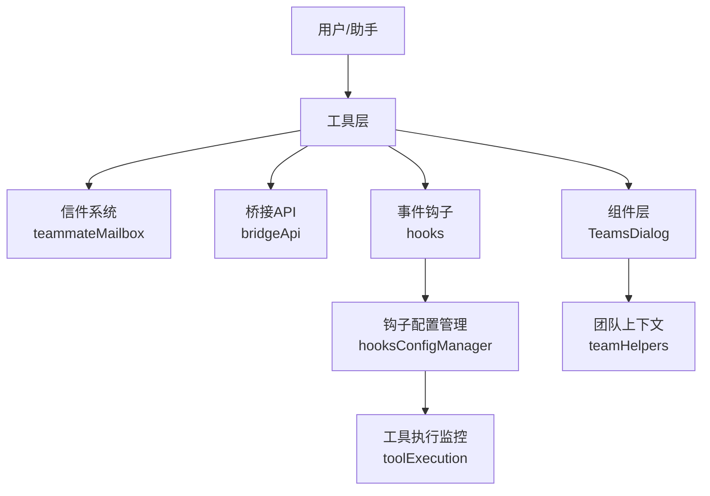
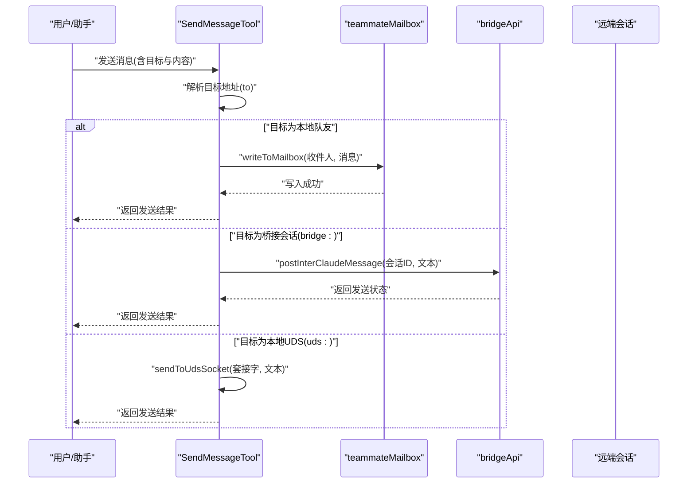
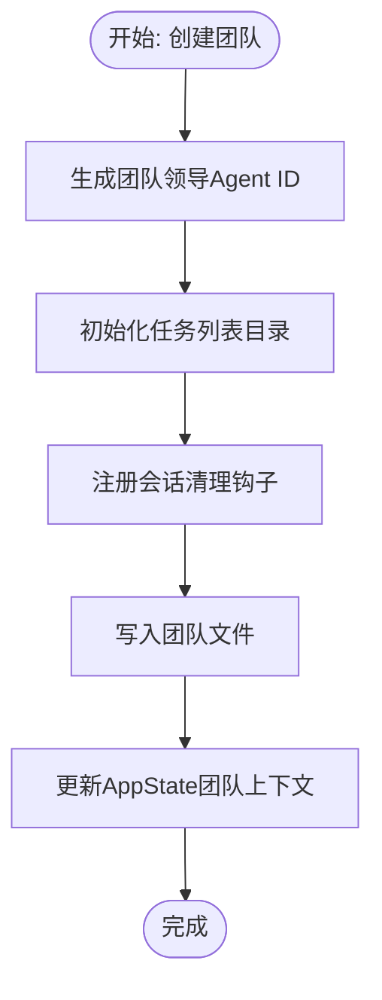
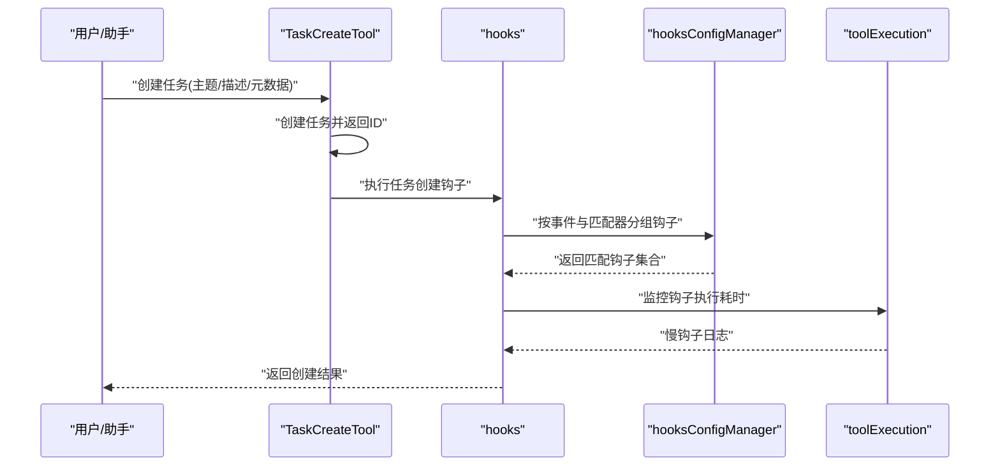
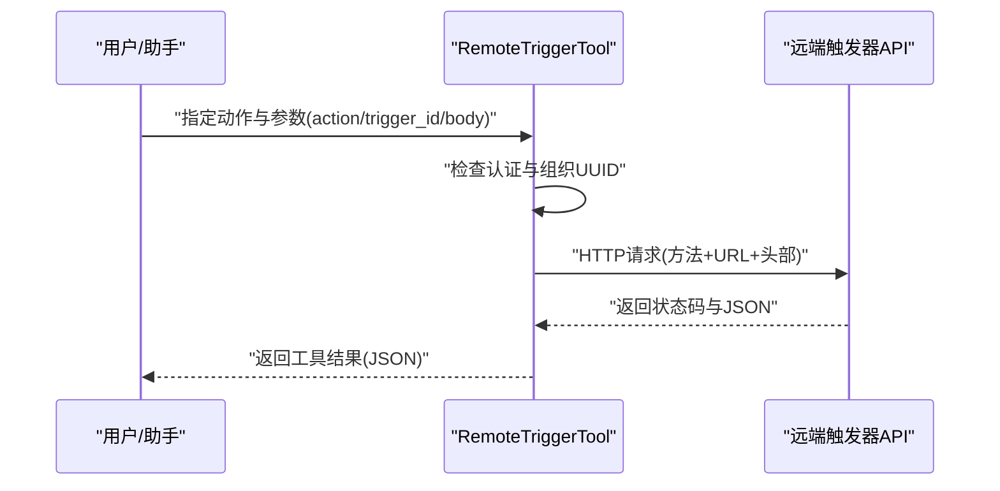
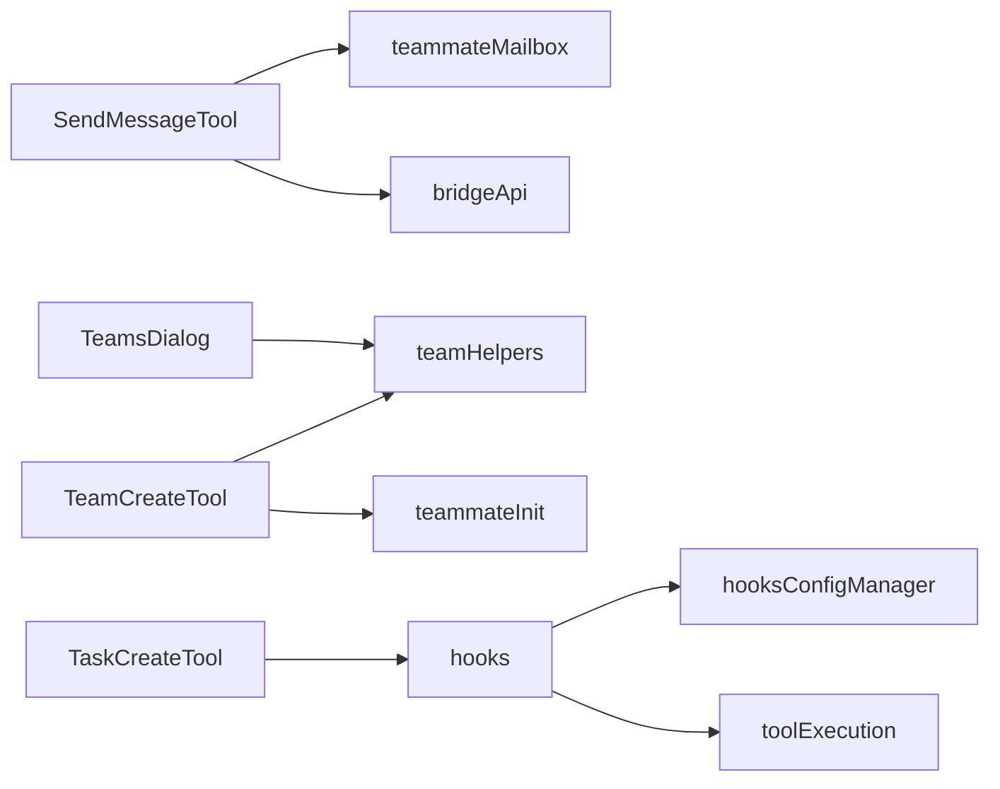

# 通信与协作工具

<cite>
**本文引用的文件**
- [bridgeApi.ts](file://src/bridge/bridgeApi.ts)
- [SendMessageTool.ts](file://src/tools/SendMessageTool/SendMessageTool.ts)
- [TeamCreateTool.ts](file://src/tools/TeamCreateTool/TeamCreateTool.ts)
- [TaskCreateTool.ts](file://src/tools/TaskCreateTool/TaskCreateTool.ts)
- [RemoteTriggerTool.ts](file://src/tools/RemoteTriggerTool/RemoteTriggerTool.ts)
- [teammateMailbox.ts](file://src/utils/teammateMailbox.ts)
- [teamHelpers.ts](file://src/utils/swarm/teamHelpers.ts)
- [hooks.ts](file://src/utils/hooks.ts)
- [toolExecution.ts](file://src/services/tools/toolExecution.ts)
- [hooksConfigManager.ts](file://src/utils/hooks/hooksConfigManager.ts)
- [teamsDialog.tsx](file://src/components/teams/TeamsDialog.tsx)
- [teammateInit.ts](file://src/utils/swarm/teammateInit.ts)
- [taskListTool.ts](file://src/tools/TaskListTool/TaskListTool.ts)
- [taskGetTool.ts](file://src/tools/TaskGetTool/TaskGetTool.ts)
- [taskUpdateTool.ts](file://src/tools/TaskUpdateTool/TaskUpdateTool.ts)
- [taskStopTool.ts](file://src/tools/TaskStopTool/TaskStopTool.ts)
- [taskOutputTool.ts](file://src/tools/TaskOutputTool/TaskOutputTool.ts)
</cite>

## 目录
1. [简介](#简介)
2. [项目结构](#项目结构)
3. [核心组件](#核心组件)
4. [架构总览](#架构总览)
5. [详细组件分析](#详细组件分析)
6. [依赖关系分析](#依赖关系分析)
7. [性能考量](#性能考量)
8. [故障排查指南](#故障排查指南)
9. [结论](#结论)
10. [附录](#附录)

## 简介
本技术文档聚焦于通信与协作工具系列，涵盖以下能力：
- 消息发送工具：基于内部信件系统（inbox）的同进程消息传递、跨会话桥接消息（Remote Control）、以及结构化消息协议（如关机请求/响应、计划审批等）。
- 团队创建工具：团队生命周期管理、成员管理、权限模式分配与同步、协作流程支持。
- 任务管理工具：任务创建、状态跟踪、进度监控与钩子扩展。
- 远程触发工具：事件驱动机制、远程执行与状态同步。

文档同时提供使用场景与工作流程示例，帮助读者在团队项目管理、任务分配与远程协作中高效落地。

## 项目结构
该仓库采用多模块组织方式，协作相关能力主要分布在以下区域：
- 工具层：tools 目录下包含具体工具实现（SendMessage、TeamCreate、TaskCreate、RemoteTrigger 等）。
- 协作与信件：utils 下的 teammateMailbox、swarm 相关工具负责团队与消息传递。
- 桥接与远程控制：bridge 子系统提供与远端会话的桥接能力。
- 钩子与扩展：hooks.ts 提供事件钩子机制，支持任务创建等关键节点的扩展。
- 组件层：components 提供 UI 交互（如 TeamsDialog），辅助团队与权限模式的可视化管理。

**图表来源**
- [SendMessageTool.ts:1-918](file://src/tools/SendMessageTool/SendMessageTool.ts#L1-L918)
- [TeamCreateTool.ts:1-241](file://src/tools/TeamCreateTool/TeamCreateTool.ts#L1-L241)
- [TaskCreateTool.ts:1-139](file://src/tools/TaskCreateTool/TaskCreateTool.ts#L1-L139)
- [RemoteTriggerTool.ts:1-162](file://src/tools/RemoteTriggerTool/RemoteTriggerTool.ts#L1-L162)
- [teammateMailbox.ts:1027-1062](file://src/utils/teammateMailbox.ts#L1027-L1062)
- [teamHelpers.ts:319-445](file://src/utils/swarm/teamHelpers.ts#L319-L445)
- [teammateInit.ts:42-83](file://src/utils/swarm/teammateInit.ts#L42-L83)
- [hooks.ts:1751-4103](file://src/utils/hooks.ts#L1751-L4103)
- [hooksConfigManager.ts:269-320](file://src/utils/hooks/hooksConfigManager.ts#L269-L320)
- [toolExecution.ts:1521-1538](file://src/services/tools/toolExecution.ts#L1521-L1538)
- [teamsDialog.tsx:744-796](file://src/components/teams/TeamsDialog.tsx#L744-L796)

**章节来源**
- [SendMessageTool.ts:1-918](file://src/tools/SendMessageTool/SendMessageTool.ts#L1-L918)
- [TeamCreateTool.ts:1-241](file://src/tools/TeamCreateTool/TeamCreateTool.ts#L1-L241)
- [TaskCreateTool.ts:1-139](file://src/tools/TaskCreateTool/TaskCreateTool.ts#L1-L139)
- [RemoteTriggerTool.ts:1-162](file://src/tools/RemoteTriggerTool/RemoteTriggerTool.ts#L1-L162)

## 核心组件
- 消息发送工具（SendMessageTool）
  - 支持点对点消息、广播、以及结构化消息（关机请求/响应、计划审批响应）。
  - 内置信件系统写入与路由信息生成；支持跨会话桥接（bridge:）与本地 Unix Domain Socket（uds:）。
  - 输入校验严格，确保摘要、目标地址、消息类型一致性。
- 团队创建工具（TeamCreateTool）
  - 创建团队、初始化任务列表、注册清理钩子、设置团队上下文。
  - 自动生成团队领导 agent ID，记录会话与模型信息，便于后续协作。
- 任务管理工具（TaskCreateTool）
  - 创建任务并自动展开任务视图；执行任务创建钩子，支持阻断式错误处理。
  - 输出映射将结果转换为用户可读的工具结果块。
- 远程触发工具（RemoteTriggerTool）
  - 基于 OAuth 认证访问远端触发器 API，支持列出、查询、创建、更新与运行触发器。
  - 通过组织 UUID 与特性开关进行策略控制与合规限制。

**章节来源**
- [SendMessageTool.ts:520-918](file://src/tools/SendMessageTool/SendMessageTool.ts#L520-L918)
- [TeamCreateTool.ts:74-241](file://src/tools/TeamCreateTool/TeamCreateTool.ts#L74-L241)
- [TaskCreateTool.ts:48-139](file://src/tools/TaskCreateTool/TaskCreateTool.ts#L48-L139)
- [RemoteTriggerTool.ts:46-162](file://src/tools/RemoteTriggerTool/RemoteTriggerTool.ts#L46-L162)

## 架构总览
整体架构围绕“工具层 + 协作引擎 + 钩子扩展 + 组件交互”的模式构建：
- 工具层：各工具封装输入校验、权限检查、调用后端或本地服务、输出映射。
- 协作引擎：通过 teammateMailbox 实现同进程消息传递；通过 bridgeApi 提供跨会话桥接。
- 钩子扩展：hooks.ts 定义事件钩子，hooksConfigManager 负责分组与匹配，toolExecution 监控钩子耗时。
- 组件交互：TeamsDialog 提供团队与权限模式的可视化操作入口。

**图表来源**
- [bridgeApi.ts:68-452](file://src/bridge/bridgeApi.ts#L68-L452)
- [SendMessageTool.ts:149-918](file://src/tools/SendMessageTool/SendMessageTool.ts#L149-L918)
- [hooks.ts:1751-4103](file://src/utils/hooks.ts#L1751-L4103)
- [hooksConfigManager.ts:269-320](file://src/utils/hooks/hooksConfigManager.ts#L269-L320)
- [toolExecution.ts:1521-1538](file://src/services/tools/toolExecution.ts#L1521-L1538)
- [teamsDialog.tsx:744-796](file://src/components/teams/TeamsDialog.tsx#L744-L796)
- [teammateMailbox.ts:1027-1062](file://src/utils/teammateMailbox.ts#L1027-L1062)
- [teamHelpers.ts:319-445](file://src/utils/swarm/teamHelpers.ts#L319-L445)

## 详细组件分析

### 消息发送工具（通信协议、消息格式与传输机制）
- 通信协议与传输
  - 同进程消息：通过 writeToMailbox 将消息写入目标队友的 inbox，支持摘要预览与颜色标识。
  - 广播：遍历团队成员列表，逐个投递消息，返回成功广播的收件人列表。
  - 结构化消息：支持关机请求/响应、计划审批响应等，消息体包含类型、请求 ID、批准状态与反馈等字段。
  - 跨会话桥接：当目标地址为 bridge: 时，通过 postInterClaudeMessage 发送到远端会话；uds: 则通过本地 Unix Domain Socket 发送。
- 消息格式
  - 文本消息：要求提供摘要；结构化消息仅允许在同会话内使用。
  - 关机请求/响应：包含请求 ID、发起者、原因或批准状态。
  - 计划审批响应：包含请求 ID、批准状态、时间戳与继承的权限模式。
- 权限与安全
  - 对 bridge: 地址发送结构化消息需要显式用户同意，防止跨机器注入。
  - validateInput 对地址格式、摘要、消息类型进行严格校验。
- 传输机制
  - 本地消息直接写入；跨会话通过桥接 API 完成中转与投递。
  - 发送失败时返回错误信息，避免静默失败。

**图表来源**
- [SendMessageTool.ts:741-798](file://src/tools/SendMessageTool/SendMessageTool.ts#L741-L798)
- [bridgeApi.ts:141-452](file://src/bridge/bridgeApi.ts#L141-L452)
- [teammateMailbox.ts:1027-1062](file://src/utils/teammateMailbox.ts#L1027-L1062)

**章节来源**
- [SendMessageTool.ts:67-918](file://src/tools/SendMessageTool/SendMessageTool.ts#L67-L918)
- [bridgeApi.ts:68-452](file://src/bridge/bridgeApi.ts#L68-L452)
- [teammateMailbox.ts:1027-1062](file://src/utils/teammateMailbox.ts#L1027-L1062)

### 团队创建工具（成员管理、权限分配与协作流程）
- 成员管理
  - 创建团队时自动生成团队领导 agent ID，记录会话、模型、工作目录等信息。
  - 初始化任务列表目录，确保任务编号从 1 开始，便于项目管理。
  - 注册会话结束清理钩子，避免团队文件长期遗留。
- 权限分配与同步
  - 通过 TeamsDialog 可循环切换单个或全部队友的权限模式，批量更新避免竞态。
  - teammateInit 应用团队级允许路径规则，动态调整工具权限上下文。
- 协作流程
  - 团队上下文写入 AppState，供其他工具与组件共享。
  - 支持模式变更通知与同步，确保团队领导与成员权限一致。

**图表来源**
- [TeamCreateTool.ts:128-237](file://src/tools/TeamCreateTool/TeamCreateTool.ts#L128-L237)
- [teamHelpers.ts:319-445](file://src/utils/swarm/teamHelpers.ts#L319-L445)
- [teammateInit.ts:42-83](file://src/utils/swarm/teammateInit.ts#L42-L83)
- [teamsDialog.tsx:744-796](file://src/components/teams/TeamsDialog.tsx#L744-L796)

**章节来源**
- [TeamCreateTool.ts:74-241](file://src/tools/TeamCreateTool/TeamCreateTool.ts#L74-L241)
- [teamHelpers.ts:319-445](file://src/utils/swarm/teamHelpers.ts#L319-L445)
- [teammateInit.ts:42-83](file://src/utils/swarm/teammateInit.ts#L42-L83)
- [teamsDialog.tsx:744-796](file://src/components/teams/TeamsDialog.tsx#L744-L796)

### 任务管理工具（任务创建、状态跟踪与进度监控）
- 任务创建
  - 接收主题、描述、活动形态与元数据，创建任务并返回任务 ID 与主题。
  - 自动展开任务视图，便于用户立即查看新任务。
- 状态跟踪与进度监控
  - 通过 TaskListTool、TaskGetTool、TaskUpdateTool、TaskStopTool、TaskOutputTool 提供完整的 CRUD 与状态管理能力。
  - 任务创建钩子（executeTaskCreatedHooks）在创建后异步执行，支持阻断式错误处理。
- 钩子扩展
  - hooks.ts 定义多种事件钩子（PreToolUse、PostToolUse、TaskCreated、TaskCompleted 等）。
  - hooksConfigManager 按事件与匹配器分组钩子，提升执行效率。
  - toolExecution 监控钩子执行耗时，超过阈值进行日志提示。

**图表来源**
- [TaskCreateTool.ts:80-129](file://src/tools/TaskCreateTool/TaskCreateTool.ts#L80-L129)
- [hooks.ts:1751-4103](file://src/utils/hooks.ts#L1751-L4103)
- [hooksConfigManager.ts:269-320](file://src/utils/hooks/hooksConfigManager.ts#L269-L320)
- [toolExecution.ts:1521-1538](file://src/services/tools/toolExecution.ts#L1521-L1538)

**章节来源**
- [TaskCreateTool.ts:48-139](file://src/tools/TaskCreateTool/TaskCreateTool.ts#L48-L139)
- [hooks.ts:1751-4103](file://src/utils/hooks.ts#L1751-L4103)
- [hooksConfigManager.ts:269-320](file://src/utils/hooks/hooksConfigManager.ts#L269-L320)
- [toolExecution.ts:1521-1538](file://src/services/tools/toolExecution.ts#L1521-L1538)

### 远程触发工具（事件驱动机制、远程执行与状态同步）
- 事件驱动机制
  - 通过 action 参数选择 list、get、create、update、run 动作，分别对应不同 HTTP 方法与 URL。
  - 使用 AbortSignal 支持取消与超时控制，避免长时间阻塞。
- 远程执行与状态同步
  - 基于 OAuth 认证访问远端触发器 API，携带组织 UUID 与特性头，确保合规性与版本兼容。
  - 返回 HTTP 状态码与 JSON 数据，便于上层进行状态同步与错误处理。

**图表来源**
- [RemoteTriggerTool.ts:78-151](file://src/tools/RemoteTriggerTool/RemoteTriggerTool.ts#L78-L151)

**章节来源**
- [RemoteTriggerTool.ts:46-162](file://src/tools/RemoteTriggerTool/RemoteTriggerTool.ts#L46-L162)

## 依赖关系分析
- 工具到协作引擎
  - SendMessageTool 依赖 teammateMailbox 进行本地消息投递；当目标为 bridge: 时依赖 bridgeApi 完成跨会话传输。
  - TeamCreateTool 依赖 teamHelpers 与 teammateInit 管理团队文件与权限上下文。
  - TaskCreateTool 依赖 hooks.ts 与 hooksConfigManager 执行任务创建钩子。
- 组件到工具
  - TeamsDialog 通过 setMultipleMemberModes 批量更新权限模式，减少竞态风险。
- 钩子到执行监控
  - toolExecution 对钩子执行阶段进行耗时统计，慢钩子会触发日志提示，保障系统稳定性。

**图表来源**
- [SendMessageTool.ts:1-918](file://src/tools/SendMessageTool/SendMessageTool.ts#L1-L918)
- [bridgeApi.ts:68-452](file://src/bridge/bridgeApi.ts#L68-L452)
- [TeamCreateTool.ts:1-241](file://src/tools/TeamCreateTool/TeamCreateTool.ts#L1-L241)
- [teamHelpers.ts:319-445](file://src/utils/swarm/teamHelpers.ts#L319-L445)
- [teammateInit.ts:42-83](file://src/utils/swarm/teammateInit.ts#L42-L83)
- [TaskCreateTool.ts:1-139](file://src/tools/TaskCreateTool/TaskCreateTool.ts#L1-L139)
- [hooks.ts:1751-4103](file://src/utils/hooks.ts#L1751-L4103)
- [hooksConfigManager.ts:269-320](file://src/utils/hooks/hooksConfigManager.ts#L269-L320)
- [toolExecution.ts:1521-1538](file://src/services/tools/toolExecution.ts#L1521-L1538)
- [teamsDialog.tsx:744-796](file://src/components/teams/TeamsDialog.tsx#L744-L796)

**章节来源**
- [SendMessageTool.ts:1-918](file://src/tools/SendMessageTool/SendMessageTool.ts#L1-L918)
- [TeamCreateTool.ts:1-241](file://src/tools/TeamCreateTool/TeamCreateTool.ts#L1-L241)
- [TaskCreateTool.ts:1-139](file://src/tools/TaskCreateTool/TaskCreateTool.ts#L1-L139)
- [RemoteTriggerTool.ts:1-162](file://src/tools/RemoteTriggerTool/RemoteTriggerTool.ts#L1-L162)

## 性能考量
- 钩子执行耗时监控：toolExecution 在 PostToolUse 阶段记录钩子耗时，超过阈值进行日志提示，避免慢钩子拖累整体性能。
- 任务创建钩子：TaskCreateTool 在创建后异步执行钩子，若出现阻断式错误则回滚任务创建，保证一致性。
- 消息发送：SendMessageTool 对 bridge: 与 uds: 的发送路径进行条件分支与错误处理，避免无效重试与资源浪费。

**章节来源**
- [toolExecution.ts:1521-1538](file://src/services/tools/toolExecution.ts#L1521-L1538)
- [TaskCreateTool.ts:80-129](file://src/tools/TaskCreateTool/TaskCreateTool.ts#L80-L129)
- [SendMessageTool.ts:741-798](file://src/tools/SendMessageTool/SendMessageTool.ts#L741-L798)

## 故障排查指南
- 桥接连接问题
  - 当 bridge: 目标不可达或桥接未激活时，SendMessageTool 会在校验阶段拒绝发送并提示重新连接。
  - bridgeApi 对 401/403/404/410/429 等状态进行分类处理，抛出明确错误信息以便定位。
- 权限与模式问题
  - TeamsDialog 中批量更新权限模式时，若模式不一致先统一至默认模式再循环切换，避免竞态。
  - teammateInit 应用团队级允许路径规则，确保权限上下文与团队策略一致。
- 任务创建失败
  - TaskCreateTool 在执行任务创建钩子过程中收集阻断式错误并回滚任务，建议查看钩子日志定位问题。
- 远程触发失败
  - RemoteTriggerTool 返回 HTTP 状态码与 JSON，结合日志与组织 UUID 校验进行排查。

**章节来源**
- [SendMessageTool.ts:631-656](file://src/tools/SendMessageTool/SendMessageTool.ts#L631-L656)
- [bridgeApi.ts:454-508](file://src/bridge/bridgeApi.ts#L454-L508)
- [teamsDialog.tsx:764-796](file://src/components/teams/TeamsDialog.tsx#L764-L796)
- [teammateInit.ts:42-83](file://src/utils/swarm/teammateInit.ts#L42-L83)
- [TaskCreateTool.ts:110-113](file://src/tools/TaskCreateTool/TaskCreateTool.ts#L110-L113)
- [RemoteTriggerTool.ts:135-151](file://src/tools/RemoteTriggerTool/RemoteTriggerTool.ts#L135-L151)

## 结论
本通信与协作工具体系通过“工具层 + 协作引擎 + 钩子扩展 + 组件交互”的架构实现了：
- 高内聚的消息传递（本地与跨会话）、严格的输入校验与安全策略；
- 完整的团队生命周期管理与权限模式同步；
- 可扩展的任务创建与钩子机制；
- 合规的远程触发与状态同步。

这些能力共同支撑了团队项目管理、任务分配与远程协作的最佳实践，既满足日常开发需求，又具备良好的扩展性与可观测性。

## 附录
- 使用场景与工作流程示例（概念性说明）
  - 团队项目管理：通过 TeamCreateTool 创建团队，TeamsDialog 调整权限模式，TaskCreateTool 创建任务，随后使用 TaskListTool/TaskGetTool/TaskUpdateTool/TaskStopTool/TaskOutputTool 进行状态跟踪与进度监控。
  - 任务分配：团队领导在 TeamsDialog 中批量切换成员权限模式，确保成员具备相应工具权限；通过 SendMessageTool 发送任务分配消息与摘要预览。
  - 远程协作：在本地通过 bridgeApi 与远端会话建立桥接，使用 SendMessageTool 的 bridge: 目标发送文本消息；必要时通过 RemoteTriggerTool 触发远端自动化流程并同步状态。

[本节为概念性内容，无需“章节来源”与“图表来源”]