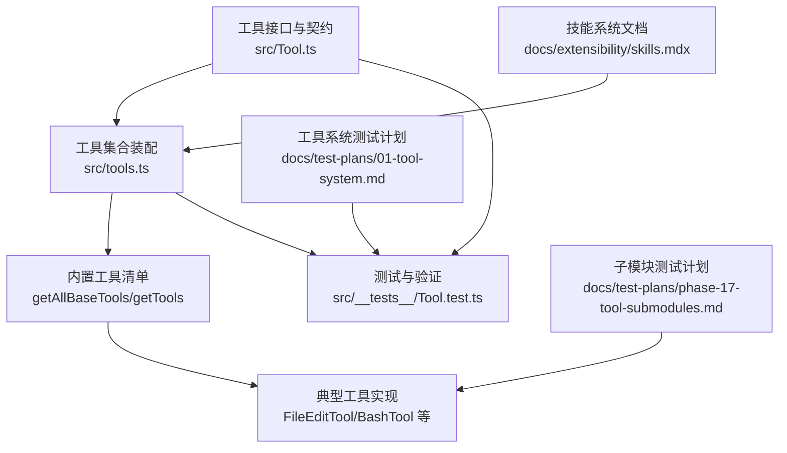
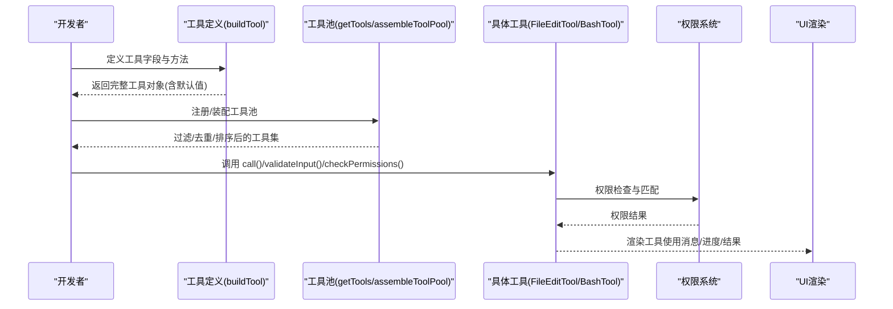
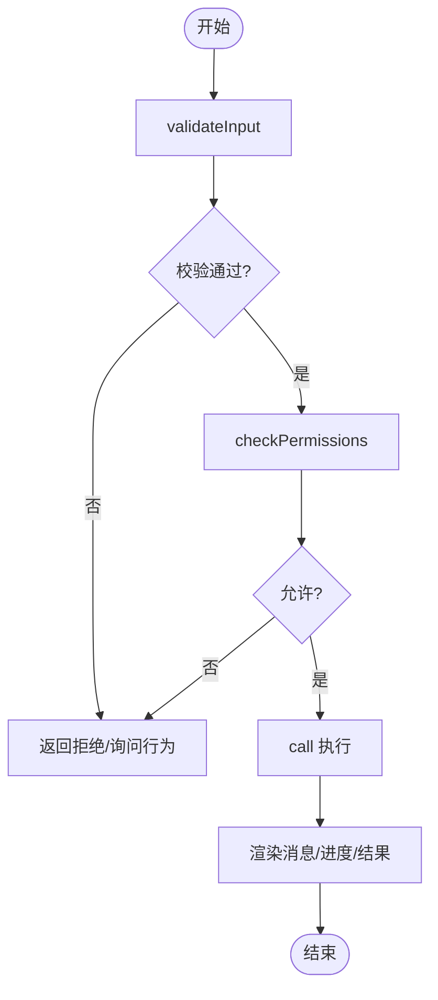
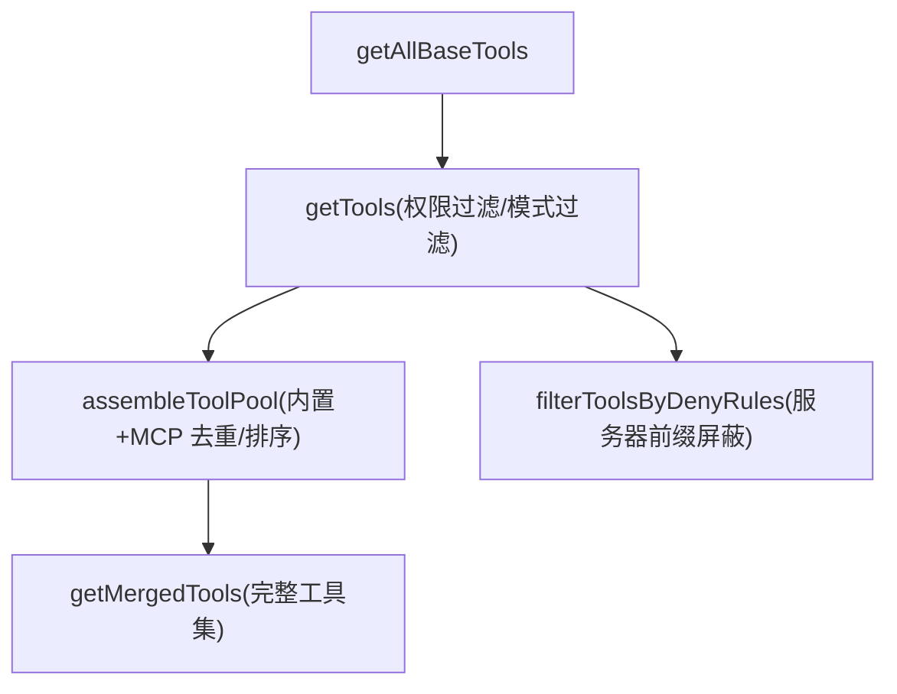
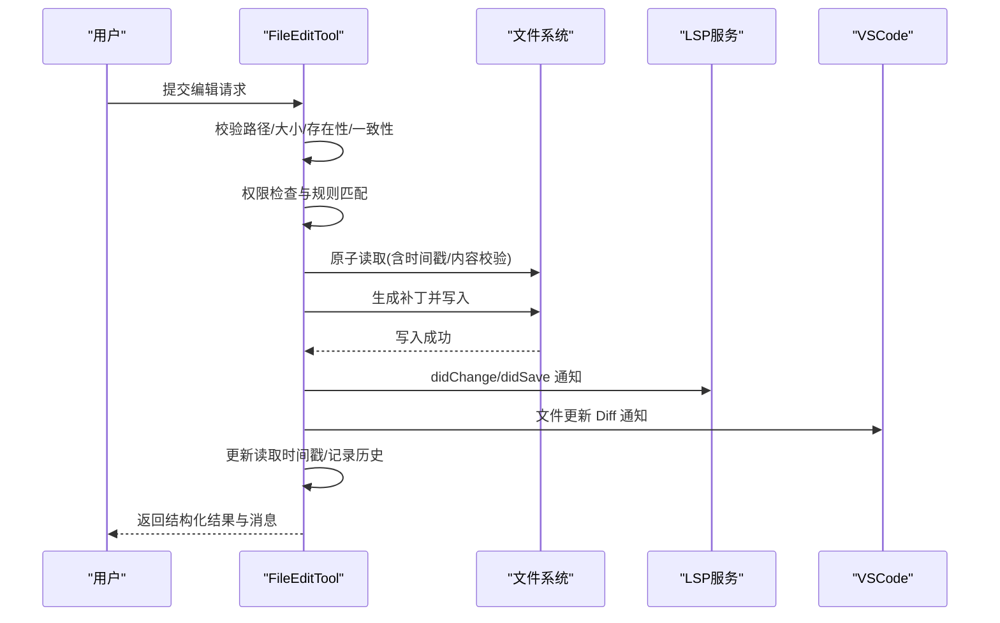
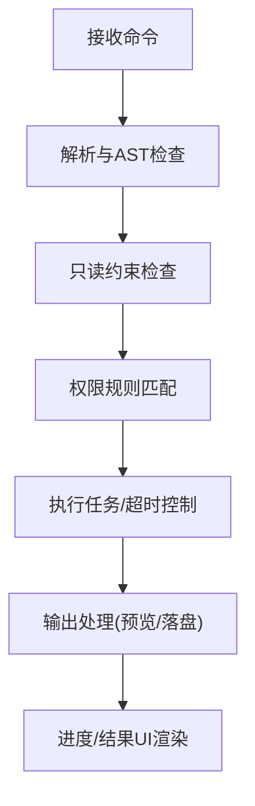
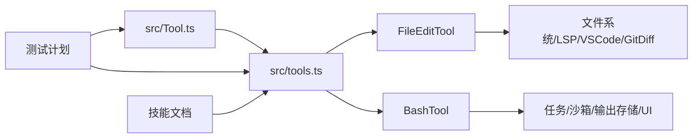

# 工具开发指南

<cite>
**本文引用的文件**
- [src/Tool.ts](file://src/Tool.ts)
- [src/tools.ts](file://src/tools.ts)
- [src/tools/FileEditTool/FileEditTool.ts](file://src/tools/FileEditTool/FileEditTool.ts)
- [src/tools/BashTool/BashTool.tsx](file://src/tools/BashTool/BashTool.tsx)
- [src/__tests__/Tool.test.ts](file://src/__tests__/Tool.test.ts)
- [docs/extensibility/skills.mdx](file://docs/extensibility/skills.mdx)
- [docs/test-plans/01-tool-system.md](file://docs/test-plans/01-tool-system.md)
- [docs/test-plans/phase-17-tool-submodules.md](file://docs/test-plans/phase-17-tool-submodules.md)
</cite>

## 目录
1. [简介](#简介)
2. [项目结构](#项目结构)
3. [核心组件](#核心组件)
4. [架构总览](#架构总览)
5. [详细组件分析](#详细组件分析)
6. [依赖关系分析](#依赖关系分析)
7. [性能考量](#性能考量)
8. [故障排查指南](#故障排查指南)
9. [结论](#结论)
10. [附录](#附录)

## 简介
本指南面向希望为 Claude Code Best 开发自定义工具的工程师，系统讲解工具类的定义与继承、接口实现与生命周期管理；给出从需求分析到测试验证的完整开发流程；总结错误处理、性能优化、安全与用户体验设计的最佳实践；并提供调试方法、打包与发布流程及常见问题解决方案。文档结合仓库中的工具接口、工具集合装配、典型工具实现与测试计划，帮助你从零到一完成高质量工具开发。

## 项目结构
- 工具接口与通用能力定义位于工具基类与工具集合装配模块，提供统一的工具契约、权限与进度渲染、结果映射等能力。
- 典型工具实现位于 tools 目录下的具体工具模块，例如文件编辑、Shell 执行等，体现输入校验、权限检查、并发安全、UI 渲染与结果落盘等工程细节。
- 文档与测试计划提供了技能系统、工具系统测试策略与子模块纯逻辑测试目标，便于理解工具生态与质量保障体系。

**图表来源**
- [src/Tool.ts:1-793](file://src/Tool.ts#L1-L793)
- [src/tools.ts:191-387](file://src/tools.ts#L191-L387)
- [src/__tests__/Tool.test.ts:1-208](file://src/__tests__/Tool.test.ts#L1-L208)
- [docs/extensibility/skills.mdx:1-222](file://docs/extensibility/skills.mdx#L1-L222)
- [docs/test-plans/01-tool-system.md:1-148](file://docs/test-plans/01-tool-system.md#L1-L148)
- [docs/test-plans/phase-17-tool-submodules.md:1-204](file://docs/test-plans/phase-17-tool-submodules.md#L1-L204)

**章节来源**
- [src/Tool.ts:1-793](file://src/Tool.ts#L1-L793)
- [src/tools.ts:191-387](file://src/tools.ts#L191-L387)

## 核心组件
- 工具接口与契约
  - 工具类型定义包含调用签名、描述生成、输入/输出模式、权限检查、并发安全、只读/破坏性标记、中断行为、搜索/读取命令识别、MCP/LSP 标识、延迟加载策略、最大结果尺寸、严格模式、观察者输入回填、输入校验、路径提取、权限匹配器准备、系统提示生成、面向用户的名称与主题色、透明包装器、摘要与活动描述、自动分类器输入、结果消息映射、结果渲染、搜索文本抽取、工具使用消息渲染、截断判断、进度消息渲染、排队消息渲染、拒绝/错误 UI 渲染、分组渲染等。
  - 工具构建器 buildTool 提供默认实现，确保工具在缺失可选方法时具备安全默认值（如 isEnabled 默认 true、isConcurrencySafe 默认 false、checkPermissions 默认允许等），并以类型安全的方式合并用户提供的定义。
- 工具集合装配
  - getAllBaseTools 返回当前环境可用的全部内置工具清单，尊重特性开关与环境变量，屏蔽 REPL 专用工具等。
  - getTools 在权限上下文与模式过滤后产出最终可用工具集，并对 MCP 工具进行去重与排序以保证提示缓存稳定性。
  - assembleToolPool 将内置工具与 MCP 工具合并，内置工具保持前缀连续，避免缓存失效。
  - filterToolsByDenyRules 基于权限规则过滤工具，支持服务器前缀规则屏蔽 MCP 工具。
- 典型工具实现
  - FileEditTool：文件编辑工具，包含输入校验（路径、大小、存在性、内容一致性、替换范围、设置文件安全校验）、权限检查、并发安全、原子读改写、LSP 通知、VSCode Diff 通知、历史备份、Git Diff 计算、结果映射与 UI 渲染。
  - BashTool：Shell 工具，包含命令解析与安全检查、只读约束、权限规则匹配、超时与进度显示、搜索/读取命令折叠、结果存储与预览、图像输出处理、任务输出路径管理等。

**章节来源**
- [src/Tool.ts:362-792](file://src/Tool.ts#L362-L792)
- [src/tools.ts:191-387](file://src/tools.ts#L191-L387)
- [src/tools/FileEditTool/FileEditTool.ts:86-595](file://src/tools/FileEditTool/FileEditTool.ts#L86-L595)
- [src/tools/BashTool/BashTool.tsx:1-200](file://src/tools/BashTool/BashTool.tsx#L1-L200)

## 架构总览
工具系统围绕“工具接口 + 工具集合装配 + 典型工具实现 + 测试与文档”的闭环构建，形成可扩展、可治理、可验证的工具生态。

**图表来源**
- [src/Tool.ts:783-792](file://src/Tool.ts#L783-L792)
- [src/tools.ts:269-365](file://src/tools.ts#L269-L365)
- [src/tools/FileEditTool/FileEditTool.ts:137-362](file://src/tools/FileEditTool/FileEditTool.ts#L137-L362)
- [src/tools/BashTool/BashTool.tsx:1-200](file://src/tools/BashTool/BashTool.tsx#L1-L200)

## 详细组件分析

### 工具接口与生命周期
- 生命周期阶段
  - 输入校验：validateInput，用于在调用前进行参数与上下文校验，必要时返回行为与元信息，引导用户交互或拒绝。
  - 权限检查：checkPermissions，基于工具特定规则与全局权限上下文决定是否允许执行。
  - 并发安全：isConcurrencySafe，决定工具是否可并发执行，影响调度与资源竞争。
  - 调用执行：call，实际业务逻辑入口，支持进度回调、上下文注入与结果映射。
  - 结果渲染：renderToolUseMessage/renderToolResultMessage 等，负责 UI 展示与转储。
  - 资源清理：工具可在调用前后维护文件历史、LSP 通知、任务输出等外部状态。
- 关键钩子
  - backfillObservableInput：在观察者可见前对输入进行回填，保证日志与统计一致性。
  - toAutoClassifierInput：为自动分类器提供简洁输入，提升安全扫描效率。
  - getToolUseSummary/getActivityDescription：用于紧凑视图与进度提示。
  - renderToolUseProgressMessage/renderToolUseErrorMessage/renderToolUseRejectedMessage：针对不同状态定制 UI。

**图表来源**
- [src/Tool.ts:379-560](file://src/Tool.ts#L379-L560)
- [src/tools/FileEditTool/FileEditTool.ts:137-362](file://src/tools/FileEditTool/FileEditTool.ts#L137-L362)

**章节来源**
- [src/Tool.ts:362-792](file://src/Tool.ts#L362-L792)

### 工具集合装配与权限过滤
- 工具池装配
  - getAllBaseTools：聚合内置工具，按特性开关与环境变量动态启用/禁用，屏蔽 REPL 专用工具。
  - getTools：应用权限规则与模式过滤，剔除被拒绝的工具，再按 isEnabled 过滤。
  - assembleToolPool：内置工具前缀连续，MCP 工具去重并排序，保证缓存稳定。
  - filterToolsByDenyRules：支持服务器前缀规则屏蔽 MCP 工具。
- 权限上下文
  - getEmptyToolPermissionContext 提供默认权限模式与规则容器，避免循环依赖与类型不一致。

**图表来源**
- [src/tools.ts:191-387](file://src/tools.ts#L191-L387)

**章节来源**
- [src/tools.ts:191-387](file://src/tools.ts#L191-L387)

### 文件编辑工具（FileEditTool）实现要点
- 输入校验
  - 路径标准化、UNC 路径安全、文件大小限制、存在性与内容一致性检查、Jupyter Notebook 类型拦截、设置文件安全校验、多处匹配与 replace_all 控制。
- 权限与安全
  - 文件系统写权限检查、规则匹配、团队内存机密检测、Windows 时间戳与内容双重校验。
- 并发与原子性
  - 原子读改写、写前确保父目录存在、写后更新读取时间戳、失败时抛出“意外修改”错误。
- 生态集成
  - LSP didChange/didSave 通知、VSCode Diff 通知、文件历史备份、Git Diff 计算、事件埋点与行数统计。
- 结果映射与 UI
  - 结构化补丁与用户修改标记、结果消息映射、UI 渲染与错误/拒绝消息定制。

**图表来源**
- [src/tools/FileEditTool/FileEditTool.ts:387-595](file://src/tools/FileEditTool/FileEditTool.ts#L387-L595)

**章节来源**
- [src/tools/FileEditTool/FileEditTool.ts:86-595](file://src/tools/FileEditTool/FileEditTool.ts#L86-L595)

### Shell 工具（BashTool）实现要点
- 命令解析与安全
  - AST 解析、只读约束检查、权限规则匹配、沙箱策略选择。
- 并发与进度
  - 进度阈值、阻塞预算、搜索/读取命令折叠、静默命令识别。
- 输出与存储
  - 大结果预览与落盘、图像输出处理、终端截断检测、任务输出路径管理。
- UI 与体验
  - 工具使用消息、进度消息、排队消息、错误/拒绝 UI 定制。

**图表来源**
- [src/tools/BashTool/BashTool.tsx:198-200](file://src/tools/BashTool/BashTool.tsx#L198-L200)

**章节来源**
- [src/tools/BashTool/BashTool.tsx:1-200](file://src/tools/BashTool/BashTool.tsx#L1-L200)

### 技能系统（Skills）与工具的关系
- 技能本质是“Prompt + 权限配置”的声明式封装，通过 SkillTool 调用时可选择 inline/fork 执行路径，支持工具白名单注入、模型覆盖与努力级别覆盖。
- 技能加载链路涵盖磁盘加载、Frontmatter 解析、预算感知描述截断、动态发现与条件激活、远程加载等环节，形成完整的生命周期闭环。

**章节来源**
- [docs/extensibility/skills.mdx:1-222](file://docs/extensibility/skills.mdx#L1-L222)

## 依赖关系分析
- 工具接口与集合装配
  - 工具接口定义集中于 src/Tool.ts，工具集合装配位于 src/tools.ts，二者共同构成工具生态的“契约层”与“装配层”。
- 工具实现与周边模块
  - FileEditTool 依赖文件系统、LSP、VSCode、Git Diff、诊断跟踪、文件历史等模块；BashTool 依赖任务系统、沙箱、输出存储、UI 渲染等。
- 测试与文档
  - 工具系统测试计划覆盖接口与装配逻辑，子模块测试计划覆盖具体工具的纯逻辑单元测试目标。

**图表来源**
- [src/Tool.ts:1-793](file://src/Tool.ts#L1-L793)
- [src/tools.ts:191-387](file://src/tools.ts#L191-L387)
- [src/tools/FileEditTool/FileEditTool.ts:1-626](file://src/tools/FileEditTool/FileEditTool.ts#L1-L626)
- [src/tools/BashTool/BashTool.tsx:1-200](file://src/tools/BashTool/BashTool.tsx#L1-L200)
- [docs/test-plans/01-tool-system.md:1-148](file://docs/test-plans/01-tool-system.md#L1-L148)
- [docs/test-plans/phase-17-tool-submodules.md:1-204](file://docs/test-plans/phase-17-tool-submodules.md#L1-L204)
- [docs/extensibility/skills.mdx:1-222](file://docs/extensibility/skills.mdx#L1-L222)

**章节来源**
- [src/tools.ts:191-387](file://src/tools.ts#L191-L387)

## 性能考量
- 输入校验前置与短路
  - 在 validateInput 中尽早返回错误或询问，避免昂贵的 IO 或进程启动。
- 并发安全与资源竞争
  - isConcurrencySafe 设为 true 时允许多实例并发；否则采用串行或互斥策略，避免竞态与数据损坏。
- 大结果落盘与预览
  - 超大输出走预览文件，避免内存峰值；合理设置 maxResultSizeChars 与预览阈值。
- UI 渲染与进度
  - 进度阈值与节流，避免频繁重绘；搜索/读取命令折叠减少冗余展示。
- 缓存与去重
  - 工具池去重与排序保持提示缓存稳定；文件历史与读取时间戳避免重复读取与无效写入。

[本节为通用指导，无需引用具体文件]

## 故障排查指南
- 常见问题与定位
  - 工具未出现在可用列表：检查 isEnabled、权限规则、REPL 模式屏蔽、特性开关。
  - 输入校验失败：查看 validateInput 的错误码与行为，确认路径、大小、存在性、一致性与设置文件安全校验。
  - 权限被拒绝：核对 checkPermissions 与权限匹配器，确认 deny/allow 规则与服务器前缀屏蔽。
  - 并发写冲突：确认 isConcurrencySafe 与原子读改写逻辑，检查时间戳与内容一致性。
  - UI 不显示进度/结果：检查 renderToolUseMessage/renderToolResultMessage 与进度阈值。
- 调试方法
  - 日志记录：利用工具内部日志与埋点，定位执行路径与耗时。
  - 断点调试：在 call/validateInput/checkPermissions 中设置断点，观察输入与上下文。
  - 性能分析：关注大结果预览、LSP/VSCode 通知、Git Diff 计算等热点路径。
- 测试验证
  - 使用工具系统测试计划与子模块测试计划，覆盖接口默认值、工具匹配、权限过滤、纯逻辑函数等。

**章节来源**
- [src/__tests__/Tool.test.ts:1-208](file://src/__tests__/Tool.test.ts#L1-L208)
- [docs/test-plans/01-tool-system.md:1-148](file://docs/test-plans/01-tool-system.md#L1-L148)
- [docs/test-plans/phase-17-tool-submodules.md:1-204](file://docs/test-plans/phase-17-tool-submodules.md#L1-L204)

## 结论
通过统一的工具接口、严谨的集合装配与权限过滤、完善的典型工具实现与测试体系，Claude Code Best 提供了可扩展、可治理、可验证的工具开发框架。遵循本文的开发流程与最佳实践，你可以高效地从零到一构建高质量工具，并在复杂场景中保持安全性与用户体验的平衡。

[本节为总结，无需引用具体文件]

## 附录

### 开发流程与最佳实践
- 需求分析
  - 明确工具粒度、触发方式、输入输出、安全边界与并发需求。
- 设计规划
  - 定义输入/输出模式、权限规则、并发安全、只读/破坏性标记、中断行为、UI 渲染与结果映射。
- 编码实现
  - 使用 buildTool 构建工具，实现 call/validateInput/checkPermissions 等关键方法，补充 UI 渲染与结果映射。
- 测试验证
  - 参考工具系统测试计划与子模块测试计划，覆盖接口默认值、工具匹配、权限过滤、纯逻辑函数等。

**章节来源**
- [src/Tool.ts:783-792](file://src/Tool.ts#L783-L792)
- [docs/test-plans/01-tool-system.md:1-148](file://docs/test-plans/01-tool-system.md#L1-L148)
- [docs/test-plans/phase-17-tool-submodules.md:1-204](file://docs/test-plans/phase-17-tool-submodules.md#L1-L204)

### 打包与发布流程
- 版本管理
  - 工具 Frontmatter 中的 version 字段可用于版本追踪与兼容性管理。
- 依赖处理
  - 工具实现依赖周边模块（文件系统、LSP、任务系统等），注意最小化耦合与接口抽象。
- 兼容性测试
  - 通过测试计划覆盖不同平台、特性开关与环境变量下的行为一致性。

**章节来源**
- [docs/extensibility/skills.mdx:70-95](file://docs/extensibility/skills.mdx#L70-L95)