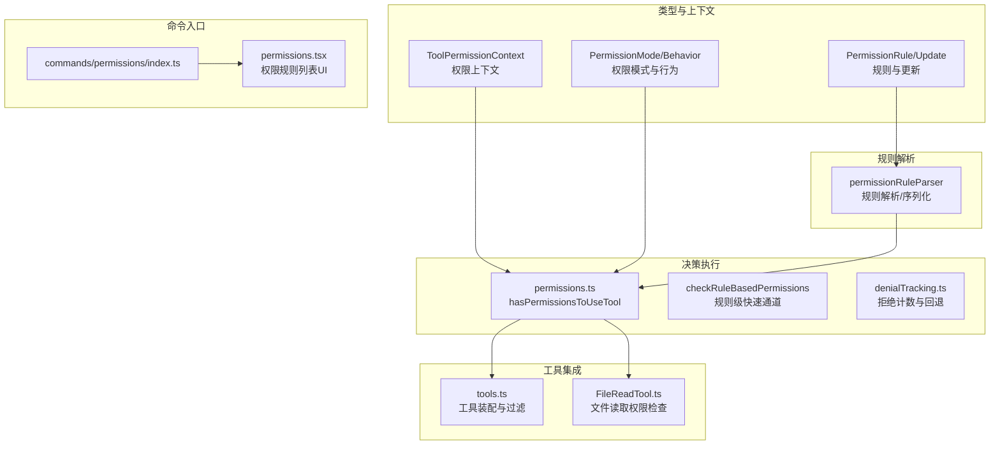
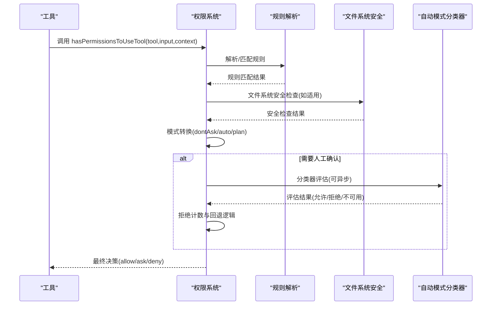
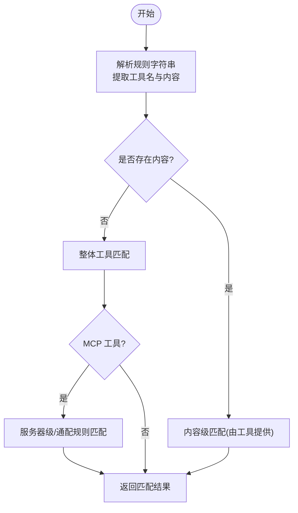
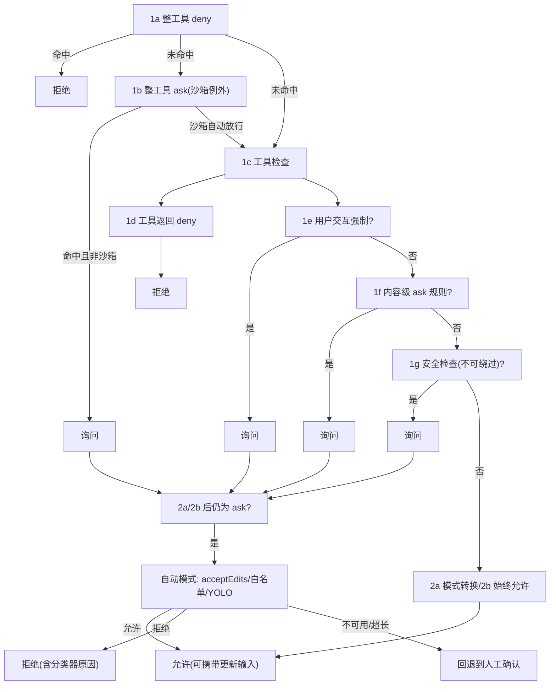
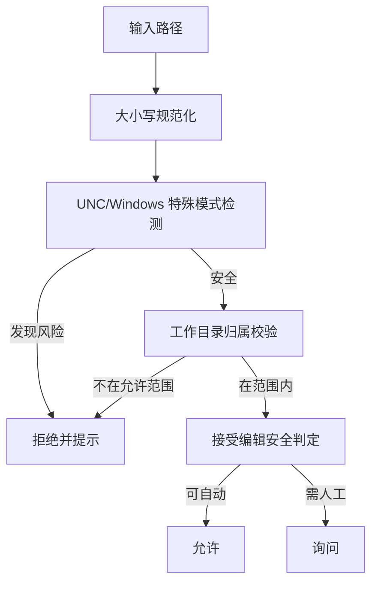
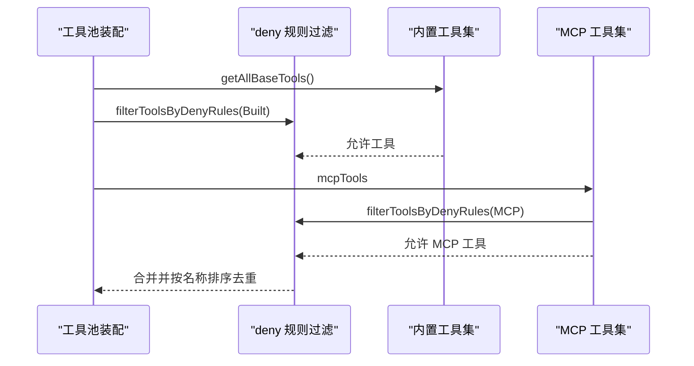
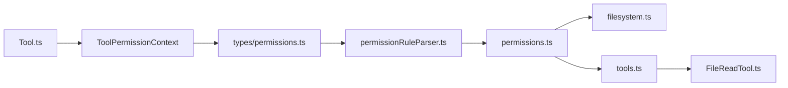

# 工具权限控制

<cite>
**本文引用的文件**
- [src/Tool.ts](file://src/Tool.ts)
- [src/tools.ts](file://src/tools.ts)
- [src/types/permissions.ts](file://src/types/permissions.ts)
- [src/utils/permissions/permissions.ts](file://src/utils/permissions/permissions.ts)
- [src/utils/permissions/filesystem.ts](file://src/utils/permissions/filesystem.ts)
- [src/utils/permissions/permissionRuleParser.ts](file://src/utils/permissions/permissionRuleParser.ts)
- [src/utils/permissions/denialTracking.ts](file://src/utils/permissions/denialTracking.ts)
- [src/commands/permissions/index.ts](file://src/commands/permissions/index.ts)
- [src/commands/permissions/permissions.tsx](file://src/commands/permissions/permissions.tsx)
- [src/tools/FileReadTool/FileReadTool.ts](file://src/tools/FileReadTool/FileReadTool.ts)
</cite>

## 目录
1. [简介](#简介)
2. [项目结构](#项目结构)
3. [核心组件](#核心组件)
4. [架构总览](#架构总览)
5. [详细组件分析](#详细组件分析)
6. [依赖关系分析](#依赖关系分析)
7. [性能考量](#性能考量)
8. [故障排查指南](#故障排查指南)
9. [结论](#结论)
10. [附录](#附录)

## 简介
本文件面向 Claude Code Best 的“工具权限控制系统”，系统性阐述权限控制模型的设计理念、规则定义与匹配算法、执行流程，以及在文件系统、网络访问、进程执行与敏感操作等维度的分类与落地。文档同时覆盖权限规则的配置方式（路径匹配、工具匹配、条件判断）、权限决策的实时检查与自动模式（auto mode）机制、缓存与审计策略，并给出最佳实践与常见问题的解决方案。

## 项目结构
权限控制贯穿“类型定义—规则解析—决策执行—工具集成—UI命令”全链路：
- 类型与上下文：在工具类型与权限上下文中统一抽象权限模式、规则来源、决策结果与元数据。
- 规则解析：将字符串规则解析为可匹配的工具名与内容片段，支持转义与通配。
- 决策执行：按步骤进行规则匹配、模式转换、自动模式分类器评估、拒绝次数统计与回退提示。
- 工具集成：各工具在输入校验与权限检查阶段调用通用权限管线；文件读写工具引入文件系统安全检查。
- 命令入口：通过本地 JSX 命令打开权限规则管理界面，支持重试被拒的工具调用。

图表来源
- [src/types/permissions.ts:413-442](file://src/types/permissions.ts#L413-L442)
- [src/utils/permissions/permissionRuleParser.ts:93-152](file://src/utils/permissions/permissionRuleParser.ts#L93-L152)
- [src/utils/permissions/permissions.ts:1158-1319](file://src/utils/permissions/permissions.ts#L1158-L1319)
- [src/utils/permissions/denialTracking.ts:7-46](file://src/utils/permissions/denialTracking.ts#L7-L46)
- [src/tools.ts:343-365](file://src/tools.ts#L343-L365)
- [src/tools/FileReadTool/FileReadTool.ts:398-405](file://src/tools/FileReadTool/FileReadTool.ts#L398-L405)
- [src/commands/permissions/index.ts:3-9](file://src/commands/permissions/index.ts#L3-L9)
- [src/commands/permissions/permissions.tsx:6-18](file://src/commands/permissions/permissions.tsx#L6-L18)

章节来源
- [src/types/permissions.ts:16-442](file://src/types/permissions.ts#L16-L442)
- [src/utils/permissions/permissionRuleParser.ts:1-199](file://src/utils/permissions/permissionRuleParser.ts#L1-L199)
- [src/utils/permissions/permissions.ts:1158-1487](file://src/utils/permissions/permissions.ts#L1158-L1487)
- [src/utils/permissions/denialTracking.ts:1-46](file://src/utils/permissions/denialTracking.ts#L1-L46)
- [src/tools.ts:343-365](file://src/tools.ts#L343-L365)
- [src/tools/FileReadTool/FileReadTool.ts:398-405](file://src/tools/FileReadTool/FileReadTool.ts#L398-L405)
- [src/commands/permissions/index.ts:1-12](file://src/commands/permissions/index.ts#L1-L12)
- [src/commands/permissions/permissions.tsx:1-19](file://src/commands/permissions/permissions.tsx#L1-L19)

## 核心组件
- 权限上下文与模式
  - 权限模式：外部可配置模式集合，包含默认、绕过、不询问、计划模式等；内部还包含自动模式与冒泡模式。
  - 上下文字段：包含当前模式、附加工作目录、允许/禁止/询问规则映射、是否可用绕过模式、避免弹窗等。
- 规则与更新
  - 规则值包含工具名与可选内容；规则来源涵盖用户设置、项目设置、本地设置、标志位、策略、CLI 参数、命令、会话等。
  - 更新操作支持新增、替换、删除规则，以及设置模式、增删工作目录。
- 决策结果
  - 允许、询问、拒绝三类行为；允许可携带更新后的输入；询问可附带建议与元信息；拒绝携带原因与工具使用 ID。
- 文件系统安全
  - 定义危险文件与目录清单；对路径大小写规范化、UNC 路径检测、危险 Windows 路径模式、工作目录归属校验等进行安全检查。

章节来源
- [src/types/permissions.ts:16-39](file://src/types/permissions.ts#L16-L39)
- [src/types/permissions.ts:26-38](file://src/types/permissions.ts#L26-L38)
- [src/types/permissions.ts:44-83](file://src/types/permissions.ts#L44-L83)
- [src/types/permissions.ts:104-147](file://src/types/permissions.ts#L104-L147)
- [src/types/permissions.ts:171-267](file://src/types/permissions.ts#L171-L267)
- [src/types/permissions.ts:419-442](file://src/types/permissions.ts#L419-L442)
- [src/utils/permissions/filesystem.ts:57-80](file://src/utils/permissions/filesystem.ts#L57-L80)
- [src/utils/permissions/filesystem.ts:435-488](file://src/utils/permissions/filesystem.ts#L435-L488)
- [src/utils/permissions/filesystem.ts:620-665](file://src/utils/permissions/filesystem.ts#L620-L665)

## 架构总览
权限控制采用“规则驱动 + 模式转换 + 自动模式分类器”的分层设计。工具在调用前先经规则匹配与模式转换，若仍需交互，则进入自动模式分类器进行非阻塞评估；当连续拒绝达到阈值时回退到人工确认。

图表来源
- [src/utils/permissions/permissions.ts:1158-1319](file://src/utils/permissions/permissions.ts#L1158-L1319)
- [src/utils/permissions/permissions.ts:800-1058](file://src/utils/permissions/permissions.ts#L800-L1058)
- [src/utils/permissions/permissionRuleParser.ts:93-152](file://src/utils/permissions/permissionRuleParser.ts#L93-L152)
- [src/utils/permissions/filesystem.ts:620-665](file://src/utils/permissions/filesystem.ts#L620-L665)

## 详细组件分析

### 权限规则模型与匹配算法
- 规则格式与解析
  - 支持“工具名”或“工具名(内容)”两种形式；内容中括号需转义存储与解析。
  - 解析时区分首个未转义左括号与末个未转义右括号，确保内容边界正确。
  - 支持空内容与通配符“*”作为仅工具级规则处理。
- 工具级匹配
  - 整体工具匹配要求规则内容为空；MCP 工具支持服务器级规则与通配。
- 内容级匹配
  - 工具实现可提供内容级匹配器（如 Bash 子命令），用于更细粒度的 ask/deny 控制。
- 规则来源与去向
  - 规则来源包括用户设置、项目设置、本地设置、标志位、策略、CLI 参数、命令、会话。
  - 更新操作支持新增、替换、删除规则，以及设置模式与工作目录增删。

图表来源
- [src/utils/permissions/permissionRuleParser.ts:93-152](file://src/utils/permissions/permissionRuleParser.ts#L93-L152)
- [src/utils/permissions/permissions.ts:238-292](file://src/utils/permissions/permissions.ts#L238-L292)

章节来源
- [src/utils/permissions/permissionRuleParser.ts:18-199](file://src/utils/permissions/permissionRuleParser.ts#L18-L199)
- [src/utils/permissions/permissions.ts:238-302](file://src/utils/permissions/permissions.ts#L238-L302)

### 权限决策执行流程
- 步骤概览
  - 1a/1b：整工具 deny/ask 规则优先；沙箱自动放行（Bash）场景除外。
  - 1c：调用工具自身 checkPermissions 获取初始结果。
  - 1d/1e/1f/1g：工具返回 deny、用户交互强制、内容级 ask 规则、安全检查（不可绕过）等特殊路径。
  - 2a/2b：模式转换与始终允许规则。
  - 3：将 passthrough 转换为 ask 并生成请求消息。
  - 自动模式：acceptEdits 快速路径、安全工具白名单、YOLO 分类器评估、拒绝计数与回退。
- 关键特性
  - dontAsk 模式将 ask 直接转为 deny。
  - 自动模式下，安全文件编辑（.claude、.git、shell 配置等）仍可能进入分类器或回退提示。
  - 拒绝计数超过阈值后回退到人工确认，保护用户免受自动化误判影响。

图表来源
- [src/utils/permissions/permissions.ts:1158-1319](file://src/utils/permissions/permissions.ts#L1158-L1319)
- [src/utils/permissions/permissions.ts:800-1058](file://src/utils/permissions/permissions.ts#L800-L1058)

章节来源
- [src/utils/permissions/permissions.ts:1158-1487](file://src/utils/permissions/permissions.ts#L1158-L1487)

### 文件系统权限与敏感操作
- 危险对象清单
  - 危险文件：.gitconfig、.gitmodules、.bashrc、.zshrc 等 shell 配置；.mcp.json、.claude.json 等内部状态。
  - 危险目录：.git、.vscode、.idea、.claude。
- 安全检查要点
  - 大小写规范化比较，防止大小写绕过。
  - UNC 路径检测与 Windows 特殊路径模式识别（ADS、短名称、长路径前缀、尾随点与空格、设备名、连续点）。
  - 工作目录归属校验，支持符号链接解析与跨平台相对路径计算。
  - 接受编辑（acceptEdits）模式的安全判定，结合分类器 Approvable 标记决定是否可由自动模式放行。
- 工具集成
  - FileReadTool 在 validateInput 中进行 deny 规则匹配、二进制扩展名检查、设备文件阻断等；在 checkPermissions 中委托文件系统安全模块。

图表来源
- [src/utils/permissions/filesystem.ts:435-488](file://src/utils/permissions/filesystem.ts#L435-L488)
- [src/utils/permissions/filesystem.ts:620-665](file://src/utils/permissions/filesystem.ts#L620-L665)
- [src/tools/FileReadTool/FileReadTool.ts:418-495](file://src/tools/FileReadTool/FileReadTool.ts#L418-L495)

章节来源
- [src/utils/permissions/filesystem.ts:57-80](file://src/utils/permissions/filesystem.ts#L57-L80)
- [src/utils/permissions/filesystem.ts:435-602](file://src/utils/permissions/filesystem.ts#L435-L602)
- [src/utils/permissions/filesystem.ts:620-665](file://src/utils/permissions/filesystem.ts#L620-L665)
- [src/tools/FileReadTool/FileReadTool.ts:398-495](file://src/tools/FileReadTool/FileReadTool.ts#L398-L495)

### 工具装配与过滤
- 工具装配
  - getTools/getMergedTools/assembleToolPool 统一装配内置工具与 MCP 工具，按名称排序并去重，内置工具优先。
  - 过滤掉被 deny 规则禁用的工具，支持 REPL 模式隐藏原语工具。
- 过滤策略
  - 使用 getDenyRuleForTool 对工具集合进行一次性过滤，保证 MCP 与内置工具的统一视图。

图表来源
- [src/tools.ts:191-249](file://src/tools.ts#L191-L249)
- [src/tools.ts:260-267](file://src/tools.ts#L260-L267)
- [src/tools.ts:343-365](file://src/tools.ts#L343-L365)

章节来源
- [src/tools.ts:191-365](file://src/tools.ts#L191-L365)

### 权限规则配置与 UI 命令
- 命令入口
  - 本地 JSX 命令 permissions/allowed-tools 打开权限规则列表界面，支持重试被拒的工具调用。
- 规则更新
  - 支持按来源与行为批量添加/替换/删除规则，以及设置模式与工作目录。
- 规则来源
  - 用户设置、项目设置、本地设置、标志位、策略、CLI 参数、命令、会话。

章节来源
- [src/commands/permissions/index.ts:1-12](file://src/commands/permissions/index.ts#L1-L12)
- [src/commands/permissions/permissions.tsx:1-19](file://src/commands/permissions/permissions.tsx#L1-L19)
- [src/types/permissions.ts:54-147](file://src/types/permissions.ts#L54-L147)

## 依赖关系分析
- 松耦合与高内聚
  - 权限类型与上下文集中于 types 层，避免循环依赖；规则解析与决策执行位于 utils 层，工具通过工具类型接口统一接入。
- 关键依赖链
  - 工具类型 → 权限上下文 → 规则解析 → 决策执行 → 文件系统安全 → 工具调用。
- 可能的循环依赖规避
  - 将纯类型定义移至 types/permissions.ts，实现文件拆分以避免导入环。

图表来源
- [src/Tool.ts:123-148](file://src/Tool.ts#L123-L148)
- [src/types/permissions.ts:419-442](file://src/types/permissions.ts#L419-L442)
- [src/utils/permissions/permissionRuleParser.ts:93-152](file://src/utils/permissions/permissionRuleParser.ts#L93-L152)
- [src/utils/permissions/permissions.ts:1158-1319](file://src/utils/permissions/permissions.ts#L1158-L1319)
- [src/utils/permissions/filesystem.ts:620-665](file://src/utils/permissions/filesystem.ts#L620-L665)
- [src/tools.ts:343-365](file://src/tools.ts#L343-L365)
- [src/tools/FileReadTool/FileReadTool.ts:398-405](file://src/tools/FileReadTool/FileReadTool.ts#L398-L405)

章节来源
- [src/Tool.ts:123-148](file://src/Tool.ts#L123-L148)
- [src/types/permissions.ts:419-442](file://src/types/permissions.ts#L419-L442)
- [src/utils/permissions/permissions.ts:1158-1319](file://src/utils/permissions/permissions.ts#L1158-L1319)

## 性能考量
- 缓存与去重
  - 工作目录解析与路径检查结果进行缓存，减少重复系统调用。
  - 文件读取结果在相同范围且未变更时进行去重，降低令牌与传输成本。
- 自动模式优化
  - acceptEdits 快速路径与安全工具白名单减少分类器调用。
  - 拒绝计数与回退逻辑避免无意义的持续分类器评估。
- 排序与去重
  - 工具池按名称排序并去重，保持提示缓存稳定性，避免 MCP 工具打乱内置工具顺序导致缓存失效。

章节来源
- [src/utils/permissions/filesystem.ts:681-681](file://src/utils/permissions/filesystem.ts#L681-L681)
- [src/tools/FileReadTool/FileReadTool.ts:536-573](file://src/tools/FileReadTool/FileReadTool.ts#L536-L573)
- [src/utils/permissions/permissions.ts:658-686](file://src/utils/permissions/permissions.ts#L658-L686)
- [src/utils/permissions/denialTracking.ts:7-46](file://src/utils/permissions/denialTracking.ts#L7-L46)
- [src/tools.ts:358-364](file://src/tools.ts#L358-L364)

## 故障排查指南
- 常见问题与定位
  - 规则不生效：检查规则字符串是否正确转义括号、是否匹配工具名大小写、是否为“仅工具级”规则（空内容或通配）。
  - 自动模式频繁拒绝：关注拒绝计数阈值与分类器不可用/超长提示，必要时切换到交互模式。
  - 文件读取失败：检查 deny 规则、二进制扩展名、设备文件阻断、UNC 路径与路径遍历。
  - REPL 模式原语工具不可见：确认 REPL 模式下原语工具被隐藏，应通过 REPL 包装工具使用。
- 建议排查步骤
  - 使用权限规则命令打开规则列表，核对来源与行为。
  - 查看决策原因（decisionReason）类型，区分规则、模式、hook、分类器、安全检查等。
  - 在 headless 场景中，确认 PermissionRequest hooks 是否提供决策，否则将自动拒绝。

章节来源
- [src/utils/permissions/permissions.ts:1071-1156](file://src/utils/permissions/permissions.ts#L1071-L1156)
- [src/utils/permissions/permissions.ts:800-1058](file://src/utils/permissions/permissions.ts#L800-L1058)
- [src/utils/permissions/filesystem.ts:435-602](file://src/utils/permissions/filesystem.ts#L435-L602)
- [src/tools.ts:312-321](file://src/tools.ts#L312-L321)

## 结论
该权限控制系统以“规则 + 模式 + 自动模式分类器”为核心，结合文件系统安全检查与拒绝计数回退，形成从工具装配、规则匹配、模式转换到自动评估与人工确认的完整闭环。通过严格的规则解析与匹配、可配置的模式与来源、以及稳健的缓存与去重策略，系统在保障安全性的同时兼顾了易用性与性能。

## 附录

### 权限配置最佳实践
- 最小权限原则
  - 优先使用内容级规则（如 Bash(npm install)）而非整工具允许，减少误授权风险。
- 权限分离
  - 将不同来源的规则分离（用户/项目/本地/策略），便于审计与回收站式清理。
- 安全审计
  - 利用决策原因类型与分类器日志，定期审查自动模式的拒绝与回退事件。
- 自动模式治理
  - 合理设置拒绝计数阈值与回退提示，避免过度自动化导致的误判。
- REPL 与原语工具
  - 在 REPL 模式下，原语工具被隐藏，应通过包装工具或会话级配置使用。

### 权限配置示例（路径）
- 允许 Bash 的特定子命令
  - 规则字符串：Bash(npm install)
  - 解析后工具名为 Bash，内容为 npm install。
- 禁止编辑 .git 目录下的文件
  - 规则字符串：FileEdit(.git/**)
  - 注意：内容级规则需正确转义路径中的通配符。
- 服务器级 MCP 工具规则
  - 规则字符串：mcp__server1__*
  - 表示允许来自 mcp__server1 的所有工具。

章节来源
- [src/utils/permissions/permissionRuleParser.ts:93-152](file://src/utils/permissions/permissionRuleParser.ts#L93-L152)
- [src/utils/permissions/filesystem.ts:57-80](file://src/utils/permissions/filesystem.ts#L57-L80)