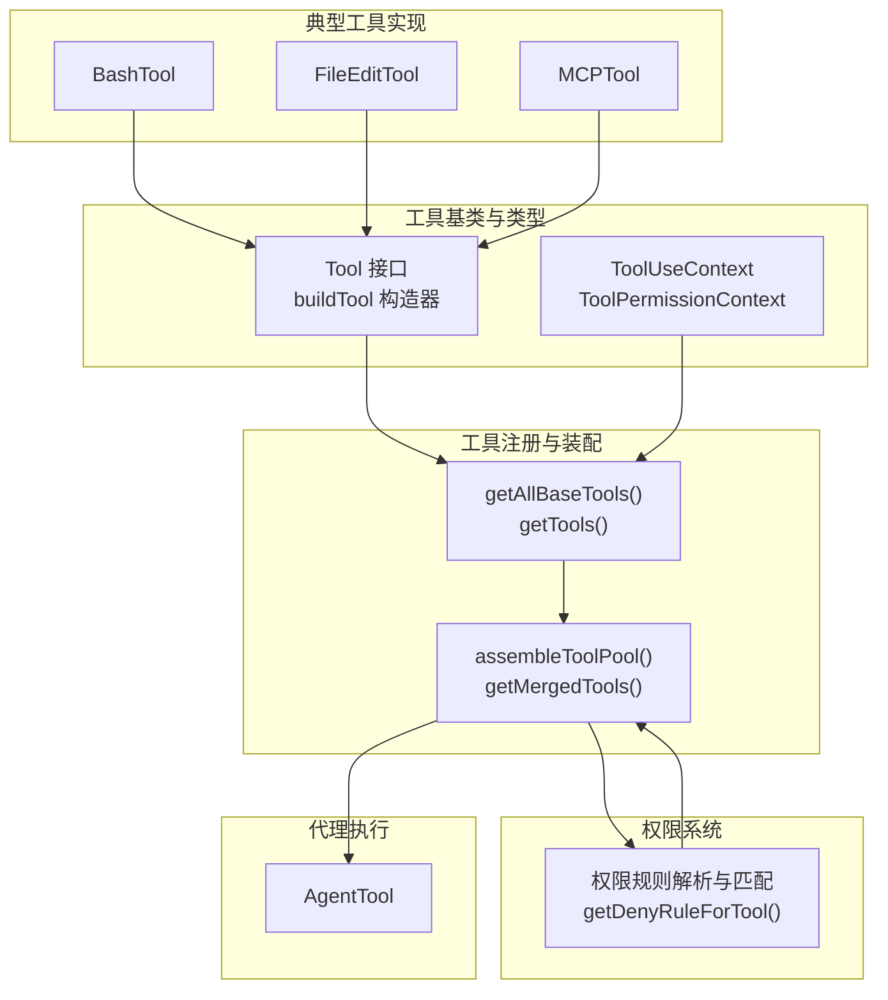
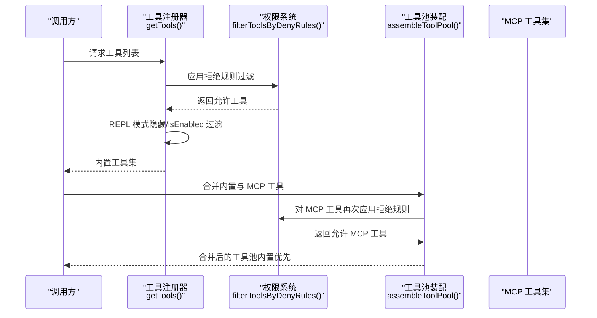
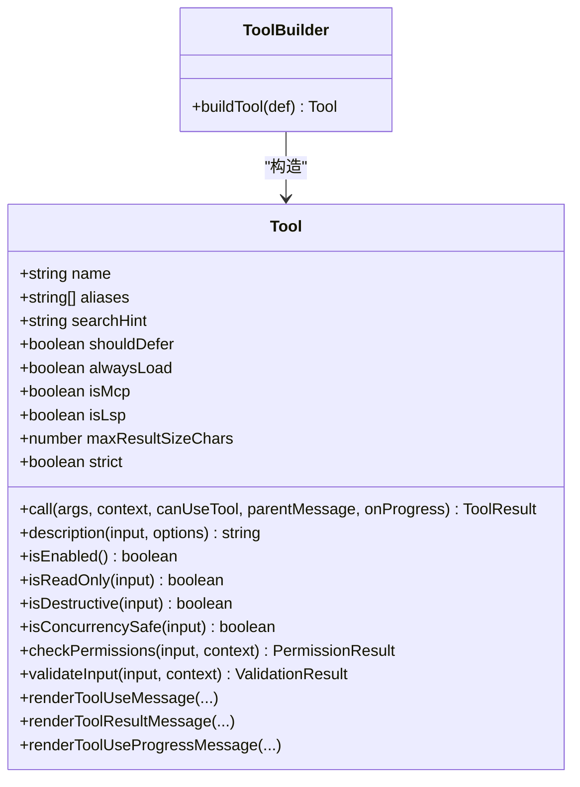
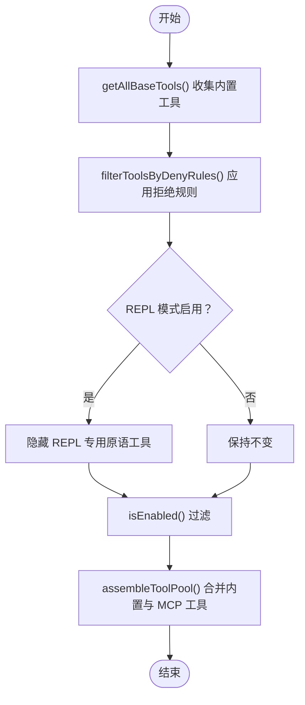
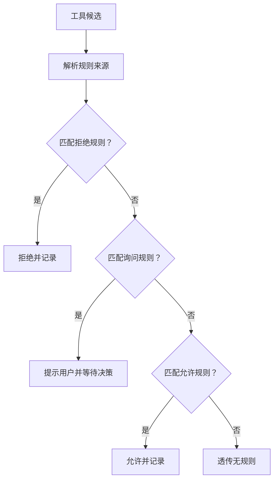
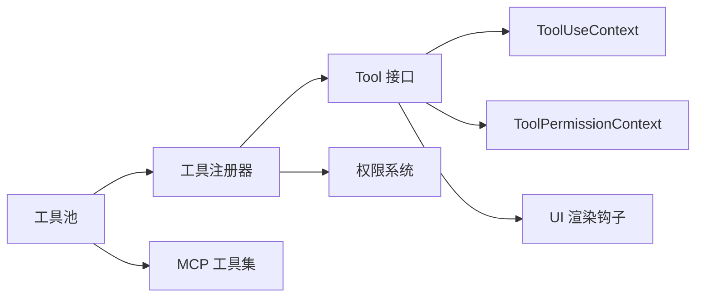

# 工具架构设计

<cite>
**本文引用的文件**
- [src/Tool.ts](file://src/Tool.ts)
- [src/tools.ts](file://src/tools.ts)
- [src/constants/tools.ts](file://src/constants/tools.ts)
- [src/tools/FileEditTool/FileEditTool.ts](file://src/tools/FileEditTool/FileEditTool.ts)
- [src/tools/MCPTool/MCPTool.ts](file://src/tools/MCPTool/MCPTool.ts)
- [src/utils/permissions/permissions.ts](file://src/utils/permissions/permissions.ts)
- [src/tools/AgentTool/AgentTool.tsx](file://src/tools/AgentTool/AgentTool.tsx)
- [src/tools/BashTool/BashTool.tsx](file://src/tools/BashTool/BashTool.tsx)
- [docs/extensibility/custom-agents.mdx](file://docs/extensibility/custom-agents.mdx)
</cite>

## 目录
1. [简介](#简介)
2. [项目结构](#项目结构)
3. [核心组件](#核心组件)
4. [架构总览](#架构总览)
5. [详细组件分析](#详细组件分析)
6. [依赖关系分析](#依赖关系分析)
7. [性能考量](#性能考量)
8. [故障排查指南](#故障排查指南)
9. [结论](#结论)
10. [附录](#附录)

## 简介
本文件面向 Claude Code Best 的工具系统，系统化阐述工具基类设计、工具注册与生命周期、工具接口定义、工具池组装（内置工具与 MCP 工具）、权限过滤与可用性检查，并给出工具开发最佳实践与示例路径，帮助开发者快速理解并扩展工具体系。

## 项目结构
工具系统围绕“工具基类 + 工具注册器 + 权限过滤 + 工具池组装”展开，关键模块如下：
- 工具基类与接口定义：统一的 Tool 类型、工具构建器 buildTool、工具上下文 ToolUseContext、权限上下文 ToolPermissionContext
- 工具注册与装配：getAllBaseTools/getTools/assembleToolPool/getMergedTools 等函数负责工具收集、过滤与去重
- 权限系统：规则解析、匹配、决策与提示消息生成
- 典型工具实现：如 BashTool、FileEditTool、MCPTool 等
- AgentTool：基于工具集合的代理执行框架，支持工具过滤与系统提示注入

图表来源
- [src/Tool.ts:362-792](file://src/Tool.ts#L362-L792)
- [src/tools.ts:191-387](file://src/tools.ts#L191-L387)
- [src/utils/permissions/permissions.ts:287-320](file://src/utils/permissions/permissions.ts#L287-L320)
- [src/tools/BashTool/BashTool.tsx:1-200](file://src/tools/BashTool/BashTool.tsx#L1-L200)
- [src/tools/FileEditTool/FileEditTool.ts:86-200](file://src/tools/FileEditTool/FileEditTool.ts#L86-L200)
- [src/tools/MCPTool/MCPTool.ts:27-78](file://src/tools/MCPTool/MCPTool.ts#L27-L78)
- [src/tools/AgentTool/AgentTool.tsx:1-200](file://src/tools/AgentTool/AgentTool.tsx#L1-L200)

章节来源
- [src/Tool.ts:150-300](file://src/Tool.ts#L150-L300)
- [src/tools.ts:191-387](file://src/tools.ts#L191-L387)

## 核心组件
- 工具基类与接口
  - Tool 接口定义了工具名称、别名、输入输出模式、描述、执行方法、并发安全、只读/破坏性标记、权限校验、UI 渲染钩子、摘要与活动描述等能力
  - buildTool 提供默认实现（如 isEnabled/isConcurrencySafe/isReadOnly/isDestructive/checkPermissions/toAutoClassifierInput/userFacingName），避免每个工具重复实现
- 工具上下文
  - ToolUseContext 提供工具执行所需的运行时信息（命令、调试开关、模型、工具集、MCP 客户端与资源、交互回调、文件读取限制等）
  - ToolPermissionContext 描述权限模式、额外工作目录、允许/拒绝/询问规则、是否绕过权限等
- 工具注册与装配
  - getAllBaseTools 收集所有内置工具（含条件特性开关）
  - getTools 在内置工具基础上应用权限过滤、REPL 模式隐藏、isEnabled 过滤
  - assembleToolPool 合并内置与 MCP 工具，先排序再去重，内置优先
  - getMergedTools 返回内置与 MCP 工具的简单拼接（不进行去重）

章节来源
- [src/Tool.ts:362-792](file://src/Tool.ts#L362-L792)
- [src/tools.ts:191-387](file://src/tools.ts#L191-L387)

## 架构总览
工具系统采用“声明式工具 + 统一装配 + 权限前置过滤”的设计。工具通过 buildTool 声明能力，注册器按权限上下文与运行模式筛选工具，最终形成工具池；MCP 工具在连接后参与合并，但同样受权限规则约束。

图表来源
- [src/tools.ts:269-365](file://src/tools.ts#L269-L365)
- [src/utils/permissions/permissions.ts:287-320](file://src/utils/permissions/permissions.ts#L287-L320)

章节来源
- [src/tools.ts:269-365](file://src/tools.ts#L269-L365)

## 详细组件分析

### 工具基类与接口设计
- 设计要点
  - 工具接口以“最小可用 + 可选增强”为核心：必须实现 name/inputSchema/call，其余如 validateInput/checkPermissions/render* 等按需实现
  - buildTool 提供安全默认值，确保“失败关闭”（例如 isConcurrencySafe 默认 false、checkPermissions 默认 passthrough）
  - 工具元信息：aliases、searchHint、alwaysLoad/shouldDefer、isMcp/isLsp、maxResultSizeChars、strict 等
  - UI/体验钩子：renderToolUseMessage/renderToolResultMessage/renderToolUseProgressMessage 等
- 生命周期
  - 构建期：buildTool 合并默认实现
  - 运行期：validateInput → 权限检查 → 执行 call → 渲染 UI/进度/结果
- 关键类型
  - Tool/Input/Output/P：泛型约束保证输入输出与进度类型安全
  - ToolUseContext/ToolPermissionContext：贯穿工具执行全链路

图表来源
- [src/Tool.ts:362-792](file://src/Tool.ts#L362-L792)

章节来源
- [src/Tool.ts:362-792](file://src/Tool.ts#L362-L792)

### 工具注册机制与生命周期
- 工具收集
  - getAllBaseTools：聚合所有内置工具，依据特性开关与环境变量选择性包含
  - getTools：对内置工具应用权限过滤、REPL 模式隐藏、isEnabled 过滤
- 工具池组装
  - assembleToolPool：内置工具与 MCP 工具分别排序后合并，内置优先，去重保留内置
  - getMergedTools：直接拼接，不进行去重
- 生命周期注意
  - 工具在注册阶段即完成 isEnabled 校验与权限过滤，减少运行期开销
  - REPL 模式下隐藏部分原语工具，避免误用

图表来源
- [src/tools.ts:191-387](file://src/tools.ts#L191-L387)
- [src/utils/permissions/permissions.ts:287-320](file://src/utils/permissions/permissions.ts#L287-L320)

章节来源
- [src/tools.ts:191-387](file://src/tools.ts#L191-L387)

### 工具接口定义
- 必填项
  - name：工具唯一标识
  - inputSchema：Zod 模式或 JSON Schema（MCP 工具）
  - call：异步执行函数，接收参数、上下文、canUseTool、父消息、进度回调
- 可选增强
  - description/prompt：用于系统提示与工具说明
  - checkPermissions/validateInput：权限与输入校验
  - render*：UI 渲染钩子
  - isReadOnly/isDestructive/isConcurrencySafe：行为与安全属性
  - isSearchOrReadCommand/isOpenWorld：UI 折叠与开放世界标记
  - userFacingName/getActivityDescription：用户体验与分类器输入

章节来源
- [src/Tool.ts:362-792](file://src/Tool.ts#L362-L792)

### 工具池的组装过程
- 合并策略
  - 内置工具优先：先对内置工具排序，再拼接 MCP 工具，最后去重，确保 prompt 缓存稳定性
  - 拒绝规则：内置与 MCP 工具均应用拒绝规则过滤
- 适用场景
  - useMergedTools（REPL）与 runAgent（协调者 Worker）均使用 assembleToolPool 保证一致性

章节来源
- [src/tools.ts:343-365](file://src/tools.ts#L343-L365)

### 工具权限过滤机制
- 拒绝规则匹配
  - getDenyRuleForTool：根据工具名与 MCP 服务器前缀匹配拒绝规则
  - 支持“全局拒绝”“按服务器拒绝”“带内容的规则不视为全局拒绝”
- 规则来源与优先级
  - 来源于多源设置（CLI/命令/会话/设置），deny 优先于 ask，ask 优先于 allow
- 权限提示与自动化
  - createPermissionRequestMessage：根据决策原因生成可读提示
  - 自动拒绝/询问阈值与降级策略（如分类器不可用）

图表来源
- [src/utils/permissions/permissions.ts:213-320](file://src/utils/permissions/permissions.ts#L213-L320)

章节来源
- [src/utils/permissions/permissions.ts:213-320](file://src/utils/permissions/permissions.ts#L213-L320)

### 典型工具实现与最佳实践

#### BashTool 实现要点
- 输入/输出与 UI
  - 输入模式：命令字符串、工作目录、超时等
  - 输出模式：文本/图像/截断检测
  - UI：进度消息、排队消息、错误/拒绝消息渲染
- 安全与权限
  - 命令解析与只读约束检查
  - 沙箱启用策略与权限匹配
- 性能与折叠
  - 搜索/读取/列表命令识别，支持 UI 折叠显示

章节来源
- [src/tools/BashTool/BashTool.tsx:1-200](file://src/tools/BashTool/BashTool.tsx#L1-L200)

#### FileEditTool 实现要点
- 输入校验与安全
  - 路径规范化、大小限制、UNC 路径处理、敏感内容检查
  - 文件系统权限匹配与拒绝规则
- 权限与 UI
  - checkPermissions 针对写操作
  - 渲染使用消息、结果消息、拒绝/错误消息
- 兼容性
  - toAutoClassifierInput 用于安全分类器输入
  - backfillObservableInput 用于钩子观察

章节来源
- [src/tools/FileEditTool/FileEditTool.ts:86-200](file://src/tools/FileEditTool/FileEditTool.ts#L86-L200)

#### MCPTool 实现要点
- 动态输入
  - 使用 passthrough 模式接受任意对象，具体模式由 MCP 服务器定义
- 权限与 UI
  - checkPermissions 返回 passthrough，交由 MCP 服务器侧处理
  - 渲染工具使用/结果/进度消息
- 结果映射
  - mapToolResultToToolResultBlockParam 将输出映射为 SDK 消息块

章节来源
- [src/tools/MCPTool/MCPTool.ts:27-78](file://src/tools/MCPTool/MCPTool.ts#L27-L78)

### AgentTool 与工具过滤
- Agent 定义来源与合并
  - Built-in/Plugin/User/Project 三层来源，后者覆盖前者
- 工具过滤策略
  - disallowedTools 移除；tools 白名单过滤；memory 启用时自动注入 Read/Edit/Write
- 系统提示注入
  - getSystemPrompt 延迟生成，memory 启用时追加记忆指令

章节来源
- [docs/extensibility/custom-agents.mdx:1-212](file://docs/extensibility/custom-agents.mdx#L1-L212)
- [src/constants/tools.ts:36-111](file://src/constants/tools.ts#L36-L111)
- [src/tools/AgentTool/AgentTool.tsx:1-200](file://src/tools/AgentTool/AgentTool.tsx#L1-L200)

## 依赖关系分析
- 工具基类依赖
  - ToolUseContext/ToolPermissionContext 作为工具执行与权限判断的输入
  - UI 渲染钩子依赖主题、命令、工具集等上下文
- 权限系统依赖
  - 规则解析与匹配依赖多源设置、MCP 服务器前缀、工具名/内容匹配
- 工具池依赖
  - assembleToolPool 依赖排序与去重策略，确保缓存稳定

图表来源
- [src/Tool.ts:158-300](file://src/Tool.ts#L158-L300)
- [src/tools.ts:191-387](file://src/tools.ts#L191-L387)
- [src/utils/permissions/permissions.ts:287-320](file://src/utils/permissions/permissions.ts#L287-L320)

章节来源
- [src/Tool.ts:158-300](file://src/Tool.ts#L158-L300)
- [src/tools.ts:191-387](file://src/tools.ts#L191-L387)

## 性能考量
- prompt 缓存稳定性
  - 工具池按名称排序并内置优先，避免 MCP 工具打乱顺序导致缓存失效
- 输入/输出体积控制
  - maxResultSizeChars 控制结果大小，超过阈值落地磁盘并返回预览
- UI 折叠与节流
  - BashTool 对搜索/读取/列表命令识别，减少冗长输出渲染
- 权限前置过滤
  - 在注册阶段应用拒绝规则，减少运行期权限判定开销

## 故障排查指南
- 工具不可见
  - 检查 getTools 是否因拒绝规则或 REPL 模式隐藏
  - 确认 isEnabled 返回 true
- 权限被拒绝
  - 使用 createPermissionRequestMessage 定位拒绝原因（规则/分类器/Hook）
  - 检查 alwaysDenyRules/alwaysAskRules/alwaysAllowRules 的来源与优先级
- MCP 工具未出现
  - 确认 MCP 工具已连接且未被拒绝规则屏蔽
  - 检查 assembleToolPool 的去重逻辑（内置优先）
- UI 不显示结果
  - 检查 renderToolResultMessage 是否实现
  - 确认 maxResultSizeChars 导致的结果落盘与预览

章节来源
- [src/tools.ts:269-325](file://src/tools.ts#L269-L325)
- [src/utils/permissions/permissions.ts:137-200](file://src/utils/permissions/permissions.ts#L137-L200)

## 结论
工具系统通过“声明式接口 + 统一构建器 + 权限前置过滤 + 稳定的工具池装配”，实现了可扩展、可审计、可维护的工具生态。开发者遵循 buildTool 默认约定与权限钩子，即可快速创建安全、可观测、易集成的工具，并与内置工具及 MCP 工具无缝融合。

## 附录

### 工具开发最佳实践
- 继承与构建
  - 使用 buildTool 定义工具，仅覆盖必要方法；默认行为由 TOOL_DEFAULTS 提供
- 参数验证
  - 实现 validateInput，尽早拒绝非法输入；对路径进行规范化处理
- 权限与安全
  - 实现 checkPermissions，结合文件系统/沙箱/分类器策略
  - 对破坏性操作（删除/覆盖/发送）标注 isDestructive
- UI 与体验
  - 提供 userFacingName/getActivityDescription，优化转录与分类器输入
  - 实现 renderToolUseMessage/renderToolResultMessage，必要时实现 renderToolUseProgressMessage
- 性能与稳定性
  - 合理设置 maxResultSizeChars，避免超大结果
  - 对搜索/读取命令实现 isSearchOrReadCommand，支持 UI 折叠

### 示例路径（代码片段路径）
- 创建自定义工具
  - [src/Tool.ts:783-792](file://src/Tool.ts#L783-L792)
- 集成现有工具
  - [src/tools.ts:191-249](file://src/tools.ts#L191-L249)
- 权限过滤与拒绝规则
  - [src/utils/permissions/permissions.ts:287-320](file://src/utils/permissions/permissions.ts#L287-L320)
- Agent 工具过滤与系统提示
  - [docs/extensibility/custom-agents.mdx:111-188](file://docs/extensibility/custom-agents.mdx#L111-L188)