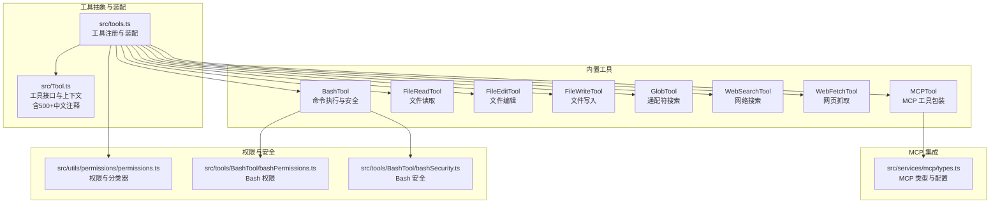
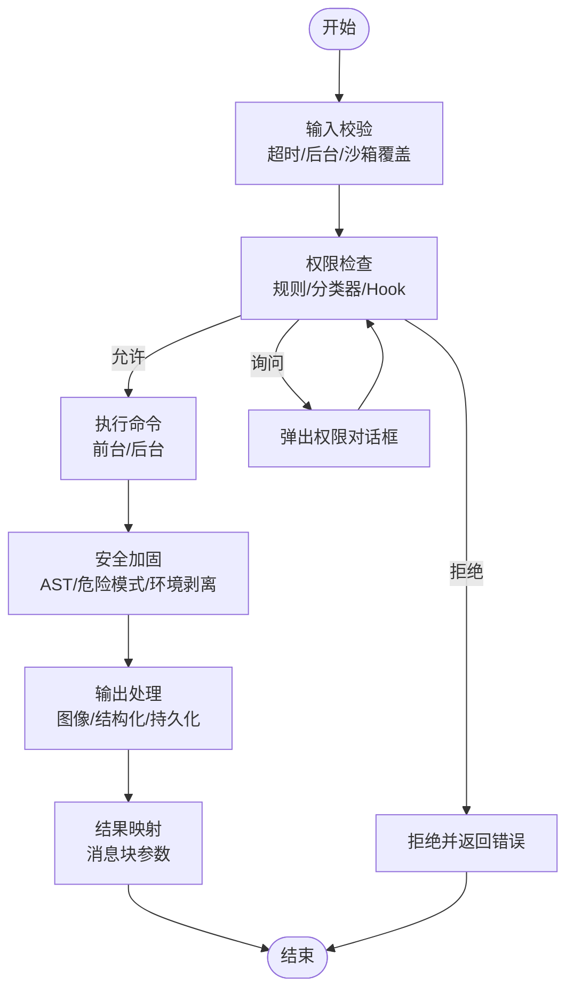
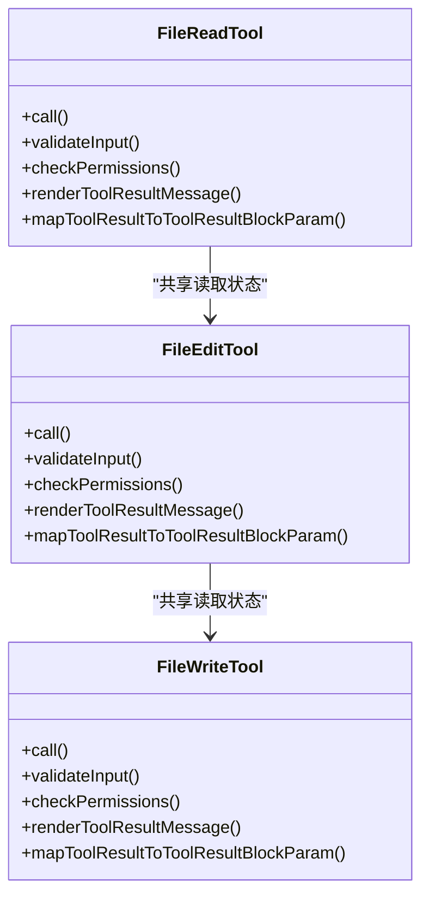
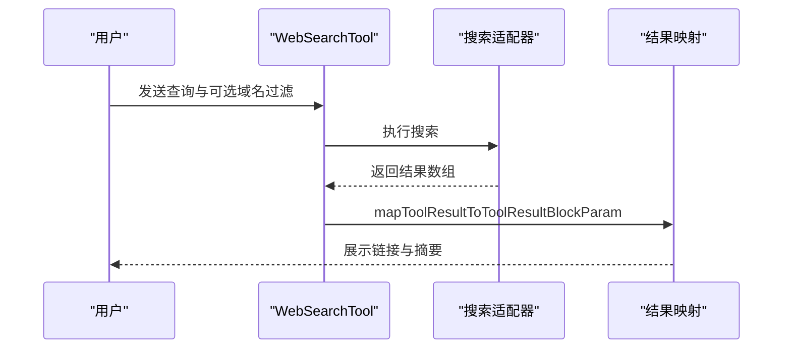
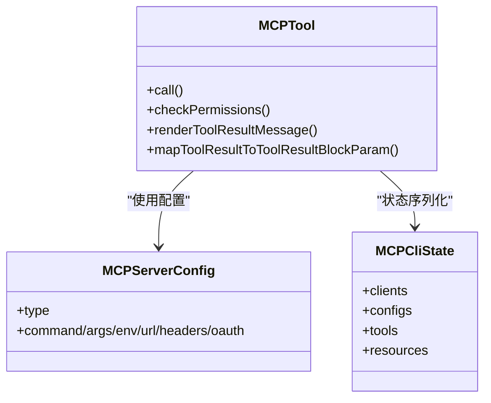
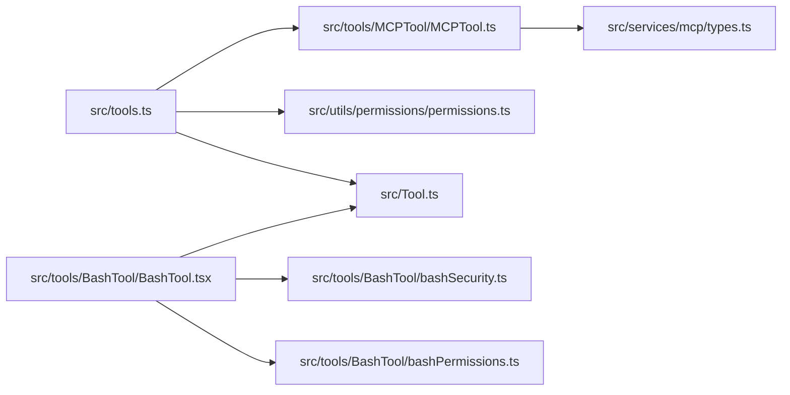

# 工具系统

<cite>
**本文引用的文件**
- [src/tools.ts](file://src/tools.ts)
- [src/Tool.ts](file://src/Tool.ts)
- [src/tools/BashTool/BashTool.tsx](file://src/tools/BashTool/BashTool.tsx)
- [src/tools/BashTool/bashPermissions.ts](file://src/tools/BashTool/bashPermissions.ts)
- [src/tools/BashTool/bashSecurity.ts](file://src/tools/BashTool/bashSecurity.ts)
- [src/tools/FileReadTool/FileReadTool.ts](file://src/tools/FileReadTool/FileReadTool.ts)
- [src/tools/FileEditTool/FileEditTool.ts](file://src/tools/FileEditTool/FileEditTool.ts)
- [src/tools/FileWriteTool/FileWriteTool.ts](file://src/tools/FileWriteTool/FileWriteTool.ts)
- [src/tools/GlobTool/GlobTool.ts](file://src/tools/GlobTool/GlobTool.ts)
- [src/tools/WebSearchTool/WebSearchTool.ts](file://src/tools/WebSearchTool/WebSearchTool.ts)
- [src/tools/WebFetchTool/WebFetchTool.ts](file://src/tools/WebFetchTool/WebFetchTool.ts)
- [src/tools/MCPTool/MCPTool.ts](file://src/tools/MCPTool/MCPTool.ts)
- [src/utils/permissions/permissions.ts](file://src/utils/permissions/permissions.ts)
- [src/services/mcp/types.ts](file://src/services/mcp/types.ts)
</cite>

## 更新摘要
**变更内容**
- 新增了对 Tool.ts 文件中500多行中文注释的分析和文档化
- 更新了工具定义模式、权限处理机制和工具执行上下文的详细说明
- 增强了工具系统架构说明，反映了最新的技术注释和改进
- 完善了工具开发指南，包含新的权限处理和上下文管理机制

## 目录
1. [简介](#简介)
2. [项目结构](#项目结构)
3. [核心组件](#核心组件)
4. [架构总览](#架构总览)
5. [详细组件分析](#详细组件分析)
6. [依赖关系分析](#依赖关系分析)
7. [性能考量](#性能考量)
8. [故障排查指南](#故障排查指南)
9. [结论](#结论)
10. [附录](#附录)

## 简介
本文件系统性阐述 Claude Code Best 的工具系统：从设计理念到实现细节，覆盖工具注册机制、执行流程与生命周期管理；详解内置工具（Bash、文件读写、搜索、Web 抓取）的能力与边界；深入解析权限控制体系（含沙箱、访问控制与安全策略）；说明 MCP 工具集成与外部工具服务器连接机制；并提供工具开发指南与最佳实践。

**更新** 本次更新重点反映了 Tool.ts 文件中新增的500多行中文技术注释，这些注释详细说明了工具定义模式、权限处理机制和工具执行上下文的核心概念。

## 项目结构
工具系统围绕统一的工具抽象与装配管线构建：
- 工具抽象与类型系统：集中于工具接口与上下文定义，确保所有工具具备一致的输入输出、权限校验、UI 渲染与结果映射能力。
- 内置工具集合：按功能域分层组织，涵盖命令行、文件系统、网络检索与 MCP 集成。
- 权限与安全：在工具调用前进行规则匹配、分类器决策与沙箱策略评估。
- MCP 集成：通过统一的 MCPTool 包装，将外部工具无缝接入工具池。



**图表来源**
- [src/tools.ts:191-387](file://src/tools.ts#L191-L387)
- [src/Tool.ts:362-793](file://src/Tool.ts#L362-L793)
- [src/tools/BashTool/BashTool.tsx:640-793](file://src/tools/BashTool/BashTool.tsx#L640-L793)
- [src/tools/BashTool/bashPermissions.ts:1-200](file://src/tools/BashTool/bashPermissions.ts#L1-L200)
- [src/tools/BashTool/bashSecurity.ts:1-200](file://src/tools/BashTool/bashSecurity.ts#L1-L200)
- [src/tools/WebSearchTool/WebSearchTool.ts:65-222](file://src/tools/WebSearchTool/WebSearchTool.ts#L65-L222)
- [src/tools/WebFetchTool/WebFetchTool.ts:66-319](file://src/tools/WebFetchTool/WebFetchTool.ts#L66-L319)
- [src/tools/MCPTool/MCPTool.ts:27-78](file://src/tools/MCPTool/MCPTool.ts#L27-L78)
- [src/utils/permissions/permissions.ts:473-800](file://src/utils/permissions/permissions.ts#L473-L800)
- [src/services/mcp/types.ts:1-259](file://src/services/mcp/types.ts#L1-L259)

**章节来源**
- [src/tools.ts:191-387](file://src/tools.ts#L191-L387)
- [src/Tool.ts:362-793](file://src/Tool.ts#L362-L793)

## 核心组件
- 工具接口与上下文
  - 工具接口定义了调用签名、输入输出模式、并发安全、只读/破坏性标记、权限检查、UI 渲染与结果映射等契约。
  - 工具上下文承载运行期参数（如命令列表、调试开关、模型、MCP 客户端、会话状态等），并提供进度回调、通知与结果存储等能力。
- 工具注册与装配
  - 提供默认预设与工具池装配函数，支持基于权限上下文的过滤、去重与排序，保证提示词缓存稳定性。
  - 支持内置工具与 MCP 工具的合并，内置工具优先级更高，避免 MCP 工具破坏缓存键序。
- 权限与安全
  - 统一的权限规则匹配（允许/拒绝/询问），结合分类器自动决策与沙箱策略，形成多层防护。
  - Bash 工具具备专门的安全解析与前置校验，覆盖危险模式、命令替换、Zsh 特性与环境变量注入等。

**更新** Tool.ts 文件中的新增中文注释详细解释了工具定义模式的核心概念，包括工具接口的各个方法职责、权限处理机制的工作流程，以及工具执行上下文的完整结构。

**章节来源**
- [src/Tool.ts:362-793](file://src/Tool.ts#L362-L793)
- [src/tools.ts:269-387](file://src/tools.ts#L269-L387)
- [src/utils/permissions/permissions.ts:233-390](file://src/utils/permissions/permissions.ts#L233-L390)
- [src/tools/BashTool/bashPermissions.ts:1-120](file://src/tools/BashTool/bashPermissions.ts#L1-L120)

## 架构总览
工具系统采用"抽象统一 + 装配可插 + 权限前置 + 安全加固"的设计：
- 抽象统一：所有工具遵循相同的接口与上下文，便于 UI、权限与结果处理的一致化。
- 装配可插：工具池由注册表生成，内置工具与 MCP 工具合并，支持条件启用与模式过滤。
- 权限前置：在工具调用前进行规则匹配与分类器决策，必要时弹出交互式权限请求。
- 安全加固：Bash 工具引入语法树分析、危险模式检测与沙箱策略，其他工具在路径/内容层面实施限制。

```mermaid
sequenceDiagram
participant 用户 as "用户"
participant 调度 as "工具调度器"
participant 权限 as "权限系统"
participant 工具 as "具体工具"
participant 结果 as "结果映射"
用户->>调度 : 请求使用工具
调度->>权限 : 规则匹配/分类器决策
alt 允许
权限-->>调度 : 允许
调度->>工具 : call(args, 上下文, canUseTool)
工具-->>调度 : ToolResult
调度->>结果 : mapToolResultToToolResultBlockParam
结果-->>用户 : 展示结果
else 拒绝
权限-->>用户 : 拒绝并给出原因
else 询问
权限-->>用户 : 弹出权限对话框
用户确认后进入允许分支
end
```

**图表来源**
- [src/Tool.ts:379-560](file://src/Tool.ts#L379-L560)
- [src/utils/permissions/permissions.ts:473-800](file://src/utils/permissions/permissions.ts#L473-L800)
- [src/tools.ts:343-387](file://src/tools.ts#L343-L387)

## 详细组件分析

### Bash 工具
- 设计理念
  - 将命令行执行抽象为工具，强调安全性与可观测性：支持只读/破坏性判定、并发安全、中断行为、UI 进度与结果渲染。
  - 对复杂命令进行拆解与语义分析，识别搜索/读取/列表类命令，用于 UI 折叠与摘要显示。
- 执行流程
  - 输入校验：超时、后台运行、沙箱覆盖等参数校验；阻塞 sleep 检测与自动后台化策略。
  - 权限检查：规则匹配、分类器决策、Hook 请求、沙箱策略与工作目录约束。
  - 安全加固：AST 解析、危险模式检测（命令替换、heredoc 注入、Zsh 危险命令）、环境变量剥离与重定向验证。
  - 输出处理：图像/结构化内容识别、大结果持久化、进度事件与 UI 呈现。
- 生命周期管理
  - 任务生命周期：前台/后台任务注册、前台任务抢占、任务输出路径与大小限制、长时间运行提示。
  - 文件历史与读取状态：写入前后记录时间戳，避免竞态与过期读取。
- 安全控制
  - 沙箱策略：根据命令特征与用户设置决定是否启用沙箱；支持沙箱绕过提示与审计。
  - 分类器与规则：自动模式下的分类器快速决策，结合允许/拒绝/询问规则形成闭环。



**图表来源**
- [src/tools/BashTool/BashTool.tsx:738-800](file://src/tools/BashTool/BashTool.tsx#L738-L800)
- [src/tools/BashTool/bashPermissions.ts:778-800](file://src/tools/BashTool/bashPermissions.ts#L778-L800)
- [src/tools/BashTool/bashSecurity.ts:585-610](file://src/tools/BashTool/bashSecurity.ts#L585-L610)

**章节来源**
- [src/tools/BashTool/BashTool.tsx:640-800](file://src/tools/BashTool/BashTool.tsx#L640-L800)
- [src/tools/BashTool/bashPermissions.ts:1-200](file://src/tools/BashTool/bashPermissions.ts#L1-L200)
- [src/tools/BashTool/bashSecurity.ts:1-200](file://src/tools/BashTool/bashSecurity.ts#L1-L200)

### 文件操作工具
- FileReadTool
  - 功能：读取文本/图片/笔记本/PDF 等内容，支持偏移与页范围读取；对设备文件与二进制文件进行安全限制；提供读取去重与会话文件识别。
  - 安全：UNC 路径跳过 I/O、设备文件黑名单、二进制扩展白名单（PDF/图片除外）。
  - UI：按类型渲染不同块，支持截断与索引文本提取。
- FileEditTool
  - 功能：在读取后进行原子写入，支持引用样式保留、差异计算与 LSP/VsCode 同步。
  - 安全：文件存在性与修改时间校验、团队内存敏感内容拦截、笔记文件专用工具提示。
  - UI：拒绝/错误/结果消息渲染，支持 Git Diff 与行数统计。
- FileWriteTool
  - 功能：覆盖写入或新建文件，保持换行风格一致性；与 FileEditTool 相同的读取前置与历史记录。
  - 安全：与编辑工具一致的路径与修改时间校验，防止竞态写入。



**图表来源**
- [src/tools/FileReadTool/FileReadTool.ts:337-718](file://src/tools/FileReadTool/FileReadTool.ts#L337-L718)
- [src/tools/FileEditTool/FileEditTool.ts:86-595](file://src/tools/FileEditTool/FileEditTool.ts#L86-L595)
- [src/tools/FileWriteTool/FileWriteTool.ts:94-434](file://src/tools/FileWriteTool/FileWriteTool.ts#L94-L434)

**章节来源**
- [src/tools/FileReadTool/FileReadTool.ts:1-200](file://src/tools/FileReadTool/FileReadTool.ts#L1-L200)
- [src/tools/FileEditTool/FileEditTool.ts:1-200](file://src/tools/FileEditTool/FileEditTool.ts#L1-L200)
- [src/tools/FileWriteTool/FileWriteTool.ts:1-200](file://src/tools/FileWriteTool/FileWriteTool.ts#L1-L200)

### 搜索与导航工具
- GlobTool
  - 功能：基于通配符搜索文件，支持路径合法性校验与结果截断。
  - 安全：UNC 路径跳过 I/O、目录存在性校验。
  - UI：结果列表与截断提示。
- WebSearchTool
  - 功能：网络搜索，支持域名白/黑名单；适配不同后端适配器。
  - 安全：权限请求与输入校验（查询非空、互斥域名列表）。
  - UI：进度消息与结果渲染。
- WebFetchTool
  - 功能：抓取网页并应用提示进行内容抽取，支持预批准主机与二进制内容落盘。
  - 安全：认证/私有 URL 警告、重定向检测与规则匹配。
  - UI：进度消息与结果渲染。



**图表来源**
- [src/tools/WebSearchTool/WebSearchTool.ts:143-183](file://src/tools/WebSearchTool/WebSearchTool.ts#L143-L183)

**章节来源**
- [src/tools/GlobTool/GlobTool.ts:57-199](file://src/tools/GlobTool/GlobTool.ts#L57-L199)
- [src/tools/WebSearchTool/WebSearchTool.ts:65-222](file://src/tools/WebSearchTool/WebSearchTool.ts#L65-L222)
- [src/tools/WebFetchTool/WebFetchTool.ts:208-307](file://src/tools/WebFetchTool/WebFetchTool.ts#L208-L307)

### MCP 工具集成
- 设计理念
  - 通过 MCPTool 作为统一包装，屏蔽 MCP 协议差异，暴露与内置工具一致的调用接口。
  - 工具池装配时将 MCP 工具与内置工具合并，内置优先，避免破坏缓存键序。
- 连接机制
  - 服务端配置支持多种传输（stdio、SSE、WS、HTTP、SDK、代理），并支持 OAuth/XAA 等鉴权扩展。
  - 客户端状态序列化，便于 CLI 与 UI 展示连接状态与可用工具清单。
- 权限控制
  - MCP 工具同样参与权限规则匹配与分类器决策，支持服务器级规则与工具名规范化。



**图表来源**
- [src/tools/MCPTool/MCPTool.ts:27-78](file://src/tools/MCPTool/MCPTool.ts#L27-L78)
- [src/services/mcp/types.ts:124-259](file://src/services/mcp/types.ts#L124-L259)

**章节来源**
- [src/tools/MCPTool/MCPTool.ts:1-78](file://src/tools/MCPTool/MCPTool.ts#L1-L78)
- [src/services/mcp/types.ts:1-259](file://src/services/mcp/types.ts#L1-L259)

## 依赖关系分析
- 工具装配依赖
  - 工具池装配函数依赖权限上下文进行规则过滤，并对内置与 MCP 工具进行去重与稳定排序。
- 权限系统依赖
  - 权限系统依赖规则解析、分类器与 Hook，同时与工具的输入/路径匹配器配合。
- Bash 工具依赖
  - Bash 工具依赖安全解析、危险模式检测与沙箱策略，且与文件系统读取状态协同以避免竞态。



**图表来源**
- [src/tools.ts:343-387](file://src/tools.ts#L343-L387)
- [src/Tool.ts:362-793](file://src/Tool.ts#L362-L793)
- [src/utils/permissions/permissions.ts:473-800](file://src/utils/permissions/permissions.ts#L473-L800)
- [src/tools/MCPTool/MCPTool.ts:27-78](file://src/tools/MCPTool/MCPTool.ts#L27-L78)
- [src/services/mcp/types.ts:1-259](file://src/services/mcp/types.ts#L1-L259)
- [src/tools/BashTool/BashTool.tsx:640-793](file://src/tools/BashTool/BashTool.tsx#L640-L793)
- [src/tools/BashTool/bashPermissions.ts:1-200](file://src/tools/BashTool/bashPermissions.ts#L1-L200)
- [src/tools/BashTool/bashSecurity.ts:1-200](file://src/tools/BashTool/bashSecurity.ts#L1-L200)

**章节来源**
- [src/tools.ts:343-387](file://src/tools.ts#L343-L387)
- [src/utils/permissions/permissions.ts:473-800](file://src/utils/permissions/permissions.ts#L473-L800)

## 性能考量
- 工具池装配
  - 使用稳定排序与去重策略，确保内置工具前缀连续，避免 MCP 工具打乱缓存键序导致的缓存失效。
- 文件读取
  - 读取去重与令牌计数优化，减少重复内容传输与缓存浪费。
- Bash 执行
  - 大输出持久化与进度事件，避免一次性渲染造成 UI 卡顿；自动后台化与长时间运行提示提升交互体验。
- 搜索与抓取
  - 结果截断与分页限制，降低令牌与带宽消耗；权限请求与分类器决策减少无效调用。

## 故障排查指南
- Bash 工具
  - 阻塞 sleep 检测：若命令包含长时间阻塞且未后台运行，将被拦截并建议使用 Monitor 或 run_in_background。
  - 权限拒绝：检查规则匹配与分类器决策，必要时添加允许规则或切换到交互模式。
  - 沙箱绕过：当沙箱策略触发时，查看沙箱指示器与分类器提示，确认是否需要调整命令或关闭沙箱。
- 文件工具
  - 读取后写入失败：检查文件是否被修改或未先读取；编辑工具会检测时间戳变化并拒绝写入。
  - 笔记本文件：编辑 .ipynb 文件需使用 NotebookEditTool。
- 搜索与抓取
  - WebSearchTool：查询为空或域名列表冲突会导致校验失败；请修正输入。
  - WebFetchTool：认证/私有 URL 将失败；遇到重定向需更新 URL 参数重新请求。
- MCP 工具
  - 连接失败：检查服务器配置与传输类型；确认鉴权与 OAuth 设置正确。
  - 权限问题：确认 MCP 工具名称与规则匹配，必要时添加允许规则。

**章节来源**
- [src/tools/BashTool/BashTool.tsx:738-754](file://src/tools/BashTool/BashTool.tsx#L738-L754)
- [src/tools/FileEditTool/FileEditTool.ts:275-311](file://src/tools/FileEditTool/FileEditTool.ts#L275-L311)
- [src/tools/WebSearchTool/WebSearchTool.ts:124-142](file://src/tools/WebSearchTool/WebSearchTool.ts#L124-L142)
- [src/tools/WebFetchTool/WebFetchTool.ts:191-204](file://src/tools/WebFetchTool/WebFetchTool.ts#L191-L204)
- [src/services/mcp/types.ts:124-175](file://src/services/mcp/types.ts#L124-L175)

## 结论
该工具系统以统一抽象为核心，通过严格的权限与安全机制保障执行安全，借助 MCP 集成实现生态扩展。内置工具覆盖命令行、文件系统与网络检索等高频场景，装配管线兼顾性能与稳定性。开发者可基于 buildTool 快速扩展新工具，遵循只读/破坏性标记、并发安全与 UI 渲染约定，即可无缝融入现有体系。

**更新** Tool.ts 文件中的新增中文注释为工具系统的理解和使用提供了更清晰的指导，特别是在工具定义模式、权限处理机制和工具执行上下文方面，这些注释体现了系统的工程化设计和对开发者友好的理念。

## 附录

### 工具开发指南
- 创建步骤
  - 使用 buildTool 定义工具：提供名称、输入/输出模式、描述、UI 渲染与结果映射。
  - 实现 validateInput 与 checkPermissions，确保输入合法与权限合规。
  - 如涉及文件路径，实现 getPath 并在 validateInput 中进行路径合法性检查。
  - 若为 Bash 工具，参考 bashPermissions 与 bashSecurity 的模式与规则。
- 注册与装配
  - 在工具注册表中加入新工具，确保其 isEnabled 与模式过滤逻辑正确。
  - 使用 assembleToolPool 合并内置与 MCP 工具，注意内置优先级与去重。
- 测试要点
  - 编写输入校验与权限拒绝/允许/询问三类用例。
  - 对 Bash 工具，覆盖危险模式、命令替换与沙箱绕过场景。
  - 对文件工具，覆盖读取后写入、竞态与二进制文件场景。

**更新** Tool.ts 文件中的新增中文注释详细说明了工具定义模式的核心要素，包括工具接口的各个方法职责、权限处理机制的工作流程，以及工具执行上下文的完整结构。这些注释为工具开发提供了清晰的指导原则。

**章节来源**
- [src/Tool.ts:783-793](file://src/Tool.ts#L783-L793)
- [src/tools.ts:191-249](file://src/tools.ts#L191-L249)
- [src/tools/BashTool/bashPermissions.ts:266-295](file://src/tools/BashTool/bashPermissions.ts#L266-L295)
- [src/tools/BashTool/bashSecurity.ts:585-610](file://src/tools/BashTool/bashSecurity.ts#L585-L610)

### 工具定义模式详解
**更新** 基于 Tool.ts 文件中的新增中文注释，以下是工具定义模式的详细说明：

- 工具接口的核心方法
  - `call()`：执行工具的主要方法，接受参数、上下文和权限检查函数
  - `validateInput()`：验证输入参数的合法性
  - `checkPermissions()`：检查权限并返回权限结果
  - `renderToolResultMessage()`：渲染工具结果消息
  - `mapToolResultToToolResultBlockParam()`：将工具结果映射为消息块参数

- 工具属性定义
  - `name`：工具的唯一标识符
  - `aliases`：工具的别名列表，用于向后兼容
  - `searchHint`：用于工具搜索的关键字提示
  - `isReadOnly()`：判断工具是否为只读操作
  - `isDestructive()`：判断工具是否为破坏性操作
  - `interruptBehavior()`：定义工具中断时的行为

- 工具执行上下文
  - `options`：包含命令列表、调试选项、模型信息等
  - `abortController`：用于取消工具执行
  - `messages`：会话消息数组
  - `fileReadingLimits`：文件读取限制
  - `globLimits`：全局搜索限制

**章节来源**
- [src/Tool.ts:358-685](file://src/Tool.ts#L358-L685)

### 权限处理机制
**更新** Tool.ts 文件中的新增中文注释详细说明了权限处理机制：

- 权限上下文
  - `mode`：当前权限模式（默认、自动、绕过等）
  - `additionalWorkingDirectories`：额外的工作目录
  - `alwaysAllowRules`：始终允许的规则
  - `alwaysDenyRules`：始终拒绝的规则
  - `alwaysAskRules`：需要询问的规则

- 权限决策流程
  1. 强制检查：拒绝规则匹配 → 立即拒绝
  2. 规则匹配：工具自检 → 允许/拒绝/询问
  3. 模式决策：根据权限模式进行最终决策
  4. 模式后处理：静默拒绝、自动模式等处理

**章节来源**
- [src/Tool.ts:123-138](file://src/Tool.ts#L123-L138)
- [src/utils/permissions/permissions.ts:134-200](file://src/utils/permissions/permissions.ts#L134-L200)