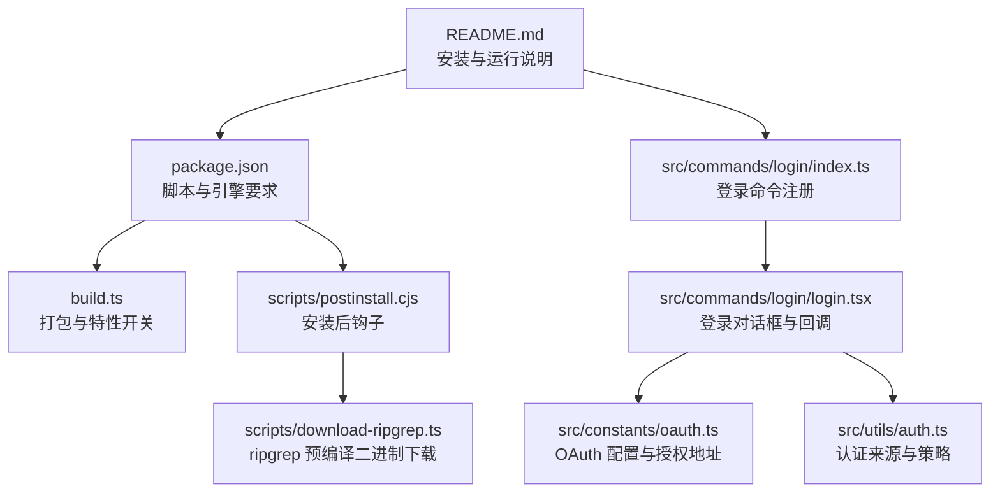
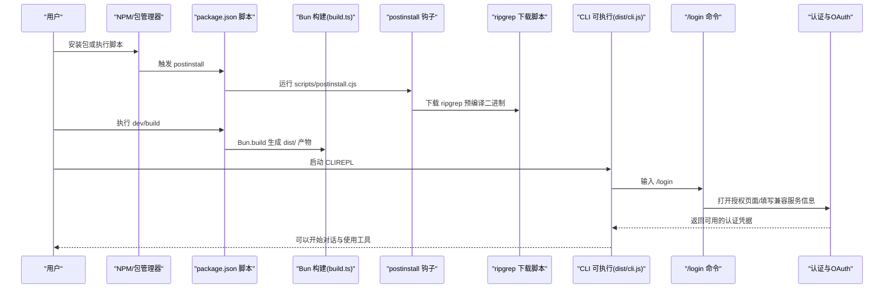
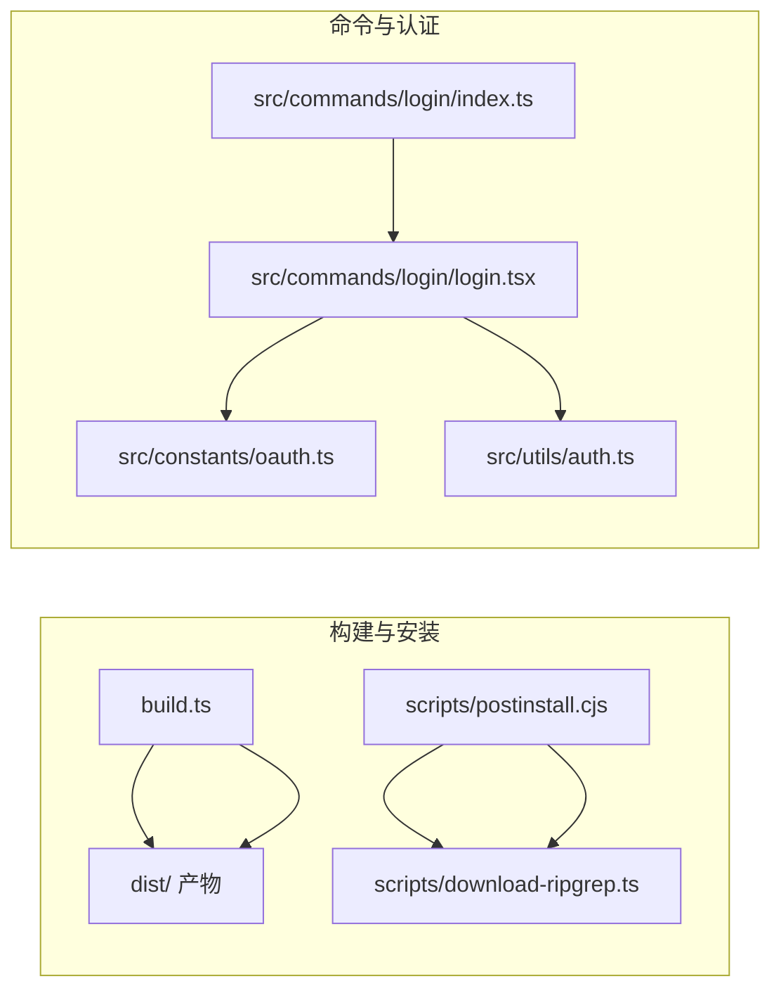

# 快速开始

<cite>
**本文引用的文件**
- [README.md](file://README.md)
- [package.json](file://package.json)
- [bunfig.toml](file://bunfig.toml)
- [scripts/download-ripgrep.ts](file://scripts/download-ripgrep.ts)
- [scripts/postinstall.cjs](file://scripts/postinstall.cjs)
- [build.ts](file://build.ts)
- [src/commands/login/index.ts](file://src/commands/login/index.ts)
- [src/commands/login/login.tsx](file://src/commands/login/login.tsx)
- [src/constants/oauth.ts](file://src/constants/oauth.ts)
- [src/utils/auth.ts](file://src/utils/auth.ts)
</cite>

## 目录
1. [简介](#简介)
2. [项目结构](#项目结构)
3. [核心组件](#核心组件)
4. [架构总览](#架构总览)
5. [详细组件解析](#详细组件解析)
6. [依赖关系分析](#依赖关系分析)
7. [性能与构建特性](#性能与构建特性)
8. [故障排查指南](#故障排查指南)
9. [结论](#结论)
10. [附录](#附录)

## 简介
本指南面向首次接触 Claude Code Best（简称 CCB）的用户，帮助你在最短时间内完成安装与首次运行，并进行基础配置。内容覆盖两种安装方式：
- 安装版（NPM 包直接使用）
- 源码版（从仓库克隆并本地开发）

同时提供国内网络环境下的网络代理与镜像配置建议，以及首次运行后的基础配置指引，尤其是 /login 命令与第三方 API 兼容服务的对接方法。

## 项目结构
- 核心入口与命令体系位于 src/，CLI 入口为 src/entrypoints/cli.tsx，命令注册与加载在 src/commands/。
- 构建脚本位于根目录，使用 Bun 的内置打包工具生成 dist/ 目录产物。
- 网络与二进制下载逻辑集中在 scripts/，包括 ripgrep 预编译二进制的自动下载与安装。
- 登录与认证相关逻辑分布在 src/commands/login/ 与 src/utils/auth.ts、src/constants/oauth.ts。

**图表来源**
- [README.md:26-98](file://README.md#L26-L98)
- [package.json:40-54](file://package.json#L40-L54)
- [build.ts:1-100](file://build.ts#L1-L100)
- [scripts/postinstall.cjs:1-320](file://scripts/postinstall.cjs#L1-L320)
- [scripts/download-ripgrep.ts:1-336](file://scripts/download-ripgrep.ts#L1-L336)
- [src/commands/login/index.ts:1-15](file://src/commands/login/index.ts#L1-L15)
- [src/commands/login/login.tsx:1-114](file://src/commands/login/login.tsx#L1-L114)
- [src/constants/oauth.ts:1-235](file://src/constants/oauth.ts#L1-L235)
- [src/utils/auth.ts:1-800](file://src/utils/auth.ts#L1-L800)

**章节来源**
- [README.md:26-98](file://README.md#L26-L98)
- [package.json:40-54](file://package.json#L40-L54)

## 核心组件
- 安装与运行脚本：通过 package.json 的 scripts 字段统一管理，包括 dev、dev:inspect、build、postinstall 等。
- 构建系统：build.ts 使用 Bun.build，开启代码分割与特性开关注入，产物输出至 dist/。
- ripgrep 下载：postinstall.cjs 与 download-ripgrep.ts 在安装时自动下载对应平台的预编译二进制，支持代理与镜像。
- 登录与认证：/login 命令负责触发登录流程，支持 Anthropic 官方 OAuth 与第三方兼容服务；认证来源由 src/utils/auth.ts 决策。

**章节来源**
- [package.json:40-54](file://package.json#L40-L54)
- [build.ts:1-100](file://build.ts#L1-L100)
- [scripts/postinstall.cjs:1-320](file://scripts/postinstall.cjs#L1-L320)
- [scripts/download-ripgrep.ts:1-336](file://scripts/download-ripgrep.ts#L1-L336)
- [src/commands/login/index.ts:1-15](file://src/commands/login/index.ts#L1-L15)
- [src/commands/login/login.tsx:1-114](file://src/commands/login/login.tsx#L1-L114)
- [src/utils/auth.ts:1-800](file://src/utils/auth.ts#L1-L800)

## 架构总览
下图展示从安装到首次运行的关键流程，包括网络二进制下载、构建产物生成、REPL 启动与登录配置。

**图表来源**
- [package.json:40-54](file://package.json#L40-L54)
- [build.ts:1-100](file://build.ts#L1-L100)
- [scripts/postinstall.cjs:1-320](file://scripts/postinstall.cjs#L1-L320)
- [scripts/download-ripgrep.ts:1-336](file://scripts/download-ripgrep.ts#L1-L336)
- [src/commands/login/index.ts:1-15](file://src/commands/login/index.ts#L1-L15)
- [src/commands/login/login.tsx:1-114](file://src/commands/login/login.tsx#L1-L114)
- [src/utils/auth.ts:1-800](file://src/utils/auth.ts#L1-L800)

## 详细组件解析

### 安装版（NPM 安装后直接使用）
- 安装与信任
  - 全局安装包并信任该包，随后即可直接运行命令。
- 国内网络优化
  - 若访问 GitHub 较慢，可通过设置环境变量指定 ripgrep 预编译包的镜像地址，避免下载失败。
- 启动
  - 直接运行命令打开 REPL，进入交互式体验。

注意
- 该方式不涉及本地源码修改，适合快速体验与日常使用。
- 若需调试或二次开发，请参考“源码版”章节。

**章节来源**
- [README.md:26-41](file://README.md#L26-L41)

### 源码版（从仓库克隆并本地开发）
- 环境要求
  - 需要最新版本的 Bun（建议升级到最新稳定版），否则可能出现兼容性问题。
- 安装依赖
  - 使用 bun install 安装项目依赖。
  - 安装完成后自动执行 postinstall 钩子，下载 ripgrep 预编译二进制。
- 构建产物
  - 使用 bun run build 生成 dist/ 目录，包含主入口与大量代码分割后的 chunk 文件。
  - 构建产物可在 Bun 与 Node 环境中运行。
- 运行方式
  - 开发模式：bun run dev
  - 如需调试 TUI（REPL），可使用 dev:inspect 并在 VS Code 中 attach 调试。

国内网络优化
- 若网络受限，可设置 ripgrep 镜像地址环境变量，使下载脚本走代理或镜像站点。

**章节来源**
- [README.md:42-78](file://README.md#L42-L78)
- [package.json:24-26](file://package.json#L24-L26)
- [package.json:40-54](file://package.json#L40-L54)
- [build.ts:1-100](file://build.ts#L1-L100)
- [scripts/postinstall.cjs:1-320](file://scripts/postinstall.cjs#L1-L320)
- [scripts/download-ripgrep.ts:1-336](file://scripts/download-ripgrep.ts#L1-L336)

### 首次运行与基础配置（/login 命令）
- 触发登录
  - 在 REPL 中输入 /login 命令，进入登录配置界面。
- 选择认证方式
  - 可选择 Anthropic Compatible（第三方 API 兼容服务），无需 Anthropic 官方账号。
  - 也可选择 OpenAI/Gemini 对应的兼容项。
- 填写必要字段
  - Base URL、API Key、Haiku/Sonnet/Opus 模型 ID 等。
  - 使用 Tab/Shift+Tab 切换字段，Enter 确认并跳转，最后按 Enter 保存。
- 生效机制
  - 登录成功后，系统会刷新远程设置、策略限制、用户缓存与功能开关，并重置相关权限检查。
  - 若切换账户，会清理旧的信任设备令牌并重新登记。

提示
- 支持所有与 Anthropic Messages API 兼容的服务（如 OpenRouter、AWS Bedrock 代理等）。

**章节来源**
- [README.md:79-98](file://README.md#L79-L98)
- [src/commands/login/index.ts:1-15](file://src/commands/login/index.ts#L1-L15)
- [src/commands/login/login.tsx:1-114](file://src/commands/login/login.tsx#L1-L114)
- [src/constants/oauth.ts:1-235](file://src/constants/oauth.ts#L1-L235)
- [src/utils/auth.ts:1-800](file://src/utils/auth.ts#L1-L800)

### 第三方 API 兼容服务配置
- 适用场景
  - 无需 Anthropic 官方账号，即可对接第三方兼容服务（如 OpenRouter、AWS Bedrock 代理等）。
- 配置要点
  - Base URL：第三方服务的 API 地址。
  - API Key：服务侧签发的密钥。
  - 模型 ID：分别填写快速、均衡、高性能模型对应的 ID。
- 注意事项
  - 确保第三方服务的接口与 Messages API 兼容。
  - 若使用代理或网关，确保请求头与认证方式正确传递。

**章节来源**
- [README.md:79-98](file://README.md#L79-L98)
- [src/constants/oauth.ts:1-235](file://src/constants/oauth.ts#L1-L235)

## 依赖关系分析
- 构建与打包
  - build.ts 作为打包入口，聚合默认特性与用户通过 FEATURE_* 注入的特性，生成多文件产物。
- 安装后处理
  - postinstall.cjs 与 download-ripgrep.ts 在安装阶段自动下载 ripgrep 预编译二进制，支持代理与镜像。
- 命令与认证
  - /login 命令注册与实现位于 src/commands/login/，登录流程调用 OAuth 配置与认证策略。

**图表来源**
- [build.ts:1-100](file://build.ts#L1-L100)
- [scripts/postinstall.cjs:1-320](file://scripts/postinstall.cjs#L1-L320)
- [scripts/download-ripgrep.ts:1-336](file://scripts/download-ripgrep.ts#L1-L336)
- [src/commands/login/index.ts:1-15](file://src/commands/login/index.ts#L1-L15)
- [src/commands/login/login.tsx:1-114](file://src/commands/login/login.tsx#L1-L114)
- [src/constants/oauth.ts:1-235](file://src/constants/oauth.ts#L1-L235)
- [src/utils/auth.ts:1-800](file://src/utils/auth.ts#L1-L800)

**章节来源**
- [build.ts:1-100](file://build.ts#L1-L100)
- [scripts/postinstall.cjs:1-320](file://scripts/postinstall.cjs#L1-L320)
- [scripts/download-ripgrep.ts:1-336](file://scripts/download-ripgrep.ts#L1-L336)
- [src/commands/login/index.ts:1-15](file://src/commands/login/index.ts#L1-L15)
- [src/commands/login/login.tsx:1-114](file://src/commands/login/login.tsx#L1-L114)
- [src/constants/oauth.ts:1-235](file://src/constants/oauth.ts#L1-L235)
- [src/utils/auth.ts:1-800](file://src/utils/auth.ts#L1-L800)

## 性能与构建特性
- 代码分割
  - 构建开启 splitting，产物数量较多（约数百个 chunk），有利于按需加载与增量更新。
- 兼容性处理
  - 构建后会对部分文件进行替换，适配 Node.js 的 require 行为，提升跨环境运行稳定性。
- 特性开关
  - 通过 FEATURE_* 环境变量控制特性集合，便于按需裁剪与测试。

**章节来源**
- [build.ts:1-100](file://build.ts#L1-L100)
- [README.md:73-75](file://README.md#L73-L75)

## 故障排查指南
- 安装阶段网络问题
  - 症状：ripgrep 下载失败或超时。
  - 解决：设置镜像地址环境变量，使下载脚本走代理或镜像站点。
- VS Code 调试 TUI（REPL）
  - 症状：无法直接在 VS Code 中启动 TUI 调试。
  - 解决：使用 dev:inspect 启动调试服务，再在 VS Code 中 attach，选择合适的调试配置。
- 功能开关未生效
  - 症状：期望的功能未出现。
  - 解决：确认 FEATURE_* 环境变量拼写与值是否正确，重新执行构建后再启动。

**章节来源**
- [scripts/download-ripgrep.ts:1-336](file://scripts/download-ripgrep.ts#L1-L336)
- [scripts/postinstall.cjs:1-320](file://scripts/postinstall.cjs#L1-L320)
- [README.md:109-124](file://README.md#L109-L124)
- [README.md:99-107](file://README.md#L99-L107)

## 结论
通过本指南，你可以：
- 快速完成安装版或源码版的部署与运行；
- 在国内网络环境下顺利下载依赖与二进制；
- 成功完成首次登录并配置第三方 API 兼容服务；
- 了解构建与调试的基本流程，为后续深入使用打下基础。

## 附录

### 常用命令清单
- 安装版
  - 全局安装并信任：bun i -g claude-code-best；bun pm -g trust claude-code-best
  - 启动：ccb
- 源码版
  - 安装依赖：bun install
  - 开发运行：bun run dev
  - 构建产物：bun run build
  - 调试 TUI：bun run dev:inspect（配合 VS Code attach）

**章节来源**
- [README.md:26-78](file://README.md#L26-L78)
- [package.json:40-54](file://package.json#L40-L54)