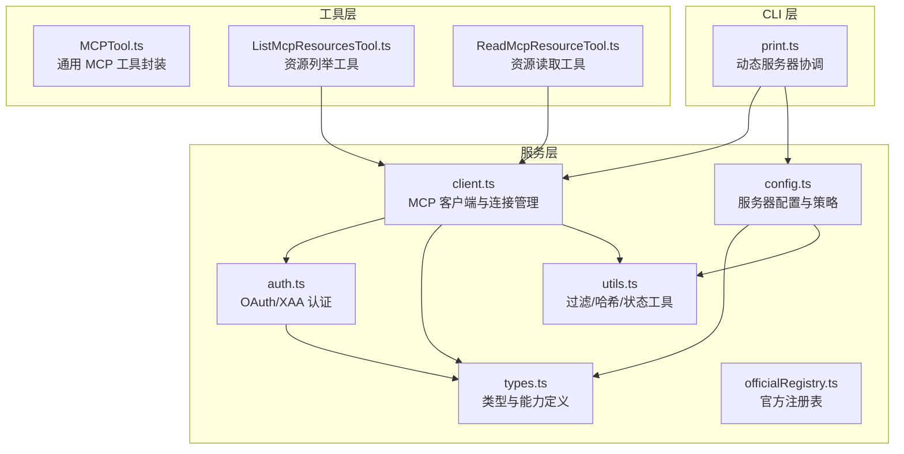
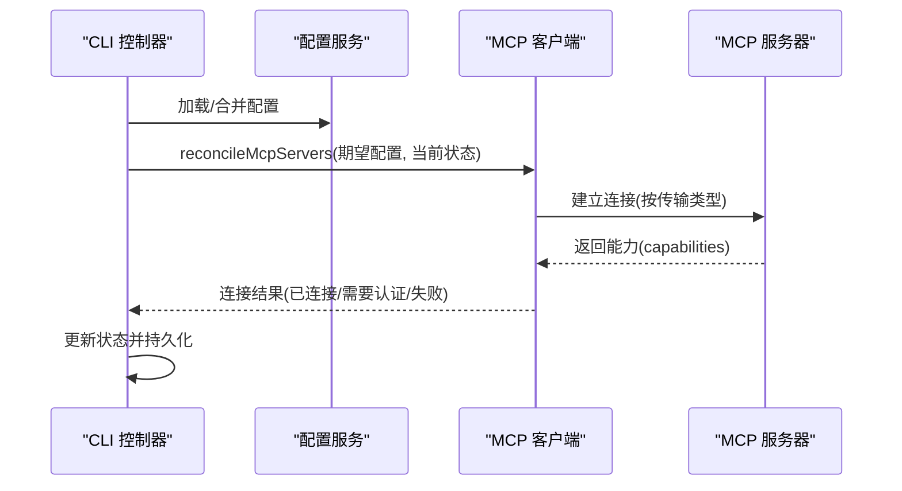
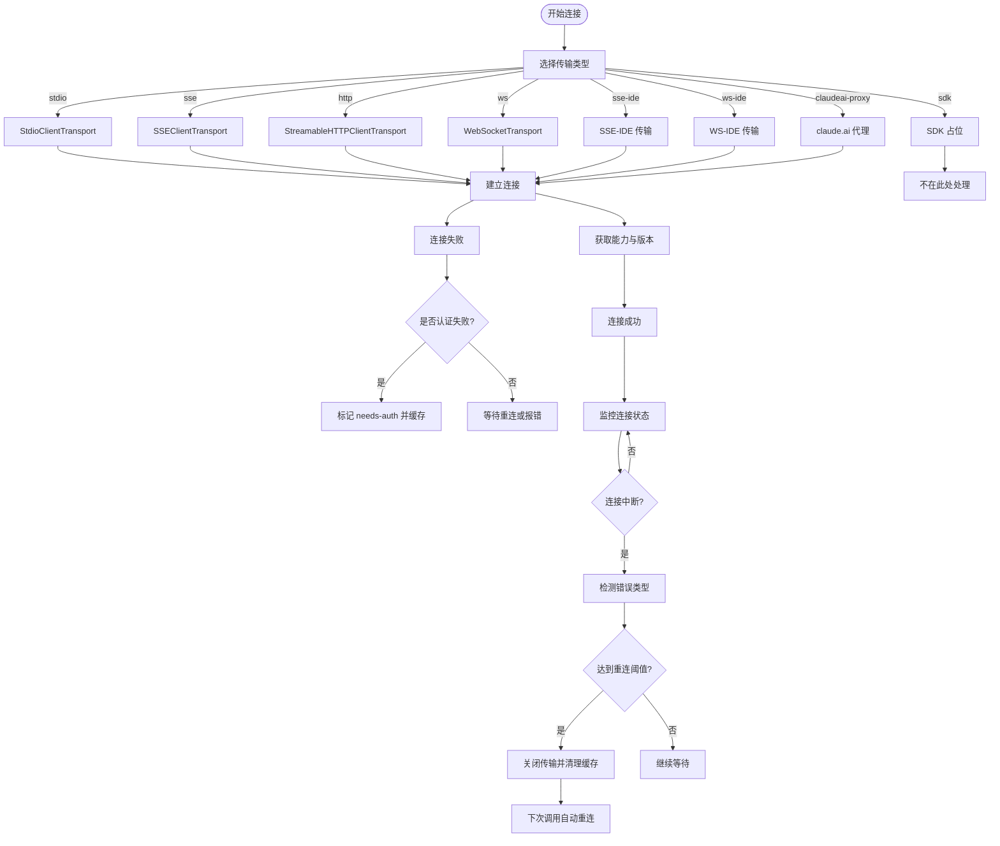
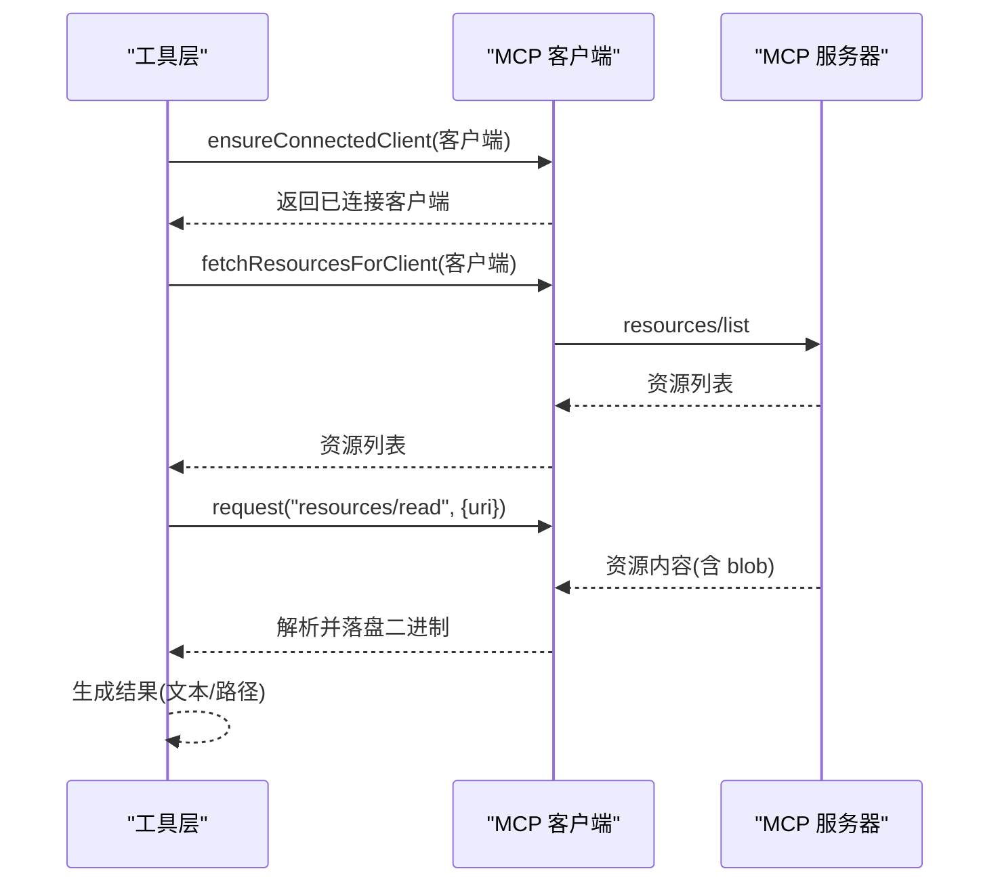
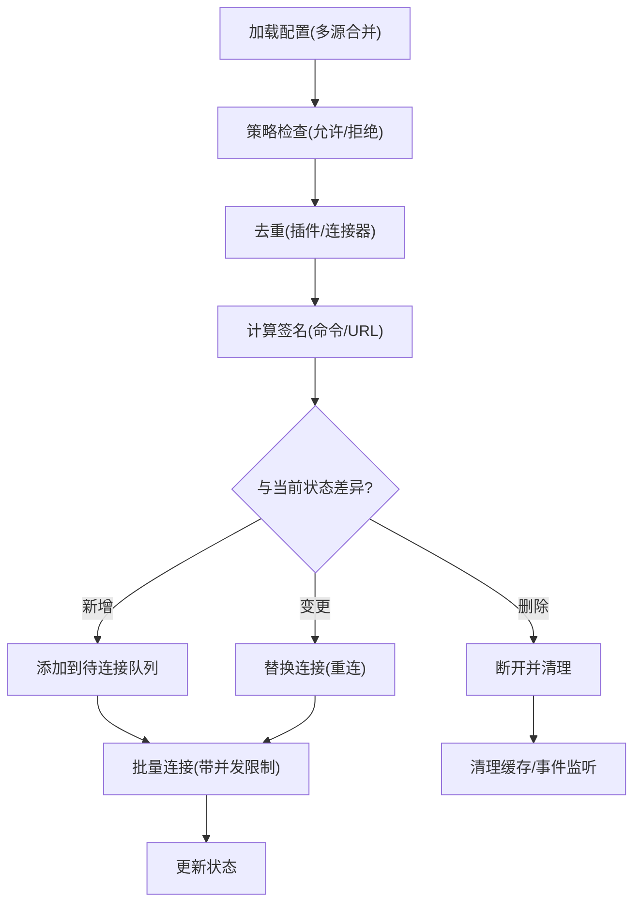
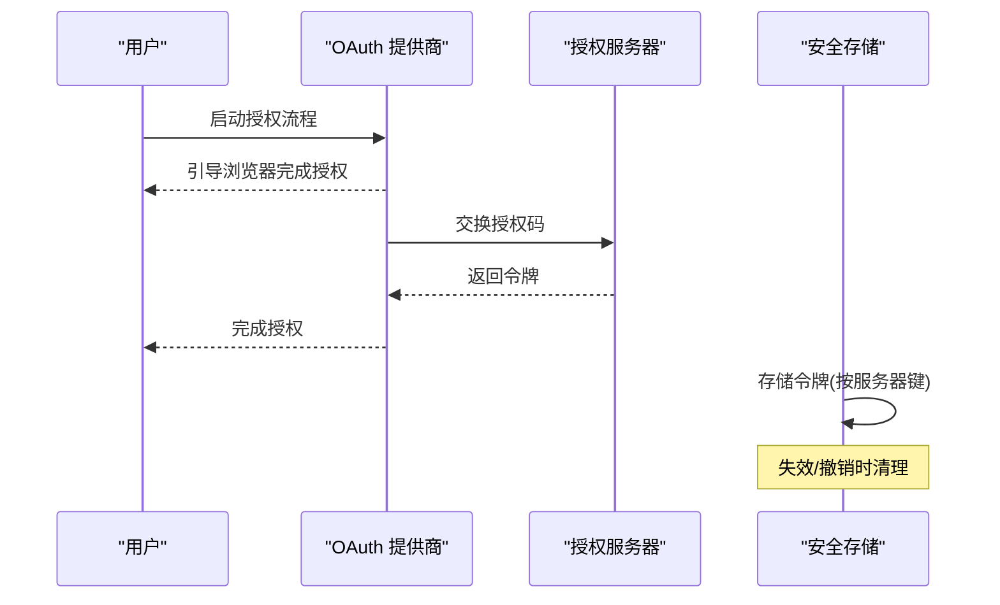
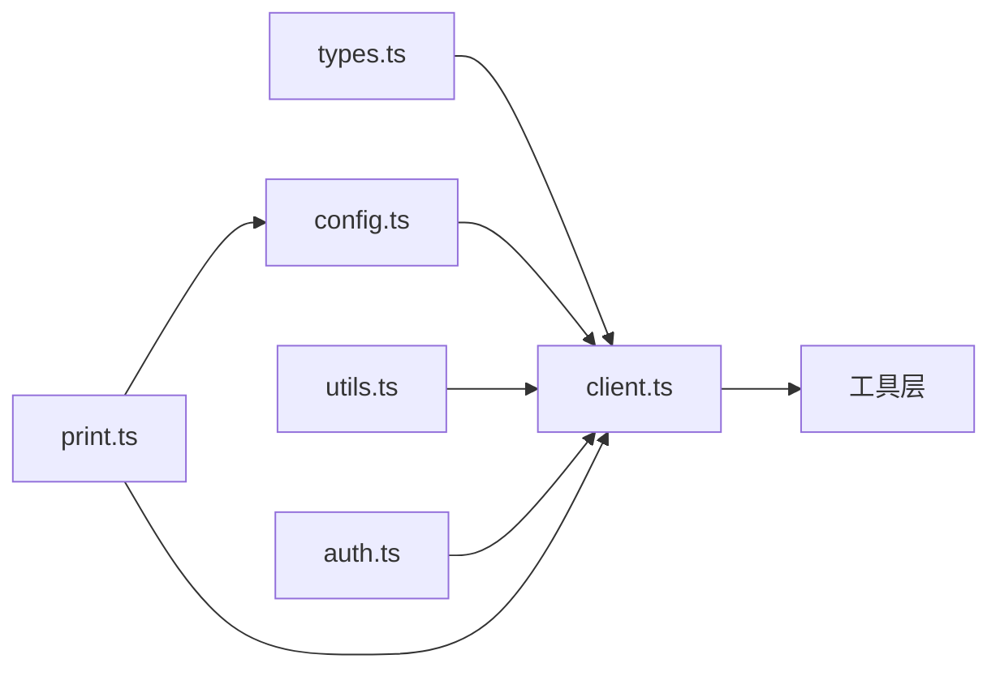

# MCP 协议集成

<cite>
**本文档引用的文件**
- [client.ts](file://src/services/mcp/client.ts)
- [config.ts](file://src/services/mcp/config.ts)
- [types.ts](file://src/services/mcp/types.ts)
- [auth.ts](file://src/services/mcp/auth.ts)
- [utils.ts](file://src/services/mcp/utils.ts)
- [officialRegistry.ts](file://src/services/mcp/officialRegistry.ts)
- [MCPTool.ts](file://src/tools/MCPTool/MCPTool.ts)
- [ListMcpResourcesTool.ts](file://src/tools/ListMcpResourcesTool/ListMcpResourcesTool.ts)
- [ReadMcpResourceTool.ts](file://src/tools/ReadMcpResourceTool/ReadMcpResourceTool.ts)
- [print.ts](file://src/cli/print.ts)
</cite>

## 目录
1. [简介](#简介)
2. [项目结构](#项目结构)
3. [核心组件](#核心组件)
4. [架构总览](#架构总览)
5. [详细组件分析](#详细组件分析)
6. [依赖关系分析](#依赖关系分析)
7. [性能考量](#性能考量)
8. [故障排除指南](#故障排除指南)
9. [结论](#结论)
10. [附录](#附录)

## 简介
本文件系统性阐述 Claude Code Best 中的 Model Context Protocol（MCP）协议集成功能，覆盖协议架构与工作机制、客户端实现（连接管理、认证与重连）、工具集成（资源发现、工具调用与结果处理）、服务器配置（本地/远程/官方注册表管理）、工具开发指南（定义、协议实现与测试）、安全与权限控制以及性能优化策略，并提供完整集成示例与故障排除建议。

## 项目结构
MCP 相关代码主要分布在以下模块：
- 服务层：MCP 客户端、认证、配置、工具与资源访问、实用函数与官方注册表
- 工具层：通用 MCP 工具封装、资源列举与读取工具
- CLI 层：动态服务器状态协调与批量连接管理

**图表来源**
- [client.ts:1-200](file://src/services/mcp/client.ts#L1-L200)
- [config.ts:1-120](file://src/services/mcp/config.ts#L1-L120)
- [auth.ts:1-120](file://src/services/mcp/auth.ts#L1-L120)
- [types.ts:1-120](file://src/services/mcp/types.ts#L1-L120)
- [utils.ts:1-120](file://src/services/mcp/utils.ts#L1-L120)
- [officialRegistry.ts:1-73](file://src/services/mcp/officialRegistry.ts#L1-L73)
- [MCPTool.ts:1-78](file://src/tools/MCPTool/MCPTool.ts#L1-L78)
- [ListMcpResourcesTool.ts:1-124](file://src/tools/ListMcpResourcesTool/ListMcpResourcesTool.ts#L1-L124)
- [ReadMcpResourceTool.ts:1-159](file://src/tools/ReadMcpResourceTool/ReadMcpResourceTool.ts#L1-L159)
- [print.ts:5448-5520](file://src/cli/print.ts#L5448-L5520)

**章节来源**
- [client.ts:1-200](file://src/services/mcp/client.ts#L1-L200)
- [config.ts:1-120](file://src/services/mcp/config.ts#L1-L120)
- [auth.ts:1-120](file://src/services/mcp/auth.ts#L1-L120)
- [types.ts:1-120](file://src/services/mcp/types.ts#L1-L120)
- [utils.ts:1-120](file://src/services/mcp/utils.ts#L1-L120)
- [officialRegistry.ts:1-73](file://src/services/mcp/officialRegistry.ts#L1-L73)
- [MCPTool.ts:1-78](file://src/tools/MCPTool/MCPTool.ts#L1-L78)
- [ListMcpResourcesTool.ts:1-124](file://src/tools/ListMcpResourcesTool/ListMcpResourcesTool.ts#L1-L124)
- [ReadMcpResourceTool.ts:1-159](file://src/tools/ReadMcpResourceTool/ReadMcpResourceTool.ts#L1-L159)
- [print.ts:5448-5520](file://src/cli/print.ts#L5448-L5520)

## 核心组件
- MCP 客户端与连接管理：负责不同传输类型的连接建立、错误检测与自动重连、会话过期处理、缓存清理与资源回收。
- 配置与策略：支持多级配置（用户/项目/本地/动态/企业/claude.ai），策略检查（允许/拒绝列表）、去重与签名计算。
- 认证与授权：OAuth 发现与刷新、XAA（跨应用访问）流程、令牌撤销、敏感参数脱敏与日志保护。
- 工具与资源：通用 MCP 工具封装、资源列举与读取工具、命令/工具/资源的归属过滤。
- 实用工具：稳定哈希、状态过滤、项目服务器状态、日志安全 URL 提取。
- 官方注册表：预取并缓存官方 MCP 服务器 URL，用于安全判定与合规提示。

**章节来源**
- [client.ts:596-800](file://src/services/mcp/client.ts#L596-L800)
- [config.ts:536-616](file://src/services/mcp/config.ts#L536-L616)
- [auth.ts:313-470](file://src/services/mcp/auth.ts#L313-L470)
- [utils.ts:151-224](file://src/services/mcp/utils.ts#L151-L224)
- [officialRegistry.ts:33-73](file://src/services/mcp/officialRegistry.ts#L33-L73)

## 架构总览
MCP 集成采用“服务-工具-CLI”分层架构：
- 服务层提供统一的 MCP 客户端，抽象不同传输类型（stdio、SSE、HTTP、WebSocket、IDE 专用、SDK 占位、claude.ai 代理）。
- 工具层通过 MCP 客户端暴露资源与工具能力，供上层对话与任务使用。
- CLI 层负责动态服务器状态协调与批量连接管理，确保配置变更时的平滑过渡。

**图表来源**
- [print.ts:5448-5520](file://src/cli/print.ts#L5448-L5520)
- [client.ts:596-800](file://src/services/mcp/client.ts#L596-L800)
- [config.ts:536-616](file://src/services/mcp/config.ts#L536-L616)

## 详细组件分析

### MCP 客户端实现
- 连接管理
  - 支持多种传输类型：stdio、SSE、HTTP、WebSocket、IDE 专用（sse-ide/ws-ide）、SDK 占位、claude.ai 代理。
  - 统一的连接超时控制与连接测试（HTTP 传输先进行基础连通性探测）。
  - 连接成功后记录能力、版本与指令，限制指令长度以避免上下文污染。
- 认证机制
  - 通过 ClaudeAuthProvider 注入 OAuth 令牌；支持自定义发现与刷新。
  - 对于 claude.ai 代理，使用专用 fetch 包装，携带会话令牌并处理 401 自动刷新。
  - SSE/HTTP/claude.ai 代理的认证失败统一走 needs-auth 流程并写入缓存。
- 重连策略
  - 增强的连接中断检测：对常见网络错误（ECONNRESET、ETIMEDOUT、EHOSTUNREACH、ECONNREFUSED、EPIPE、Body Timeout、SSE 断开等）进行分类统计。
  - 达到阈值（如连续 3 次终端错误）触发主动关闭与缓存清理，促使下一次调用重新连接。
  - HTTP 与 claude.ai 代理在检测到会话过期（404 + 特定 JSON-RPC 代码）时主动关闭并清理缓存。
- 资源与工具缓存
  - 使用 memoize 缓存连接对象，onclose 时清理缓存，确保断线后重建。
  - fetchToolsForClient/fetchResourcesForClient 等缓存按服务器名失效，避免陈旧数据。
- 清理与回收
  - stdio 传输显式发送 SIGINT/SIGTERM/SIGKILL 信号序列，配合进程监控与超时，保证优雅退出。
  - 其他传输类型关闭客户端连接并移除事件监听，防止内存泄漏。

**图表来源**
- [client.ts:596-800](file://src/services/mcp/client.ts#L596-L800)
- [client.ts:1218-1404](file://src/services/mcp/client.ts#L1218-L1404)

**章节来源**
- [client.ts:596-800](file://src/services/mcp/client.ts#L596-L800)
- [client.ts:1218-1404](file://src/services/mcp/client.ts#L1218-L1404)

### MCP 工具集成
- 通用 MCP 工具封装
  - MCPTool 作为占位工具，实际名称与行为由运行时注入，支持进度渲染与结果截断判断。
- 资源发现与读取
  - ListMcpResourcesTool：遍历已连接客户端，拉取并聚合资源清单，忽略单个服务器连接失败的影响。
  - ReadMcpResourceTool：按服务器与 URI 请求 resources/read，拦截二进制 blob 写盘并替换为路径，避免将大体积内容直接放入上下文。
- 结果处理
  - 统一的输出大小限制与截断检测，二进制内容落地后生成可读提示，文本内容保持原样。
  - 工具调用时严格校验客户端状态与能力，缺失能力或未连接时抛出明确错误。

**图表来源**
- [ListMcpResourcesTool.ts:66-101](file://src/tools/ListMcpResourcesTool/ListMcpResourcesTool.ts#L66-L101)
- [ReadMcpResourceTool.ts:75-144](file://src/tools/ReadMcpResourceTool/ReadMcpResourceTool.ts#L75-L144)
- [client.ts:1385-1404](file://src/services/mcp/client.ts#L1385-L1404)

**章节来源**
- [MCPTool.ts:27-78](file://src/tools/MCPTool/MCPTool.ts#L27-L78)
- [ListMcpResourcesTool.ts:40-124](file://src/tools/ListMcpResourcesTool/ListMcpResourcesTool.ts#L40-L124)
- [ReadMcpResourceTool.ts:49-159](file://src/tools/ReadMcpResourceTool/ReadMcpResourceTool.ts#L49-L159)

### MCP 服务器配置
- 配置来源与作用域
  - 支持用户级、项目级、本地级、动态级、企业级、claude.ai 级配置，每级配置独立且可合并。
  - 企业级配置具有独占控制权，阻止其他来源添加服务器。
- 策略与去重
  - 允许/拒绝列表：支持基于名称、命令数组（stdio）与 URL 模式的匹配。
  - 插件与 claude.ai 连接器去重：优先手动配置，其次首次加载的插件，最后 claude.ai 连接器。
  - 内容签名：基于命令/URL 的稳定哈希，用于检测配置变更并触发重连。
- 动态协调
  - reconcileMcpServers：对比期望与当前状态，识别新增、删除与变更，执行批量连接与清理。

**图表来源**
- [config.ts:536-616](file://src/services/mcp/config.ts#L536-L616)
- [config.ts:223-310](file://src/services/mcp/config.ts#L223-L310)
- [config.ts:156-213](file://src/services/mcp/config.ts#L156-L213)
- [print.ts:5448-5520](file://src/cli/print.ts#L5448-L5520)

**章节来源**
- [config.ts:536-616](file://src/services/mcp/config.ts#L536-L616)
- [config.ts:223-310](file://src/services/mcp/config.ts#L223-L310)
- [config.ts:156-213](file://src/services/mcp/config.ts#L156-L213)
- [print.ts:5448-5520](file://src/cli/print.ts#L5448-L5520)

### MCP 认证与安全
- OAuth 发现与刷新
  - 支持 RFC 9728 → RFC 8414 的元数据发现链路，兼容非标准错误码归一化。
  - 为每个服务器生成唯一密钥，避免凭据跨服务器复用。
- XAA（跨应用访问）
  - 一次 IdP 登录复用所有 XAA 服务器，通过 RFC 8693 + RFC 7523 交换获取 AS 令牌。
  - 失败阶段可定位到 IdP 登录、发现、令牌交换、JWT Bearer 等环节。
- 令牌撤销与清理
  - 优先服务器端撤销（refresh_token 后 access_token），再清除本地存储。
  - 可选择保留步骤升级状态（scope 与发现信息）以便快速重连。
- 日志与隐私
  - 敏感 OAuth 参数（state、nonce、code_challenge、code_verifier、code）脱敏记录。
  - 服务器 URL 去除查询串与尾部斜杠，便于日志安全与匹配。

**图表来源**
- [auth.ts:256-311](file://src/services/mcp/auth.ts#L256-L311)
- [auth.ts:381-459](file://src/services/mcp/auth.ts#L381-L459)
- [auth.ts:664-800](file://src/services/mcp/auth.ts#L664-L800)

**章节来源**
- [auth.ts:256-311](file://src/services/mcp/auth.ts#L256-L311)
- [auth.ts:381-459](file://src/services/mcp/auth.ts#L381-L459)
- [auth.ts:664-800](file://src/services/mcp/auth.ts#L664-L800)

### MCP 工具开发指南
- 工具定义
  - 使用 buildTool 定义输入/输出模式，设置只读、并发安全与延迟执行属性。
  - 输出大小限制与截断检测，确保上下文可控。
- 协议实现
  - 通过 ensureConnectedClient 获取已连接客户端，调用 client.request 发送方法请求。
  - 严格校验客户端能力与连接状态，缺失能力或未连接时抛出明确错误。
- 测试方法
  - 使用 LRU 缓存与连接缓存验证一致性与失效行为。
  - 模拟连接中断与会话过期场景，验证重连与清理逻辑。
  - 对二进制内容落盘与路径替换进行断言，确保不会将大内容直接写入上下文。

**章节来源**
- [MCPTool.ts:27-78](file://src/tools/MCPTool/MCPTool.ts#L27-L78)
- [ListMcpResourcesTool.ts:66-101](file://src/tools/ListMcpResourcesTool/ListMcpResourcesTool.ts#L66-L101)
- [ReadMcpResourceTool.ts:75-144](file://src/tools/ReadMcpResourceTool/ReadMcpResourceTool.ts#L75-L144)

## 依赖关系分析
- 类型与能力
  - types.ts 定义了服务器配置、连接状态与能力类型，作为各模块契约。
- 客户端与配置
  - client.ts 依赖 config.ts 的策略与去重逻辑，依赖 utils.ts 的过滤与哈希工具。
- 认证与客户端
  - auth.ts 为 client.ts 提供 OAuth/XAA 认证能力，处理令牌存储与撤销。
- 工具与客户端
  - 工具层通过 client.ts 的 ensureConnectedClient/fetchResourcesForClient 等接口访问服务器能力。
- CLI 协调
  - print.ts 调用 client.ts 的连接与状态管理，驱动动态服务器的增删改。

**图表来源**
- [types.ts:1-120](file://src/services/mcp/types.ts#L1-L120)
- [client.ts:1-200](file://src/services/mcp/client.ts#L1-L200)
- [config.ts:1-120](file://src/services/mcp/config.ts#L1-L120)
- [utils.ts:1-120](file://src/services/mcp/utils.ts#L1-L120)
- [auth.ts:1-120](file://src/services/mcp/auth.ts#L1-L120)
- [print.ts:5448-5520](file://src/cli/print.ts#L5448-L5520)

**章节来源**
- [types.ts:1-120](file://src/services/mcp/types.ts#L1-L120)
- [client.ts:1-200](file://src/services/mcp/client.ts#L1-L200)
- [config.ts:1-120](file://src/services/mcp/config.ts#L1-L120)
- [utils.ts:1-120](file://src/services/mcp/utils.ts#L1-L120)
- [auth.ts:1-120](file://src/services/mcp/auth.ts#L1-L120)
- [print.ts:5448-5520](file://src/cli/print.ts#L5448-L5520)

## 性能考量
- 连接批处理与并发
  - 本地服务器默认批大小为 3，远程服务器为 20，平衡吞吐与资源占用。
- 缓存策略
  - 连接对象与工具/资源列表使用 memoize/LRU 缓存，onclose 与通知事件触发失效，避免重复连接与重复拉取。
- 超时与信号
  - 为每次请求设置独立的 AbortSignal 超时，避免单次超时信号导致后续请求立即失败。
  - GET 请求不应用超时，以适配长连接流。
- 内容截断与二进制处理
  - 指令与描述长度限制，二进制内容落盘并替换为路径，减少上下文膨胀。
- DNS/URL 诊断
  - HTTP 连接前解析 URL 并记录主机、端口与协议，辅助网络问题排查。

**章节来源**
- [client.ts:553-562](file://src/services/mcp/client.ts#L553-L562)
- [client.ts:493-551](file://src/services/mcp/client.ts#L493-L551)
- [client.ts:1159-1185](file://src/services/mcp/client.ts#L1159-L1185)
- [utils.ts:151-169](file://src/services/mcp/utils.ts#L151-L169)

## 故障排除指南
- 连接超时
  - 检查 getConnectionTimeoutMs 与环境变量 MCP_TIMEOUT；确认网络代理与防火墙策略。
- 认证失败
  - SSE/HTTP/claude.ai 代理返回 401 时，系统会标记 needs-auth 并写入缓存；可通过重新认证解决。
  - OAuth 元数据发现失败或非标准错误码会被归一化处理，必要时检查 authServerMetadataUrl。
- 会话过期
  - HTTP/claude.ai 代理检测到 404 + 特定 JSON-RPC 代码时，主动关闭传输并清理缓存，下一次调用自动重连。
- 连接中断与重连
  - 对常见网络错误进行分类统计，达到阈值（如连续 3 次）触发主动关闭与缓存清理。
  - stdio 服务器通过信号序列（SIGINT/SIGTERM/SIGKILL）强制终止，配合监控与超时。
- 项目服务器状态
  - 项目级 .mcp.json 服务器需用户批准；在非交互模式或危险模式下可自动批准，但应谨慎使用。
- 官方注册表
  - 若无法访问官方注册表，不影响功能，但可能影响合规提示；可通过禁用非必要流量绕过预取。

**章节来源**
- [client.ts:1022-1082](file://src/services/mcp/client.ts#L1022-L1082)
- [client.ts:1110-1157](file://src/services/mcp/client.ts#L1110-L1157)
- [client.ts:1315-1373](file://src/services/mcp/client.ts#L1315-L1373)
- [client.ts:1431-1560](file://src/services/mcp/client.ts#L1431-L1560)
- [utils.ts:351-406](file://src/services/mcp/utils.ts#L351-L406)
- [officialRegistry.ts:33-60](file://src/services/mcp/officialRegistry.ts#L33-L60)

## 结论
Claude Code Best 的 MCP 集成以稳健的客户端为核心，结合严格的策略与去重机制、完善的认证与安全流程、高效的缓存与批处理策略，实现了对本地与远程 MCP 服务器的可靠接入。工具层通过统一的资源与工具访问接口，为上层对话与任务提供了强大的扩展能力。通过 CLI 的动态协调与状态管理，系统能够在配置变更时平滑过渡，确保稳定性与可用性。

## 附录
- 官方注册表 URL：https://api.anthropic.com/mcp-registry/v0/servers?version=latest&visibility=commercial
- 关键环境变量
  - MCP_TIMEOUT：连接超时（毫秒）
  - MCP_TOOL_TIMEOUT：工具调用超时（毫秒）
  - MCP_SERVER_CONNECTION_BATCH_SIZE：本地服务器连接批大小
  - MCP_REMOTE_SERVER_CONNECTION_BATCH_SIZE：远程服务器连接批大小
  - CLAUDE_CODE_DISABLE_NONESSENTIAL_TRAFFIC：禁用非必要流量（如官方注册表预取）

**章节来源**
- [officialRegistry.ts:33-42](file://src/services/mcp/officialRegistry.ts#L33-L42)
- [client.ts:457-459](file://src/services/mcp/client.ts#L457-L459)
- [client.ts:225-230](file://src/services/mcp/client.ts#L225-L230)
- [client.ts:553-562](file://src/services/mcp/client.ts#L553-L562)
- [client.ts:557-562](file://src/services/mcp/client.ts#L557-L562)