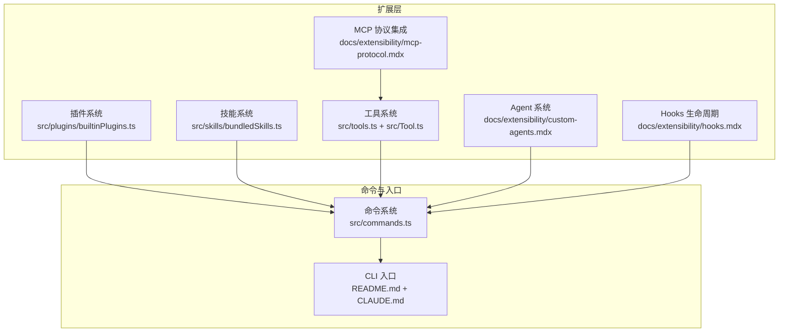
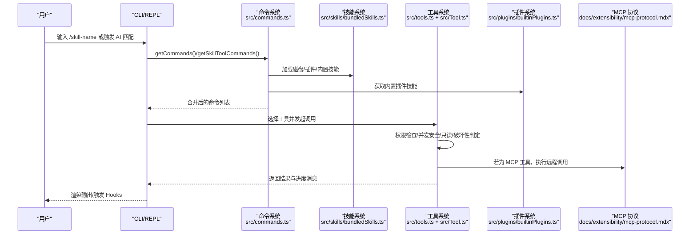
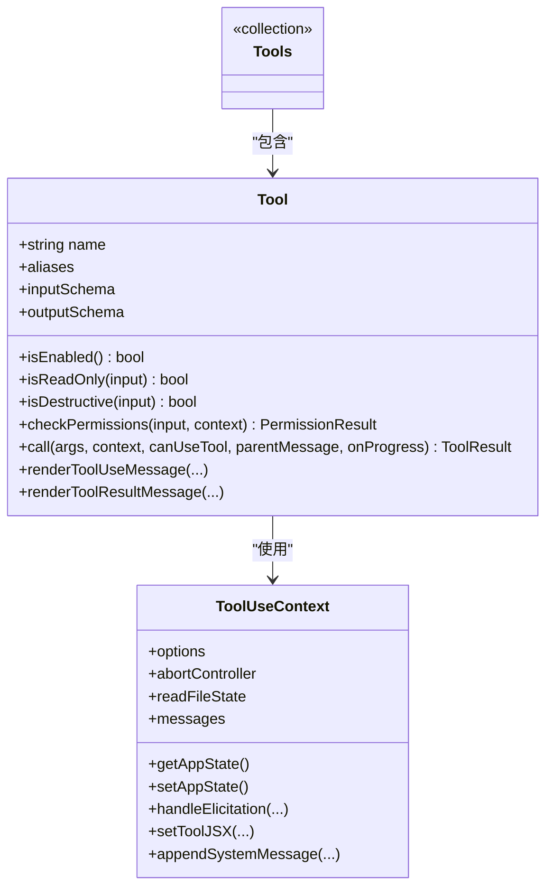
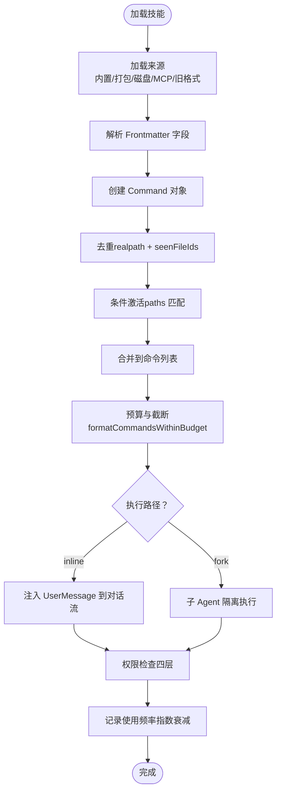
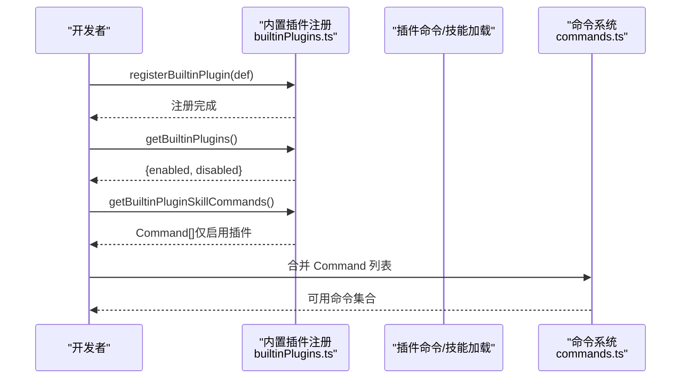
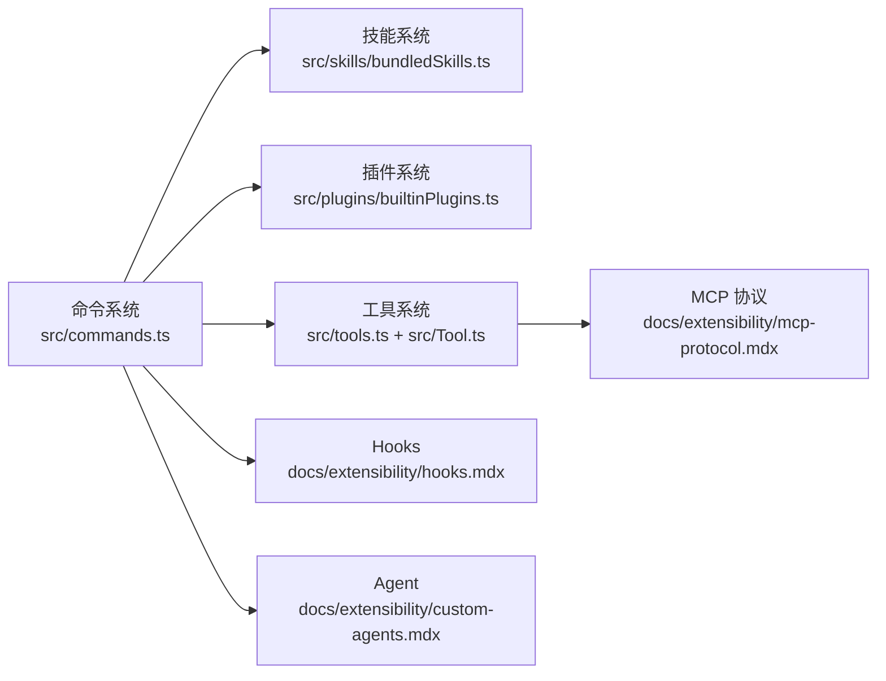

# 扩展开发指南

<cite>
**本文档引用的文件**
- [README.md](file://README.md)
- [CLAUDE.md](file://CLAUDE.md)
- [docs/extensibility/custom-agents.mdx](file://docs/extensibility/custom-agents.mdx)
- [docs/extensibility/skills.mdx](file://docs/extensibility/skills.mdx)
- [docs/extensibility/mcp-protocol.mdx](file://docs/extensibility/mcp-protocol.mdx)
- [docs/extensibility/hooks.mdx](file://docs/extensibility/hooks.mdx)
- [src/plugins/builtinPlugins.ts](file://src/plugins/builtinPlugins.ts)
- [src/skills/bundledSkills.ts](file://src/skills/bundledSkills.ts)
- [src/tools.ts](file://src/tools.ts)
- [src/Tool.ts](file://src/Tool.ts)
- [src/commands.ts](file://src/commands.ts)
- [docs/testing-spec.md](file://docs/testing-spec.md)
</cite>

## 目录
1. [简介](#简介)
2. [项目结构](#项目结构)
3. [核心组件](#核心组件)
4. [架构概览](#架构概览)
5. [详细组件分析](#详细组件分析)
6. [依赖分析](#依赖分析)
7. [性能考虑](#性能考虑)
8. [故障排查指南](#故障排查指南)
9. [结论](#结论)
10. [附录](#附录)

## 简介
本指南面向希望为 Claude Code Best（CCB）开发扩展的开发者，涵盖从环境搭建、开发工具到调试技巧的完整流程；详细说明插件、技能（Skills）和自定义工具的创建方法；解释扩展 API 的使用（核心接口、事件系统、状态管理）；提供测试策略（单元测试、集成测试、用户验收测试）；并给出发布与分发指南（版本管理、依赖处理、兼容性保证），以及性能优化、安全最佳实践和用户体验设计建议。

## 项目结构
CCB 采用 Bun 运行时与 ESM 模块系统，核心入口为 CLI，围绕“工具（Tools）—技能（Skills）—插件（Plugins）—Agent”扩展体系构建。关键目录与职责如下：
- docs/extensibility：扩展系统文档（Agent、Skills、MCP、Hooks）
- src/plugins：内置插件注册与管理
- src/skills：技能加载、解析与执行
- src/tools、src/Tool.ts：工具接口定义与工具池装配
- src/commands.ts：命令系统（含技能、插件、工作流等）
- tests：测试规范与用例组织

图表来源
- [src/plugins/builtinPlugins.ts:1-160](file://src/plugins/builtinPlugins.ts#L1-L160)
- [src/skills/bundledSkills.ts:1-221](file://src/skills/bundledSkills.ts#L1-L221)
- [src/tools.ts:1-388](file://src/tools.ts#L1-L388)
- [src/Tool.ts:1-793](file://src/Tool.ts#L1-L793)
- [src/commands.ts:1-757](file://src/commands.ts#L1-L757)
- [README.md:1-173](file://README.md#L1-L173)
- [CLAUDE.md:1-243](file://CLAUDE.md#L1-L243)

章节来源
- [README.md:1-173](file://README.md#L1-L173)
- [CLAUDE.md:1-243](file://CLAUDE.md#L1-L243)

## 核心组件
- 工具系统（Tools）：统一的 Tool 接口与工具池装配，支持内置工具与 MCP 工具合并，具备权限过滤、并发安全、只读/破坏性标记等能力。
- 技能系统（Skills）：基于 Markdown 的声明式能力封装，支持磁盘加载、Frontmatter 解析、预算感知描述截断、双模式执行（inline/fork）、权限白名单、条件激活与动态发现。
- 插件系统（Plugins）：内置插件注册与启用/禁用管理，支持技能、Hooks、MCP 服务器等多组件聚合。
- Agent 系统：基于 Markdown 的 Agent 定义，支持工具过滤、模型继承、隔离运行、内存持久化与 Hooks 联动。
- Hooks 生命周期：22 种 Hook 事件与 6 种执行类型，支持命令、提示、Agent、HTTP、回调与运行时函数 Hook，具备匹配规则、if 条件、JSON 输出协议与异步唤醒机制。
- MCP 协议：7 种传输层、连接缓存与重连、工具发现与权限检查、内容截断与持久化、并发控制与认证状态机。

章节来源
- [src/Tool.ts:1-793](file://src/Tool.ts#L1-L793)
- [src/tools.ts:1-388](file://src/tools.ts#L1-L388)
- [src/skills/bundledSkills.ts:1-221](file://src/skills/bundledSkills.ts#L1-L221)
- [src/plugins/builtinPlugins.ts:1-160](file://src/plugins/builtinPlugins.ts#L1-L160)
- [docs/extensibility/custom-agents.mdx:1-212](file://docs/extensibility/custom-agents.mdx#L1-L212)
- [docs/extensibility/hooks.mdx:1-240](file://docs/extensibility/hooks.mdx#L1-L240)
- [docs/extensibility/mcp-protocol.mdx:1-192](file://docs/extensibility/mcp-protocol.mdx#L1-L192)

## 架构概览
扩展开发围绕“命令/技能—工具—权限—执行”的闭环展开。命令系统统一汇聚技能、插件与内置命令；工具系统提供统一接口与权限过滤；权限系统贯穿工具调用与 Hooks；MCP 提供远程工具扩展；Agent 系统支持子 Agent 派生与隔离运行。

图表来源
- [src/commands.ts:350-520](file://src/commands.ts#L350-L520)
- [src/skills/bundledSkills.ts:106-121](file://src/skills/bundledSkills.ts#L106-L121)
- [src/plugins/builtinPlugins.ts:108-121](file://src/plugins/builtinPlugins.ts#L108-L121)
- [src/tools.ts:343-387](file://src/tools.ts#L343-L387)
- [docs/extensibility/mcp-protocol.mdx:137-159](file://docs/extensibility/mcp-protocol.mdx#L137-L159)

## 详细组件分析

### 工具系统（Tools）
- 核心接口：Tool 定义包含名称、输入/输出模式、并发安全、只读/破坏性、权限检查、描述、渲染与进度回调等。
- 工具池装配：getAllBaseTools 生成基础工具集，getTools 进行模式过滤与 isEnabled 检查，assembleToolPool 合并内置与 MCP 工具并去重。
- 权限过滤：filterToolsByDenyRules 基于权限上下文屏蔽工具，确保安全边界。
- MCP 工具：统一包装为 Tool 接口，支持权限检查、内容截断与持久化。

图表来源
- [src/Tool.ts:362-695](file://src/Tool.ts#L362-L695)
- [src/tools.ts:191-387](file://src/tools.ts#L191-L387)

章节来源
- [src/Tool.ts:1-793](file://src/Tool.ts#L1-L793)
- [src/tools.ts:1-388](file://src/tools.ts#L1-L388)

### 技能系统（Skills）
- 来源与加载：内置命令、编译时打包（bundled）、磁盘（.claude/skills/）、MCP、旧格式（/commands/legacy）。
- Frontmatter 字段：name/description/when_to_use/allowed-tools/arguments/model/effort/context/agent/user_invocable/disable_model_invocation/version/paths/hooks/shell 等。
- 执行路径：inline（注入 UserMessage）与 fork（子 Agent 隔离执行）两种模式。
- 权限模型：四层检查（Deny/官方市场/Allow/Safe Properties 白名单），正向安全设计。
- 预算与截断：Prompt 列表注入有字符预算，bundled 技能不可截断，降级策略逐级收缩。
- 条件激活：基于文件路径的动态发现与 paths 模式匹配。

图表来源
- [docs/extensibility/skills.mdx:21-222](file://docs/extensibility/skills.mdx#L21-L222)
- [src/skills/bundledSkills.ts:53-100](file://src/skills/bundledSkills.ts#L53-L100)

章节来源
- [docs/extensibility/skills.mdx:1-222](file://docs/extensibility/skills.mdx#L1-L222)
- [src/skills/bundledSkills.ts:1-221](file://src/skills/bundledSkills.ts#L1-L221)

### 插件系统（Plugins）
- 内置插件注册：registerBuiltinPlugin 定义插件，getBuiltinPlugins 按用户设置启用/禁用，返回 LoadedPlugin 列表。
- 技能聚合：getBuiltinPluginSkillCommands 将启用插件中的技能转换为 Command。
- 插件命令与技能缓存：插件命令与技能加载具有缓存，支持清理与重新加载。

图表来源
- [src/plugins/builtinPlugins.ts:28-121](file://src/plugins/builtinPlugins.ts#L28-L121)
- [src/commands.ts:355-400](file://src/commands.ts#L355-L400)

章节来源
- [src/plugins/builtinPlugins.ts:1-160](file://src/plugins/builtinPlugins.ts#L1-L160)
- [src/commands.ts:160-169](file://src/commands.ts#L160-L169)

### Agent 系统
- 定义来源：Built-in（硬编码）、Plugin（插件注册）、User/Project/Policy（.claude/agents/*.md）。
- Markdown 定义：name/description/tools/disallowedTools/model/effort/maxTurns/permissionMode/background/initialPrompt/isolation/memory/mcpServers/hooks/skills/color 等。
- 工具过滤：按 disallowedTools 移除，再按 tools 白名单过滤；memory 启用时自动注入 Write/Edit/Read。
- 执行链路：AgentTool.call 查找定义、检查 requiredMcpServers、过滤工具、解析模型/权限模式、隔离运行、注入 system prompt/initialPrompt、启动子 Agent 循环。

章节来源
- [docs/extensibility/custom-agents.mdx:1-212](file://docs/extensibility/custom-agents.mdx#L1-L212)

### Hooks 生命周期
- 事件与类型：22 种事件（会话/用户交互/工具执行/权限/子 Agent/压缩/协作/MCP/环境等）与 6 种执行类型（command/prompt/agent/http/callback/function）。
- 执行引擎：execCommandHook 支持 Shell 选择、变量替换、环境注入、stdin 写入、超时与异步检测。
- 匹配与去重：getMatchingHooks 支持精确/多值/正则匹配与 if 条件过滤，按 pluginRoot\0command 去重。
- 输出协议：JSON Schema 定义 continue/suppressOutput/decision/reason/systemMessage/hookSpecificOutput 等字段。

章节来源
- [docs/extensibility/hooks.mdx:1-240](file://docs/extensibility/hooks.mdx#L1-L240)

### MCP 协议
- 传输层：stdio/sse/http/sse-ide/ws-ide/ws/claudeai-proxy 七种类型，对应不同认证方式。
- 连接与缓存：connectToServer 使用 memoize 缓存，连接关闭时清理相关缓存；请求级超时保护。
- 工具发现：fetchToolsForClient 使用 LRU 缓存（上限 20），转换为统一 Tool 接口，自动标注只读/破坏性/开放世界等能力。
- 执行链路：MCPTool.call 确保连接有效、带 Elicitation 重试、内容截断与持久化、会话过期自动重试。

章节来源
- [docs/extensibility/mcp-protocol.mdx:1-192](file://docs/extensibility/mcp-protocol.mdx#L1-L192)

## 依赖分析
- 模块耦合：命令系统（commands.ts）聚合技能、插件与内置命令；工具系统（tools.ts/Tool.ts）为执行核心；插件系统（builtinPlugins.ts）提供技能与 Hooks；Agent/Hooks/MCP 通过命令系统暴露给模型与 UI。
- 直接依赖：工具池装配依赖权限上下文；技能执行依赖命令上下文与权限检查；MCP 工具依赖连接管理与认证状态机。
- 外部依赖：Biome（lint/format）、bun:test（测试）、@modelcontextprotocol/sdk（MCP）、ESM 模块与 Bun 运行时。

图表来源
- [src/commands.ts:350-520](file://src/commands.ts#L350-L520)
- [src/skills/bundledSkills.ts:106-121](file://src/skills/bundledSkills.ts#L106-L121)
- [src/plugins/builtinPlugins.ts:108-121](file://src/plugins/builtinPlugins.ts#L108-L121)
- [src/tools.ts:343-387](file://src/tools.ts#L343-L387)

章节来源
- [src/commands.ts:1-757](file://src/commands.ts#L1-L757)
- [src/tools.ts:1-388](file://src/tools.ts#L1-L388)

## 性能考虑
- 工具池排序与缓存：工具池按名称排序并去重，保持内置工具前缀连续以稳定 prompt-cache；MCP 工具发现使用 LRU（上限 20）缓存。
- 连接缓存与重连：connectToServer 使用 memoize 缓存连接对象；连接关闭时清理缓存；远程传输有连续错误计数器与降级检测。
- 请求级超时：每个 HTTP 请求使用独立 setTimeout 超时，避免共享 AbortSignal.timeout 的 GC 延迟问题。
- Prompt 预算：技能列表注入有字符预算，bundled 技能不可截断，降级策略逐级收缩，避免过度截断影响体验。
- 并发控制：本地 MCP 服务器默认限制 3 个并发连接，远程服务器默认 20 个并发，平衡资源占用与吞吐。

章节来源
- [docs/extensibility/mcp-protocol.mdx:70-108](file://docs/extensibility/mcp-protocol.mdx#L70-L108)
- [docs/extensibility/skills.mdx:147-159](file://docs/extensibility/skills.mdx#L147-L159)

## 故障排查指南
- 环境与调试
  - 使用 Bun 1.3.11+，国内网络不佳时设置 DEFAULT_RELEASE_BASE 环境变量。
  - TUI（REPL）模式使用 attach 模式调试，先启动 inspect 服务再在 VS Code 中选择“Attach to Bun (TUI debug)”。
- 测试与覆盖率
  - 使用 bun:test 框架，单元测试就近放置于 src/**/__tests__/，集成测试集中于 tests/integration/。
  - 当前覆盖状态：1623 tests / 84 files / 0 fail；整体行覆盖率约 33%（受 Bun coverage 限制，实际高于报告值）。
- 常见问题
  - 断言过弱：部分测试使用 toContain 或 not.toBeNull，建议改为精确匹配以提升稳定性。
  - 集成测试空白：计划中的集成测试（tool-chain/context-build/message-pipeline）尚未创建。
  - Mock 模式：通过 mock.module() + await import() 解锁重依赖模块，需在测试文件内联调用。

章节来源
- [README.md:109-125](file://README.md#L109-L125)
- [docs/testing-spec.md:1-297](file://docs/testing-spec.md#L1-297)

## 结论
CCB 的扩展体系以“命令/技能—工具—权限—执行”为核心闭环，结合内置插件、Agent、Hooks 与 MCP 协议，提供了强大的可扩展能力。开发者可通过技能（Markdown 声明式）、工具（统一接口与权限过滤）、插件（多组件聚合）与 Agent/Hooks/MCP 等多种方式扩展系统功能。遵循本文档的开发流程、测试策略与最佳实践，可在保证安全性与性能的前提下高效交付高质量扩展。

## 附录

### 开发流程（环境搭建与调试）
- 环境要求：Bun >= 1.3.11，安装依赖后运行 dev 模式；国内网络不佳时设置 DEFAULT_RELEASE_BASE。
- 调试技巧：TUI 模式使用 attach 模式，先启动 inspect 服务，再在 VS Code 中选择“Attach to Bun (TUI debug)”。
- 构建与运行：使用 build.ts 进行 code splitting 多文件打包，产物输出到 dist/ 目录；构建后可直接用 node 或 bun 启动。

章节来源
- [README.md:44-78](file://README.md#L44-L78)
- [README.md:109-125](file://README.md#L109-L125)
- [CLAUDE.md:51-59](file://CLAUDE.md#L51-L59)

### 扩展类型与创建方法
- 插件（Plugin）
  - 注册内置插件：registerBuiltinPlugin，定义 name/description/version/defaultEnabled 等字段。
  - 获取启用/禁用插件：getBuiltinPlugins，按用户设置返回 LoadedPlugin 列表。
  - 聚合技能：getBuiltinPluginSkillCommands，将启用插件中的技能转换为 Command。
- 技能（Skill）
  - 磁盘技能：在 .claude/skills/ 下创建 skill-name/SKILL.md，使用 Frontmatter 字段配置 when_to_use/allowed-tools/model/effort/context/agent 等。
  - 编译时打包：registerBundledSkill，支持延迟文件提取与 base directory 前缀注入。
  - 执行模式：inline（注入对话流）与 fork（子 Agent 隔离执行）。
- 自定义工具（Tool）
  - 实现 Tool 接口：定义 name/inputSchema/outputSchema/call/checkPermissions/render 等方法。
  - 注册工具：通过 tools.ts 的 getAllBaseTools/getTools/assembleToolPool 等函数参与工具池装配。
  - 权限与安全：isReadOnly/isDestructive/isConcurrencySafe/validateInput/checkPermissions 等保障安全边界。

章节来源
- [src/plugins/builtinPlugins.ts:28-121](file://src/plugins/builtinPlugins.ts#L28-L121)
- [src/skills/bundledSkills.ts:53-100](file://src/skills/bundledSkills.ts#L53-L100)
- [src/tools.ts:191-387](file://src/tools.ts#L191-L387)
- [src/Tool.ts:362-695](file://src/Tool.ts#L362-L695)

### 扩展 API 使用指南
- 核心接口
  - Tool：统一工具接口，支持并发安全、只读/破坏性、权限检查、描述与渲染。
  - Command：命令接口，支持 prompt/local/local-jsx 三类，描述与来源标注。
  - ToolUseContext：工具调用上下文，包含权限上下文、文件状态缓存、消息与进度回调等。
- 事件系统
  - Hooks：22 种事件与 6 种执行类型，支持命令、提示、Agent、HTTP、回调与运行时函数。
  - 匹配与去重：支持精确/多值/正则匹配与 if 条件过滤，按 pluginRoot\0command 去重。
- 状态管理
  - 命令系统：getCommands/getSkillToolCommands/getSlashCommandToolSkills 提供命令聚合与过滤。
  - 技能缓存：loadAllCommands/memoize 缓存技能加载，clearCommandMemoizationCaches 清理缓存。

章节来源
- [src/Tool.ts:123-300](file://src/Tool.ts#L123-L300)
- [src/commands.ts:350-520](file://src/commands.ts#L350-L520)
- [docs/extensibility/hooks.mdx:130-173](file://docs/extensibility/hooks.mdx#L130-L173)

### 测试策略
- 单元测试：纯函数、工具类、解析器就近放置于 src/**/__tests__/，命名风格为 describe("functionName") + test("行为描述")。
- 集成测试：tests/integration/（计划中），当前通过 tests/mocks/ 与工具链/上下文构建/消息管道/CLI 参数等搭建。
- Mock 模式：通过 mock.module() + await import() 解锁重依赖模块，需在测试文件内联调用。
- 覆盖率：整体行覆盖率约 33%，实际高于报告值；Tool.ts 行覆盖率 100%。

章节来源
- [docs/testing-spec.md:14-43](file://docs/testing-spec.md#L14-L43)
- [docs/testing-spec.md:196-254](file://docs/testing-spec.md#L196-L254)

### 发布与分发指南
- 版本管理：集中于 scripts/defines.ts 管理 MACRO defines，构建时通过 Bun.build({ define }) 注入。
- 依赖处理：Monorepo 通过 Bun workspaces 管理内部包，依赖解析使用 workspace:*。
- 兼容性保证：构建产物自动替换 import.meta.require，支持 node/bun 双环境运行；Biome 配置与 lint/format 规则统一。
- 发布流程：使用 build.ts 进行 code splitting 多文件打包，产物输出到 dist/ 目录；可直接用 node 或 bun 启动。

章节来源
- [CLAUDE.md:51-59](file://CLAUDE.md#L51-L59)
- [README.md:73-76](file://README.md#L73-L76)

### 性能优化与安全最佳实践
- 性能优化
  - 工具池排序与缓存：保持内置工具前缀连续，稳定 prompt-cache；MCP 工具发现使用 LRU 缓存。
  - 连接缓存与重连：connectToServer 使用 memoize 缓存；远程传输有连续错误计数器与降级检测。
  - 请求级超时：每个 HTTP 请求使用独立 setTimeout 超时，避免 GC 延迟。
  - Prompt 预算：技能列表注入有字符预算，bundled 技能不可截断，降级策略逐级收缩。
- 安全最佳实践
  - 权限模型：四层检查（Deny/官方市场/Allow/Safe Properties 白名单），正向安全设计。
  - 工具安全：isReadOnly/isDestructive/isConcurrencySafe/validateInput/checkPermissions 等保障安全边界。
  - Hooks 工作区信任：所有 Hook 都要求工作区信任，防止恶意仓库在未信任情况下执行任意命令。
  - MCP 工具：默认进入权限确认流程，工具名使用 mcp__ 前缀精确匹配权限规则。

章节来源
- [docs/extensibility/skills.mdx:129-146](file://docs/extensibility/skills.mdx#L129-L146)
- [docs/extensibility/hooks.mdx:174-185](file://docs/extensibility/hooks.mdx#L174-L185)
- [docs/extensibility/mcp-protocol.mdx:133-136](file://docs/extensibility/mcp-protocol.mdx#L133-L136)

### 用户体验设计建议
- Prompt 设计：技能与 Agent 的 Frontmatter 字段（when_to_use/description/allowed-tools/model/effort/context）直接影响模型行为与用户体验。
- 渲染与进度：工具实现 renderToolUseMessage/renderToolResultMessage/renderToolUseProgressMessage 等方法，提供直观的终端 UI 体验。
- 交互设计：权限确认、Hook 输出与 MCP 工具的 Elicitation 流程需简洁明确，减少用户认知负担。

章节来源
- [docs/extensibility/skills.mdx:66-98](file://docs/extensibility/skills.mdx#L66-L98)
- [docs/extensibility/custom-agents.mdx:21-70](file://docs/extensibility/custom-agents.mdx#L21-L70)
- [src/Tool.ts:566-667](file://src/Tool.ts#L566-L667)