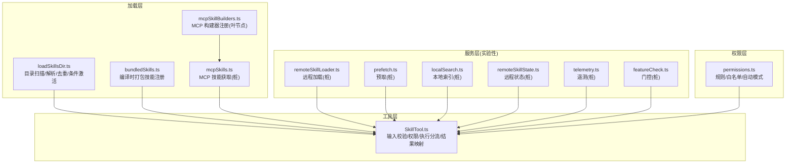
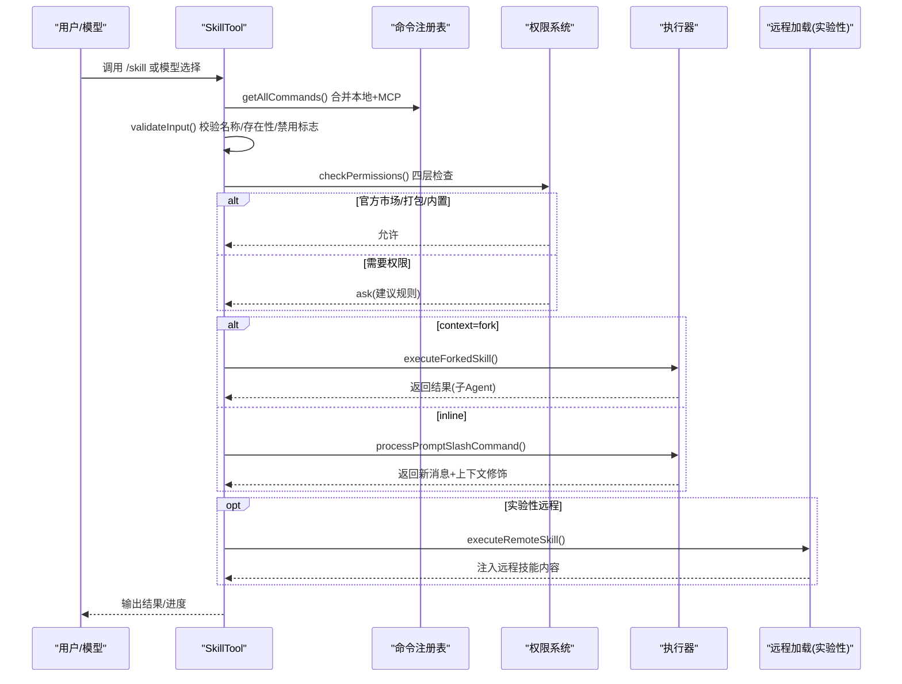
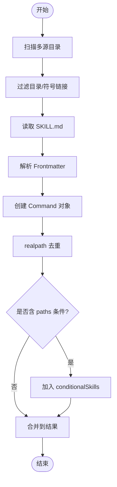
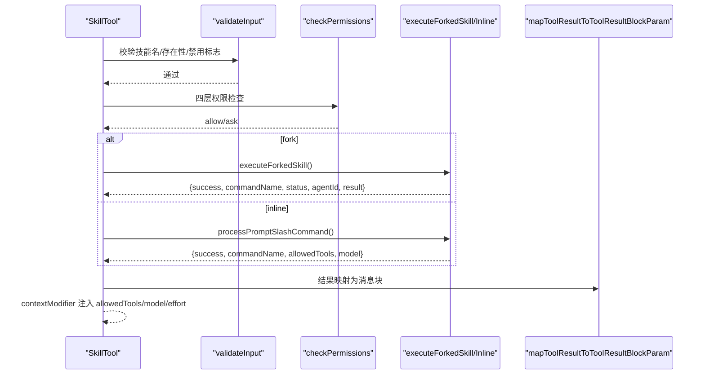
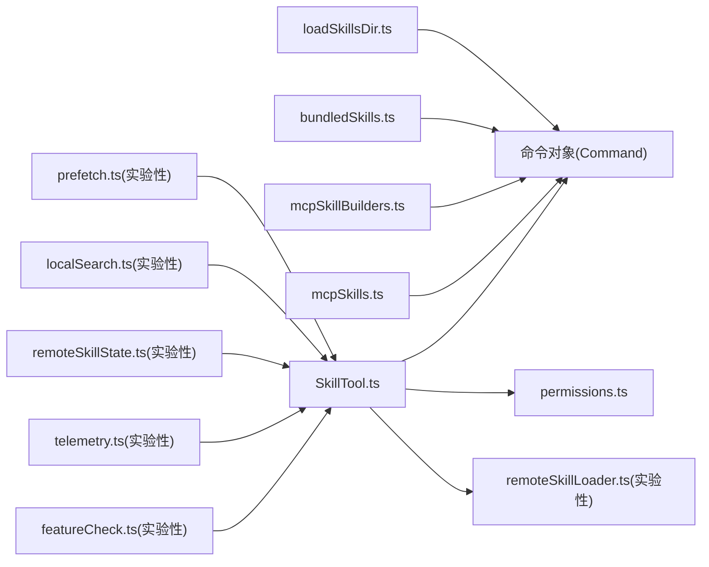

# 技能系统

<cite>
**本文引用的文件**
- [loadSkillsDir.ts](file://src/skills/loadSkillsDir.ts)
- [bundledSkills.ts](file://src/skills/bundledSkills.ts)
- [mcpSkillBuilders.ts](file://src/skills/mcpSkillBuilders.ts)
- [mcpSkills.ts](file://src/skills/mcpSkills.ts)
- [SkillTool.ts](file://src/tools/SkillTool/SkillTool.ts)
- [permissions.ts](file://src/utils/permissions/permissions.ts)
- [skills.mdx](file://docs/extensibility/skills.mdx)
- [experimental-skill-search.md](file://docs/features/experimental-skill-search.md)
- [mcp-skills.md](file://docs/features/mcp-skills.md)
- [remoteSkillLoader.ts](file://src/services/skillSearch/remoteSkillLoader.ts)
- [prefetch.ts](file://src/services/skillSearch/prefetch.ts)
- [localSearch.ts](file://src/services/skillSearch/localSearch.ts)
- [remoteSkillState.ts](file://src/services/skillSearch/remoteSkillState.ts)
- [telemetry.ts](file://src/services/skillSearch/telemetry.ts)
- [featureCheck.ts](file://src/services/skillSearch/featureCheck.ts)
- [constants.ts](file://src/tools/SkillTool/constants.ts)
- [skillUsageTracking.ts](file://src/utils/suggestions/skillUsageTracking.ts)
- [skillImprovement.ts](file://src/utils/hooks/skillImprovement.ts)
</cite>

## 目录
1. [简介](#简介)
2. [项目结构](#项目结构)
3. [核心组件](#核心组件)
4. [架构总览](#架构总览)
5. [详细组件分析](#详细组件分析)
6. [依赖关系分析](#依赖关系分析)
7. [性能考量](#性能考量)
8. [故障排查指南](#故障排查指南)
9. [结论](#结论)
10. [附录](#附录)

## 简介
本文件系统性阐述 Claude Code Best 的“技能”体系：从概念、架构设计、加载机制、工具执行、搜索与发现、权限与安全、到开发与调试实践。技能并非传统意义上的可执行程序，而是“以 Prompt 为核心”的声明式能力单元，通过 Frontmatter 配置与可选的文件资源，结合内置/打包/磁盘/MCP/远程等多源加载，最终由 SkillTool 统一调度执行，并在 Inline/Fork 两种模式下完成与主对话流的融合或隔离执行。

## 项目结构
技能系统横跨“加载层、工具层、服务层、权限层、文档与特性开关”等多个模块：
- 加载层：磁盘扫描、Frontmatter 解析、去重与条件激活、MCP 构建器注册
- 工具层：SkillTool 的输入校验、权限检查、执行分流（Inline/Fork）、结果映射
- 服务层：实验性技能搜索（本地索引、远程加载、预取、遥测）
- 权限层：规则匹配、安全属性白名单、自动/交互模式
- 文档与特性开关：extensibility/skills.mdx 与 feature flags

图表来源
- [loadSkillsDir.ts](file://src/skills/loadSkillsDir.ts)
- [bundledSkills.ts](file://src/skills/bundledSkills.ts)
- [mcpSkillBuilders.ts](file://src/skills/mcpSkillBuilders.ts)
- [mcpSkills.ts](file://src/skills/mcpSkills.ts)
- [SkillTool.ts](file://src/tools/SkillTool/SkillTool.ts)
- [remoteSkillLoader.ts](file://src/services/skillSearch/remoteSkillLoader.ts)
- [prefetch.ts](file://src/services/skillSearch/prefetch.ts)
- [localSearch.ts](file://src/services/skillSearch/localSearch.ts)
- [remoteSkillState.ts](file://src/services/skillSearch/remoteSkillState.ts)
- [telemetry.ts](file://src/services/skillSearch/telemetry.ts)
- [featureCheck.ts](file://src/services/skillSearch/featureCheck.ts)
- [permissions.ts](file://src/utils/permissions/permissions.ts)

章节来源
- [loadSkillsDir.ts](file://src/skills/loadSkillsDir.ts)
- [bundledSkills.ts](file://src/skills/bundledSkills.ts)
- [mcpSkillBuilders.ts](file://src/skills/mcpSkillBuilders.ts)
- [mcpSkills.ts](file://src/skills/mcpSkills.ts)
- [SkillTool.ts](file://src/tools/SkillTool/SkillTool.ts)
- [remoteSkillLoader.ts](file://src/services/skillSearch/remoteSkillLoader.ts)
- [prefetch.ts](file://src/services/skillSearch/prefetch.ts)
- [localSearch.ts](file://src/services/skillSearch/localSearch.ts)
- [remoteSkillState.ts](file://src/services/skillSearch/remoteSkillState.ts)
- [telemetry.ts](file://src/services/skillSearch/telemetry.ts)
- [featureCheck.ts](file://src/services/skillSearch/featureCheck.ts)
- [permissions.ts](file://src/utils/permissions/permissions.ts)

## 核心组件
- 技能定义与分类
  - 内置命令：硬编码在命令表中，类型一致但实现为 TS 模块
  - 打包技能：编译期注册，具备延迟文件提取与不可截断预算特权
  - 磁盘技能：.claude/skills/ 目录下的目录式 Markdown 技能，支持 Frontmatter 全集字段
  - MCP 技能：通过资源发现转换为 Command，标记 loadedFrom=mcp，禁用内联 shell
  - Legacy 命令：向后兼容的 /commands/ 目录加载
- 加载与去重
  - 目录扫描、文件存在性校验、Frontmatter 解析、命令对象创建
  - 基于 realpath 的去重，避免符号链接与重叠父目录重复加载
  - 条件技能（paths）延迟激活，按路径深度排序优先级
- 执行与结果
  - Inline：注入 UserMessage，动态修改工具白名单/模型/努力级别
  - Fork：在子 Agent 中执行，独立预算与进度回调，结果抽取后清理状态
- 权限与安全
  - 四层检查：deny 规则、官方市场自动放行、allow 规则、安全属性白名单
  - 自动/交互模式与分类器集成，支持 acceptEdits 快速路径与安全工具允许清单
- 搜索与发现（实验性）
  - 本地：索引已安装技能元数据
  - 远程：AKI/GCS/S3 等来源的 _canonical_<slug> 技能加载
  - 预取：turn 0 前置分析与收集
  - 遥测：加载耗时、缓存命中、字节统计

章节来源
- [loadSkillsDir.ts](file://src/skills/loadSkillsDir.ts)
- [bundledSkills.ts](file://src/skills/bundledSkills.ts)
- [SkillTool.ts](file://src/tools/SkillTool/SkillTool.ts)
- [permissions.ts](file://src/utils/permissions/permissions.ts)
- [experimental-skill-search.md](file://docs/features/experimental-skill-search.md)
- [mcp-skills.md](file://docs/features/mcp-skills.md)

## 架构总览
技能系统采用“声明式 Prompt + 动态执行”的分层架构：
- 数据与配置层：Frontmatter 字段驱动行为（allowed-tools、model、effort、context、agent、paths、hooks、shell 等）
- 加载与注册层：多源加载 + 去重 + 条件激活 + 缓存
- 执行与调度层：SkillTool 统一入口，Inline/Fork 两分支
- 权限与安全层：规则引擎 + 安全属性白名单 + 自动/交互模式
- 搜索与发现层（实验性）：本地索引 + 远程加载 + 预取 + 遥测

图表来源
- [SkillTool.ts](file://src/tools/SkillTool/SkillTool.ts)
- [permissions.ts](file://src/utils/permissions/permissions.ts)
- [remoteSkillLoader.ts](file://src/services/skillSearch/remoteSkillLoader.ts)

章节来源
- [SkillTool.ts](file://src/tools/SkillTool/SkillTool.ts)
- [permissions.ts](file://src/utils/permissions/permissions.ts)
- [remoteSkillLoader.ts](file://src/services/skillSearch/remoteSkillLoader.ts)

## 详细组件分析

### 技能加载与去重（loadSkillsDir.ts）
- 目录扫描与格式约束
  - 仅支持 skill-name/SKILL.md 的目录式结构；单文件 .md 不再受支持
  - 并行扫描多源目录：管理策略、用户全局、项目级、附加目录、Legacy commands
- Frontmatter 解析与命令对象创建
  - 统一解析 17 个字段（name/description/whenToUse/allowedTools/arguments/model/effort/context/agent/version/paths/hooks/shell 等）
  - 创建 Command 对象，设置 userFacingName、contentLength、source/loadedFrom、hooks、skillRoot 等
- 去重与条件激活
  - 使用 realpath 计算文件唯一标识，避免符号链接与重叠父目录重复
  - 条件技能（paths）先存储到 conditionalSkills，待文件触达时激活
- 缓存与性能
  - getSkillDirCommands 使用 memoize 缓存结果，显著降低重复加载成本

图表来源
- [loadSkillsDir.ts](file://src/skills/loadSkillsDir.ts)

章节来源
- [loadSkillsDir.ts](file://src/skills/loadSkillsDir.ts)

### 打包技能（bundledSkills.ts）
- 注册与延迟提取
  - 通过 registerBundledSkill() 注册，首次调用时将 files 解压到受控目录（安全写入，防符号链接逃逸）
  - 闭包级 promise memoize，避免并发竞态
- Prompt 注入
  - 若存在 files，会在 Prompt 前缀添加 Base directory，便于模型按需读取/检索
- 来源标记
  - source/loadedFrom 均为 bundled，预算中不可截断

章节来源
- [bundledSkills.ts](file://src/skills/bundledSkills.ts)

### MCP 技能与构建器（mcpSkillBuilders.ts、mcpSkills.ts）
- 构建器注册（叶节点依赖）
  - mcpSkillBuilders.ts 作为依赖图叶节点，避免 client.ts ↔ mcpSkills.ts ↔ loadSkillsDir.ts 的循环依赖
  - 提供 createSkillCommand 与 parseSkillFrontmatterFields 的引用
- 技能获取（桩）
  - mcpSkills.ts 当前为桩，维护 cache Map；实际实现由特性开关控制

章节来源
- [mcpSkillBuilders.ts](file://src/skills/mcpSkillBuilders.ts)
- [mcpSkills.ts](file://src/skills/mcpSkills.ts)
- [mcp-skills.md](file://docs/features/mcp-skills.md)

### 技能工具（SkillTool.ts）
- 输入与校验
  - 校验技能名格式、去除前导斜杠、远程 canonical 名拦截、存在性检查、禁用标志检查、类型检查
- 权限检查（四层）
  - deny 规则（精确/前缀:*）、官方市场自动放行、allow 规则、安全属性白名单
  - 生成精确匹配与前缀匹配两条建议规则
- 执行分流
  - fork：prepareForkedCommandContext + runAgent + 进度回调 + 结果抽取 + 清理
  - inline：processPromptSlashCommand 参数替换与 shell 展开 + 注入消息 + contextModifier
- 输出与 UI
  - inline 输出包含 success/commandName/allowedTools/model/status
  - fork 输出包含 success/commandName/status/agentId/result

图表来源
- [SkillTool.ts](file://src/tools/SkillTool/SkillTool.ts)

章节来源
- [SkillTool.ts](file://src/tools/SkillTool/SkillTool.ts)
- [constants.ts](file://src/tools/SkillTool/constants.ts)

### 权限与安全（permissions.ts）
- 规则体系
  - allow/deny/ask 三种行为，支持来源（策略/用户/项目/CLI 参数/命令/会话）
  - 支持工具级与内容级规则（含前缀:* 匹配）
- 自动/交互模式
  - auto 模式下使用分类器进行快速决策，acceptEdits 快速路径与安全工具允许清单
  - dontAsk 模式将 ask 转为 deny
- 安全属性白名单
  - 仅对白名单属性生效，其他属性视为需要权限

章节来源
- [permissions.ts](file://src/utils/permissions/permissions.ts)

### 搜索与发现（实验性）
- 本地搜索
  - localSearch.ts 为桩，预期基于已安装技能元数据建立索引并支持名称/描述/关键字匹配
- 远程加载
  - remoteSkillLoader.ts 为桩，预期支持 gs://、https://、s3:// 等协议，返回缓存命中、延迟、内容等信息
- 预取机制
  - prefetch.ts 为桩，提供 start/collect/getTurnZero 等接口，用于 turn 0 前置分析
- 状态与遥测
  - remoteSkillState.ts 提供 canonical 前缀剥离与已发现技能查询
  - telemetry.ts 提供加载事件遥测
  - featureCheck.ts 提供门控开关

章节来源
- [experimental-skill-search.md](file://docs/features/experimental-skill-search.md)
- [remoteSkillLoader.ts](file://src/services/skillSearch/remoteSkillLoader.ts)
- [prefetch.ts](file://src/services/skillSearch/prefetch.ts)
- [localSearch.ts](file://src/services/skillSearch/localSearch.ts)
- [remoteSkillState.ts](file://src/services/skillSearch/remoteSkillState.ts)
- [telemetry.ts](file://src/services/skillSearch/telemetry.ts)
- [featureCheck.ts](file://src/services/skillSearch/featureCheck.ts)

### 使用频率与改进（辅助）
- 使用频率排名
  - skillUsageTracking.ts 使用指数衰减算法计算分数，支持去抖与持久化
- 技能改进
  - skillImprovement.ts 提供基于 LLM 的技能文件改进建议与应用流程

章节来源
- [skillUsageTracking.ts](file://src/utils/suggestions/skillUsageTracking.ts)
- [skillImprovement.ts](file://src/utils/hooks/skillImprovement.ts)

## 依赖关系分析
- 模块耦合
  - loadSkillsDir.ts 与 mcpSkillBuilders.ts 通过类型注册避免循环依赖
  - SkillTool.ts 依赖命令注册表、权限系统、forkedAgent、processPromptSlashCommand 等
  - 实验性搜索模块通过特性开关按需引入，避免非必要依赖
- 外部依赖与集成点
  - MCP 技能依赖服务器 capabilities.resources 能力
  - 远程技能加载依赖 URL 协议与缓存策略

图表来源
- [loadSkillsDir.ts](file://src/skills/loadSkillsDir.ts)
- [bundledSkills.ts](file://src/skills/bundledSkills.ts)
- [mcpSkillBuilders.ts](file://src/skills/mcpSkillBuilders.ts)
- [mcpSkills.ts](file://src/skills/mcpSkills.ts)
- [SkillTool.ts](file://src/tools/SkillTool/SkillTool.ts)
- [permissions.ts](file://src/utils/permissions/permissions.ts)
- [remoteSkillLoader.ts](file://src/services/skillSearch/remoteSkillLoader.ts)
- [prefetch.ts](file://src/services/skillSearch/prefetch.ts)
- [localSearch.ts](file://src/services/skillSearch/localSearch.ts)
- [remoteSkillState.ts](file://src/services/skillSearch/remoteSkillState.ts)
- [telemetry.ts](file://src/services/skillSearch/telemetry.ts)
- [featureCheck.ts](file://src/services/skillSearch/featureCheck.ts)

章节来源
- [loadSkillsDir.ts](file://src/skills/loadSkillsDir.ts)
- [SkillTool.ts](file://src/tools/SkillTool/SkillTool.ts)
- [permissions.ts](file://src/utils/permissions/permissions.ts)
- [remoteSkillLoader.ts](file://src/services/skillSearch/remoteSkillLoader.ts)
- [prefetch.ts](file://src/services/skillSearch/prefetch.ts)
- [localSearch.ts](file://src/services/skillSearch/localSearch.ts)
- [remoteSkillState.ts](file://src/services/skillSearch/remoteSkillState.ts)
- [telemetry.ts](file://src/services/skillSearch/telemetry.ts)
- [featureCheck.ts](file://src/services/skillSearch/featureCheck.ts)

## 性能考量
- 加载性能
  - getSkillDirCommands memoize 缓存，避免重复扫描与解析
  - 并行加载多源目录，减少 I/O 等待
  - realpath 去重避免重复文件处理
- 执行性能
  - Fork 模式隔离执行，避免主对话上下文膨胀
  - Inline 模式通过 contextModifier 合并工具白名单，减少权限检查开销
- 预算与截断
  - Prompt 列表注入严格预算，Bundled Skills 不可截断，非 bundled 逐步降级
- 实验性搜索
  - 预取与缓存策略减少远程加载延迟（具体实现以桩为主）

[本节为通用指导，无需特定文件引用]

## 故障排查指南
- 技能未显示/不可调用
  - 检查 Frontmatter 字段是否正确（name/description/allowed-tools 等）
  - 确认 user-invocable 是否为 true
  - 查看是否被 deny 规则阻止
- 权限拒绝
  - 检查 allow/deny 规则与安全属性白名单
  - 使用建议规则快速授权（精确匹配与前缀匹配）
- 远程技能无法加载
  - 确认 _canonical_<slug> 名称是否已发现
  - 检查 URL 协议与网络访问
- 执行异常
  - Fork 模式查看子 Agent 进度回调与结果抽取
  - Inline 模式检查参数替换与 shell 展开是否符合预期

章节来源
- [SkillTool.ts](file://src/tools/SkillTool/SkillTool.ts)
- [permissions.ts](file://src/utils/permissions/permissions.ts)
- [remoteSkillLoader.ts](file://src/services/skillSearch/remoteSkillLoader.ts)

## 结论
技能系统以“Prompt 即能力”为核心理念，通过多源加载、统一命令对象、Inline/Fork 执行、严格权限与安全策略，以及实验性的搜索与发现能力，构建出高扩展、可审计、可演进的智能体工作流框架。开发者可通过标准 Frontmatter 字段与文件资源快速封装复杂任务，借助权限与预算机制保障安全与性能。

[本节为总结，无需特定文件引用]

## 附录

### 技能开发指南（模板与最佳实践）
- 目录结构
  - skill-name/SKILL.md（不再支持单文件 .md）
- Frontmatter 字段要点
  - name/description/when_to_use/arguments/argument-hint/allowed-tools/model/effort/context/agent/user-invocable/disable-model-invocation/version/paths/hooks/shell
- 参数与变量
  - $ARGUMENTS 替换、${CLAUDE_SKILL_DIR}（磁盘技能）、${CLAUDE_SESSION_ID}
- 执行模式
  - inline：默认，注入 UserMessage
  - fork：隔离执行，适合长任务
- 权限与安全
  - 仅使用安全属性；必要时提供 allow 规则
  - MCP 技能禁用内联 shell 命令
- 性能优化
  - 合理使用 effort 与 model 覆盖
  - 控制描述长度，避免预算超支
  - 使用 memoize 与并行加载（加载侧）

章节来源
- [loadSkillsDir.ts](file://src/skills/loadSkillsDir.ts)
- [bundledSkills.ts](file://src/skills/bundledSkills.ts)
- [SkillTool.ts](file://src/tools/SkillTool/SkillTool.ts)
- [permissions.ts](file://src/utils/permissions/permissions.ts)
- [skills.mdx](file://docs/extensibility/skills.mdx)