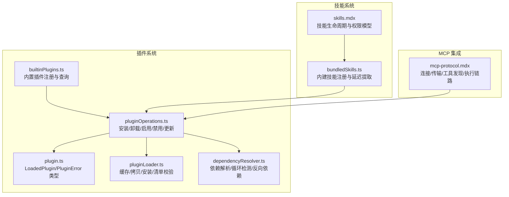
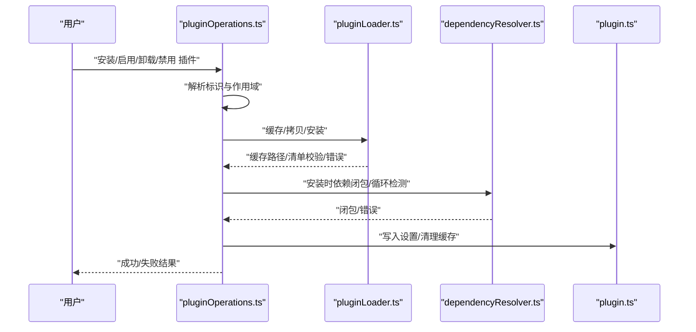
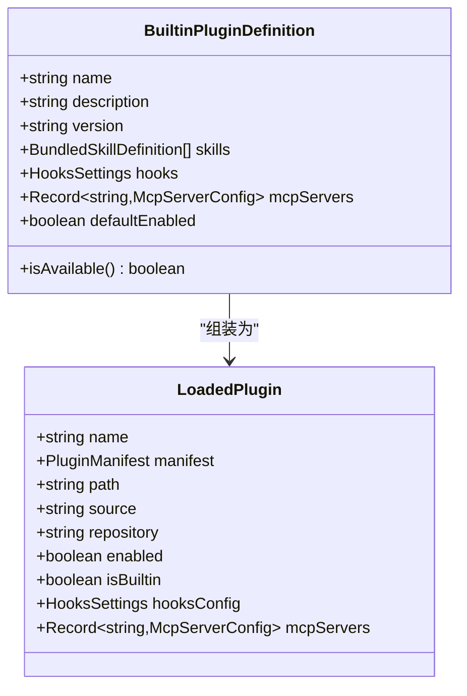
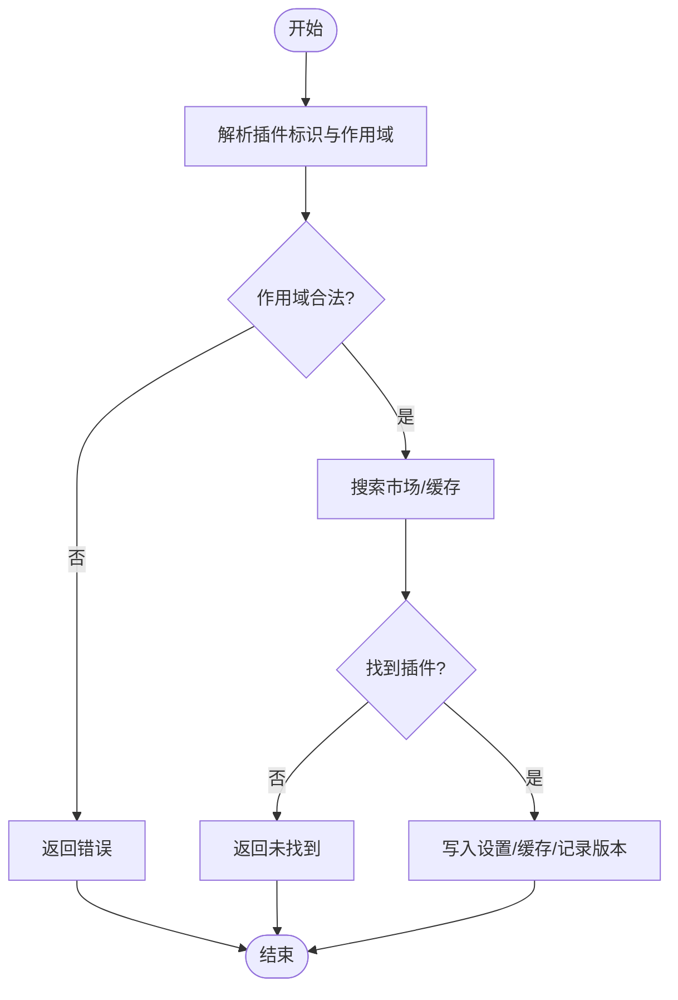
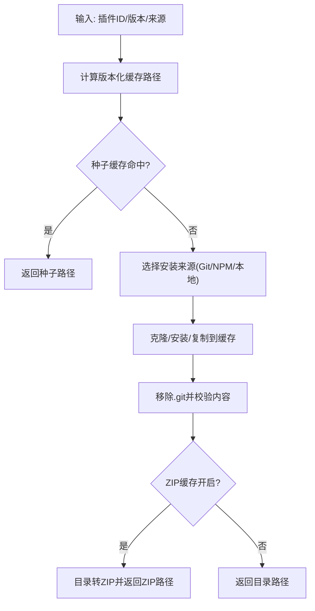
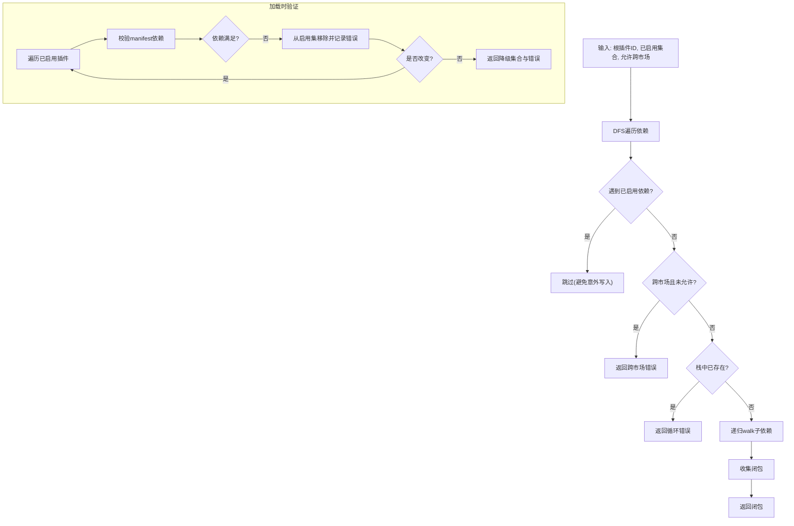
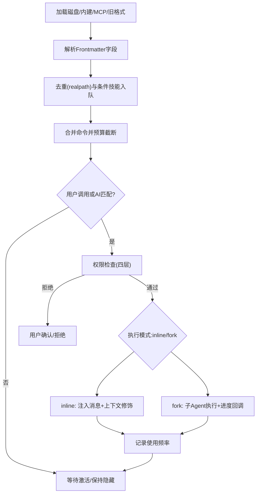
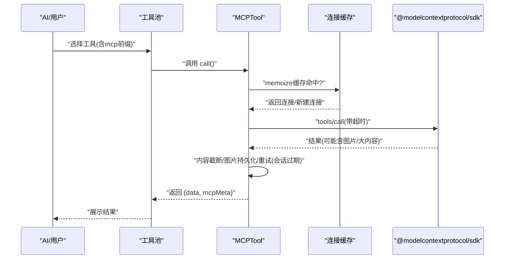
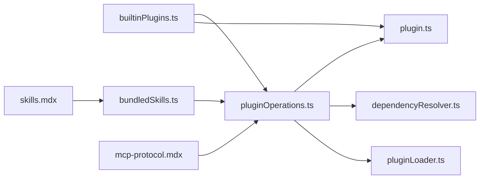

# 插件与扩展系统

<cite>
**本文引用的文件**
- [README.md](file://README.md)
- [builtinPlugins.ts](file://src/plugins/builtinPlugins.ts)
- [bundledSkills.ts](file://src/skills/bundledSkills.ts)
- [pluginOperations.ts](file://src/services/plugins/pluginOperations.ts)
- [plugin.ts](file://src/types/plugin.ts)
- [pluginLoader.ts](file://src/utils/plugins/pluginLoader.ts)
- [dependencyResolver.ts](file://src/utils/plugins/dependencyResolver.ts)
- [mcp-protocol.mdx](file://docs/extensibility/mcp-protocol.mdx)
- [skills.mdx](file://docs/extensibility/skills.mdx)
</cite>

## 目录
1. [引言](#引言)
2. [项目结构](#项目结构)
3. [核心组件](#核心组件)
4. [架构总览](#架构总览)
5. [详细组件分析](#详细组件分析)
6. [依赖关系分析](#依赖关系分析)
7. [性能考量](#性能考量)
8. [故障排查指南](#故障排查指南)
9. [结论](#结论)
10. [附录](#附录)

## 引言
本文件面向 Claude Code Best 的插件与扩展系统，系统性阐述插件加载机制、生命周期管理与依赖注入；深入解析技能系统（Skills）的定义、执行流程与结果处理；详述 MCP 协议集成的完整实现（服务器发现、连接建立与工具调用）；并提供扩展开发最佳实践、扩展示例与社区贡献指南。目标是帮助开发者快速理解并高效构建高质量插件与技能，共同繁荣生态。

## 项目结构
围绕插件与扩展系统的关键目录与文件：
- 插件注册与内置插件管理：src/plugins/builtinPlugins.ts
- 插件操作与生命周期：src/services/plugins/pluginOperations.ts
- 插件类型与错误模型：src/types/plugin.ts
- 插件加载与缓存：src/utils/plugins/pluginLoader.ts
- 依赖解析与循环检测：src/utils/plugins/dependencyResolver.ts
- 技能系统文档与实现要点：docs/extensibility/skills.mdx、src/skills/bundledSkills.ts
- MCP 协议集成文档：docs/extensibility/mcp-protocol.mdx

图表来源
- [builtinPlugins.ts:1-160](file://src/plugins/builtinPlugins.ts#L1-L160)
- [pluginOperations.ts:1-800](file://src/services/plugins/pluginOperations.ts#L1-L800)
- [plugin.ts:1-364](file://src/types/plugin.ts#L1-L364)
- [pluginLoader.ts:1-800](file://src/utils/plugins/pluginLoader.ts#L1-L800)
- [dependencyResolver.ts:1-306](file://src/utils/plugins/dependencyResolver.ts#L1-L306)
- [bundledSkills.ts:1-221](file://src/skills/bundledSkills.ts#L1-L221)
- [skills.mdx](file://docs/extensibility/skills.mdx)
- [mcp-protocol.mdx](file://docs/extensibility/mcp-protocol.mdx)

章节来源
- [README.md:1-173](file://README.md#L1-L173)
- [builtinPlugins.ts:1-160](file://src/plugins/builtinPlugins.ts#L1-L160)
- [pluginOperations.ts:1-800](file://src/services/plugins/pluginOperations.ts#L1-L800)
- [plugin.ts:1-364](file://src/types/plugin.ts#L1-L364)
- [pluginLoader.ts:1-800](file://src/utils/plugins/pluginLoader.ts#L1-L800)
- [dependencyResolver.ts:1-306](file://src/utils/plugins/dependencyResolver.ts#L1-L306)
- [bundledSkills.ts:1-221](file://src/skills/bundledSkills.ts#L1-L221)
- [skills.mdx](file://docs/extensibility/skills.mdx)
- [mcp-protocol.mdx](file://docs/extensibility/mcp-protocol.mdx)

## 核心组件
- 内置插件注册中心：负责内置插件的注册、可用性判断、启用状态合并与导出为 LoadedPlugin。
- 插件操作服务：提供安装、卸载、启用、禁用、批量禁用、更新等纯函数操作，返回标准化结果对象。
- 插件类型与错误模型：定义 LoadedPlugin、PluginError 等类型，统一错误语义与显示消息。
- 插件加载器：实现缓存、拷贝、ZIP 压缩缓存、Git/NPM 安装、清单校验与种子缓存探测。
- 依赖解析器：安装时解析依赖闭包并检测循环依赖；加载时验证依赖满足并进行降级。
- 技能系统：内建技能注册、延迟文件提取、权限白名单、预算感知描述截断、双模式执行（inline/fork）。
- MCP 协议集成：多传输层、连接缓存与重连、工具发现与权限检查、执行链路与内容截断。

章节来源
- [builtinPlugins.ts:1-160](file://src/plugins/builtinPlugins.ts#L1-L160)
- [pluginOperations.ts:1-800](file://src/services/plugins/pluginOperations.ts#L1-L800)
- [plugin.ts:1-364](file://src/types/plugin.ts#L1-L364)
- [pluginLoader.ts:1-800](file://src/utils/plugins/pluginLoader.ts#L1-L800)
- [dependencyResolver.ts:1-306](file://src/utils/plugins/dependencyResolver.ts#L1-L306)
- [bundledSkills.ts:1-221](file://src/skills/bundledSkills.ts#L1-L221)
- [skills.mdx](file://docs/extensibility/skills.mdx)
- [mcp-protocol.mdx](file://docs/extensibility/mcp-protocol.mdx)

## 架构总览
插件与扩展系统由“注册—加载—依赖—执行”闭环构成：
- 注册阶段：内置插件在启动时注册，用户可通过 /plugin UI 启用/禁用。
- 加载阶段：插件操作服务根据设置与市场配置执行安装/卸载/启用/禁用，加载器负责缓存与拷贝。
- 依赖阶段：安装时解析依赖闭包并检测循环；加载时验证依赖满足并降级。
- 执行阶段：技能系统按 inline/fork 执行；MCP 工具通过统一 Tool 接口进入权限检查与执行链路。

图表来源
- [pluginOperations.ts:321-419](file://src/services/plugins/pluginOperations.ts#L321-L419)
- [pluginLoader.ts:365-465](file://src/utils/plugins/pluginLoader.ts#L365-L465)
- [dependencyResolver.ts:95-159](file://src/utils/plugins/dependencyResolver.ts#L95-L159)
- [plugin.ts:101-289](file://src/types/plugin.ts#L101-L289)

## 详细组件分析

### 内置插件注册与生命周期
- 注册：registerBuiltinPlugin 将插件定义加入内存映射。
- 查询：getBuiltinPluginDefinition 获取具体定义。
- 列表：getBuiltinPlugins 按用户设置与默认值拆分为启用/禁用两组 LoadedPlugin。
- 技能导出：getBuiltinPluginSkillCommands 将启用插件的技能定义转为 Command，参与统一工具池。

图表来源
- [builtinPlugins.ts:18-35](file://src/plugins/builtinPlugins.ts#L18-L35)
- [builtinPlugins.ts:78-92](file://src/plugins/builtinPlugins.ts#L78-L92)
- [plugin.ts:48-70](file://src/types/plugin.ts#L48-L70)

章节来源
- [builtinPlugins.ts:1-160](file://src/plugins/builtinPlugins.ts#L1-L160)
- [plugin.ts:18-70](file://src/types/plugin.ts#L18-L70)

### 插件操作与生命周期管理
- 安装：installPluginOp 搜索市场、写入设置、缓存并记录版本提示。
- 卸载：uninstallPluginOp 删除设置键、清理缓存、移除安装记录、删除数据目录与选项。
- 启用/禁用：setPluginEnabledOp 支持自动检测作用域、跨作用域提示、策略拦截与反向依赖警告。
- 批量禁用：disableAllPluginsOp 遍历启用插件并逐个禁用，聚合结果与错误。

图表来源
- [pluginOperations.ts:321-419](file://src/services/plugins/pluginOperations.ts#L321-L419)
- [pluginOperations.ts:428-559](file://src/services/plugins/pluginOperations.ts#L428-L559)
- [pluginOperations.ts:574-776](file://src/services/plugins/pluginOperations.ts#L574-L776)

章节来源
- [pluginOperations.ts:1-800](file://src/services/plugins/pluginOperations.ts#L1-L800)

### 插件加载器与缓存策略
- 缓存路径：版本化缓存与 ZIP 缓存，支持种子缓存探测与回退。
- 拷贝策略：递归复制目录，处理符号链接与相对路径，移除 .git。
- 安装来源：Git 仓库（含子目录浅克隆与稀疏检出）、NPM 包缓存、本地目录。
- 清单校验：schema 校验与错误收集，支持多种错误类型。

图表来源
- [pluginLoader.ts:139-188](file://src/utils/plugins/pluginLoader.ts#L139-L188)
- [pluginLoader.ts:365-465](file://src/utils/plugins/pluginLoader.ts#L365-L465)
- [pluginLoader.ts:534-640](file://src/utils/plugins/pluginLoader.ts#L534-L640)
- [pluginLoader.ts:680-800](file://src/utils/plugins/pluginLoader.ts#L680-L800)

章节来源
- [pluginLoader.ts:1-800](file://src/utils/plugins/pluginLoader.ts#L1-L800)

### 依赖解析与循环检测
- 安装时解析：resolveDependencyClosure 使用 DFS 遍历依赖闭包，检测循环与跨市场依赖，支持允许列表。
- 加载时验证：verifyAndDemote 固定点迭代，对不满足依赖的插件进行降级并生成错误集合。
- 反向依赖：findReverseDependents 用于卸载/禁用前的依赖警告。

图表来源
- [dependencyResolver.ts:95-159](file://src/utils/plugins/dependencyResolver.ts#L95-L159)
- [dependencyResolver.ts:177-234](file://src/utils/plugins/dependencyResolver.ts#L177-L234)
- [dependencyResolver.ts:244-263](file://src/utils/plugins/dependencyResolver.ts#L244-L263)

章节来源
- [dependencyResolver.ts:1-306](file://src/utils/plugins/dependencyResolver.ts#L1-L306)

### 技能系统：定义、执行与权限
- 来源与加载：内置命令、编译时打包、磁盘 Skills、MCP Skills、旧格式命令。
- Frontmatter 字段：name/description/when_to_use/allowed-tools/model/effort/context/agent/user_invocable/disable_model_invocation/version/paths/hooks/shell 等。
- 执行路径：inline（默认）与 fork（隔离执行，独立 Agent 循环与 token 预算）。
- 权限模型：Deny/官方市场/Allow/Safe Properties 白名单四层检查；Safe Properties 仅允许白名单属性。
- 预算与截断：技能列表注入系统提示词时的字符预算与降级策略；内建技能不受截断。
- 动态发现与条件激活：基于文件路径的动态发现与 paths 条件激活。

图表来源
- [skills.mdx](file://docs/extensibility/skills.mdx)
- [bundledSkills.ts:53-100](file://src/skills/bundledSkills.ts#L53-L100)

章节来源
- [skills.mdx](file://docs/extensibility/skills.mdx)
- [bundledSkills.ts:1-221](file://src/skills/bundledSkills.ts#L1-L221)

### MCP 协议集成：连接、工具发现与执行
- 连接管理：7 种传输层（stdio/sse/http/sse-ide/ws-ide/ws/claudeai-proxy），memoize 缓存连接，连接关闭时清理工具/资源缓存。
- 认证与状态机：SSE/HTTP 使用 ClaudeAuthProvider，401 时写入 15 分钟 TTL 缓存避免重复弹窗。
- 工具发现：LRU(20) 缓存，统一 Tool 接口，工具名格式 mcp__<serverName>__<toolName>。
- 执行链路：ensureConnectedClient → 带 Elicitation 重试 → 处理图片/截断 → 会话过期自动重试一次 → 返回数据与元信息。
- 并发控制：本地服务器默认 3 并发，远程服务器默认 20 并发。

图表来源
- [mcp-protocol.mdx](file://docs/extensibility/mcp-protocol.mdx)

章节来源
- [mcp-protocol.mdx](file://docs/extensibility/mcp-protocol.mdx)

## 依赖关系分析
- 组件耦合：pluginOperations 依赖 pluginLoader、dependencyResolver、plugin.ts 类型与错误模型；builtinPlugins 与 bundledSkills 通过 Command/LoadedPlugin 与工具池衔接。
- 直接依赖：install/uninstall/enable/disable 调用 pluginLoader 与依赖解析器；LoadedPlugin 依赖 Manifest/Hook/MCP 配置类型。
- 外部依赖：lodash-es/memoize 用于连接缓存；@modelcontextprotocol/sdk 用于 MCP 客户端；git/NPM 用于安装来源。

图表来源
- [pluginOperations.ts:1-800](file://src/services/plugins/pluginOperations.ts#L1-L800)
- [pluginLoader.ts:1-800](file://src/utils/plugins/pluginLoader.ts#L1-L800)
- [dependencyResolver.ts:1-306](file://src/utils/plugins/dependencyResolver.ts#L1-L306)
- [plugin.ts:1-364](file://src/types/plugin.ts#L1-L364)
- [builtinPlugins.ts:1-160](file://src/plugins/builtinPlugins.ts#L1-L160)
- [bundledSkills.ts:1-221](file://src/skills/bundledSkills.ts#L1-L221)
- [skills.mdx](file://docs/extensibility/skills.mdx)
- [mcp-protocol.mdx](file://docs/extensibility/mcp-protocol.mdx)

章节来源
- [pluginOperations.ts:1-800](file://src/services/plugins/pluginOperations.ts#L1-L800)
- [pluginLoader.ts:1-800](file://src/utils/plugins/pluginLoader.ts#L1-L800)
- [dependencyResolver.ts:1-306](file://src/utils/plugins/dependencyResolver.ts#L1-L306)
- [plugin.ts:1-364](file://src/types/plugin.ts#L1-L364)
- [builtinPlugins.ts:1-160](file://src/plugins/builtinPlugins.ts#L1-L160)
- [bundledSkills.ts:1-221](file://src/skills/bundledSkills.ts#L1-L221)
- [skills.mdx](file://docs/extensibility/skills.mdx)
- [mcp-protocol.mdx](file://docs/extensibility/mcp-protocol.mdx)

## 性能考量
- 连接缓存与 LRU：MCP 连接与工具/资源发现使用 memoize 与 LRU(20)，降低重复连接与网络请求。
- 请求超时：HTTP 请求独立超时定时器，避免 AbortSignal.timeout 的 GC 延迟问题。
- 并发控制：本地服务器默认 3 并发，远程服务器默认 20，并发批大小按场景优化。
- 缓存策略：版本化缓存与 ZIP 缓存，种子缓存探测，减少重复下载与拷贝。
- I/O 优化：Git 子目录浅克隆与稀疏检出，显著降低大仓库下载成本。

## 故障排查指南
- 插件安装失败：检查市场是否存在、网络/权限、清单解析与校验错误；查看 PluginError 类型与消息。
- 插件启用失败：组织策略拦截（blocked-by-policy）或跨作用域冲突；使用 --scope 指定正确范围。
- 依赖问题：安装时循环依赖或跨市场依赖被阻止；加载时依赖未满足触发降级；使用反向依赖提示定位。
- MCP 连接异常：401 Unauthorized 触发认证缓存；连续错误计数触发重连；会话过期自动重试一次。
- 技能权限被拒：检查 Safe Properties 白名单与 allowedTools；必要时用户确认。

章节来源
- [plugin.ts:101-289](file://src/types/plugin.ts#L101-L289)
- [pluginOperations.ts:383-409](file://src/services/plugins/pluginOperations.ts#L383-L409)
- [dependencyResolver.ts:214-224](file://src/utils/plugins/dependencyResolver.ts#L214-L224)
- [mcp-protocol.mdx](file://docs/extensibility/mcp-protocol.mdx)
- [skills.mdx](file://docs/extensibility/skills.mdx)

## 结论
本系统通过“内置插件注册 + 插件操作服务 + 加载器与缓存 + 依赖解析”的组合，提供了稳定、可扩展的插件生态；技能系统以声明式 Frontmatter 与双执行模式实现灵活工作流；MCP 协议集成覆盖多传输层与权限链路。建议开发者遵循类型与错误模型、依赖约束与安全白名单，结合缓存与并发策略，构建高质量插件与技能，共同完善生态。

## 附录

### 扩展开发最佳实践
- 插件创建
  - 使用 plugin.json 清单定义元数据与组件路径；遵循组件命名与目录结构。
  - 在 settings 中声明 enabledPlugins，支持 user/project/local 作用域。
  - 使用依赖解析器提供的 qualifyDependency 与 verifyAndDemote 保障依赖一致性。
- 测试
  - 使用 getEnabledPluginIdsForScope 与 formatDependencyCountSuffix 辅助测试安装/启用流程。
  - 针对 PluginError 的类型化消息进行断言与 UI 提示。
- 发布
  - 通过市场配置与 marketplace.json 提供安装入口；支持 Git/NPM/本地目录三种来源。
  - 使用 ZIP 缓存与种子缓存提升分发效率。

章节来源
- [plugin.ts:101-289](file://src/types/plugin.ts#L101-L289)
- [pluginLoader.ts:365-465](file://src/utils/plugins/pluginLoader.ts#L365-L465)
- [dependencyResolver.ts:289-305](file://src/utils/plugins/dependencyResolver.ts#L289-L305)

### 技能开发示例
- 自定义工具：通过 Frontmatter 的 allowed-tools 限定工具集；在 inline 模式下注入消息，在 fork 模式下隔离执行。
- 命令与 UI：在 commands/agents/hooks 目录下提供 Markdown/JSON 定义；通过 getBuiltinPluginSkillCommands 导出为 Command。
- 权限与预算：利用 Safe Properties 白名单与预算截断策略，确保安全与性能。

章节来源
- [skills.mdx](file://docs/extensibility/skills.mdx)
- [bundledSkills.ts:53-100](file://src/skills/bundledSkills.ts#L53-L100)

### MCP 扩展示例
- 服务器发现与连接：配置 mcpServers，使用 connectToServer 的 memoize 缓存；SSE/HTTP 类型自动处理认证。
- 工具调用：统一通过 MCPTool 接口进入权限检查与执行链路；注意图片与大内容的截断与持久化。

章节来源
- [mcp-protocol.mdx](file://docs/extensibility/mcp-protocol.mdx)

### 社区贡献指南
- 文档贡献：在 docs/extensibility 下补充插件与技能开发文档，提供示例与最佳实践。
- 插件市场：维护 marketplace.json 与市场配置，支持跨市场依赖白名单与策略拦截。
- 反馈与协作：通过 Issues/PR 参与讨论与修复，关注依赖解析与错误模型的演进。

章节来源
- [README.md:149-158](file://README.md#L149-L158)
- [pluginLoader.ts:100-103](file://src/utils/plugins/pluginLoader.ts#L100-L103)
- [dependencyResolver.ts:78-87](file://src/utils/plugins/dependencyResolver.ts#L78-L87)