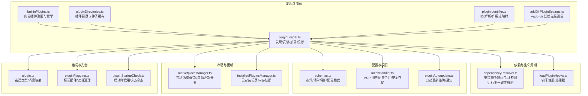
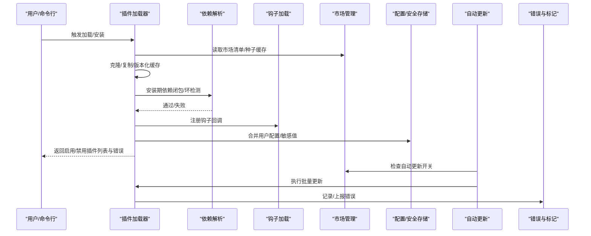
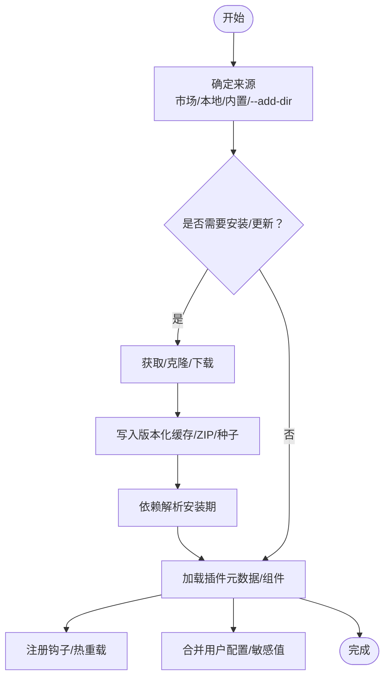
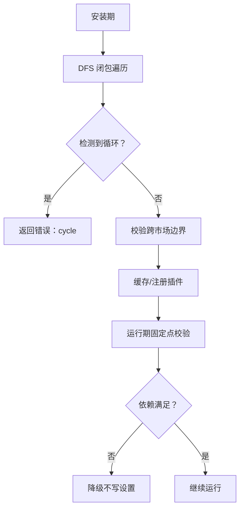
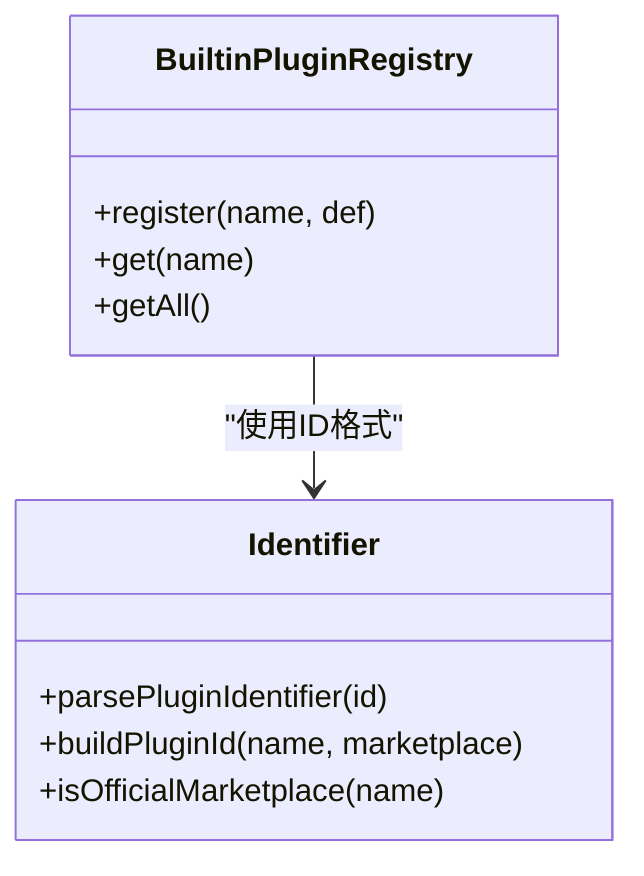
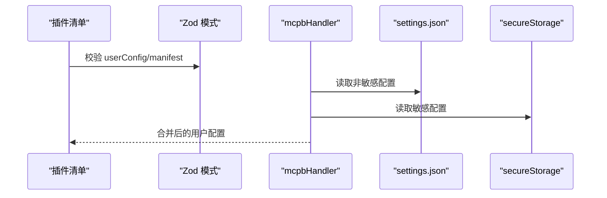
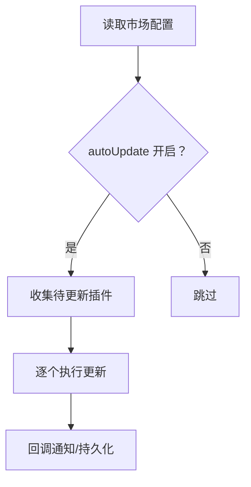
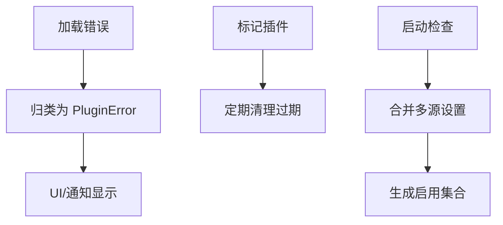
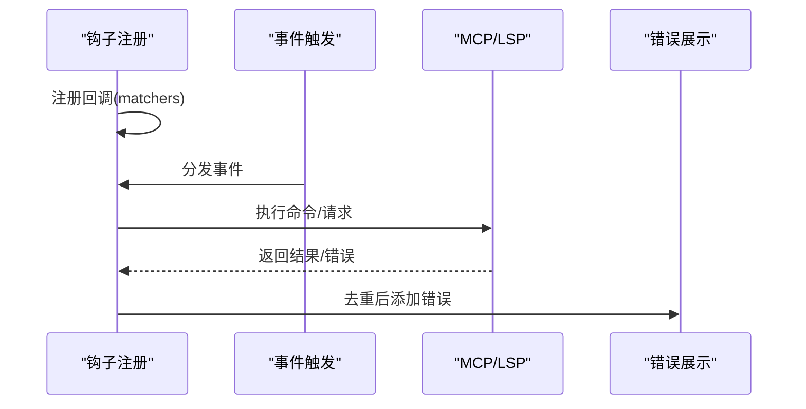
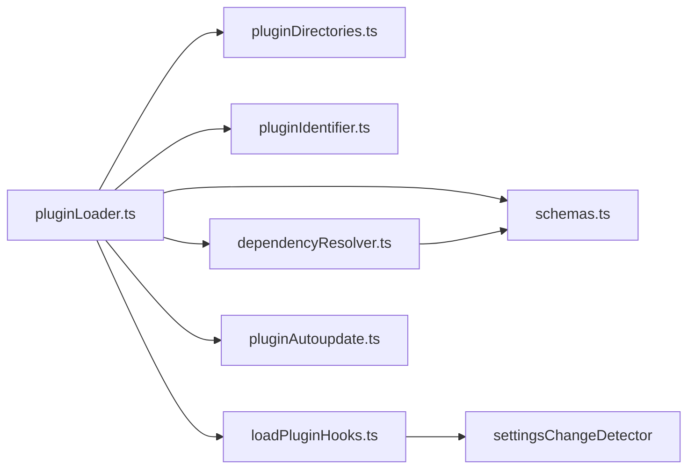

# 插件系统

<cite>
**本文引用的文件**
- [pluginLoader.ts](file://src/utils/plugins/pluginLoader.ts)
- [dependencyResolver.ts](file://src/utils/plugins/dependencyResolver.ts)
- [loadPluginHooks.ts](file://src/utils/plugins/loadPluginHooks.ts)
- [builtinPlugins.ts](file://src/plugins/builtinPlugins.ts)
- [schemas.ts](file://src/utils/plugins/schemas.ts)
- [pluginDirectories.ts](file://src/utils/plugins/pluginDirectories.ts)
- [pluginIdentifier.ts](file://src/utils/plugins/pluginIdentifier.ts)
- [addDirPluginSettings.ts](file://src/utils/plugins/addDirPluginSettings.ts)
- [pluginAutoupdate.ts](file://src/utils/plugins/pluginAutoupdate.ts)
- [useManagePlugins.ts](file://src/hooks/useManagePlugins.ts)
- [pluginFlagging.ts](file://src/utils/plugins/pluginFlagging.ts)
- [pluginStartupCheck.ts](file://src/utils/plugins/pluginStartupCheck.ts)
- [installedPluginsManager.ts](file://src/utils/plugins/installedPluginsManager.ts)
- [mcpbHandler.ts](file://src/utils/plugins/mcpbHandler.ts)
- [useManageMCPConnections.ts](file://src/services/mcp/useManageMCPConnections.ts)
- [plugin.ts](file://src/types/plugin.ts)
- [PluginSettings.tsx](file://src/commands/plugin/PluginSettings.tsx)
- [ManagePlugins.tsx](file://src/commands/plugin/ManagePlugins.tsx)
- [BrowseMarketplace.tsx](file://src/commands/plugin/BrowseMarketplace.tsx)
</cite>

## 目录
1. [简介](#简介)
2. [项目结构](#项目结构)
3. [核心组件](#核心组件)
4. [架构总览](#架构总览)
5. [详细组件分析](#详细组件分析)
6. [依赖关系分析](#依赖关系分析)
7. [性能考量](#性能考量)
8. [故障排查指南](#故障排查指南)
9. [结论](#结论)
10. [附录：开发与最佳实践](#附录开发与最佳实践)

## 简介
本文件系统化阐述 Claude Code Best 的插件系统，覆盖插件发现、安装、加载、生命周期管理、依赖解析、配置与权限、自动更新、错误与安全校验、以及插件间通信与事件机制。文档面向开发者与高级用户，既提供代码级细节，也给出可操作的开发与运维指南。

## 项目结构
插件系统主要由以下模块构成：
- 发现与加载：负责从市场、内置、本地目录等来源发现并加载插件，构建 LoadedPlugin 结构。
- 依赖解析：在安装期进行依赖闭包计算与环检测，在运行期进行依赖一致性校验与降级。
- 生命周期与热重载：插件启用/禁用、钩子回调注册与热重载、MCP/LSP 服务连接管理。
- 配置与权限：插件选项、用户配置、敏感信息存储、策略与企业策略限制。
- 市场与自动更新：市场清单、自动更新策略、更新通知与回退。
- 错误与安全：错误类型化、跨市场依赖限制、官方市场名与来源校验、插件标记与过期清理。

图示来源
- [pluginLoader.ts:1-800](file://src/utils/plugins/pluginLoader.ts#L1-L800)
- [builtinPlugins.ts:1-160](file://src/plugins/builtinPlugins.ts#L1-L160)
- [pluginDirectories.ts:1-179](file://src/utils/plugins/pluginDirectories.ts#L1-L179)
- [pluginIdentifier.ts:1-124](file://src/utils/plugins/pluginIdentifier.ts#L1-L124)
- [addDirPluginSettings.ts:1-72](file://src/utils/plugins/addDirPluginSettings.ts#L1-L72)
- [dependencyResolver.ts:1-25](file://src/utils/plugins/dependencyResolver.ts#L1-L25)
- [loadPluginHooks.ts:186-287](file://src/utils/plugins/loadPluginHooks.ts#L186-L287)
- [schemas.ts:1-800](file://src/utils/plugins/schemas.ts#L1-L800)
- [mcpbHandler.ts:128-172](file://src/utils/plugins/mcpbHandler.ts#L128-L172)
- [pluginAutoupdate.ts:37-116](file://src/utils/plugins/pluginAutoupdate.ts#L37-L116)
- [installedPluginsManager.ts:468-505](file://src/utils/plugins/installedPluginsManager.ts#L468-L505)
- [plugin.ts:101-364](file://src/types/plugin.ts#L101-L364)
- [pluginFlagging.ts:86-144](file://src/utils/plugins/pluginFlagging.ts#L86-L144)
- [pluginStartupCheck.ts:99-134](file://src/utils/plugins/pluginStartupCheck.ts#L99-L134)

章节来源
- [pluginLoader.ts:1-800](file://src/utils/plugins/pluginLoader.ts#L1-L800)
- [builtinPlugins.ts:1-160](file://src/plugins/builtinPlugins.ts#L1-L160)
- [pluginDirectories.ts:1-179](file://src/utils/plugins/pluginDirectories.ts#L1-L179)
- [pluginIdentifier.ts:1-124](file://src/utils/plugins/pluginIdentifier.ts#L1-L124)
- [addDirPluginSettings.ts:1-72](file://src/utils/plugins/addDirPluginSettings.ts#L1-L72)
- [dependencyResolver.ts:1-25](file://src/utils/plugins/dependencyResolver.ts#L1-L25)
- [loadPluginHooks.ts:186-287](file://src/utils/plugins/loadPluginHooks.ts#L186-L287)
- [schemas.ts:1-800](file://src/utils/plugins/schemas.ts#L1-L800)
- [mcpbHandler.ts:128-172](file://src/utils/plugins/mcpbHandler.ts#L128-L172)
- [pluginAutoupdate.ts:37-116](file://src/utils/plugins/pluginAutoupdate.ts#L37-L116)
- [installedPluginsManager.ts:468-505](file://src/utils/plugins/installedPluginsManager.ts#L468-L505)
- [plugin.ts:101-364](file://src/types/plugin.ts#L101-L364)
- [pluginFlagging.ts:86-144](file://src/utils/plugins/pluginFlagging.ts#L86-L144)
- [pluginStartupCheck.ts:99-134](file://src/utils/plugins/pluginStartupCheck.ts#L99-L134)

## 核心组件
- 插件加载器（pluginLoader.ts）：统一的插件发现、安装、缓存、复制与版本化路径解析；支持 git 子目录浅克隆、ZIP 缓存、种子缓存命中；对本地/远程来源分别处理；提供错误分类与遥测。
- 内置插件（builtinPlugins.ts）：CLI 自带插件注册表，支持用户启停、默认启用状态与可用性检查。
- 依赖解析（dependencyResolver.ts）：安装期 DFS 闭包与环检测；运行期固定点校验与降级，避免未满足依赖导致的会话不稳定。
- 钩子加载与热重载（loadPluginHooks.ts）：按事件注册回调，支持策略设置变化触发的热重载，保留存活插件的回调。
- 配置与用户选项（schemas.ts、mcpbHandler.ts）：Zod 模式定义插件清单、用户配置字段、MCP/LSP 配置；用户配置合并与敏感值安全存储。
- 目录与种子缓存（pluginDirectories.ts）：插件根目录、数据目录、种子目录链路与大小统计。
- 标识符与作用域（pluginIdentifier.ts）：插件 ID 解析、作用域到设置源映射。
- 市场与自动更新（pluginAutoupdate.ts、marketplaceManager.ts）：市场自动更新开关、批量更新策略、更新完成通知。
- 错误与安全（plugin.ts、pluginFlagging.ts、pluginStartupCheck.ts）：类型化错误、跨市场依赖限制、官方市场名/来源校验、插件标记与过期清理。

章节来源
- [pluginLoader.ts:1-800](file://src/utils/plugins/pluginLoader.ts#L1-L800)
- [builtinPlugins.ts:1-160](file://src/plugins/builtinPlugins.ts#L1-L160)
- [dependencyResolver.ts:1-25](file://src/utils/plugins/dependencyResolver.ts#L1-L25)
- [loadPluginHooks.ts:186-287](file://src/utils/plugins/loadPluginHooks.ts#L186-L287)
- [schemas.ts:1-800](file://src/utils/plugins/schemas.ts#L1-L800)
- [mcpbHandler.ts:128-172](file://src/utils/plugins/mcpbHandler.ts#L128-L172)
- [pluginDirectories.ts:1-179](file://src/utils/plugins/pluginDirectories.ts#L1-L179)
- [pluginIdentifier.ts:1-124](file://src/utils/plugins/pluginIdentifier.ts#L1-L124)
- [pluginAutoupdate.ts:37-116](file://src/utils/plugins/pluginAutoupdate.ts#L37-L116)
- [plugin.ts:101-364](file://src/types/plugin.ts#L101-L364)
- [pluginFlagging.ts:86-144](file://src/utils/plugins/pluginFlagging.ts#L86-L144)
- [pluginStartupCheck.ts:99-134](file://src/utils/plugins/pluginStartupCheck.ts#L99-L134)

## 架构总览
下图展示插件系统从“发现/安装”到“加载/运行”的端到端流程，以及与市场、配置、错误处理、自动更新的交互。

图示来源
- [pluginLoader.ts:1-800](file://src/utils/plugins/pluginLoader.ts#L1-L800)
- [dependencyResolver.ts:106-142](file://src/utils/plugins/dependencyResolver.ts#L106-L142)
- [loadPluginHooks.ts:186-287](file://src/utils/plugins/loadPluginHooks.ts#L186-L287)
- [pluginAutoupdate.ts:80-116](file://src/utils/plugins/pluginAutoupdate.ts#L80-L116)
- [mcpbHandler.ts:128-172](file://src/utils/plugins/mcpbHandler.ts#L128-L172)
- [plugin.ts:101-364](file://src/types/plugin.ts#L101-L364)

## 详细组件分析

### 组件A：插件加载与安装（pluginLoader.ts）
- 发现来源优先级：市场插件（settings 中的 plugin@marketplace）、会话插件（--plugin-dir）、内置插件。
- 安装策略：
  - 远程来源：git clone（含子模块）、git-subdir 浅克隆+稀疏检出、NPM 包缓存复用。
  - 本地来源：entry.source 路径校验与拷贝。
  - 缓存：版本化目录/ZIP 缓存、种子缓存命中（只读）、迁移旧版缓存。
- 版本与路径：版本化缓存路径生成、未知版本探测、回退到旧版路径。
- 错误分类：网络、Git、清单解析/校验、市场、MCP/LSP、依赖、通用错误等。
- 遥测：克隆/提取耗时与失败原因分类。

图示来源
- [pluginLoader.ts:365-465](file://src/utils/plugins/pluginLoader.ts#L365-L465)
- [pluginLoader.ts:534-640](file://src/utils/plugins/pluginLoader.ts#L534-L640)
- [pluginLoader.ts:718-800](file://src/utils/plugins/pluginLoader.ts#L718-L800)
- [pluginDirectories.ts:139-177](file://src/utils/plugins/pluginDirectories.ts#L139-L177)

章节来源
- [pluginLoader.ts:1-800](file://src/utils/plugins/pluginLoader.ts#L1-L800)
- [pluginDirectories.ts:1-179](file://src/utils/plugins/pluginDirectories.ts#L1-L179)

### 组件B：依赖解析与生命周期（dependencyResolver.ts、loadPluginHooks.ts）
- 安装期依赖闭包：
  - DFS 遍历，检测循环依赖，阻止跨市场自动安装（除非显式允许）。
  - 已启用插件跳过，避免意外写回设置。
- 运行期一致性校验：
  - 固定点迭代，对未满足依赖进行降级（session-local），不修改设置。
- 钩子热重载：
  - 监听策略设置变化，比较快照，仅在实际变更时清理缓存并重新加载钩子。

图示来源
- [dependencyResolver.ts:106-142](file://src/utils/plugins/dependencyResolver.ts#L106-L142)
- [loadPluginHooks.ts:249-287](file://src/utils/plugins/loadPluginHooks.ts#L249-L287)

章节来源
- [dependencyResolver.ts:1-25](file://src/utils/plugins/dependencyResolver.ts#L1-L25)
- [dependencyResolver.ts:106-142](file://src/utils/plugins/dependencyResolver.ts#L106-L142)
- [loadPluginHooks.ts:186-287](file://src/utils/plugins/loadPluginHooks.ts#L186-L287)

### 组件C：内置插件与标识符（builtinPlugins.ts、pluginIdentifier.ts）
- 内置插件：
  - 注册表、可用性过滤、默认启用状态、用户偏好覆盖。
  - 以 {name}@builtin 形式参与统一的加载与启用流程。
- 标识符与作用域：
  - 解析 name@marketplace，映射 SettingSource 到插件作用域（managed/user/project/local/flag）。
  - 提供官方市场名判断，用于遥测与日志脱敏。

图示来源
- [builtinPlugins.ts:1-160](file://src/plugins/builtinPlugins.ts#L1-L160)
- [pluginIdentifier.ts:1-124](file://src/utils/plugins/pluginIdentifier.ts#L1-L124)

章节来源
- [builtinPlugins.ts:1-160](file://src/plugins/builtinPlugins.ts#L1-L160)
- [pluginIdentifier.ts:1-124](file://src/utils/plugins/pluginIdentifier.ts#L1-L124)

### 组件D：配置与用户选项（schemas.ts、mcpbHandler.ts）
- 清单与模式：
  - 插件清单、hooks、commands/agents/skills/output-styles、MCP/LSP 配置、用户配置字段。
  - 用户配置项支持敏感字段（安全存储）、默认值、范围约束。
- 用户配置合并：
  - settings.json 非敏感值与 secureStorage 敏感值合并，secureStorage 优先。
  - 支持 ${user_config.KEY} 变量替换到 MCP/LSP/钩子/技能内容。

图示来源
- [schemas.ts:587-654](file://src/utils/plugins/schemas.ts#L587-L654)
- [mcpbHandler.ts:141-172](file://src/utils/plugins/mcpbHandler.ts#L141-L172)

章节来源
- [schemas.ts:1-800](file://src/utils/plugins/schemas.ts#L1-L800)
- [mcpbHandler.ts:128-172](file://src/utils/plugins/mcpbHandler.ts#L128-L172)

### 组件E：市场与自动更新（pluginAutoupdate.ts、marketplaceManager.ts）
- 自动更新策略：
  - 基于市场配置与官方市场名规则，默认启用/禁用策略。
  - 仅在声明或官方默认允许时生效。
- 更新执行：
  - 遍历已安装插件，按作用域执行更新操作，记录更新结果。
  - 提供回调订阅，处理 REPL 等 UI 层重启提示。

图示来源
- [pluginAutoupdate.ts:80-116](file://src/utils/plugins/pluginAutoupdate.ts#L80-L116)
- [schemas.ts:35-58](file://src/utils/plugins/schemas.ts#L35-L58)

章节来源
- [pluginAutoupdate.ts:37-116](file://src/utils/plugins/pluginAutoupdate.ts#L37-L116)
- [schemas.ts:35-58](file://src/utils/plugins/schemas.ts#L35-L58)

### 组件F：错误处理与安全（plugin.ts、pluginFlagging.ts、pluginStartupCheck.ts）
- 类型化错误：
  - 覆盖路径/网络/Git/清单/市场/MCP/LSP/钩子/依赖/缓存等错误类型，便于 UI 显示与诊断。
- 插件标记与过期：
  - 标记插件写入磁盘，定期清理过期条目，保证 UI 与诊断信息准确。
- 启动时启用检查：
  - 按优先级顺序合并多源设置，生成最终启用集合，支持会话内 flag 作用域。

图示来源
- [plugin.ts:101-364](file://src/types/plugin.ts#L101-L364)
- [pluginFlagging.ts:86-144](file://src/utils/plugins/pluginFlagging.ts#L86-L144)
- [pluginStartupCheck.ts:99-134](file://src/utils/plugins/pluginStartupCheck.ts#L99-L134)

章节来源
- [plugin.ts:101-364](file://src/types/plugin.ts#L101-L364)
- [pluginFlagging.ts:86-144](file://src/utils/plugins/pluginFlagging.ts#L86-L144)
- [pluginStartupCheck.ts:99-134](file://src/utils/plugins/pluginStartupCheck.ts#L99-L134)

### 组件G：插件间通信与事件系统
- 钩子事件与匹配器：
  - 通过 hooks.json 或清单中的 hooks 字段声明，按事件类型注册回调。
  - 热重载时仅保留仍启用插件的匹配器，确保会话稳定性。
- 与 MCP/LSP 的联动：
  - 钩子命令可调用 MCP/LSP 服务，错误统一收集到 AppState.plugins.errors 并去重显示。

图示来源
- [loadPluginHooks.ts:186-287](file://src/utils/plugins/loadPluginHooks.ts#L186-L287)
- [useManageMCPConnections.ts:87-132](file://src/services/mcp/useManageMCPConnections.ts#L87-L132)

章节来源
- [loadPluginHooks.ts:186-287](file://src/utils/plugins/loadPluginHooks.ts#L186-L287)
- [useManageMCPConnections.ts:87-132](file://src/services/mcp/useManageMCPConnections.ts#L87-L132)

## 依赖关系分析
- 组件耦合：
  - pluginLoader 依赖 marketplace、schemas、directories、identifier、autoupdate 等模块。
  - dependencyResolver 与 pluginLoader 协作，前者保障安装期正确性，后者保障运行期一致性。
  - loadPluginHooks 与 settingsChangeDetector 联动，实现策略设置驱动的热重载。
- 外部依赖：
  - git、npm、fs/promises、zod 等。
- 循环依赖风险：
  - 通过模块职责清晰划分与接口契约（如错误类型、配置模式）降低耦合，未见明显循环。

图示来源
- [pluginLoader.ts:1-800](file://src/utils/plugins/pluginLoader.ts#L1-L800)
- [pluginDirectories.ts:1-179](file://src/utils/plugins/pluginDirectories.ts#L1-L179)
- [pluginIdentifier.ts:1-124](file://src/utils/plugins/pluginIdentifier.ts#L1-L124)
- [schemas.ts:1-800](file://src/utils/plugins/schemas.ts#L1-L800)
- [dependencyResolver.ts:1-25](file://src/utils/plugins/dependencyResolver.ts#L1-L25)
- [loadPluginHooks.ts:186-287](file://src/utils/plugins/loadPluginHooks.ts#L186-L287)
- [pluginAutoupdate.ts:37-116](file://src/utils/plugins/pluginAutoupdate.ts#L37-L116)

章节来源
- [pluginLoader.ts:1-800](file://src/utils/plugins/pluginLoader.ts#L1-L800)
- [loadPluginHooks.ts:186-287](file://src/utils/plugins/loadPluginHooks.ts#L186-L287)

## 性能考量
- 缓存与种子：
  - 版本化缓存与 ZIP 缓存显著减少重复下载与解压开销；种子缓存命中可直接使用只读缓存。
- 浅克隆与稀疏检出：
  - git-subdir 使用浅克隆+稀疏检出，大幅降低大仓库下载体积。
- 路径与 I/O：
  - 符号链接处理与路径规范化避免循环与重复拷贝；数据目录懒创建减少不必要的 I/O。
- 错误与重试：
  - 依赖解析与固定点校验避免无效重试；错误去重减少 UI 抖动与重复日志。

[本节为通用指导，无需特定文件来源]

## 故障排查指南
- 常见错误类型与定位：
  - 清单解析/校验失败、网络/Git 超时/鉴权失败、市场不可用、MCP/LSP 配置无效、依赖未满足、缓存缺失。
- 排查步骤：
  - 查看 /plugin 界面的错误汇总与指引；使用 /reload-plugins 刷新；检查策略设置变化引发的热重载。
  - 对于 MCP/LSP，查看连接错误去重后的列表，定位具体服务器与方法。
- 安全与合规：
  - 官方市场名与来源校验失败需更换合法来源；跨市场依赖被阻断时需手动启用目标插件。

章节来源
- [plugin.ts:101-364](file://src/types/plugin.ts#L101-L364)
- [useManageMCPConnections.ts:87-132](file://src/services/mcp/useManageMCPConnections.ts#L87-L132)
- [schemas.ts:119-157](file://src/utils/plugins/schemas.ts#L119-L157)

## 结论
该插件系统通过“发现/安装/加载/依赖/配置/更新/错误/安全”的完整闭环，提供了高可靠性、可观测性与可扩展性的插件生态。其设计强调：
- 安装期与运行期双层校验，确保会话稳定；
- 类型化错误与热重载机制，提升可观测性与可维护性；
- 官方市场名与来源校验、跨市场依赖限制，强化安全；
- 自动更新策略与回调通知，兼顾自动化与用户体验。

[本节为总结，无需特定文件来源]

## 附录：开发与最佳实践

### 插件注册流程（发现→验证→初始化）
- 发现：从市场、内置、--add-dir、会话插件目录中收集候选。
- 验证：清单模式校验、依赖存在性与版本兼容性、跨市场边界检查。
- 初始化：复制到版本化缓存、注册钩子、合并用户配置、启动 MCP/LSP。

章节来源
- [pluginLoader.ts:1-800](file://src/utils/plugins/pluginLoader.ts#L1-L800)
- [dependencyResolver.ts:106-142](file://src/utils/plugins/dependencyResolver.ts#L106-L142)
- [loadPluginHooks.ts:186-287](file://src/utils/plugins/loadPluginHooks.ts#L186-L287)
- [mcpbHandler.ts:128-172](file://src/utils/plugins/mcpbHandler.ts#L128-L172)

### 插件配置管理（设置同步/权限/版本兼容）
- 设置同步：策略设置变化触发钩子热重载；UI 保存后需执行 /reload-plugins 生效。
- 权限控制：managed scope 不可安装；官方市场名仅允许特定来源；跨市场自动安装受阻。
- 版本兼容：清单依赖与运行期一致性校验；版本化缓存避免冲突。

章节来源
- [loadPluginHooks.ts:249-287](file://src/utils/plugins/loadPluginHooks.ts#L249-L287)
- [pluginIdentifier.ts:89-123](file://src/utils/plugins/pluginIdentifier.ts#L89-L123)
- [schemas.ts:119-157](file://src/utils/plugins/schemas.ts#L119-L157)
- [pluginStartupCheck.ts:99-134](file://src/utils/plugins/pluginStartupCheck.ts#L99-L134)

### 插件间通信与事件系统
- 通过 hooks.json/清单声明事件回调；热重载仅保留仍启用插件的匹配器。
- 钩子可调用 MCP/LSP，错误统一收集与去重展示。

章节来源
- [loadPluginHooks.ts:186-287](file://src/utils/plugins/loadPluginHooks.ts#L186-L287)
- [useManageMCPConnections.ts:87-132](file://src/services/mcp/useManageMCPConnections.ts#L87-L132)

### 插件市场集成与自动更新
- 市场自动更新开关：基于市场配置与官方名规则；支持回调订阅与待更新列表查询。
- 更新策略：按作用域批量更新，失败不影响其他插件；更新完成后通知 UI。

章节来源
- [pluginAutoupdate.ts:37-116](file://src/utils/plugins/pluginAutoupdate.ts#L37-L116)
- [schemas.ts:35-58](file://src/utils/plugins/schemas.ts#L35-L58)

### 安全验证与合规
- 官方市场名与来源校验：保留名单、禁止同形异体字符、强制 GitHub 源。
- 跨市场依赖限制：安装期阻断，运行期降级。
- 插件标记与过期清理：防止陈旧告警误导。

章节来源
- [schemas.ts:69-157](file://src/utils/plugins/schemas.ts#L69-L157)
- [dependencyResolver.ts:118-132](file://src/utils/plugins/dependencyResolver.ts#L118-L132)
- [pluginFlagging.ts:86-144](file://src/utils/plugins/pluginFlagging.ts#L86-L144)

### 开发指南与调试技巧
- 使用 /plugin 命令：
  - 安装/管理/浏览市场；查看错误与指引；配置用户选项。
- 调试要点：
  - 关注错误类型与消息映射；利用热重载与 /reload-plugins；检查策略设置变化。
  - 对于 MCP/LSP，关注连接错误与超时；必要时调整启动/关闭超时与重启策略。

章节来源
- [PluginSettings.tsx:851-884](file://src/commands/plugin/PluginSettings.tsx#L851-L884)
- [ManagePlugins.tsx:2005-2047](file://src/commands/plugin/ManagePlugins.tsx#L2005-L2047)
- [ManagePlugins.tsx:2250-2292](file://src/commands/plugin/ManagePlugins.tsx#L2250-L2292)
- [BrowseMarketplace.tsx:772-834](file://src/commands/plugin/BrowseMarketplace.tsx#L772-L834)

### 完整插件开发示例（步骤概要）
- 创建目录结构：commands/、agents/、hooks/、plugin.json。
- 在清单中声明依赖、hooks、commands/agents/skills/output-styles、MCP/LSP。
- 如需用户配置，定义 userConfig 选项并区分敏感字段。
- 通过市场或内置方式发布；在 UI 中启用并配置；使用 /reload-plugins 生效。

章节来源
- [schemas.ts:274-320](file://src/utils/plugins/schemas.ts#L274-L320)
- [schemas.ts:587-654](file://src/utils/plugins/schemas.ts#L587-L654)
- [builtinPlugins.ts:1-160](file://src/plugins/builtinPlugins.ts#L1-L160)
- [pluginLoader.ts:1-800](file://src/utils/plugins/pluginLoader.ts#L1-L800)