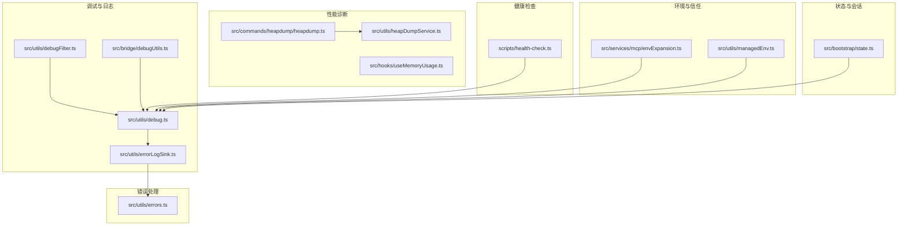
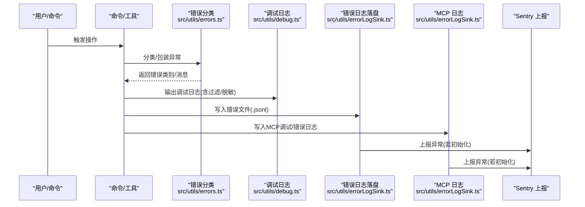
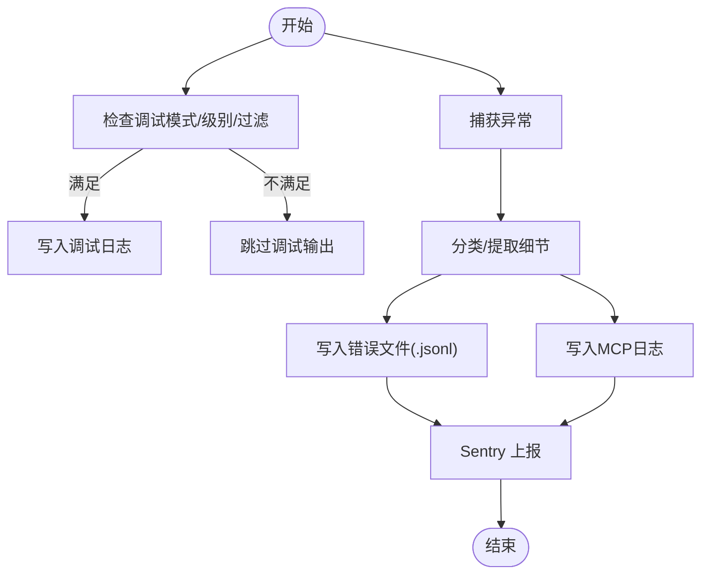
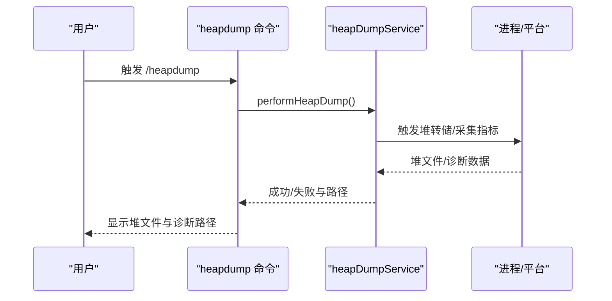
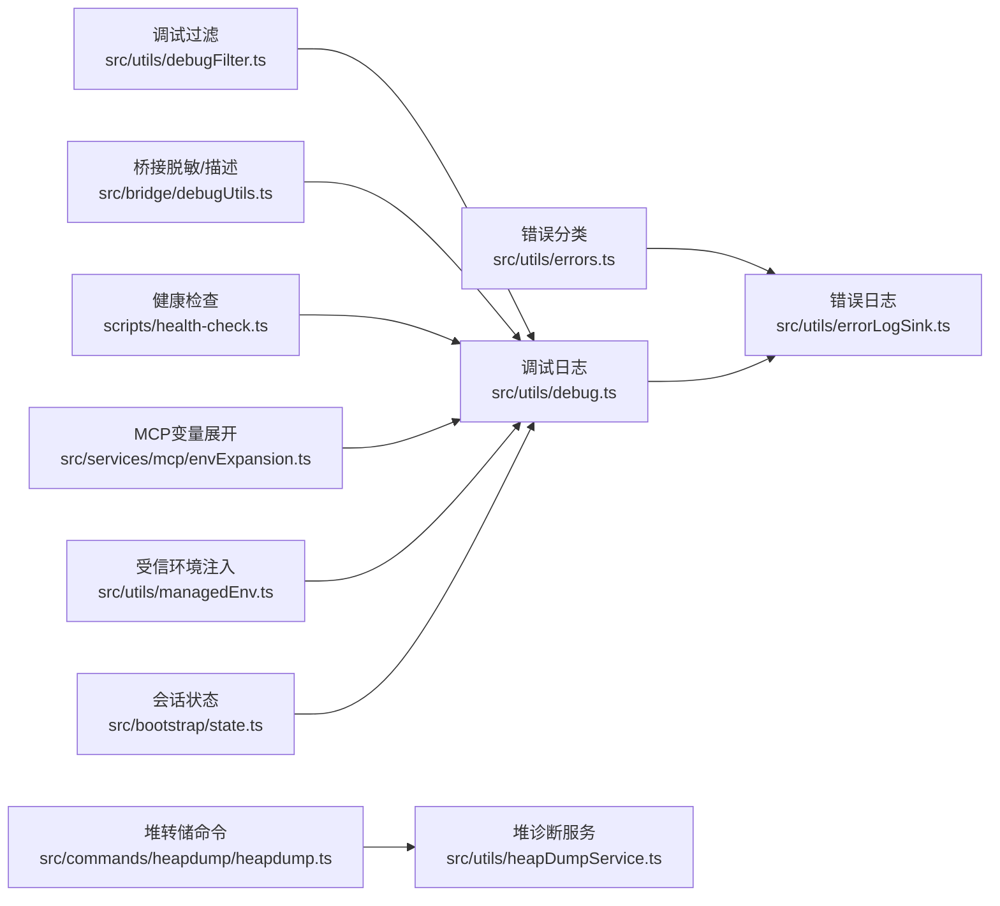

# 故障排除与常见问题

<cite>
**本文引用的文件**
- [README.md](file://README.md)
- [SECURITY.md](file://SECURITY.md)
- [scripts/health-check.ts](file://scripts/health-check.ts)
- [src/utils/errors.ts](file://src/utils/errors.ts)
- [src/utils/errorLogSink.ts](file://src/utils/errorLogSink.ts)
- [src/utils/debug.ts](file://src/utils/debug.ts)
- [src/utils/debugFilter.ts](file://src/utils/debugFilter.ts)
- [src/bridge/debugUtils.ts](file://src/bridge/debugUtils.ts)
- [src/commands/heapdump/heapdump.ts](file://src/commands/heapdump/heapdump.ts)
- [src/utils/heapDumpService.ts](file://src/utils/heapDumpService.ts)
- [src/hooks/useMemoryUsage.ts](file://src/hooks/useMemoryUsage.ts)
- [src/services/mcp/envExpansion.ts](file://src/services/mcp/envExpansion.ts)
- [src/utils/managedEnv.ts](file://src/utils/managedEnv.ts)
- [src/bootstrap/state.ts](file://src/bootstrap/state.ts)
</cite>

## 目录
1. [简介](#简介)
2. [项目结构](#项目结构)
3. [核心组件](#核心组件)
4. [架构总览](#架构总览)
5. [详细组件分析](#详细组件分析)
6. [依赖关系分析](#依赖关系分析)
7. [性能注意事项](#性能注意事项)
8. [故障排除指南](#故障排除指南)
9. [结论](#结论)
10. [附录](#附录)

## 简介
本文件面向 Claude Code Best 用户与维护者，提供系统化的故障排除与常见问题解答，覆盖安装、配置、使用、性能、安全与应急处置等方面。内容基于仓库内的错误处理、调试、健康检查与日志实现进行归纳，并给出可操作的诊断步骤与优化建议。

## 项目结构
围绕故障排除的关键目录与文件：
- 调试与日志：src/utils/debug.ts、src/utils/debugFilter.ts、src/utils/errorLogSink.ts、src/bridge/debugUtils.ts
- 错误类型与分类：src/utils/errors.ts
- 性能诊断：src/commands/heapdump/heapdump.ts、src/utils/heapDumpService.ts、src/hooks/useMemoryUsage.ts
- 健康检查：scripts/health-check.ts
- 环境变量与信任：src/services/mcp/envExpansion.ts、src/utils/managedEnv.ts
- 会话与状态：src/bootstrap/state.ts
- 使用与支持：README.md、SECURITY.md

**图表来源**
- [src/utils/debug.ts:1-269](file://src/utils/debug.ts#L1-L269)
- [src/utils/debugFilter.ts:1-158](file://src/utils/debugFilter.ts#L1-L158)
- [src/utils/errorLogSink.ts:1-240](file://src/utils/errorLogSink.ts#L1-L240)
- [src/bridge/debugUtils.ts:1-142](file://src/bridge/debugUtils.ts#L1-L142)
- [src/utils/errors.ts:1-239](file://src/utils/errors.ts#L1-L239)
- [src/commands/heapdump/heapdump.ts:1-17](file://src/commands/heapdump/heapdump.ts#L1-L17)
- [src/utils/heapDumpService.ts:32-212](file://src/utils/heapDumpService.ts#L32-L212)
- [src/hooks/useMemoryUsage.ts:1-39](file://src/hooks/useMemoryUsage.ts#L1-L39)
- [scripts/health-check.ts:1-164](file://scripts/health-check.ts#L1-L164)
- [src/services/mcp/envExpansion.ts:1-38](file://src/services/mcp/envExpansion.ts#L1-L38)
- [src/utils/managedEnv.ts:111-136](file://src/utils/managedEnv.ts#L111-L136)
- [src/bootstrap/state.ts:1-800](file://src/bootstrap/state.ts#L1-L800)

**章节来源**
- [README.md:1-173](file://README.md#L1-L173)
- [scripts/health-check.ts:1-164](file://scripts/health-check.ts#L1-L164)

## 核心组件
- 错误与异常体系：统一的错误类、中止类、文件系统错误判定、HTTP 错误分类等，便于在不同层面对异常进行一致处理与上报。
- 日志与错误收集：调试日志写入、错误文件落盘、MCP 服务器专用日志、Sentry 上报集成，支持按会话聚合与敏感信息脱敏。
- 调试过滤与脱敏：支持类别过滤、消息截断与敏感字段脱敏，兼顾可观测性与隐私。
- 性能诊断工具：堆转储命令与服务、内存诊断指标、高水位告警钩子，辅助定位内存泄漏与资源占用。
- 健康检查脚本：汇总代码规模、Lint、测试、冗余与构建状态，形成可量化的健康度报告。
- 环境变量与信任：MCP 配置变量展开、受信来源环境注入与白名单应用，降低配置风险。

**章节来源**
- [src/utils/errors.ts:1-239](file://src/utils/errors.ts#L1-L239)
- [src/utils/errorLogSink.ts:1-240](file://src/utils/errorLogSink.ts#L1-L240)
- [src/utils/debug.ts:1-269](file://src/utils/debug.ts#L1-L269)
- [src/utils/debugFilter.ts:1-158](file://src/utils/debugFilter.ts#L1-L158)
- [src/bridge/debugUtils.ts:1-142](file://src/bridge/debugUtils.ts#L1-L142)
- [src/commands/heapdump/heapdump.ts:1-17](file://src/commands/heapdump/heapdump.ts#L1-L17)
- [src/utils/heapDumpService.ts:32-212](file://src/utils/heapDumpService.ts#L32-L212)
- [src/hooks/useMemoryUsage.ts:1-39](file://src/hooks/useMemoryUsage.ts#L1-L39)
- [scripts/health-check.ts:1-164](file://scripts/health-check.ts#L1-L164)
- [src/services/mcp/envExpansion.ts:1-38](file://src/services/mcp/envExpansion.ts#L1-L38)
- [src/utils/managedEnv.ts:111-136](file://src/utils/managedEnv.ts#L111-L136)

## 架构总览
下图展示从“调用/请求”到“错误分类/日志落盘/Sentry 上报”的关键路径，以及性能诊断与健康检查的接入点。

**图表来源**
- [src/utils/errors.ts:197-239](file://src/utils/errors.ts#L197-L239)
- [src/utils/debug.ts:203-228](file://src/utils/debug.ts#L203-L228)
- [src/utils/errorLogSink.ts:150-217](file://src/utils/errorLogSink.ts#L150-L217)

## 详细组件分析

### 错误与异常体系
- 设计要点
  - 统一的错误基类与中止类，便于区分用户取消、SDK 取消与自定义错误。
  - 文件系统错误的便捷判断（ENOENT/EACCES/EPERM/ENOTDIR/ELOOP）。
  - Axios 错误分类（认证/超时/网络/HTTP/其他），便于统一处理与重试策略。
- 实践建议
  - 在业务层捕获异常后，优先使用分类函数确定错误类型，再决定是否重试或提示用户。
  - 对于外部 API 错误，结合响应体提取细节消息，避免仅显示状态码。

**章节来源**
- [src/utils/errors.ts:1-239](file://src/utils/errors.ts#L1-L239)

### 调试日志与错误日志
- 调试日志
  - 支持最小日志级别、命令行过滤、输出到标准错误或文件、自动维护“latest”符号链接。
  - 提供“启用调试日志”的运行期开关，便于临时开启。
- 错误日志
  - 将错误写入按日期命名的 JSONL 文件，包含时间戳、工作目录、用户类型、会话 ID、版本等上下文。
  - 对 Axios 错误附加 URL、状态与服务器返回的消息片段，提升可诊断性。
  - 集成 Sentry 上报，便于集中观测。
- MCP 日志
  - 为每个 MCP 服务器单独生成日志文件，便于隔离排查。

**图表来源**
- [src/utils/debug.ts:203-236](file://src/utils/debug.ts#L203-L236)
- [src/utils/errorLogSink.ts:150-217](file://src/utils/errorLogSink.ts#L150-L217)

**章节来源**
- [src/utils/debug.ts:1-269](file://src/utils/debug.ts#L1-L269)
- [src/utils/errorLogSink.ts:1-240](file://src/utils/errorLogSink.ts#L1-L240)

### 调试过滤与脱敏
- 过滤规则
  - 支持“包含/排除”两类模式，自动解析命令行参数；支持从消息中抽取类别（如 MCP 服务器名、事件类型等）。
  - 混合模式将被忽略并回退为“不过滤”，保证安全性。
- 脱敏与截断
  - 自动识别并脱敏常见敏感字段（如令牌、密钥等），对长消息进行截断，避免泄露与性能影响。

**章节来源**
- [src/utils/debugFilter.ts:1-158](file://src/utils/debugFilter.ts#L1-L158)
- [src/bridge/debugUtils.ts:1-142](file://src/bridge/debugUtils.ts#L1-L142)

### 性能诊断：内存与堆转储
- 堆转储命令
  - 提供手动触发堆转储的命令入口，返回堆快照与诊断文件路径。
- 内存诊断服务
  - 捕获进程内存使用、V8 堆统计、活跃句柄/请求、平台特定指标（如 Linux smaps_rollup）、增长速率等。
  - 识别潜在泄漏征兆（Detached Contexts、大量活跃句柄、Native 内存占比高、高增长速率等）。
- 内存使用钩子
  - 定时轮询 Node.js 进程内存，超过阈值时返回状态，用于 UI 提示与告警。

**图表来源**
- [src/commands/heapdump/heapdump.ts:1-17](file://src/commands/heapdump/heapdump.ts#L1-L17)
- [src/utils/heapDumpService.ts:88-212](file://src/utils/heapDumpService.ts#L88-L212)

**章节来源**
- [src/commands/heapdump/heapdump.ts:1-17](file://src/commands/heapdump/heapdump.ts#L1-L17)
- [src/utils/heapDumpService.ts:32-212](file://src/utils/heapDumpService.ts#L32-L212)
- [src/hooks/useMemoryUsage.ts:1-39](file://src/hooks/useMemoryUsage.ts#L1-L39)

### 健康检查脚本
- 指标维度
  - 代码规模（TS 文件数、LOC）
  - Lint（Biome 检查错误/警告）
  - 测试（通过/失败）
  - 冗余代码（Knip 未使用文件/导出/依赖）
  - 构建（产物大小、构建状态）
- 报告格式
  - 统一的“图标+标签+数值”输出，最后汇总错误/警告数量并退出码指示整体健康度。

**章节来源**
- [scripts/health-check.ts:1-164](file://scripts/health-check.ts#L1-L164)

### 环境变量与信任
- MCP 配置变量展开
  - 支持 ${VAR} 与 ${VAR:-default} 语法，返回展开后的字符串与缺失变量列表，便于提前发现配置问题。
- 受信环境注入
  - 对来自受信来源（全局配置、托管设置、CLI 参数）的环境变量进行应用，注意对危险键的处理。
  - 对项目级来源（项目设置、本地设置）仅应用安全白名单，避免引入高危变量。

**章节来源**
- [src/services/mcp/envExpansion.ts:1-38](file://src/services/mcp/envExpansion.ts#L1-L38)
- [src/utils/managedEnv.ts:111-136](file://src/utils/managedEnv.ts#L111-L136)

### 会话与状态
- 会话状态管理
  - 包含会话 ID、父会话 ID、项目根目录、工作目录、统计计数器、最近交互时间、慢操作记录等。
  - 提供会话切换、计划别名缓存、最近一次 API 请求与消息、提示词缓存等能力，支撑诊断与分享。
- 诊断价值
  - 通过状态中的统计与时间戳，可辅助定位卡顿、长时间无交互、API 异常等问题。

**章节来源**
- [src/bootstrap/state.ts:1-800](file://src/bootstrap/state.ts#L1-L800)

## 依赖关系分析
- 组件耦合
  - 错误分类与日志落盘相互独立，但共同依赖调试基础设施；调试日志与错误日志共享过滤与脱敏能力。
  - 性能诊断与状态管理解耦，但可通过命令入口与钩子联动。
- 外部依赖
  - Axios 用于 HTTP 错误分类；Sentry 用于异常上报；平台 API 用于堆转储与资源统计。

**图表来源**
- [src/utils/errors.ts:197-239](file://src/utils/errors.ts#L197-L239)
- [src/utils/errorLogSink.ts:150-217](file://src/utils/errorLogSink.ts#L150-L217)
- [src/utils/debug.ts:203-236](file://src/utils/debug.ts#L203-L236)
- [src/utils/debugFilter.ts:1-158](file://src/utils/debugFilter.ts#L1-L158)
- [src/bridge/debugUtils.ts:1-142](file://src/bridge/debugUtils.ts#L1-L142)
- [src/commands/heapdump/heapdump.ts:1-17](file://src/commands/heapdump/heapdump.ts#L1-L17)
- [src/utils/heapDumpService.ts:88-212](file://src/utils/heapDumpService.ts#L88-L212)
- [scripts/health-check.ts:1-164](file://scripts/health-check.ts#L1-L164)
- [src/services/mcp/envExpansion.ts:1-38](file://src/services/mcp/envExpansion.ts#L1-L38)
- [src/utils/managedEnv.ts:111-136](file://src/utils/managedEnv.ts#L111-L136)
- [src/bootstrap/state.ts:1-800](file://src/bootstrap/state.ts#L1-L800)

## 性能注意事项
- 内存泄漏检测
  - 使用堆转储命令与内存诊断服务，关注 Detached Contexts、活跃句柄/请求、Native 内存占比与增长速率。
  - 高水位钩子用于 UI 提示，建议结合堆快照与诊断报告综合判断。
- CPU 占用分析
  - 关注慢操作记录与交互时间戳，结合状态中的统计项定位热点。
- I/O 优化
  - 减少不必要的文件系统访问与日志写入频率；合理使用缓冲写入与延迟刷新。
- 环境变量与信任
  - 仅在受信来源注入高风险变量；对项目级来源严格白名单控制，避免意外的高开销行为。

**章节来源**
- [src/utils/heapDumpService.ts:88-212](file://src/utils/heapDumpService.ts#L88-L212)
- [src/hooks/useMemoryUsage.ts:1-39](file://src/hooks/useMemoryUsage.ts#L1-L39)
- [src/bootstrap/state.ts:1-800](file://src/bootstrap/state.ts#L1-L800)
- [src/services/mcp/envExpansion.ts:1-38](file://src/services/mcp/envExpansion.ts#L1-L38)
- [src/utils/managedEnv.ts:111-136](file://src/utils/managedEnv.ts#L111-L136)

## 故障排除指南

### 安装与运行
- 环境要求
  - 使用最新版本的 Bun，避免旧版本导致的兼容性问题。
- 国内网络
  - 若访问 GitHub 网络受限，可设置默认发布镜像环境变量后再安装。
- 常见症状
  - 安装失败或依赖下载缓慢：检查网络代理与镜像变量是否生效。
  - 启动后立即崩溃：查看调试日志与错误文件，确认是否存在未捕获异常。

**章节来源**
- [README.md:44-78](file://README.md#L44-L78)

### 登录与配置
- 首次登录
  - 使用命令进入登录配置界面，选择兼容服务类型并填写必要字段。
- 配置校验
  - 使用 MCP 变量展开能力检查环境变量是否正确展开；对缺失变量进行补齐或默认值设置。
- 受信环境
  - 确保来自受信来源的环境变量已正确注入，避免项目级来源污染。

**章节来源**
- [README.md:79-98](file://README.md#L79-L98)
- [src/services/mcp/envExpansion.ts:1-38](file://src/services/mcp/envExpansion.ts#L1-L38)
- [src/utils/managedEnv.ts:111-136](file://src/utils/managedEnv.ts#L111-L136)

### 调试与日志
- 启用调试
  - 通过命令行参数或运行期指令开启调试模式；必要时将调试输出重定向至标准错误。
- 过滤与脱敏
  - 使用调试过滤参数仅保留关键类别；对敏感字段进行脱敏，避免泄露。
- 查看日志
  - 错误日志与 MCP 日志分别存放，按日期命名；通过“latest”符号链接快速定位当前会话日志。

**章节来源**
- [src/utils/debug.ts:44-102](file://src/utils/debug.ts#L44-L102)
- [src/utils/debugFilter.ts:1-158](file://src/utils/debugFilter.ts#L1-L158)
- [src/utils/errorLogSink.ts:25-39](file://src/utils/errorLogSink.ts#L25-L39)
- [src/bridge/debugUtils.ts:11-34](file://src/bridge/debugUtils.ts#L11-L34)

### 错误分类与处理
- 分类优先
  - 先使用错误分类函数区分认证、超时、网络、HTTP 与其他，再决定重试或提示策略。
- 详细信息
  - 对 Axios 错误提取 URL、状态与服务器返回的消息片段，增强可诊断性。
- 上报与留存
  - 错误同时写入文件与 Sentry；保留近期错误以便分享与复现。

**章节来源**
- [src/utils/errors.ts:197-239](file://src/utils/errors.ts#L197-L239)
- [src/utils/errorLogSink.ts:150-178](file://src/utils/errorLogSink.ts#L150-L178)
- [src/bridge/debugUtils.ts:60-82](file://src/bridge/debugUtils.ts#L60-L82)

### 性能问题定位
- 内存问题
  - 使用堆转储命令与内存诊断服务，关注增长速率与潜在泄漏征兆；结合高水位钩子进行 UI 提示。
- CPU 与 I/O
  - 通过状态中的统计与慢操作记录定位热点；减少高频日志与不必要的文件系统操作。
- 环境变量
  - 检查 MCP 变量展开结果与受信环境注入，避免因变量缺失或错误导致的额外开销。

**章节来源**
- [src/commands/heapdump/heapdump.ts:1-17](file://src/commands/heapdump/heapdump.ts#L1-L17)
- [src/utils/heapDumpService.ts:88-212](file://src/utils/heapDumpService.ts#L88-L212)
- [src/hooks/useMemoryUsage.ts:1-39](file://src/hooks/useMemoryUsage.ts#L1-L39)
- [src/bootstrap/state.ts:1-800](file://src/bootstrap/state.ts#L1-L800)

### 安全相关
- 权限与信任
  - 仅在受信来源注入高风险环境变量；项目级来源严格白名单。
- 沙箱与越权
  - 避免在不受信任的环境中执行高风险命令；必要时启用沙箱模式。
- 数据泄露防护
  - 使用调试脱敏与日志脱敏，避免敏感信息落入日志文件。

**章节来源**
- [src/utils/managedEnv.ts:111-136](file://src/utils/managedEnv.ts#L111-L136)
- [src/bridge/debugUtils.ts:11-34](file://src/bridge/debugUtils.ts#L11-L34)

### 社区支持与贡献
- 文档与反馈
  - 在线文档与贡献指南见项目 README；遇到问题优先提交 Issue 并附带日志与错误文件。
- 安全问题
  - 遵循安全政策，仅在受支持版本范围内报告漏洞。

**章节来源**
- [README.md:1-173](file://README.md#L1-L173)
- [SECURITY.md:1-22](file://SECURITY.md#L1-L22)

### 紧急情况与恢复
- 快速诊断
  - 启用调试模式、运行健康检查脚本、收集错误日志与堆转储。
- 恢复策略
  - 清理不受信任的环境变量注入、回滚可疑配置、重启服务并观察内存与日志变化。
- 分享与协作
  - 使用会话状态中的最近请求与消息，配合错误文件与堆诊断报告进行问题复现与协作。

**章节来源**
- [scripts/health-check.ts:1-164](file://scripts/health-check.ts#L1-L164)
- [src/utils/errorLogSink.ts:1-240](file://src/utils/errorLogSink.ts#L1-L240)
- [src/bootstrap/state.ts:1-800](file://src/bootstrap/state.ts#L1-L800)

## 结论
本指南基于仓库内的错误处理、调试、日志与健康检查实现，提供了从安装到运行、从性能到安全的系统化排障路径。建议在日常使用中：
- 建立调试与日志规范，启用必要的过滤与脱敏；
- 使用健康检查脚本定期评估项目健康度；
- 针对内存与性能问题，结合堆转储与诊断服务进行根因分析；
- 在安全方面坚持“最小权限”与“受信注入”，避免高风险变量进入生产环境。

## 附录
- 常用命令与参数
  - 启用调试：通过命令行参数或运行期指令开启调试模式。
  - 过滤调试：使用调试过滤参数限定类别。
  - 健康检查：运行健康检查脚本获取指标报告。
  - 堆转储：触发堆转储命令并查看诊断文件路径。

**章节来源**
- [src/utils/debug.ts:44-102](file://src/utils/debug.ts#L44-L102)
- [src/utils/debugFilter.ts:1-158](file://src/utils/debugFilter.ts#L1-L158)
- [scripts/health-check.ts:1-164](file://scripts/health-check.ts#L1-L164)
- [src/commands/heapdump/heapdump.ts:1-17](file://src/commands/heapdump/heapdump.ts#L1-L17)