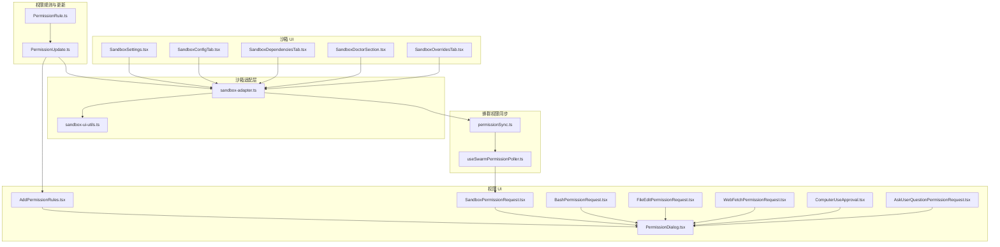
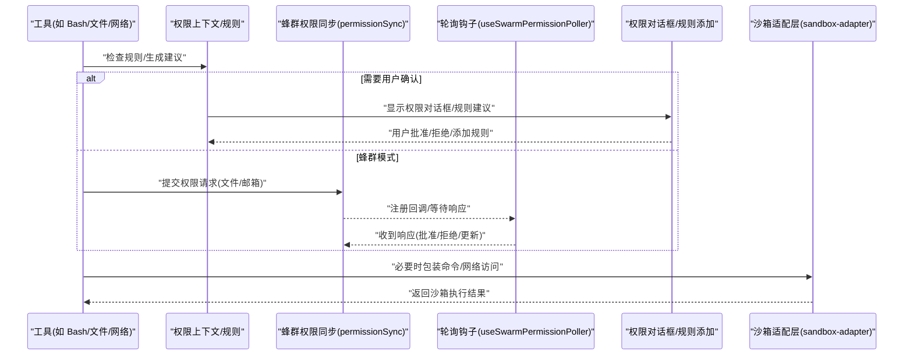
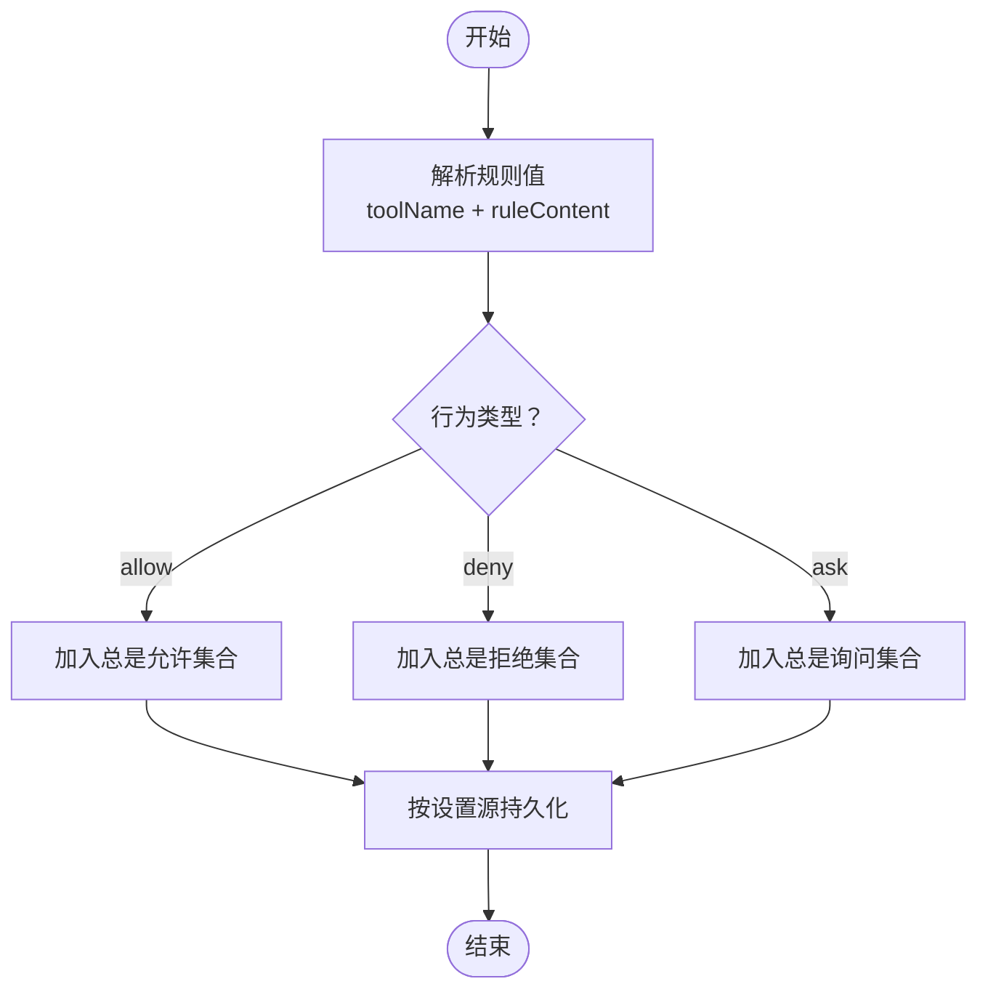
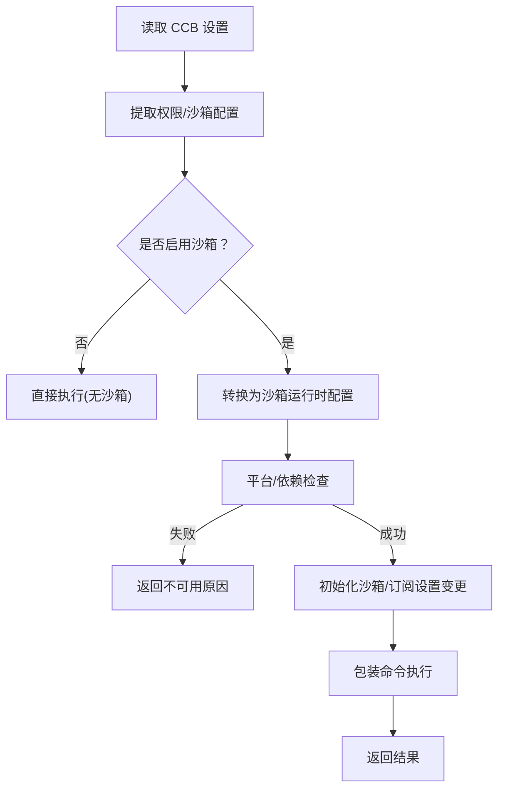
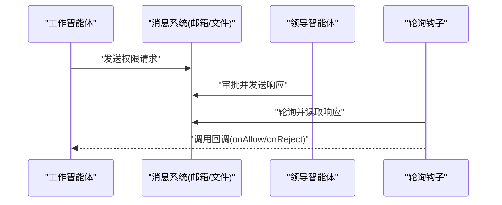
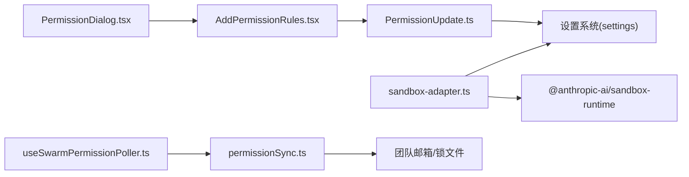

# 权限与安全系统

<cite>
**本文引用的文件**
- [README.md](file://README.md)
- [sandbox-adapter.ts](file://src/utils/sandbox/sandbox-adapter.ts)
- [permissionSync.ts](file://src/utils/swarm/permissionSync.ts)
- [useSwarmPermissionPoller.ts](file://src/hooks/useSwarmPermissionPoller.ts)
- [PermissionRule.ts](file://src/utils/permissions/PermissionRule.ts)
- [PermissionUpdate.ts](file://src/utils/permissions/PermissionUpdate.ts)
- [AddPermissionRules.tsx](file://src/components/permissions/rules/AddPermissionRules.tsx)
- [PermissionDialog.tsx](file://src/components/permissions/PermissionDialog.tsx)
- [SandboxPermissionRequest.tsx](file://src/components/permissions/SandboxPermissionRequest.tsx)
- [BashPermissionRequest.tsx](file://src/components/permissions/BashPermissionRequest/BashPermissionRequest.tsx)
- [FileEditPermissionRequest.tsx](file://src/components/permissions/FileEditPermissionRequest/FileEditPermissionRequest.tsx)
- [WebFetchPermissionRequest.tsx](file://src/components/permissions/WebFetchPermissionRequest/WebFetchPermissionRequest.tsx)
- [ComputerUseApproval.tsx](file://src/components/permissions/ComputerUseApproval/ComputerUseApproval.tsx)
- [AskUserQuestionPermissionRequest.tsx](file://src/components/permissions/AskUserQuestionPermissionRequest/AskUserQuestionPermissionRequest.tsx)
- [SandboxSettings.tsx](file://src/components/sandbox/SandboxSettings.tsx)
- [SandboxConfigTab.tsx](file://src/components/sandbox/SandboxConfigTab.tsx)
- [SandboxDependenciesTab.tsx](file://src/components/sandbox/SandboxDependenciesTab.tsx)
- [SandboxDoctorSection.tsx](file://src/components/sandbox/SandboxDoctorSection.tsx)
- [SandboxOverridesTab.tsx](file://src/components/sandbox/SandboxOverridesTab.tsx)
- [sandbox-ui-utils.ts](file://src/utils/sandbox/sandbox-ui-utils.ts)
- [shellPermissionHelpers.tsx](file://src/components/permissions/shellPermissionHelpers.tsx)
- [useShellPermissionFeedback.ts](file://src/components/permissions/useShellPermissionFeedback.ts)
- [tools/BashTool/BashTool.ts](file://src/components/permissions/src/tools/BashTool/BashTool.ts)
- [tools/EnterPlanModeTool/EnterPlanModeTool.ts](file://src/components/permissions/src/tools/EnterPlanModeTool/EnterPlanModeTool.ts)
- [tools/ExitPlanModeTool/ExitPlanModeV2Tool.ts](file://src/components/permissions/src/tools/ExitPlanModeTool/ExitPlanModeV2Tool.ts)
</cite>

## 目录
1. [引言](#引言)
2. [项目结构](#项目结构)
3. [核心组件](#核心组件)
4. [架构总览](#架构总览)
5. [详细组件分析](#详细组件分析)
6. [依赖关系分析](#依赖关系分析)
7. [性能考量](#性能考量)
8. [故障排查指南](#故障排查指南)
9. [结论](#结论)
10. [附录](#附录)

## 引言
本文件面向开发者与运维人员，系统性阐述 Claude Code Best（以下简称“CCB”）的权限与安全体系：权限控制模型、沙箱机制、访问控制策略、安全审计与日志、权限配置与部署流程，以及安全最佳实践与常见威胁防护。文档以代码为依据，结合可视化图示，帮助读者快速理解并正确使用与扩展该系统。

## 项目结构
围绕权限与安全的关键目录与文件如下：
- 权限规则与更新：src/utils/permissions
- 沙箱适配层：src/utils/sandbox
- 蜂群权限同步：src/utils/swarm
- 权限 UI 与对话框：src/components/permissions
- 沙箱 UI 设置与诊断：src/components/sandbox
- 工具侧权限集成：src/components/permissions/src/tools/*
- Hooks 与 UI 辅助：src/hooks、src/components/permissions/shellPermissionHelpers.tsx 等

图表来源
- [PermissionRule.ts:1-41](file://src/utils/permissions/PermissionRule.ts#L1-L41)
- [PermissionUpdate.ts:1-390](file://src/utils/permissions/PermissionUpdate.ts#L1-L390)
- [sandbox-adapter.ts:1-986](file://src/utils/sandbox/sandbox-adapter.ts#L1-L986)
- [permissionSync.ts:1-929](file://src/utils/swarm/permissionSync.ts#L1-L929)
- [useSwarmPermissionPoller.ts:1-331](file://src/hooks/useSwarmPermissionPoller.ts#L1-L331)
- [AddPermissionRules.tsx:1-165](file://src/components/permissions/rules/AddPermissionRules.tsx#L1-L165)
- [PermissionDialog.tsx:1-55](file://src/components/permissions/PermissionDialog.tsx#L1-L55)
- [SandboxPermissionRequest.tsx:1-2](file://src/components/permissions/SandboxPermissionRequest.tsx#L1-L2)
- [BashPermissionRequest.tsx:1-200](file://src/components/permissions/BashPermissionRequest/BashPermissionRequest.tsx#L1-L200)
- [FileEditPermissionRequest.tsx:1-200](file://src/components/permissions/FileEditPermissionRequest/FileEditPermissionRequest.tsx#L1-L200)
- [WebFetchPermissionRequest.tsx:1-200](file://src/components/permissions/WebFetchPermissionRequest/WebFetchPermissionRequest.tsx#L1-L200)
- [ComputerUseApproval.tsx:1-200](file://src/components/permissions/ComputerUseApproval/ComputerUseApproval.tsx#L1-L200)
- [AskUserQuestionPermissionRequest.tsx:1-200](file://src/components/permissions/AskUserQuestionPermissionRequest/AskUserQuestionPermissionRequest.tsx#L1-L200)
- [SandboxSettings.tsx:1-200](file://src/components/sandbox/SandboxSettings.tsx#L1-L200)
- [SandboxConfigTab.tsx:1-200](file://src/components/sandbox/SandboxConfigTab.tsx#L1-L200)
- [SandboxDependenciesTab.tsx:1-200](file://src/components/sandbox/SandboxDependenciesTab.tsx#L1-L200)
- [SandboxDoctorSection.tsx:1-200](file://src/components/sandbox/SandboxDoctorSection.tsx#L1-L200)
- [SandboxOverridesTab.tsx:1-200](file://src/components/sandbox/SandboxOverridesTab.tsx#L1-L200)
- [sandbox-ui-utils.ts:1-200](file://src/utils/sandbox/sandbox-ui-utils.ts#L1-L200)

章节来源
- [README.md:1-173](file://README.md#L1-L173)

## 核心组件
- 权限规则与行为
  - 规则值由工具名与可选内容组成；行为分为允许、拒绝、询问三类。
  - 规则解析与序列化工具用于持久化与展示。
- 权限更新与上下文
  - 支持添加/替换/移除规则，追加额外工作目录，设置默认模式，并持久化到用户、项目或本地设置源。
- 沙箱适配层
  - 将 CCB 设置转换为沙箱运行时配置，处理网络域、文件系统读写白黑名单、Ripgrep 参数、平台支持与依赖检查、Git bare 仓库防护等。
- 蜂群权限同步
  - 基于团队邮箱（内存/文件）的消息传递，实现跨智能体的权限请求与响应；支持沙箱网络请求的授权回调。
- 权限 UI 与对话框
  - 提供规则添加、权限对话框、各类工具的权限请求组件（Bash、文件编辑、Web 抓取、计算机使用、问答等）。
- 沙箱 UI 与诊断
  - 提供沙箱设置、配置、依赖、医生与覆盖项等页面，辅助启用/禁用、自动放行 Bash、忽略违规等。

章节来源
- [PermissionRule.ts:1-41](file://src/utils/permissions/PermissionRule.ts#L1-L41)
- [PermissionUpdate.ts:1-390](file://src/utils/permissions/PermissionUpdate.ts#L1-L390)
- [sandbox-adapter.ts:1-986](file://src/utils/sandbox/sandbox-adapter.ts#L1-L986)
- [permissionSync.ts:1-929](file://src/utils/swarm/permissionSync.ts#L1-L929)
- [useSwarmPermissionPoller.ts:1-331](file://src/hooks/useSwarmPermissionPoller.ts#L1-L331)
- [AddPermissionRules.tsx:1-165](file://src/components/permissions/rules/AddPermissionRules.tsx#L1-L165)
- [PermissionDialog.tsx:1-55](file://src/components/permissions/PermissionDialog.tsx#L1-L55)
- [SandboxSettings.tsx:1-200](file://src/components/sandbox/SandboxSettings.tsx#L1-L200)

## 架构总览
下图展示了从工具调用到权限决策、沙箱执行与蜂群协作的整体流程。

图表来源
- [permissionSync.ts:1-929](file://src/utils/swarm/permissionSync.ts#L1-L929)
- [useSwarmPermissionPoller.ts:1-331](file://src/hooks/useSwarmPermissionPoller.ts#L1-L331)
- [sandbox-adapter.ts:1-986](file://src/utils/sandbox/sandbox-adapter.ts#L1-L986)
- [AddPermissionRules.tsx:1-165](file://src/components/permissions/rules/AddPermissionRules.tsx#L1-L165)
- [PermissionDialog.tsx:1-55](file://src/components/permissions/PermissionDialog.tsx#L1-L55)

## 详细组件分析

### 权限规则与更新（PermissionRule 与 PermissionUpdate）
- 规则模型
  - 工具名 + 可选规则内容；行为枚举为 allow/deny/ask。
  - 规则值与字符串互转，便于持久化与展示。
- 更新模型
  - 支持添加/替换/移除规则、追加/移除额外工作目录、设置默认模式。
  - 按设置源（用户/项目/本地）持久化，避免循环依赖与缓存污染。
- 不可达规则检测
  - 当启用沙箱自动放行 Bash 时，新增规则可能被覆盖，系统会提示不可达风险。

图表来源
- [PermissionRule.ts:1-41](file://src/utils/permissions/PermissionRule.ts#L1-L41)
- [PermissionUpdate.ts:1-390](file://src/utils/permissions/PermissionUpdate.ts#L1-L390)
- [AddPermissionRules.tsx:1-165](file://src/components/permissions/rules/AddPermissionRules.tsx#L1-L165)

章节来源
- [PermissionRule.ts:1-41](file://src/utils/permissions/PermissionRule.ts#L1-L41)
- [PermissionUpdate.ts:1-390](file://src/utils/permissions/PermissionUpdate.ts#L1-L390)
- [AddPermissionRules.tsx:1-165](file://src/components/permissions/rules/AddPermissionRules.tsx#L1-L165)

### 沙箱适配层（sandbox-adapter）
- 配置转换
  - 将 CCB 设置映射为沙箱运行时配置：网络域白名单/黑名单、文件系统读写/禁止列表、Ripgrep 命令参数、忽略违规、弱化隔离等。
  - 特殊路径处理：支持 CC 独有的路径前缀语义（如 // 绝对、/ 相对设置根），并扩展 ~ 与相对路径。
- 平台与依赖
  - 平台支持检测（macOS/Linux/WSL2+）、依赖检查（如 bubblewrap、socat、ripgrep），并提供不可用原因提示。
  - 可配置启用平台列表，实现分阶段 rollout。
- 安全加固
  - Git bare 仓库防护：检测并清理可能被植入的裸仓库文件，防止逃逸。
  - 写入保护：阻止对 settings.json 与 .claude/skills 的写入，避免沙箱逃逸。
  - Bash 自动放行：在沙箱启用且满足条件时自动放行 Bash 命令。
- 初始化与动态更新
  - 初始化时构建配置并订阅设置变更，实时更新沙箱配置。
  - 包装命令执行，支持自定义配置与中断信号。

图表来源
- [sandbox-adapter.ts:1-986](file://src/utils/sandbox/sandbox-adapter.ts#L1-L986)

章节来源
- [sandbox-adapter.ts:1-986](file://src/utils/sandbox/sandbox-adapter.ts#L1-L986)

### 蜂群权限同步（permissionSync 与 useSwarmPermissionPoller）
- 请求与响应
  - 工作智能体通过邮箱或文件系统提交权限请求，领导智能体审批后回传响应。
  - 支持沙箱网络请求的专用回调注册与处理。
- 注册表与轮询
  - 使用 Map 维护待处理回调，轮询钩子定时查询响应并调用回调。
  - 支持清理所有挂起回调，保证会话重置时状态一致。
- 消息格式与路由
  - 统一消息结构，包含请求 ID、工具名、输入、描述、建议规则、更新后的输入与权限更新等。

图表来源
- [permissionSync.ts:1-929](file://src/utils/swarm/permissionSync.ts#L1-L929)
- [useSwarmPermissionPoller.ts:1-331](file://src/hooks/useSwarmPermissionPoller.ts#L1-L331)

章节来源
- [permissionSync.ts:1-929](file://src/utils/swarm/permissionSync.ts#L1-L929)
- [useSwarmPermissionPoller.ts:1-331](file://src/hooks/useSwarmPermissionPoller.ts#L1-L331)

### 权限 UI 与对话框
- 规则添加
  - 选择保存位置（用户/项目/本地），应用并持久化规则，同时检测不可达规则。
- 权限对话框
  - 统一的边框与标题样式，支持副标题、颜色与右侧装饰。
- 工具权限请求组件
  - Bash、文件编辑、Web 抓取、计算机使用、问答等工具均有独立的请求组件，负责收集上下文与展示预览。

章节来源
- [AddPermissionRules.tsx:1-165](file://src/components/permissions/rules/AddPermissionRules.tsx#L1-L165)
- [PermissionDialog.tsx:1-55](file://src/components/permissions/PermissionDialog.tsx#L1-L55)
- [BashPermissionRequest.tsx:1-200](file://src/components/permissions/BashPermissionRequest/BashPermissionRequest.tsx#L1-L200)
- [FileEditPermissionRequest.tsx:1-200](file://src/components/permissions/FileEditPermissionRequest/FileEditPermissionRequest.tsx#L1-L200)
- [WebFetchPermissionRequest.tsx:1-200](file://src/components/permissions/WebFetchPermissionRequest/WebFetchPermissionRequest.tsx#L1-L200)
- [ComputerUseApproval.tsx:1-200](file://src/components/permissions/ComputerUseApproval/ComputerUseApproval.tsx#L1-L200)
- [AskUserQuestionPermissionRequest.tsx:1-200](file://src/components/permissions/AskUserQuestionPermissionRequest/AskUserQuestionPermissionRequest.tsx#L1-L200)

### 沙箱 UI 与诊断
- 设置与配置
  - 沙箱开关、自动放行 Bash、忽略违规、弱化网络隔离等。
- 依赖与医生
  - 显示缺失依赖、平台不支持信息，提供诊断与修复建议。
- 覆盖项
  - 允许策略覆盖项，便于企业级管控。

章节来源
- [SandboxSettings.tsx:1-200](file://src/components/sandbox/SandboxSettings.tsx#L1-L200)
- [SandboxConfigTab.tsx:1-200](file://src/components/sandbox/SandboxConfigTab.tsx#L1-L200)
- [SandboxDependenciesTab.tsx:1-200](file://src/components/sandbox/SandboxDependenciesTab.tsx#L1-L200)
- [SandboxDoctorSection.tsx:1-200](file://src/components/sandbox/SandboxDoctorSection.tsx#L1-L200)
- [SandboxOverridesTab.tsx:1-200](file://src/components/sandbox/SandboxOverridesTab.tsx#L1-L200)

## 依赖关系分析
- 组件耦合
  - 权限更新模块与设置系统耦合，通过设置源常量与持久化函数进行解耦。
  - 沙箱适配层依赖设置系统与平台信息，同时桥接外部沙箱运行时库。
  - 蜂群权限同步依赖团队邮箱与锁文件机制，保证并发安全。
- 外部依赖
  - 沙箱运行时库、ripgrep、平台检测、文件系统操作等。

图表来源
- [PermissionUpdate.ts:1-390](file://src/utils/permissions/PermissionUpdate.ts#L1-L390)
- [sandbox-adapter.ts:1-986](file://src/utils/sandbox/sandbox-adapter.ts#L1-L986)
- [permissionSync.ts:1-929](file://src/utils/swarm/permissionSync.ts#L1-L929)
- [useSwarmPermissionPoller.ts:1-331](file://src/hooks/useSwarmPermissionPoller.ts#L1-L331)
- [AddPermissionRules.tsx:1-165](file://src/components/permissions/rules/AddPermissionRules.tsx#L1-L165)
- [PermissionDialog.tsx:1-55](file://src/components/permissions/PermissionDialog.tsx#L1-L55)

章节来源
- [PermissionUpdate.ts:1-390](file://src/utils/permissions/PermissionUpdate.ts#L1-L390)
- [sandbox-adapter.ts:1-986](file://src/utils/sandbox/sandbox-adapter.ts#L1-L986)
- [permissionSync.ts:1-929](file://src/utils/swarm/permissionSync.ts#L1-L929)
- [useSwarmPermissionPoller.ts:1-331](file://src/hooks/useSwarmPermissionPoller.ts#L1-L331)
- [AddPermissionRules.tsx:1-165](file://src/components/permissions/rules/AddPermissionRules.tsx#L1-L165)
- [PermissionDialog.tsx:1-55](file://src/components/permissions/PermissionDialog.tsx#L1-L55)

## 性能考量
- 沙箱初始化与配置更新
  - 初始化过程包含平台检测与依赖检查，建议在启动阶段完成，避免频繁重复。
  - 设置变更订阅导致的配置更新为异步，注意避免高频变更引发的抖动。
- 蜂群轮询
  - 轮询间隔为固定毫秒数，建议在无请求时关闭轮询以节省 CPU。
- 文件系统与网络
  - 沙箱内的文件系统与网络访问受严格限制，避免不必要的 IO 与连接提升性能与安全。

## 故障排查指南
- 沙箱不可用
  - 检查平台支持与依赖缺失提示；根据医生页面建议安装依赖或调整设置。
  - 若设置了启用平台列表，请确认当前平台在允许范围内。
- 权限请求未响应
  - 确认是否为蜂群工作智能体；检查轮询钩子是否激活与回调是否注册。
  - 查看邮箱/文件系统中的请求与响应文件是否存在与格式是否正确。
- 规则不可达
  - 当启用沙箱自动放行 Bash 时，新增规则可能被覆盖；使用不可达规则检测提示进行调整。
- Git 裸仓库问题
  - 沙箱适配层会清理可能被植入的裸仓库文件；若仍出现异常，检查命令执行前后的工作树状态。

章节来源
- [sandbox-adapter.ts:562-592](file://src/utils/sandbox/sandbox-adapter.ts#L562-L592)
- [useSwarmPermissionPoller.ts:268-331](file://src/hooks/useSwarmPermissionPoller.ts#L268-L331)
- [permissionSync.ts:1-929](file://src/utils/swarm/permissionSync.ts#L1-L929)
- [AddPermissionRules.tsx:105-126](file://src/components/permissions/rules/AddPermissionRules.tsx#L105-L126)

## 结论
CCB 的权限与安全系统通过“规则 + 上下文 + 沙箱 + 蜂群协作”的组合，实现了细粒度、可审计、可扩展的安全控制。权限规则与更新模块提供灵活的策略管理，沙箱适配层确保执行环境的隔离与合规，蜂群权限同步保障多智能体场景下的统一治理。配合完善的 UI 与诊断工具，开发者可以高效地配置、测试与部署安全策略。

## 附录

### 权限配置指南（步骤与要点）
- 编写规则
  - 在规则添加组件中选择行为（允许/拒绝/询问）与保存位置（用户/项目/本地）。
  - 对于 Bash、文件编辑、Web 抓取等工具，可基于路径、域名等维度精细化控制。
- 测试规则
  - 使用权限对话框进行交互式测试，观察不可达规则提示与沙箱自动放行效果。
  - 在不同工作目录与团队成员间验证规则生效范围。
- 部署与生效
  - 规则持久化后立即生效；沙箱配置变更通过订阅机制动态更新。
  - 对于企业级部署，可通过策略覆盖项与启用平台列表进行集中管控。

章节来源
- [AddPermissionRules.tsx:1-165](file://src/components/permissions/rules/AddPermissionRules.tsx#L1-L165)
- [PermissionDialog.tsx:1-55](file://src/components/permissions/PermissionDialog.tsx#L1-L55)
- [sandbox-adapter.ts:770-781](file://src/utils/sandbox/sandbox-adapter.ts#L770-L781)

### 安全最佳实践
- 最小权限原则
  - 仅授予完成任务所需的最小权限；优先使用“询问”行为以降低误授权风险。
- 规则审查与审计
  - 定期审查规则有效性与不可达规则；利用沙箱日志与违规记录进行审计。
- 沙箱强隔离
  - 启用沙箱并避免弱化隔离设置；严格控制网络域与文件系统访问。
- Git 安全
  - 注意裸仓库防护；避免在工作树中放置可疑文件；定期清理临时文件。
- 蜂群治理
  - 明确领导与工作智能体职责；规范权限请求与响应流程；使用覆盖项统一策略。

章节来源
- [sandbox-adapter.ts:257-280](file://src/utils/sandbox/sandbox-adapter.ts#L257-L280)
- [permissionSync.ts:1-929](file://src/utils/swarm/permissionSync.ts#L1-L929)