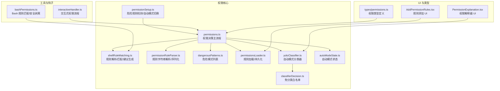
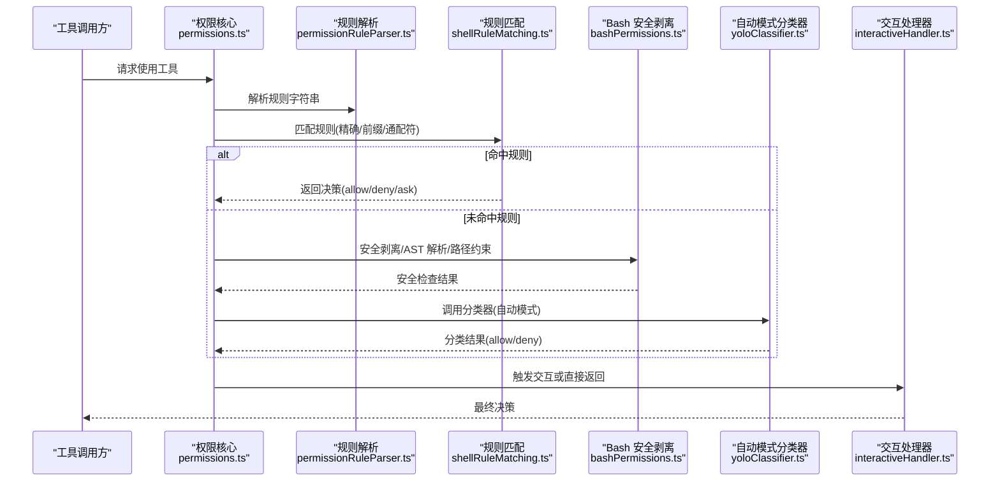
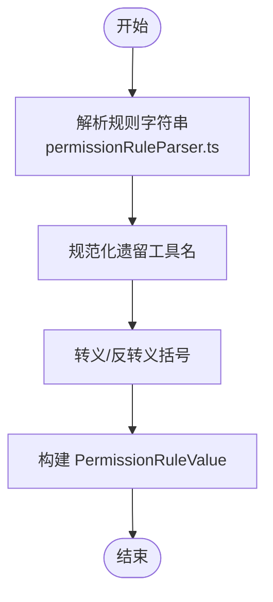
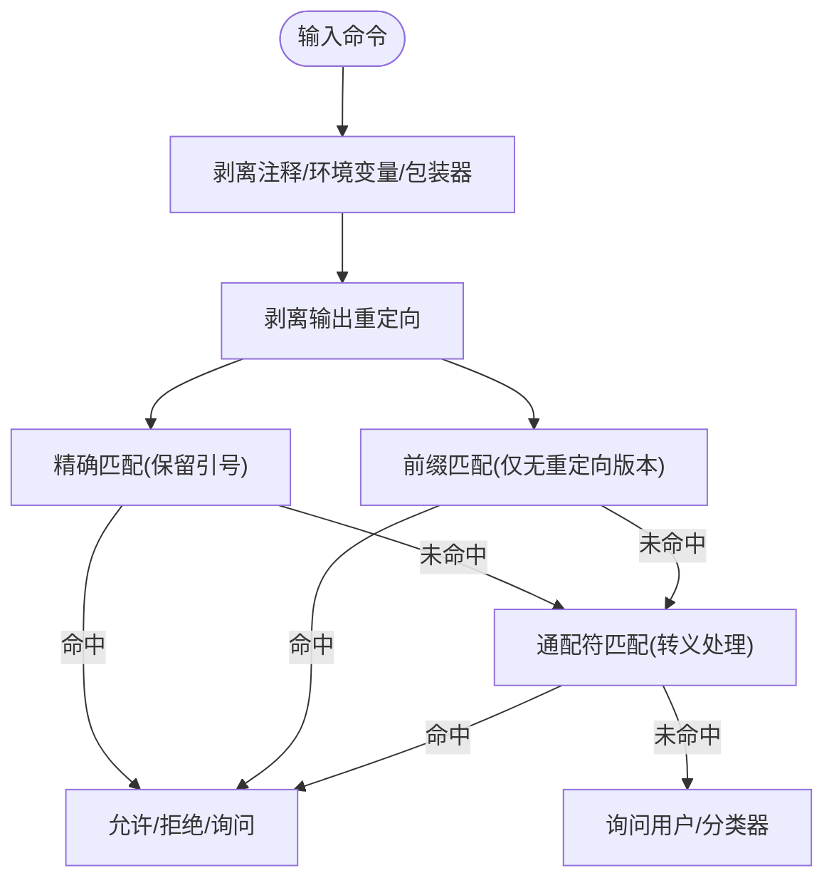
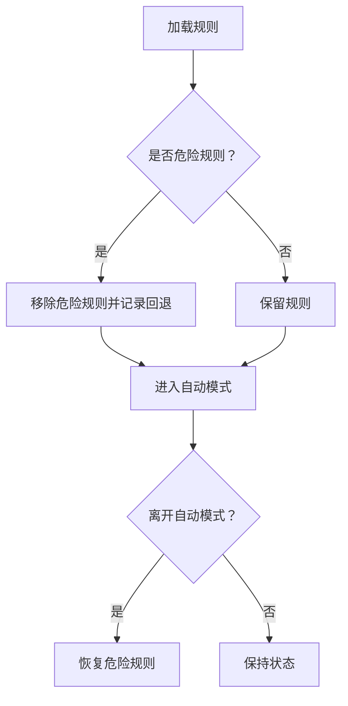
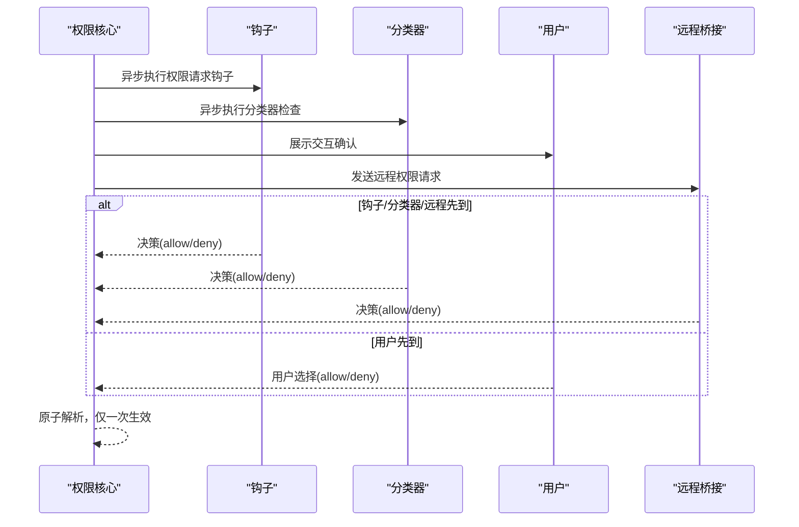
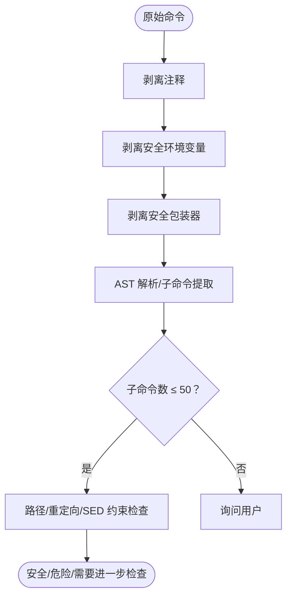
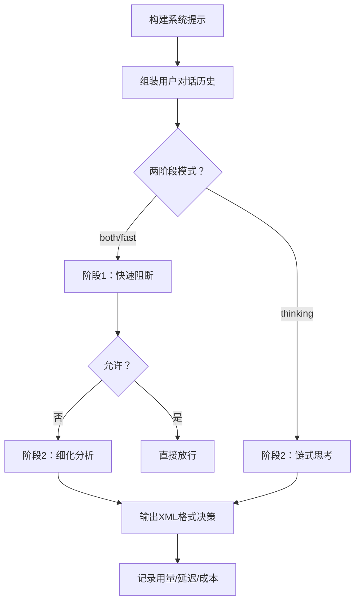
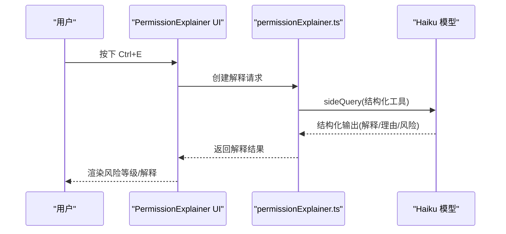
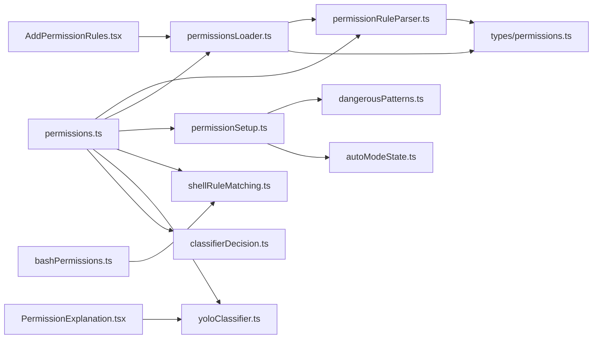

# 权限控制模型

<cite>
**本文档引用的文件**
- [permissionSetup.ts](file://src/utils/permissions/permissionSetup.ts)
- [shellRuleMatching.ts](file://src/utils/permissions/shellRuleMatching.ts)
- [permissions.ts](file://src/utils/permissions/permissions.ts)
- [dangerousPatterns.ts](file://src/utils/permissions/dangerousPatterns.ts)
- [permissionRuleParser.ts](file://src/utils/permissions/permissionRuleParser.ts)
- [permissionExplainer.ts](file://src/utils/permissions/permissionExplainer.ts)
- [interactiveHandler.ts](file://src/hooks/toolPermission/handlers/interactiveHandler.ts)
- [permissionsLoader.ts](file://src/utils/permissions/permissionsLoader.ts)
- [yoloClassifier.ts](file://src/utils/permissions/yoloClassifier.ts)
- [classifierDecision.ts](file://src/utils/permissions/classifierDecision.ts)
- [bashPermissions.ts](file://src/tools/BashTool/bashPermissions.ts)
- [autoModeState.ts](file://src/utils/permissions/autoModeState.ts)
- [permissions.ts](file://src/types/permissions.ts)
- [AddPermissionRules.tsx](file://src/components/permissions/rules/AddPermissionRules.tsx)
- [PermissionExplanation.tsx](file://src/components/permissions/PermissionExplanation.tsx)
</cite>

## 目录
1. [简介](#简介)
2. [项目结构](#项目结构)
3. [核心组件](#核心组件)
4. [架构总览](#架构总览)
5. [详细组件分析](#详细组件分析)
6. [依赖关系分析](#依赖关系分析)
7. [性能考虑](#性能考虑)
8. [故障排除指南](#故障排除指南)
9. [结论](#结论)
10. [附录](#附录)

## 简介
本文件系统性阐述 Claude Code Best 的权限控制模型，覆盖规则定义与解析、匹配算法与优先级、实时决策流程、缓存与性能优化、权限分类器（Bash 命令分类、危险模式识别、自动化决策）、权限解释器（决策可视化、违规检测、风险评估）以及规则编写指南与最佳实践。目标是帮助开发者在不牺牲安全性的前提下，构建可维护、可观测、高性能的权限系统。

## 项目结构
权限控制模块主要分布在以下路径：
- 核心逻辑：`src/utils/permissions/`
- 工具集成：`src/tools/BashTool/`（Bash 权限检查）
- 钩子与交互：`src/hooks/toolPermission/handlers/`
- 类型定义：`src/types/permissions.ts`
- UI 组件：`src/components/permissions/`

**图表来源**
- [permissionSetup.ts:1-800](file://src/utils/permissions/permissionSetup.ts#L1-L800)
- [permissions.ts:1-800](file://src/utils/permissions/permissions.ts#L1-L800)
- [shellRuleMatching.ts:1-229](file://src/utils/permissions/shellRuleMatching.ts#L1-L229)
- [permissionRuleParser.ts:1-199](file://src/utils/permissions/permissionRuleParser.ts#L1-L199)
- [dangerousPatterns.ts:1-81](file://src/utils/permissions/dangerousPatterns.ts#L1-L81)
- [permissionsLoader.ts:1-297](file://src/utils/permissions/permissionsLoader.ts#L1-L297)
- [yoloClassifier.ts:1-800](file://src/utils/permissions/yoloClassifier.ts#L1-L800)
- [classifierDecision.ts:1-99](file://src/utils/permissions/classifierDecision.ts#L1-L99)
- [autoModeState.ts:1-40](file://src/utils/permissions/autoModeState.ts#L1-L40)
- [bashPermissions.ts:1-800](file://src/tools/BashTool/bashPermissions.ts#L1-L800)
- [interactiveHandler.ts:1-537](file://src/hooks/toolPermission/handlers/interactiveHandler.ts#L1-L537)
- [AddPermissionRules.tsx:1-165](file://src/components/permissions/rules/AddPermissionRules.tsx#L1-L165)
- [PermissionExplanation.tsx:1-188](file://src/components/permissions/PermissionExplanation.tsx#L1-L188)
- [permissions.ts:1-442](file://src/types/permissions.ts#L1-L442)

**章节来源**
- [permissionSetup.ts:1-800](file://src/utils/permissions/permissionSetup.ts#L1-L800)
- [permissions.ts:1-800](file://src/utils/permissions/permissions.ts#L1-L800)
- [shellRuleMatching.ts:1-229](file://src/utils/permissions/shellRuleMatching.ts#L1-L229)
- [permissionRuleParser.ts:1-199](file://src/utils/permissions/permissionRuleParser.ts#L1-L199)
- [dangerousPatterns.ts:1-81](file://src/utils/permissions/dangerousPatterns.ts#L1-L81)
- [permissionsLoader.ts:1-297](file://src/utils/permissions/permissionsLoader.ts#L1-L297)
- [yoloClassifier.ts:1-800](file://src/utils/permissions/yoloClassifier.ts#L1-L800)
- [classifierDecision.ts:1-99](file://src/utils/permissions/classifierDecision.ts#L1-L99)
- [autoModeState.ts:1-40](file://src/utils/permissions/autoModeState.ts#L1-L40)
- [bashPermissions.ts:1-800](file://src/tools/BashTool/bashPermissions.ts#L1-L800)
- [interactiveHandler.ts:1-537](file://src/hooks/toolPermission/handlers/interactiveHandler.ts#L1-L537)
- [AddPermissionRules.tsx:1-165](file://src/components/permissions/rules/AddPermissionRules.tsx#L1-L165)
- [PermissionExplanation.tsx:1-188](file://src/components/permissions/PermissionExplanation.tsx#L1-L188)
- [permissions.ts:1-442](file://src/types/permissions.ts#L1-L442)

## 核心组件
- 权限规则引擎：负责规则解析、匹配、优先级判定与建议生成。
- 决策主流程：统一处理 allow/deny/ask/passthrough 等决策，并协调自动模式分类器。
- 危险规则检测：识别可能绕过分类器的高危规则（如 Bash(*)、PowerShell(*)、Agent(*)）。
- Bash 权限检查：对命令进行安全剥离、AST 解析、路径约束验证等。
- 自动模式分类器：基于对话历史与用户配置进行安全决策。
- 权限解释器：为用户提供风险等级、解释与理由，支持快捷键可视化。
- 规则加载与持久化：从多源设置加载规则，支持去重与编辑。

**章节来源**
- [permissions.ts:1-800](file://src/utils/permissions/permissions.ts#L1-L800)
- [permissionSetup.ts:1-800](file://src/utils/permissions/permissionSetup.ts#L1-L800)
- [bashPermissions.ts:1-800](file://src/tools/BashTool/bashPermissions.ts#L1-L800)
- [yoloClassifier.ts:1-800](file://src/utils/permissions/yoloClassifier.ts#L1-L800)
- [permissionExplainer.ts:1-251](file://src/utils/permissions/permissionExplainer.ts#L1-L251)
- [permissionsLoader.ts:1-297](file://src/utils/permissions/permissionsLoader.ts#L1-L297)

## 架构总览
权限控制采用“规则驱动 + 分类器辅助”的双层架构：
- 规则层：精确匹配 allow/deny/ask，支持通配符与前缀规则，优先级由来源与行为决定。
- 分类器层：在自动模式下对未命中规则的命令进行安全评估，支持快速路径（免分类白名单）与两阶段 XML 分类。

**图表来源**
- [permissions.ts:473-800](file://src/utils/permissions/permissions.ts#L473-L800)
- [permissionRuleParser.ts:93-152](file://src/utils/permissions/permissionRuleParser.ts#L93-L152)
- [shellRuleMatching.ts:159-184](file://src/utils/permissions/shellRuleMatching.ts#L159-L184)
- [bashPermissions.ts:778-800](file://src/tools/BashTool/bashPermissions.ts#L778-L800)
- [yoloClassifier.ts:711-800](file://src/utils/permissions/yoloClassifier.ts#L711-L800)
- [interactiveHandler.ts:57-537](file://src/hooks/toolPermission/handlers/interactiveHandler.ts#L57-L537)

## 详细组件分析

### 权限规则定义与解析
- 规则语法
  - 工具名：支持 MCP 服务器级规则（如 `mcp__server` 或 `mcp__server__*`）。
  - 内容：可为空（工具级规则）或带内容（精确/前缀/通配符）。
  - 转义：括号需转义存储，解析时还原。
- 解析与序列化
  - 将字符串解析为 `PermissionRuleValue`，并支持反向序列化。
  - 处理遗留工具名别名映射。
- 规则来源与优先级
  - 来源：用户设置、项目设置、本地设置、会话、CLI 参数等。
  - 行为：allow/deny/ask；同源同行为冲突时去重。

**图表来源**
- [permissionRuleParser.ts:93-152](file://src/utils/permissions/permissionRuleParser.ts#L93-L152)

**章节来源**
- [permissionRuleParser.ts:1-199](file://src/utils/permissions/permissionRuleParser.ts#L1-L199)
- [permissions.ts:109-121](file://src/utils/permissions/permissions.ts#L109-L121)

### 规则匹配算法与优先级
- 匹配类型
  - 精确匹配：完整命令字面量。
  - 前缀匹配：`tool(prefix:*)`，兼容旧版 `tool:*`。
  - 通配符匹配：`tool(pattern*)`，支持转义星号与反斜杠。
- 匹配流程
  - Bash：先剥离输出重定向，再尝试精确与前缀匹配；对于复合命令限制子命令数量以避免性能问题。
  - 通用：按来源与行为优先级合并规则，去重后执行匹配。
- 建议生成
  - 对于精确命令：优先提取稳定前缀（含 heredoc 前缀、首行等），否则退回精确建议。
  - 对于前缀：直接生成 `tool(prefix:*)` 建议。

**图表来源**
- [bashPermissions.ts:778-800](file://src/tools/BashTool/bashPermissions.ts#L778-L800)
- [shellRuleMatching.ts:90-154](file://src/utils/permissions/shellRuleMatching.ts#L90-L154)

**章节来源**
- [shellRuleMatching.ts:1-229](file://src/utils/permissions/shellRuleMatching.ts#L1-L229)
- [bashPermissions.ts:1-800](file://src/tools/BashTool/bashPermissions.ts#L1-L800)

### 危险规则检测与自动模式切换
- 危险规则识别
  - Bash：工具级允许、解释器前缀（如 `python:*`）、通配符解释器、危险参数模式等。
  - PowerShell：工具级允许、嵌套壳/脚本执行器、进程启动器等。
  - Agent：任何允许规则都会绕过子代理评估。
- 自动模式切换
  - 进入自动模式时移除危险规则并记录回退；退出时恢复。
  - 支持门控检查（GrowthBook/设置）与电路断路保护。

**图表来源**
- [permissionSetup.ts:84-147](file://src/utils/permissions/permissionSetup.ts#L84-L147)
- [permissionSetup.ts:505-580](file://src/utils/permissions/permissionSetup.ts#L505-L580)

**章节来源**
- [permissionSetup.ts:1-800](file://src/utils/permissions/permissionSetup.ts#L1-L800)
- [dangerousPatterns.ts:1-81](file://src/utils/permissions/dangerousPatterns.ts#L1-L81)

### 决策流程与实时评估
- 决策类型
  - allow：直接放行，可携带更新后的输入与元数据。
  - ask：触发交互式确认，支持远程桥接与通道转发。
  - deny：直接拒绝，附带原因与反馈。
  - passthrough：旁路处理，可能伴随异步分类器检查。
- 自动模式加速
  - 免分类白名单：对只读/低风险工具跳过分类器。
  - 接受编辑快速路径：在工作目录内允许某些编辑操作。
  - 分类器两阶段：快速阻断 + 思考阶段细化。
- 交互式流程
  - 并发运行钩子、分类器与用户交互，首个有效结果获胜。
  - 支持远程桥接（Web/Claude.ai）与多通道转发。

**图表来源**
- [permissions.ts:473-800](file://src/utils/permissions/permissions.ts#L473-L800)
- [interactiveHandler.ts:57-537](file://src/hooks/toolPermission/handlers/interactiveHandler.ts#L57-L537)

**章节来源**
- [permissions.ts:1-800](file://src/utils/permissions/permissions.ts#L1-L800)
- [classifierDecision.ts:1-99](file://src/utils/permissions/classifierDecision.ts#L1-L99)
- [interactiveHandler.ts:1-537](file://src/hooks/toolPermission/handlers/interactiveHandler.ts#L1-L537)

### Bash 命令分类与危险模式识别
- 安全剥离
  - 剥离注释、安全环境变量（如 `NODE_ENV`）、包装器（`timeout/time/nice/nohup`）。
  - 对 `DOCKER_HOST/KUBECONFIG` 等内部变量在特定环境下允许剥离用于便利。
- AST 与语义检查
  - 使用树句法解析命令，提取简单命令与重定向，限制最大子命令数防止性能问题。
- 路径与 sed 约束
  - 检查输出重定向目标与 sed 操作的安全性。
- 危险模式
  - 解释器前缀、危险参数（如 `-c`）、特权提升（`sudo/doas/pkexec`）等。

**图表来源**
- [bashPermissions.ts:524-776](file://src/tools/BashTool/bashPermissions.ts#L524-L776)
- [bashPermissions.ts:778-800](file://src/tools/BashTool/bashPermissions.ts#L778-L800)

**章节来源**
- [bashPermissions.ts:1-800](file://src/tools/BashTool/bashPermissions.ts#L1-L800)

### 自动模式分类器（YOLO）
- 快速路径
  - 免分类白名单：只读/低风险工具直接放行。
  - 接受编辑快速路径：工作目录内的编辑操作。
- 分类器提示
  - 支持外部模板与内部模板，用户可自定义允许/拒绝/环境规则。
  - XML 输出格式：两阶段（fast/thinking）分类，首阶段快速阻断，次阶段链式思考降低误判。
- 错误诊断与转储
  - API 错误时转储请求/响应与上下文对比，便于分析与共享。
- 成本与统计
  - 记录令牌用量、延迟、阶段信息，用于成本分析与性能优化。

**图表来源**
- [yoloClassifier.ts:484-540](file://src/utils/permissions/yoloClassifier.ts#L484-L540)
- [yoloClassifier.ts:711-800](file://src/utils/permissions/yoloClassifier.ts#L711-L800)

**章节来源**
- [yoloClassifier.ts:1-800](file://src/utils/permissions/yoloClassifier.ts#L1-L800)
- [classifierDecision.ts:1-99](file://src/utils/permissions/classifierDecision.ts#L1-L99)

### 权限解释器（决策可视化与风险评估）
- 功能
  - 基于 Haiku 模型生成命令解释、动机与风险等级。
  - 支持快捷键（Ctrl+E）懒加载与显示。
- 结构化输出
  - 风险等级（低/中/高）、解释、理由与风险摘要。
- 可观测性
  - 记录生成耗时、错误类型与风险等级分布，便于分析。

**图表来源**
- [PermissionExplanation.tsx:1-188](file://src/components/permissions/PermissionExplanation.tsx#L1-L188)
- [permissionExplainer.ts:147-251](file://src/utils/permissions/permissionExplainer.ts#L147-L251)

**章节来源**
- [PermissionExplanation.tsx:1-188](file://src/components/permissions/PermissionExplanation.tsx#L1-L188)
- [permissionExplainer.ts:1-251](file://src/utils/permissions/permissionExplainer.ts#L1-L251)

### 规则编写指南与测试调试
- 规则模板
  - 工具级：`Bash`、`PowerShell`、`Agent` 等。
  - 前缀规则：`Bash(git:*)`、`Bash(python3:*)`。
  - 通配符规则：`Bash(python3 -m pip:* )`（注意转义括号）。
  - MCP 规则：`mcp__server`（服务器级）、`mcp__server__*`（通配）、`mcp__server__tool`（具体工具）。
- 测试方法
  - 使用 UI 添加规则并观察不可达规则检测（AddPermissionRules.tsx）。
  - 利用权限解释器查看风险与理由，辅助判断规则有效性。
  - 在自动模式下通过分类器日志与转储定位问题。
- 调试技巧
  - 启用分类器错误转储（ANT 专用）与上下文对比。
  - 使用快捷键触发解释器，结合对话历史理解决策依据。
  - 检查规则来源与优先级，避免被更高优先级规则覆盖。

**章节来源**
- [AddPermissionRules.tsx:1-165](file://src/components/permissions/rules/AddPermissionRules.tsx#L1-L165)
- [PermissionExplanation.tsx:1-188](file://src/components/permissions/PermissionExplanation.tsx#L1-L188)
- [yoloClassifier.ts:153-250](file://src/utils/permissions/yoloClassifier.ts#L153-L250)

## 依赖关系分析

**图表来源**
- [permissionRuleParser.ts:1-199](file://src/utils/permissions/permissionRuleParser.ts#L1-L199)
- [permissionsLoader.ts:1-297](file://src/utils/permissions/permissionsLoader.ts#L1-L297)
- [permissionSetup.ts:1-800](file://src/utils/permissions/permissionSetup.ts#L1-L800)
- [dangerousPatterns.ts:1-81](file://src/utils/permissions/dangerousPatterns.ts#L1-L81)
- [autoModeState.ts:1-40](file://src/utils/permissions/autoModeState.ts#L1-L40)
- [permissions.ts:1-800](file://src/utils/permissions/permissions.ts#L1-L800)
- [shellRuleMatching.ts:1-229](file://src/utils/permissions/shellRuleMatching.ts#L1-L229)
- [yoloClassifier.ts:1-800](file://src/utils/permissions/yoloClassifier.ts#L1-L800)
- [classifierDecision.ts:1-99](file://src/utils/permissions/classifierDecision.ts#L1-L99)
- [bashPermissions.ts:1-800](file://src/tools/BashTool/bashPermissions.ts#L1-L800)
- [AddPermissionRules.tsx:1-165](file://src/components/permissions/rules/AddPermissionRules.tsx#L1-L165)
- [PermissionExplanation.tsx:1-188](file://src/components/permissions/PermissionExplanation.tsx#L1-L188)
- [permissions.ts:1-442](file://src/types/permissions.ts#L1-L442)

**章节来源**
- [permissions.ts:1-800](file://src/utils/permissions/permissions.ts#L1-L800)
- [permissionSetup.ts:1-800](file://src/utils/permissions/permissionSetup.ts#L1-L800)

## 性能考虑
- 规则匹配
  - 限制复合命令子命令数量（默认 50），避免 ReDoS 与事件循环饥饿。
  - 通配符匹配预编译正则占位符，减少重复编译开销。
- 自动模式
  - 免分类白名单显著减少 API 调用；两阶段分类器在允许时提前终止。
  - 分类器提示缓存（1小时 TTL）与输出格式优化降低令牌浪费。
- I/O 与持久化
  - 设置文件读写采用安全解析与去重策略，避免 schema 验证失败导致规则丢失。
- 可观测性
  - 记录令牌用量、延迟、阶段信息与错误类型，便于性能分析与成本控制。

[本节为通用指导，无需列出具体文件来源]

## 故障排除指南
- 规则无效或被忽略
  - 检查规则来源与优先级，确认未被更高优先级规则覆盖。
  - 使用“不可达规则”检测功能（AddPermissionRules.tsx）定位冲突规则。
- 自动模式分类器异常
  - 查看分类器错误转储路径（ANT 专用），核对提示词与上下文长度。
  - 关注“提示过长”错误，适当精简历史或分段发送。
- 交互确认未出现
  - 确认未被钩子或远程桥接抢先决策；检查并发竞争条件。
  - 检查终端焦点与检查标记消失时间（交互处理器中设置）。
- 权限解释器不可用
  - 确认功能开关与快捷键绑定；查看懒加载错误日志。

**章节来源**
- [AddPermissionRules.tsx:105-125](file://src/components/permissions/rules/AddPermissionRules.tsx#L105-L125)
- [yoloClassifier.ts:213-250](file://src/utils/permissions/yoloClassifier.ts#L213-L250)
- [interactiveHandler.ts:440-530](file://src/hooks/toolPermission/handlers/interactiveHandler.ts#L440-L530)
- [PermissionExplanation.tsx:81-91](file://src/components/permissions/PermissionExplanation.tsx#L81-L91)

## 结论
该权限控制模型通过“规则 + 分类器”的双层设计，在保证安全性的同时兼顾了灵活性与性能。规则系统支持精确、前缀与通配符匹配，并提供危险规则检测与自动模式下的安全回退；分类器在自动模式下提供快速与精细的决策能力；解释器与交互流程增强了可观测性与用户体验。遵循本文的最佳实践与调试技巧，可帮助团队构建稳健且易于维护的权限体系。

[本节为总结性内容，无需列出具体文件来源]

## 附录
- 最佳实践
  - 优先使用前缀规则替代通配符规则，减少误匹配风险。
  - 在自动模式下谨慎授予工具级允许规则，必要时配合分类器与解释器。
  - 定期审查不可达规则，保持规则集简洁有效。
- 常见陷阱
  - 过度依赖通配符导致宽泛放行。
  - 忽视环境变量与包装器剥离，造成规则绕过。
  - 在自动模式下误信“快速路径”，忽略潜在危险场景。

[本节为通用指导，无需列出具体文件来源]