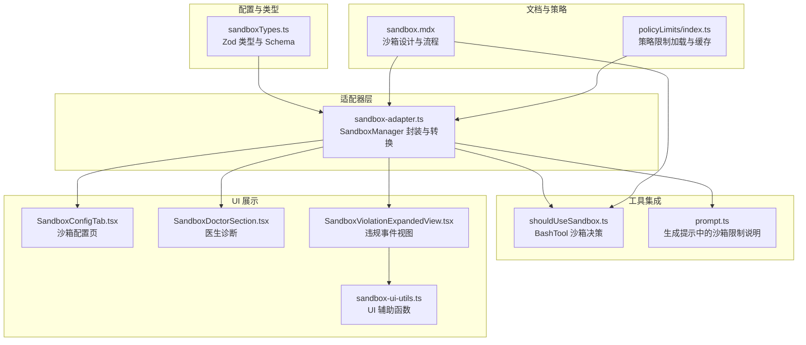
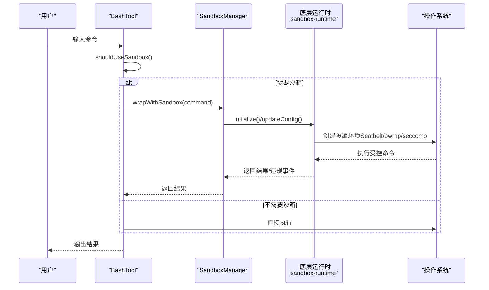
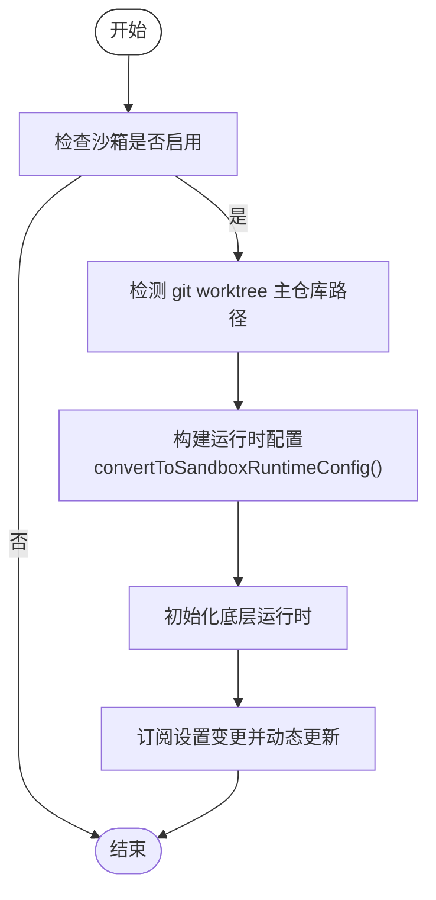
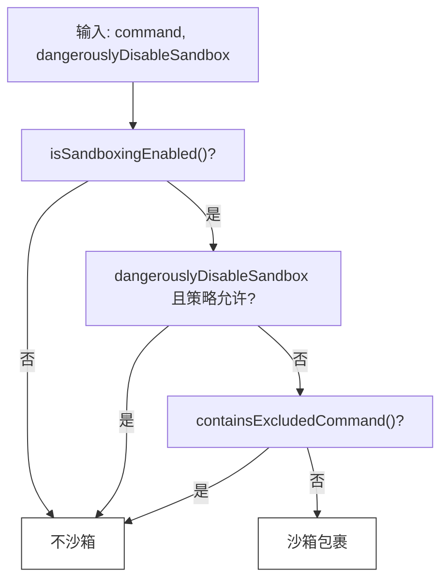
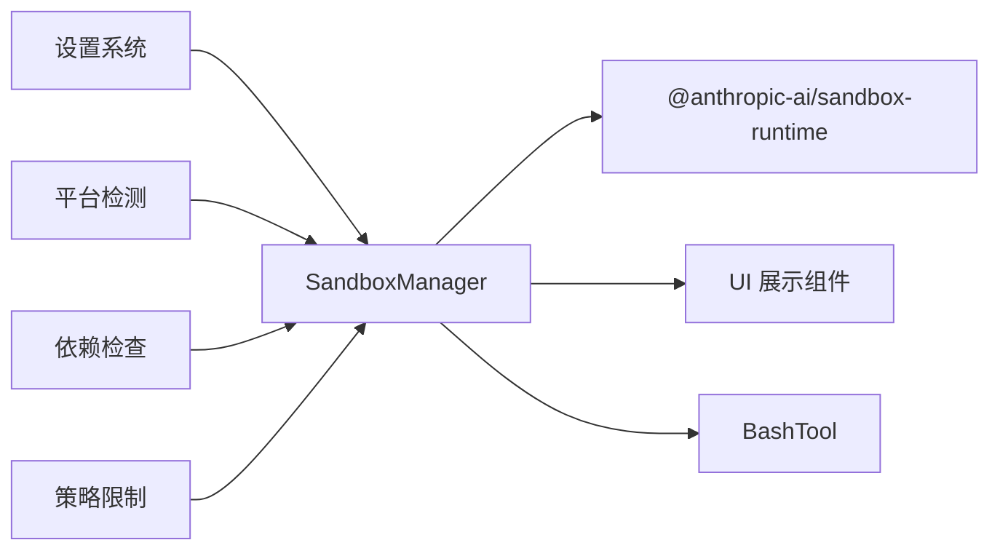

# 沙箱机制

<cite>
**本文引用的文件**
- [sandbox-adapter.ts](file://src/utils/sandbox/sandbox-adapter.ts)
- [sandboxTypes.ts](file://src/entrypoints/sandboxTypes.ts)
- [SandboxConfigTab.tsx](file://src/components/sandbox/SandboxConfigTab.tsx)
- [SandboxDoctorSection.tsx](file://src/components/sandbox/SandboxDoctorSection.tsx)
- [SandboxViolationExpandedView.tsx](file://src/components/SandboxViolationExpandedView.tsx)
- [sandbox-ui-utils.ts](file://src/utils/sandbox/sandbox-ui-utils.ts)
- [sandbox.mdx](file://docs/safety/sandbox.mdx)
- [shouldUseSandbox.ts](file://src/tools/BashTool/shouldUseSandbox.ts)
- [prompt.ts](file://src/tools/BashTool/prompt.ts)
- [fsOperations.ts](file://src/utils/fsOperations.ts)
- [index.ts](file://src/services/policyLimits/index.ts)
</cite>

## 目录
1. [简介](#简介)
2. [项目结构](#项目结构)
3. [核心组件](#核心组件)
4. [架构总览](#架构总览)
5. [详细组件分析](#详细组件分析)
6. [依赖关系分析](#依赖关系分析)
7. [性能考量](#性能考量)
8. [故障排除指南](#故障排除指南)
9. [结论](#结论)
10. [附录](#附录)

## 简介
本文件系统性阐述 Claude Code Best 的沙箱机制，涵盖进程隔离、资源限制与安全边界设置；沙箱适配器的跨平台抽象与实现；安全策略（文件系统访问控制、网络请求限制、系统调用拦截）；监控与审计（违规事件存储与展示）；配置指南（安全级别、白名单、服务配置）；以及性能优化与故障排除建议。目标是帮助开发者在确保安全的前提下，正确使用并优化沙箱能力。

## 项目结构
沙箱相关代码主要分布在以下模块：
- 配置类型与验证：入口类型定义与 Zod Schema
- 适配器层：桥接外部 sandbox-runtime，整合设置、权限与平台差异
- 工具集成：BashTool 的沙箱决策与提示信息生成
- UI 展示：沙箱配置页、医生诊断、违规事件视图
- 文档：沙箱设计与使用说明
- 审计与策略：违规事件存储、策略限制加载

图表来源
- [sandboxTypes.ts:1-157](file://src/entrypoints/sandboxTypes.ts#L1-L157)
- [sandbox-adapter.ts:1-986](file://src/utils/sandbox/sandbox-adapter.ts#L1-L986)
- [shouldUseSandbox.ts:1-154](file://src/tools/BashTool/shouldUseSandbox.ts#L1-L154)
- [prompt.ts:185-226](file://src/tools/BashTool/prompt.ts#L185-L226)
- [SandboxConfigTab.tsx:1-136](file://src/components/sandbox/SandboxConfigTab.tsx#L1-L136)
- [SandboxDoctorSection.tsx:1-48](file://src/components/sandbox/SandboxDoctorSection.tsx#L1-L48)
- [SandboxViolationExpandedView.tsx:1-68](file://src/components/SandboxViolationExpandedView.tsx#L1-L68)
- [sandbox-ui-utils.ts:1-13](file://src/utils/sandbox/sandbox-ui-utils.ts#L1-L13)
- [sandbox.mdx:1-216](file://docs/safety/sandbox.mdx#L1-L216)
- [index.ts:556-663](file://src/services/policyLimits/index.ts#L556-L663)

章节来源
- [sandboxTypes.ts:1-157](file://src/entrypoints/sandboxTypes.ts#L1-L157)
- [sandbox-adapter.ts:1-986](file://src/utils/sandbox/sandbox-adapter.ts#L1-L986)
- [sandbox.mdx:1-216](file://docs/safety/sandbox.mdx#L1-L216)

## 核心组件
- 沙箱适配器（SandboxManager）
  - 负责将用户设置与权限规则转换为运行时配置，封装底层 sandbox-runtime，并提供平台差异处理、依赖检查、配置刷新、违规事件存储等能力。
- BashTool 沙箱决策
  - 基于全局开关、显式禁用标记、排除列表与命令解析，决定是否对命令进行沙箱包裹。
- UI 展示组件
  - 沙箱配置页、医生诊断、违规事件视图，用于呈现当前沙箱状态、依赖与违规历史。
- 配置类型与策略
  - 通过 Zod Schema 定义沙箱配置模型，结合策略限制加载与缓存，保障企业级部署的安全与一致性。

章节来源
- [sandbox-adapter.ts:172-381](file://src/utils/sandbox/sandbox-adapter.ts#L172-L381)
- [shouldUseSandbox.ts:130-154](file://src/tools/BashTool/shouldUseSandbox.ts#L130-L154)
- [SandboxConfigTab.tsx:1-136](file://src/components/sandbox/SandboxConfigTab.tsx#L1-L136)
- [SandboxDoctorSection.tsx:1-48](file://src/components/sandbox/SandboxDoctorSection.tsx#L1-L48)
- [SandboxViolationExpandedView.tsx:1-68](file://src/components/SandboxViolationExpandedView.tsx#L1-L68)
- [sandboxTypes.ts:91-144](file://src/entrypoints/sandboxTypes.ts#L91-L144)
- [index.ts:556-663](file://src/services/policyLimits/index.ts#L556-L663)

## 架构总览
沙箱执行链路自上而下分为三层：
- 应用层（工具与权限）：决定“是否需要沙箱”
- 适配器层（设置与平台）：决定“如何沙箱化”
- OS 层（底层运行时）：决定“沙箱如何强制约束”

图表来源
- [sandbox.mdx:15-55](file://docs/safety/sandbox.mdx#L15-L55)
- [shouldUseSandbox.ts:130-154](file://src/tools/BashTool/shouldUseSandbox.ts#L130-L154)
- [sandbox-adapter.ts:704-792](file://src/utils/sandbox/sandbox-adapter.ts#L704-L792)

## 详细组件分析

### 沙箱适配器（SandboxManager）
- 职责
  - 设置转换：将权限规则与用户设置映射为运行时配置（网络、文件系统、忽略违规、代理端口等）
  - 平台抽象：统一 macOS（Seatbelt）、Linux（bwrap+seccomp）、WSL 的差异
  - 生命周期：初始化、配置刷新、清理（含裸仓库防护）
  - 审计：违规事件存储与标注
- 关键实现要点
  - convertToSandboxRuntimeConfig：从权限规则与设置中提取网络/文件系统规则，并加入安全加固（如 settings.json 与 .claude/skills 的写入保护、裸仓库防护）
  - initialize/refreshConfig：订阅设置变更，动态更新运行时配置
  - cleanupAfterCommand：清理 bwrap 残留与裸仓库文件
  - 依赖检查与平台支持：memoized 缓存，避免重复开销

图表来源
- [sandbox-adapter.ts:730-792](file://src/utils/sandbox/sandbox-adapter.ts#L730-L792)
- [sandbox-adapter.ts:172-381](file://src/utils/sandbox/sandbox-adapter.ts#L172-L381)

章节来源
- [sandbox-adapter.ts:172-381](file://src/utils/sandbox/sandbox-adapter.ts#L172-L381)
- [sandbox-adapter.ts:730-792](file://src/utils/sandbox/sandbox-adapter.ts#L730-L792)
- [sandbox-adapter.ts:945-985](file://src/utils/sandbox/sandbox-adapter.ts#L945-L985)

### BashTool 沙箱决策
- 决策流程
  - 全局开关：isSandboxingEnabled
  - 显式禁用：dangerouslyDisableSandbox 且策略允许
  - 命令排除：excludedCommands（支持精确匹配、前缀匹配、通配符）
  - 默认：其余命令均需沙箱
- 复合命令与包装处理
  - 对复合命令拆分，剥离环境变量与安全包装，直至不动点，确保排除规则有效

图表来源
- [shouldUseSandbox.ts:130-154](file://src/tools/BashTool/shouldUseSandbox.ts#L130-L154)

章节来源
- [shouldUseSandbox.ts:1-154](file://src/tools/BashTool/shouldUseSandbox.ts#L1-L154)

### 配置模型与类型
- 网络配置
  - allowedDomains/deniedDomains：域名白名单/黑名单
  - allowManagedDomainsOnly：仅使用托管策略中的域名
  - allowLocalBinding、httpProxyPort、socksProxyPort：本地绑定与代理端口
- 文件系统配置
  - allowWrite/denyWrite/denyRead/allowRead：路径粒度的读写控制
  - allowManagedReadPathsOnly：仅使用托管策略中的读取路径
- 其他
  - enabled/failIfUnavailable/autoAllowBashIfSandboxed/allowUnsandboxedCommands/excludedCommands/ignoreViolations/enableWeakerNestedSandbox/enableWeakerNetworkIsolation/ripgrep

章节来源
- [sandboxTypes.ts:11-144](file://src/entrypoints/sandboxTypes.ts#L11-L144)

### UI 展示与审计
- 沙箱配置页
  - 展示文件系统读写限制、网络限制、Unix Socket 允许列表、排除命令、Linux glob 警告等
- 医生诊断
  - 展示依赖错误/警告，指导安装
- 违规事件视图
  - 订阅 SandboxViolationStore，展示最近违规与总数
- UI 工具
  - 移除 <sandbox_violations> 标签，美化输出

章节来源
- [SandboxConfigTab.tsx:1-136](file://src/components/sandbox/SandboxConfigTab.tsx#L1-L136)
- [SandboxDoctorSection.tsx:1-48](file://src/components/sandbox/SandboxDoctorSection.tsx#L1-L48)
- [SandboxViolationExpandedView.tsx:1-68](file://src/components/SandboxViolationExpandedView.tsx#L1-L68)
- [sandbox-ui-utils.ts:1-13](file://src/utils/sandbox/sandbox-ui-utils.ts#L1-L13)

### 安全策略与平台差异
- 平台支持矩阵
  - macOS：sandbox-exec（Seatbelt），支持完整 glob 与 Unix socket 路径放行
  - Linux/WSL：bubblewrap + seccomp，不支持 glob、Unix socket 按路径过滤受限
- 策略限制
  - 通过策略限制加载与缓存，支持后台轮询与失败开路（fails-open）

章节来源
- [sandbox.mdx:100-141](file://docs/safety/sandbox.mdx#L100-L141)
- [index.ts:556-663](file://src/services/policyLimits/index.ts#L556-L663)

## 依赖关系分析
- 适配器依赖
  - settings 系统：合并多源设置，动态刷新
  - 平台检测：getPlatform、enabledPlatforms 限制
  - 依赖检查：memoized checkDependencies
- 工具依赖
  - BashTool 依赖 SandboxManager 的决策与 wrapWithSandbox
- UI 依赖
  - SandboxManager 提供配置与违规事件查询接口
- 文档与策略
  - 文档定义流程与边界；策略限制提供企业级约束

图表来源
- [sandbox-adapter.ts:451-457](file://src/utils/sandbox/sandbox-adapter.ts#L451-L457)
- [sandbox-adapter.ts:505-526](file://src/utils/sandbox/sandbox-adapter.ts#L505-L526)
- [shouldUseSandbox.ts:1-154](file://src/tools/BashTool/shouldUseSandbox.ts#L1-L154)
- [SandboxConfigTab.tsx:1-136](file://src/components/sandbox/SandboxConfigTab.tsx#L1-L136)
- [index.ts:556-663](file://src/services/policyLimits/index.ts#L556-L663)

章节来源
- [sandbox-adapter.ts:447-526](file://src/utils/sandbox/sandbox-adapter.ts#L447-L526)
- [shouldUseSandbox.ts:1-154](file://src/tools/BashTool/shouldUseSandbox.ts#L1-L154)
- [SandboxConfigTab.tsx:1-136](file://src/components/sandbox/SandboxConfigTab.tsx#L1-L136)
- [index.ts:556-663](file://src/services/policyLimits/index.ts#L556-L663)

## 性能考量
- 初始化与缓存
  - 依赖检查与平台支持采用 memoized 缓存，避免重复计算
  - 初始化 Promise 防止竞态，减少重复初始化
- 配置刷新
  - 订阅设置变更，同步更新运行时配置，避免频繁重启
- Linux 特性
  - bwrap 在执行后可能产生残留文件，cleanupAfterCommand 负责清理
  - glob 模式在 Linux/WSL 不完整，建议使用 /** 或明确路径，减少规则数量
- 网络代理
  - 合理配置 httpProxyPort/socksProxyPort，避免不必要的 MITM 开销

章节来源
- [sandbox-adapter.ts:447-457](file://src/utils/sandbox/sandbox-adapter.ts#L447-L457)
- [sandbox-adapter.ts:730-792](file://src/utils/sandbox/sandbox-adapter.ts#L730-L792)
- [sandbox.mdx:117-132](file://docs/safety/sandbox.mdx#L117-L132)

## 故障排除指南
- 依赖缺失
  - macOS：检查 sandbox-exec 与 ripgrep
  - Linux/WSL：安装 bubblewrap、socat、libseccomp、ripgrep
  - 使用 /sandbox 或 /doctor 查看具体缺失项与安装建议
- 平台不支持
  - WSL1 不支持；WSL2 支持
  - enabledPlatforms 可限制仅在指定平台启用沙箱
- 规则不生效
  - Linux/WSL 上 glob 模式仅支持 /** 后缀；其他 glob 会被忽略并触发警告
  - 使用 allowManagedReadPathsOnly/allowManagedDomainsOnly 控制托管策略优先级
- 违规事件
  - 通过 SandboxViolationExpandedView 查看最近违规与总数
  - UI 层使用 removeSandboxViolationTags 清理标签，便于阅读
- 策略限制
  - 若策略限制导致行为异常，检查策略限制加载与缓存，必要时刷新

章节来源
- [SandboxDoctorSection.tsx:1-48](file://src/components/sandbox/SandboxDoctorSection.tsx#L1-L48)
- [sandbox.mdx:133-141](file://docs/safety/sandbox.mdx#L133-L141)
- [SandboxViolationExpandedView.tsx:1-68](file://src/components/SandboxViolationExpandedView.tsx#L1-L68)
- [sandbox-ui-utils.ts:1-13](file://src/utils/sandbox/sandbox-ui-utils.ts#L1-L13)
- [index.ts:556-663](file://src/services/policyLimits/index.ts#L556-L663)

## 结论
Claude Code Best 的沙箱机制通过“应用层权限 + OS 层沙箱”的双层防御，确保即使命令通过权限审批，仍无法突破系统调用与文件/网络边界。适配器层统一了多平台差异，结合动态配置与审计能力，既保证安全性，也兼顾可观测性与可维护性。企业可通过策略限制与托管白名单进一步收紧边界；开发者可通过合理配置与性能优化，在安全前提下提升执行效率。

## 附录

### 沙箱配置指南（摘要）
- 全局开关与策略
  - enabled：启用沙箱
  - failIfUnavailable：依赖缺失时直接退出
  - enabledPlatforms：限制在特定平台启用
- BashTool 行为
  - autoAllowBashIfSandboxed：沙箱内命令自动允许
  - allowUnsandboxedCommands：是否允许 dangerouslyDisableSandbox
  - excludedCommands：不走沙箱的命令模式（精确/前缀/通配符）
- 网络
  - allowedDomains/deniedDomains：域名白名单/黑名单
  - allowManagedDomainsOnly：仅使用托管策略域名
  - allowLocalBinding、httpProxyPort、socksProxyPort
- 文件系统
  - allowWrite/denyWrite/denyRead/allowRead：路径粒度控制
  - allowManagedReadPathsOnly：仅使用托管策略读取路径
- 其他
  - ignoreViolations：忽略特定违规
  - enableWeakerNestedSandbox/enableWeakerNetworkIsolation：降低安全强度（谨慎使用）
  - ripgrep：自定义 ripgrep 命令与参数

章节来源
- [sandboxTypes.ts:91-144](file://src/entrypoints/sandboxTypes.ts#L91-L144)
- [sandbox.mdx:67-98](file://docs/safety/sandbox.mdx#L67-L98)