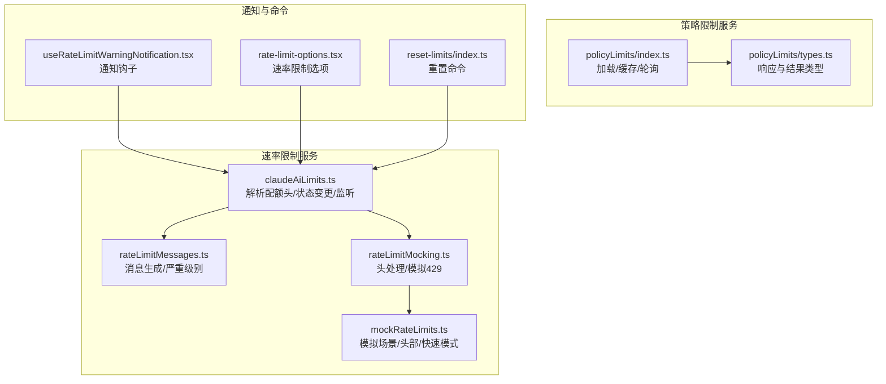
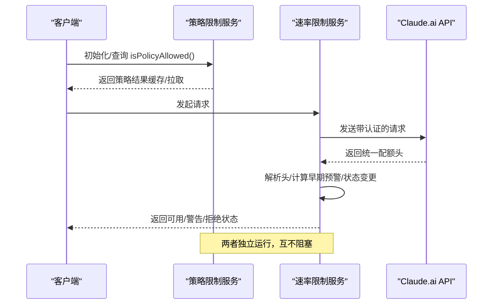
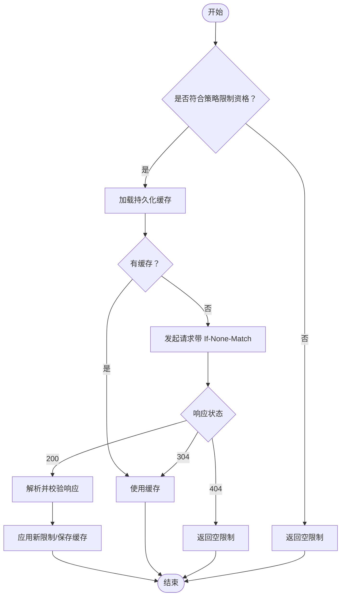
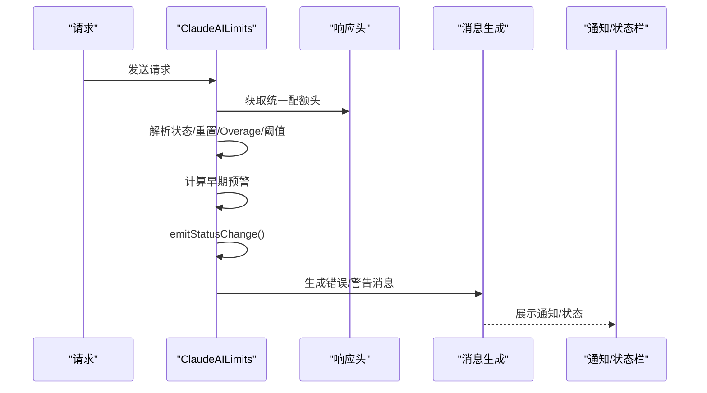
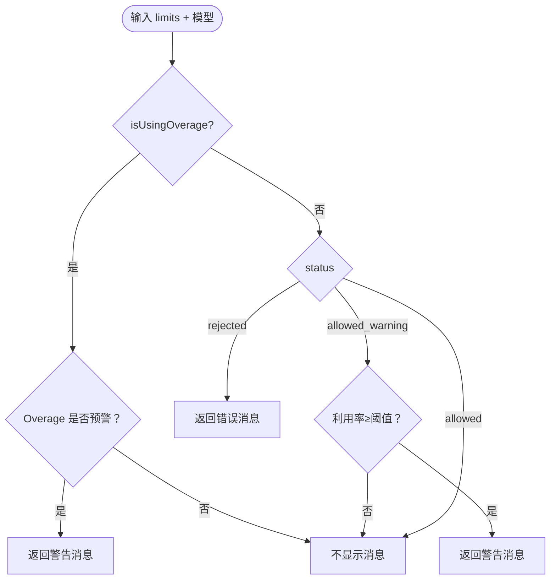
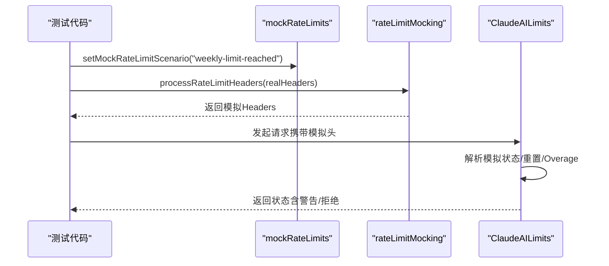
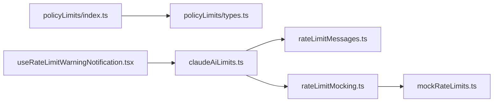

# 策略限制系统

<cite>
**本文档引用的文件**
- [src/services/policyLimits/index.ts](file://src/services/policyLimits/index.ts)
- [src/services/policyLimits/types.ts](file://src/services/policyLimits/types.ts)
- [src/services/claudeAiLimits.ts](file://src/services/claudeAiLimits.ts)
- [src/services/rateLimitMessages.ts](file://src/services/rateLimitMessages.ts)
- [src/services/rateLimitMocking.ts](file://src/services/rateLimitMocking.ts)
- [src/services/mockRateLimits.ts](file://src/services/mockRateLimits.ts)
- [src/hooks/notifs/useRateLimitWarningNotification.tsx](file://src/hooks/notifs/useRateLimitWarningNotification.tsx)
- [src/commands/rate-limit-options/rate-limit-options.tsx](file://src/commands/rate-limit-options/rate-limit-options.tsx)
- [src/commands/reset-limits/index.ts](file://src/commands/reset-limits/index.ts)
</cite>

## 目录
1. [简介](#简介)
2. [项目结构](#项目结构)
3. [核心组件](#核心组件)
4. [架构总览](#架构总览)
5. [详细组件分析](#详细组件分析)
6. [依赖关系分析](#依赖关系分析)
7. [性能考虑](#性能考虑)
8. [故障排查指南](#故障排查指南)
9. [结论](#结论)
10. [附录](#附录)

## 简介
本文件为 Claude Code Best 的策略限制系统提供全面技术文档，涵盖以下方面：
- 架构设计：组织级策略限制（Policy Limits）与 Claude.ai 使用配额限制（Rate Limits）两大体系
- 限制类型：策略限制（功能禁用/允许）、速率限制（会话/周/模型专项）、资源使用限制（通过配额头与降级逻辑体现）
- 执行机制：请求前检查、响应头解析、早期预警、降级与过载（Overage）处理
- 状态管理：会话内缓存、持久化缓存、全局状态监听与通知
- 触发响应：警告通知、操作阻断、降级处理（如 Opus → Sonnet 回退）
- 配置与管理：阈值设置、动态调整、监控告警、重置命令
- 性能影响与优化：缓存策略、失败开路、轮询频率与重试退避

## 项目结构
策略限制系统主要由以下模块构成：
- 组织级策略限制服务：从后端拉取并缓存策略，按需失效与刷新
- Claude.ai 速率限制服务：解析统一配额头，计算早期预警与降级
- 消息与通知：生成用户可读的错误/警告消息，并驱动 UI 通知
- 模拟与测试：支持内部模拟限额场景，便于 UI 与流程验证
- 命令行工具：提供速率限制选项与重置命令

**图表来源**
- [src/services/policyLimits/index.ts:1-664](file://src/services/policyLimits/index.ts#L1-L664)
- [src/services/policyLimits/types.ts:1-28](file://src/services/policyLimits/types.ts#L1-L28)
- [src/services/claudeAiLimits.ts:1-516](file://src/services/claudeAiLimits.ts#L1-L516)
- [src/services/rateLimitMessages.ts:1-345](file://src/services/rateLimitMessages.ts#L1-L345)
- [src/services/rateLimitMocking.ts:1-145](file://src/services/rateLimitMocking.ts#L1-L145)
- [src/services/mockRateLimits.ts:1-800](file://src/services/mockRateLimits.ts#L1-L800)
- [src/hooks/notifs/useRateLimitWarningNotification.tsx:33-80](file://src/hooks/notifs/useRateLimitWarningNotification.tsx#L33-L80)
- [src/commands/rate-limit-options/rate-limit-options.tsx](file://src/commands/rate-limit-options/rate-limit-options.tsx)
- [src/commands/reset-limits/index.ts:1-4](file://src/commands/reset-limits/index.ts#L1-L4)

**章节来源**
- [src/services/policyLimits/index.ts:1-664](file://src/services/policyLimits/index.ts#L1-L664)
- [src/services/policyLimits/types.ts:1-28](file://src/services/policyLimits/types.ts#L1-L28)
- [src/services/claudeAiLimits.ts:1-516](file://src/services/claudeAiLimits.ts#L1-L516)
- [src/services/rateLimitMessages.ts:1-345](file://src/services/rateLimitMessages.ts#L1-L345)
- [src/services/rateLimitMocking.ts:1-145](file://src/services/rateLimitMocking.ts#L1-L145)
- [src/services/mockRateLimits.ts:1-800](file://src/services/mockRateLimits.ts#L1-L800)
- [src/hooks/notifs/useRateLimitWarningNotification.tsx:33-80](file://src/hooks/notifs/useRateLimitWarningNotification.tsx#L33-L80)
- [src/commands/rate-limit-options/rate-limit-options.tsx](file://src/commands/rate-limit-options/rate-limit-options.tsx)
- [src/commands/reset-limits/index.ts:1-4](file://src/commands/reset-limits/index.ts#L1-L4)

## 核心组件
- 组织级策略限制服务（Policy Limits）
  - 负责获取组织级策略限制并缓存，支持会话内与持久化缓存，失败开路，后台轮询更新
  - 提供 isPolicyAllowed() 查询接口，未知策略默认允许（Fail Open），特定“关键流量”策略在缓缺时可选择失败闭合
- Claude.ai 速率限制服务（ClaudeAILimits）
  - 解析统一配额响应头，计算早期预警（基于阈值头或时间相对阈值），区分会话/周/模型专项限制
  - 支持 Overage（额外用量）状态与原因，以及回退到更低成本模型（如从 Opus 回退到 Sonnet）
  - 提供状态变更监听器与原始利用率记录，用于诊断与状态栏显示
- 消息与通知
  - 生成用户可读的错误/警告消息，控制严重级别；通知钩子负责在 UI 中展示
- 模拟与测试
  - 提供 /mock-limits 场景与头部，支持快速模式限流、无配额头 429 等边界情况
- 命令行工具
  - 提供速率限制相关选项与重置命令，辅助调试与运维

**章节来源**
- [src/services/policyLimits/index.ts:50-663](file://src/services/policyLimits/index.ts#L50-L663)
- [src/services/claudeAiLimits.ts:122-516](file://src/services/claudeAiLimits.ts#L122-L516)
- [src/services/rateLimitMessages.ts:36-141](file://src/services/rateLimitMessages.ts#L36-L141)
- [src/services/rateLimitMocking.ts:1-145](file://src/services/rateLimitMocking.ts#L1-L145)
- [src/services/mockRateLimits.ts:1-800](file://src/services/mockRateLimits.ts#L1-L800)

## 架构总览
策略限制系统采用“双轨制”：
- 组织级策略限制：面向 CLI 功能禁用/启用，Fail Open/Fail Close 可控，ETag 缓存与后台轮询
- Claude.ai 速率限制：面向使用配额，统一响应头驱动，支持早期预警、降级与过载（Overage）

**图表来源**
- [src/services/policyLimits/index.ts:556-575](file://src/services/policyLimits/index.ts#L556-L575)
- [src/services/claudeAiLimits.ts:220-249](file://src/services/claudeAiLimits.ts#L220-L249)

## 详细组件分析

### 组件一：组织级策略限制服务（Policy Limits）
- 设计要点
  - 失败开路：网络异常或 404 时不中断功能，优先使用缓存
  - ETag 缓存：对响应内容进行稳定化哈希，支持 304 条件请求
  - 后台轮询：每小时轮询一次，发现变化时记录日志
  - 会话缓存：模块内单例缓存，避免重复 IO
  - 认证适配：支持 API Key 与 OAuth 两种凭据
- 关键流程
  - 初始加载：loadPolicyLimits()，完成后启动轮询
  - 查询策略：isPolicyAllowed()，未知策略返回允许
  - 清理与刷新：clearPolicyLimitsCache()/refreshPolicyLimits()

**图表来源**
- [src/services/policyLimits/index.ts:432-495](file://src/services/policyLimits/index.ts#L432-L495)

**章节来源**
- [src/services/policyLimits/index.ts:167-211](file://src/services/policyLimits/index.ts#L167-L211)
- [src/services/policyLimits/index.ts:432-495](file://src/services/policyLimits/index.ts#L432-L495)
- [src/services/policyLimits/index.ts:556-575](file://src/services/policyLimits/index.ts#L556-L575)
- [src/services/policyLimits/types.ts:8-27](file://src/services/policyLimits/types.ts#L8-L27)

### 组件二：Claude.ai 速率限制服务（ClaudeAILimits）
- 设计要点
  - 统一配额头解析：支持状态、重置时间、代表配额类型、Overage 状态与原因
  - 早期预警：优先使用服务器阈值头，否则使用客户端时间相对阈值计算
  - 降级与回退：当 Opus 达到限制且非 Opus 请求时，允许回退到 Sonnet
  - 状态监听：emitStatusChange() 推送状态变更事件，供 UI 与诊断使用
- 关键流程
  - 响应头解析：extractQuotaStatusFromHeaders()，结合模拟头处理
  - 错误处理：extractQuotaStatusFromError()，429 强制标记 rejected
  - 早期预警：getEarlyWarningFromHeaders()，优先阈值头，其次时间相对阈值
  - 消息生成：getRateLimitMessage()/getRateLimitWarning()，控制严重级别与文案

**图表来源**
- [src/services/claudeAiLimits.ts:454-485](file://src/services/claudeAiLimits.ts#L454-L485)
- [src/services/claudeAiLimits.ts:487-515](file://src/services/claudeAiLimits.ts#L487-L515)
- [src/services/rateLimitMessages.ts:45-104](file://src/services/rateLimitMessages.ts#L45-L104)

**章节来源**
- [src/services/claudeAiLimits.ts:122-197](file://src/services/claudeAiLimits.ts#L122-L197)
- [src/services/claudeAiLimits.ts:376-436](file://src/services/claudeAiLimits.ts#L376-L436)
- [src/services/claudeAiLimits.ts:454-515](file://src/services/claudeAiLimits.ts#L454-L515)
- [src/services/rateLimitMessages.ts:45-141](file://src/services/rateLimitMessages.ts#L45-L141)

### 组件三：消息与通知（Rate Limit Messages & Notification Hook）
- 设计要点
  - 单一消息源：集中生成错误/警告文本，避免 UI 组件内硬编码
  - 严重级别控制：仅错误消息进入错误区域，警告仅用于状态栏
  - 通知钩子：根据状态切换显示“使用额外用量”等即时通知
- 关键流程
  - getRateLimitMessage()：综合当前 limits 状态与订阅类型，决定是否显示消息及严重级别
  - useRateLimitWarningNotification：监听 limits.isUsingOverage 变化，触发通知

**图表来源**
- [src/services/rateLimitMessages.ts:45-104](file://src/services/rateLimitMessages.ts#L45-L104)
- [src/hooks/notifs/useRateLimitWarningNotification.tsx:33-80](file://src/hooks/notifs/useRateLimitWarningNotification.tsx#L33-L80)

**章节来源**
- [src/services/rateLimitMessages.ts:36-141](file://src/services/rateLimitMessages.ts#L36-L141)
- [src/hooks/notifs/useRateLimitWarningNotification.tsx:33-80](file://src/hooks/notifs/useRateLimitWarningNotification.tsx#L33-L80)

### 组件四：模拟与测试（Mock Rate Limits）
- 设计要点
  - 内部测试专用：提供多种场景（会话/周/模型专项/过载/无配额头等）
  - 头部覆盖：processRateLimitHeaders() 在测试时替换真实响应头
  - 快速模式限流：支持短/长持续时间，触发冷却行为
- 关键流程
  - 设置场景：setMockRateLimitScenario()/setMockHeader()
  - 应用模拟：applyMockHeaders()，在请求前注入模拟头
  - 429 抛出：checkMockRateLimitError()，根据场景与模型决定是否抛出

**图表来源**
- [src/services/mockRateLimits.ts:321-600](file://src/services/mockRateLimits.ts#L321-L600)
- [src/services/rateLimitMocking.ts:19-27](file://src/services/rateLimitMocking.ts#L19-L27)
- [src/services/rateLimitMocking.ts:42-132](file://src/services/rateLimitMocking.ts#L42-L132)

**章节来源**
- [src/services/mockRateLimits.ts:1-800](file://src/services/mockRateLimits.ts#L1-L800)
- [src/services/rateLimitMocking.ts:1-145](file://src/services/rateLimitMocking.ts#L1-L145)

### 组件五：命令行工具与配置
- 速率限制选项：提供与速率限制相关的交互式选项界面
- 重置命令：支持重置限制（例如在测试或特殊情况下）

**章节来源**
- [src/commands/rate-limit-options/rate-limit-options.tsx](file://src/commands/rate-limit-options/rate-limit-options.tsx)
- [src/commands/reset-limits/index.ts:1-4](file://src/commands/reset-limits/index.ts#L1-L4)

## 依赖关系分析
- 组件耦合
  - Policy Limits 与 ClaudeAILimits 独立运行，无直接耦合，分别服务于“功能策略”和“使用配额”
  - ClaudeAILimits 依赖 rateLimitMessages 进行消息生成，依赖 rateLimitMocking 进行头处理与模拟
  - 通知钩子依赖 ClaudeAILimits 的状态变化
- 外部依赖
  - HTTP 客户端（axios）用于策略限制拉取
  - 统一配额响应头（anthropic-ratelimit-unified-*）来自 Claude.ai API
  - 文件系统用于策略限制持久化缓存

**图表来源**
- [src/services/policyLimits/index.ts:1-664](file://src/services/policyLimits/index.ts#L1-L664)
- [src/services/policyLimits/types.ts:1-28](file://src/services/policyLimits/types.ts#L1-L28)
- [src/services/claudeAiLimits.ts:1-516](file://src/services/claudeAiLimits.ts#L1-L516)
- [src/services/rateLimitMessages.ts:1-345](file://src/services/rateLimitMessages.ts#L1-L345)
- [src/services/rateLimitMocking.ts:1-145](file://src/services/rateLimitMocking.ts#L1-L145)
- [src/services/mockRateLimits.ts:1-800](file://src/services/mockRateLimits.ts#L1-L800)
- [src/hooks/notifs/useRateLimitWarningNotification.tsx:33-80](file://src/hooks/notifs/useRateLimitWarningNotification.tsx#L33-L80)

**章节来源**
- [src/services/policyLimits/index.ts:1-664](file://src/services/policyLimits/index.ts#L1-L664)
- [src/services/claudeAiLimits.ts:1-516](file://src/services/claudeAiLimits.ts#L1-L516)

## 性能考虑
- 缓存与轮询
  - 策略限制：ETag 条件请求与本地 JSON 缓存，减少网络与 IO 开销；后台轮询间隔较长（1 小时），避免频繁拉取
  - 速率限制：会话内状态缓存与原始利用率记录，仅在响应头变化时触发状态变更
- 失败开路与容错
  - 策略限制：网络失败或 404 时使用缓存或空限制，不阻塞主流程
  - 速率限制：非订阅者或测试场景下仍可正常工作，避免因配额头缺失导致异常
- 重试与退避
  - 策略限制：有限次数的指数退避重试，超时保护
- 通知与渲染
  - 通知钩子仅在状态变化时触发，避免频繁 UI 更新

[本节为通用性能讨论，无需具体文件分析]

## 故障排查指南
- 策略限制无法加载
  - 检查认证凭据与组织订阅类型；确认 isPolicyLimitsEligible() 返回 true
  - 查看缓存文件是否存在与可读；必要时执行 clearPolicyLimitsCache() 并重新加载
  - 关注后台轮询日志，确认轮询是否启动与是否有异常
- 速率限制误报/漏报
  - 检查统一配额头是否完整；确认 shouldProcessRateLimits() 返回 true
  - 使用 /mock-limits 场景复现问题，核对模拟头与阈值
  - 关注早期预警阈值与时间相对阈值的优先级
- 通知未显示
  - 确认 isUsingOverage 状态变化；检查 hasBillingAccess 与订阅类型对提示的影响
  - 核对 getRateLimitMessage() 的严重级别过滤（仅错误进入错误区域）

**章节来源**
- [src/services/policyLimits/index.ts:595-608](file://src/services/policyLimits/index.ts#L595-L608)
- [src/services/claudeAiLimits.ts:454-485](file://src/services/claudeAiLimits.ts#L454-L485)
- [src/services/rateLimitMocking.ts:32-34](file://src/services/rateLimitMocking.ts#L32-L34)
- [src/hooks/notifs/useRateLimitWarningNotification.tsx:33-80](file://src/hooks/notifs/useRateLimitWarningNotification.tsx#L33-L80)

## 结论
策略限制系统通过“策略限制 + 速率限制”的双轨设计，在保障组织合规与用户体验之间取得平衡：
- 策略限制以 Fail Open 为主，确保在异常情况下仍可继续使用
- 速率限制通过统一配额头与早期预警，提前提示用户接近限额，必要时自动降级或引导额外用量
- 模拟与测试能力为开发与运维提供了强大的调试手段
- 通知与消息模块确保用户获得清晰、一致的反馈

## 附录
- 限制类型与触发条件
  - 策略限制：功能禁用/允许，未知策略默认允许；关键流量场景可在缓缺时失败闭合
  - 速率限制：会话/周/模型专项；早期预警（阈值头或时间相对阈值）；Overage 状态与原因；Opus 回退到 Sonnet
- 配置与管理建议
  - 策略限制：合理设置轮询间隔与缓存策略；在关键流量组织中谨慎使用失败闭合
  - 速率限制：根据订阅类型与业务场景调整阈值与提示文案；在团队/企业中注意无账单权限用户的体验
  - 监控告警：关注状态变更事件与日志输出，建立异常告警与自动恢复机制

[本节为概念性总结，无需具体文件分析]