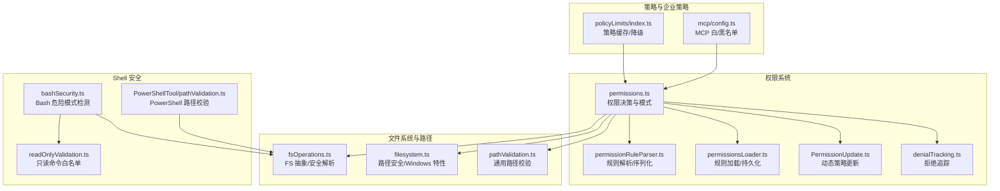
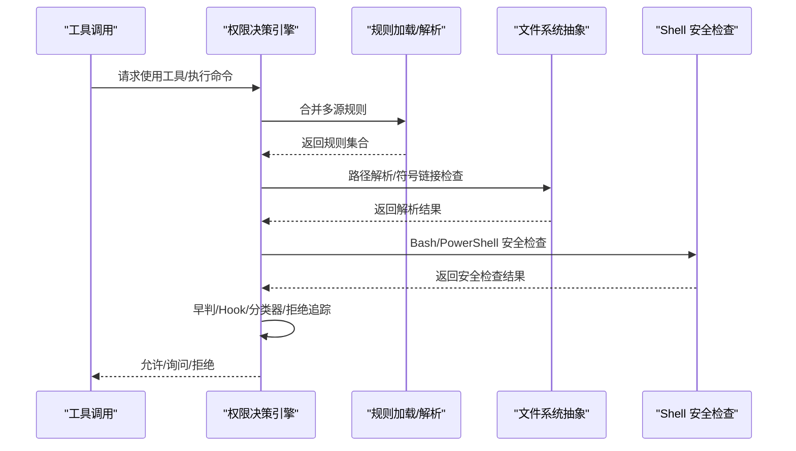
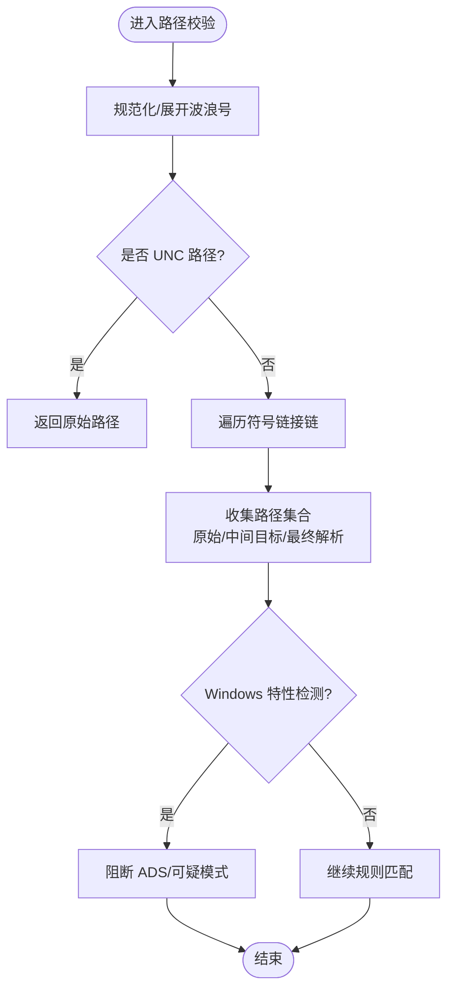
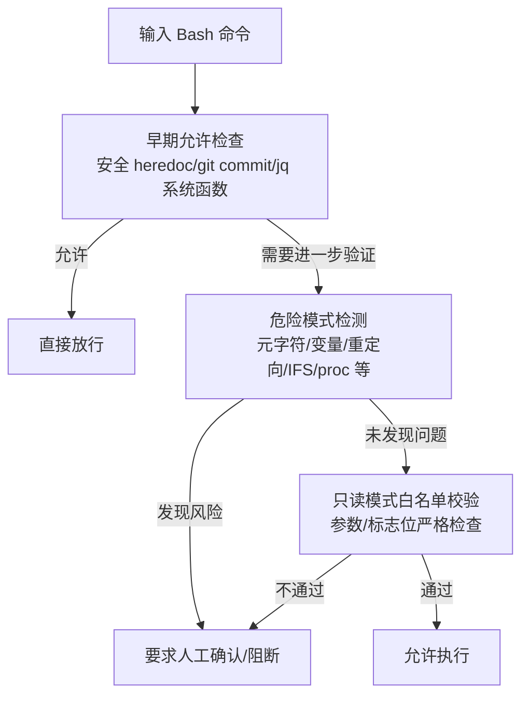
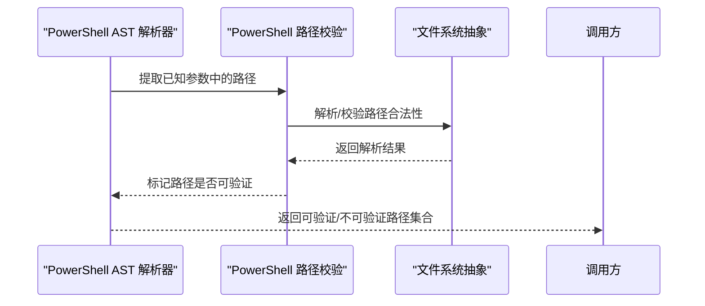
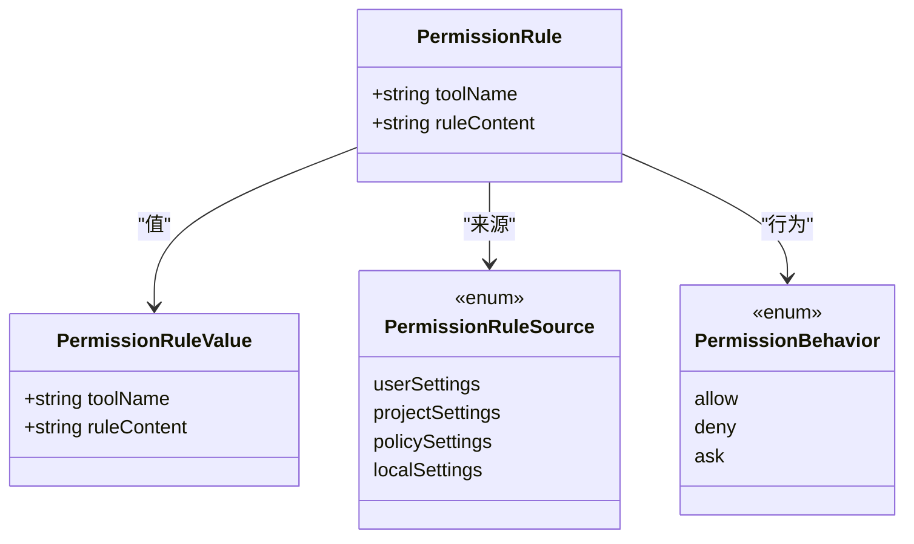
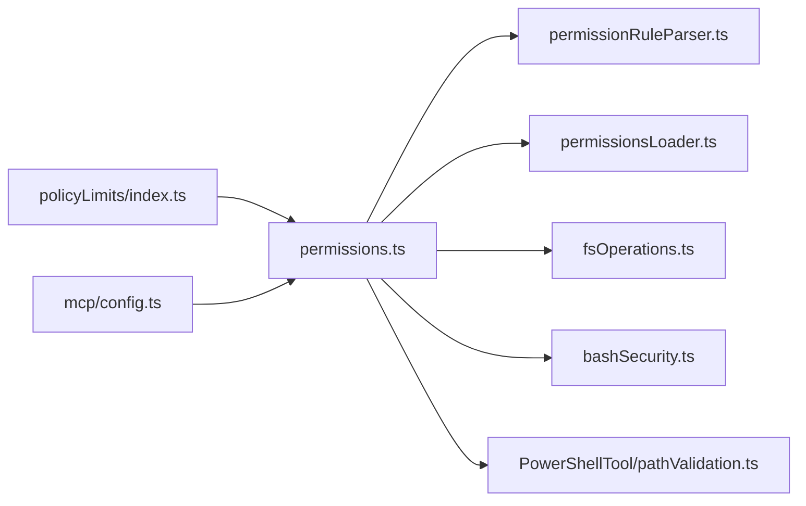

# 访问控制策略

<cite>
**本文档引用的文件**
- [src/utils/permissions/permissions.ts](file://src/utils/permissions/permissions.ts)
- [src/utils/permissions/permissionRuleParser.ts](file://src/utils/permissions/permissionRuleParser.ts)
- [src/utils/permissions/permissionsLoader.ts](file://src/utils/permissions/permissionsLoader.ts)
- [src/utils/permissions/denialTracking.ts](file://src/utils/permissions/denialTracking.ts)
- [src/utils/permissions/PermissionUpdate.ts](file://src/utils/permissions/PermissionUpdate.ts)
- [src/utils/permissions/filesystem.ts](file://src/utils/permissions/filesystem.ts)
- [src/utils/permissions/pathValidation.ts](file://src/utils/permissions/pathValidation.ts)
- [src/utils/fsOperations.ts](file://src/utils/fsOperations.ts)
- [src/tools/BashTool/bashSecurity.ts](file://src/tools/BashTool/bashSecurity.ts)
- [src/tools/BashTool/readOnlyValidation.ts](file://src/tools/BashTool/readOnlyValidation.ts)
- [src/tools/PowerShellTool/pathValidation.ts](file://src/tools/PowerShellTool/pathValidation.ts)
- [src/services/policyLimits/index.ts](file://src/services/policyLimits/index.ts)
- [src/services/mcp/config.ts](file://src/services/mcp/config.ts)
</cite>

## 目录
1. [简介](#简介)
2. [项目结构](#项目结构)
3. [核心组件](#核心组件)
4. [架构总览](#架构总览)
5. [详细组件分析](#详细组件分析)
6. [依赖关系分析](#依赖关系分析)
7. [性能考虑](#性能考虑)
8. [故障排除指南](#故障排除指南)
9. [结论](#结论)

## 简介
本文件面向 Claude Code Best 的访问控制策略，系统化阐述文件系统访问控制与 Shell 命令安全验证的实现机制。内容覆盖路径验证（规范化、相对路径处理、符号链接安全）、危险模式识别（恶意命令检测、破坏性操作防护、安全模式切换）、访问控制配置（白名单/黑名单、动态策略调整）以及性能优化与安全加固建议。目标是帮助开发者构建多层次的访问保护体系。

## 项目结构
访问控制相关代码主要分布在以下模块：
- 权限系统：规则解析、加载、更新与决策
- 文件系统抽象与路径解析：统一的 FS 接口、安全解析与符号链接处理
- Shell 安全：Bash/PowerShell 的命令语义分析、只读模式保护、危险模式检测
- 策略与企业策略：MCP 服务器白/黑名单、策略缓存与降级行为

图表来源
- [src/utils/permissions/permissions.ts:1-800](file://src/utils/permissions/permissions.ts#L1-L800)
- [src/utils/permissions/permissionRuleParser.ts:1-199](file://src/utils/permissions/permissionRuleParser.ts#L1-L199)
- [src/utils/permissions/permissionsLoader.ts:1-297](file://src/utils/permissions/permissionsLoader.ts#L1-L297)
- [src/utils/permissions/PermissionUpdate.ts:85-120](file://src/utils/permissions/PermissionUpdate.ts#L85-L120)
- [src/utils/permissions/denialTracking.ts:1-46](file://src/utils/permissions/denialTracking.ts#L1-L46)
- [src/utils/permissions/filesystem.ts:511-538](file://src/utils/permissions/filesystem.ts#L511-L538)
- [src/utils/permissions/pathValidation.ts](file://src/utils/permissions/pathValidation.ts)
- [src/utils/fsOperations.ts:1-771](file://src/utils/fsOperations.ts#L1-L771)
- [src/tools/BashTool/bashSecurity.ts:1-800](file://src/tools/BashTool/bashSecurity.ts#L1-L800)
- [src/tools/BashTool/readOnlyValidation.ts:1-800](file://src/tools/BashTool/readOnlyValidation.ts#L1-L800)
- [src/tools/PowerShellTool/pathValidation.ts:1-800](file://src/tools/PowerShellTool/pathValidation.ts#L1-L800)
- [src/services/policyLimits/index.ts:497-549](file://src/services/policyLimits/index.ts#L497-L549)
- [src/services/mcp/config.ts:336-378](file://src/services/mcp/config.ts#L336-L378)

章节来源
- [src/utils/permissions/permissions.ts:1-800](file://src/utils/permissions/permissions.ts#L1-L800)
- [src/utils/fsOperations.ts:1-771](file://src/utils/fsOperations.ts#L1-L771)

## 核心组件
- 权限决策引擎：根据规则源（用户/项目/策略等）合并规则，执行早判与分类器自动审批，并支持拒绝追踪与模式转换（如 dontAsk/auto）
- 规则解析与持久化：支持规则字符串与对象互转、兼容旧工具名、在编辑场景下容错加载
- 文件系统抽象与路径安全：统一 FS 接口、安全解析（含特殊设备/UNC 阻断）、符号链接链跟踪、深度祖先解析
- Shell 安全：Bash 多层安全检查（早期允许、元字符/变量/重定向/IFS 注入/proc 环境访问等）、PowerShell AST 参数驱动的路径提取与校验
- 企业策略与 MCP 策略：策略缓存降级（网络不可用时保守放行/阻断）、MCP 服务器白/黑名单合并策略

章节来源
- [src/utils/permissions/permissions.ts:473-800](file://src/utils/permissions/permissions.ts#L473-L800)
- [src/utils/permissions/permissionRuleParser.ts:1-199](file://src/utils/permissions/permissionRuleParser.ts#L1-L199)
- [src/utils/permissions/permissionsLoader.ts:1-297](file://src/utils/permissions/permissionsLoader.ts#L1-L297)
- [src/utils/fsOperations.ts:125-382](file://src/utils/fsOperations.ts#L125-L382)
- [src/tools/BashTool/bashSecurity.ts:1-800](file://src/tools/BashTool/bashSecurity.ts#L1-L800)
- [src/tools/PowerShellTool/pathValidation.ts:1-800](file://src/tools/PowerShellTool/pathValidation.ts#L1-L800)
- [src/services/policyLimits/index.ts:497-549](file://src/services/policyLimits/index.ts#L497-L549)
- [src/services/mcp/config.ts:336-378](file://src/services/mcp/config.ts#L336-L378)

## 架构总览
访问控制采用“规则驱动 + 多层安全检查”的分层架构：
- 规则层：多源规则合并（用户/项目/策略），支持 allow/deny/ask 三态
- 决策层：早判（工具/代理/模式）、Hook、分类器自动审批、拒绝追踪
- 安全层：路径安全（UNC/特殊设备/符号链接/Windows 特性）、Shell 危险模式检测（Bash/PowerShell）
- 策略层：策略缓存与降级、MCP 服务器白/黑名单

图表来源
- [src/utils/permissions/permissions.ts:473-800](file://src/utils/permissions/permissions.ts#L473-L800)
- [src/utils/permissions/permissionsLoader.ts:120-133](file://src/utils/permissions/permissionsLoader.ts#L120-L133)
- [src/utils/fsOperations.ts:125-382](file://src/utils/fsOperations.ts#L125-L382)
- [src/tools/BashTool/bashSecurity.ts:2308-2569](file://src/tools/BashTool/bashSecurity.ts#L2308-L2569)
- [src/tools/PowerShellTool/pathValidation.ts:1-800](file://src/tools/PowerShellTool/pathValidation.ts#L1-L800)

## 详细组件分析

### 文件系统访问控制与路径验证
- 统一 FS 抽象：通过 FsOperations 接口屏蔽底层差异，支持替换实现（测试/虚拟）
- 安全解析与符号链接：safeResolvePath 阻断 FIFO/套接字/设备，避免阻塞；符号链接链跟踪确保 deny 规则对中间目标生效；深度祖先解析用于新文件写入场景
- 路径规范化与 Windows 特性：tilde 展开、UNC/ADS 检测、Windows 路径特性识别
- 路径集合生成：getPathsForPermissionCheck 收集原始路径、中间目标与最终解析路径，确保规则匹配覆盖完整链路

图表来源
- [src/utils/fsOperations.ts:125-382](file://src/utils/fsOperations.ts#L125-L382)
- [src/utils/permissions/filesystem.ts:511-538](file://src/utils/permissions/filesystem.ts#L511-L538)

章节来源
- [src/utils/fsOperations.ts:125-382](file://src/utils/fsOperations.ts#L125-L382)
- [src/utils/permissions/filesystem.ts:511-538](file://src/utils/permissions/filesystem.ts#L511-L538)

### Shell 命令安全验证（Bash）
- 早期允许路径：安全 heredoc 替换、git commit 简单消息校验、jq 系统函数阻断
- 危险模式检测：元字符/变量/重定向/IFS 注入/proc 环境访问/反斜杠转义/花括号扩展/Unicode 空白/中词注释等
- 只读模式保护：基于 allowlist 的命令与参数白名单，严格区分 POSIX -- 行为，阻断潜在写入/网络请求
- 安全模式切换：针对特定工具（如 PowerShell）在 auto 模式下的限制与回退

图表来源
- [src/tools/BashTool/bashSecurity.ts:2308-2569](file://src/tools/BashTool/bashSecurity.ts#L2308-L2569)
- [src/tools/BashTool/readOnlyValidation.ts:1-800](file://src/tools/BashTool/readOnlyValidation.ts#L1-L800)

章节来源
- [src/tools/BashTool/bashSecurity.ts:1-800](file://src/tools/BashTool/bashSecurity.ts#L1-L800)
- [src/tools/BashTool/readOnlyValidation.ts:1-800](file://src/tools/BashTool/readOnlyValidation.ts#L1-L800)

### Shell 命令安全验证（PowerShell）
- 参数驱动的路径提取：基于 AST 解析 cmdlet 参数，仅对已知 pathParams/leafOnlyPathParams 进行路径提取
- 操作类型映射：operationType → permissionType（读/写/创建），确保写类 cmdlet 的 Edit 拒绝规则被触发
- 已知参数集：knownSwitches/knownValueParams 明确参数行为，未知参数强制 ask，避免漏检
- 特殊处理：位置参数跳过（如 Invoke-WebRequest 的 -Uri）、可选写入（无输出参数时不视为写）

图表来源
- [src/tools/PowerShellTool/pathValidation.ts:1-800](file://src/tools/PowerShellTool/pathValidation.ts#L1-L800)
- [src/utils/fsOperations.ts:125-382](file://src/utils/fsOperations.ts#L125-L382)

章节来源
- [src/tools/PowerShellTool/pathValidation.ts:1-800](file://src/tools/PowerShellTool/pathValidation.ts#L1-L800)

### 访问控制配置与动态策略调整
- 规则来源与合并：用户/项目/策略/本地等多源合并，支持 allow/deny/ask 三态
- 规则解析与序列化：支持旧工具名别名、转义/反转义括号，保证规则稳定存储与解析
- 动态策略更新：支持追加/替换规则，记录调试信息，保证策略变更可审计
- 企业策略：策略缓存不可用时的降级策略（如关键策略默认阻断），MCP 服务器白/黑名单合并策略

图表来源
- [src/utils/permissions/permissionRuleParser.ts:93-152](file://src/utils/permissions/permissionRuleParser.ts#L93-L152)
- [src/utils/permissions/permissionsLoader.ts:120-145](file://src/utils/permissions/permissionsLoader.ts#L120-L145)
- [src/utils/permissions/PermissionUpdate.ts:85-120](file://src/utils/permissions/PermissionUpdate.ts#L85-L120)

章节来源
- [src/utils/permissions/permissionRuleParser.ts:1-199](file://src/utils/permissions/permissionRuleParser.ts#L1-L199)
- [src/utils/permissions/permissionsLoader.ts:1-297](file://src/utils/permissions/permissionsLoader.ts#L1-L297)
- [src/utils/permissions/PermissionUpdate.ts:85-120](file://src/utils/permissions/PermissionUpdate.ts#L85-L120)
- [src/services/policyLimits/index.ts:497-549](file://src/services/policyLimits/index.ts#L497-L549)
- [src/services/mcp/config.ts:336-378](file://src/services/mcp/config.ts#L336-L378)

## 依赖关系分析
- 权限决策依赖规则解析与加载、文件系统抽象、Shell 安全模块
- Bash/PowerShell 安全模块依赖文件系统抽象进行路径解析
- 企业策略模块与权限系统交互，影响策略缓存与 MCP 服务器策略

图表来源
- [src/utils/permissions/permissions.ts:1-800](file://src/utils/permissions/permissions.ts#L1-L800)
- [src/utils/permissions/permissionRuleParser.ts:1-199](file://src/utils/permissions/permissionRuleParser.ts#L1-L199)
- [src/utils/permissions/permissionsLoader.ts:1-297](file://src/utils/permissions/permissionsLoader.ts#L1-L297)
- [src/utils/fsOperations.ts:1-771](file://src/utils/fsOperations.ts#L1-L771)
- [src/tools/BashTool/bashSecurity.ts:1-800](file://src/tools/BashTool/bashSecurity.ts#L1-L800)
- [src/tools/PowerShellTool/pathValidation.ts:1-800](file://src/tools/PowerShellTool/pathValidation.ts#L1-L800)
- [src/services/policyLimits/index.ts:497-549](file://src/services/policyLimits/index.ts#L497-L549)
- [src/services/mcp/config.ts:336-378](file://src/services/mcp/config.ts#L336-L378)

章节来源
- [src/utils/permissions/permissions.ts:1-800](file://src/utils/permissions/permissions.ts#L1-L800)
- [src/utils/fsOperations.ts:1-771](file://src/utils/fsOperations.ts#L1-L771)

## 性能考虑
- 文件系统操作延迟：safeResolvePath 使用 realpathSync，可能因深层链路或挂载点导致耗时；建议在批量路径检查时复用解析结果
- Bash 安全检查复杂度：正则/AST/树分析组合带来开销；可通过早期允许路径减少后续检查成本
- 规则合并与解析：多源规则合并与解析应避免重复计算，建议缓存解析后的规则集合
- 分类器调用：auto 模式下优先走 acceptEdits 快路径与安全工具白名单，减少昂贵 API 调用

## 故障排除指南
- UNC 路径阻断：Windows UNC 路径在解析前即被阻断，避免网络请求与凭据泄露
- 符号链接绕过：通过链式跟踪与最终解析路径双重校验，确保 deny 规则覆盖所有层级
- Bash 误报/漏报：利用早期允许路径（安全 heredoc、git commit 简单消息）与严格白名单，结合分类器与拒绝追踪阈值
- 策略缓存异常：策略缓存不可用时按保守策略放行/阻断，关注关键策略的降级行为
- MCP 服务器策略：denylist 总是合并，allowlist 受策略开关控制，检查 denylist 设置与 allowlist 策略开关

章节来源
- [src/utils/fsOperations.ts:125-382](file://src/utils/fsOperations.ts#L125-L382)
- [src/tools/BashTool/bashSecurity.ts:1017-1044](file://src/tools/BashTool/bashSecurity.ts#L1017-L1044)
- [src/services/policyLimits/index.ts:497-549](file://src/services/policyLimits/index.ts#L497-L549)
- [src/services/mcp/config.ts:336-378](file://src/services/mcp/config.ts#L336-L378)

## 结论
本访问控制体系以规则驱动为核心，结合文件系统安全解析与 Shell 危险模式检测，形成从路径到命令的多层防护。通过动态策略更新、拒绝追踪与企业策略降级，既保障安全性又兼顾可用性。建议在实际部署中：
- 明确白/黑名单边界，定期审计规则来源与变更
- 在高并发场景下优化路径解析与规则合并流程
- 对关键策略启用更严格的降级阻断，确保网络异常时系统安全
- 持续完善 Shell 安全检查与只读命令白名单，降低误报与漏报风险