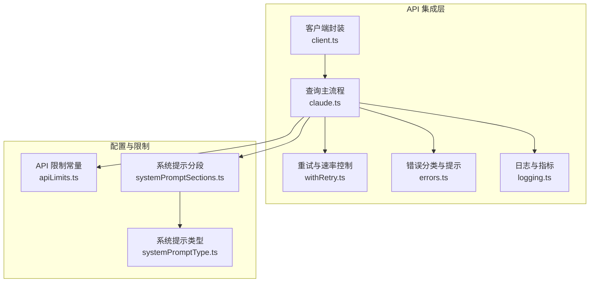
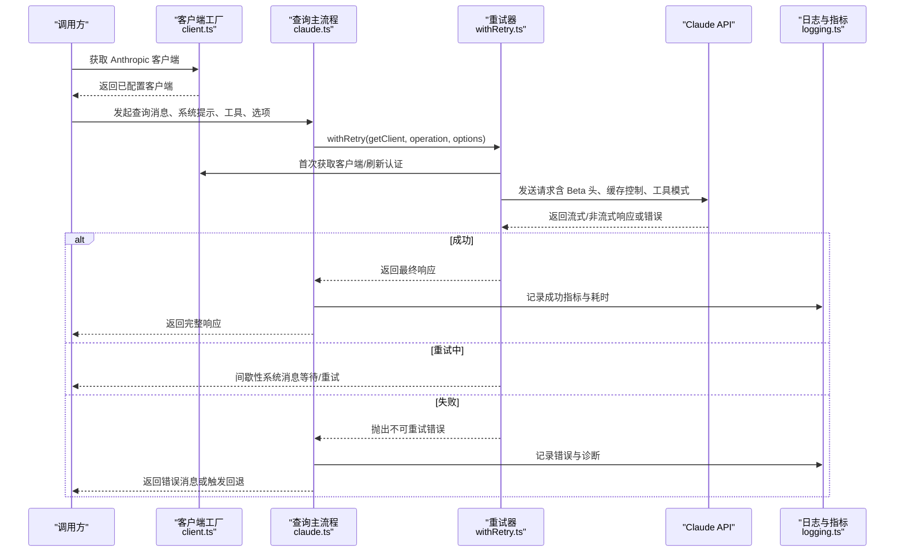
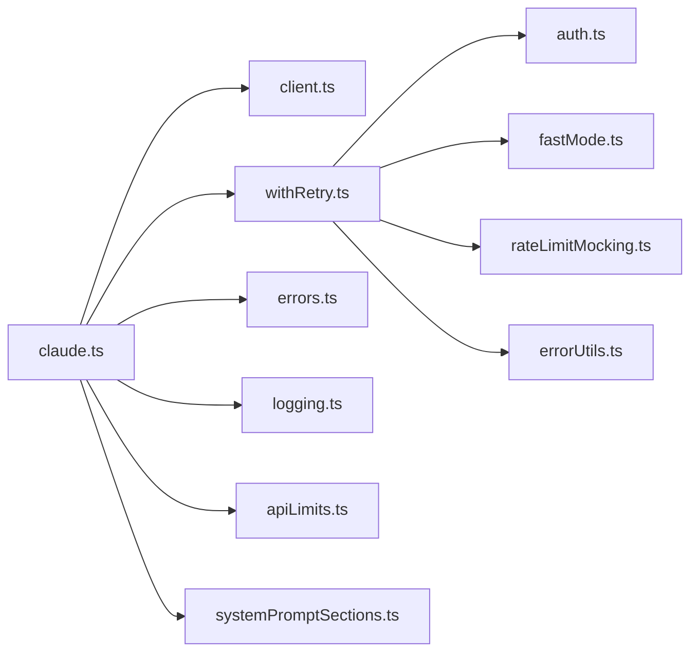

# API 集成策略

<cite>
**本文引用的文件**
- [src/services/api/client.ts](file://src/services/api/client.ts)
- [src/services/api/claude.ts](file://src/services/api/claude.ts)
- [src/services/api/withRetry.ts](file://src/services/api/withRetry.ts)
- [src/services/api/errors.ts](file://src/services/api/errors.ts)
- [src/services/api/logging.ts](file://src/services/api/logging.ts)
- [src/constants/apiLimits.ts](file://src/constants/apiLimits.ts)
- [src/constants/systemPromptSections.ts](file://src/constants/systemPromptSections.ts)
- [src/utils/systemPromptType.ts](file://src/utils/systemPromptType.ts)
</cite>

## 目录
1. [引言](#引言)
2. [项目结构](#项目结构)
3. [核心组件](#核心组件)
4. [架构总览](#架构总览)
5. [详细组件分析](#详细组件分析)
6. [依赖关系分析](#依赖关系分析)
7. [性能考量](#性能考量)
8. [故障排查指南](#故障排查指南)
9. [结论](#结论)
10. [附录](#附录)

## 引言
本技术文档聚焦于 Claude API 的集成策略与实现细节，覆盖以下主题：
- API 调用封装：客户端初始化、认证、头部与代理配置、多提供商适配（第一方、Bedrock、Vertex、Foundry）。
- 响应处理与错误恢复：流式与非流式响应、错误分类与消息生成、重试与降级策略。
- 系统提示构建：工具注入、上下文构建、权限模式与动态 Beta 头部集成。
- 流式响应处理：增量解析、聚合与校验、内存资源释放。
- API 限制与速率控制：媒体数量限制、请求大小限制、重试退避与持久重试。
- 模型选择与参数：Effort、任务预算、思考模式、输出格式与缓存策略。
- 使用场景示例：基础调用、流式处理、错误处理。

## 项目结构
围绕 API 集成的关键模块如下：
- 客户端封装与多提供商适配：src/services/api/client.ts
- 查询主流程与系统提示构建：src/services/api/claude.ts
- 重试与速率控制：src/services/api/withRetry.ts
- 错误分类与用户提示：src/services/api/errors.ts
- 日志与指标：src/services/api/logging.ts
- API 限制常量：src/constants/apiLimits.ts
- 系统提示分段与缓存：src/constants/systemPromptSections.ts、src/utils/systemPromptType.ts

图表来源
- [src/services/api/client.ts:88-316](file://src/services/api/client.ts#L88-L316)
- [src/services/api/claude.ts:1031-1599](file://src/services/api/claude.ts#L1031-L1599)
- [src/services/api/withRetry.ts:170-517](file://src/services/api/withRetry.ts#L170-L517)
- [src/services/api/errors.ts:425-800](file://src/services/api/errors.ts#L425-L800)
- [src/services/api/logging.ts:171-796](file://src/services/api/logging.ts#L171-L796)
- [src/constants/apiLimits.ts:1-95](file://src/constants/apiLimits.ts#L1-L95)
- [src/constants/systemPromptSections.ts:43-68](file://src/constants/systemPromptSections.ts#L43-L68)
- [src/utils/systemPromptType.ts:8-15](file://src/utils/systemPromptType.ts#L8-L15)

章节来源
- [src/services/api/client.ts:1-390](file://src/services/api/client.ts#L1-L390)
- [src/services/api/claude.ts:1-1599](file://src/services/api/claude.ts#L1-L1599)
- [src/services/api/withRetry.ts:1-823](file://src/services/api/withRetry.ts#L1-L823)
- [src/services/api/errors.ts:1-1208](file://src/services/api/errors.ts#L1-L1208)
- [src/services/api/logging.ts:1-797](file://src/services/api/logging.ts#L1-L797)
- [src/constants/apiLimits.ts:1-95](file://src/constants/apiLimits.ts#L1-L95)
- [src/constants/systemPromptSections.ts:1-69](file://src/constants/systemPromptSections.ts#L1-L69)
- [src/utils/systemPromptType.ts:1-15](file://src/utils/systemPromptType.ts#L1-L15)

## 核心组件
- 客户端工厂与多提供商适配：按环境变量自动选择第一方、Bedrock、Vertex 或 Foundry，并注入认证头、自定义头、超时与代理选项；支持调试日志与额外保护头。
- 查询主流程：消息归一化、工具与系统提示构建、媒体项裁剪、动态 Beta 头部与缓存策略、流式/非流式执行、失败回退到非流式请求。
- 重试与速率控制：指数退避、抖动、持久重试、529/429 分流、容量过载与快速模式降级、上下文溢出自适应 max_tokens 调整。
- 错误分类与提示：针对不同错误类型（超长提示、媒体过大、无效模型、429/529、并发工具调用等）生成用户可读提示或静默回退。
- 日志与指标：请求/响应统计、耗时、成本、网关识别、链路追踪、遥测事件。

章节来源
- [src/services/api/client.ts:88-316](file://src/services/api/client.ts#L88-L316)
- [src/services/api/claude.ts:1031-1599](file://src/services/api/claude.ts#L1031-L1599)
- [src/services/api/withRetry.ts:170-517](file://src/services/api/withRetry.ts#L170-L517)
- [src/services/api/errors.ts:425-800](file://src/services/api/errors.ts#L425-L800)
- [src/services/api/logging.ts:171-796](file://src/services/api/logging.ts#L171-L796)

## 架构总览
下图展示了从调用入口到响应产出的端到端流程，包括重试、回退与错误处理路径。

图表来源
- [src/services/api/client.ts:88-316](file://src/services/api/client.ts#L88-L316)
- [src/services/api/claude.ts:1031-1599](file://src/services/api/claude.ts#L1031-L1599)
- [src/services/api/withRetry.ts:170-517](file://src/services/api/withRetry.ts#L170-L517)
- [src/services/api/logging.ts:581-796](file://src/services/api/logging.ts#L581-L796)

## 详细组件分析

### 客户端封装与多提供商适配
- 认证与头信息
  - OAuth 刷新与订阅者令牌管理。
  - 自定义头（ANTHROPIC_CUSTOM_HEADERS）与附加保护头（x-anthropic-additional-protection）。
  - 用户代理、会话标识、容器/远程会话标识等标准头注入。
- 提供商选择
  - 第一方：直接 @anthropic-ai/sdk。
  - Bedrock：@anthropic-ai/bedrock-sdk，支持区域覆盖与 Bearer Token。
  - Vertex：@anthropic-ai/vertex-sdk，GoogleAuth 凭据刷新与项目 ID 回退。
  - Foundry：@anthropic-ai/foundry-sdk，Azure AD 令牌提供者或 API Key。
- 代理与超时
  - fetch 重写以注入客户端请求 ID 并记录调试日志。
  - 统一超时（API_TIMEOUT_MS），代理选项透传。

章节来源
- [src/services/api/client.ts:88-316](file://src/services/api/client.ts#L88-L316)
- [src/services/api/client.ts:358-390](file://src/services/api/client.ts#L358-L390)

### 查询主流程与系统提示构建
- 工具与系统提示
  - 动态工具模式：根据模型能力与延迟加载策略决定是否启用工具搜索与延迟加载。
  - 系统提示分段：支持带缓存与易变分段，按需缓存或每次重建。
  - 权限与 Beta 头：自动维护 Beta 头部的“锁存”机制，避免中途切换导致缓存键变化。
- 消息与媒体
  - 归一化消息，修复 tool_use/tool_result 匹配问题。
  - 媒体项裁剪：当超过每请求上限（默认 100）时，从最早消息开始剔除，避免 API 混淆错误。
- 输出与缓存
  - prompt_caching 控制与 TTL（1 小时）策略，支持全局缓存范围与实验开关。
  - 任务预算（task_budget）与 Effort 参数注入。
- 执行模式
  - 流式与非流式双路径；非流式作为 529/超时等异常的回退手段。

章节来源
- [src/services/api/claude.ts:1031-1599](file://src/services/api/claude.ts#L1031-L1599)
- [src/constants/systemPromptSections.ts:43-68](file://src/constants/systemPromptSections.ts#L43-L68)
- [src/utils/systemPromptType.ts:8-15](file://src/utils/systemPromptType.ts#L8-L15)
- [src/constants/apiLimits.ts:94-95](file://src/constants/apiLimits.ts#L94-L95)

### 重试与速率控制
- 重试条件
  - 408/409/429/529、5xx、连接错误、特定认证错误（401/403）、最大令牌上下文溢出。
  - x-should-retry 头与企业订阅豁免。
- 退避与抖动
  - 基础 500ms，指数增长至最大阈值，加入 25% 抖动。
- 持久重试
  - 在未attended 场景下，对 429/529 进行长时间等待与心跳（系统消息）。
- 快速模式降级
  - 面对短/长 retry-after，分别维持缓存与进入冷却（标准速度），防止缓存抖动。
- 上下文溢出自适应
  - 解析“输入长度+max_tokens 超过上下文限制”错误，计算可用输出空间并调整 max_tokens。

章节来源
- [src/services/api/withRetry.ts:170-517](file://src/services/api/withRetry.ts#L170-L517)
- [src/services/api/withRetry.ts:530-595](file://src/services/api/withRetry.ts#L530-L595)

### 错误分类与用户提示
- 错误类型
  - 提示过长、PDF/图片过大、请求过大、无效模型名、并发工具调用、信用不足、组织禁用、OAuth 令牌撤销等。
- 用户提示
  - 针对不同错误生成可读消息，部分场景返回静默占位以便后续处理（如 529 的回退）。
- 诊断与追踪
  - 记录原始错误详情、网关指纹、客户端请求 ID，便于服务端定位。

章节来源
- [src/services/api/errors.ts:425-800](file://src/services/api/errors.ts#L425-L800)
- [src/services/api/logging.ts:235-396](file://src/services/api/logging.ts#L235-L396)

### 流式响应处理
- 增量解析与聚合
  - 通过流式迭代器逐块消费事件，聚合文本、思考与工具调用内容。
- 资源释放
  - 明确取消底层 Response 与流句柄，防止原生内存泄漏。
- 验证与回退
  - 对非流式回退设置超时与计数，记录失败事件用于可观测性。

章节来源
- [src/services/api/claude.ts:1551-1568](file://src/services/api/claude.ts#L1551-L1568)
- [src/services/api/claude.ts:827-931](file://src/services/api/claude.ts#L827-L931)

### 模型选择与参数配置
- 模型解析与标准化：统一模型字符串，Bedrock 推断配置映射。
- 参数注入
  - Effort（字符串或数值）、任务预算（task_budget）、思考模式、输出格式（JSON）、快速模式。
- 缓存策略
  - prompt_caching 开关、TTL（1 小时）与全局缓存范围（基于工具或系统提示）。

章节来源
- [src/services/api/claude.ts:427-488](file://src/services/api/claude.ts#L427-L488)
- [src/services/api/claude.ts:1580-1599](file://src/services/api/claude.ts#L1580-L1599)

## 依赖关系分析
- 组件耦合
  - claude.ts 依赖 client.ts（客户端）、withRetry.ts（重试）、errors.ts（错误）、logging.ts（日志）、apiLimits.ts（限制）、systemPromptSections.ts（系统提示）。
  - withRetry.ts 依赖 auth.ts（认证刷新）、fastMode.ts（快速模式状态）、rateLimitMocking.ts（模拟限流）、errorUtils.ts（错误细节提取）。
- 外部依赖
  - @anthropic-ai/sdk 及其提供商 SDK（bedrock、vertex、foundry）。
  - google-auth-library、@azure/identity 等云认证库。

图表来源
- [src/services/api/claude.ts:1-1599](file://src/services/api/claude.ts#L1-L1599)
- [src/services/api/withRetry.ts:1-823](file://src/services/api/withRetry.ts#L1-L823)

章节来源
- [src/services/api/claude.ts:1-1599](file://src/services/api/claude.ts#L1-L1599)
- [src/services/api/withRetry.ts:1-823](file://src/services/api/withRetry.ts#L1-L823)

## 性能考量
- 重试退避与抖动：降低热点竞争与放大效应。
- 快速模式降级：在容量压力下切换标准速度，避免缓存抖动。
- 非流式回退：在超时/529 下快速失败并记录，减少挂起时间。
- 媒体裁剪：提前剔除旧媒体，避免 API 拒绝与昂贵的重试。
- 资源释放：显式取消流与响应对象，降低内存占用。

## 故障排查指南
- 常见错误与处理
  - 429/529：检查 x-should-retry 与持久重试策略；必要时启用回退模型。
  - 提示过长：利用 getPromptTooLongTokenGap 计算缺口，批量压缩。
  - 媒体过大/过多：使用 stripExcessMediaItems 与图像尺寸/页数限制。
  - 工具并发错误：确保 tool_use 与 tool_result 成对且 ID 唯一。
- 诊断技巧
  - 查看日志中的 clientRequestId，结合服务端日志定位。
  - 启用调试日志观察请求头与 fetch 注入行为。
  - 使用 /mock-limits（Ant 内部）验证限流路径。

章节来源
- [src/services/api/errors.ts:425-800](file://src/services/api/errors.ts#L425-L800)
- [src/services/api/logging.ts:274-396](file://src/services/api/logging.ts#L274-L396)
- [src/services/api/withRetry.ts:170-517](file://src/services/api/withRetry.ts#L170-L517)

## 结论
该集成策略通过“统一客户端封装 + 查询主流程 + 重试与速率控制 + 错误分类与日志”的分层设计，实现了对 Claude API 的高鲁棒性与可观测性。系统提示构建与工具注入的动态化、媒体项裁剪与缓存策略的精细化，进一步提升了用户体验与稳定性。建议在生产环境中配合监控与告警，持续优化重试参数与缓存策略。

## 附录

### 使用场景示例（代码片段路径）
- 基本调用（非流式）
  - [src/services/api/claude.ts:723-764](file://src/services/api/claude.ts#L723-L764)
- 流式处理
  - [src/services/api/claude.ts:766-794](file://src/services/api/claude.ts#L766-L794)
- 错误处理（APIUserAbortError、系统消息重试）
  - [src/services/api/claude.ts:756-763](file://src/services/api/claude.ts#L756-L763)
  - [src/services/api/withRetry.ts:490-512](file://src/services/api/withRetry.ts#L490-L512)
- 重试与回退（非流式）
  - [src/services/api/claude.ts:832-931](file://src/services/api/claude.ts#L832-L931)
  - [src/services/api/withRetry.ts:170-517](file://src/services/api/withRetry.ts#L170-L517)
- 系统提示构建（工具注入、缓存控制）
  - [src/services/api/claude.ts:1249-1438](file://src/services/api/claude.ts#L1249-L1438)
  - [src/constants/systemPromptSections.ts:43-68](file://src/constants/systemPromptSections.ts#L43-L68)
- API 限制与媒体裁剪
  - [src/constants/apiLimits.ts:94-95](file://src/constants/apiLimits.ts#L94-L95)
  - [src/services/api/claude.ts:1322-1329](file://src/services/api/claude.ts#L1322-L1329)